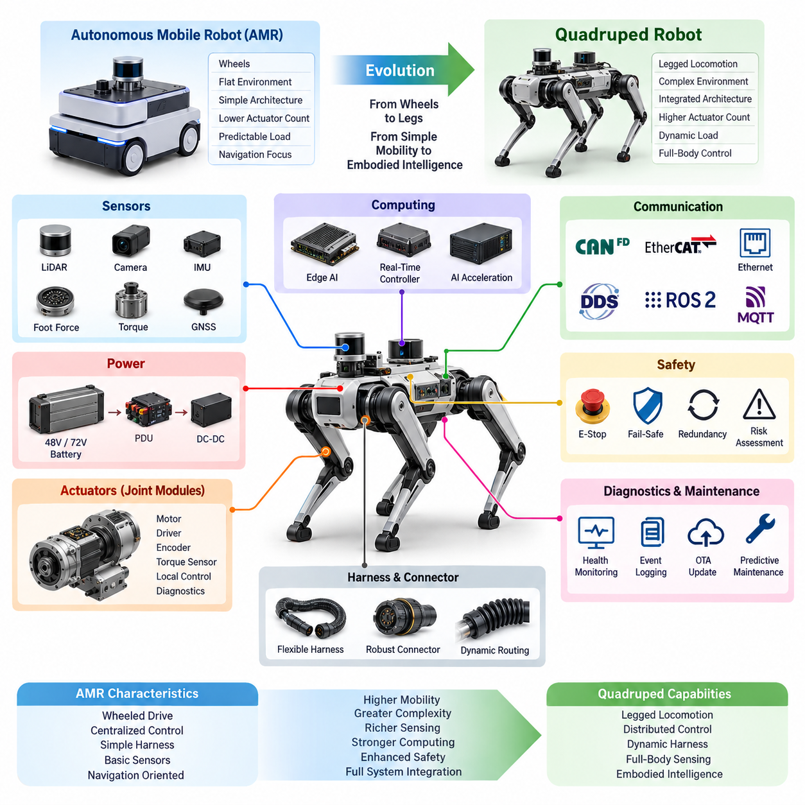
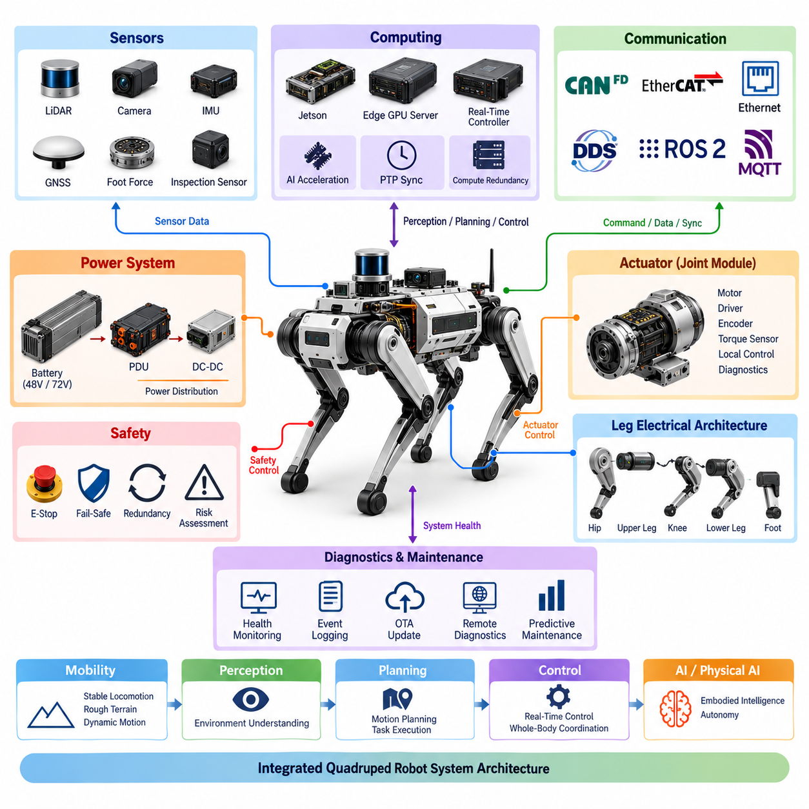
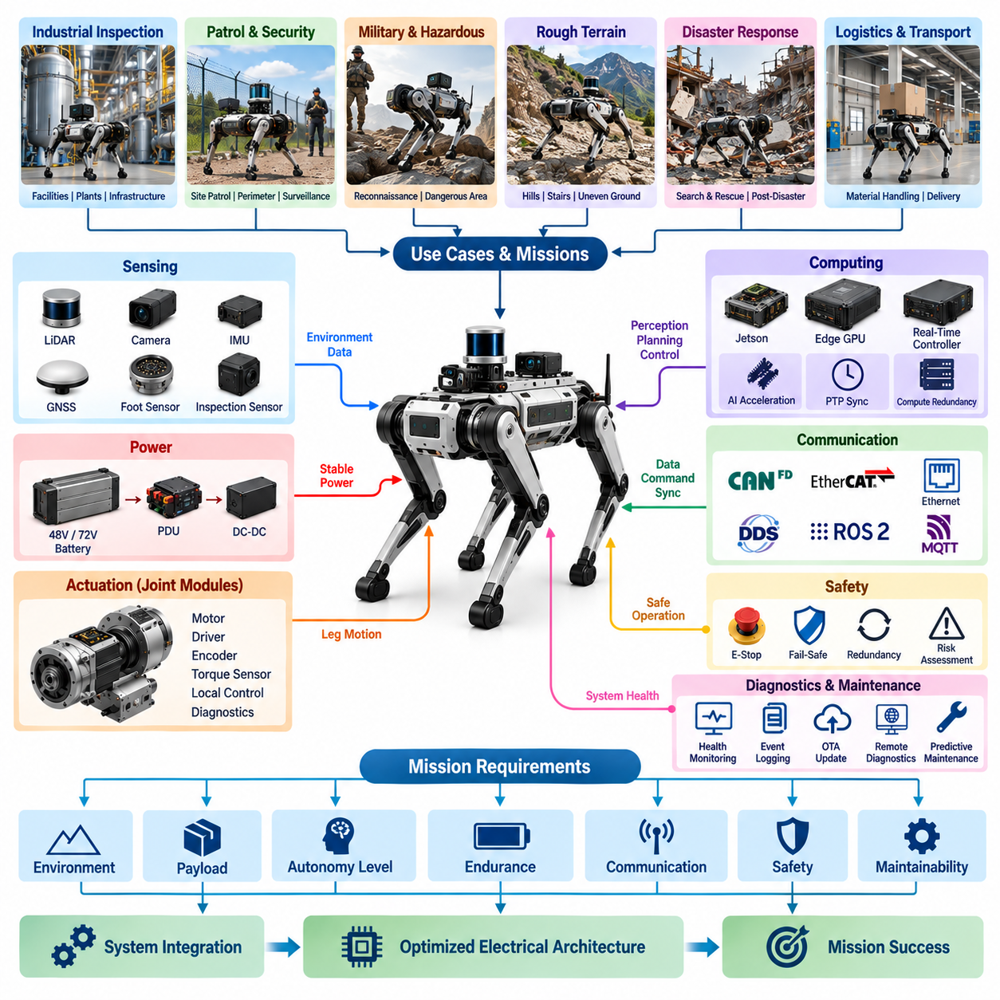
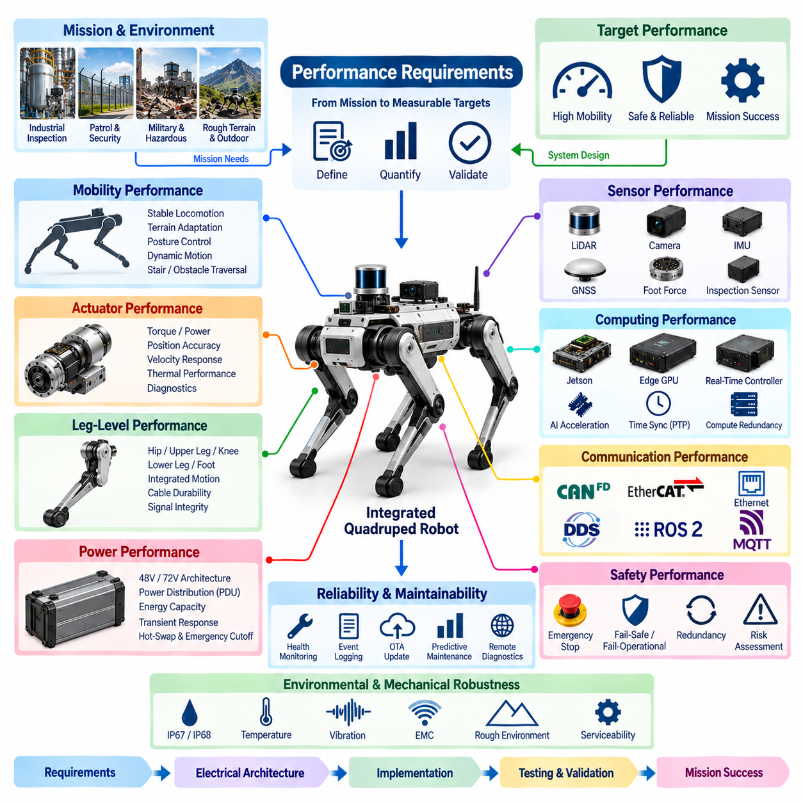
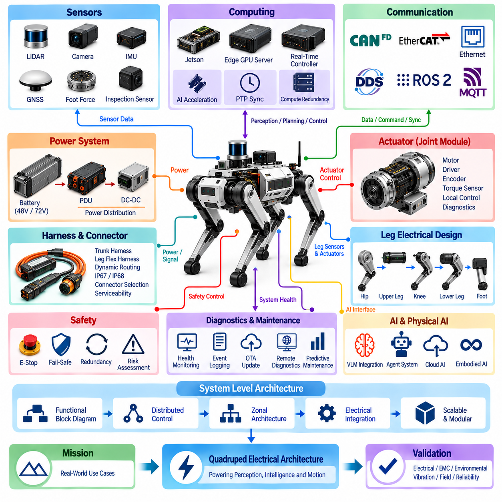

**Volume 20. Quadruped Electrical Architecture**


# Chapter 01. Introduction to Quadruped Electrical Systems

##  

## 01.01. Evolution From AMR to Quadruped

{width="7.268055555555556in" height="7.268055555555556in"}

The evolution from an Autonomous Mobile Robot (AMR) to a quadruped robot represents a fundamental transition in both mechanical mobility and electrical system architecture. Conventional AMRs are primarily designed for relatively flat and structured environments, where wheels provide efficient and predictable motion. Their electrical architecture can therefore focus on traction motors, battery power, navigation sensors, and a centralized control system. Quadruped robots must instead coordinate multiple articulated legs, distributed actuators, high-speed feedback, and dynamic body motion, requiring a substantially more integrated electrical architecture.

An AMR generally separates mobility from the body structure through a small number of drive wheels and steering mechanisms. This simplifies power distribution, motor control, wiring, and sensing because the major electrical components remain relatively fixed within the chassis. In a quadruped, however, each leg becomes an active electromechanical subsystem. Hip, upper-leg, knee, lower-leg, and foot mechanisms require multiple actuators and feedback devices, while their cables must tolerate continuous movement. The transition therefore changes electrical design from a mostly static vehicle architecture into a highly dynamic distributed system.

The most important architectural change is the increase in actuator count and control bandwidth. A wheeled AMR can often control its motion using a limited number of traction motors, while a quadruped must continuously regulate multiple joints to maintain posture, balance, and locomotion. Each actuator may require motor power, position feedback, torque information, local control, diagnostics, and communication. This creates a distributed control architecture in which joint modules and leg-level subsystems interact with higher-level controllers rather than relying entirely on one centralized actuator-control structure.

Power architecture also becomes more demanding as the platform evolves toward quadruped mobility. AMRs can often use a relatively straightforward battery and power distribution system because their peak mechanical loads are comparatively predictable. Quadrupeds experience rapidly changing loads during standing, walking, climbing, jumping, and recovery from disturbances. Their power architecture therefore needs to support high transient currents, efficient voltage conversion, protected distribution, and appropriate battery integration. Architectures based on 48 V or 72 V can provide a practical foundation for distributing power while reducing current for a given power level.

The harness architecture changes together with the mechanical architecture. In an AMR, most harnesses can be routed through protected and relatively stationary chassis regions. Quadruped harnesses must pass through joints and moving leg structures, where repeated bending, twisting, vibration, and mechanical contact can create long-term reliability risks. The electrical design therefore requires trunk harnesses, flexible leg harnesses, dynamic cable routing, suitable connectors, environmental protection, and serviceability. IP67 or IP68-level protection may also become important when the robot operates outdoors or in demanding industrial environments.

Sensor architecture also expands from basic navigation toward full-body state estimation. An AMR can primarily depend on LiDAR, cameras, wheel odometry, IMU, and GNSS when appropriate. A quadruped requires these environmental sensors while also monitoring the internal physical state of the robot. Joint encoders, torque sensors, foot force sensing, and IMU measurements become essential for understanding body motion and ground interaction. These measurements must be synchronized and processed with sufficient temporal consistency to support stable locomotion, making sensor architecture closely connected with computing and communication architecture.

Computing architecture consequently evolves from navigation-oriented processing toward real-time embodied control. An AMR may use an embedded computer for perception, localization, planning, and fleet communication while dedicated motor controllers handle traction. A quadruped requires a real-time control layer capable of coordinating many actuators while a higher-level compute platform performs perception, locomotion planning, and AI inference. Jetson-class edge computing, real-time controllers, AI acceleration, PTP-based time synchronization, and appropriate compute redundancy can therefore become important elements of the overall architecture.

Communication requirements increase in parallel with system complexity. A relatively simple AMR may rely heavily on CAN or CAN FD for vehicle-level control and Ethernet for high-bandwidth perception and external connectivity. A quadruped can require CAN FD or EtherCAT for distributed actuator communication, Gigabit Ethernet for sensors and computing, and DDS/ROS 2 for higher-level robotic software integration. Time synchronization becomes particularly important because actuator commands, encoder feedback, IMU measurements, foot forces, and perception data must be interpreted within a consistent temporal framework.

Safety architecture must also evolve because the consequences of control failure become more significant when the robot dynamically balances itself. An AMR can generally stop by removing traction power, although safety requirements depend on its operating environment and application. A quadruped may need controlled transitions between motion, stable standing, emergency stopping, and fault recovery. Emergency-stop mechanisms, fail-safe and fail-operational strategies, redundancy, risk assessment, and field safety validation therefore become integral parts of the electrical architecture rather than isolated safety functions.

The evolution toward quadrupeds also changes the role of diagnostics and maintenance. With a small number of relatively simple drive components, AMR diagnostics can focus on battery status, motor faults, communication errors, sensor failures, and system-level health. A quadruped has many more potential failure points distributed across actuators, encoders, torque sensors, communication links, power supplies, and flexible harnesses. Continuous health monitoring, event logging, remote diagnostics, CAN-based diagnostics, OTA updates, and predictive maintenance can therefore become necessary to manage system complexity and maintain operational availability.

At the highest level, the transition from AMR to quadruped is not simply a change from wheels to legs. It is an architectural transition from a comparatively static mobile platform to a distributed electromechanical system in which power, actuation, sensing, computation, communication, safety, and AI must operate as one coordinated system. The later architecture therefore naturally progresses from system-level design through power and actuator modules, leg electrical design, harnesses and sensors, computing and communication, safety, diagnostics, and finally AI and Physical AI integration. This progression provides the foundation for developing quadruped platforms capable of reliable operation in increasingly complex environments.

자율이동로봇(Autonomous Mobile Robot, AMR)에서 사족보행 로봇(Quadruped Robot)으로의 진화는 기계적 이동 방식뿐만 아니라 전기 시스템 아키텍처(Electrical System Architecture)에서도 근본적인 전환을 의미한다. 기존 AMR은 주로 평탄하고 구조화된 환경에서 운용되도록 설계되며, 바퀴를 이용하여 효율적이고 예측 가능한 이동을 수행한다. 따라서 전기 아키텍처는 구동 모터, 배터리 전원, 내비게이션 센서, 중앙 제어 시스템에 집중할 수 있다. 반면 사족보행 로봇은 여러 개의 관절형 다리, 분산 액추에이터, 고속 피드백, 동적 차체 움직임을 동시에 제어해야 하므로 훨씬 더 통합된 전기 아키텍처가 필요하다.

AMR은 일반적으로 소수의 구동 휠과 조향 메커니즘을 통해 차체와 이동 시스템을 연결한다. 이러한 구조에서는 주요 전기 부품이 상대적으로 고정된 차체 내부에 위치하기 때문에 전원 분배, 모터 제어, 배선, 센싱을 비교적 단순하게 구성할 수 있다. 그러나 사족보행 로봇에서는 각각의 다리가 하나의 능동형 전기기계 서브시스템이 된다. 엉덩이 관절, 상부 다리, 무릎 관절, 하부 다리, 발 구조에는 여러 액추에이터와 피드백 장치가 필요하며, 케이블은 지속적인 움직임을 견뎌야 한다. 따라서 전기 설계는 정적인 차량 아키텍처에서 매우 동적인 분산 시스템으로 전환된다.

가장 중요한 아키텍처 변화는 액추에이터 수와 제어 대역폭의 증가이다. 바퀴형 AMR은 비교적 적은 수의 구동 모터를 사용하여 이동을 제어할 수 있지만, 사족보행 로봇은 자세, 균형, 보행을 유지하기 위해 여러 관절을 지속적으로 제어해야 한다. 각각의 액추에이터에는 모터 전원, 위치 피드백, 토크 정보, 로컬 제어, 진단, 통신 기능이 필요할 수 있다. 이에 따라 관절 모듈과 다리 수준의 서브시스템이 상위 제어기와 상호작용하는 분산 제어 아키텍처(Distributed Control Architecture)가 필요하며, 모든 액추에이터 제어를 하나의 중앙 제어 구조에만 의존하기는 어려워진다.

전원 아키텍처(Power Architecture) 역시 플랫폼이 사족보행 방식으로 발전하면서 더욱 높은 요구사항을 갖게 된다. AMR은 피크 기계 부하가 비교적 예측 가능하기 때문에 상대적으로 단순한 배터리 및 전원 분배 시스템을 사용할 수 있다. 반면 사족보행 로봇은 서기, 걷기, 등반, 점프, 외란으로부터의 회복과 같은 동작에서 매우 빠르게 변화하는 부하를 경험한다. 따라서 전원 아키텍처는 높은 순간 전류, 효율적인 전압 변환, 보호된 전원 분배, 적절한 배터리 통합을 지원해야 한다. 48 V 또는 72 V 기반의 아키텍처는 동일한 전력에서 필요한 전류를 낮추면서 전원을 분배할 수 있는 실용적인 기반이 될 수 있다.

하네스 아키텍처(Harness Architecture) 역시 기계적 아키텍처의 변화와 함께 달라진다. AMR에서는 대부분의 하네스를 보호된 차체 내부나 상대적으로 움직임이 적은 영역에 배치할 수 있다. 반면 사족보행 로봇의 하네스는 관절과 움직이는 다리 구조를 통과해야 하므로 반복적인 굽힘, 비틀림, 진동, 기계적 접촉에 장기간 노출될 수 있다. 따라서 트렁크 하네스(Trunk Harness), 유연 다리 하네스(Flexible Leg Harness), 동적 케이블 라우팅(Dynamic Cable Routing), 적절한 커넥터, 환경 보호, 정비성을 고려한 설계가 필요하다. 로봇이 실외 또는 가혹한 산업 환경에서 운용되는 경우에는 IP67 또는 IP68 수준의 보호도 중요해질 수 있다.

센서 아키텍처(Sensor Architecture) 역시 기본적인 내비게이션에서 전신 상태 추정(Full-Body State Estimation)으로 확장된다. AMR은 주로 LiDAR, 카메라, 휠 오도메트리(Wheel Odometry), IMU, 필요한 경우 GNSS에 의존할 수 있다. 사족보행 로봇은 이러한 환경 센서와 함께 로봇 내부의 물리적 상태도 감지해야 한다. 관절 엔코더(Joint Encoder), 토크 센서(Torque Sensor), 발 힘 센싱(Foot Force Sensing), IMU 측정값은 로봇의 움직임과 지면과의 상호작용을 파악하는 데 중요하다. 이러한 데이터는 안정적인 보행을 지원하기에 충분한 시간적 일관성을 갖도록 동기화되고 처리되어야 하므로 센서 아키텍처는 컴퓨팅 및 통신 아키텍처와 밀접하게 연결된다.

컴퓨팅 아키텍처(Computing Architecture)는 결과적으로 내비게이션 중심의 처리에서 실시간 체화 제어(Real-Time Embodied Control) 중심으로 발전한다. AMR은 인지, 위치 추정, 경로 계획, 플릿 통신을 수행하는 임베디드 컴퓨터를 사용하고, 전용 모터 컨트롤러가 구동을 담당하는 구조를 사용할 수 있다. 사족보행 로봇은 여러 액추에이터를 동시에 조정할 수 있는 실시간 제어 계층과 함께, 환경 인식, 보행 계획, AI 추론을 수행하는 상위 수준의 컴퓨팅 플랫폼이 필요하다. 따라서 Jetson 계열 엣지 컴퓨팅(Edge Computing), 실시간 제어기(Real-Time Controller), AI 가속(AI Acceleration), PTP 기반 시간 동기화(PTP-Based Time Synchronization), 적절한 컴퓨팅 이중화(Compute Redundancy)가 전체 아키텍처의 중요한 요소가 될 수 있다.

통신 요구사항 역시 시스템 복잡성이 증가함에 따라 높아진다. 비교적 단순한 AMR은 차량 수준 제어를 위해 CAN 또는 CAN FD를 사용하고, 고대역폭 센싱과 외부 연결을 위해 Ethernet을 사용하는 구조를 많이 적용할 수 있다. 사족보행 로봇은 분산 액추에이터 통신을 위해 CAN FD 또는 EtherCAT, 센서와 컴퓨팅 시스템을 위해 Gigabit Ethernet, 상위 로봇 소프트웨어 통합을 위해 DDS/ROS 2를 사용할 수 있다. 특히 시간 동기화(Time Synchronization)는 중요하다. 액추에이터 명령, 엔코더 피드백, IMU 측정값, 발 힘 데이터, 인지 데이터가 일관된 시간 기준 안에서 해석되어야 하기 때문이다.

안전 아키텍처(Safety Architecture) 역시 로봇이 스스로 동적으로 균형을 유지해야 하기 때문에 발전해야 한다. AMR은 일반적으로 구동 전원을 제거하면 정지할 수 있지만, 실제 요구사항은 운용 환경과 적용 분야에 따라 달라진다. 사족보행 로봇은 움직임, 안정적인 기립, 비상 정지, 고장 복구 사이에서 제어된 상태 전환을 수행해야 할 수 있다. 따라서 비상정지(Emergency Stop), 페일세이프(Fail-Safe) 및 페일오퍼레이셔널(Fail-Operational) 전략, 이중화(Redundancy), 위험 평가(Risk Assessment), 현장 안전 검증(Field Safety Validation)이 전기 아키텍처의 일부가 되어야 한다.

사족보행 방식으로의 발전은 진단 및 유지보수의 역할도 변화시킨다. 상대적으로 적은 수의 단순한 구동 부품을 사용하는 AMR의 경우 배터리 상태, 모터 고장, 통신 오류, 센서 고장, 시스템 수준의 상태를 중심으로 진단할 수 있다. 반면 사족보행 로봇은 액추에이터, 엔코더, 토크 센서, 통신 링크, 전원 공급 장치, 유연 하네스 등 훨씬 많은 고장 가능 지점을 갖는다. 따라서 지속적인 상태 모니터링(Health Monitoring), 이벤트 로깅(Event Logging), 원격 진단(Remote Diagnostics), CAN 기반 진단(CAN Diagnostics), OTA 업데이트(OTA Update), 예지 정비(Predictive Maintenance)가 시스템 복잡성을 관리하고 운용 가용성을 유지하기 위해 필요해질 수 있다.

가장 높은 수준에서 보면 AMR에서 사족보행 로봇으로의 전환은 단순히 바퀴가 다리로 바뀌는 것이 아니다. 이는 상대적으로 정적인 이동 플랫폼에서 전원, 구동, 센싱, 컴퓨팅, 통신, 안전, AI가 하나의 통합된 시스템으로 동작해야 하는 분산 전기기계 시스템으로의 아키텍처 전환이다. 따라서 이후의 아키텍처는 시스템 수준 설계에서 시작하여 전원 및 액추에이터 모듈, 다리 전기 설계, 하네스와 센서, 컴퓨팅과 통신, 안전, 진단, 그리고 최종적으로 AI와 Physical AI 통합으로 자연스럽게 확장된다. 이러한 발전 과정은 점점 더 복잡한 환경에서 신뢰성 있게 운용될 수 있는 사족보행 플랫폼을 개발하기 위한 기반을 제공한다.

##  

## 01.02. Quadruped System Architecture

{width="7.268055555555556in" height="7.268055555555556in"}

A quadruped robot system architecture is fundamentally organized as an integrated electromechanical system in which mobility, power, actuation, sensing, computing, communication, safety, diagnostics, and artificial intelligence operate as coordinated layers. Unlike a simple mobile platform, the quadruped must continuously connect body-level functions with four independently articulated legs. The system architecture therefore establishes clear relationships between the central body, distributed leg and joint modules, sensors, computing resources, communication networks, power distribution, and safety mechanisms.

At the system level, the central body functions as the primary integration domain for energy storage, power distribution, computing, communication, and major perception components. The four legs extend this architecture into distributed electromechanical domains, where each leg contains multiple functional modules associated with hip, upper-leg, knee, lower-leg, and foot structures. This arrangement allows the robot to distribute control and electrical functions closer to the physical mechanisms while maintaining coordinated operation through higher-level system controllers.

The architecture can therefore be understood as a hierarchy connecting system-level control with distributed actuation. High-level computing determines navigation, perception, motion planning, and AI-related functions, while real-time control functions translate these decisions into coordinated actuator commands. Joint modules provide local motor control and feedback, allowing the system to manage position, velocity, torque, and other actuator states. This separation between high-level intelligence and real-time control is essential for maintaining stable locomotion while supporting increasingly sophisticated Physical AI functions.

Power architecture forms another fundamental layer of the quadruped system. The battery supplies the primary energy source, while power distribution and conversion stages deliver appropriate electrical power to computing, sensors, communication devices, and distributed actuators. The system structure supports both 48 V and 72 V architectures, reflecting different requirements for power density, current levels, and actuator performance. Battery integration, hot-swappable battery concepts, power distribution units, and emergency power cutoff functions must be considered together because power availability directly affects mobility, safety, serviceability, and operational endurance.

The actuator layer converts electrical energy into controlled mechanical motion. A quadruped requires multiple joint modules distributed across its four legs, with each module potentially integrating a BLDC or PMSM motor, motor driver, encoder interface, torque sensing, local control, and diagnostic functions. This modular approach reduces the need to route every low-level control function back to a single central controller. Instead, electrical and control intelligence can be distributed near the actuators while the system-level architecture coordinates the behavior of all joints to produce stable and synchronized leg motion.

The leg electrical architecture connects these joint modules into complete functional legs. The hip, upper-leg, knee, lower-leg, and foot regions have different mechanical movements and electrical constraints, requiring appropriate power and signal routing throughout the leg. The architecture must accommodate continuous movement while maintaining reliable electrical connections and feedback. Consequently, leg integration cannot be treated simply as an extension of the central harness; it must be designed as a dynamic electrical subsystem that connects actuation, sensing, communication, and mechanical motion.

Sensing provides the robot with both internal state information and environmental information. The architecture includes IMU integration, foot force sensing, LiDAR, cameras, GNSS, and application-specific inspection sensors. Internal sensors provide information about body motion, contact, and actuator states, while external sensors support perception and localization. Combining these sources requires an architecture that can preserve meaningful timing relationships between measurements. This makes sensing closely connected to computing and communication, particularly when the robot performs dynamic locomotion or Physical AI tasks.

Computing is organized into complementary functional domains rather than being treated as a single processor. The architecture includes Jetson-based computing, an Edge GPU Server, a Real-Time Controller, AI acceleration, PTP time synchronization, and compute redundancy. High-level computing can support perception, planning, and AI inference, while real-time control handles time-sensitive actuator functions. This separation allows computationally intensive AI workloads to coexist with deterministic control requirements, creating a foundation for integrating increasingly capable embodied intelligence into the quadruped platform.

Communication architecture provides the infrastructure connecting these distributed functions. CAN FD and EtherCAT can support actuator and real-time device communication, while Gigabit Ethernet provides higher-bandwidth connections for sensors and computing resources. DDS and ROS 2 provide a software-oriented communication framework for robotic applications, while MQTT can support appropriate external or fleet-level communication functions. Time synchronization is treated as an explicit architectural concern because distributed sensing, control, and computing must share a consistent temporal reference for coordinated system behavior.

Safety is integrated across the architecture rather than being isolated in a single component. Risk assessment establishes system-level safety requirements, while emergency-stop mechanisms provide controlled responses to hazardous conditions. Fail-operational and fail-safe concepts define how the system should behave under different failure conditions, and redundancy can be introduced where continued operation or controlled recovery is required. Field safety validation then confirms that the implemented architecture behaves appropriately under realistic operating conditions. This creates a direct relationship between electrical architecture, control architecture, and physical robot safety.

The complete architecture also requires continuous diagnostics and lifecycle management. System health monitoring, CAN diagnostics, event logging, OTA updates, remote diagnostics, and predictive maintenance provide mechanisms for detecting failures, recording system behavior, maintaining software, and supporting long-term operation. These functions connect the physical electrical system with its software lifecycle and operational management. As the number of actuators, sensors, communication links, and computing resources increases, diagnostics become an essential architectural layer rather than an optional maintenance feature.

Ultimately, the quadruped system architecture is a coordinated hierarchy extending from energy and physical actuation to sensing, real-time control, communication, computing, safety, diagnostics, and Physical AI. The architecture defined at this level provides the foundation for the subsequent electrical design of power systems, joint modules, legs, harnesses, sensors, computing platforms, communication networks, and safety mechanisms. It also creates the interface through which higher-level AI, embodied intelligence, testing, validation, and future quadruped applications can be integrated without fundamentally redesigning the underlying electrical system.

사족보행 로봇 시스템 아키텍처(Quadruped Robot System Architecture)는 이동성, 전원, 구동, 센싱, 컴퓨팅, 통신, 안전, 진단, 인공지능이 서로 연결된 계층으로 동작하는 통합 전기기계 시스템(Electromechanical System)으로 구성된다. 단순한 이동 플랫폼과 달리 사족보행 로봇은 차체 수준의 기능과 4개의 독립적으로 관절화된 다리를 지속적으로 연결하고 조정해야 한다. 따라서 시스템 아키텍처는 중앙 차체, 분산형 다리 및 관절 모듈, 센서, 컴퓨팅 자원, 통신 네트워크, 전원 분배, 안전 메커니즘 사이의 명확한 관계를 정의한다.

시스템 수준에서 중앙 차체(Central Body)는 에너지 저장, 전원 분배, 컴퓨팅, 통신, 주요 인지 센서를 통합하는 핵심 통합 영역으로 기능한다. 4개의 다리는 이 아키텍처를 분산형 전기기계 영역으로 확장하며, 각각의 다리는 엉덩이 관절(Hip), 상부 다리(Upper Leg), 무릎(Knee), 하부 다리(Lower Leg), 발(Foot) 구조와 관련된 여러 기능 모듈을 포함한다. 이러한 구조를 통해 로봇은 물리적 메커니즘에 보다 가까운 위치에 제어 및 전기 기능을 분산시키면서도, 상위 수준의 시스템 제어기를 통해 전체 동작을 조정할 수 있다.

따라서 이 아키텍처는 시스템 수준 제어와 분산형 구동 사이를 연결하는 계층 구조로 이해할 수 있다. 상위 수준의 컴퓨팅은 내비게이션(Navigation), 인지(Perception), 모션 계획(Motion Planning), AI 관련 기능을 결정하고, 실시간 제어 기능은 이러한 결정을 조정된 액추에이터 명령으로 변환한다. 관절 모듈(Joint Module)은 로컬 모터 제어와 피드백을 제공하여 시스템이 위치(Position), 속도(Velocity), 토크(Torque) 및 기타 액추에이터 상태를 관리할 수 있도록 한다. 이러한 고수준 지능과 실시간 제어의 분리는 안정적인 보행을 유지하면서 더욱 정교한 Physical AI 기능을 지원하는 데 필수적이다.

전원 아키텍처(Power Architecture)는 사족보행 시스템의 또 다른 핵심 계층을 형성한다. 배터리는 기본 에너지원으로 사용되며, 전원 분배 및 변환 단계는 컴퓨팅, 센서, 통신 장치 및 분산형 액추에이터에 적절한 전력을 공급한다. 시스템 구조는 48 V 및 72 V 아키텍처를 모두 지원하며, 이는 전력 밀도(Power Density), 전류 수준(Current Level), 액추에이터 성능에 대한 서로 다른 요구사항을 반영한다. 배터리 통합, 핫스왑 배터리(Hot-Swap Battery), 전원 분배 장치(Power Distribution Unit, PDU), 비상 전원 차단(Emergency Power Cutoff) 기능은 서로 연계하여 고려해야 한다. 전원의 가용성이 이동성, 안전성, 정비성, 운용 지속시간에 직접적인 영향을 미치기 때문이다.

액추에이터 계층(Actuator Layer)은 전기 에너지를 제어된 기계적 움직임으로 변환한다. 사족보행 로봇은 4개의 다리에 분산된 여러 관절 모듈을 필요로 하며, 각 모듈에는 BLDC 또는 PMSM 모터, 모터 드라이버(Motor Driver), 엔코더 인터페이스(Encoder Interface), 토크 센싱(Torque Sensing), 로컬 제어(Local Control), 진단(Diagnostics) 기능이 통합될 수 있다. 이러한 모듈형 구조는 모든 저수준 제어 기능을 하나의 중앙 제어기로 되돌려 보내야 하는 필요성을 줄인다. 대신 전기 및 제어 지능을 액추에이터 가까이에 분산시키면서 시스템 수준의 아키텍처가 모든 관절의 동작을 조정하여 안정적이고 동기화된 다리 움직임을 생성하도록 한다.

다리 전기 아키텍처(Leg Electrical Architecture)는 이러한 관절 모듈을 하나의 완전한 기능성 다리로 연결한다. 엉덩이, 상부 다리, 무릎, 하부 다리, 발 영역은 각각 서로 다른 기계적 움직임과 전기적 제약조건을 가지므로, 다리 전체에 적절한 전원 및 신호 라우팅이 필요하다. 아키텍처는 지속적인 움직임을 수용하면서도 안정적인 전기 연결과 피드백을 유지해야 한다. 따라서 다리 통합(Leg Integration)은 단순히 중앙 하네스의 연장으로 취급할 수 없으며, 구동, 센싱, 통신, 기계적 움직임을 연결하는 동적 전기 서브시스템(Dynamic Electrical Subsystem)으로 설계되어야 한다.

센싱(Sensing)은 로봇에 내부 상태 정보와 외부 환경 정보를 모두 제공한다. 아키텍처에는 IMU 통합(IMU Integration), 발 힘 센싱(Foot Force Sensing), LiDAR, 카메라, GNSS 및 응용 분야별 검사 센서(Inspection Sensor)가 포함된다. 내부 센서는 차체 움직임, 접촉 상태, 액추에이터 상태에 대한 정보를 제공하고, 외부 센서는 인지와 위치 추정(Localization)을 지원한다. 이러한 여러 정보원을 결합하기 위해서는 측정 데이터 사이의 의미 있는 시간 관계를 유지할 수 있는 아키텍처가 필요하다. 따라서 센싱은 컴퓨팅 및 통신과 밀접하게 연결되며, 특히 로봇이 동적 보행이나 Physical AI 작업을 수행할 때 더욱 중요해진다.

컴퓨팅(Computing)은 하나의 프로세서에 모든 기능을 집중하기보다는 서로 보완하는 기능 영역으로 구성된다. 아키텍처에는 Jetson 기반 컴퓨팅(Jetson-Based Computing), Edge GPU Server, 실시간 제어기(Real-Time Controller), AI 가속(AI Acceleration), PTP 시간 동기화(PTP Time Synchronization), 컴퓨트 이중화(Compute Redundancy)가 포함된다. 상위 수준의 컴퓨팅은 인지, 계획, AI 추론을 지원하고, 실시간 제어는 시간 민감도가 높은 액추에이터 기능을 처리할 수 있다. 이러한 분리는 계산량이 많은 AI 작업과 결정론적 제어 요구사항을 함께 처리할 수 있도록 하며, 더욱 높은 수준의 체화 지능(Embodied Intelligence)을 사족보행 플랫폼에 통합하기 위한 기반을 제공한다.

통신 아키텍처(Communication Architecture)는 이러한 분산 기능들을 연결하는 인프라를 제공한다. CAN FD와 EtherCAT은 액추에이터 및 실시간 장치 통신을 지원할 수 있으며, Gigabit Ethernet은 센서와 컴퓨팅 자원 사이의 고대역폭 연결을 제공한다. DDS와 ROS 2는 로봇 애플리케이션을 위한 소프트웨어 중심 통신 프레임워크를 제공하며, MQTT는 적절한 외부 또는 플릿 수준 통신 기능을 지원할 수 있다. 시간 동기화(Time Synchronization)는 명시적인 아키텍처 고려사항으로 다루어진다. 분산된 센싱, 제어, 컴퓨팅 기능이 조정된 시스템 동작을 수행하려면 일관된 시간 기준을 공유해야 하기 때문이다.

안전(Safety)은 하나의 단일 부품에 격리된 기능이 아니라 전체 아키텍처에 걸쳐 통합된다. 위험 평가(Risk Assessment)는 시스템 수준의 안전 요구사항을 정의하고, 비상정지(Emergency Stop) 메커니즘은 위험 상황에 대한 제어된 대응을 제공한다. 페일오퍼레이셔널(Fail-Operational) 및 페일세이프(Fail-Safe) 개념은 서로 다른 고장 조건에서 시스템이 어떻게 동작해야 하는지를 정의하며, 지속적인 운용 또는 제어된 복구가 필요한 경우에는 이중화(Redundancy)를 적용할 수 있다. 이후 현장 안전 검증(Field Safety Validation)을 통해 실제 운용 조건에서 구현된 아키텍처가 적절하게 동작하는지를 확인한다. 이를 통해 전기 아키텍처, 제어 아키텍처, 실제 로봇의 안전성 사이에 직접적인 관계가 형성된다.

전체 아키텍처에는 지속적인 진단과 수명주기 관리도 필요하다. 시스템 상태 모니터링(System Health Monitoring), CAN 진단(CAN Diagnostics), 이벤트 로깅(Event Logging), OTA 업데이트(OTA Update), 원격 진단(Remote Diagnostics), 예지 정비(Predictive Maintenance)는 고장을 감지하고, 시스템 동작을 기록하며, 소프트웨어를 유지보수하고, 장기간 운용을 지원하는 수단을 제공한다. 이러한 기능은 물리적인 전기 시스템을 소프트웨어 수명주기와 운용 관리에 연결한다. 액추에이터, 센서, 통신 링크, 컴퓨팅 자원의 수가 증가할수록 진단은 선택적인 유지보수 기능이 아니라 필수적인 아키텍처 계층이 된다.

궁극적으로 사족보행 시스템 아키텍처(Quadruped System Architecture)는 에너지와 물리적 구동에서 시작하여 센싱, 실시간 제어, 통신, 컴퓨팅, 안전, 진단, Physical AI까지 확장되는 통합 계층 구조이다. 이 수준에서 정의된 아키텍처는 이후 전원 시스템, 관절 모듈, 다리, 하네스, 센서, 컴퓨팅 플랫폼, 통신 네트워크, 안전 메커니즘의 세부 전기 설계를 위한 기반을 제공한다. 또한 이 구조는 기반 전기 시스템을 근본적으로 재설계하지 않고도 상위 수준의 AI, 체화 지능(Embodied Intelligence), 시험 및 검증, 향후 사족보행 로봇 응용 분야를 통합할 수 있는 인터페이스를 제공한다.

##  

## 01.03. Use Cases and Missions

{width="7.268055555555556in" height="7.268055555555556in"}

A quadruped robot can support missions that are difficult for wheeled Autonomous Mobile Robots (AMRs) because its legged structure provides greater mobility over uneven terrain and allows the body to maintain a controlled posture while moving. The appropriate use case, however, is not determined by mobility alone. Each mission creates different requirements for sensing, computing, power, communication, safety, endurance, and diagnostics. The electrical architecture must therefore be designed around the intended mission rather than treating the quadruped platform as a generic mobile robot.

Industrial inspection is one of the most important application areas for quadruped robots. A robot can be deployed in facilities where stairs, uneven floors, narrow passages, or other obstacles make wheeled mobility difficult. Inspection missions may require cameras, LiDAR, IMU, GNSS where available, and specialized inspection sensors to collect information while the robot moves through the environment. The electrical architecture must consequently provide stable sensor power, reliable data communication, accurate timing, and sufficient computing capability for perception and inspection-related processing.

Patrol and security-oriented missions place greater emphasis on autonomous mobility, environmental perception, continuous operation, and reliable communication. A quadruped may need to move through outdoor or semi-structured environments while maintaining awareness of obstacles and mission conditions. The electrical system must support sensing, computing, communication, and actuator control continuously rather than treating each function as an independent subsystem. This makes power management, system health monitoring, communication reliability, and fail-safe behavior important elements of the mission-oriented architecture.

Military and hazardous-environment missions impose additional requirements because the robot may need to operate where direct human access is undesirable or unsafe. The system architecture must therefore support remote operation, robust perception, reliable locomotion, and controlled responses to faults. The structure of this volume explicitly includes military quadrupeds as a case-study area, together with functional safety, redundancy, diagnostics, and field validation. These elements indicate that mission success must be considered together with the robot\'s ability to remain controllable and recover safely when individual components or subsystems experience failures.

The physical environment strongly influences quadruped mission requirements. Indoor inspection, outdoor patrol, industrial sites, and difficult terrain can produce very different demands on the robot\'s electrical and mechanical systems. Rough terrain increases dynamic loads and requires accurate feedback from joint sensors, IMU systems, and foot-contact sensing. Outdoor operation can also increase requirements for environmental protection, GNSS integration, and communication range. Consequently, mission definition should precede detailed electrical design because environmental conditions directly affect actuator loads, sensing requirements, power consumption, harness protection, and system reliability.

Inspection missions also demonstrate why payload and sensor integration must be considered at the system level. A quadruped may carry cameras, LiDAR, or dedicated inspection equipment while simultaneously performing locomotion and real-time control. Additional payload can increase power consumption and alter the mechanical load on the legs. The electrical architecture must therefore provide sufficient power distribution and computing capacity while preserving the control performance required for stable movement. Sensor integration cannot be separated from the actuator, power, and computing architecture because all of these functions compete for available system resources.

Different missions also require different levels of autonomy. A simple remote-controlled mission may primarily require reliable command communication and low-level real-time control, while a more autonomous mission requires perception, localization, planning, and AI-based decision functions. The architecture defined for the quadruped platform includes Jetson computing, Edge GPU capability, real-time control, AI acceleration, and Physical AI integration. These capabilities allow the same basic platform architecture to evolve from remote operation toward increasingly autonomous and intelligent mission execution.

Mission duration introduces another important architectural consideration. Short inspection tasks may tolerate a relatively simple battery strategy, while long-duration patrol or field missions require careful management of energy consumption, battery capacity, charging, and potentially battery replacement. The electrical architecture therefore needs to connect mission duration with battery and power-distribution design. The broader structure includes 48 V and 72 V power architectures, battery integration, hot-swap battery concepts, and emergency power cutoff, providing the foundation for adapting the platform to different operational endurance requirements.

Communication requirements also depend strongly on the mission. A local industrial inspection task may primarily require communication between sensors, controllers, and onboard computing, while a remote mission may additionally require reliable external communication with an operator or mission-management system. The quadruped architecture includes CAN FD, EtherCAT, Gigabit Ethernet, DDS/ROS 2, MQTT, and time synchronization. These communication layers allow low-level actuator control, high-bandwidth sensor data, robotic software communication, and external connectivity to be organized according to their different timing and bandwidth requirements.

Safety requirements become particularly important when quadrupeds operate near people, expensive equipment, or hazardous environments. A mission-oriented design must consider what happens when an actuator, sensor, communication link, power component, or computing resource fails. Emergency stop, fail-safe operation, fail-operational strategies, redundancy, risk assessment, and field safety validation are therefore not independent features but part of the mission definition itself. A robot that can complete a task under normal conditions but cannot respond safely to faults should not be considered mission-ready.

Mission capability also depends on maintainability because quadrupeds contain many distributed electrical and electromechanical components. Long-duration industrial or field missions require the system to detect abnormal conditions before they become complete failures. Health monitoring, CAN diagnostics, event logging, OTA updates, remote diagnostics, and predictive maintenance therefore become operational capabilities rather than merely engineering support functions. These functions allow mission operators and engineers to understand system condition, investigate failures, update software, and maintain availability over the robot\'s operational lifecycle.

The relationship between use case and electrical architecture ultimately becomes a process of matching mission objectives to system capabilities. Industrial inspection emphasizes sensing and inspection payloads; patrol emphasizes mobility, perception, communication, and endurance; hazardous or military applications place stronger emphasis on robustness, remote operation, safety, and redundancy. The specific case studies identified in the architecture include Boston Dynamics Spot, Unitree B2, Go2, military quadrupeds, industrial inspection, and future quadruped electrical architectures. These examples provide a progression from existing commercial platforms toward more demanding mission-oriented electrical architectures.

A quadruped platform should therefore be understood as a mission-adaptable physical system rather than a single-purpose robot. The fundamental electrical architecture provides common capabilities for power, actuation, sensing, computing, communication, safety, and diagnostics, while mission-specific requirements determine how these capabilities are configured and prioritized. This approach allows one electrical platform to support different operational roles without redesigning the entire system for every application. The subsequent performance requirements and detailed electrical architecture can then be derived directly from the environmental, functional, safety, endurance, and autonomy requirements established by the intended mission.

사족보행 로봇(Quadruped Robot)은 바퀴형 자율이동로봇(Autonomous Mobile Robot, AMR)이 수행하기 어려운 임무를 지원할 수 있다. 다리 기반 구조는 불균일한 지형에서 더 높은 이동성을 제공하고, 이동 중에도 차체의 자세를 제어할 수 있기 때문이다. 그러나 적절한 활용 사례(Use Case)는 이동성만으로 결정되지 않는다. 각각의 임무는 센싱, 컴퓨팅, 전원, 통신, 안전, 운용시간, 진단에 대해 서로 다른 요구사항을 만들어낸다. 따라서 전기 아키텍처(Electrical Architecture)는 사족보행 플랫폼을 범용 이동 로봇으로 취급하기보다 의도된 임무를 중심으로 설계되어야 한다.

산업용 검사(Industrial Inspection)는 사족보행 로봇의 가장 중요한 응용 분야 중 하나이다. 계단, 불균일한 바닥, 좁은 통로 또는 기타 장애물로 인해 바퀴 기반 이동이 어려운 시설에 로봇을 투입할 수 있다. 검사 임무에서는 로봇이 환경을 이동하면서 카메라, LiDAR, IMU, 필요한 경우 GNSS, 그리고 특수 검사 센서를 사용하여 정보를 수집해야 할 수 있다. 따라서 전기 아키텍처는 안정적인 센서 전원 공급, 신뢰성 있는 데이터 통신, 정확한 시간 동기화, 검사 관련 처리를 위한 충분한 컴퓨팅 능력을 제공해야 한다.

순찰 및 보안 중심 임무(Patrol and Security Missions)는 자율 이동성, 환경 인지, 지속적인 운용, 신뢰성 있는 통신에 더 큰 비중을 둔다. 사족보행 로봇은 장애물과 임무 상태를 지속적으로 인식하면서 실외 또는 반구조화된 환경을 이동해야 할 수 있다. 전기 시스템은 각각의 기능을 독립적인 서브시스템으로 취급하기보다는 센싱, 컴퓨팅, 통신, 액추에이터 제어가 지속적으로 함께 동작하도록 지원해야 한다. 따라서 전원 관리, 시스템 상태 모니터링(System Health Monitoring), 통신 신뢰성, 페일세이프(Fail-Safe) 동작은 임무 중심 아키텍처의 중요한 요소가 된다.

군사 및 위험 환경 임무(Military and Hazardous-Environment Missions)는 사람이 직접 접근하기 어렵거나 위험한 장소에서 로봇이 운용되어야 하기 때문에 추가적인 요구사항을 부과한다. 시스템 아키텍처는 원격 운용(Remote Operation), 견고한 인지(Robust Perception), 신뢰성 있는 이동, 고장에 대한 제어된 대응을 지원해야 한다. 이 볼륨의 구조에서도 군용 사족보행 로봇(Military Quadrupeds)을 사례 연구 영역으로 포함하고 있으며, 기능 안전(Functional Safety), 이중화(Redundancy), 진단(Diagnostics), 현장 검증(Field Validation)과 함께 다루고 있다. 이는 임무 성공을 단순히 목표 달성 여부로만 판단하지 않고, 개별 부품이나 서브시스템에 고장이 발생했을 때에도 로봇이 제어 가능하고 안전하게 복구할 수 있는지를 함께 고려해야 함을 의미한다.

물리적 환경(Physical Environment)은 사족보행 로봇의 임무 요구사항에 강한 영향을 미친다. 실내 검사, 실외 순찰, 산업 시설, 험지 등은 로봇의 전기 및 기계 시스템에 서로 다른 요구사항을 발생시킬 수 있다. 험지는 동적 하중을 증가시키며, 관절 센서, IMU 시스템, 발 접촉 센싱(Foot-Contact Sensing)의 정확한 피드백을 요구한다. 실외 운용에서는 환경 보호, GNSS 통합, 통신 거리 등에 대한 요구사항도 증가할 수 있다. 따라서 세부적인 전기 설계에 앞서 임무를 정의해야 한다. 환경 조건이 액추에이터 부하, 센싱 요구사항, 전력 소비, 하네스 보호, 시스템 신뢰성에 직접적인 영향을 미치기 때문이다.

검사 임무는 또한 페이로드(Payload)와 센서 통합을 시스템 수준에서 고려해야 하는 이유를 보여준다. 사족보행 로봇은 카메라, LiDAR 또는 전용 검사 장비를 탑재하면서 동시에 보행과 실시간 제어를 수행할 수 있다. 추가적인 페이로드는 전력 소비를 증가시키고 다리에 작용하는 기계적 부하를 변화시킬 수 있다. 따라서 전기 아키텍처는 안정적인 이동에 필요한 제어 성능을 유지하면서 충분한 전원 분배와 컴퓨팅 능력을 제공해야 한다. 센서 통합은 액추에이터, 전원, 컴퓨팅 아키텍처와 분리해서 생각할 수 없다. 모든 기능이 제한된 시스템 자원을 함께 사용하기 때문이다.

서로 다른 임무는 서로 다른 수준의 자율성(Autonomy)을 요구한다. 단순한 원격 제어 임무는 주로 신뢰성 있는 명령 통신과 저수준 실시간 제어를 필요로 하는 반면, 보다 높은 수준의 자율 임무는 인지, 위치 추정(Localization), 계획(Planning), AI 기반 의사결정 기능을 필요로 한다. 사족보행 플랫폼의 아키텍처에는 Jetson 컴퓨팅, Edge GPU 기능, 실시간 제어(Real-Time Control), AI 가속(AI Acceleration), Physical AI 통합이 포함된다. 이러한 기능을 통해 동일한 기본 플랫폼 아키텍처를 원격 운용에서 점점 더 높은 수준의 자율적이고 지능적인 임무 수행으로 발전시킬 수 있다.

임무 지속시간(Mission Duration)은 또 다른 중요한 아키텍처 고려사항이다. 짧은 검사 작업에서는 상대적으로 단순한 배터리 전략을 사용할 수 있지만, 장시간 순찰이나 현장 임무에서는 에너지 소비, 배터리 용량, 충전, 필요에 따른 배터리 교체를 신중하게 관리해야 한다. 따라서 전기 아키텍처는 임무 지속시간과 배터리 및 전원 분배 설계를 연결해야 한다. 전체 구조에는 48 V 및 72 V 전원 아키텍처, 배터리 통합(Battery Integration), 핫스왑 배터리(Hot-Swap Battery), 비상 전원 차단(Emergency Power Cutoff) 개념이 포함되어 있어 서로 다른 운용 지속시간 요구사항에 맞게 플랫폼을 구성할 수 있는 기반을 제공한다.

통신 요구사항(Communication Requirements) 역시 임무에 따라 크게 달라진다. 현장 산업 검사 작업에서는 센서, 제어기, 온보드 컴퓨팅 사이의 통신이 주로 필요할 수 있지만, 원격 임무에서는 운용자 또는 임무 관리 시스템과의 신뢰성 있는 외부 통신이 추가로 필요할 수 있다. 사족보행 아키텍처에는 CAN FD, EtherCAT, Gigabit Ethernet, DDS/ROS 2, MQTT 및 시간 동기화(Time Synchronization)가 포함된다. 이러한 통신 계층은 서로 다른 시간 및 대역폭 요구사항에 맞춰 저수준 액추에이터 제어, 고대역폭 센서 데이터, 로봇 소프트웨어 통신, 외부 연결을 구성할 수 있도록 한다.

사족보행 로봇이 사람, 고가의 장비 또는 위험한 환경 주변에서 운용될 경우 안전 요구사항(Safety Requirements)은 특히 중요해진다. 임무 중심 설계에서는 액추에이터, 센서, 통신 링크, 전원 부품 또는 컴퓨팅 자원에 고장이 발생했을 때 어떤 일이 발생하는지를 고려해야 한다. 따라서 비상정지(Emergency Stop), 페일세이프(Fail-Safe) 운용, 페일오퍼레이셔널(Fail-Operational) 전략, 이중화(Redundancy), 위험 평가(Risk Assessment), 현장 안전 검증(Field Safety Validation)은 독립적인 기능이 아니라 임무 정의 자체의 일부가 된다. 정상 조건에서 임무를 수행할 수 있지만 고장에 안전하게 대응하지 못하는 로봇은 임무 준비가 완료된 것으로 볼 수 없다.

임무 수행 능력은 유지보수성(Maintainability)에도 크게 의존한다. 사족보행 로봇에는 많은 분산형 전기 및 전기기계 부품이 포함되기 때문이다. 장시간의 산업 또는 현장 임무에서는 이상 상태가 완전한 고장으로 발전하기 전에 시스템이 이를 감지할 수 있어야 한다. 따라서 상태 모니터링(Health Monitoring), CAN 진단(CAN Diagnostics), 이벤트 로깅(Event Logging), OTA 업데이트(OTA Update), 원격 진단(Remote Diagnostics), 예지 정비(Predictive Maintenance)는 단순한 엔지니어링 지원 기능이 아니라 실제 운용 능력이 된다. 이러한 기능은 임무 운용자와 엔지니어가 시스템 상태를 파악하고, 고장을 조사하며, 소프트웨어를 업데이트하고, 로봇의 운용 수명주기 동안 가용성을 유지할 수 있도록 한다.

활용 사례(Use Case)와 전기 아키텍처(Electrical Architecture)의 관계는 궁극적으로 임무 목표와 시스템 능력을 서로 연결하는 과정으로 볼 수 있다. 산업용 검사는 센싱과 검사 페이로드를 중시하고, 순찰은 이동성, 인지, 통신, 운용 지속시간을 중시하며, 위험 환경이나 군사 응용은 견고성, 원격 운용, 안전성, 이중화를 더욱 중요하게 요구한다. 아키텍처에서 제시된 구체적인 사례 연구에는 Boston Dynamics Spot, Unitree B2, Go2, 군용 사족보행 로봇, 산업용 검사, 미래 사족보행 전기 아키텍처가 포함된다. 이러한 사례는 기존 상용 플랫폼에서 더욱 높은 요구사항을 갖는 임무 중심 전기 아키텍처로 발전하는 과정을 보여준다.

따라서 사족보행 플랫폼은 하나의 특정 목적만을 수행하는 로봇이 아니라 임무에 맞게 구성할 수 있는 물리적 시스템(Mission-Adaptable Physical System)으로 이해해야 한다. 기본 전기 아키텍처는 전원, 구동, 센싱, 컴퓨팅, 통신, 안전, 진단에 대한 공통 기능을 제공하고, 구체적인 임무 요구사항은 이러한 기능들이 어떻게 구성되고 어떤 기능을 우선시할지를 결정한다. 이러한 접근 방식을 사용하면 각 응용 분야마다 전체 시스템을 다시 설계하지 않고도 하나의 전기 플랫폼을 다양한 운용 역할에 적용할 수 있다. 이후의 성능 요구사항과 세부 전기 아키텍처는 의도된 임무에서 정의된 환경, 기능, 안전, 지속시간, 자율성 요구사항으로부터 직접 도출할 수 있다.

##  

## 01.04. Performance Requirements

{width="7.268055555555556in" height="7.268055555555556in"}

Performance requirements for a quadruped robot must be defined as system-level requirements that connect mobility, actuation, sensing, computing, communication, power, safety, diagnostics, and environmental durability. The requirements cannot be established independently for each subsystem because quadruped operation depends on the coordinated behavior of all four legs and the central body. A useful performance definition therefore begins with the intended mission and environment, then translates those conditions into measurable requirements for electrical, mechanical, computational, and control functions. The architecture structure places performance requirements before detailed electrical architecture, emphasizing this system-level relationship.

Mobility performance is one of the primary requirements because the fundamental advantage of a quadruped is its ability to move through environments that may be difficult for wheeled robots. The required performance includes stable locomotion, coordinated movement of multiple legs, posture control, and the ability to maintain operation under changing terrain conditions. These requirements directly influence actuator capability, encoder feedback, torque sensing, IMU performance, foot-force sensing, and real-time control. The electrical architecture must therefore provide sufficient power, feedback bandwidth, communication capability, and control responsiveness to support the required locomotion behavior.

Actuator performance must be defined in relation to the physical demands placed on each joint. The architecture identifies BLDC/PMSM selection, integrated motor drivers, encoder interfaces, torque sensor interfaces, and joint-module diagnostics as dedicated design areas. This indicates that performance cannot be represented only by motor power or peak torque. Position accuracy, velocity response, torque control, feedback quality, thermal behavior, diagnostic capability, and communication responsiveness must also be considered. The joint module must provide predictable behavior across its operating range so that higher-level controllers can coordinate all joints without being dominated by individual actuator uncertainty.

Leg-level performance extends the actuator requirements into complete functional structures. The architecture separates the hip, upper leg, knee, lower leg, foot, and leg integration functions, reflecting the different mechanical and electrical roles within a quadruped leg. Performance requirements therefore need to consider how individual joint modules interact during coordinated motion. Electrical power delivery, signal integrity, dynamic cable behavior, sensor feedback, and communication must remain reliable while the leg repeatedly moves through its operating range. A leg that performs well in an isolated actuator test may still fail to meet system requirements if integration introduces excessive latency, interference, cable stress, or feedback instability.

Power performance must support both continuous operation and dynamic load conditions. The architecture defines dedicated 48 V and 72 V power architectures, PDU design, battery integration, hot-swap battery capability, and emergency power cutoff. These elements indicate that the performance definition must include power availability, distribution stability, conversion efficiency, transient response, protection, and energy capacity. Battery performance must also be considered together with mission duration and actuator demand because locomotion can produce rapidly changing power requirements. The power system must provide sufficient energy and instantaneous capability without compromising safety or the operation of computing, sensing, communication, and control functions.

Sensor performance must support both environmental understanding and internal robot-state estimation. The architecture identifies IMU integration, foot-force sensing, LiDAR, cameras, GNSS, and inspection sensors as distinct areas. Their requirements therefore extend beyond simple sensor accuracy. Timing consistency, data availability, synchronization, robustness, mounting stability, environmental protection, and communication performance can all affect the quality of the information available to the controller. For a dynamic quadruped, delayed or poorly synchronized sensor information can directly influence balance and locomotion, making sensor performance inseparable from computing and time-synchronization performance.

Computing performance must accommodate both deterministic control and increasingly demanding AI workloads. The architecture separates Jetson architecture, Edge GPU Server, Real-Time Controller, AI acceleration, PTP time synchronization, and compute redundancy. This structure suggests that computing requirements should be defined according to function rather than simply by processor specifications. Real-time control requires predictable timing and response, while perception, planning, and AI inference may require substantial computational throughput. The performance target must therefore balance latency, throughput, determinism, thermal constraints, power consumption, and system availability across the different computing domains.

Communication performance provides the foundation for coordinating distributed electrical and software functions. CAN FD and EtherCAT are identified alongside Gigabit Ethernet, DDS/ROS 2, MQTT, and time synchronization. These technologies serve different communication roles, so their performance requirements should reflect bandwidth, latency, determinism, reliability, synchronization accuracy, and fault behavior. Actuator communication may prioritize deterministic and time-sensitive behavior, while cameras and other high-bandwidth sensors require substantially greater data capacity. Higher-level robotic software may prioritize flexible data distribution and integration. The architecture must therefore avoid treating all communication as one homogeneous network.

Safety performance must be defined according to the consequences of failures and hazardous operating conditions. The architecture explicitly includes risk assessment, emergency stop, fail-operational design, fail-safe architecture, redundancy, and field safety validation. Performance requirements should therefore specify not only normal operating behavior but also the expected response when sensors, actuators, communication links, computing resources, or power components fail. A safety function must respond within an appropriate time, place the robot into an acceptable state, and prevent a localized failure from creating an uncontrolled system condition. Safety performance is consequently a system property rather than an isolated component specification.

Environmental and mechanical robustness are also essential performance dimensions for a quadruped. The harness and connector architecture includes dynamic cable routing, IP67/IP68 design, connector selection, and serviceability, while the testing structure includes EMC, IP, vibration, field, and reliability testing. These elements indicate that the robot must maintain electrical and functional performance under environmental and mechanical stress. Water and dust protection, vibration resistance, electromagnetic compatibility, connector integrity, and repeated harness movement can all influence long-term operation. Performance requirements should therefore describe not only what the robot can do under laboratory conditions but also how consistently it can perform in its intended field environment.

Reliability and maintainability requirements extend performance evaluation across the robot\'s operational lifecycle. System health monitoring, CAN diagnostics, OTA updates, event logging, remote diagnostics, and predictive maintenance are explicitly included in the architecture. These functions allow performance degradation and abnormal behavior to be detected before they become severe failures. Reliability should therefore be considered in terms of continued system availability, fault detection, fault isolation, recovery, serviceability, and software maintenance. A quadruped intended for repeated industrial or field missions must maintain predictable performance over time rather than achieving its performance target only during initial testing.

Ultimately, quadruped performance requirements should form a traceable chain from mission objectives to system behavior and then to individual subsystem specifications. Mobility requirements influence actuators and sensing; actuator requirements influence power and thermal design; sensor requirements influence computing, communication, and synchronization; safety requirements influence redundancy and control architecture; and endurance requirements influence battery and power distribution. The subsequent electrical architecture can then be evaluated against these requirements through electrical, EMC, IP, vibration, field, and reliability testing. This creates a closed engineering loop in which requirements define the architecture, architecture enables implementation, and validation demonstrates whether the complete quadruped system achieves the intended mission performance.

사족보행 로봇의 성능 요구사항(Performance Requirements)은 이동성, 액추에이션, 센싱, 컴퓨팅, 통신, 전원, 안전, 진단, 환경 내구성을 연결하는 시스템 수준 요구사항(System-Level Requirements)으로 정의되어야 한다. 각 서브시스템의 요구사항을 서로 독립적으로 설정할 수 없는 이유는 사족보행 로봇의 운용이 4개의 다리와 중앙 차체의 통합된 동작에 의존하기 때문이다. 따라서 유효한 성능 정의는 먼저 목표 임무와 운용 환경에서 시작하고, 이후 이러한 조건을 전기적, 기계적, 계산적, 제어 기능에 대한 측정 가능한 요구사항으로 변환해야 한다. 아키텍처 구조에서도 세부 전기 아키텍처보다 성능 요구사항을 먼저 배치하여 이러한 시스템 수준의 관계를 강조하고 있다.

이동 성능(Mobility Performance)은 사족보행 로봇의 핵심 요구사항 중 하나이다. 사족보행 방식의 가장 중요한 장점은 바퀴형 로봇이 이동하기 어려운 환경에서도 이동할 수 있다는 점이기 때문이다. 필요한 성능에는 안정적인 보행, 여러 다리의 협조된 움직임, 자세 제어, 변화하는 지형 조건에서의 운용 능력이 포함된다. 이러한 요구사항은 액추에이터 성능, 엔코더 피드백, 토크 센싱, IMU 성능, 발 힘 센싱(Foot-Force Sensing), 실시간 제어(Real-Time Control)에 직접적인 영향을 미친다. 따라서 전기 아키텍처는 요구되는 보행 동작을 지원하기에 충분한 전원, 피드백 대역폭, 통신 능력, 제어 응답성을 제공해야 한다.

액추에이터 성능(Actuator Performance)은 각 관절에 가해지는 물리적 요구사항과 연계하여 정의되어야 한다. 아키텍처에서는 BLDC/PMSM 선정, 통합 모터 드라이버(Integrated Motor Driver), 엔코더 인터페이스(Encoder Interface), 토크 센서 인터페이스(Torque Sensor Interface), 관절 모듈 진단(Joint-Module Diagnostics)을 독립적인 설계 영역으로 정의하고 있다. 이는 성능을 단순히 모터 출력이나 최대 토크만으로 표현할 수 없음을 의미한다. 위치 정확도, 속도 응답, 토크 제어, 피드백 품질, 열적 특성, 진단 능력, 통신 응답성도 함께 고려해야 한다. 관절 모듈은 운용 범위 전체에서 예측 가능한 동작을 제공해야 하며, 상위 제어기가 개별 액추에이터의 불확실성에 의해 영향을 받지 않고 모든 관절을 조정할 수 있어야 한다.

다리 수준 성능(Leg-Level Performance)은 액추에이터 요구사항을 완전한 기능성 구조로 확장한다. 아키텍처에서는 엉덩이(Hip), 상부 다리(Upper Leg), 무릎(Knee), 하부 다리(Lower Leg), 발(Foot), 다리 통합(Leg Integration)을 별도의 기능으로 구분하고 있으며, 이는 사족보행 다리 내부의 서로 다른 기계적·전기적 역할을 반영한다. 따라서 성능 요구사항은 개별 관절 모듈이 협조된 움직임을 수행할 때 서로 어떻게 상호작용하는지를 고려해야 한다. 다리가 동작 범위 전체에서 반복적으로 움직이는 동안 전원 공급, 신호 무결성, 동적 케이블 거동, 센서 피드백, 통신이 안정적으로 유지되어야 한다. 개별 액추에이터 시험에서 우수한 성능을 보이더라도 통합 과정에서 과도한 지연, 간섭, 케이블 스트레스 또는 피드백 불안정성이 발생한다면 시스템 요구사항을 충족하지 못할 수 있다.

전원 성능(Power Performance)은 연속 운용과 동적 부하 조건을 모두 지원해야 한다. 아키텍처에서는 48 V 및 72 V 전원 아키텍처, PDU 설계, 배터리 통합, 핫스왑 배터리(Hot-Swap Battery) 기능, 비상 전원 차단(Emergency Power Cutoff)을 정의하고 있다. 이러한 요소는 성능 정의에 전원 가용성, 전원 분배 안정성, 변환 효율, 과도 응답(Transient Response), 보호 기능, 에너지 용량을 포함해야 함을 의미한다. 배터리 성능 역시 임무 지속시간과 액추에이터 요구 전력을 함께 고려해야 한다. 보행 동작에서는 전력 요구량이 빠르게 변화할 수 있기 때문이다. 전원 시스템은 충분한 에너지와 순간적인 전력 공급 능력을 제공하면서도 컴퓨팅, 센싱, 통신, 제어 기능의 안전성과 동작을 저해하지 않아야 한다.

센서 성능(Sensor Performance)은 환경 이해(Environment Understanding)와 로봇 내부 상태 추정(Internal Robot-State Estimation)을 모두 지원해야 한다. 아키텍처에서는 IMU 통합, 발 힘 센싱, LiDAR, 카메라, GNSS, 검사 센서(Inspection Sensor)를 별도의 영역으로 정의하고 있다. 따라서 센서 요구사항은 단순한 센서 정확도를 넘어선다. 시간적 일관성, 데이터 가용성, 동기화, 강건성, 장착 안정성, 환경 보호, 통신 성능도 제어기에 제공되는 정보의 품질에 영향을 미칠 수 있다. 동적으로 움직이는 사족보행 로봇에서는 지연되거나 제대로 동기화되지 않은 센서 정보가 균형과 보행에 직접적인 영향을 줄 수 있으므로 센서 성능은 컴퓨팅 및 시간 동기화 성능과 분리할 수 없다.

컴퓨팅 성능(Computing Performance)은 결정론적 제어(Deterministic Control)와 점점 더 복잡해지는 AI 작업을 동시에 처리할 수 있어야 한다. 아키텍처에서는 Jetson 아키텍처, Edge GPU Server, 실시간 제어기(Real-Time Controller), AI 가속(AI Acceleration), PTP 시간 동기화(PTP Time Synchronization), 컴퓨트 이중화(Compute Redundancy)를 구분하고 있다. 이러한 구조는 컴퓨팅 요구사항을 단순히 프로세서 사양으로 정의하기보다 기능에 따라 정의해야 함을 보여준다. 실시간 제어는 예측 가능한 타이밍과 응답성을 필요로 하는 반면, 인지, 계획, AI 추론은 상당한 연산 처리량을 요구할 수 있다. 따라서 성능 목표는 서로 다른 컴퓨팅 영역에서 지연시간, 처리량, 결정론성, 열적 제약, 전력 소비, 시스템 가용성 사이의 균형을 고려해야 한다.

통신 성능(Communication Performance)은 분산된 전기 및 소프트웨어 기능을 조정하기 위한 기반을 제공한다. CAN FD와 EtherCAT은 Gigabit Ethernet, DDS/ROS 2, MQTT 및 시간 동기화와 함께 아키텍처에 정의되어 있다. 이러한 기술은 서로 다른 통신 역할을 수행하므로 성능 요구사항 역시 대역폭, 지연시간, 결정론성, 신뢰성, 동기화 정확도, 고장 대응 특성을 기준으로 설정해야 한다. 액추에이터 통신은 결정론적이고 시간에 민감한 동작을 우선할 수 있는 반면, 카메라와 기타 고대역폭 센서는 훨씬 높은 데이터 처리 용량을 필요로 한다. 상위 수준의 로봇 소프트웨어는 유연한 데이터 분배와 통합을 우선할 수 있다. 따라서 아키텍처에서는 모든 통신을 하나의 동일한 네트워크로 취급해서는 안 된다.

안전 성능(Safety Performance)은 고장과 위험한 운용 조건이 초래할 수 있는 결과를 기준으로 정의되어야 한다. 아키텍처에서는 위험 평가(Risk Assessment), 비상정지(Emergency Stop), 페일오퍼레이셔널 설계(Fail-Operational Design), 페일세이프 아키텍처(Fail-Safe Architecture), 이중화(Redundancy), 현장 안전 검증(Field Safety Validation)을 명시적으로 포함하고 있다. 따라서 성능 요구사항은 정상 운용에서의 동작뿐만 아니라 센서, 액추에이터, 통신 링크, 컴퓨팅 자원, 전원 부품에 고장이 발생했을 때 예상되는 대응까지 정의해야 한다. 안전 기능은 적절한 시간 내에 응답하고, 로봇을 허용 가능한 상태로 전환하며, 국부적인 고장이 제어되지 않는 시스템 상태로 확대되는 것을 방지해야 한다. 따라서 안전 성능은 개별 부품의 사양이 아니라 시스템의 특성으로 이해해야 한다.

환경 및 기계적 강건성(Environmental and Mechanical Robustness) 역시 사족보행 로봇의 중요한 성능 영역이다. 하네스 및 커넥터 아키텍처에는 동적 케이블 라우팅(Dynamic Cable Routing), IP67/IP68 설계, 커넥터 선정, 정비성(Serviceability)이 포함되며, 시험 구조에는 EMC, IP, 진동, 현장, 신뢰성 시험이 포함된다. 이는 로봇이 환경적·기계적 스트레스가 발생하는 조건에서도 전기적 및 기능적 성능을 유지해야 함을 의미한다. 방수 및 방진, 진동 내성, 전자파 적합성(EMC), 커넥터 무결성, 반복적인 하네스 움직임은 모두 장기 운용에 영향을 줄 수 있다. 따라서 성능 요구사항은 실험실 조건에서 로봇이 무엇을 할 수 있는지만 설명해서는 안 되며, 실제 현장 환경에서 얼마나 일관되게 성능을 유지할 수 있는지도 정의해야 한다.

신뢰성 및 유지보수성 요구사항(Reliability and Maintainability Requirements)은 로봇의 운용 수명주기 전체로 성능 평가 범위를 확장한다. 시스템 상태 모니터링, CAN 진단, OTA 업데이트, 이벤트 로깅, 원격 진단, 예지 정비(Predictive Maintenance)가 아키텍처에 명시적으로 포함되어 있다. 이러한 기능은 성능 저하와 이상 동작이 심각한 고장으로 발전하기 전에 이를 감지할 수 있도록 한다. 따라서 신뢰성은 지속적인 시스템 가용성, 고장 감지, 고장 격리, 복구, 정비성, 소프트웨어 유지보수의 관점에서 고려해야 한다. 반복적인 산업 또는 현장 임무를 수행하도록 설계된 사족보행 로봇은 초기 시험에서만 성능 목표를 달성하는 것이 아니라 장기간 예측 가능한 성능을 유지해야 한다.

궁극적으로 사족보행 로봇의 성능 요구사항은 임무 목표에서 시스템 동작으로 이어지고, 다시 개별 서브시스템 사양으로 연결되는 추적 가능한 체계(Traceable Chain)를 형성해야 한다. 이동성 요구사항은 액추에이터와 센싱에 영향을 주고, 액추에이터 요구사항은 전원 및 열 설계에 영향을 미치며, 센서 요구사항은 컴퓨팅, 통신, 시간 동기화에 영향을 미친다. 안전 요구사항은 이중화 및 제어 아키텍처에 영향을 주고, 운용 지속시간 요구사항은 배터리와 전원 분배에 영향을 미친다. 이후의 전기 아키텍처는 전기 시험, EMC, IP, 진동, 현장, 신뢰성 시험을 통해 이러한 요구사항에 대해 평가될 수 있다. 이를 통해 요구사항이 아키텍처를 정의하고, 아키텍처가 구현을 가능하게 하며, 검증(Validation)이 완성된 사족보행 시스템이 의도된 임무 성능을 달성했는지를 입증하는 폐쇄형 엔지니어링 루프(Closed Engineering Loop)를 구축할 수 있다.

##  

## 01.05. Electrical Architecture Overview

{width="7.268055555555556in" height="7.268055555555556in"}

The electrical architecture of a quadruped robot provides the structural framework that connects energy storage, power distribution, actuators, sensors, computing resources, communication networks, safety functions, and diagnostic services into one coordinated physical system. Because four articulated legs must operate simultaneously with perception and higher-level intelligence, the architecture must support both distributed real-time functions and centralized system integration. It therefore establishes electrical boundaries and interfaces that allow individual subsystems to operate independently while remaining synchronized with the complete robot.

At the system level, the architecture progresses from functional organization toward distributed and zonal electrical structures. The volume separates functional block diagrams, distributed control architecture, zonal electrical architecture, computing architecture, and safety architecture into dedicated design topics. This organization reflects the need to determine where electrical functions are physically located, how controllers are distributed, and how power and data move between the central body and four legs. A clear system-level architecture reduces unnecessary wiring and provides a foundation for modularity, fault isolation, maintenance, and future expansion.

Power architecture forms the energy backbone of the robot. The defined structure includes 48 V and 72 V architectures, Power Distribution Unit design, battery integration, hot-swap battery capability, and emergency power cutoff. The battery supplies the primary electrical energy, while the PDU distributes protected power to actuator, computing, sensing, and auxiliary domains. DC-DC conversion can then provide the voltage levels required by lower-voltage electronics. This hierarchical power structure allows high-power joint actuation and sensitive electronic loads to coexist while maintaining appropriate protection and distribution boundaries.

Actuator electrical architecture represents the primary interface between electrical energy and physical motion. Each joint module can integrate a BLDC or PMSM motor, motor driver, encoder interface, torque sensor interface, and diagnostic functions. Distributing these functions close to the joint reduces the need to route low-level motor signals across the entire robot and creates a modular actuator architecture. Higher-level controllers can therefore exchange commands and state information with intelligent joint modules while local electronics handle motor commutation, feedback acquisition, and actuator-level control.

The four legs extend this distributed architecture into mechanically dynamic regions. Separate design areas are defined for the hip, upper leg, knee, lower leg, foot, and complete leg integration. Electrical interfaces must remain reliable while joints repeatedly rotate and the leg experiences vibration, impact, and changing mechanical loads. Power conductors, communication lines, sensor signals, and local electronics must therefore be integrated with the mechanical structure rather than added afterward. The leg becomes a distributed electrical subsystem whose performance depends on both electrical design and physical packaging.

Harness and connector engineering provides the physical connectivity between these electrical domains. The architecture distinguishes the trunk harness from flexible leg harnesses and explicitly includes dynamic cable routing, IP67/IP68 design, connector selection, and serviceability. The central body can use relatively protected routing, while leg harnesses must tolerate repeated bending and motion. Connector and cable choices must therefore consider current capacity, signal integrity, environmental sealing, mechanical retention, repeated movement, accessibility, and replacement. Harness architecture becomes a major reliability element because every distributed electrical function ultimately depends on physical interconnection.

Sensor architecture supplies information about both the robot itself and its surroundings. The defined system includes IMU integration, foot-force sensing, LiDAR, cameras, GNSS, and inspection sensors. Internal sensing supports body-state estimation, contact detection, and locomotion control, while environmental sensors provide information for perception, localization, navigation, and mission execution. These sensors have different power, bandwidth, timing, and physical-interface requirements. Their electrical integration therefore requires coordinated power supply, communication interfaces, mounting, synchronization, and data delivery to the appropriate computing domain.

Computing architecture provides the processing hierarchy required to transform sensor information into coordinated physical action. The structure includes Jetson architecture, Edge GPU Server, Real-Time Controller, AI acceleration, PTP time synchronization, and compute redundancy. Real-time controllers can handle deterministic control functions, while higher-performance processors execute perception, planning, and AI workloads. This division prevents computationally intensive intelligence functions from directly compromising time-critical actuator control. Time synchronization then establishes a common temporal reference across distributed sensing, computing, and control functions.

Communication architecture connects the distributed controllers, sensors, computing resources, and external systems. CAN FD, EtherCAT, Gigabit Ethernet, DDS/ROS 2, MQTT, and time synchronization are treated as separate architectural topics because they address different communication requirements. Actuator networks require predictable control communication, high-bandwidth sensors require greater data capacity, and robotic software requires flexible information exchange between processes and computers. The complete electrical architecture can therefore use multiple communication domains rather than forcing all devices onto a single network technology.

Safety architecture overlays the power, control, communication, and actuation domains. The defined structure includes risk assessment, emergency stop, fail-operational design, fail-safe architecture, redundancy, and field safety validation. An emergency condition may require coordinated responses from power distribution, controllers, communication networks, and actuators rather than simply disconnecting one electrical circuit. Safety architecture must therefore define how faults are detected, how hazardous energy or motion is controlled, and which functions must remain available during degraded operation. Redundancy can then be applied selectively where continued operation or controlled recovery is required.

Diagnostics and OTA functions provide visibility into the increasingly distributed electrical system. System health monitoring, CAN diagnostics, OTA updates, event logging, remote diagnostics, and predictive maintenance allow the robot to detect abnormal conditions, preserve failure information, maintain software, and support field service. Because faults may originate in joint electronics, sensors, harnesses, communication links, power devices, or computing systems, diagnostic information must be collected across multiple architectural domains. This creates a system-wide health layer that supports fault isolation and lifecycle management.

The electrical architecture also provides the physical foundation for AI and Physical AI integration. The volume connects VLM integration, agent systems, Edge AI architecture, Cloud AI architecture, embodied AI interfaces, and foundation-model integration with the underlying robot platform. Higher-level intelligence ultimately depends on reliable sensor data, synchronized computing, deterministic control, communication, and available electrical power. Physical AI should therefore be viewed as an upper architectural capability built upon the electrical and control infrastructure rather than as an independent software function detached from the physical robot.

Taken as a whole, the quadruped electrical architecture forms a layered but tightly integrated structure connecting battery energy to physical action and environmental information to intelligent decision-making. Power enables actuation and computing; sensors describe robot and environment states; communication transports commands and data; computing transforms information into decisions; safety constrains system behavior; and diagnostics preserve operational health. The subsequent chapters develop each of these domains in greater detail, while testing and validation ultimately verify their combined electrical, EMC, environmental, vibration, field, and reliability performance.

사족보행 로봇의 전기 아키텍처(Electrical Architecture)는 에너지 저장, 전원 분배, 액추에이터, 센서, 컴퓨팅 자원, 통신 네트워크, 안전 기능, 진단 서비스를 하나의 통합된 물리 시스템으로 연결하는 구조적 프레임워크를 제공한다. 4개의 관절형 다리가 인지 및 상위 수준의 지능과 동시에 동작해야 하므로, 아키텍처는 분산형 실시간 기능과 중앙 집중형 시스템 통합을 모두 지원해야 한다. 따라서 개별 서브시스템이 독립적으로 동작하면서도 전체 로봇과 동기화될 수 있도록 전기적 경계와 인터페이스를 정의한다.

시스템 수준에서 아키텍처는 기능적 구성에서 분산형 및 조널 전기 구조(Distributed and Zonal Electrical Structures)로 발전한다. 이 볼륨에서는 기능 블록 다이어그램(Functional Block Diagram), 분산 제어 아키텍처(Distributed Control Architecture), 조널 전기 아키텍처(Zonal Electrical Architecture), 컴퓨팅 아키텍처(Computing Architecture), 안전 아키텍처(Safety Architecture)를 각각 독립적인 설계 주제로 구분한다. 이러한 구성은 전기 기능을 물리적으로 어디에 배치하고, 제어기를 어떻게 분산하며, 중앙 차체와 4개의 다리 사이에서 전력과 데이터가 어떻게 이동하는지를 결정해야 할 필요성을 반영한다. 명확한 시스템 수준 아키텍처는 불필요한 배선을 줄이고 모듈성, 고장 격리, 유지보수, 향후 확장을 위한 기반을 제공한다.

전원 아키텍처(Power Architecture)는 로봇의 에너지 백본(Energy Backbone)을 형성한다. 정의된 구조에는 48 V 및 72 V 아키텍처, 전원 분배 장치(Power Distribution Unit, PDU) 설계, 배터리 통합(Battery Integration), 핫스왑 배터리(Hot-Swap Battery) 기능, 비상 전원 차단(Emergency Power Cutoff)이 포함된다. 배터리는 기본적인 전기 에너지를 공급하고, PDU는 액추에이터, 컴퓨팅, 센싱, 보조 장치 영역에 보호된 전원을 분배한다. 이후 DC-DC 변환(DC-DC Conversion)을 통해 저전압 전자 장치에 필요한 전압 수준을 공급할 수 있다. 이러한 계층형 전원 구조는 고출력 관절 구동과 민감한 전자 부하가 적절한 보호 및 분배 경계를 유지하면서 함께 동작할 수 있도록 한다.

액추에이터 전기 아키텍처(Actuator Electrical Architecture)는 전기 에너지와 물리적 움직임 사이의 핵심 인터페이스를 형성한다. 각 관절 모듈(Joint Module)은 BLDC 또는 PMSM 모터, 모터 드라이버(Motor Driver), 엔코더 인터페이스(Encoder Interface), 토크 센서 인터페이스(Torque Sensor Interface), 진단 기능을 통합할 수 있다. 이러한 기능을 관절 가까이에 분산하면 저수준 모터 신호를 로봇 전체에 걸쳐 배선해야 하는 필요성을 줄이고 모듈형 액추에이터 아키텍처(Modular Actuator Architecture)를 구축할 수 있다. 이에 따라 상위 제어기는 지능형 관절 모듈과 명령 및 상태 정보를 교환하고, 로컬 전자 장치는 모터 정류(Motor Commutation), 피드백 획득, 액추에이터 수준 제어를 담당할 수 있다.

4개의 다리는 이러한 분산 아키텍처를 기계적으로 동적인 영역까지 확장한다. 엉덩이(Hip), 상부 다리(Upper Leg), 무릎(Knee), 하부 다리(Lower Leg), 발(Foot), 전체 다리 통합(Leg Integration)이 각각 별도의 설계 영역으로 정의된다. 관절이 반복적으로 회전하고 다리가 진동, 충격, 변화하는 기계적 하중을 받는 동안에도 전기 인터페이스는 신뢰성을 유지해야 한다. 따라서 전원 도체, 통신선, 센서 신호, 로컬 전자 장치는 기계 구조가 완성된 이후 추가되는 것이 아니라 기계 구조와 함께 통합되어야 한다. 다리는 전기 설계와 물리적 패키징(Physical Packaging)의 영향을 동시에 받는 분산형 전기 서브시스템(Distributed Electrical Subsystem)이 된다.

하네스 및 커넥터 엔지니어링(Harness and Connector Engineering)은 이러한 전기 영역 사이의 물리적 연결을 제공한다. 아키텍처에서는 트렁크 하네스(Trunk Harness)와 유연 다리 하네스(Flexible Leg Harness)를 구분하고, 동적 케이블 라우팅(Dynamic Cable Routing), IP67/IP68 설계, 커넥터 선정, 정비성(Serviceability)을 명시적으로 포함한다. 중앙 차체에서는 상대적으로 보호된 배선 경로를 사용할 수 있지만, 다리 하네스는 반복적인 굽힘과 움직임을 견뎌야 한다. 따라서 커넥터와 케이블 선정에서는 전류 용량, 신호 무결성, 환경 밀봉, 기계적 고정, 반복 운동, 접근성, 교체성을 고려해야 한다. 모든 분산 전기 기능이 궁극적으로 물리적 연결에 의존하므로 하네스 아키텍처는 주요 신뢰성 요소가 된다.

센서 아키텍처(Sensor Architecture)는 로봇 자체와 주변 환경에 대한 정보를 제공한다. 정의된 시스템에는 IMU 통합(IMU Integration), 발 힘 센싱(Foot-Force Sensing), LiDAR, 카메라, GNSS, 검사 센서(Inspection Sensor)가 포함된다. 내부 센싱은 차체 상태 추정, 접촉 감지, 보행 제어를 지원하고, 환경 센서는 인지, 위치 추정(Localization), 내비게이션, 임무 수행에 필요한 정보를 제공한다. 이러한 센서들은 서로 다른 전원, 대역폭, 시간, 물리적 인터페이스 요구사항을 갖는다. 따라서 전기적 통합에서는 전원 공급, 통신 인터페이스, 장착, 동기화, 적절한 컴퓨팅 영역으로의 데이터 전달을 함께 조정해야 한다.

컴퓨팅 아키텍처(Computing Architecture)는 센서 정보를 조정된 물리적 행동으로 변환하기 위한 처리 계층을 제공한다. 구조에는 Jetson 아키텍처, Edge GPU Server, 실시간 제어기(Real-Time Controller), AI 가속(AI Acceleration), PTP 시간 동기화(PTP Time Synchronization), 컴퓨트 이중화(Compute Redundancy)가 포함된다. 실시간 제어기는 결정론적 제어 기능(Deterministic Control Function)을 처리하고, 고성능 프로세서는 인지, 계획, AI 작업을 수행할 수 있다. 이러한 기능 분리는 계산량이 많은 지능 기능이 시간에 민감한 액추에이터 제어를 직접 방해하지 않도록 한다. 이후 시간 동기화는 분산된 센싱, 컴퓨팅, 제어 기능 전체에 공통된 시간 기준을 제공한다.

통신 아키텍처(Communication Architecture)는 분산된 제어기, 센서, 컴퓨팅 자원, 외부 시스템을 연결한다. CAN FD, EtherCAT, Gigabit Ethernet, DDS/ROS 2, MQTT, 시간 동기화(Time Synchronization)는 서로 다른 통신 요구사항을 담당하므로 별도의 아키텍처 주제로 다루어진다. 액추에이터 네트워크에는 예측 가능한 제어 통신이 필요하고, 고대역폭 센서에는 더 높은 데이터 전송 용량이 필요하며, 로봇 소프트웨어에는 프로세스와 컴퓨터 사이의 유연한 정보 교환이 필요하다. 따라서 전체 전기 아키텍처는 모든 장치를 하나의 네트워크 기술에 통합하기보다 여러 통신 영역(Communication Domain)을 목적에 맞게 사용할 수 있다.

안전 아키텍처(Safety Architecture)는 전원, 제어, 통신, 액추에이션 영역 전체에 중첩되어 적용된다. 정의된 구조에는 위험 평가(Risk Assessment), 비상정지(Emergency Stop), 페일오퍼레이셔널 설계(Fail-Operational Design), 페일세이프 아키텍처(Fail-Safe Architecture), 이중화(Redundancy), 현장 안전 검증(Field Safety Validation)이 포함된다. 비상 상황에서는 하나의 전기 회로를 단순히 차단하는 것보다 전원 분배, 제어기, 통신 네트워크, 액추에이터가 조정된 방식으로 대응해야 할 수 있다. 따라서 안전 아키텍처는 고장을 어떻게 감지하고, 위험한 에너지 또는 움직임을 어떻게 제어하며, 성능 저하 상태에서 어떤 기능을 유지해야 하는지를 정의해야 한다. 이후 지속 운용이나 제어된 복구가 필요한 영역에는 선택적으로 이중화를 적용할 수 있다.

진단 및 OTA 기능(Diagnostics and OTA Functions)은 점점 더 분산되는 전기 시스템의 상태를 파악할 수 있도록 한다. 시스템 상태 모니터링(System Health Monitoring), CAN 진단(CAN Diagnostics), OTA 업데이트(OTA Update), 이벤트 로깅(Event Logging), 원격 진단(Remote Diagnostics), 예지 정비(Predictive Maintenance)는 로봇이 이상 상태를 감지하고, 고장 정보를 보존하며, 소프트웨어를 유지하고, 현장 정비를 지원할 수 있도록 한다. 고장은 관절 전자 장치, 센서, 하네스, 통신 링크, 전원 장치 또는 컴퓨팅 시스템에서 발생할 수 있으므로 진단 정보는 여러 아키텍처 영역에서 수집되어야 한다. 이를 통해 고장 격리와 수명주기 관리를 지원하는 시스템 전체의 상태 계층(System-Wide Health Layer)을 구축할 수 있다.

전기 아키텍처는 또한 AI 및 Physical AI 통합을 위한 물리적 기반을 제공한다. 이 볼륨에서는 시각언어모델 통합(VLM Integration), 에이전트 시스템(Agent System), Edge AI 아키텍처, Cloud AI 아키텍처, 체화 AI 인터페이스(Embodied AI Interface), 파운데이션 모델 통합(Foundation Model Integration)을 기반 로봇 플랫폼과 연결한다. 상위 수준의 지능은 궁극적으로 신뢰성 있는 센서 데이터, 동기화된 컴퓨팅, 결정론적 제어, 통신, 가용한 전력에 의존한다. 따라서 Physical AI는 물리적 로봇과 분리된 독립적인 소프트웨어 기능이 아니라 전기 및 제어 인프라 위에 구축되는 상위 아키텍처 능력으로 이해해야 한다.

전체적으로 사족보행 로봇의 전기 아키텍처는 배터리 에너지를 물리적 행동으로 연결하고, 환경 정보를 지능적 의사결정으로 연결하는 계층적이면서도 긴밀하게 통합된 구조를 형성한다. 전원은 액추에이션과 컴퓨팅을 가능하게 하고, 센서는 로봇과 환경의 상태를 표현하며, 통신은 명령과 데이터를 전달하고, 컴퓨팅은 정보를 의사결정으로 변환하며, 안전은 시스템 동작을 제한하고, 진단은 운용 상태를 유지한다. 이후의 각 장에서는 이러한 영역을 보다 상세하게 다루며, 최종적으로 시험 및 검증(Testing and Validation)을 통해 통합 시스템의 전기, 전자파 적합성(EMC), 환경, 진동, 현장, 신뢰성 성능을 검증한다.
