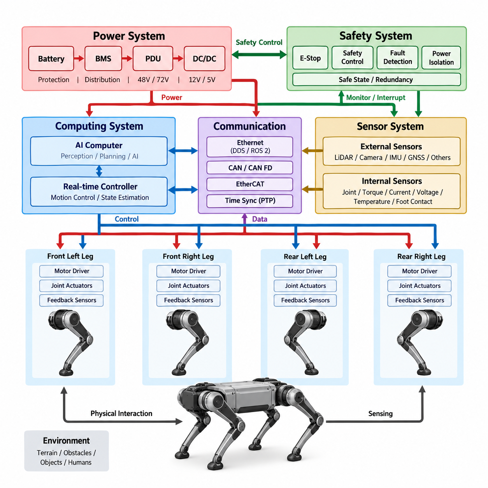
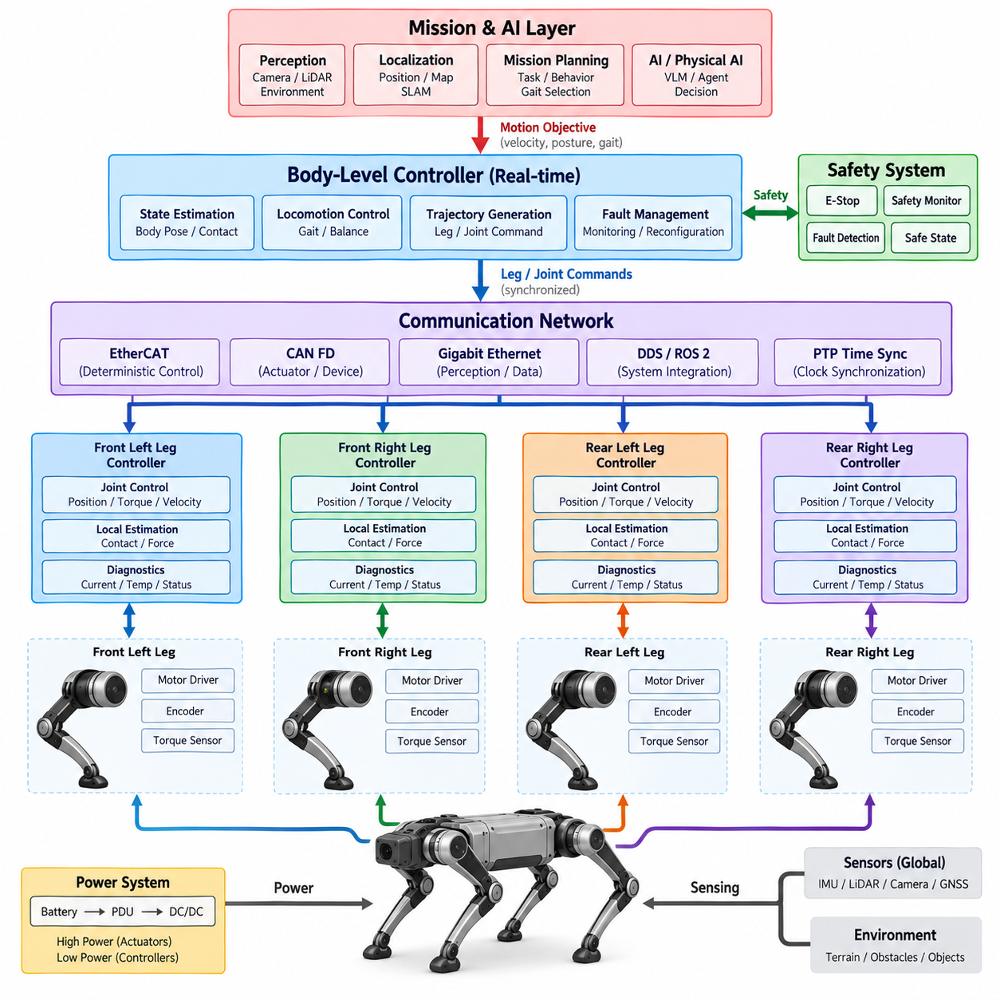
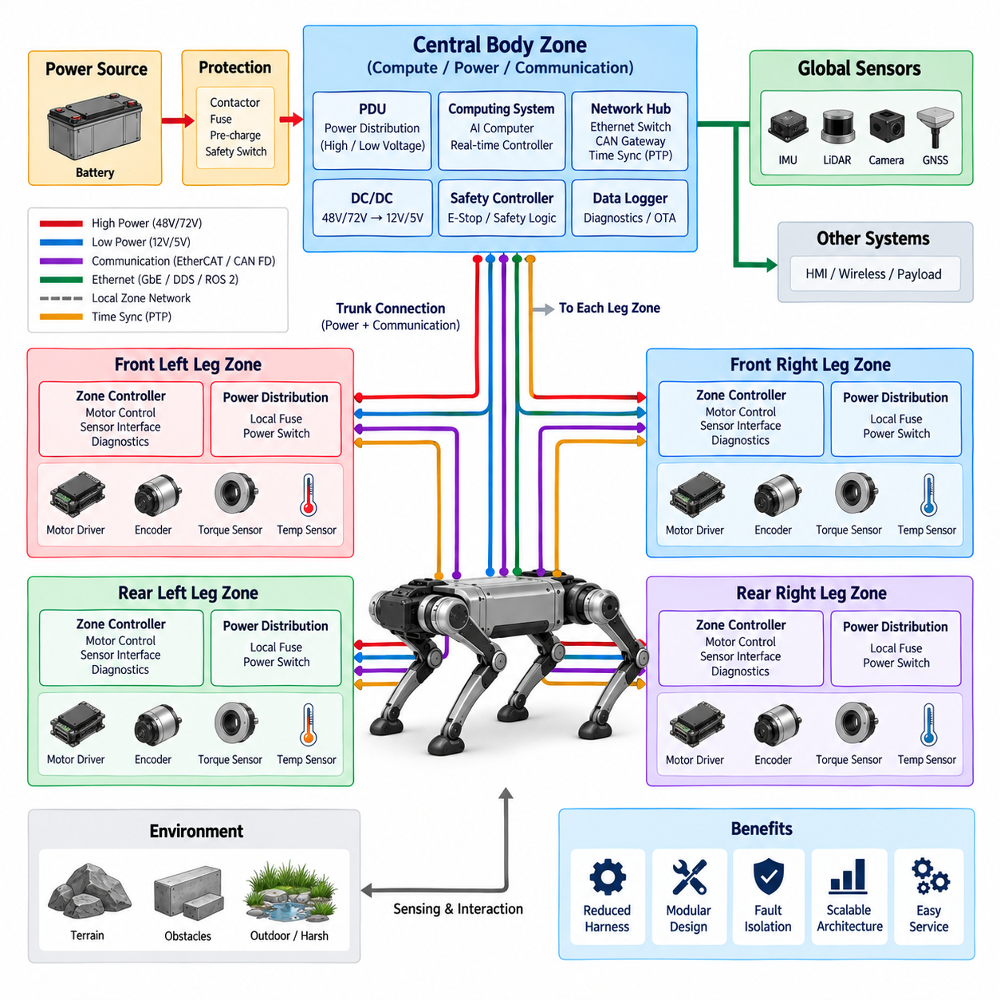
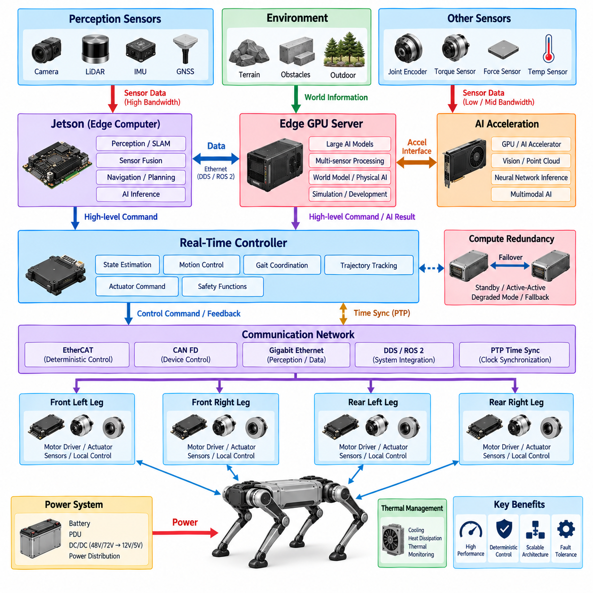
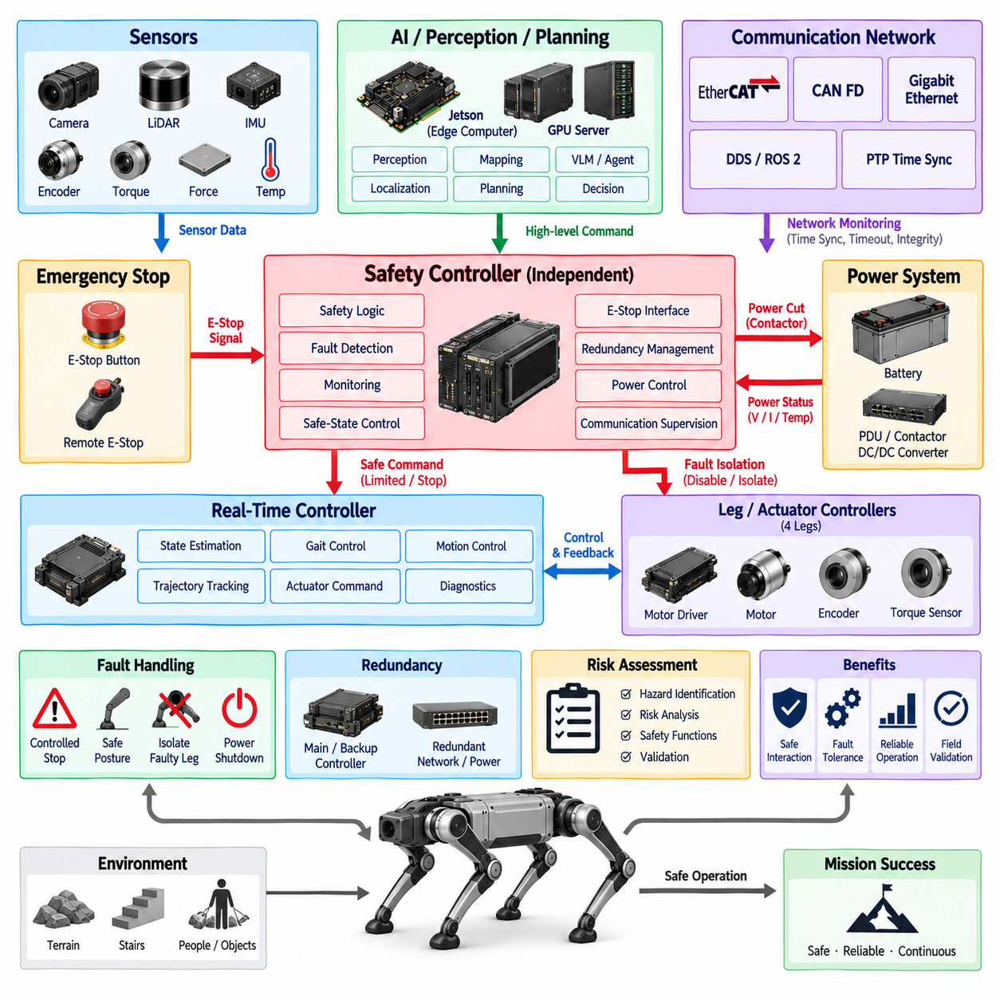

**Volume 20. Quadruped Electrical Architecture**

# Chapter 02. System Level Architecture

## 02.01. Functional Block Diagram

{width="7.268055555555556in" height="7.268055555555556in"}

기능 블록 다이어그램(functional block diagram)은 사족보행 로봇(quadruped robot)의 주요 전기적 기능과 컴퓨팅 기능이 어떻게 상호작용하는지를 보여주는 시스템 수준의 관점을 제공하며, 구체적인 회로나 물리적 패키징을 즉시 정의하지는 않는다. 다이어그램은 일반적으로 배터리 시스템인 에너지원에서 시작하여 보호 및 전력 분배를 거쳐 컴퓨팅 장치, 통신 네트워크, 센서, 그리고 네 개의 다리 구동 시스템으로 연결되는 전력 경로를 보여준다. 이러한 기능적 관점은 전기 아키텍처의 주요 경계를 설정하고 이후의 상세 설계를 위한 기반을 제공한다.

아키텍처의 중심에는 주요 부하에 제어된 전기에너지를 공급하는 전력 시스템(power system)이 있으며, 보호 기능(protection function)은 비정상적인 상태가 발생했을 때 해당 회로를 격리한다. 배터리(battery), 배터리 관리 시스템(Battery Management System, BMS), 전력 분배 장치(Power Distribution Unit, PDU), DC/DC 컨버터(DC/DC converter), 그리고 관련 보호 장치는 하나의 에너지 경로를 구성한다. 모터 드라이버(motor driver)와 액추에이터(actuator) 같은 고전력 부하는 센서나 제어 전자장치와 같은 저전력 부하와는 다른 전기적 처리가 필요하다. 이러한 기능 영역을 분리하면 개별 부품을 선정하기 전에 전압 수준, 전류 요구량, 보호 요구사항 및 고장 동작을 평가하기가 쉬워진다.

사족보행 로봇의 컴퓨팅 시스템(computing system)은 또 하나의 주요 기능 블록을 구성한다. 실시간 컨트롤러(real-time controller)는 액추에이터 명령, 피드백 처리, 상태 추정(state estimation), 저수준 모션 제어(low-level motion control)와 같은 결정론적 제어 기능을 담당한다. 상위 수준의 컴퓨팅 플랫폼(higher-level computing platform)은 인지(perception), 위치 추정(localization), 경로 계획(planning), 인공지능(Artificial Intelligence, AI), 그리고 피지컬 AI(Physical AI) 기능을 수행할 수 있다. 따라서 기능 아키텍처(functional architecture)는 상위 수준의 지능과 실시간 제어를 분리하면서도 이들 사이에 명확하게 정의된 인터페이스를 유지한다. 이러한 분리는 계산 작업이 변화하더라도 액추에이터 제어 아키텍처를 근본적으로 다시 설계하지 않고 발전시킬 수 있도록 한다.

센서 시스템(sensor subsystem)은 로봇의 내부 상태와 주변 환경에 대한 정보를 제공한다. 내부 센싱(internal sensing)에는 관절 위치(joint position), 모터 속도(motor speed), 토크(torque), 전류(current), 전압(voltage), 온도(temperature), 그리고 발 접촉 정보(foot-contact information) 등이 포함된다. 외부 센싱(external sensing)에는 임무에 따라 IMU(Inertial Measurement Unit), LiDAR, 카메라(camera), GNSS(Global Navigation Satellite System), 그리고 검사 센서(inspection sensor) 등이 포함될 수 있다. 이러한 센서들은 단순히 AI 컴퓨터에 직접 연결되는 것이 아니라 적절한 인터페이스(interface), 동기화 메커니즘(synchronization mechanism), 전처리 기능(preprocessing function), 그리고 통신 경로(communication path)를 거쳐야 한다. 따라서 기능 블록 다이어그램은 센싱을 상태 추정과 인지를 위한 통합된 정보원으로 표현한다.

네 개의 다리는 완전히 독립적인 네 개의 시스템이라기보다는 반복적으로 구성되는 전기기계적 기능 유닛(electromechanical functional unit)으로 볼 수 있다. 각 다리는 여러 관절 액추에이터(joint actuator), 모터 드라이버(motor driver), 위치 또는 속도 피드백(position or velocity feedback), 그리고 필요에 따라 토크 또는 힘 센서(torque or force sensor)를 포함한다. 컨트롤러(controller)는 이러한 액추에이터들을 협조 제어하여 보행(locomotion), 균형(balance), 자세 제어(posture control), 그리고 접촉력 제어(contact-force control)를 수행한다. 네 개의 다리에 동일한 기본 구조가 반복되므로 기능 아키텍처에서는 공통 인터페이스(common interface)와 재사용 가능한 제어 개념(reusable control concept)을 강조해야 한다. 이러한 모듈성(modularity)은 하드웨어 개발, 진단(diagnostics), 제조(manufacturing), 그리고 유지보수(service)를 확장하는 데 도움이 된다.

통신(communication)은 기능 블록들을 하나의 협조된 시스템으로 연결한다. 저수준 액추에이터 및 장치 통신(low-level actuator and device communication)은 결정론적 네트워크(deterministic network) 또는 CAN 기반 인터페이스를 사용할 수 있으며, 상위 수준의 컴퓨팅과 센서 통신은 Ethernet 기반 네트워크를 사용할 수 있다. DDS(Data Distribution Service)와 ROS 2(Robot Operating System 2)와 같은 미들웨어(middleware)는 소프트웨어 구성요소 사이에 구조화된 통신을 제공할 수 있다. 아키텍처에서는 결정론적 타이밍(deterministic timing)이 필요한 정보와 주로 높은 대역폭과 유연성이 필요한 정보를 구분해야 한다. 이러한 구분은 인지, 계획, AI 작업과 고주파 액추에이터 제어가 동시에 수행될 때 특히 중요하다.

시간 동기화(time synchronization)는 단순한 소프트웨어 기능이 아니라 아키텍처 기능이다. 센서 측정값, 액추에이터 피드백, 컨트롤러 상태, 그리고 인지 결과는 로봇의 물리적 상태를 정확하게 해석할 수 있도록 의미 있는 시간 기준(time reference)과 연계되어야 한다. PTP(Precision Time Protocol) 기반 동기화와 하드웨어 타임스탬핑(hardware timestamping)은 분산 컴퓨팅(distributed computing)과 센싱(sensing) 요소 사이의 보다 정밀한 시간 관계를 지원할 수 있다. 따라서 기능 아키텍처에서는 타임스탬프(timestamp)를 단순한 메타데이터로 취급하기보다는 센싱, 컴퓨팅, 통신 및 제어를 연결하는 공통 시간 인프라(time infrastructure)로 표현하는 것이 바람직하다.

안전 기능(safety function)은 시스템 전체에 걸쳐 존재하면서 다른 기능들과 상호작용하는 독립적인 계층을 형성한다. 비상정지(emergency stop), 전원 차단(power isolation), 고장 검출(fault detection), 워치독 메커니즘(watchdog mechanism), 안전 상태 전환(safe-state transition), 그리고 이중화(redundancy)는 위험한 상태가 감지되었을 때 정상적인 동작을 중단하거나 제한할 수 있다. 안전 기능은 상위 수준의 AI 컴퓨터에 전적으로 의존해서는 안 된다. AI 또는 애플리케이션 프로세서(application processor)는 고장 나거나 과부하가 발생하거나 통신이 끊길 수 있기 때문이다. 따라서 기능 블록 다이어그램에서는 정상적인 지능 기능과 안전 메커니즘을 개념적으로 분리하면서도 안전 기능이 전원, 동작 및 시스템 운용에 영향을 줄 수 있는 인터페이스를 함께 표현한다.

전체적인 신호 및 에너지 흐름은 폐루프 물리 시스템(closed physical loop)으로 이해할 수 있다. 전기에너지는 배터리에서 보호 및 전력 분배 시스템을 거쳐 액추에이터와 컴퓨팅 시스템으로 전달된다. 센서는 로봇과 주변 환경을 관측하고, 컨트롤러는 이러한 관측 정보를 해석하여 액추에이터에 전달할 명령을 생성한다. 액추에이터는 이후 로봇의 물리적 상태를 변화시키고, 그 결과 새로운 센서 측정값이 생성되어 다시 제어 루프에 입력된다. 가장 높은 수준에서 사족보행 로봇의 전기 아키텍처는 전력(power), 센싱(sensing), 통신(communication), 컴퓨팅(computing), 제어(control), 액추에이션(actuation), 안전(safety)을 하나의 통합된 사이버-물리 시스템(cyber-physical system)으로 연결한다.

이러한 기능적 표현은 시스템 수준 아키텍처와 상세 엔지니어링 사이의 경계도 설정한다. 이 단계의 목적은 모든 커넥터(connector), 와이어 게이지(wire gauge), 트랜시버(transceiver), 프로세서(processor), 모터 드라이버(motor driver)를 즉시 선정하는 것이 아니다. 대신 어떤 기능이 존재해야 하는지, 이러한 기능들이 전력과 정보를 어떻게 교환해야 하는지, 그리고 어디에 아키텍처 경계를 설정해야 하는지를 정의하는 것이 목적이다. 이후 시스템 수준의 기능 구조는 분산 제어(distributed control), 존 기반 전기 아키텍처(zonal electrical architecture), 컴퓨팅 아키텍처(computing architecture), 그리고 안전 아키텍처(safety architecture)로 구체화될 수 있다. 이러한 단계적 접근은 시스템 기능에서 실제 구현 가능한 전기 하드웨어까지 설계를 추적 가능하게 유지한다.

## 02.02. Distributed Control Architecture

{width="7.268055555555556in" height="7.268055555555556in"}

분산 제어 아키텍처(distributed control architecture)는 모든 기능을 하나의 중앙 컨트롤러에 배치하는 대신, 사족보행 로봇(quadruped robot)의 제어 책임을 여러 컴퓨팅 및 제어 노드로 분산한다. 이 아키텍처는 일반적으로 상위 수준의 모션 계획(motion planning), 로봇 몸체 상태 추정(body-state estimation), 보행 협조(locomotion coordination), 저수준 관절 제어(low-level joint control)를 서로 다른 기능 계층으로 분리한다. 각 노드는 정의된 책임을 수행하면서 통신 네트워크를 통해 명령, 측정값 및 상태 정보를 교환한다. 이러한 방식은 네 개의 다리에 반복적인 액추에이터와 센싱 유닛이 구성되는 사족보행 로봇의 모듈화된 특성과 잘 부합한다.

최상위 수준에서 메인 컴퓨팅 시스템(main computing system)은 로봇이 수행해야 할 동작을 결정한다. 메인 컴퓨팅 시스템은 인지(perception) 결과, 위치 추정(localization) 정보, 미션 명령(mission command), 지형 조건(terrain condition) 등을 처리하여 보행 방향, 속도, 몸체 자세(body posture), 보행 패턴(gait selection)과 같은 동작 목표를 생성할 수 있다. 이후 실시간 제어 계층(real-time control layer)은 이러한 목표를 여러 다리와 관절에 대한 협조된 명령으로 변환한다. 상위 컴퓨팅 플랫폼(higher-level computing platform)이 모든 모터 제어 루프를 직접 실행할 필요는 없다. 대신 필요한 동작 목표를 하위 제어기로 전달하고, 하위 제어기는 훨씬 높은 업데이트 주기로 결정론적 제어(deterministic control)를 수행할 수 있다.

각 다리는 여러 관절 액추에이터(joint actuator), 모터 드라이버(motor driver), 엔코더(encoder), 그리고 선택적으로 토크 또는 힘 센서(torque or force sensor)를 포함하는 반독립적인 제어 영역(semi-independent control domain)으로 취급할 수 있다. 로컬 액추에이터 컨트롤러(local actuator controller)는 자체 피드백 신호를 사용하여 위치(position), 속도(velocity), 또는 토크 제어(torque control)를 수행할 수 있으며, 이를 위해 메인 AI 컴퓨터에 지속적으로 의존할 필요가 없다. 이러한 로컬 자율성(local autonomy)은 통신 트래픽을 줄이고 상위 수준의 컴퓨팅 작업이 일시적으로 증가하더라도 액추에이터 제어 루프의 안정성을 유지할 수 있도록 한다. 중앙 컨트롤러(central controller)는 네 개의 다리를 계속해서 협조 제어하여 각각의 로컬 동작이 안정적인 전신 동작(whole-body motion)을 만들어 내도록 한다.

분산 구조(distributed structure)는 몸체 수준의 협조 제어(body-level coordination)와 관절 수준의 실행(joint-level execution) 사이에 명확한 계층을 형성한다. 몸체 컨트롤러(body controller)는 로봇을 하나의 완전한 기계 시스템으로 보고 원하는 다리 궤적(leg trajectory), 접촉 상태(contact state), 균형 반응(balance response), 전체 동작을 결정한다. 이후 로컬 관절 컨트롤러(local joint controller)는 고주파 피드백(high-frequency feedback)을 사용하여 필요한 명령을 추종한다. 이러한 분리는 사족보행에서 특히 중요하다. 사족보행의 균형은 여러 관절과 다리의 협조된 타이밍에 의존하기 때문이다. 하나의 로컬 컨트롤러에서 발생한 지연이나 고장이 전체 제어 아키텍처가 하나의 강하게 결합된 소프트웨어 프로세스로 동작하지 않더라도 검출될 수 있어야 한다.

통신 네트워크(communication network)는 이러한 분산 제어 노드(distributed control node) 사이의 인터페이스를 제공한다. CAN FD는 견고하고 비교적 단순한 메시징이 필요한 소형 액추에이터 및 장치 통신에 적합할 수 있으며, EtherCAT 또는 다른 결정론적 Ethernet 기술(deterministic Ethernet technology)은 긴밀하게 동기화된 다축 제어(multi-axis control)를 지원할 수 있다. Gigabit Ethernet은 대역폭이 더욱 중요한 상위 컴퓨팅, 인지 및 데이터 처리 시스템을 연결하는 데 사용할 수 있다. DDS(Data Distribution Service)와 ROS 2(Robot Operating System 2)는 애플리케이션 수준에서 구조화된 소프트웨어 통신을 제공할 수 있다. 따라서 아키텍처에서는 모든 연결을 동일하게 취급하기보다는 타이밍(timing), 대역폭(bandwidth), 결정론성(determinism), 신뢰성(reliability), 구현 요구사항에 따라 적절한 통신 기술을 할당해야 한다.

시간은 분산 제어(distributed control)의 핵심 요구사항이다. 여러 센서 측정값, 액추에이터 명령, 컨트롤러 상태가 서로 일관되지 않은 시간 기준을 사용한다면 사족보행 로봇은 여러 다리를 안정적으로 협조 제어할 수 없다. 시간 동기화(time synchronization)는 분산 노드들이 측정값과 명령을 공통의 시간 기반(common temporal basis)에 연결할 수 있도록 한다. PTP(Precision Time Protocol) 기반 동기화, 하드웨어 타임스탬핑(hardware timestamping), 결정론적 통신(deterministic communication)은 센싱(sensing), 상태 추정(estimation), 계획(planning), 액추에이션(actuation) 사이의 시간적 관계를 향상시킬 수 있다. 목적은 단순히 모든 클록(clock)이 동일한 시간을 표시하도록 만드는 것이 아니라, 로봇의 물리적 상태를 해석할 수 있는 신뢰성 있는 시간 프레임워크(temporal framework)를 구축하는 것이다.

분산 아키텍처(distributed architecture)는 또한 고장 격리(fault containment)를 위한 자연스러운 경계를 제공한다. 개별 액추에이터 컨트롤러, 통신 링크 또는 센서의 고장은 자동으로 로봇 전체에서 제어되지 않는 동작을 발생시키지 않고 검출 및 관리될 수 있어야 한다. 로컬 진단(local diagnostics)은 비정상적인 전류, 온도, 엔코더 피드백, 통신 손실 또는 액추에이터 동작을 식별하고 해당 상태를 상위 수준의 컨트롤러에 보고할 수 있다. 안전 요구사항(safety requirement)에 따라 시스템은 고장 난 구성요소를 격리하거나, 명령된 동작을 감소시키거나, 보행 패턴을 변경하거나, 제어된 안전 상태(safe state)로 전환할 수 있다. 이러한 관계는 분산 제어를 이후의 안전 아키텍처(safety architecture)와 직접 연결한다.

전력(power)과 제어(control)의 책임도 개념적으로 분리되어야 한다. 분산 컨트롤러(distributed controller)는 안정적인 저전압 전원(low-voltage power)이 필요하지만, 액추에이터는 주 전력 아키텍처(main power architecture)에서 상당히 높은 전력을 소비한다. 따라서 로컬 제어 노드(local control node)는 신호 배선을 줄이고 모듈성을 향상시키기 위해 액추에이터 그룹 가까이에 배치할 수 있으며, 전력 분배(power distribution)는 전용 보호 및 분배 기능을 통해 관리할 수 있다. 이러한 분리는 높은 전류의 스위칭 동작이 민감한 제어 및 통신 전자장치에 불필요하게 영향을 미치는 것을 방지하고, 전기적 전력 설계와 제어 시스템 설계 사이의 경계를 더욱 명확하게 만드는 데 도움이 된다.

아키텍처는 분산 모터 드라이버를 사용하는 비교적 단순한 중앙 컨트롤러에서부터 지능형 액추에이터 모듈(intelligent actuator module)의 고도화된 네트워크까지 확장될 수 있다. 기본적인 구현에서는 메인 컨트롤러가 대부분의 상태 추정과 보행 제어를 수행하고 개별 모터 컨트롤러는 로컬 서보 루프(local servo loop)만 실행할 수 있다. 보다 분산된 구현에서는 액추에이터 또는 다리 컨트롤러가 추가적인 상태 추정(estimation), 진단(diagnostics), 접촉 검출(contact detection), 로컬 협조 제어(local coordination)를 수행할 수 있다. 적절한 분산 수준은 컴퓨팅 성능(computational capability), 네트워크 성능(network performance), 안전 요구사항, 비용(cost), 패키징 제약(packaging constraint), 그리고 요구되는 모듈성 수준에 따라 결정된다.

분산 제어의 핵심적인 장점은 하드웨어와 소프트웨어 개발을 명확하게 정의된 인터페이스를 통해 진행할 수 있다는 점이다. 액추에이터 모듈은 필요한 전력(power), 통신(communication), 타이밍(timing), 명령(command), 피드백(feedback), 진단(diagnostic) 인터페이스를 만족한다면 독립적으로 개발하고 시험할 수 있다. 마찬가지로 메인 컴퓨팅 플랫폼은 기존의 모션 계획(motion planning)에서 보다 고도화된 AI 및 피지컬 AI(Physical AI) 기능으로 발전할 수 있으며, 이 과정에서 모든 액추에이터 컨트롤러를 변경할 필요는 없다. 이러한 분리는 기술 이전(technology migration), 구성요소 교체(component replacement), 유지보수(maintenance), 향후 확장을 지원하면서 기본적인 시스템 아키텍처를 유지할 수 있도록 한다.

사족보행 로봇에서 분산 제어는 궁극적으로 독립적인 여러 컨트롤러의 집합이 아니라 협조된 사이버-물리 계층(cyber-physical hierarchy)으로 이해해야 한다. AI 및 미션 계층(AI and mission layer)은 로봇이 무엇을 수행해야 하는지를 결정하고, 몸체 수준 컨트롤러(body-level controller)는 로봇이 어떻게 움직여야 하는지를 결정하며, 다리 및 관절 컨트롤러(leg and joint controller)는 개별 메커니즘이 해당 동작을 어떻게 실행할지를 결정한다. 전기 및 통신 인프라(electrical and communication infrastructure)는 이러한 모든 계층에 필요한 에너지, 정보, 시간, 보호 기능을 제공한다. 따라서 잘 설계된 아키텍처는 중앙 집중형 협조 제어(centralized coordination)와 로컬 자율성(local autonomy)을 결합하여, 로봇이 신속하게 반응하는 보행을 구현하면서도 모듈성(modularity), 진단 가능성(diagnosability), 확장성(scalability)을 유지하고 향후 안전(safety) 및 피지컬 AI(Physical AI) 통합에 적합하도록 한다.

## 02.03. Zonal Electrical Architecture

{width="7.268055555555556in" height="7.268055555555556in"}

:::

구역 기반 전기 아키텍처(zonal electrical architecture)는 사족보행 로봇(quadruped robot)을 여러 개의 물리적 또는 기능적 전기 구역(electrical zone)으로 나누고, 각 구역이 담당하는 장치 가까이에 전력 분배(power distribution), 통신 인터페이스(communication interface), 그리고 일부 제어 기능(control function)을 배치하는 방식이다. 모든 배선을 중앙 전기 캐비닛(central electrical cabinet)으로 연결하는 대신, 각 구역에서 로컬 연결을 모으고 더 적은 수의 트렁크 연결(trunk connection)을 통해 로봇의 다른 영역과 통신할 수 있다. 이러한 방식은 하네스 복잡성을 줄이는 동시에 전력, 신호, 제어, 진단 및 서비스에 대한 명확한 경계를 형성할 수 있다.

사족보행 로봇에서는 몸체(body)와 네 개의 다리(leg)가 전기 구역을 정의하는 데 자연스러운 기반이 된다. 중앙 몸체에는 배터리 인터페이스(battery interface), 주 보호 회로(main protection), PDU(Power Distribution Unit), 컴퓨팅 플랫폼(computing platform), 주요 통신 인터페이스(primary communication interface) 및 기타 공통 기능을 배치할 수 있다. 각 다리는 액추에이터 전원 연결(actuator power connection), 모터 드라이버(motor driver), 엔코더 인터페이스(encoder interface), 토크 또는 힘 센싱(torque or force sensing), 온도 모니터링(temperature monitoring), 로컬 진단(local diagnostics)을 포함하는 로컬 전기 구역(local electrical zone)으로 동작할 수 있다. 정확한 물리적 구획은 패키징(packaging), 전력 요구사항(power requirement), 기계적 움직임(mechanical movement), 환경 보호(environmental protection), 서비스성(serviceability)에 따라 결정된다.

중앙 몸체 구역(central body zone)은 일반적으로 주요 전기 분배 지점(main electrical distribution point)의 역할을 한다. 배터리 전원(battery power)은 적절한 보호 및 스위칭 기능(protection and switching function)을 거쳐 중앙 아키텍처로 들어오며, 액추에이터 구역(actuator zone)과 저전력 전자 부하(lower-power electronic load)로 분배된다. 컴퓨팅 장비(computing equipment)와 주요 통신 인터페이스도 이 영역에 배치할 수 있다. 따라서 중앙 구역은 네 개의 다리가 공유하는 공통 인프라(common infrastructure)를 제공하면서, 대형 전력 변환(power conversion) 및 보호 구성요소를 불필요하게 중복 배치하는 것을 방지한다.

각 다리 구역(leg zone)은 중앙 시스템과 로컬 전기기계 구성요소(local electromechanical component) 사이에 명확하게 정의된 인터페이스를 제공해야 한다. 고전력 액추에이터 전원(high-power actuator supply), 통신(communication), 제어 명령(control command), 센서 피드백(sensor feedback), 진단 정보(diagnostic information)를 하나의 로컬 인터페이스(local interface)로 구성할 수 있다. 모터 드라이버와 센싱 요소는 자신이 제어하는 관절 가까이에 물리적으로 배치하여 민감한 신호 배선의 길이를 줄이고 동적 하네스(dynamic harness)를 단순화할 수 있다. 이러한 구조는 사족보행 다리가 정상적인 동작 중 반복적인 굽힘, 회전, 진동 및 기계적 충격을 받기 때문에 특히 유용하다.

구역 기반 아키텍처(zonal architecture)는 와이어 하네스(wire harness)의 설계 방식도 변화시킨다. 기존의 중앙 집중형 아키텍처(centralized architecture)는 모든 액추에이터와 센서까지 많은 개별 케이블을 몸체에서 직접 연결해야 할 수 있다. 반면 구역 기반 아키텍처에서는 중앙 몸체와 각 구역 사이에 트렁크 연결(trunk connection)을 사용하고, 구역 내부에서는 더 짧은 로컬 분기(local branch)를 사용할 수 있다. 이를 통해 하네스 길이, 커넥터 수, 배선 복잡성, 조립 작업을 줄일 수 있다. 그러나 구역 인터페이스(zone interface)는 전력 용량(power capacity), 통신 대역폭(communication bandwidth), 전압 강하(voltage drop), 차폐(shielding), 접지(grounding), 환경 보호(environmental protection)가 충분하도록 신중하게 설계해야 한다.

구역 내부의 전력 분배(power distribution)는 보행 중 액추에이터 부하가 빠르게 변할 수 있기 때문에 특별한 주의가 필요하다. 하나의 로컬 구역은 여러 모터 드라이버에 고전류 전력(high-current power)을 공급하면서 동시에 저전력 센서와 제어 전자장치에도 전원을 공급해야 할 수 있다. 로컬 퓨징(local fusing), 전자식 보호(electronic protection), 전류 모니터링(current monitoring), 제어형 전원 스위칭(controlled power switching)을 적용하면 추가적인 고장 격리(fault isolation)를 제공할 수 있다. 하나의 다리에서 발생한 고장이 다른 다리의 전원을 불필요하게 차단하거나 필수적인 몸체 수준의 컴퓨팅 및 안전 기능에 영향을 주지 않도록 아키텍처를 구성해야 한다.

통신(communication) 역시 구역을 중심으로 구성할 수 있다. 중앙 통신 백본(central communication backbone)은 메인 컨트롤러(main controller)와 네 개의 다리 구역을 연결하고, 각 구역 내부의 로컬 네트워크(local network)는 해당 구역의 장치들을 연결할 수 있다. CAN FD는 견고한 액추에이터 및 장치 통신에 사용할 수 있으며, EtherCAT 또는 다른 결정론적 Ethernet 기술(deterministic Ethernet technology)은 동기화된 다축 제어(multi-axis control)가 필요한 경우 고려할 수 있다. Gigabit Ethernet은 고대역폭 컴퓨팅 및 인지 기능을 지원할 수 있다. DDS(Data Distribution Service)와 ROS 2(Robot Operating System 2)는 물리적인 전기 아키텍처 전반에서 상위 수준의 소프트웨어 통신을 제공할 수 있다.

구역 기반 아키텍처는 사족보행 동작에 필요한 시간 관계(timing relationship)를 유지해야 한다. 로컬 액추에이터 컨트롤러(local actuator controller)는 로컬에서 이용 가능한 엔코더 및 토크 피드백을 사용하여 고주파 서보 루프(high-frequency servo loop)를 실행할 수 있으며, 중앙 컨트롤러는 협조된 몸체 수준의 명령(body-level command)을 제공한다. 서로 다른 구역의 측정값을 상태 추정(state estimation), 균형 제어(balance control), 접촉 검출(contact detection), 보행 제어(locomotion control)에 결합해야 할 경우 시간 동기화(time synchronization)가 더욱 중요해진다. PTP(Precision Time Protocol)와 하드웨어 타임스탬핑(hardware timestamping)은 분산 컴퓨팅, 센싱 및 제어 노드 사이에 공통 시간 기준(common temporal reference)을 형성할 수 있다.

구역 분리는 고장 격리(fault containment)와 진단(diagnostics)을 위한 유용한 기반도 제공한다. 각 구역은 자체 전압(voltage), 전류(current), 온도(temperature), 통신 상태(communication status), 액추에이터 피드백(actuator feedback), 로컬 컨트롤러 상태(local controller health)를 모니터링할 수 있다. 비정상 상태가 감지되면 시스템은 전체 로봇을 하나의 구분되지 않은 전기 시스템으로 취급하는 대신 영향을 받은 구역을 식별하고 적절한 대응을 결정할 수 있다. 안전 아키텍처(safety architecture)에 따라 고장 난 구역을 격리하거나 해당 구역의 동작 능력을 감소시키거나, 로봇을 제어된 안전 상태(controlled safe state)로 전환하면서 다른 필수 기능을 계속 사용할 수 있다.

다리 구역(leg zone)은 먼지, 물, 진흙, 진동, 충격 및 반복적인 기계적 움직임에 노출되기 때문에 환경 보호(environmental protection)가 특히 중요하다. 따라서 로컬 커넥터(local connector)와 하네스(harness)는 적절한 밀봉(sealing), 스트레인 릴리프(strain relief), 차폐(shielding), 기계적 보호(mechanical protection)를 필요로 한다. 구역 경계(zone boundary)는 전체 로봇을 불필요하게 분해하지 않고도 서비스가 필요한 구성요소를 교체할 수 있도록 배치해야 한다. 이는 구역 기반 아키텍처를 이후의 하네스(harness), 커넥터(connector), IP67/IP68, 서비스성(serviceability) 엔지니어링과 직접 연결한다.

구역 기반 전기 아키텍처의 핵심 가치는 단순히 전선의 수를 줄이는 데 있지 않다. 이 아키텍처는 로봇의 기계적 구조에 따라 전력(power), 통신(communication), 제어(control), 센싱(sensing), 진단(diagnostics), 보호(protection)를 그룹화할 수 있는 확장 가능한 물리적 구성을 제공한다. 중앙 몸체는 공유 인프라(shared infrastructure)를 제공하고, 네 개의 다리 구역은 로컬 전기기계 기능(local electromechanical functionality)을 제공한다. 이를 통해 시스템 수준의 기능 아키텍처와 이후에 다루게 될 액추에이터, 하네스, 센서, 컴퓨팅, 통신 및 안전 설계 사이에 실질적인 연결 구조를 형성할 수 있다.

## 02.04. Computing Architecture

{width="7.268055555555556in" height="7.268055555555556in"}

사족보행 로봇(quadruped robot)의 컴퓨팅 아키텍처(computing architecture)는 상위 수준 지능(high-level intelligence), 실시간 제어(real-time control), 센서 처리(sensor processing), 분산 액추에이터 제어(distributed actuator control)에 필요한 컴퓨팅 자원을 어떻게 구성할지를 정의한다. 보행(locomotion)은 높은 연산 성능과 결정론적 응답(deterministic response)을 동시에 요구하기 때문에 하나의 프로세서만으로 모든 작업을 처리하는 것은 일반적으로 적합하지 않다. 따라서 아키텍처는 타이밍, 연산 요구사항, 전력 소비, 안전 중요도에 따라 컴퓨팅 기능을 분리한다. 이 장에서 정의된 구조에는 Jetson 아키텍처(Jetson architecture), 엣지 GPU 서버(Edge GPU Server), 실시간 컨트롤러(Real-Time Controller), AI 가속(AI Acceleration), PTP 시간 동기화(PTP Time Synchronization), 컴퓨팅 이중화(Compute Redundancy)가 포함된다.

Jetson 플랫폼(Jetson platform)은 CPU, GPU, 메모리, 인터페이스 및 임베디드 소프트웨어 기능을 하나의 소형 플랫폼에 통합하기 때문에 사족보행 로봇의 중요한 엣지 컴퓨팅 노드(edge computing node)로 활용할 수 있다. 로봇 가까이에서 인지(perception), 위치 추정(localization), 센서 융합(sensor fusion), 내비게이션(navigation), 계획(planning), AI 추론(AI inference)을 수행할 수 있다. 그러나 Jetson의 역할은 고주파 액추에이터 제어(high-frequency actuator control)와 명확하게 구분되어야 한다. 이러한 분리를 통해 연산 집약적인 AI 작업은 엣지 플랫폼에서 수행하고, 결정론적 제어는 적절한 실시간 컨트롤러 또는 액추에이터 수준 컨트롤러에서 유지할 수 있다.

엣지 GPU 서버(Edge GPU Server)는 로봇이 더 큰 AI 모델, 다중 인지 파이프라인(multiple perception pipeline), 시뮬레이션 지원 개발(simulation-assisted development), 고급 피지컬 AI(Physical AI) 작업을 필요로 할 때 훨씬 높은 연산 성능을 제공할 수 있다. 서버는 고해상도 카메라 및 LiDAR 데이터를 처리하고, 멀티모달 추론(multimodal inference)을 수행하며, 월드 모델(world model) 또는 파운데이션 모델(foundation model) 애플리케이션을 지원하고, 소형 임베디드 컴퓨터의 성능을 초과하는 개발 작업을 가속할 수 있다. 시스템 구성에 따라 엣지 GPU 서버는 로봇에 탑재되거나 고대역폭 네트워크(high-bandwidth network)를 통해 연결된 인접 컴퓨팅 자원으로 동작할 수 있다.

실시간 컨트롤러(Real-Time Controller)는 컴퓨팅 아키텍처에서 결정론적 제어의 기반을 제공한다. 주요 책임은 상태 추정(state estimation), 모션 제어(motion control), 보행 협조(gait coordination), 궤적 추종(trajectory tracking), 액추에이터 명령 생성(actuator command generation)과 같이 예측 가능한 타이밍을 요구하는 기능을 실행하는 것이다. 이러한 기능은 대규모 AI 모델의 가변적인 실행 시간(variable execution time)에 직접 의존해서는 안 된다. 실시간 컨트롤러는 상위 수준 컴퓨팅으로부터 동작 목표를 받아 시간 임계 제어 명령(time-critical control command)으로 변환하며, 동시에 엔코더, 토크 센서, 전류 센서 및 기타 액추에이터 인터페이스에서 피드백을 수집한다.

AI 가속(AI acceleration)은 범용 연산(general-purpose computation)과 현대적인 인지 및 피지컬 AI 작업에 필요한 특화 연산(specialized operation)을 분리한다. GPU 또는 기타 AI 가속 자원은 일반적인 CPU만 사용하는 것보다 신경망 추론(neural-network inference), 이미지 처리(image processing), 포인트 클라우드 처리(point-cloud processing), 센서 융합(sensor fusion), 멀티모달 모델(multimodal model)을 더욱 효율적으로 실행할 수 있다. 아키텍처에서는 단순히 사용 가능한 연산 성능을 최대화하기보다 작업 특성에 따라 가속 자원을 할당해야 한다. 적절한 가속기를 선정할 때는 메모리 용량(memory capacity), 대역폭(bandwidth), 열적 한계(thermal limit), 지연시간(latency), 전력 소비(power consumption), 모델 배포 요구사항(model deployment requirement)을 모두 고려해야 한다.

Jetson 플랫폼, 엣지 GPU 서버, 실시간 컨트롤러 사이의 관계는 명확한 기능적 경계(functional boundary)를 통해 정의되어야 한다. Jetson 또는 유사한 임베디드 컴퓨터는 주요 온보드 인지 및 AI 처리 계층(onboard perception and AI processing layer)을 제공할 수 있으며, 엣지 GPU 서버는 필요한 경우 추가적인 연산 능력을 제공할 수 있다. 실시간 컨트롤러는 이러한 상위 수준 작업과 독립적으로 결정론적 모션 실행(deterministic motion execution)을 유지한다. 따라서 각 계층 사이의 통신은 모든 내부 연산 과정을 모든 노드에 노출하는 대신 명확하게 정의된 상태(state), 궤적(trajectory), 명령(command), 상태 정보(status information)를 전달하도록 구성해야 한다.

PTP 기반 시간 동기화(PTP-based time synchronization)는 분산 컴퓨팅(distributed computing)을 위한 시간적 기반을 제공한다. 사족보행 로봇은 IMU, 카메라, LiDAR, GNSS, 관절 엔코더(joint encoder), 토크 센서 및 기타 장치의 측정값을 결합하며, 이러한 측정값은 물리적으로 분리된 여러 컴퓨팅 노드에서 생성될 수 있다. 공통 시간 기준(common time reference)은 시스템이 관측값, 컨트롤러 상태, 액추에이터 피드백을 일관된 타임스탬프(timestamp)와 연계할 수 있도록 한다. 따라서 PTP(Precision Time Protocol)와 하드웨어 타임스탬핑(hardware timestamping)은 특히 여러 컴퓨팅 노드가 동시에 동작할 때 센서 융합, 상태 추정, 모션 협조 및 진단 분석의 정확성을 향상시킬 수 있다.

컴퓨팅 이중화(compute redundancy)는 컴퓨팅 노드의 손실이 허용할 수 없는 운용 상태를 발생시킬 수 있는 경우 시스템 가용성(availability)과 고장 허용성(fault tolerance)을 향상시킬 수 있다. 이중화가 반드시 모든 프로세서를 복제해야 한다는 의미는 아니다. 먼저 핵심 기능(critical function)을 식별한 후 대기 컴퓨팅(standby computing), 액티브-액티브 운용(active-active operation), 성능 저하 모드 운용(degraded-mode operation), 독립적인 폴백 제어(independent fallback control) 중 어떤 방식이 필요한지 평가해야 한다. 예를 들어 상위 수준 AI 처리는 일시적인 손실이나 성능 저하를 허용할 수 있지만, 필수 실시간 제어와 안전 관련 기능은 훨씬 강력한 연속성 메커니즘(continuity mechanism)을 요구할 수 있다.

컴퓨팅 아키텍처는 각 컴퓨팅 계층(computing tier)의 전기적 및 열적 특성도 고려해야 한다. 고성능 GPU 컴퓨팅(high-performance GPU computing)은 상당한 전력 소비와 발열을 발생시킬 수 있는 반면, 임베디드 플랫폼(embedded platform)은 성능, 크기, 에너지 사용 사이에서 보다 유리한 균형을 제공한다. 따라서 컴퓨팅 하드웨어의 물리적 배치는 냉각(cooling), 진동(vibration), 전자기 적합성(electromagnetic compatibility), 커넥터 접근성(connector access), 서비스성(serviceability), 전력 분배(power distribution)를 고려해야 한다. 이러한 요소들은 컴퓨팅 아키텍처를 사족보행 로봇의 전력, 하네스, 접지, 통신 및 기계적 패키징 아키텍처와 직접 연결한다.

확장 가능한 컴퓨팅 아키텍처(scalable computing architecture)는 로봇이 기존의 자율 제어(conventional autonomous control)에서 보다 고도화된 AI 및 피지컬 AI 기능으로 발전할 수 있도록 해야 한다. 기본 구성에서는 전용 실시간 컨트롤러와 함께 임베디드 Jetson급 컴퓨터(Jetson-class computer)를 사용할 수 있으며, 더 높은 성능이 필요한 구성에서는 엣지 GPU 서버 또는 추가적인 AI 가속기를 적용할 수 있다. 컴퓨팅 자원이 증가하더라도 동일한 기능적 인터페이스(functional interface)는 안정적으로 유지되어야 한다. 이를 통해 저수준 제어 아키텍처를 근본적으로 변경하지 않고도 인지 모델, 계획 알고리즘, 파운데이션 모델 및 체화형 AI(embodied AI) 애플리케이션을 발전시킬 수 있다.

최종적인 아키텍처는 서로 독립적인 프로세서의 집합이 아니라 계층형 컴퓨팅 시스템(layered computing system)으로 이해해야 한다. 상위 수준 컴퓨팅은 인지, 추론(reasoning), 계획 및 AI 동작을 결정하고, 엣지 가속(edge acceleration)은 고성능 모델에 필요한 연산 자원을 제공하며, 실시간 컨트롤러는 결정론적인 모션 실행을 보장한다. 분산 액추에이터 컨트롤러(distributed actuator controller)는 로컬 서보 기능(local servo function)을 수행하고, 동기화된 통신(synchronized communication)은 이러한 계층을 하나의 일관된 시스템으로 연결한다. PTP는 공통 시간 기준을 형성하며, 컴퓨팅 이중화와 고장 관리 메커니즘(fault-management mechanism)은 시스템 복원력(resilience)을 제공한다. 이러한 구성은 사족보행, 자율 운용 및 향후 피지컬 AI 통합을 위한 실용적인 컴퓨팅 기반을 형성한다.

## 02.05. Safety Architecture

{width="7.268055555555556in" height="7.268055555555556in"}

사족보행 로봇(quadruped robot)의 안전 아키텍처(safety architecture)는 전기적, 컴퓨팅 및 동작 관련 고장이 위험한 물리적 거동으로 발전하는 것을 방지하기 위한 메커니즘을 정의한다. 로봇은 여러 개의 고출력 액추에이터(high-power actuator)를 포함하고 사람, 장비 및 다양한 지형 주변에서 동적으로 움직일 수 있으므로 안전 기능은 전력(power), 제어(control), 통신(communication), 센싱(sensing), 컴퓨팅(computing) 영역 전체에서 동작해야 한다. 따라서 안전은 메인 AI 또는 모션 컨트롤러에 단순히 추가되는 소프트웨어 기능이 아니라 독립적인 시스템 수준 기능(system-level function)으로 설계되어야 한다.

안전 아키텍처는 위험한 운용 조건(hazardous operating condition)을 체계적으로 식별하는 것에서 시작한다. 대표적인 예로 제어되지 않는 관절 동작(uncontrolled joint motion), 균형 상실(loss of balance), 예상하지 못한 가속, 과도한 액추에이터 토크, 통신 고장, 센서 오작동, 배터리 또는 전원 고장, 과열, 핵심 컴퓨팅 기능 상실 등이 있다. 아키텍처에서는 어떤 고장을 검출할 수 있는지, 얼마나 신속하게 검출해야 하는지, 그리고 어떤 대응이 필요한지를 결정해야 한다. 따라서 위험 평가(risk assessment)는 안전 기능, 진단 범위(diagnostic coverage), 이중화(redundancy), 안전 상태 동작(safe-state behavior)을 정의하는 기반이 된다.

비상정지(emergency stop)는 가장 기본적인 안전 기능 중 하나이다. 비상정지(E-Stop) 요청은 자체적으로 오작동할 가능성이 있는 일반 애플리케이션 소프트웨어나 AI 컴퓨터에만 의존해서는 안 된다. 전용 안전 경로(dedicated safety path)는 비상정지 명령을 감지하고 액추에이터 토크 비활성화, 전력 컨택터(power contactor) 개방, 모션 명령 차단, 또는 로봇을 제어된 상태로 전환하는 등의 사전에 정의된 동작을 시작할 수 있다. 세부 대응 방식은 특정 운용 조건에서 즉각적인 전원 차단과 제어된 동작 종료(controlled motion termination) 중 어느 방식이 물리적 위험을 더 낮추는지를 고려하여 결정해야 한다.

사족보행 로봇에서는 고장 안전(fail-safe) 동작과 고장 운용 지속(fail-operational) 동작을 구분하는 것이 중요하다. 단순히 액추에이터 전원을 제거하면 로봇이 쓰러질 수 있으며, 계단이나 불규칙한 지형, 사람 주변 또는 페이로드(payload)를 운반하는 상황에서는 이러한 쓰러짐 자체가 위험을 발생시킬 수 있다. 따라서 일부 고장에서는 로봇이 보행을 정지하고, 자세를 안정화하며, 몸체를 낮추거나 다른 정의된 안전 상태로 진입할 때까지 제한적인 제어 기능을 유지해야 할 수 있다. 고장 운용 지속 기능은 제한 없이 계속 운용한다는 의미가 아니라, 허용 가능한 안전 상태에 도달하거나 이를 유지하는 데 필요한 기능만 보존한다는 의미이다.

고장 안전 아키텍처(fail-safe architecture)는 영향을 받은 기능을 계속 운용하는 것이 정지하는 것보다 더 큰 위험을 발생시키는 조건을 처리한다. 안전 시스템은 동작을 차단하거나, 고장 난 액추에이터 또는 전력 분기(power branch)를 격리하거나, 특정 명령을 비활성화하거나, 위험한 구성요소에서 에너지를 제거할 수 있다. 모든 고장에 하나의 대응 방식이 적합한 것은 아니므로 서로 다른 고장 범주에 대한 안전 상태 동작을 명확하게 정의해야 한다. 통신 고장, 액추에이터 과전류, 열적 고장(thermal fault), 센서 불일치(sensor disagreement), 배터리 고장은 각각 제어된 정지, 격리, 성능 저하 운용(degraded operation), 전원 차단의 서로 다른 조합을 요구할 수 있다.

이중화(redundancy)는 하나의 고장으로 인해 핵심 기능이 즉시 상실되어서는 안 되는 경우 고장 허용성(fault tolerance)을 향상시킨다. 이중화 요소에는 컴퓨팅 자원(computing resource), 통신 경로(communication path), 전력 모니터링(power monitoring), 상태 센싱(state sensing), 일부 제어 기능 등이 포함될 수 있다. 그러나 동일한 구성요소를 단순히 복제하는 것만으로 안전이 보장되는 것은 아니다. 동일한 원인으로 복제된 구성요소들이 함께 고장 날 수 있기 때문이다. 따라서 아키텍처에서는 이중화가 불필요한 복잡성을 증가시키는 대신 실질적인 안전 향상을 제공하도록 독립성(independence), 다양성(diversity), 물리적 분리(physical separation), 진단 비교(diagnostic comparison), 공통 원인 고장(common-cause failure)을 고려해야 한다.

안전 모니터링(safety monitoring)은 분산 전기 아키텍처(distributed electrical architecture) 전체에서 지속적으로 수행되어야 한다. 로컬 컨트롤러(local controller)는 액추에이터 전류, 전압, 온도, 엔코더 동작, 토크 피드백, 통신 상태 및 내부 상태를 모니터링할 수 있으며, 몸체 수준 컨트롤러(body-level controller)는 여러 다리와 센서 사이의 일관성을 평가할 수 있다. 전용 안전 컨트롤러(dedicated safety controller) 또는 안전 모니터링 기능은 상위 수준 AI 작업과 독립적으로 핵심 상태를 감독할 수 있다. 이러한 계층형 모니터링(layered monitoring)은 고장을 발생 지점 가까이에서 검출하는 동시에 로봇의 안정성과 동작에 미치는 영향을 시스템 수준에서 판단할 수 있도록 한다.

통신 안전(communication safety)은 모션 명령과 피드백이 분산 컨트롤러 사이를 이동하기 때문에 특히 중요하다. 아키텍처는 누락되거나 지연되거나 손상되거나 중복되거나 논리적으로 타당하지 않은 정보를 검출하여 이러한 정보가 위험한 액추에이터 동작을 발생시키기 전에 차단해야 한다. 시퀀스 모니터링(sequence monitoring), 타임아웃 감시(timeout supervision), 타당성 검사(plausibility checking), 네트워크 진단(network diagnostics), 동기화된 타임스탬프(synchronized timestamp)는 통신 무결성(communication integrity)을 향상시키는 데 기여할 수 있다. 결정론적 네트워크(deterministic network)와 PTP 기반 동기화(PTP-based synchronization)는 예측 가능한 타이밍을 추가적으로 지원할 수 있지만, 시간 동기화 자체가 명시적인 안전 감시와 고장 처리를 대체할 수는 없다.

전력 안전(power safety)은 안전 아키텍처를 배터리(battery), PDU(Power Distribution Unit), 컨택터(contactor), DC/DC 컨버터(DC/DC converter), 액추에이터 전력 분기(actuator power branch)와 직접 연결한다. 시스템은 적용되는 전기 설계에 따라 비정상적인 전압, 전류, 온도, 절연 또는 전력 분배 상태를 검출해야 한다. 전력 격리(power isolation)는 고장 난 영역에서 위험한 에너지를 제거하면서 모든 저전압 컨트롤러나 진단 기능을 불필요하게 비활성화하지 않도록 구성할 수 있다. 로봇이 이벤트를 기록하거나 시스템 종료 전에 제어된 전환(controlled transition)을 수행해야 하는 경우 고장 발생 중에도 일부 제어 및 모니터링 전원을 유지하는 것이 유용할 수 있다.

결정론적 안전 동작(deterministic safety behavior)이 필요한 영역에서는 안전 아키텍처가 고급 AI 의사결정(advanced AI decision making)과 분리되어야 한다. 인지 모델(perception model), VLM(Vision-Language Model), 에이전트(agent), 파운데이션 모델(foundation model), 기타 피지컬 AI(Physical AI) 기능은 유용한 환경 이해와 운용 지능을 제공할 수 있지만, 이러한 기능의 출력만으로 위험한 동작을 방지해서는 안 된다. AI 처리가 사용할 수 없거나 지연되거나 잘못된 결과를 생성하는 경우에도 안전 관련 제한(safety-critical limit)과 정지 경로(shutdown path)는 강제될 수 있어야 한다. 이를 통해 지능형 행동 생성(intelligent behavior generation)과 독립적인 안전 강제(independent safety enforcement) 사이에 명확한 권한 경계(authority boundary)를 설정할 수 있다.

현장 안전 검증(field safety validation)이 필요한 이유는 실험실 검증만으로 보행, 지형, 페이로드, 통신, 전력 및 환경 조건 사이에서 발생하는 모든 상호작용을 재현할 수 없기 때문이다. 시험에서는 관련 고장 조건을 의도적으로 발생시키고 고장 검출, 반응 시간(reaction time), 성능 저하 운용, 격리, 비상정지, 안전 상태 전환이 정상적으로 수행되는지 검증해야 한다. 이벤트 로깅(event logging)과 진단 기록(diagnostic record)은 각 이벤트 전후의 조건과 발생 순서를 기록하여 고장 상황을 재구성할 수 있도록 해야 한다. 반복적인 현장 시험을 통해 실제 동적 운용 조건에서도 안전 메커니즘이 지속적으로 효과를 유지하는지 확인할 수 있다.

시스템 수준에서 사족보행 로봇의 안전 아키텍처는 위험 평가(risk assessment), 비상정지(emergency stop), 고장 운용 지속(fail-operational) 동작, 고장 안전(fail-safe) 메커니즘, 이중화(redundancy), 모니터링(monitoring), 전력 격리(power isolation), 통신 감시(communication supervision), 현장 검증(field validation)을 하나의 통합된 보호 프레임워크(protection framework)로 결합한다. 정상적인 컴퓨팅 및 AI 기능은 로봇이 무엇을 해야 하는지를 결정하는 반면, 안전 아키텍처는 로봇이 절대로 해서는 안 되는 동작과 시스템의 기본 가정이 무너졌을 때 어떻게 대응해야 하는지를 정의한다. 이러한 분리는 이후의 위험 평가, 비상정지 설계, 고장 운용 지속 제어, 고장 안전 아키텍처, 이중화 및 현장 안전 검증을 상세하게 다루기 위한 기반을 제공한다.
