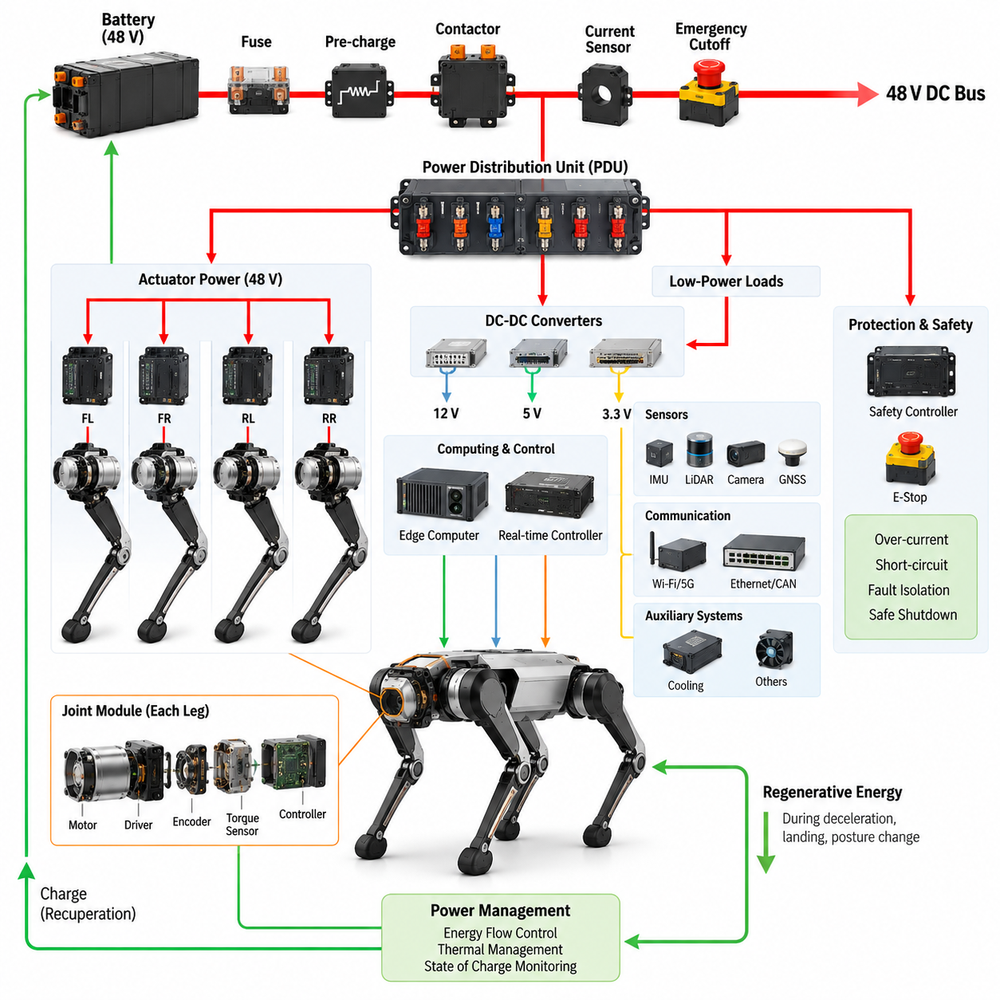
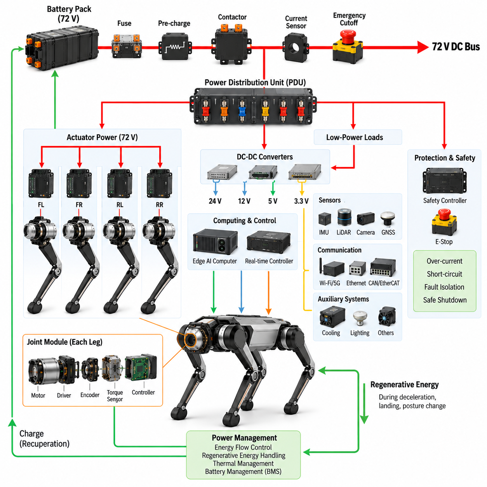
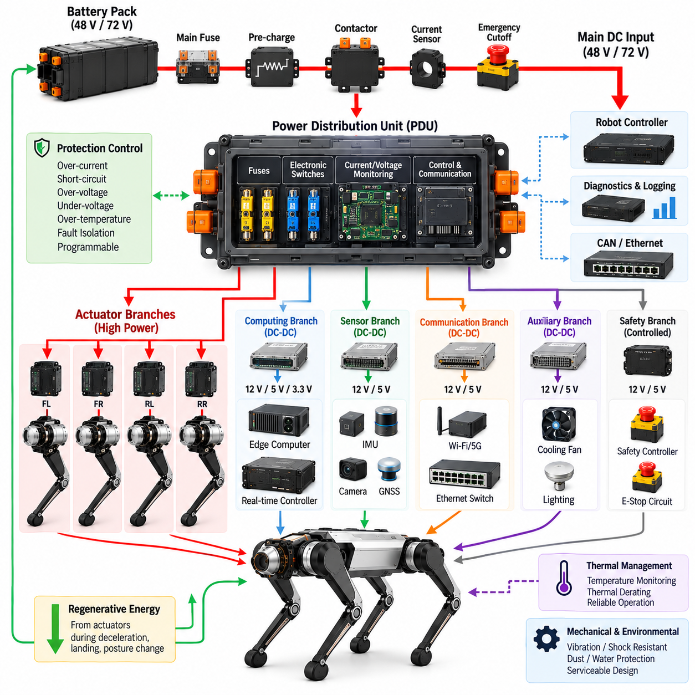
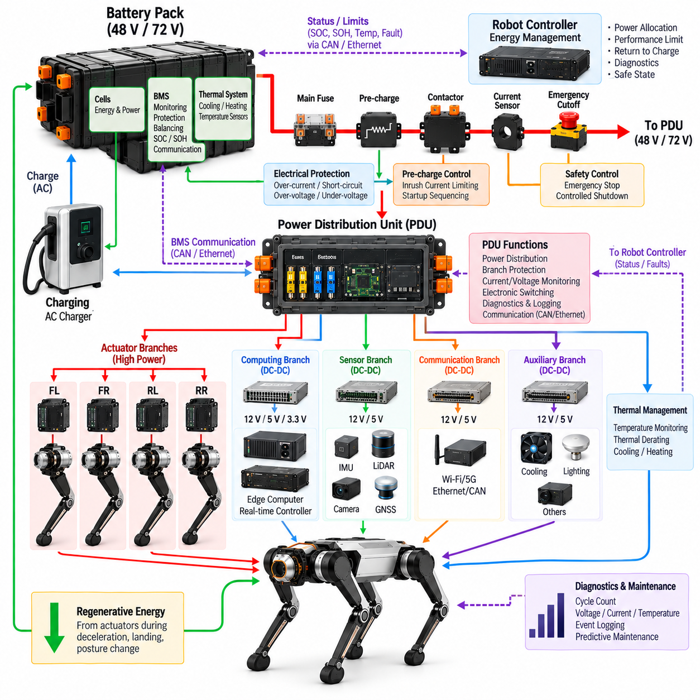
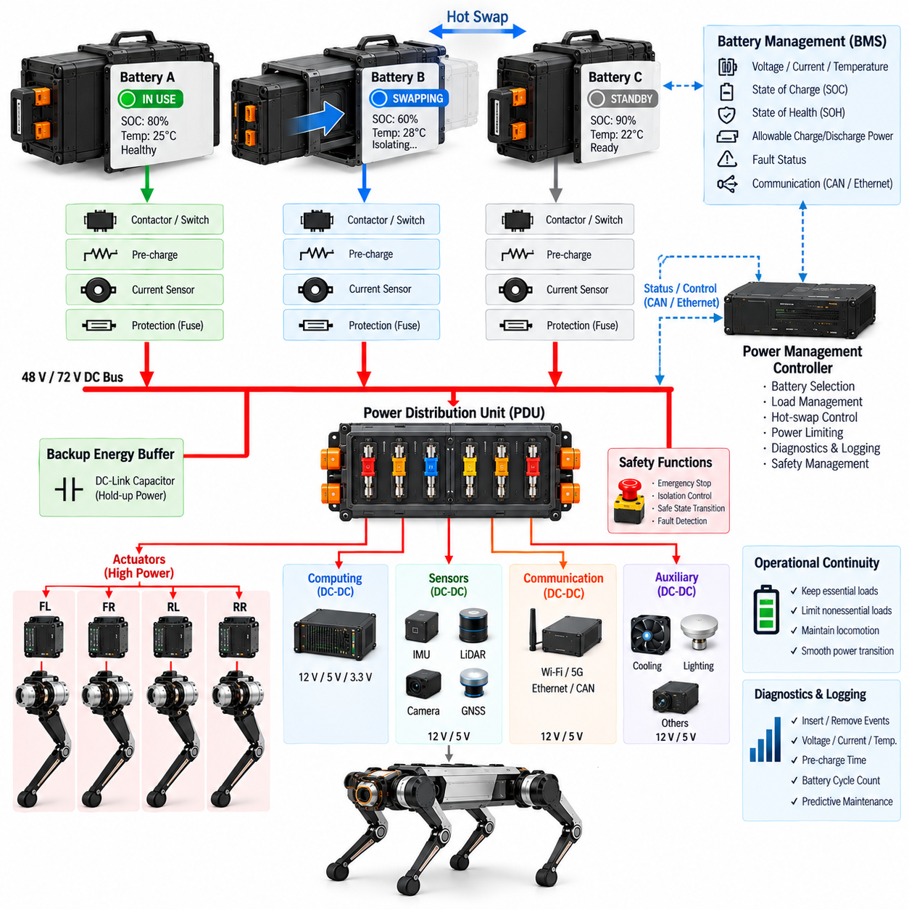
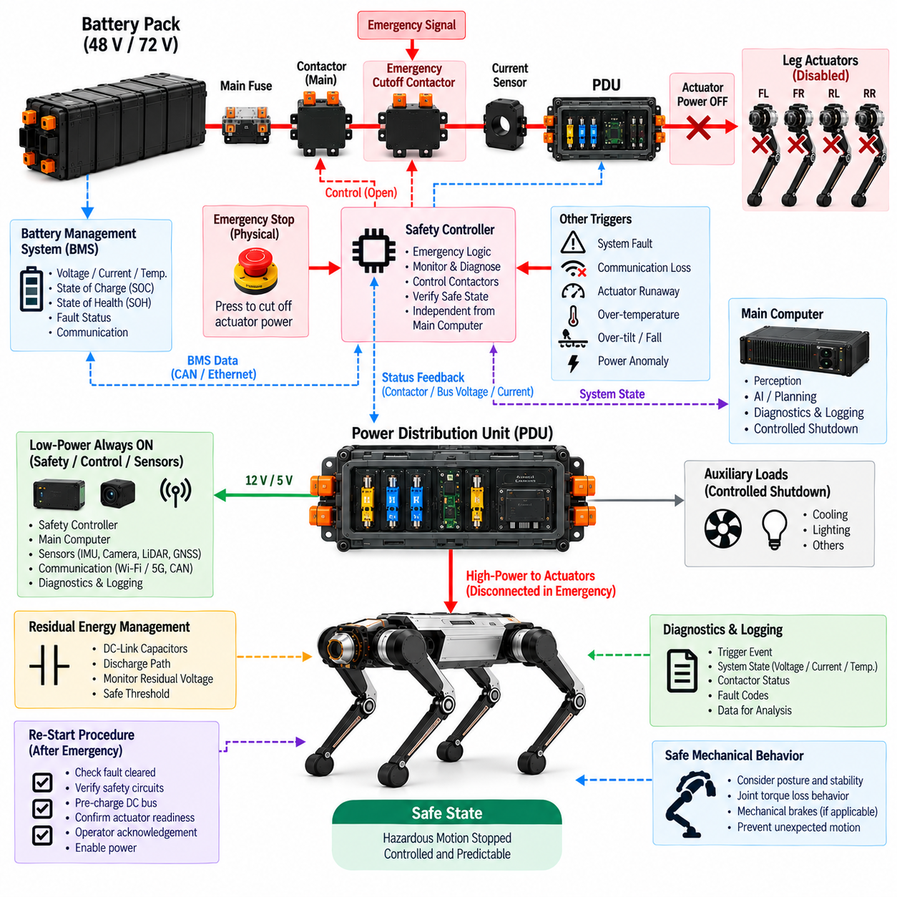

**Volume 20. Quadruped Electrical Architecture**

# Chapter 03. Power Architecture

## 03.01. 48V Architecture

{width="7.268055555555556in" height="7.268055555555556in"}

48 V architecture provides a practical electrical foundation for a quadruped robot by balancing power capability, wiring complexity, actuator requirements, and safety considerations. In a typical architecture, the battery system supplies a nominal 48 V DC bus that distributes energy to the major electrical loads. The bus can support high-power joint actuators while keeping conductor current lower than would be required at conventional low-voltage levels. This makes 48 V particularly suitable for compact mobile robots with multiple electrically driven joints.

The main 48 V power path normally begins at the battery and proceeds through the primary protection and switching elements before reaching the robot power distribution network. Battery protection, pre-charge, contactors, fuses, and emergency power isolation should be considered as part of the complete architecture rather than as independent components. The resulting protected DC bus becomes the common energy source for actuator drives, computing equipment, sensors, communication devices, and auxiliary loads.

Power distribution should be organized so that high-power actuator loads and sensitive electronic loads can be managed appropriately. The joint actuators represent the dominant dynamic power demand because quadruped locomotion continuously changes torque, speed, and regenerative energy flow across multiple joints. The 48 V bus therefore needs sufficient current capability and appropriate protection for simultaneous operation of several actuators while preventing a fault in one branch from unnecessarily disabling the entire robot.

A practical architecture separates the main 48 V distribution from lower-voltage electronic power domains. DC-DC converters can generate regulated rails for the real-time controller, Jetson or other edge computing platforms, sensors, communication equipment, and auxiliary electronics. This separation allows each subsystem to operate within its required voltage range while maintaining a common battery source. It also provides a clear boundary between high-power actuation and low-power computation, simplifying power budgeting, protection, and troubleshooting.

Voltage drop is an important consideration because the robot contains distributed loads and long harness paths extending toward the four legs. The design must account for cable resistance, connector resistance, peak actuator current, temperature, and simultaneous joint operation. Excessive voltage drop can reduce actuator performance and create unstable behavior during high-load motion. The 48 V architecture should therefore be evaluated at both nominal operating conditions and worst-case transient conditions.

The power distribution unit should divide the 48 V bus into controlled branches for the major electrical zones. Actuator branches can be individually protected, while computing, sensing, communication, and auxiliary branches can use appropriately sized protection and conversion stages. Such zoning improves fault containment and serviceability. It also allows individual subsystems to be powered, isolated, or diagnosed without unnecessarily removing power from unrelated parts of the quadruped.

Regenerative energy must also be considered because the actuators can operate as generators during deceleration, posture changes, landing events, or controlled joint motion. The electrical architecture therefore cannot be designed only around battery-to-motor energy flow. The battery, motor drivers, DC bus, and protection system must tolerate or appropriately manage temporary reverse power flow. Energy management becomes especially important when several joints simultaneously regenerate during dynamic locomotion.

The 48 V architecture should be coordinated with the actuator electrical architecture defined in the following chapter. Each joint module may contain a motor, inverter or integrated motor driver, encoder interface, torque sensing, local control electronics, and communication interface. From the system perspective, the 48 V bus supplies the energy required by these distributed joint modules, while local electronics convert that energy into controlled electrical power for the motor. This creates a modular boundary between system-level power distribution and joint-level actuation.

Computing and sensing loads should be treated as electrically sensitive consumers even though their power requirements are generally lower than those of the actuators. Edge computing, real-time control, IMU, LiDAR, cameras, GNSS, and communication equipment require stable and appropriately filtered supply rails. The architecture should prevent actuator switching noise and large current transients from directly disturbing these systems. Proper conversion, filtering, grounding, and power-domain separation therefore become important elements of the overall 48 V design.

Protection and safety must be integrated from the beginning rather than added after the electrical architecture is complete. Over-current protection, short-circuit isolation, emergency power cutoff, controlled startup, and safe shutdown should operate consistently with the robot\'s functional safety concept. A fault in a single actuator or branch should be contained whenever the safety requirements permit. At the same time, safety-critical functions must retain an appropriately defined power path so that the robot can transition to a safe state.

The 48 V architecture also provides a foundation for future expansion. Additional sensors, computing modules, communication equipment, or actuator configurations can be integrated through defined power zones and standardized conversion stages without redesigning the entire electrical system. This modularity is particularly valuable for quadrupeds because the same base platform may support inspection, logistics, research, security, or Physical AI applications with different payloads and computational requirements.

The final architecture should therefore be evaluated as an integrated power system rather than simply as a 48 V battery connection. Battery capability, distribution, protection, DC-DC conversion, actuator demand, regenerative behavior, harness losses, thermal conditions, safety isolation, and subsystem power quality must be considered together. The 48 V design establishes the electrical backbone that connects the battery and power distribution architecture to the actuator, computing, sensing, communication, and safety systems developed throughout the remainder of the quadruped electrical architecture.

## 03.02. 72V Architecture

{width="7.268055555555556in" height="7.268055555555556in"}

A 72 V architecture extends the power capability of a quadruped robot beyond conventional 48 V systems by increasing the DC bus voltage available to high-performance actuators. For a given mechanical power requirement, the higher voltage reduces the current that must flow through cables, connectors, switching devices, and motor windings. This becomes valuable for large or highly dynamic quadrupeds that require high joint torque, rapid acceleration, heavy payload capability, or sustained operation over demanding terrain.

The primary 72 V power path begins with a battery pack designed around the required operating voltage, energy capacity, discharge capability, and thermal limits. Battery output is routed through protection and switching elements such as fuses, current sensing, pre-charge circuitry, contactors, and emergency isolation before reaching the main DC bus. These components must be coordinated as one power-entry system so that startup, normal operation, fault isolation, and shutdown occur in a controlled and predictable sequence.

A major advantage of increasing the bus voltage is reduced distribution current. Because electrical power is approximately the product of voltage and current, raising the operating voltage allows equivalent power to be transmitted at lower current. Lower current can reduce resistive losses and voltage drop and may permit more efficient use of harness conductors. These benefits become increasingly significant when multiple high-power joint actuators operate simultaneously during running, climbing, jumping, or payload transportation.

The 72 V bus is primarily suited to high-power actuation and should not normally be distributed directly to every electronic subsystem. A power distribution unit can divide the main bus into protected actuator branches and converter-fed auxiliary branches. High-voltage DC-DC converters then generate lower-voltage rails required by computing, control, sensing, communication, cooling, and auxiliary electronics. This hierarchical structure preserves the efficiency of high-voltage power distribution while providing regulated supplies for sensitive devices.

Actuator design must be coordinated closely with the selected bus voltage. Motor winding characteristics, inverter voltage ratings, semiconductor devices, DC-link capacitors, connectors, and insulation must all tolerate the expected operating and transient voltage range. The nominal value of 72 V alone is insufficient for component selection because battery charging conditions, regenerative events, switching transients, and system tolerances can raise the actual DC-link voltage above its nominal operating point.

Dynamic locomotion produces rapidly changing electrical loads. When several legs generate propulsion or support high body loads simultaneously, actuator current can rise sharply and create substantial transient demand on the battery and DC bus. Conversely, decelerating joints may return energy to the bus. The architecture must therefore support bidirectional energy behavior, maintaining acceptable bus voltage while managing both high discharge power and temporary regenerative power produced by multiple joints.

Regenerative operation becomes especially important in a higher-voltage system because uncontrolled returned energy can increase the DC bus voltage. During landing, downhill locomotion, rapid joint deceleration, or posture recovery, motor drives may transfer mechanical energy back toward the battery. The battery management system, inverter controls, power distribution system, and energy-management logic should cooperate so that regenerative energy can be accepted, limited, redistributed, or otherwise controlled without exceeding component voltage limits.

The higher operating voltage also increases the importance of electrical isolation, insulation coordination, connector selection, and service procedures. Harness routing must minimize abrasion and mechanical damage while maintaining appropriate separation from sensitive signal wiring. Connectors should be selected according to voltage, current, environmental exposure, vibration, mating cycles, and fault conditions. The architecture should also prevent accidental access to energized conductors during assembly, maintenance, battery replacement, or field servicing.

A zonal distribution strategy can simplify implementation by routing the 72 V supply from the central PDU toward defined actuator regions such as the front-left, front-right, rear-left, and rear-right leg zones. Each zone can contain branch protection, local power conditioning, and distributed motor drives as required. This approach reduces unnecessary point-to-point wiring and creates clearer electrical boundaries for fault diagnosis, modular replacement, harness design, and future platform expansion.

Computing and perception systems remain dependent on clean and stable power even when the actuator network experiences large transients. Edge AI computers, real-time controllers, IMUs, LiDARs, cameras, GNSS receivers, and communication devices should therefore be supplied through regulated conversion stages with suitable filtering and grounding. Electrical separation between high-power motor paths and sensitive electronics helps prevent conducted noise, switching disturbances, and transient voltage events from degrading perception or control reliability.

Protection coordination becomes more demanding as available electrical power increases. Branch fuses or electronic protection devices must distinguish between legitimate actuator peak currents and actual fault currents while isolating short circuits before cables or components are damaged. The main contactor and emergency cutoff path must also be coordinated with the functional safety architecture so that hazardous actuator energy can be removed while necessary control and diagnostic functions transition the robot toward a defined safe state.

Thermal management must be considered together with electrical efficiency. Higher voltage can reduce current-dependent conduction losses in distribution wiring, but substantial heat can still be generated in batteries, motor drives, DC-DC converters, connectors, and actuator motors during demanding missions. Temperature monitoring and thermal derating can therefore become part of power management. The robot should reduce performance gracefully when thermal limits are approached rather than relying solely on abrupt protective shutdown.

The choice between 48 V and 72 V should ultimately be based on system-level requirements rather than voltage alone. A 48 V architecture can provide an effective balance for many compact and medium-power quadrupeds, while 72 V becomes attractive when higher actuator power, heavier payloads, longer distribution paths, or more aggressive dynamic performance make current reduction increasingly valuable. The decision influences the battery, PDU, motor drives, harnesses, connectors, protection devices, DC-DC converters, thermal design, and service strategy.

A well-designed 72 V architecture therefore functions as an integrated energy backbone connecting the battery to distributed actuation while supporting lower-voltage computing, sensing, communication, and safety domains through controlled conversion. Battery capability, transient behavior, regenerative energy, protection coordination, harness losses, insulation, thermal limits, and actuator requirements must be evaluated together. Within the quadruped electrical architecture, this power layer provides a scalable foundation for higher-performance platforms and demanding Physical AI missions.

## 03.03. PDU Design

{width="7.268055555555556in" height="7.268055555555556in"}

The power distribution unit serves as the central electrical node between the quadruped battery system and distributed electrical loads. It receives the protected main DC supply, typically from a 48 V or 72 V battery architecture, and divides this energy into controlled branches for actuators, computing, sensors, communication equipment, and auxiliary systems. Its design directly affects electrical safety, fault containment, power availability, harness complexity, diagnostics, and overall robot serviceability.

The PDU input stage should be coordinated with the battery, battery management system, main fuse, pre-charge circuit, contactors, current sensing, and emergency power cutoff. Rather than treating these devices as unrelated components, the architecture should define their operating sequence during startup and shutdown. Controlled energization prevents excessive inrush current into motor-drive and converter capacitors, while controlled disconnection ensures that stored electrical energy does not create unexpected actuator behavior or equipment damage.

Branch organization should reflect the physical and functional structure of the quadruped. High-power outputs can be assigned to the front-left, front-right, rear-left, and rear-right actuator zones, while separate branches supply computing, perception, communication, cooling, and auxiliary loads. This arrangement supports a zonal electrical architecture in which faults can be localized to specific regions. It also simplifies harness routing because power can be distributed toward defined physical zones instead of individually wiring every device from a central location.

Actuator branches require particular attention because they experience high peak currents and rapidly changing loads during locomotion. Walking, running, climbing, jumping, landing, and posture control can create substantially different current profiles even when average power remains moderate. Protection devices must therefore tolerate legitimate short-duration actuator peaks while still responding rapidly to abnormal overloads or short circuits. Proper coordination prevents nuisance trips without sacrificing protection of cables, connectors, motor drives, or battery systems.

Protection coordination is one of the primary engineering functions of the PDU. The main protection device establishes an overall system boundary, while downstream branch protection isolates faults closer to their source. Fuse or electronic protection ratings should be coordinated with conductor current capacity, connector ratings, expected load profiles, thermal conditions, and fault-current capability. Ideally, a downstream fault should disconnect only the affected branch rather than unnecessarily removing electrical power from the complete robot.

The PDU can incorporate intelligent electronic switching instead of relying exclusively on conventional fuses and relays. Solid-state switches, electronic circuit breakers, current monitors, and programmable protection devices can provide controlled branch activation and detailed electrical diagnostics. Such devices may detect over-current, short-circuit, over-temperature, under-voltage, or abnormal consumption patterns. Their telemetry can be transmitted to the robot controller so that electrical power distribution becomes an observable and controllable subsystem.

Current and voltage monitoring provide important information for both real-time operation and long-term system health. Measuring the main bus and selected branch currents allows the robot to estimate power consumption and identify abnormal behavior. Joint-drive degradation, damaged wiring, excessive mechanical friction, or failing auxiliary equipment may appear as changes in electrical load signatures. PDU telemetry can therefore support system health monitoring, event logging, remote diagnostics, and predictive maintenance functions described later in the architecture.

The PDU must also support the separation between actuator power and sensitive electronic power. High-power motor drives generate switching noise and substantial transient currents, while edge computers, real-time controllers, IMUs, LiDARs, cameras, GNSS modules, and communication devices require stable electrical supplies. Separate protected branches and dedicated DC-DC conversion paths help prevent actuator disturbances from propagating into computing and perception systems. Grounding and filtering strategies should be coordinated with this power-domain structure.

Regenerative energy introduces an additional design requirement because the power network is not always unidirectional. During joint deceleration, landing, downhill motion, or posture changes, motor drives can return energy to the main DC bus. The PDU must therefore tolerate the expected reverse-energy behavior without creating excessive voltage stress or unintended protection activation. Coordination among the motor drives, battery management system, DC-link components, and system-level energy management is necessary to maintain a stable bus.

Thermal design is closely connected to electrical protection. Busbars, conductors, terminals, fuses, switches, contactors, and electronic protection devices generate heat according to current, resistance, switching losses, and environmental conditions. The PDU should be designed for both continuous current and realistic peak-load duty cycles. Temperature sensing at critical locations can provide additional protection, while thermal derating can reduce allowable current before component temperatures reach damaging levels.

Mechanical packaging is particularly important for a quadruped because the PDU operates in a platform exposed to repeated vibration, impact, body motion, and potentially harsh environments. The enclosure, internal busbars, printed circuit boards, fasteners, terminals, and connectors must withstand these mechanical loads without loosening or developing intermittent connections. Environmental protection against dust and moisture may also be required depending on the mission, while the installation location should remain accessible enough for inspection and maintenance.

Connector and harness interfaces should be designed together with the PDU rather than after its electrical design is completed. Each output must match the voltage, continuous and peak current, wire gauge, sealing requirement, vibration environment, and service expectations of its branch. Clear connector keying and physical separation can reduce incorrect assembly. Modular interfaces also make it easier to replace a leg, actuator group, compute module, or sensor subsystem without extensive disassembly of the central electrical system.

Safety-related loads require deliberate treatment within the distribution architecture. An emergency stop may require removal of actuator energy while selected controllers, monitoring circuits, or communication functions remain powered long enough to execute a controlled transition and record diagnostic information. Consequently, the PDU can contain separately controlled power domains rather than a single switch that removes all electrical energy simultaneously. The exact behavior should follow the robot\'s functional safety concept and defined safe-state strategy.

Startup and shutdown sequencing can be implemented through coordinated PDU control. Low-power controllers may be energized first to verify battery condition, communication, isolation status, actuator readiness, and other prerequisites before high-power branches are enabled. During shutdown, actuator power can be removed before selected computing and diagnostic systems are turned off. This sequencing improves predictability and allows the robot to detect electrical faults before enabling potentially hazardous motion.

A well-designed PDU therefore functions as more than a passive collection of fuses and connectors. It becomes the controlled interface connecting the battery and 48 V or 72 V backbone to distributed actuators, computing, sensing, communication, safety, and auxiliary systems. Protection coordination, zonal distribution, monitoring, regenerative behavior, thermal design, environmental robustness, diagnostics, and serviceability must be considered together. This integrated role makes the PDU a fundamental element of the quadruped power architecture.

## 03.04. Battery Integration

{width="7.268055555555556in" height="7.268055555555556in"}

Battery integration in a quadruped robot connects the energy-storage system to the complete electrical architecture rather than treating the battery as an independent power source. The battery must interface correctly with the 48 V or 72 V power backbone, PDU, actuator network, computing systems, charging equipment, and safety functions. Mechanical packaging, electrical protection, communication, thermal behavior, and serviceability must therefore be developed as coordinated parts of the integration.

Battery selection begins with the robot\'s mission-level energy and power requirements. Capacity determines the available operating time, while maximum continuous and peak discharge capability determines whether the battery can support simultaneous high-torque operation of multiple joints. Walking may require moderate average power, but acceleration, climbing, jumping, recovery, and payload transportation can generate substantially higher transient demands that must be included when sizing the battery system.

The nominal battery voltage must match the selected system power architecture. A 48 V platform requires a battery configuration whose normal operating range is compatible with the corresponding motor drives and DC-DC converters, while a 72 V platform requires components designed for its higher voltage range. Engineering decisions should consider not only nominal voltage but also fully charged voltage, minimum usable voltage, voltage sag under load, regenerative overvoltage, and component tolerances.

The battery management system provides the primary interface between individual cells and the robot-level power architecture. It monitors parameters such as cell voltage, pack voltage, current, temperature, and state of charge while protecting the battery against abnormal operating conditions. Depending on the implementation, it may also estimate state of health, record battery events, manage balancing, and communicate operational limits to the main robot controller or energy-management system.

Electrical protection must be coordinated between the battery pack and PDU. A main fuse provides protection against severe over-current conditions, while contactors provide controlled connection and disconnection of the battery from the main DC bus. Current sensing supports protection and energy estimation, and a pre-charge circuit limits the initial charging current flowing into DC-link capacitors located in motor drives, converters, and other downstream electronics when the high-power bus is first energized.

Pre-charge sequencing is particularly important because connecting a battery directly to an uncharged DC bus can produce a large inrush current. The control system can initially connect the bus through a pre-charge resistor, monitor the rise of the DC-link voltage, and close the main contactor only after an acceptable voltage relationship has been established. Abnormal pre-charge time, insufficient voltage rise, or unexpected current can also provide useful diagnostic indications of downstream electrical faults.

Battery integration must account for the highly dynamic load profile produced by quadruped locomotion. Multiple actuators continuously exchange electrical and mechanical energy as the legs support body weight, accelerate joints, absorb impacts, and control posture. Battery voltage can therefore fluctuate rapidly as load changes. The battery, PDU, motor drives, and control system should be designed so that transient voltage sag does not cause actuator undervoltage, controller resets, or loss of perception and communication functions.

Regenerative energy creates the opposite condition because motor drives can return electrical energy toward the battery. This can occur during joint deceleration, landing, downhill motion, or rapid posture changes. The battery must be capable of accepting regeneration within its allowable charging limits, and the BMS should communicate restrictions when temperature, state of charge, or other conditions reduce charging capability. System controls must prevent returned energy from driving the DC bus beyond acceptable voltage limits.

Thermal integration is essential because battery performance, lifetime, charging capability, and safety are strongly influenced by temperature. High actuator demand can increase internal battery heating, while low environmental temperature can reduce available power and regenerative charging capability. Temperature sensors should represent critical regions of the pack, and the robot may require passive conduction, forced-air cooling, or another thermal-management strategy depending on battery chemistry, enclosure design, mission duration, and environmental conditions.

Mechanical integration must protect the battery while maintaining acceptable robot mass distribution. Battery position influences the center of gravity, body inertia, stability, and leg loading, so packaging should be considered together with mechanical and locomotion design. The enclosure and mounting structure must tolerate vibration, repeated impacts, and shock generated by walking, running, or landing. At the same time, the pack should remain accessible enough for inspection, replacement, and maintenance.

Battery connectors and high-current interfaces must be selected for the system voltage, continuous current, transient current, environmental exposure, vibration, and expected mating cycles. Mechanical keying and secure retention help prevent incorrect or incomplete connections. High-current terminals should minimize contact resistance because even small resistance can generate significant heating at elevated current. Signal interfaces for BMS communication should also be protected against noise generated by nearby motor-drive power circuits.

The battery communication interface allows power availability to become part of robot-level decision making. State of charge, pack temperature, voltage, current, fault status, and permitted charge or discharge power can be shared with the main controller through an appropriate communication network. The robot can then modify locomotion performance, restrict payload-intensive actions, initiate return-to-charge behavior, or enter a controlled safe state before electrical limits are exceeded.

Startup and shutdown should be coordinated with the battery, BMS, PDU, and safety controller. During startup, low-power electronics can verify battery status and system readiness before enabling the main contactor and actuator branches. During shutdown, high-power actuation can be disabled first while selected controllers remain active for logging and controlled power-down. Emergency conditions may require a faster isolation path, but the resulting electrical state should still correspond to the defined functional safety strategy.

Battery integration should also support diagnostics and lifecycle management. Charge and discharge cycles, maximum and minimum cell voltages, temperature exposure, peak currents, fault events, and accumulated energy throughput can provide valuable information about battery degradation. Combining this information with robot operating history enables maintenance decisions to be based on actual usage rather than fixed replacement intervals and can help identify abnormal battery behavior before mission capability is significantly affected.

A properly integrated battery therefore becomes an actively managed subsystem within the quadruped electrical architecture. Energy capacity, peak power, voltage range, BMS functionality, pre-charge, contactors, protection, regenerative energy, thermal behavior, mechanical packaging, communication, diagnostics, and safety must operate as a coordinated system. This integration creates a reliable energy foundation connecting the battery to the PDU and distributed electrical loads while supporting the dynamic power demands of advanced quadruped and Physical AI operation.

## 03.05. Hot Swap Battery

{width="7.268055555555556in" height="7.268055555555556in"}

A hot-swap battery architecture allows a quadruped robot to replace or exchange an energy-storage module while minimizing interruption to system operation. Unlike a conventional removable battery, hot swapping requires coordinated electrical, mechanical, communication, and control functions so that battery connection changes do not create uncontrolled current flow or system resets. The concept is especially valuable for inspection, logistics, security, and other missions where long operational availability is more important than relying on a single large battery.

The architecture can use multiple battery modules connected to a common 48 V or 72 V DC power backbone through individually controlled power interfaces. During replacement, at least one energy source remains connected while another module is electrically isolated and physically removed. The remaining source must temporarily support essential robot loads. Consequently, battery capacity, discharge capability, PDU configuration, and power-management logic must be designed around both normal multi-battery operation and reduced-source operation.

True hot swapping requires electrical isolation before a battery connector is physically separated. Contactors, solid-state switches, or other controlled disconnect devices can isolate the selected module from the common DC bus while preventing interruption of the remaining power path. The control system should confirm that the battery is no longer carrying significant current before removal. This controlled transition reduces electrical arcing, connector damage, voltage disturbances, and unintended shutdown of computing or control systems.

Pre-charge becomes equally important when a replacement battery is inserted. The incoming module should not be connected directly to a DC bus containing large capacitance or operating at a different voltage. A controlled pre-charge path can reduce the voltage difference between the battery interface and common bus before the main switching device closes. Voltage monitoring, timing supervision, and fault detection should verify that synchronization has completed correctly before the new battery is permitted to supply substantial current.

Parallel battery operation introduces additional requirements because two packs may have different voltages, temperatures, states of charge, internal resistance, or degradation levels. Directly connecting significantly different batteries can produce undesirable equalization current between the packs. The hot-swap controller or PDU should therefore evaluate battery conditions before establishing a parallel connection. Acceptable voltage difference and operating limits should be defined so that module insertion does not create excessive transient current.

Each removable battery should contain or interface with a battery management system capable of reporting its operating condition. Pack voltage, current, temperature, state of charge, state of health, fault status, and allowable charge or discharge power can be communicated to the robot controller. When multiple batteries are installed, the power-management system can use this information to determine which modules may be connected, disconnected, charged, or temporarily isolated during operation.

The PDU plays a central role in hot-swap coordination because it connects multiple battery sources to the robot\'s distributed electrical loads. Individual battery inputs can include dedicated protection, switching, current measurement, and status monitoring before joining the common power bus. This arrangement allows one battery path to be disconnected without removing power from unrelated branches. The PDU can also report source status and abnormal electrical conditions to higher-level energy-management and diagnostic functions.

Essential and nonessential loads should be distinguished when designing the reduced-power operating state. During a battery exchange, the remaining source may need to support the real-time controller, safety controller, communication network, perception sensors, and selected actuator functions while high-consumption auxiliary loads are temporarily reduced. The robot can also limit locomotion speed, joint torque, payload operation, or computing performance until the replacement battery has been successfully connected.

A small energy buffer can further improve continuity during switching transitions. Depending on system requirements, DC-link capacitance or another short-duration energy-storage element may support critical electronics while contactors change state. Such buffering should not be considered a substitute for proper source redundancy, but it can prevent short voltage interruptions from resetting computers or communication devices. Hold-up time should be derived from actual switching behavior and critical-load requirements.

Mechanical design is as important as electrical switching because battery replacement must be rapid, repeatable, and resistant to incorrect insertion. Guides, latches, handles, alignment features, connector keying, and retention mechanisms should allow the pack to engage securely while tolerating vibration and impact during quadruped operation. The battery must remain mechanically locked during dynamic motion, yet service personnel or automated equipment should be able to release it through a controlled procedure.

Connector sequencing can improve safety and reliability. Mechanical or electrical interlocks may ensure that communication and presence-detection contacts establish the battery state before the high-current terminals become active. Similarly, high-current power can be disabled before the connector is mechanically disengaged. This sequence allows the robot to detect insertion and removal events, validate battery identity and condition, perform pre-charge, and activate the main power path only after the required conditions have been satisfied.

Thermal conditions must also be evaluated before accepting a replacement module. A battery that is excessively hot or cold may have reduced discharge or regenerative charging capability even if its voltage and state of charge appear acceptable. The BMS should communicate these limits so that the robot can reject an unsuitable pack or operate with reduced performance. This prevents the hot-swap function from bypassing battery protection merely to maintain continuous robot availability.

Hot swapping must be integrated with functional safety and system-state management. Battery removal should be permitted only when the selected module is electrically isolated and the remaining energy sources can maintain the required safe operating state. If insufficient power remains, the robot may need to enter a stable posture before allowing removal. Faults involving contactors, interlocks, communication, unexpected current flow, or bus voltage should inhibit the exchange and trigger an appropriate controlled response.

Diagnostics and event logging are important because repeated battery exchange creates additional connector, switching, and battery lifecycle events. The system can record insertion and removal time, battery identity, state of charge, voltage difference, pre-charge duration, contactor status, temperature, fault events, and accumulated cycles. This information supports troubleshooting and predictive maintenance and can identify deteriorating connectors, abnormal battery modules, or switching mechanisms before they cause mission interruption.

A well-designed hot-swap battery system therefore combines redundant energy sources, controlled isolation, pre-charge, battery communication, PDU coordination, mechanical interlocking, thermal supervision, diagnostics, and safety logic into one integrated architecture. Its objective is not merely rapid battery replacement, but controlled energy-source transition without destabilizing the robot. For long-duration quadruped and Physical AI missions, this capability can significantly improve availability while preserving electrical protection, operational continuity, and serviceability.

## 03.06. Emergency Power Cutoff

{width="7.268055555555556in" height="7.268055555555556in"}

Emergency power cutoff provides a dedicated mechanism for rapidly removing hazardous electrical energy from a quadruped robot when continued actuator operation could create an unacceptable risk. It is not simply a general power switch. The cutoff function must be coordinated with the battery, PDU, actuator power domains, safety controller, and system-state logic so that dangerous motion is stopped while the robot transitions toward a defined safe electrical and mechanical condition.

The primary objective is to interrupt energy capable of producing hazardous motion. In a 48 V or 72 V architecture, this normally means disconnecting the high-power DC path supplying motor drives and joint actuators. Depending on the safety concept, low-power domains for safety monitoring, diagnostics, communication, or controlled shutdown may remain energized. Separating hazardous actuator power from essential control power allows the robot to stop motion without necessarily losing all awareness of its condition.

The cutoff path should be positioned so that it can isolate the main actuator energy source effectively. A typical architecture includes the battery, main protection, contactor system, PDU, and protected actuator branches. Emergency activation can command the relevant contactors or safety-rated switching devices to open, preventing further battery energy from reaching the motor drives. The exact switching boundary should be selected according to the hazards identified during system-level risk assessment.

An emergency stop request can originate from several sources. A physical emergency-stop device provides a direct human interface, while the safety controller may also initiate power removal after detecting critical faults. Depending on the platform, additional triggers can include severe communication loss, actuator runaway, abnormal power conditions, excessive inclination, thermal faults, or other safety-related events. These triggers should converge on a deterministic cutoff strategy rather than depending solely on high-level application software.

The safety path should remain sufficiently independent from normal motion-control software. If the main computer, AI application, ROS 2 software, or communication stack fails, the emergency cutoff must still be capable of removing hazardous actuator energy. A dedicated safety controller, hardwired emergency circuit, monitored contactor interface, or equivalent architecture can provide this independence. The purpose is to prevent a single software or computing failure from defeating the final electrical means of stopping dangerous motion.

Contactor behavior requires careful design because opening the battery circuit does not instantly eliminate all stored energy. Motor-drive DC-link capacitors and other power electronics may remain charged after the main source has been disconnected. The architecture should therefore consider residual voltage, discharge paths, and the time required for stored energy to fall below the defined safe threshold. Diagnostic monitoring can verify that the high-power bus actually reaches the expected de-energized condition.

Actuator behavior during power removal must also be analyzed mechanically. A quadruped can lose joint torque when motor drives are disabled, potentially causing the body to collapse or move unexpectedly. Consequently, emergency cutoff cannot be designed only from an electrical perspective. Robot posture, gravity, joint transmission characteristics, mechanical brakes where applicable, and the expected behavior of each leg should be considered when defining the safest response to different classes of emergency.

Some faults may permit a controlled stop before complete power isolation. If sufficient control capability remains, the robot can reduce velocity, place its feet in a stable configuration, lower the body, and then disconnect actuator power. Other events, such as a severe electrical short circuit or uncontrolled actuator behavior, may require immediate energy removal. The safety architecture should therefore distinguish between controlled shutdown and rapid cutoff according to the severity and immediacy of the detected hazard.

The PDU supports emergency cutoff by separating and controlling different power domains. Actuator branches can be disabled while selected computing, sensing, communication, and safety branches remain powered. This permits the safety controller to verify cutoff status, record fault information, communicate the robot condition, and supervise residual energy. Such domain separation also improves troubleshooting because engineers can determine whether the event originated from the battery, PDU, actuator network, or another subsystem.

Feedback monitoring is necessary to confirm that a commanded cutoff actually occurred. The safety controller should not assume that a contactor opened merely because an open command was issued. Auxiliary contact feedback, bus-voltage measurement, branch-current sensing, or equivalent diagnostic signals can be used to verify the electrical state. A welded contactor, failed switch, unexpected backfeed, or persistent bus voltage should therefore be detected as a safety-relevant fault rather than remaining hidden.

Regenerative energy must be considered during emergency stopping because decelerating joints may temporarily return energy to the DC bus. If the battery has already been isolated, this returned energy can raise the bus voltage unless another path absorbs or controls it. Motor-drive behavior, DC-link capacitance, discharge circuitry, and cutoff sequencing should therefore be coordinated. The emergency strategy must account for both energy flowing from the battery and energy generated by the moving robot itself.

Reset and restart behavior is as important as the initial cutoff. Restoration of actuator power should not occur automatically when an emergency signal disappears. The system should confirm that the triggering condition has been cleared, safety circuits are healthy, battery and bus conditions are acceptable, and the robot is in a state where re-energization will not create unexpected motion. Depending on the application, deliberate operator acknowledgement or another controlled reset action may be required before power is restored.

Re-energization should follow the normal controlled startup sequence rather than immediately closing the main contactor. The system can first activate low-power controllers, validate communication and safety status, perform DC-bus pre-charge, verify actuator readiness, and only then enable the high-power branches. This prevents emergency recovery from bypassing the electrical protections established for normal startup and reduces the possibility of large inrush currents or uncontrolled actuator initialization.

Physical implementation must consider accessibility and environmental robustness. Emergency-stop devices should be positioned so that personnel can reach them quickly without approaching hazardous moving components. Wiring, connectors, switches, and contactors associated with the cutoff path must tolerate vibration, shock, contamination, and repeated operation expected during field use. The design should also support inspection and maintenance so that degradation of the emergency circuit can be detected before a real emergency occurs.

Diagnostics and event logging provide evidence for troubleshooting and safety validation. The robot can record the cutoff trigger, system state, battery voltage, bus voltage, branch currents, contactor feedback, actuator status, temperature, and relevant fault codes around the event. These records help reconstruct the sequence that produced the shutdown and determine whether the cutoff system responded correctly. Repeated events can also reveal developing electrical, actuator, or mechanical problems.

Emergency power cutoff therefore forms the final electrical barrier between available battery energy and hazardous actuator motion. Its effectiveness depends on coordinated battery isolation, PDU domain control, independent safety logic, contactor monitoring, residual-energy management, regenerative-energy handling, safe mechanical behavior, controlled reset, and diagnostic verification. Within the quadruped power architecture, this function ensures that the 48 V or 72 V energy backbone can be deliberately and predictably placed into a safe state when abnormal conditions demand immediate protection.
