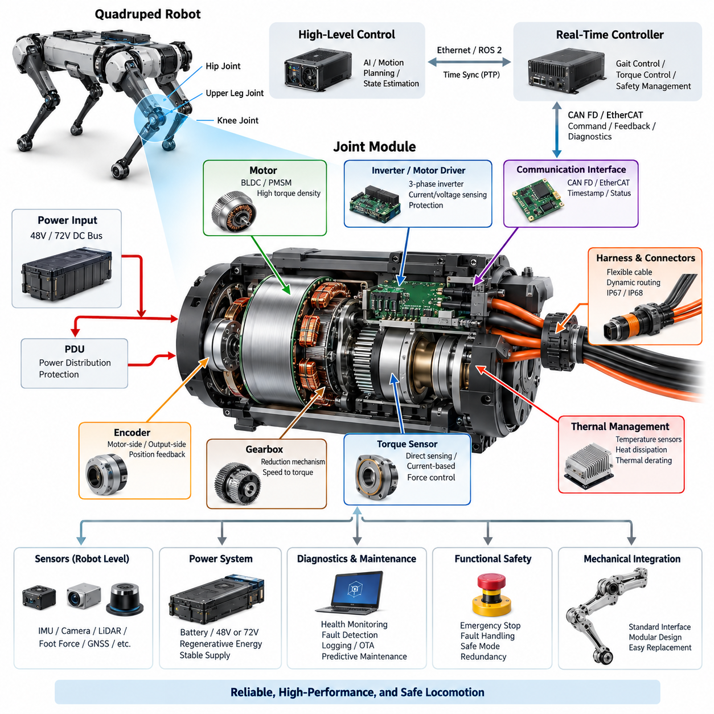
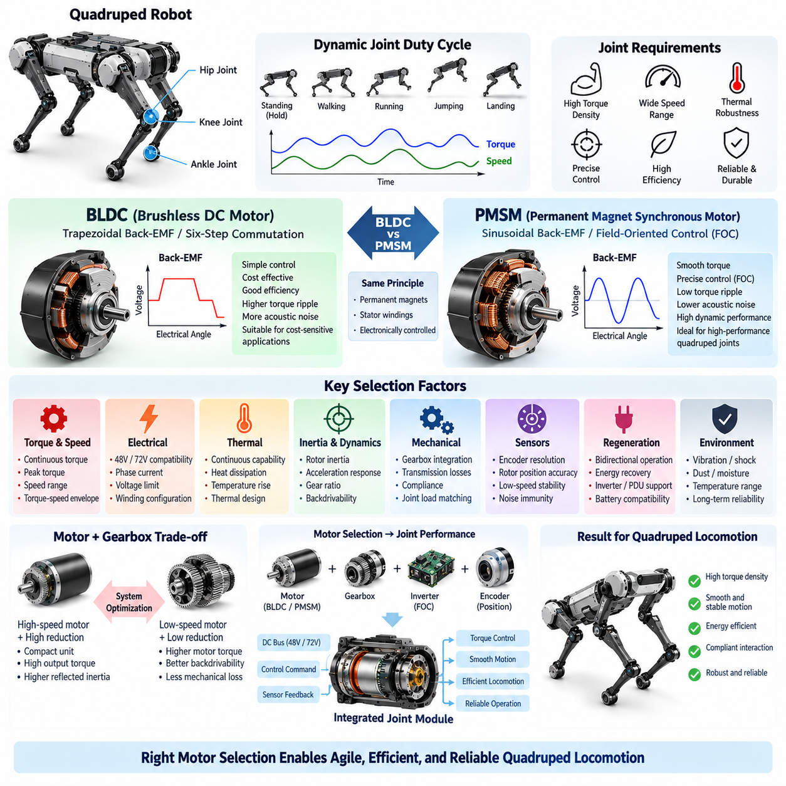
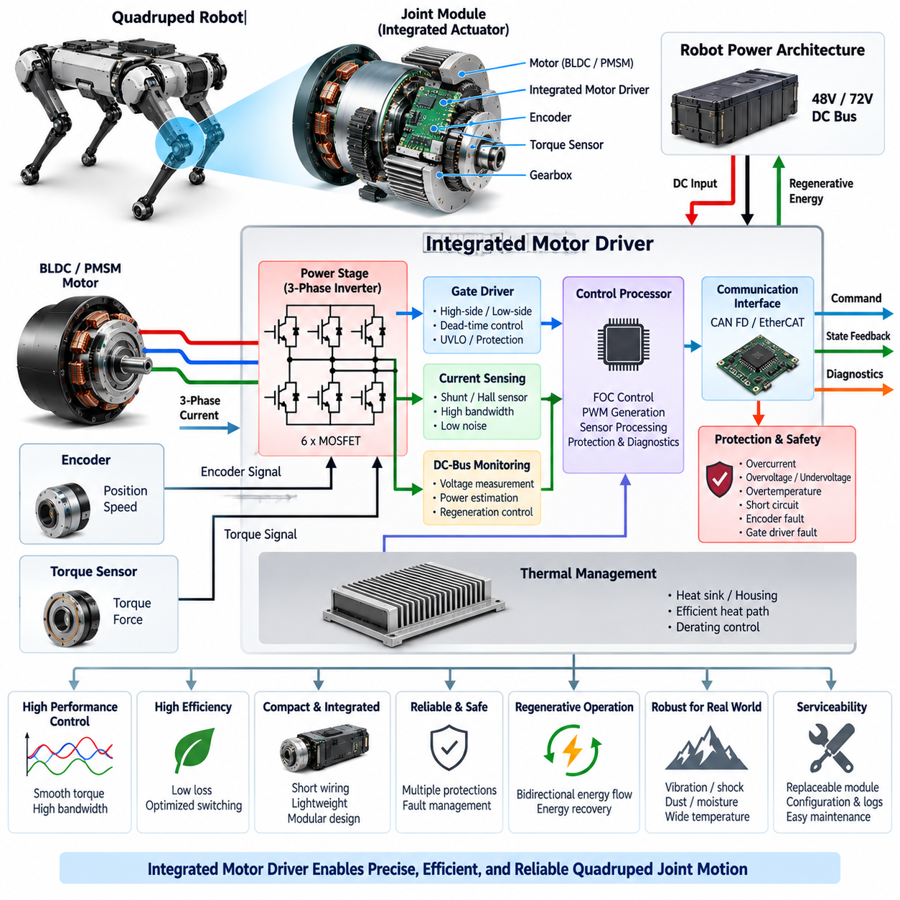
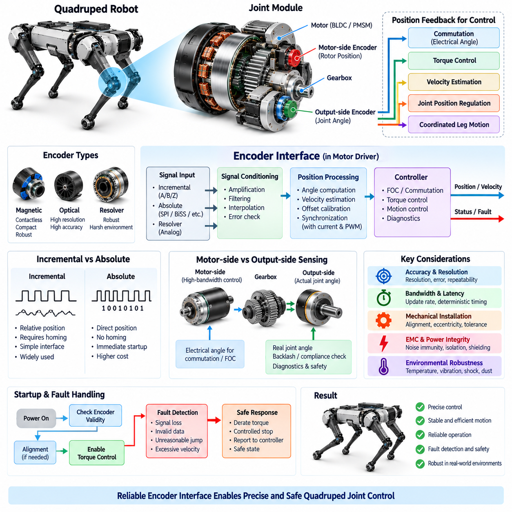
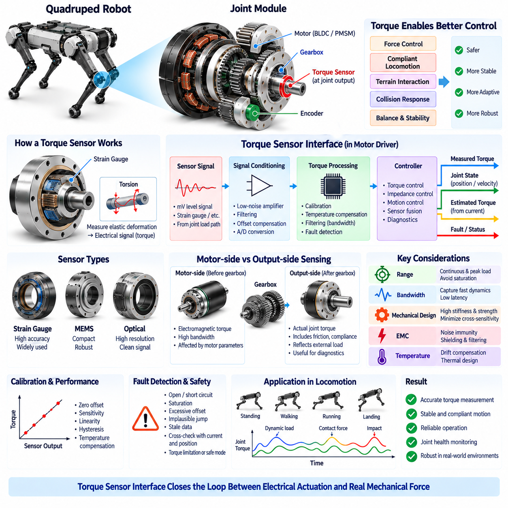
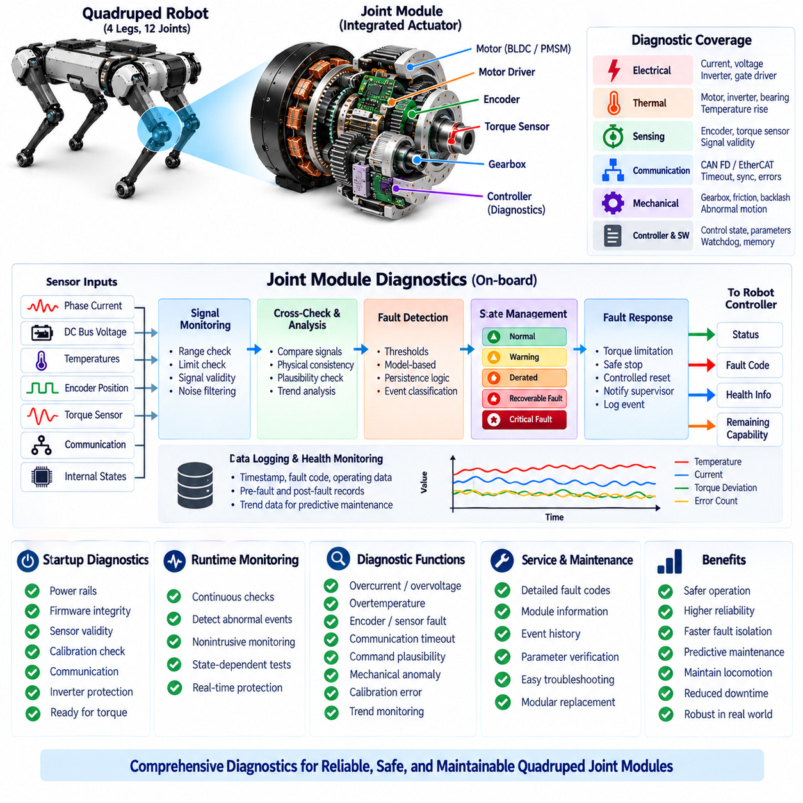

**Volume 20. Quadruped Electrical Architecture**

# Chapter 04. Actuator Electrical Architecture

## 04.01. Joint Module Overview

{width="7.268055555555556in" height="7.268055555555556in"}

A quadruped joint module is the fundamental electromechanical building block that converts electrical energy and digital motion commands into controlled joint torque, position, and velocity. In the architecture of a quadruped robot, multiple joint modules are distributed across the hip, upper-leg, and knee regions, forming a tightly coordinated actuator network that supports locomotion, posture control, balance, and interaction with terrain.

Unlike a conventional industrial servo axis mounted on a rigid machine frame, a quadruped joint operates continuously under changing orientation, impact loading, acceleration, vibration, and external disturbance. The electrical architecture must therefore be designed together with the mechanical transmission, motor, sensing system, thermal path, communication interface, and local control electronics rather than treating the actuator as an isolated motor and drive combination.

At the center of the module is typically a high-torque-density brushless motor, implemented using a BLDC or PMSM topology depending on the required control strategy and electromagnetic design. The motor converts DC-bus power into mechanical rotation, while a reduction mechanism adapts motor speed and torque to the joint requirement. Motor selection must consider continuous torque, peak torque, speed range, efficiency, inertia, thermal limits, and regenerative operating conditions.

The motor driver forms the power-electronic interface between the robot power bus and the motor windings. It commonly integrates a three-phase inverter, gate drivers, current sensing, voltage monitoring, temperature measurement, and protection circuits. High-rate current control allows the module to regulate electromagnetic torque, while position and velocity loops may execute locally or be coordinated by a higher-level real-time controller depending on the distributed-control architecture.

Joint position feedback is normally obtained from an encoder associated with the motor shaft, joint output, or both. Motor-side sensing supports precise commutation and high-bandwidth control, while output-side sensing can capture the actual mechanical joint position after transmission effects. Dual sensing can also expose backlash, compliance, transmission deformation, or abnormal motion, providing valuable information for control performance, calibration, diagnostics, and functional monitoring.

Torque information provides another important feedback channel because quadruped locomotion depends strongly on controlled interaction forces. Torque may be estimated from phase current and motor constants or measured using a dedicated torque sensor integrated into the mechanical load path. Direct sensing can improve force control and contact estimation, while current-based estimation reduces hardware complexity but becomes dependent on friction, transmission efficiency, temperature, and accurate motor characterization.

The joint electronics must communicate with the robot\'s real-time control system through a deterministic network. The broader quadruped architecture can employ CAN FD or EtherCAT for actuator-level communication, while Gigabit Ethernet and ROS 2/DDS serve higher computing and system-integration layers. The actuator interface should carry commands, feedback, diagnostic status, timestamps, operating modes, and fault information with predictable latency.

Power distribution to joint modules must accommodate highly dynamic loads because walking, running, jumping, recovery, and disturbance rejection can produce large transient currents. Several actuators may demand peak torque simultaneously, causing bus-voltage variation and substantial battery loading. Conversely, decelerating joints may return regenerative energy to the DC bus. The joint architecture must therefore operate coherently with the robot\'s 48 V or 72 V power architecture and PDU protection strategy.

Local energy storage and DC-link capacitance near the inverter help stabilize the electrical supply during rapid switching and torque transients. Their placement, capacitance, ripple-current capability, temperature rating, and connection impedance affect both actuator performance and electromagnetic compatibility. Protection against overcurrent, overvoltage, undervoltage, reverse conditions, short circuits, and excessive temperature must act quickly enough to prevent a localized actuator fault from propagating through the shared robot power network.

Thermal management is inseparable from joint electrical design. Copper losses in the motor, switching and conduction losses in the inverter, transmission losses, and repeated peak-torque events generate heat within a compact enclosure. Temperature sensors placed around motor windings, power semiconductors, PCB regions, or structural heat paths enable thermal derating and shutdown strategies. The objective is to maximize usable torque without exceeding component or insulation limits.

Mechanical packaging places unusual constraints on wiring and connectors because every electrical path near an articulated joint experiences repeated motion. Power conductors, encoder lines, sensor interfaces, and communication cables must tolerate bending, torsion, vibration, and millions of motion cycles. The broader volume therefore treats leg flex harnesses, dynamic cable routing, environmental sealing, connector selection, and serviceability as dedicated engineering topics rather than secondary packaging details.

A modular joint architecture also simplifies robot assembly and maintenance when electrical, mechanical, and communication interfaces are standardized. A module can expose defined DC power, network communication, synchronization, diagnostic, and service interfaces while encapsulating motor-control implementation details. Such modularity supports replacement of a failed actuator, configuration management across different joint types, controlled firmware deployment, and reuse of common electronics across multiple legs or robot variants.

Joint-level diagnostics should continuously evaluate motor current, bus voltage, encoder validity, torque-sensor plausibility, temperatures, communication quality, controller state, and internal protection events. These observations allow the system to distinguish transient overloads from persistent faults. The dedicated joint-module diagnostics section later in the chapter builds on this concept, while system health monitoring, CAN diagnostics, event logging, remote diagnostics, and predictive maintenance are addressed at broader architectural levels.

Fault handling must consider the physical consequence of actuator degradation rather than merely reporting an electrical error. Loss of one joint can immediately alter load distribution and robot stability. The module should therefore provide sufficiently clear fault states for the supervisory controller to determine whether torque should be limited, the affected leg unloaded, locomotion transitioned to a safer mode, or the entire robot stopped. Electrical protection and motion-level safety must operate as coordinated layers.

Time consistency between joint measurements is increasingly important as control bandwidth and robot dynamic performance increase. Encoder, torque, IMU, and actuator-state information collected at different physical locations must represent a coherent view of robot motion. The quadruped architecture consequently includes dedicated PTP time synchronization and communication synchronization topics at the computing and network levels. Joint electronics should preserve timing information wherever synchronized feedback is required.

The joint module should ultimately be understood as an intelligent distributed actuator rather than simply a motor assembly. It combines electrical power conversion, electromagnetic actuation, sensing, local computation, communication, protection, thermal supervision, and diagnostic intelligence within one coordinated subsystem. Its quality directly influences torque bandwidth, locomotion precision, energy efficiency, robustness, maintainability, and the achievable performance of higher-level Physical AI functions.

This modular viewpoint establishes the foundation for the remainder of the actuator electrical architecture chapter. Subsequent sections separately examine BLDC/PMSM selection, integrated motor drivers, encoder interfaces, torque-sensor interfaces, and joint-module diagnostics. Together, these elements define the electrical pathway from battery power and real-time commands to accurately measured and safely controlled physical motion at each quadruped joint.

## 04.02. BLDC/PMSM Selection

{width="7.268055555555556in" height="7.268055555555556in"}

The selection between a brushless DC motor (BLDC) and a permanent magnet synchronous motor (PMSM) is a fundamental decision in quadruped joint design because the motor directly determines torque density, control bandwidth, efficiency, thermal behavior, acoustic characteristics, and actuator size. The appropriate choice must therefore be based on the complete joint operating envelope rather than only nominal torque or rated power.

Quadruped locomotion creates a highly dynamic motor duty cycle. A joint may alternate rapidly between acceleration, load support, impact absorption, regenerative braking, and near-static torque production. Hip and knee actuators can experience short-duration peak loads substantially different from their continuous operating conditions. Motor selection must consequently distinguish continuous torque, peak torque, maximum speed, RMS current, peak current, and allowable thermal accumulation.

BLDC and PMSM machines share important physical characteristics because both generally employ permanent magnets on the rotor and electronically controlled stator windings. The practical distinction is closely related to back-electromotive-force waveform, winding configuration, and control method. BLDC systems are traditionally associated with trapezoidal back-EMF and block commutation, whereas PMSM systems are typically designed around sinusoidal back-EMF and sinusoidal current excitation.

For compact quadruped joints, PMSM operation with field-oriented control (FOC) is particularly attractive when smooth torque production and precise dynamic control are required. FOC transforms measured phase currents into rotating reference-frame components so that magnetic flux and torque-producing current can be controlled independently. This enables accurate torque regulation across a wide operating range and supports the high-bandwidth behavior required for balance and compliant locomotion.

A conventional BLDC implementation using six-step commutation can provide relatively simple control electronics and efficient operation for applications where torque ripple is acceptable. However, torque ripple, commutation disturbances, and acoustic excitation can become undesirable in dynamically balanced robots. Modern motors described commercially as BLDC may also be operated using sinusoidal or FOC techniques, so selection should be based on actual electromagnetic and control characteristics rather than terminology alone.

Torque density is one of the dominant selection criteria because every actuator contributes directly to leg mass and rotational inertia. Increasing distal leg mass raises the energy required to accelerate and decelerate the limb and can reduce locomotion efficiency. High magnetic loading, optimized winding design, effective cooling, and compact mechanical integration therefore become especially important when selecting motors for knee and other rapidly moving joint locations.

Motor speed must be considered together with the mechanical reduction ratio. A high-speed motor combined with a reduction mechanism can produce substantial output torque from a compact electromagnetic machine, but excessive reduction increases reflected inertia, friction, and mechanical losses while potentially reducing backdrivability. Conversely, lower reduction ratios demand higher motor torque. Motor and gearbox selection must therefore be performed as a coupled actuator optimization problem.

The motor torque-speed envelope should cover both normal locomotion and transient maneuvers without forcing excessive operation near electrical or thermal limits. Walking may emphasize continuous efficiency and moderate torque, while running, jumping, stair negotiation, disturbance recovery, or rapid posture changes can require much higher instantaneous power. Sufficient design margin is necessary so that repeated transient events do not progressively drive the motor beyond its allowable temperature.

Electrical compatibility with the quadruped power architecture is equally important. The motor winding and inverter must be matched to the available 48 V or 72 V DC bus, expected voltage variation, maximum phase current, and required speed range. A higher bus voltage can reduce current for a given electrical power and improve high-speed operating capability, but it also affects inverter ratings, insulation requirements, protection devices, connectors, and overall electrical safety.

The winding configuration strongly influences the relationship among motor torque constant, back-EMF constant, current requirement, and maximum achievable speed. A winding optimized for high torque per ampere may reach its voltage limit earlier at high rotational speed, while a higher-speed winding can demand greater current to produce equivalent torque. Selection therefore requires examination of the complete operating map rather than comparison of a single motor constant.

Continuous motor capability is primarily constrained by heat removal. Copper loss increases approximately with the square of winding current, while iron, magnet, bearing, and other losses also contribute as operating speed changes. A motor capable of impressive short-duration peak torque may provide inadequate continuous performance if heat cannot be transferred efficiently into the joint housing or robot structure. Thermal architecture must therefore accompany electromagnetic selection from the beginning.

Rotor inertia is another critical parameter for highly dynamic joints. Lower rotor inertia can improve acceleration response and reduce the internal energy required during rapid reversals, while the gearbox transforms the effective inertia observed at the joint. The complete actuator should be evaluated using motor inertia, transmission ratio, joint load, desired acceleration, and control bandwidth so that electrical performance is assessed in the context of actual leg dynamics.

Backdrivability and mechanical compliance also influence motor selection indirectly. Quadruped robots frequently benefit from joints that can respond naturally to terrain contact and external forces rather than behaving as extremely rigid position-controlled mechanisms. A suitable combination of motor torque capability, reduction ratio, torque sensing, and control strategy allows the actuator to implement impedance control, force control, disturbance rejection, and compliant interaction with the environment.

Encoder requirements should be considered during motor selection because precise commutation and torque control depend on reliable rotor position information. PMSM FOC generally requires accurate electrical rotor angle, particularly at low speed and during startup. Encoder resolution, latency, interface type, mechanical mounting accuracy, and electrical noise immunity therefore become part of the actuator design rather than independent sensor choices.

Regenerative operation is also important in quadruped locomotion. During deceleration, landing, downhill motion, or controlled joint yielding, mechanical energy can drive the motor as a generator and return electrical energy through the inverter toward the DC bus. The selected motor must tolerate bidirectional torque operation across the expected speed range, while the inverter, PDU, battery, and protection architecture must safely manage the resulting regenerative power.

Environmental robustness must be considered because joint motors can operate close to the exterior of the robot and may encounter vibration, shock, dust, moisture, and substantial temperature variation. Magnet retention, bearing design, winding insulation, sensor mounting, connector interfaces, and housing sealing all affect long-term reliability. Motor qualification should therefore represent the actual mechanical and environmental loads expected during field locomotion rather than laboratory operation alone.

No universal rule makes BLDC or PMSM inherently superior for every quadruped joint. The correct selection results from balancing smooth torque production, peak and continuous torque, speed range, efficiency, thermal performance, rotor inertia, control complexity, packaging, cost, and reliability. For high-performance torque-controlled joints, a PMSM-oriented design with FOC is often advantageous, while BLDC implementations remain practical where simpler commutation and system cost are stronger priorities.

The final motor decision should therefore be validated at the integrated joint-module level. Motor, inverter, encoder, torque sensor, gearbox, thermal path, harness, communication interface, and mechanical structure must be evaluated together under representative load cycles. This system-level approach connects motor selection directly to the following actuator architecture topics: integrated motor drivers, encoder interfaces, torque sensing, and joint-module diagnostics.

## 04.03. Integrated Motor Driver

{width="7.268055555555556in" height="7.268055555555556in"}

An integrated motor driver is the local power-electronic and control subsystem that converts DC-bus energy into precisely regulated three-phase current for a quadruped joint motor. Rather than locating all motor-control electronics in a central cabinet, the driver can be integrated directly into or near each joint module. This shortens high-current phase wiring and creates a compact distributed actuator architecture suitable for dynamically controlled robotic legs.

The driver normally interfaces with the robot's 48 V or 72 V DC power architecture and generates the phase voltages required by a BLDC or PMSM actuator. Its core power stage is a three-phase inverter composed of six switching devices arranged as three half bridges. By controlling their switching states and duty cycles, the inverter regulates motor current, electromagnetic torque, rotational speed, and regenerative energy flow.

Power semiconductor selection strongly influences efficiency, thermal performance, switching frequency, and packaging. MOSFET-based stages are particularly attractive at the voltage levels commonly considered for compact quadruped actuators because low conduction resistance can reduce losses at high phase currents. Semiconductor voltage rating must nevertheless include sufficient margin for DC-bus variation, regenerative voltage rise, switching overshoot, and transient disturbances.

Gate-driver circuitry forms the interface between the low-voltage controller and high-current power switches. It must provide sufficient source and sink current for rapid switching while maintaining reliable high-side and low-side operation. Dead-time management prevents simultaneous conduction of both devices in one half bridge, while undervoltage lockout and gate protection help prevent uncontrolled switching when the power or control supply becomes abnormal.

Accurate phase-current measurement is fundamental because motor torque is closely related to controlled winding current. Current can be measured using shunt resistors, current amplifiers, Hall-effect devices, or other isolated sensing methods depending on performance and packaging requirements. Measurement bandwidth, offset, noise, synchronization with PWM switching, and thermal drift directly influence the quality of field-oriented control and joint torque estimation.

For PMSM-oriented quadruped joints, the motor driver commonly executes field-oriented control (FOC). Phase-current measurements are transformed into rotating reference-frame quantities, allowing torque-producing and flux-related current components to be controlled independently. Fast inner current loops provide the foundation for higher-level torque, velocity, impedance, or position control and allow the actuator to respond rapidly to balance corrections and terrain interaction.

Rotor position information from the encoder must be tightly integrated with the motor-control loop. The controller uses the measured rotor angle for electrical commutation, coordinate transformations, velocity estimation, and closed-loop regulation. Timing errors between encoder sampling and current measurement can appear as control errors at high speed, making deterministic sampling, accurate timestamps, low communication latency, and synchronized control execution important design considerations.

The integrated driver should also monitor DC-bus voltage because the available bus voltage defines the inverter's instantaneous modulation capability. At higher motor speeds, increasing back-EMF reduces the voltage margin available for current regulation. Bus-voltage measurement additionally supports undervoltage detection, overvoltage protection, regenerative-energy management, power estimation, and diagnostic analysis of abnormal supply behavior.

Regenerative operation makes the inverter inherently bidirectional in terms of energy flow. During joint deceleration, landing, compliant yielding, or externally driven motion, the motor can operate as a generator and return energy to the DC bus. The driver must manage this transition without destabilizing current control, while the upstream PDU, battery, and protection architecture must be capable of accepting or limiting regenerated electrical energy.

Protection functions must operate locally because destructive electrical faults can develop much faster than a supervisory computer can respond. The driver should detect conditions such as excessive phase current, short circuits, DC-bus overvoltage or undervoltage, power-stage overheating, gate-driver faults, and invalid sensor conditions. Hardware protection paths may be required for the fastest events, while firmware supervision provides additional diagnostic and recovery logic.

Thermal design determines how much continuous torque the integrated actuator can actually deliver. Semiconductor conduction losses, switching losses, gate-driver losses, current-sensing losses, and nearby motor heat all contribute to the thermal load. Power devices should therefore be coupled to a deliberate heat-transfer path through the PCB, heat spreader, joint housing, or structural frame so that the actuator can exploit the robot structure as part of its thermal system.

Integration reduces wiring but introduces demanding packaging constraints. Locating the inverter close to the motor minimizes long high-current phase conductors, reduces harness mass, and can improve modularity. At the same time, the electronics become exposed to joint vibration, shock, motor heat, electromagnetic interference, and limited cooling volume. PCB layout, mechanical mounting, sealing, connector placement, and component retention must therefore be designed for the joint environment.

Electromagnetic compatibility is especially important because fast inverter switching generates high dv/dt and di/dt disturbances close to encoders, torque sensors, communication transceivers, and other low-level signals. Compact current loops, controlled return paths, appropriate decoupling, filtering, grounding, and physical separation between power and signal domains help limit conducted and radiated interference. Cable shielding and connector design must complement the PCB-level EMC strategy.

Local computation allows the joint module to execute high-rate control without sending every current-loop operation through the central computer. A microcontroller or real-time processor can perform PWM generation, current acquisition, FOC, encoder processing, thermal supervision, protection, and diagnostics. The higher-level controller can then transmit torque, velocity, position, or operating-mode commands while receiving measured state and health information through the actuator network.

The communication interface must support deterministic exchange with the robot control architecture. The quadruped structure identifies CAN FD and EtherCAT as actuator-level communication technologies, with higher networking layers addressed separately. The integrated driver should expose command values, joint state, measured current, temperature, bus voltage, fault flags, diagnostic counters, and timestamps without allowing network disturbances to compromise local electrical protection.

A robust driver architecture should distinguish normal operation, derated operation, recoverable faults, and critical shutdown conditions. For example, rising temperature may first reduce allowable torque before requiring complete shutdown, while an encoder plausibility error may prohibit active torque generation immediately. Such state management allows the supervisory controller to understand the actuator's remaining capability and coordinate an appropriate robot-level response.

Diagnostics should preserve sufficient information to reconstruct abnormal events rather than reporting only a generic motor fault. Peak current, minimum and maximum bus voltage, semiconductor temperature, motor temperature, encoder status, communication errors, protection triggers, operating mode, and fault timestamps can provide valuable evidence. This local information later supports the broader system-health monitoring, event logging, remote diagnostics, and predictive-maintenance architecture.

Serviceability and modularity are major benefits of integration when interfaces are standardized. A joint module containing the motor, driver, sensing, and communication electronics can become a replaceable functional unit with defined power and network connections. Firmware identification, hardware revision information, calibration parameters, and diagnostic history can remain associated with the module, simplifying manufacturing configuration, field replacement, and maintenance.

The integrated motor driver therefore acts as the electrical intelligence layer between the robot power system and mechanical joint motion. It combines three-phase power conversion, current regulation, rotor-position processing, thermal management, protection, communication, and diagnostics within the actuator boundary. Its design directly determines achievable torque bandwidth, efficiency, robustness, and fault response, while establishing the interface for the encoder, torque sensor, and joint diagnostics examined in the following sections.

## 04.04. Encoder Interface

{width="7.268055555555556in" height="7.268055555555556in"}

An encoder interface provides the position and motion feedback required to transform a quadruped joint from an open-loop electromechanical actuator into a precisely controlled servo system. The encoder measures motor-shaft or joint-output rotation and delivers this information to the integrated motor driver and real-time controller. Accurate position feedback is essential for commutation, torque control, velocity estimation, posture regulation, and coordinated leg motion.

Quadruped joints place demanding requirements on encoder performance because their motion combines rapid acceleration, frequent reversals, low-speed force control, and repeated impact loading. The sensing system must maintain accurate angular information across the complete operating range without introducing excessive latency or noise. Resolution alone is therefore insufficient; accuracy, repeatability, bandwidth, update rate, mechanical alignment, and environmental robustness must all be considered together.

Motor-side encoders are commonly integrated close to the rotor and provide the electrical angle required for BLDC or PMSM commutation. In a PMSM using field-oriented control, rotor position determines the transformation between stationary phase quantities and the rotating reference frame. Angular error directly affects the orientation of commanded current relative to the rotor magnetic field and can therefore reduce torque accuracy, efficiency, and control stability.

The encoder interface can employ absolute or incremental position sensing depending on actuator requirements. An incremental encoder reports relative motion through pulse or digital position changes and normally requires a reference procedure to establish an absolute mechanical position. An absolute encoder directly identifies rotor or joint angle after power-up, reducing initialization requirements and allowing the controller to determine actuator configuration immediately after system startup.

Magnetic encoders are attractive for compact integrated joints because they can provide contactless angular measurement within a small mechanical envelope. Optical encoders can provide excellent resolution and accuracy but may impose different packaging, contamination, alignment, and environmental constraints. Resolver-based sensing offers strong robustness in demanding environments, although interface electronics and packaging can be more complex. Selection should reflect the complete joint environment rather than resolution alone.

A quadruped actuator may use both motor-side and output-side position sensing. The motor-side encoder supports high-bandwidth commutation and motor control, while an output-side encoder measures the actual joint angle after the gearbox. Comparing the two measurements can reveal transmission compliance, backlash, deformation, unexpected mechanical displacement, or loss of transmission integrity and can provide additional information for joint diagnostics and safety supervision.

Transmission ratio must be incorporated correctly when motor-side position is converted into joint position. A high-resolution motor encoder combined with a gearbox can provide very fine theoretical joint-angle resolution, but transmission backlash, elasticity, manufacturing tolerance, and structural deformation may prevent equivalent physical accuracy. Output-side sensing can therefore become valuable when the controller requires accurate knowledge of the actual mechanical joint configuration under load.

Encoder resolution determines the smallest digital angular increment that can be represented, but effective control performance also depends on measurement accuracy and noise. Extremely high nominal resolution does not guarantee equally high absolute accuracy. Quantization, nonlinearity, eccentricity, magnetic distortion, interpolation errors, mounting tolerances, and temperature effects can all contribute to position error and should be characterized over the actuator operating range.

Velocity is frequently derived from encoder position, making sampling behavior particularly important. Differentiating position measurements can amplify quantization and electrical noise, especially at low speed. The motor driver may therefore combine high-rate sampling, filtering, interpolation, observer techniques, or time-based edge measurement to produce a stable velocity estimate without introducing excessive phase delay into the control loop.

Latency between physical motion and availability of the encoder measurement directly affects achievable control bandwidth. Sensor conversion time, digital interface transfer, controller acquisition, filtering, and software scheduling all contribute to the total feedback delay. In highly dynamic quadruped joints, deterministic and bounded latency is preferable to an interface that provides high nominal update rates but exhibits unpredictable timing variation.

Encoder sampling should be coordinated with current measurement and PWM execution inside the integrated motor driver. Field-oriented control relies on a coherent relationship among rotor angle, phase current, and commanded inverter voltage. If these quantities correspond to significantly different physical times, the resulting phase error can degrade torque production. Synchronized acquisition therefore becomes increasingly important as electrical speed and control bandwidth increase.

Electrical interfaces may use differential signaling, serial digital protocols, or other encoder-specific connections according to the selected sensing technology. Interface selection should consider data rate, cable length, electromagnetic immunity, connector size, processor compatibility, and diagnostic capability. Within an integrated joint module, short electrical paths are advantageous, but the interface still operates close to rapidly switching inverter nodes and high motor phase currents.

Electromagnetic compatibility is consequently a major encoder-interface design concern. High dv/dt and di/dt generated by the three-phase inverter can couple noise into encoder power, ground, clock, and data lines. Controlled return paths, differential signaling where appropriate, filtering, shielding, separation from power-switching loops, and careful connector pin assignment help preserve position integrity in the electrically noisy environment of a compact actuator.

Encoder power integrity is equally important because disturbances on the local supply can appear as measurement errors, communication resets, or temporary loss of position information. Appropriate voltage regulation, local decoupling, filtering, grounding, and transient protection should isolate the sensing electronics from motor switching disturbances. The encoder supply should also be monitored when loss of valid position information could create an unsafe torque command.

Mechanical installation can dominate encoder accuracy even when the sensing element itself has excellent specifications. Shaft eccentricity, axial displacement, magnet offset, sensor tilt, bearing movement, and assembly tolerance can create periodic or systematic angular errors. Mechanical datum definition and manufacturing alignment procedures should therefore be established together with the electrical interface, and calibration can be used to compensate for repeatable installation-related errors.

Startup behavior requires special consideration because the motor controller must know sufficient rotor position before applying controlled torque. An absolute encoder can provide this information immediately, whereas some incremental configurations require alignment or homing. The startup sequence should prevent uncontrolled motion while encoder validity, supply status, communication integrity, calibration data, and motor-control state are established before normal torque generation is enabled.

Encoder diagnostics should detect more than complete communication loss. Plausibility monitoring can identify impossible position jumps, excessive velocity, stale data, invalid frames, signal-quality degradation, inconsistent motor-side and output-side measurements, or disagreement with other actuator information. Diagnostic coverage becomes especially important because corrupted position feedback can cause incorrect commutation and produce unintended torque even when the motor and inverter remain electrically functional.

Fault response should depend on the significance and persistence of the detected encoder problem. A transient communication disturbance may permit controlled recovery, while loss of trustworthy rotor angle during active PMSM torque control can require immediate torque inhibition. The local motor driver should report the fault state to the supervisory controller so that robot-level logic can reduce load, transition locomotion, stabilize the remaining legs, or enter a safe condition.

Temperature and environmental loading can change encoder behavior over the robot lifetime. Joint-mounted sensors experience motor heat, inverter heat, vibration, shock, dust, moisture, and repeated mechanical cycling. Sensor technology, PCB attachment, magnets or code wheels, connectors, sealing, and cable interfaces should therefore be qualified under conditions representative of actual locomotion rather than only under stationary laboratory measurement.

The encoder interface ultimately connects mechanical joint state to electrical control intelligence. Its performance determines the quality of commutation, position regulation, velocity estimation, torque generation, synchronization, and diagnostics within the distributed actuator architecture. Combined with the integrated motor driver described previously, it establishes a reliable feedback path from physical motion to local real-time control and provides the position information required by higher-level quadruped locomotion algorithms.

## 04.05. Torque Sensor Interface

{width="7.268055555555556in" height="7.268055555555556in"}

A torque sensor interface provides direct information about the mechanical load acting through a quadruped joint and complements the position feedback supplied by the encoder. While motor current can be used to estimate electromagnetic torque, a dedicated torque sensor measures the mechanical response closer to the actual load path. This information is especially valuable for force control, compliant locomotion, terrain interaction, and joint health monitoring.

Quadruped locomotion requires continuous management of contact forces between the feet and the environment. During standing, walking, running, landing, stair negotiation, or disturbance recovery, joint torque changes rapidly as the robot redistributes its weight and maintains balance. The torque sensing architecture must therefore capture both relatively steady support loads and short dynamic events without excessive delay, saturation, or measurement noise.

Direct torque sensing is commonly implemented by measuring small elastic deformation within a structural element located in the joint load path. Strain gauges or other force-sensitive technologies convert this deformation into an electrical signal proportional to applied torque. The mechanical sensing element must provide sufficient sensitivity while remaining stiff and strong enough to preserve joint bandwidth, withstand peak loads, and survive repeated impact and fatigue cycles.

Sensor placement strongly influences what the measurement represents. A torque sensor located at the joint output can observe mechanical torque after the gearbox and therefore includes effects associated with transmission friction, compliance, efficiency, and external loading. Motor-current-based estimation instead represents electromagnetic torque before these mechanical effects. Comparing both quantities can provide additional insight into the behavior and condition of the complete actuator.

The torque sensor signal normally requires dedicated signal conditioning before it can be used by the motor controller. Small sensor outputs may require low-noise amplification, filtering, offset compensation, and analog-to-digital conversion. The interface should preserve the useful dynamic content of the measurement while rejecting switching interference and other disturbances generated by the nearby motor, inverter, DC bus, and communication electronics.

Measurement range must accommodate both normal continuous loads and short-duration peak torque. A sensor optimized only for very high maximum torque may provide insufficient sensitivity during low-force interaction, while a highly sensitive sensor may saturate during landing or impact events. Mechanical and electrical range selection should therefore reflect the expected joint load distribution, overload conditions, required control resolution, and safety margin.

Bandwidth is equally important because the measured torque may participate directly in a closed-loop force or impedance controller. Excessive filtering can produce a clean signal but introduce phase delay that reduces control performance or stability. Insufficient filtering may allow electrical noise and structural vibration to enter the control loop. Sensor mechanics, signal conditioning, sampling rate, filtering, and controller bandwidth must consequently be designed as one coordinated system.

The integrated motor driver can combine torque feedback with encoder position, motor velocity, and phase-current measurements. High-rate local processing enables the actuator to compare commanded torque with estimated electromagnetic torque and measured mechanical torque. These relationships support torque regulation, impedance control, collision response, contact detection, friction analysis, and identification of abnormal mechanical behavior without requiring every raw measurement to be processed centrally.

Force and impedance control are particularly important for legged robots because rigid position control alone cannot adequately manage unpredictable terrain contact. Torque feedback allows a joint to behave with a programmable relationship between displacement, velocity, and force. The supervisory locomotion controller can therefore command compliant behavior during ground contact, stronger support during stance, or rapid torque changes during recovery while the local actuator maintains the requested response.

Motor-current-based torque estimation remains useful even when a direct torque sensor is installed. Current sensing is already required by the integrated motor driver and provides high-bandwidth information about electromagnetic torque. However, estimation accuracy depends on motor torque constants, temperature, magnetic characteristics, inverter behavior, gearbox friction, and transmission efficiency. Direct torque measurement provides an independent mechanical observation that can improve calibration and plausibility checking.

Calibration establishes the relationship between raw sensor output and actual joint torque. Zero offset, sensitivity, linearity, hysteresis, temperature dependence, and mechanical preload can influence this conversion. Calibration may be performed during manufacturing and supplemented by controlled zeroing or compensation during operation. Calibration coefficients should be associated with the individual joint module so that replacement or service does not silently invalidate torque measurements.

Temperature compensation is important because both the sensing element and signal-conditioning electronics may drift as the motor and inverter heat the joint structure. A sensor that is accurate at room temperature may develop significant offset or gain error during sustained locomotion. Temperature measurements near the sensing structure can support compensation models, while mechanical and electronic design should minimize thermal gradients that distort the torque measurement.

Mechanical cross-sensitivity should also be considered. A joint structure can experience axial force, radial force, bending moment, vibration, and shock in addition to the intended torsional load. These components may influence the sensor output if the sensing element is not properly designed and calibrated. Structural geometry and gauge placement should maximize sensitivity to desired torque while minimizing response to unrelated load components.

Electromagnetic compatibility is challenging because torque sensing often involves relatively small electrical signals located close to a high-current inverter. PWM switching, motor phase currents, ground disturbances, and common-mode voltage can corrupt the measurement. Differential sensing, controlled grounding, shielding, filtering, suitable cable routing, careful PCB layout, and separation between power and measurement paths help maintain signal integrity inside the compact joint module.

Sampling and timing should be coordinated with the other actuator feedback channels. Torque, encoder position, velocity, and motor current describe different aspects of the same physical joint state and should correspond to sufficiently consistent points in time. Accurate timestamps and deterministic acquisition allow the controller to interpret dynamic events correctly, particularly during impacts, rapid torque reversals, and high-bandwidth impedance control.

Torque information also contributes to contact and disturbance detection. Unexpected changes in measured load can indicate foot contact, collision, external pushing, mechanical obstruction, or a change in terrain support. Higher-level control can combine joint torque with IMU, foot-force, position, and motion information to estimate the physical interaction state and adapt locomotion without relying exclusively on perception sensors.

Diagnostic monitoring can compare commanded torque, current-derived torque, and directly measured torque. Persistent disagreement may indicate sensor drift, encoder problems, motor degradation, gearbox friction, mechanical damage, loose components, or unexpected external loading. Trend information can therefore support joint-module diagnostics and ultimately contribute to system health monitoring and predictive maintenance within the broader quadruped architecture.

Torque-sensor faults must be handled according to their effect on control safety. Open circuits, short circuits, saturation, excessive offset, implausible jumps, stale measurements, or loss of communication should be detected locally where possible. If torque feedback is essential to the active control mode, an unreliable measurement may require torque limitation or transition to a safer mode rather than continued operation with apparently valid but corrupted feedback.

Redundant information within the joint provides an opportunity for fault-tolerant supervision even when the sensors are not physically duplicated. Motor current, motor-side encoder data, output position, commanded motion, and measured torque can be checked against simplified physical relationships. Such analytical redundancy does not replace every dedicated safety mechanism, but it improves fault detection and helps distinguish electrical sensing problems from genuine mechanical disturbances.

The torque sensor interface must ultimately be treated as part of the complete electromechanical actuator rather than as an isolated measurement channel. Its mechanical sensing element, analog or digital interface, calibration, synchronization, EMC protection, diagnostics, and control integration determine how accurately the robot understands physical interaction at each joint. Together with the encoder and integrated motor driver, it closes the feedback path between electrical actuation and real mechanical force.

## 04.06. Joint Module Diagnostics [w/Code]

{width="7.268055555555556in" height="7.268055555555556in"}

Joint module diagnostics provide continuous visibility into the electrical, thermal, sensing, communication, and mechanical health of each quadruped actuator. Because a joint module integrates the motor, motor driver, encoder, torque sensor, gearbox, and local controller, diagnostics must evaluate these elements as one coordinated subsystem. The objective is not only to detect faults but also to determine their severity, persistence, and effect on available joint capability.

Local diagnostics are essential because many actuator faults develop faster than a central computer can reliably identify and respond to them. The integrated motor driver can observe phase current, DC-bus voltage, rotor position, torque feedback, temperatures, communication status, and internal controller states at high rates. This allows abnormal conditions to be detected close to their physical source before they propagate into unstable motion or wider system failures.

Electrical monitoring begins with the three-phase motor and inverter. Phase currents can be checked for excessive magnitude, imbalance, unexpected zero current, abnormal ripple, or disagreement with commanded torque. DC-bus voltage can be monitored for undervoltage, overvoltage, regenerative voltage rise, and transient disturbances. Gate-driver and power-stage status can additionally identify switching faults, short circuits, or abnormal semiconductor behavior.

Temperature monitoring is required because motor windings, inverter semiconductors, gate-driver electronics, bearings, and surrounding structures experience different thermal conditions. Diagnostic logic should evaluate absolute temperature as well as temperature rise and rate of change. A progressive thermal response can first trigger torque derating, while a rapid or excessive temperature excursion may require immediate shutdown to prevent irreversible component damage.

Encoder diagnostics protect the motor-control loop from corrupted position information. The local controller can detect invalid frames, communication loss, stale measurements, impossible angular jumps, excessive calculated velocity, or inconsistent startup position. Where motor-side and output-side encoders are both available, their relationship can also be monitored to detect abnormal gearbox motion, backlash changes, mechanical compliance, or transmission damage.

Torque-sensor diagnostics provide another independent observation of joint behavior. The controller can monitor sensor range, offset, saturation, signal discontinuities, stale data, and communication integrity. More importantly, measured mechanical torque can be compared with commanded torque and current-derived electromagnetic torque. Persistent disagreement may indicate sensor drift, abnormal friction, gearbox degradation, structural damage, unexpected external loading, or motor-control problems.

Cross-checking multiple signals creates analytical redundancy without requiring every sensor to be physically duplicated. Motor current, rotor position, joint position, velocity, torque, bus voltage, and temperature should obey approximate physical relationships during normal operation. Diagnostic algorithms can use these relationships to identify implausible combinations and distinguish a genuine external disturbance from an electrical or sensing fault.

Communication diagnostics evaluate the reliability of the actuator network connecting each joint to the real-time controller. The quadruped architecture includes CAN FD and EtherCAT at the actuator communication level. The joint module can monitor timeout events, invalid frames, sequence errors, synchronization loss, communication counters, and command freshness so that stale or corrupted network data cannot silently continue controlling physical motion.

Command plausibility checking adds another protective layer between network communication and torque generation. Position, velocity, and torque commands can be checked against configured joint limits, rate limits, operating modes, and available actuator capability. Sudden unrealistic commands or commands inconsistent with the current state should be rejected or limited locally rather than being passed directly to the motor-control loop.

Diagnostic state management should distinguish normal, warning, derated, recoverable-fault, and critical-fault conditions. A warning may indicate increasing temperature or communication error frequency without immediately affecting motion. Derated operation can reduce maximum torque or speed while maintaining controlled locomotion. Recoverable faults may permit controlled reset, whereas critical faults require rapid torque inhibition or transition to a defined safe actuator state.

Fault response must consider robot-level consequences because disabling one joint can immediately change the stability of a quadruped. An actuator should not independently make complex locomotion decisions, but it must rapidly protect its hardware and communicate its remaining capability. The supervisory controller can then redistribute loads, modify gait, reduce speed, stabilize the robot, command a controlled stop, or transition the overall system toward a safe condition.

Event logging provides the historical context required to understand intermittent failures that may disappear before maintenance begins. A joint module can preserve fault codes, timestamps, operating mode, commanded and measured torque, current, bus voltage, encoder state, temperature, and communication status around significant events. Capturing pre-fault and post-fault information is especially useful when diagnosing transient impacts, power disturbances, or synchronization problems.

Fault codes should identify both the affected function and the severity of the condition rather than reporting only a generic actuator error. Diagnostic information can distinguish motor overcurrent, inverter overtemperature, encoder invalidity, torque-sensor plausibility failure, communication timeout, undervoltage, overvoltage, or calibration inconsistency. Consistent fault classification simplifies robot-level handling, maintenance procedures, and fleet-level analysis.

Startup diagnostics establish whether a joint is trustworthy before active torque generation begins. Power rails, controller memory, firmware integrity, encoder validity, torque-sensor offset, communication state, temperature sensors, calibration parameters, and inverter protection circuits can be checked during initialization. Torque should only be enabled after the required conditions are satisfied and the module has entered a defined operational state.

Runtime self-monitoring continues these checks while the robot is moving. Some tests can operate continuously without disturbing control, whereas others should only execute when the joint is unloaded, stationary, or in a service state. Diagnostic design must therefore separate nonintrusive online monitoring from active service tests so that fault detection does not itself introduce unwanted motion or compromise locomotion stability.

Calibration data are part of diagnostic integrity because incorrect parameters can make healthy hardware appear faulty or allow faulty behavior to remain undetected. Encoder offsets, torque-sensor coefficients, motor parameters, current-sensor calibration, temperature compensation, and joint limits should be associated with the correct hardware revision and module identity. Parameter validity and compatibility should therefore be verified during startup and after service or firmware updates.

Trend monitoring extends diagnostics beyond immediate threshold detection. Gradual increases in operating temperature, current required for equivalent torque, torque disagreement, encoder deviation, communication errors, or mechanical friction can indicate developing degradation before a hard failure occurs. These trends provide the local evidence required by the broader predictive-maintenance architecture defined later in the quadruped volume.

Service diagnostics should expose sufficient information for technicians or remote engineering tools to determine whether a problem originates in the motor, inverter, encoder, torque sensor, gearbox, harness, communication link, or power supply. Standardized diagnostic identifiers, module information, firmware version, calibration status, operating counters, and event history reduce troubleshooting time and support replacement of the joint as a modular functional unit.

Diagnostic software must itself be designed for deterministic and robust behavior. Fault thresholds should include appropriate filtering, hysteresis, persistence timers, and state-dependent logic so that normal transient events do not create repeated false faults. At the same time, filtering must not delay response to genuinely destructive events. Fast hardware protection and slower software diagnostics should therefore operate as complementary layers.

Joint module diagnostics ultimately transform the actuator from a component that merely executes commands into a self-aware distributed subsystem capable of reporting its condition and remaining capability. By combining electrical protection, sensor plausibility, thermal supervision, communication monitoring, event logging, analytical redundancy, and trend analysis, the architecture supports safer locomotion, faster fault isolation, improved serviceability, and long-term reliability.
