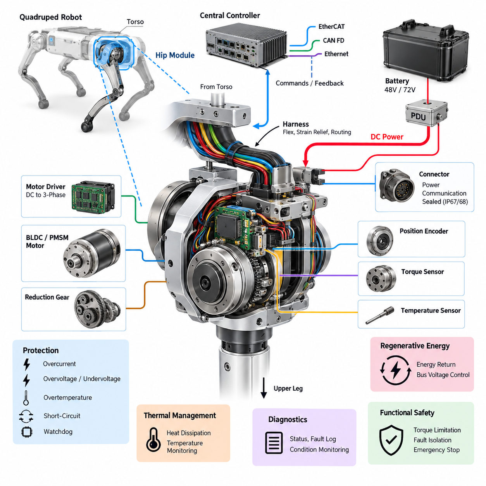
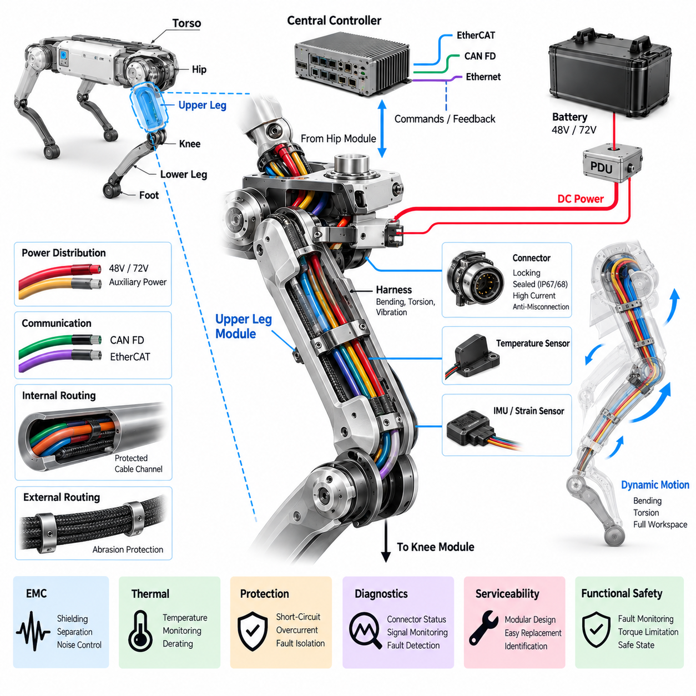
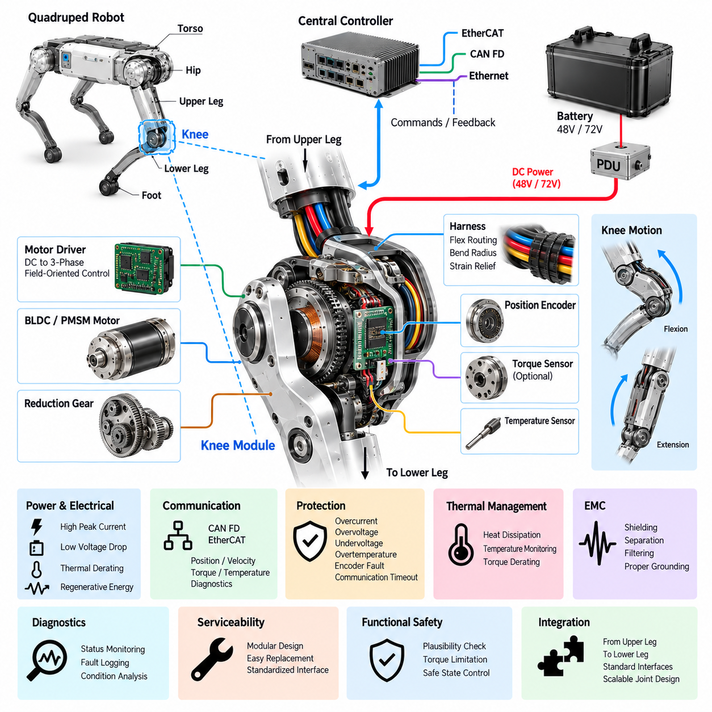
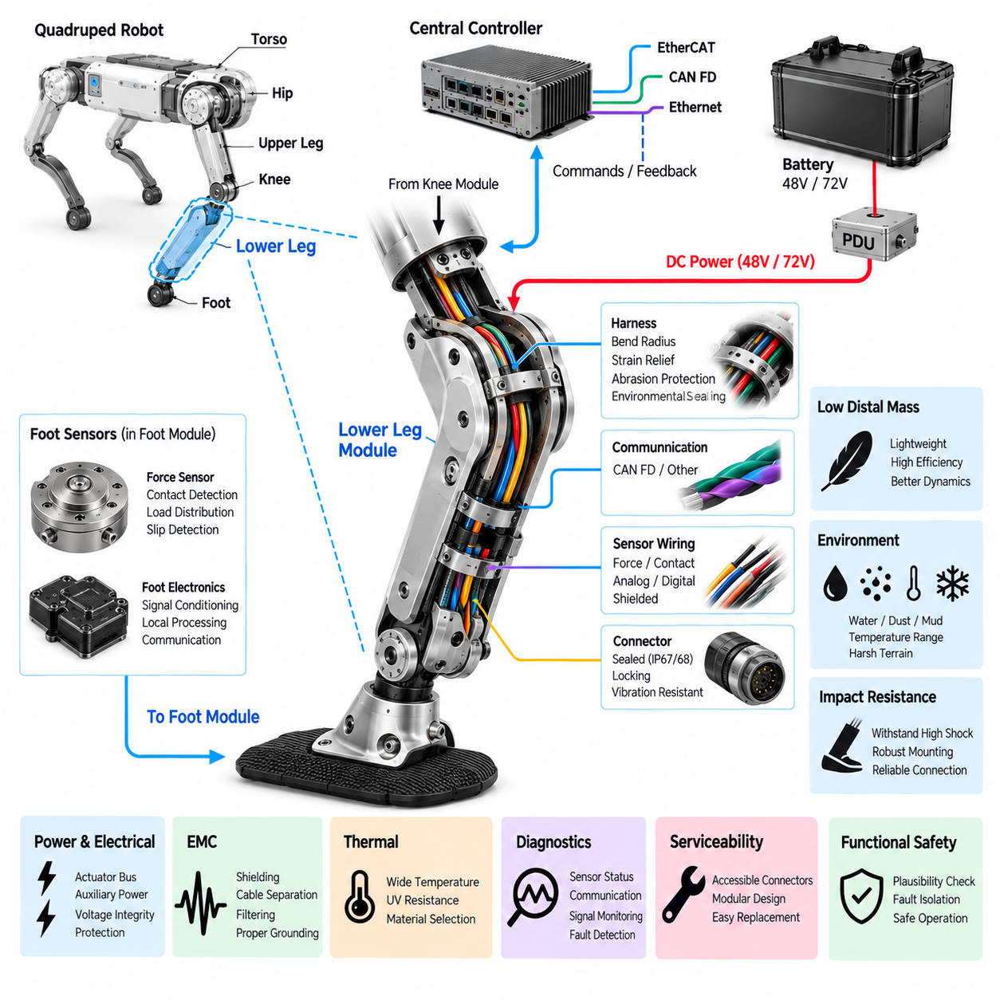
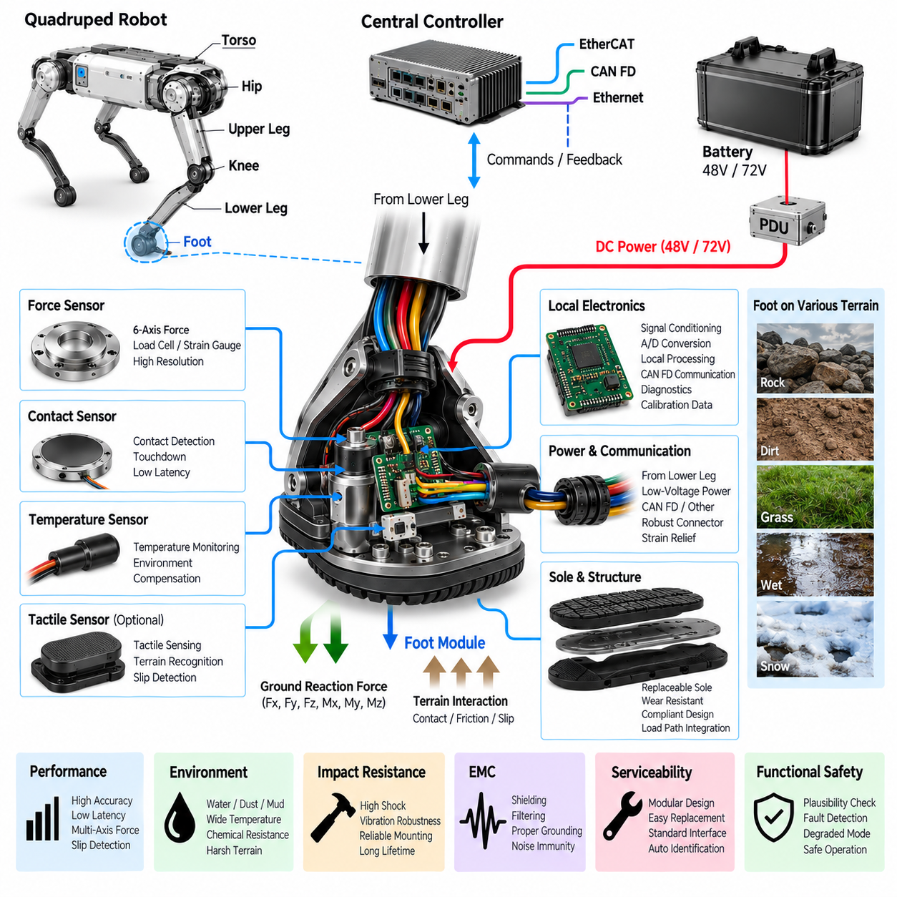
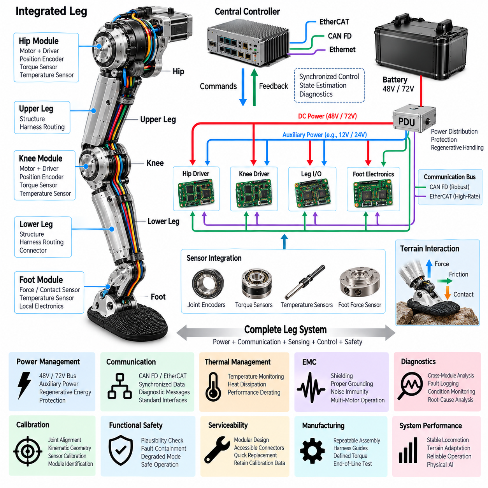

**Volume 20. Quadruped Electrical Architecture**

# Chapter 05. Leg Electrical Design

## 05.01. Hip Module

{width="7.268055555555556in" height="7.268055555555556in"}

The hip module forms the primary electrical and electromechanical interface between the quadruped torso and each articulated leg. It must transfer substantial mechanical loads while simultaneously distributing actuator power, communication, sensing, and safety signals. Because nearly every leg motion produces reaction forces at the hip, its electrical design must remain reliable under continuous vibration, impact, and rapidly changing joint loads.

A typical quadruped hip contains multiple controlled degrees of freedom responsible for leg abduction--adduction and forward--backward positioning. Each axis commonly integrates a BLDC or PMSM actuator, reduction mechanism, motor driver, position encoder, temperature sensing, and diagnostic electronics. Integrating these functions near the joint reduces long high-current motor phase cables and enables a modular leg architecture with well-defined electrical interfaces.

Power entering the hip module is normally derived from the robot\'s main propulsion bus, such as the 48 V or 72 V architectures defined at system level. The local electrical interface must support high transient currents caused by acceleration, terrain impact, recovery motions, and rapid torque reversal. Conductor sizing, connector current rating, contact resistance, thermal derating, and voltage-drop limits therefore need to be evaluated using peak dynamic loads rather than only nominal motor power.

An integrated motor driver can convert the shared DC bus into three-phase excitation directly adjacent to each hip actuator. This arrangement shortens phase-current paths and can reduce conducted and radiated electromagnetic interference when packaging, grounding, and filtering are properly engineered. Local DC-link capacitance also supplies short-duration current demand and helps prevent bus disturbances generated by rapid switching or regenerative joint motion from propagating through the robot.

Position feedback is fundamental because the hip controller requires accurate joint angle and velocity information for gait stabilization. Absolute encoders are particularly useful because the controller can determine joint position immediately after startup without requiring potentially unsafe homing movement. Encoder wiring should be physically and electrically protected from motor phase conductors, switching nodes, and high-current power paths that could corrupt low-level feedback signals.

Torque estimation or direct torque measurement provides another important feedback channel. Joint torque may be estimated from motor current, measured through dedicated torque sensors, or obtained through combinations of electrical and mechanical sensing. Reliable torque information supports impedance control, terrain adaptation, contact response, and overload detection, while also helping higher-level controllers distinguish commanded motion from disturbances transmitted through the leg.

Communication between the hip electronics and the central real-time controller must provide deterministic behavior appropriate for dynamic locomotion. CAN FD may provide a robust distributed-control interface, while EtherCAT can support tighter synchronization and higher-rate cyclic control. Regardless of protocol, command, position, velocity, torque, temperature, fault, and status information should follow a clearly defined interface so that individual leg modules remain replaceable and diagnosable.

The hip is also a critical transition point for the leg harness. Cables leaving the torso encounter repeated bending, twisting, and changing geometry as the hip moves through its operating range. Harness design therefore requires controlled bend radius, strain relief, abrasion protection, sufficient service loops, and routing that avoids pinch points. Dynamic cable behavior must be evaluated throughout the complete joint workspace rather than at a single nominal posture.

Connector placement strongly affects reliability and maintainability. Interfaces should tolerate vibration, repeated service operations, contamination, and expected environmental exposure while remaining mechanically secured against unintended separation. Power and communication connectors may be separated where appropriate, and connector keying should prevent incorrect assembly. For field-serviceable robots, the complete leg should ideally be removable without disturbing unrelated torso wiring.

Thermal management is particularly important because the hip actuator can experience sustained torque while supporting body weight, climbing, recovering from disturbances, or carrying payloads. Motor windings, inverter switching devices, bearings, and reduction mechanisms can all contribute heat. Temperature sensors located near critical components allow the controller to apply progressive derating before thermal limits are exceeded rather than relying only on abrupt protective shutdown.

Electrical protection should isolate a hip fault before it compromises the entire robot. Local overcurrent detection, short-circuit protection, overtemperature protection, undervoltage and overvoltage monitoring, encoder plausibility checks, and communication watchdogs can identify abnormal behavior. The upstream PDU should coordinate protection so that a damaged actuator branch can be disconnected while healthy electrical domains remain available whenever the system safety concept permits.

Regenerative energy must also be considered because a loaded leg can drive its motor electrically during deceleration, landing, or externally forced motion. The resulting energy may return to the common DC bus and raise bus voltage if the battery or power architecture cannot absorb it rapidly enough. Hip motor-driver control therefore has to operate consistently with battery limits, PDU protection, DC-link design, and system-level regenerative energy management.

Grounding and electromagnetic compatibility become challenging where high-current inverter switching exists beside encoder, torque, and communication circuits. The hip module should maintain deliberate power-return and signal-reference paths, appropriate shielding termination, and controlled chassis bonding. Cable geometry and connector pin assignment should minimize coupling between noisy motor circuits and sensitive feedback channels while avoiding unintended ground loops across the leg structure.

The hip module contributes directly to functional safety because uncontrolled hip torque can destabilize the robot or create hazardous leg motion. Safety monitoring should detect implausible position, excessive velocity or torque, driver faults, communication loss, and thermal or electrical abnormalities. Depending on system state, the response may range from torque limitation and controlled stance transition to actuator disablement and coordinated emergency power isolation.

Startup and shutdown sequencing deserve equal attention. The hip electronics should not generate unintended torque while control software, encoders, communication links, or synchronization services are still initializing. A controlled sequence can establish power integrity, verify sensors, confirm communication, validate joint state, enable the motor driver, and only then permit active torque commands. Shutdown should similarly place the leg in a predictable condition before removing actuator power.

Diagnostics should preserve enough information to reconstruct intermittent failures that occur during field operation. Useful records include bus voltage, phase or estimated motor current, joint position, commanded and measured torque, temperatures, communication errors, driver fault registers, and timestamps. Correlating these signals across all four legs helps distinguish a local hip problem from battery, network, controller, or whole-body dynamic events.

From a modular architecture perspective, the hip should expose standardized electrical, communication, mechanical, diagnostic, and software boundaries to the torso and downstream leg assemblies. Such boundaries simplify manufacturing, calibration, replacement, and future actuator upgrades. A common interface also allows left and right leg variants to share electronics wherever mechanical constraints permit, reducing the number of unique components and service procedures.

The hip module therefore should not be treated as merely a motor and connector assembly. It is a compact distributed mechatronic node combining high-power actuation, deterministic communication, precision feedback, thermal management, protection, diagnostics, and dynamic harness engineering. Its architecture establishes the electrical foundation for the upper leg, knee, lower leg, foot, and final integrated leg described in the remainder of the leg electrical design chapter.

## 05.02. Upper Leg Module

{width="7.268055555555556in" height="7.268055555555556in"}

The upper leg module forms the structural and electrical bridge between the hip assembly and the knee module of a quadruped robot. Unlike a passive mechanical link, it must carry dynamic loads while providing reliable pathways for actuator power, communication, sensing, grounding, and diagnostics. Its electrical architecture must therefore be designed together with the mechanical structure, joint motion, thermal environment, and service requirements.

Power for the knee and lower-leg subsystems normally passes through or alongside the upper leg after entering from the torso through the hip module. Depending on the robot architecture, the upper leg may distribute the main 48 V or 72 V actuator bus together with lower-voltage auxiliary supplies. Conductors must tolerate continuous current, transient joint loads, regenerative current, and voltage drop without excessive temperature rise during demanding locomotion.

The upper leg is particularly important for harness engineering because electrical cables must cross a structure that repeatedly changes orientation relative to both the hip and knee. The harness experiences bending, torsion, vibration, acceleration, and impact during walking, running, climbing, turning, and recovery motions. Cable routing must therefore be evaluated across the complete leg workspace rather than optimized for a single standing configuration.

Dynamic sections of the harness require controlled bend radii and sufficient flex length to prevent conductor fatigue. Excessive tension near the hip or knee can transfer mechanical stress directly into terminals, connector contacts, or cable jackets. Conversely, excessive slack can allow cables to strike surrounding structures or become trapped between moving components. Proper strain relief and routing constraints maintain predictable cable motion throughout repeated gait cycles.

The upper leg can use internal cable channels, external protected routing, or a combination of both approaches. Internal routing provides strong protection against impact and environmental exposure but can complicate assembly and service. External routing improves accessibility but requires additional abrasion and snag protection. The selected arrangement should balance mechanical protection, cooling, manufacturability, inspection access, and rapid replacement of leg modules in field operation.

Connectors located around the upper leg must withstand vibration, repeated articulation, contamination, and mechanical shock. Locking mechanisms should prevent unintended disconnection, while keying and polarization reduce the possibility of incorrect assembly. Environmental sealing may be required for outdoor robots exposed to water, dust, mud, or cleaning processes. Connector current rating must also include realistic thermal derating when high-power conductors are packaged within confined spaces.

Communication links passing through the upper leg connect distributed joint electronics with the central real-time controller. CAN FD can provide robust communication for distributed actuator control and diagnostics, while EtherCAT may be used when tighter synchronization and high-rate deterministic control are required. Network routing should maintain signal integrity despite proximity to motor power conductors, inverter switching currents, and rapidly changing electromagnetic fields generated by the joints.

Where communication and power cables share the same structural region, physical separation and controlled routing become important elements of electromagnetic compatibility. Twisted differential pairs, suitable shielding, correct shield termination, and deliberate grounding help reduce noise coupling into communication and sensor channels. High-current motor or DC conductors should not be routed unnecessarily close to sensitive encoder, torque, or low-level analog signals.

The upper leg may also contain local sensors that contribute to structural or motion monitoring. Depending on the platform, these can include temperature sensors, local inertial sensing, strain measurement, or service-oriented identification and condition-monitoring devices. Their data can complement joint encoder and torque information, allowing the controller to understand not only commanded joint motion but also the physical condition of the leg during operation.

Grounding and bonding through the upper leg require careful treatment because the leg structure can electrically connect multiple actuator housings and electronic modules. Protective chassis bonding, signal reference, cable shielding, and high-current return paths should have clearly defined functions. Uncontrolled use of the mechanical structure as an electrical return path can create ground loops, noise coupling, or unexpected fault-current paths that become difficult to diagnose.

Thermal conditions within the upper leg are influenced by neighboring hip and knee actuators, electrical conductor losses, ambient temperature, and limited airflow inside enclosed structures. Cable current capacity and connector ratings must therefore be evaluated using the actual local temperature rather than room-temperature specifications alone. Temperature monitoring can provide additional protection when sustained high-load locomotion raises internal temperatures beyond normal operating conditions.

Mechanical impacts experienced by a quadruped can produce electrical failures even when no immediate structural damage is visible. Landing shocks and foot impacts propagate upward through the lower leg and knee into the upper leg, creating acceleration loads at connectors, terminals, and electronic assemblies. Harness clamps, connector retention, PCB mounting, and sensor attachment must therefore be designed for repeated shock and vibration rather than static installation conditions.

Electrical protection should ensure that damage within the upper-leg harness does not develop into a system-wide power failure. Short circuits, insulation damage, connector contamination, or conductor fatigue should be detected or isolated by coordinated upstream protection. The power distribution architecture should distinguish normal high-current joint transients from genuine faults so that protective devices do not interrupt locomotion unnecessarily during legitimate peak-load events.

The upper leg also carries regenerative current generated by downstream joints. During deceleration, landing, or externally forced movement, the knee or other actuators can return electrical energy toward the common DC bus. Conductors and connectors must therefore support bidirectional energy flow where required. The upper-leg electrical path should not introduce excessive impedance that causes local voltage excursions during rapid transitions between motoring and regeneration.

Diagnostics can transform the upper leg from a passive wiring region into a maintainable subsystem. Connector state, communication errors, temperature trends, actuator faults, voltage measurements, and intermittent signal interruptions can be correlated with joint position and robot motion. A fault that occurs only at a particular leg angle may indicate harness bending, connector movement, or mechanical interference rather than a permanent electronic failure.

Serviceability should be considered from the beginning of the design. A technician should be able to disconnect the upper leg from the hip and knee without dismantling unrelated robot systems. Clearly defined electrical boundaries, accessible connectors, standardized fasteners, identification labels, and controlled harness lengths reduce repair time. Modular replacement is particularly valuable for industrial, inspection, and field robots where operational availability is more important than component-level repair on site.

Assembly design should also prevent wiring errors during manufacturing. Power, communication, sensor, and safety interfaces can use different connector families, keying arrangements, or clearly controlled identification schemes. Harness routing features built into the upper-leg structure can ensure repeatable cable placement between robots. Repeatable assembly improves electromagnetic behavior, mechanical durability, inspection quality, and consistency of service procedures throughout the product lifecycle.

The upper leg must operate as part of the complete distributed leg architecture rather than as an isolated component. Its power paths originate from the torso and hip, while its communication and sensing channels connect the central controller to downstream joints. Mechanical motion at both ends simultaneously affects the harness. Electrical interfaces must consequently be coordinated with hip, knee, lower-leg, and foot designs to avoid local optimization that reduces whole-leg reliability.

Functional safety considerations extend through the upper-leg electrical interfaces because loss of power, corrupted communication, or intermittent feedback can directly affect posture and stability. Fault monitoring should distinguish between recoverable communication disturbances and conditions requiring torque limitation or joint shutdown. Where architecture permits, faults should be localized so that the robot can enter a controlled safe state instead of experiencing an uncontrolled loss of the complete power system.

From a system perspective, the upper leg module is therefore much more than a structural link between two actuated joints. It is a dynamic electrical corridor that must reliably carry power, deterministic communication, sensor information, grounding, and diagnostic signals while undergoing millions of motion cycles. Robust harness routing, connector engineering, EMC control, thermal design, protection, diagnostics, and serviceability make this module a critical foundation for reliable quadruped locomotion.

## 05.03. Knee Module

{width="7.268055555555556in" height="7.268055555555556in"}

:::

The knee module is one of the most heavily loaded electromechanical joints in a quadruped leg, connecting the upper leg to the lower leg while controlling flexion and extension. It repeatedly experiences large torque, acceleration, impact, and regenerative loads during locomotion. Its electrical architecture must therefore combine high-power actuation, precise feedback, deterministic control, thermal management, protection, and mechanical robustness within a compact joint assembly.

A typical knee module integrates a BLDC or PMSM actuator with a reduction mechanism, motor driver, position encoder, temperature sensing, and diagnostic electronics. Depending on the mechanical architecture, torque sensing may also be integrated directly into the joint. Packaging these functions close to the actuator minimizes motor phase-cable length and creates a self-contained joint node that can be controlled through standardized power and communication interfaces.

Electrical power normally reaches the knee through the hip and upper-leg electrical path from the robot\'s main 48 V or 72 V actuator bus. Knee motion can demand substantial peak current during acceleration, jumping, climbing, recovery, and load support. The power interface must therefore be sized for dynamic current rather than average consumption alone, considering conductor resistance, connector losses, thermal derating, allowable voltage drop, and repetitive peak-load duration.

The integrated motor driver converts DC bus energy into controlled three-phase current for the knee motor. Field-oriented control can regulate motor torque efficiently by controlling phase currents according to rotor position. Because the driver switches significant current at high frequency, its placement, DC-link capacitance, grounding, filtering, and thermal interface strongly influence electrical performance. Short power loops are desirable for reducing parasitic inductance and switching-related disturbances.

Accurate position feedback is essential because knee angle directly affects leg length, foot trajectory, body height, and stability. An absolute encoder allows the controller to identify the joint position immediately after power-up without requiring a potentially unsafe homing sequence. Encoder resolution, latency, update rate, mechanical alignment, and electrical noise immunity must support the bandwidth required by the real-time joint controller.

Velocity can be derived from encoder measurements or generated through observer-based estimation within the motor-control system. Reliable velocity information is important for damping, trajectory tracking, impedance control, and detection of abnormal joint motion. Filtering must balance noise suppression against control latency, because excessive filtering can degrade dynamic response while insufficient filtering can introduce unstable or noisy torque commands during rapid locomotion.

Torque feedback is particularly valuable at the knee because ground reaction forces are transmitted strongly through this joint. Torque can be estimated from motor current or measured using dedicated torque sensing integrated into the mechanical load path. Combined position, velocity, and torque feedback enables impedance behavior in which the leg can respond compliantly to terrain while still generating the forces required for body support and dynamic movement.

Communication between the knee module and central real-time controller must remain deterministic despite continuous leg movement. CAN FD provides a robust distributed interface for command, feedback, diagnostics, and fault reporting, while EtherCAT can support tightly synchronized high-frequency joint control. Network design should define cyclic data for position, velocity, torque, temperature, operating state, and faults while separating time-critical control traffic from lower-priority diagnostic information.

The knee is a critical location for dynamic harness routing because cables arriving through the upper leg must cross or pass near a joint with a relatively large angular range. Repeated flexing can fatigue conductors, shields, jackets, and connector terminations. Harness geometry should establish a predictable bending region with sufficient bend radius and flex length while preventing tension, twisting, abrasion, pinching, or interference with the joint mechanism.

Cable routing should also account for the full mechanical workspace and not merely nominal standing posture. Deep crouching, stair climbing, obstacle traversal, recovery from a fall, and maintenance positions may place the knee at extreme angles. A harness that performs correctly during normal walking can still fail at these limits. Mechanical envelope analysis and repeated articulation testing are therefore necessary parts of knee electrical validation.

Connector interfaces around the knee require secure retention because repeated impacts can gradually loosen poorly constrained connections. Power contacts must support peak actuator current, while communication and sensor contacts require stable low-resistance connections under vibration. Environmental sealing may be required for dust, water, mud, or cleaning exposure. Connector orientation should also permit practical assembly and replacement without forcing excessive bending of the harness.

Thermal management is challenging because the knee motor and driver may operate at high torque while enclosed within a compact structure. Heat is generated by motor winding resistance, inverter losses, bearings, and mechanical transmission losses. Thermal paths into the joint housing or structural members can assist heat rejection, while temperature sensors allow the controller to detect developing thermal stress and progressively reduce allowable torque before reaching damaging temperatures.

Regenerative operation is inherent to knee motion. During landing, lowering the body, deceleration, or externally driven joint movement, mechanical energy can be converted back into electrical energy through the motor and inverter. This energy flows toward the common DC bus and may increase bus voltage. The knee driver must therefore operate within system-level regenerative limits coordinated with the battery, PDU, other joints, and available energy-absorption capability.

Electromagnetic compatibility requires careful separation between high-current switching circuits and sensitive feedback paths. Motor phase conductors and DC power cables generate electromagnetic disturbances that can affect encoder, torque-sensor, and communication signals. Controlled cable routing, twisted differential pairs, appropriate shielding, correct shield termination, filtering, and defined grounding paths help maintain signal integrity while reducing conducted and radiated interference throughout the leg.

The knee module should continuously monitor its electrical and control condition. Relevant diagnostic parameters include DC bus voltage, motor current, joint position, velocity, commanded and estimated torque, motor and driver temperature, communication status, encoder validity, and inverter fault registers. Time-correlated logging of these values can reveal whether a failure originates from the actuator, harness, connector, power distribution, communication network, or mechanical joint.

Protection mechanisms must react appropriately to short circuits, overcurrent, overvoltage, undervoltage, overtemperature, encoder failure, communication timeout, and unexpected joint behavior. Immediate power removal is not always the safest first response because sudden loss of knee torque can cause the robot to collapse. Where possible, fault handling should coordinate torque limitation, controlled posture transition, joint disablement, and system-level safe-state management.

Functional safety therefore requires the knee to be considered as part of the complete leg and whole-body control system. Plausibility checks can compare commanded motion with measured position, velocity, current, and torque to identify abnormal behavior. Communication watchdogs and local limits should prevent stale or corrupted commands from producing uncontrolled motion. Severe faults should be communicated immediately so that the other legs can participate in a coordinated safety response.

Startup sequencing should ensure that the knee cannot generate unintended torque before the controller has established valid operating conditions. Power integrity, encoder status, communication, joint position, temperature, and driver state can be checked before torque control is enabled. During shutdown, the system should coordinate knee torque with the remaining joints so that actuator power is removed only after the robot reaches an appropriate supported or safe configuration.

Serviceability is important because knee modules are exposed to repeated mechanical stress and may eventually require replacement. Standardized power, communication, and mechanical interfaces allow a complete knee actuator assembly to be exchanged without rebuilding the entire leg harness. Accessible connectors, clear identification, controlled cable lengths, and stored calibration parameters can reduce field repair time and simplify replacement followed by verification and recommissioning.

From a modular engineering perspective, the knee forms the electrical transition between the upper-leg module and the lower-leg module defined in the leg architecture. Upstream interfaces provide power, communication, and control, while downstream routing may continue toward sensors or electronics closer to the foot. Standardized boundaries allow knee actuator technology, gear ratios, sensors, or motor drivers to evolve without forcing a complete redesign of the entire robot electrical system.

The knee module should therefore be regarded as an intelligent high-power joint rather than simply a mechanical hinge. It combines actuator power conversion, precise position and torque feedback, deterministic networking, regenerative energy flow, dynamic harness routing, thermal control, diagnostics, protection, and functional safety. Reliable knee electrical design is fundamental to stable locomotion because nearly every stance, landing, terrain interaction, and body-height adjustment depends on controlled knee behavior.

## 05.04. Lower Leg Module

{width="7.268055555555556in" height="7.268055555555556in"}

The lower leg module forms the distal structural and electrical section between the knee module and the foot of a quadruped robot. Although it may contain less active electronics than the hip or knee, it operates in one of the harshest regions of the leg. Repeated ground impacts, vibration, contamination, and large acceleration loads make its electrical architecture critical for reliable power, sensing, communication, grounding, and foot-interface operation.

Electrical paths entering the lower leg generally originate from the knee and continue toward sensors, foot electronics, or other distal devices. Depending on the robot architecture, these paths may include actuator-bus power, auxiliary low-voltage power, communication lines, sensor excitation, and diagnostic signals. The design should minimize unnecessary conductor mass while maintaining sufficient current capacity, mechanical durability, voltage integrity, and protection against environmental exposure.

Weight distribution is especially important because electrical mass located far from the body increases leg rotational inertia. Heavy connectors, oversized conductors, protective structures, and electronic modules placed near the foot can increase the energy required to accelerate and decelerate the leg. The lower-leg electrical design should therefore minimize distal mass while preserving the reliability required for repeated impact, high-cycle motion, and field operation.

Harness routing from the knee into the lower leg must accommodate continuous articulation without transferring excessive stress into conductors or terminals. The transition near the knee requires a defined dynamic bending region, while the remaining harness can usually be constrained more firmly along the lower-leg structure. Controlled bend radius, strain relief, abrasion protection, and mechanical retention help prevent fatigue failures during millions of gait cycles.

Internal cable routing can protect the lower-leg harness from branches, debris, obstacles, and direct environmental exposure. However, enclosed channels must provide adequate space for cable movement, assembly tolerances, and service access. External routing can simplify inspection and replacement but requires robust protective sleeving and retention. The selected approach should avoid locations where cables could be crushed during impacts or contact with surrounding terrain.

Because the lower leg operates close to the ground, environmental sealing becomes more demanding than in many torso-mounted electrical systems. Water, dust, mud, sand, cleaning fluids, and temperature variation can reach connectors and sensors during normal operation. Sealed connectors, protected cable entries, appropriate jacket materials, and controlled sealing interfaces should maintain electrical isolation and contact reliability throughout the intended environmental operating range.

The lower leg commonly carries wiring for foot force sensing or contact detection. These signals provide important information about touchdown, load distribution, slip, and terrain interaction. Depending on sensor technology, the interface may carry analog signals, digital communication, excitation voltage, or differential measurements. Low-level sensor signals require particular attention to shielding, grounding, filtering, and separation from electrically noisy actuator power paths.

Foot force information can contribute directly to gait control by indicating when the foot establishes or loses contact with the ground. The real-time controller can combine these measurements with joint position, velocity, torque, and inertial data to estimate the state of the leg. Reliable transmission through the lower-leg harness is therefore important not only for sensing accuracy but also for body stabilization, terrain adaptation, and dynamic locomotion.

Communication links may extend through the lower leg when intelligent foot sensors or distributed electronics are used. CAN FD can provide a robust interface for local sensor nodes, while other differential or serial interfaces may be appropriate for simpler devices. Network segments should tolerate repeated vibration and mechanical movement without intermittent connectivity, because short communication disturbances synchronized with foot impact can be difficult to reproduce during stationary diagnostics.

Electromagnetic compatibility remains important even when the lower leg contains no major motor driver. High-current knee conductors, nearby motor phase currents, switching electronics, and transient ground currents can couple interference into sensitive foot-sensor wiring. Twisted pairs, shielding, appropriate cable separation, filtering, and controlled reference paths help preserve signal quality, particularly when small force or strain measurements must be transmitted over the moving leg.

Grounding and bonding should maintain defined electrical references without relying unintentionally on bearings, mechanical joints, or structural fasteners as signal-return paths. If the lower-leg structure is conductive, its chassis-bonding function should be explicitly defined. Shield termination and sensor reference strategies should remain consistent with the complete leg architecture so that changes in joint position or mechanical contact do not create variable grounding conditions.

Impact resistance is a fundamental design requirement. Forces generated at touchdown propagate directly from the foot into the lower leg and then toward the knee and body. Connectors, sensors, harness clamps, solder joints, and local circuit boards can experience repeated high acceleration even when protected inside the structure. Electrical components must therefore be selected and mounted for repetitive shock and vibration rather than only nominal static loading.

Mechanical strain in the lower-leg structure can also affect embedded electrical components. Flexible deformation under impact or high loading may change cable tension, connector alignment, or sensor calibration. Harness attachment points should avoid transferring structural strain into electrical terminations. Where strain or force sensors are intentionally integrated, their mechanical load path and electrical interface should be designed together to prevent unintended forces from corrupting measurement accuracy.

Thermal conditions differ from those of the hip and knee because the lower leg may contain fewer heat-generating actuators but can experience substantial external temperature variation. Solar heating, cold surfaces, water exposure, and proximity to hot joint assemblies can alter local conditions. Sensor accuracy, cable flexibility, sealing materials, and connector performance should therefore be validated across the expected temperature range rather than assuming a uniform internal robot environment.

Electrical protection for distal circuits should prevent a damaged foot sensor or lower-leg cable from disabling the complete leg or robot. Short-circuit protection, current-limited auxiliary supplies, input protection, and fault isolation can limit the effect of wiring damage caused by impact or abrasion. The upstream architecture should distinguish between critical joint-control faults and noncritical distal sensor faults so that an appropriate degraded operating state can be selected.

Diagnostics are particularly valuable because lower-leg failures may appear only during motion or ground contact. Monitoring sensor validity, communication errors, supply voltage, signal range, and intermittent connection events can reveal developing problems. Correlating diagnostic records with knee angle, foot-contact state, acceleration, and timestamps helps identify whether a failure is associated with harness bending, impact, connector movement, contamination, or an actual sensor defect.

Connector placement should support both environmental protection and practical service. Interfaces located too close to the foot may be exposed to direct impact and contamination, while connectors placed too deeply inside the structure can make replacement difficult. A well-designed lower-leg module positions disconnect points in protected but accessible regions, allowing the foot or lower leg to be replaced without disturbing the knee actuator or upper-leg harness.

Service loops and cable lengths must be controlled carefully. Excess cable adds distal mass and can move unpredictably under impact, whereas insufficient length transfers tension into connectors during assembly or articulation. Defined routing features, clamps, grommets, and strain-relief elements allow consistent harness installation across production units. Repeatable routing also improves durability testing because the tested cable geometry more closely represents the manufactured robot.

Functional safety considerations arise because loss or corruption of distal sensing can influence contact estimation and balance control. A foot sensor reporting false contact may cause the controller to apply inappropriate forces, while loss of contact information can reduce terrain awareness. Plausibility checks can compare foot sensing with joint torque, leg kinematics, and inertial response so that inconsistent measurements are detected before they significantly affect robot behavior.

The lower leg should therefore provide a clearly standardized interface to both the knee module and the foot module. Power, communication, sensor, grounding, mechanical, and diagnostic boundaries should be defined so that either distal module can be serviced or upgraded independently. This modularity also supports future integration of improved force sensors, tactile devices, terrain sensors, or local intelligence without requiring redesign of the complete leg electrical architecture.

From a system perspective, the lower leg is not simply a lightweight mechanical link beneath the knee. It is the electrical pathway connecting high-level leg control with the robot\'s physical contact point with the environment. Robust dynamic harness design, low distal mass, environmental protection, impact resistance, sensor integrity, diagnostics, EMC control, and serviceable interfaces allow the lower leg to reliably connect the knee architecture to the foot module and complete the distal portion of the quadruped leg.

## 05.05. Foot Module

{width="7.268055555555556in" height="7.268055555555556in"}

The foot module forms the final physical and electrical interface between a quadruped robot and the terrain. Every stance phase, touchdown, push-off, slip event, and landing ultimately transfers forces through this small region. Although the foot may contain relatively little high-power electronics, its sensing and electrical integrity strongly influence locomotion stability, terrain adaptation, contact estimation, and protection of the complete leg.

Mechanically, the foot must support repeated multidirectional forces while maintaining a predictable contact geometry. Electrically, it provides an interface for force sensors, contact switches, tactile devices, temperature sensors, or local signal-conditioning electronics depending on the platform. These components operate under severe impact and vibration, so their packaging must be designed together with the sole, structural load path, compliant elements, and environmental sealing.

Foot force sensing is one of the most important electrical functions because the controller needs to determine whether the foot is supporting the robot. Force may be measured using strain gauges, load cells, force-sensitive elements, piezoelectric devices, or other sensing technologies. The sensor architecture should provide sufficient range and resolution to distinguish light contact, normal stance loading, dynamic impact, and overload conditions without saturation or excessive measurement noise.

Multi-axis force measurement can provide more information than a simple contact switch. Vertical force indicates body support, while tangential force components can help estimate traction and detect developing slip. When combined with joint position, velocity, torque, and inertial measurements, foot-force information allows the control system to estimate ground reaction forces and evaluate how each leg interacts with the terrain during dynamic locomotion.

Contact detection must operate with low latency because the transition between swing and stance can occur rapidly. Delayed or unreliable detection may cause the controller to continue a swing trajectory after touchdown or apply stance forces before secure contact is established. Sensor sampling, filtering, communication, and control processing should therefore be coordinated so that noise reduction does not introduce excessive delay into the contact-state estimation path.

The foot may incorporate local signal-conditioning electronics when raw sensor outputs are small or sensitive to noise. Amplification, analog filtering, analog-to-digital conversion, bridge excitation, temperature compensation, and local calibration can be placed close to the sensing element. Local conditioning reduces the distance traveled by vulnerable analog signals and allows the lower-leg harness to carry more robust digital information toward the distributed or central controller.

Where intelligent foot electronics are used, communication can be implemented through CAN FD or another suitable differential interface consistent with the leg architecture. A local node can transmit force, contact state, temperature, diagnostic status, and calibration information. Distributed processing can also perform basic plausibility checks or filtering before data reaches the main controller, reducing communication load while preserving time-critical information required for locomotion.

Power requirements at the foot are usually lower than those of the actuated joints, but supply integrity remains important. Auxiliary low-voltage power may support sensors, local processors, signal conditioning, or identification devices. Current-limited distribution and local protection can prevent a damaged foot circuit from shorting the broader leg supply. Voltage regulation should tolerate transient disturbances caused by upstream actuators and regenerative events on the main power bus.

The electrical interface between the lower leg and foot must withstand continuous impact, articulation, and structural deformation. Cable entries should incorporate strain relief and avoid locations where repeated compression can damage conductors. Where the foot includes passive compliance or limited mechanical articulation, wiring must accommodate that motion without transferring tension into sensor connections or introducing forces that could influence sensitive measurements.

Environmental protection is especially demanding because the foot is the component most directly exposed to water, dust, mud, sand, oils, cleaning agents, and surface debris. Cable penetrations, sensor cavities, connectors, and electronic housings should use appropriate sealing strategies. Environmental protection must remain effective after repeated impacts and sole deformation because seals that perform well in a static enclosure may degrade under continuous mechanical loading.

Impact loading can generate acceleration levels far above those experienced by torso electronics. Sensors, circuit boards, connectors, solder joints, and internal wiring therefore require mechanically robust mounting. Rigid attachment may transmit excessive shock directly into electronics, while excessive compliance can allow uncontrolled movement. Mechanical isolation should be selected carefully so that electronics survive impacts without altering the intended force path or reducing measurement accuracy.

Foot materials and electrical components must also tolerate wear over the robot\'s operating life. The sole may gradually lose thickness, stiffness, or traction characteristics, altering the relationship between external contact force and sensor output. Replaceable wear surfaces can separate consumable mechanical components from expensive sensing electronics. The electrical design should support sole replacement without requiring unnecessary replacement or recalibration of unrelated leg electronics whenever practical.

Traction and slip detection can be enhanced by combining foot-force measurements with leg kinematics and inertial sensing. If the controller observes tangential loading without the expected body response, or detects unexpected foot displacement while contact force remains high, it can infer possible slip. This information allows gait planning and whole-body control to reduce commanded force, redistribute load, or modify foothold strategy before stability is lost.

Sensor calibration is essential because manufacturing tolerances, assembly preload, temperature, mechanical wear, and structural deformation can affect force measurements. Calibration coefficients may be stored locally in the foot electronics or associated with the module in the robot controller. A modular calibration strategy allows a replacement foot to retain its own sensor characteristics, reducing service effort and preventing calibration data from becoming incorrectly associated with another physical module.

Temperature effects should be considered even when the foot generates little heat internally. Contact with hot pavement, cold ground, snow, water, or industrial surfaces can rapidly change sensor and material temperature. Strain-based sensors and analog electronics can exhibit temperature-dependent offset or gain changes. Temperature measurement and compensation can therefore improve force accuracy while also identifying environmental conditions that exceed component operating limits.

Electromagnetic compatibility remains necessary because low-level force signals can be susceptible to disturbances generated by nearby knee actuators and motor drives. Differential sensing, twisted wiring, shielding, filtering, careful grounding, and short analog signal paths help preserve measurement quality. If conversion to digital data occurs inside the foot, the communication link toward the lower leg becomes significantly more tolerant of noise than a long low-level analog connection.

Diagnostics should distinguish sensor failure from genuine unusual terrain interaction. Open or short circuits, impossible force values, excessive offsets, communication loss, supply faults, and calibration errors can be detected electrically. More advanced plausibility checks can compare foot measurements with joint torque, expected body acceleration, and the states of the other legs. Such correlation reduces the risk that a single faulty sensor will be interpreted as a real contact event.

Functional safety is closely connected to foot sensing because incorrect contact information can cause inappropriate force commands. A false positive may indicate that the foot is supporting weight when it is still in the air, while a false negative can cause the controller to ignore a loaded leg. The control architecture should therefore define degraded modes for unavailable or unreliable foot sensing rather than allowing corrupted information to propagate directly into balance control.

The foot module should be replaceable because it experiences more wear and environmental exposure than most other electrical modules. A standardized interface between the lower leg and foot can include power, communication, sensor references, grounding, mechanical attachment, and module identification. Protected and accessible connectors allow damaged feet or worn soles to be exchanged quickly while minimizing disturbance to the lower-leg harness and knee electronics.

Diagnostic identification can further improve serviceability by allowing the controller to recognize the installed foot type, serial configuration, calibration data, and supported sensor capabilities. After replacement, the system can verify communication, sensor offsets, expected load response, and configuration compatibility before enabling normal operation. This reduces the possibility of operating with an incorrectly installed or improperly calibrated foot assembly.

The foot module completes the electrical chain extending from the torso through the hip, upper leg, knee, and lower leg. At this endpoint, electrical information is transformed into direct knowledge of physical interaction with the environment. Reliable foot sensing closes the loop between commanded joint motion and actual terrain contact, making the foot a fundamental source of feedback for balance, impedance control, locomotion, and Physical AI interaction.

From a system perspective, the foot should therefore be treated as an intelligent contact interface rather than a passive end piece. Force and contact sensing, low-latency signal processing, environmental protection, impact resistance, EMC control, calibration, diagnostics, functional safety, and modular serviceability must operate together. A robust foot electrical architecture enables the quadruped to convert uncertain terrain interaction into reliable feedback for stable and adaptive whole-body behavior.

## 05.06. Leg Integration

{width="7.268055555555556in" height="7.268055555555556in"}

Leg integration combines the hip, upper leg, knee, lower leg, and foot modules into a single coordinated electromechanical subsystem. Each module has distinct mechanical, electrical, sensing, communication, and diagnostic functions, but reliable locomotion depends on their behavior as one complete leg. Integration therefore requires consistent interfaces, coordinated power distribution, deterministic communication, synchronized sensing, robust harness routing, and system-level fault management.

The electrical power path begins at the robot\'s central battery and PDU and extends through the torso interface toward the hip and downstream leg modules. A 48 V or 72 V actuator bus can supply high-power joints, while regulated auxiliary rails support sensors and local electronics. The integrated design must consider simultaneous joint loading because hip and knee peak currents can occur together during acceleration, climbing, landing, or recovery motions.

Power distribution must account for both motoring and regenerative operation across the complete leg. During some phases one actuator may consume energy while another returns energy to the common DC bus. Bus impedance, conductor resistance, local DC-link capacitance, battery acceptance limits, and PDU protection therefore interact dynamically. Integration testing should evaluate these combined effects rather than validating each actuator only with an independent laboratory supply.

Communication architecture connects distributed joint controllers and distal sensors with the central real-time controller. CAN FD can provide robust command, feedback, and diagnostic communication, while EtherCAT can support tightly synchronized high-rate control where required. The integrated leg should expose consistent data objects for position, velocity, torque, temperature, operating state, and faults so that higher-level software can treat joints through standardized interfaces.

Time synchronization becomes increasingly important when information from multiple joints and the foot is combined for whole-leg state estimation. Hip position, knee torque, foot contact, and inertial measurements represent different parts of the same physical event. If timestamps or control cycles are inconsistent, the controller may reconstruct an incorrect leg state. A common timing reference and deterministic sampling strategy therefore improve control accuracy and diagnostic interpretation.

Harness integration is one of the most difficult physical aspects of complete-leg design. The cable path must travel from the torso through the hip, upper leg, knee, lower leg, and finally toward the foot while experiencing different combinations of bending, twisting, vibration, and impact. Each moving transition requires an intentionally defined flex region, while relatively static sections should be securely retained to prevent uncontrolled cable motion.

A harness that is reliable within an individual module can still fail after full-leg assembly if adjacent service loops, connectors, or routing constraints interact incorrectly. Complete workspace evaluation should therefore include standing, deep crouching, maximum extension, turning, stair climbing, obstacle traversal, recovery postures, and maintenance positions. Digital packaging analysis should be complemented by physical articulation testing because real cables can behave differently from ideal geometric models.

Connector boundaries should support modular assembly and service while minimizing unnecessary connection points. The hip, knee, lower leg, and foot interfaces should use defined power, communication, sensor, grounding, and identification connections. Keying, locking, environmental sealing, and current-rating requirements should reflect each installation location. Standardization allows a damaged module to be replaced without rebuilding the entire leg electrical system.

Grounding, bonding, and shielding must be coordinated across the complete leg rather than designed independently within each module. Motor drivers create high-frequency switching currents, while encoders and foot-force sensors may carry sensitive signals. Defined chassis bonding, signal references, shield termination, and power-return paths prevent mechanical joints or bearings from becoming unintended current paths and reduce the possibility of position-dependent EMC problems.

Electromagnetic compatibility must be evaluated under realistic simultaneous actuator operation. Hip and knee inverters can switch substantial currents while communication networks and force sensors operate nearby. Interference that is not visible during single-joint testing may appear when multiple motors operate together. Integrated EMC validation should therefore exercise representative gait patterns, high torque transitions, regenerative events, and communication traffic while monitoring sensor and network integrity.

Thermal integration requires understanding how heat from multiple joints interacts with the leg structure. Hip and knee motors, drivers, conductors, connectors, and mechanical transmissions all contribute losses, while the lower leg and foot experience environmental temperature changes. Temperature sensors distributed through the leg allow the controller to distinguish local overheating from broader thermal loading and apply appropriate torque or performance derating.

Mechanical loads and electrical reliability are closely coupled. Ground impact enters through the foot, propagates through the lower leg and knee, and ultimately reaches the hip and torso. At the same time, each joint changes harness geometry and connector loading. Integrated vibration and shock testing should therefore use representative leg assemblies so that electrical failures caused by structural resonance, connector movement, cable fatigue, or repeated impact can be identified.

Sensor integration transforms individual measurements into an estimate of the complete leg state. Joint encoders provide angular position, torque sensing indicates actuator or structural loading, and foot sensors describe contact with the terrain. Combining these signals enables estimation of leg configuration, ground reaction, contact state, and abnormal behavior. Consistent calibration, coordinate definitions, timestamps, and signal conventions are essential for reliable fusion.

Calibration should be managed at both module and integrated-leg levels. An encoder may be calibrated within its joint, while the complete leg still requires correct relationships among hip axes, knee position, link geometry, and foot reference points. Calibration data should remain associated with the correct physical modules after replacement. Module identification and stored calibration parameters can reduce configuration errors during manufacturing and field service.

Diagnostics should correlate information across the entire leg rather than reporting isolated component faults. A communication error at the foot may result from lower-leg harness damage, while unexpected knee torque may originate from terrain contact rather than an actuator defect. Time-correlated logs of voltage, current, position, torque, temperature, contact state, communication errors, and fault registers provide the context needed for root-cause analysis.

Fault containment is a major integration requirement because a local electrical failure should not unnecessarily disable the entire robot. Protection coordination can isolate short circuits or damaged auxiliary branches, while software can distinguish degraded sensing from dangerous actuator faults. Depending on severity, the system may continue with reduced capability, redistribute body load among the remaining legs, transition to a stable posture, or perform a controlled shutdown.

Functional safety must consider the complete chain from command generation to physical ground contact. Incorrect torque commands, stale communication, encoder faults, harness failures, or false foot-contact information can all produce unstable behavior. Plausibility monitoring should compare commanded and measured joint states with foot contact and whole-body motion, allowing the controller to identify inconsistent behavior before it develops into uncontrolled leg movement.

Startup sequencing should verify the integrated leg before active locomotion begins. Power rails, communication links, joint controllers, encoders, temperature sensors, foot sensing, module identity, and stored calibration can be checked before torque is enabled. The controller can then transition through controlled joint activation and establish a known supported state. Similar coordination during shutdown prevents sudden removal of support torque while the robot remains loaded.

Serviceability benefits directly from modular integration. A complete leg may be removable at the torso interface, while individual hip, knee, lower-leg, or foot modules can also have defined replacement boundaries. Accessible connectors, standardized interfaces, controlled harness lengths, module identification, and retained calibration information reduce maintenance time. After replacement, automated verification can confirm communication, sensing, configuration, and actuator operation.

Manufacturing integration requires repeatable assembly rather than relying on technician judgment for cable placement and connector routing. Structural guides, clamps, strain-relief features, connector keys, labeling, and defined torque specifications help reproduce the validated configuration. End-of-line testing should verify power continuity, insulation, communication, sensor response, joint movement, calibration status, diagnostics, and safety behavior before the leg is installed on the robot.

The integrated leg ultimately operates as a distributed intelligent subsystem within the quadruped architecture. The hip and knee generate controlled mechanical power, structural modules carry electrical pathways, and the foot converts terrain interaction into feedback. Power electronics, communication, sensing, diagnostics, and safety functions cooperate continuously, allowing higher-level locomotion and Physical AI software to command the leg through a coherent interface.

Leg integration therefore completes the transition from individually engineered modules to a functional robotic limb. Successful integration depends not only on actuator performance but also on power coordination, regenerative energy handling, synchronized communication, sensor fusion, dynamic harness durability, EMC, thermal behavior, diagnostics, calibration, protection, and serviceability. When these elements operate as one system, the leg becomes a reliable foundation for stable, adaptive, and intelligent quadruped locomotion.
