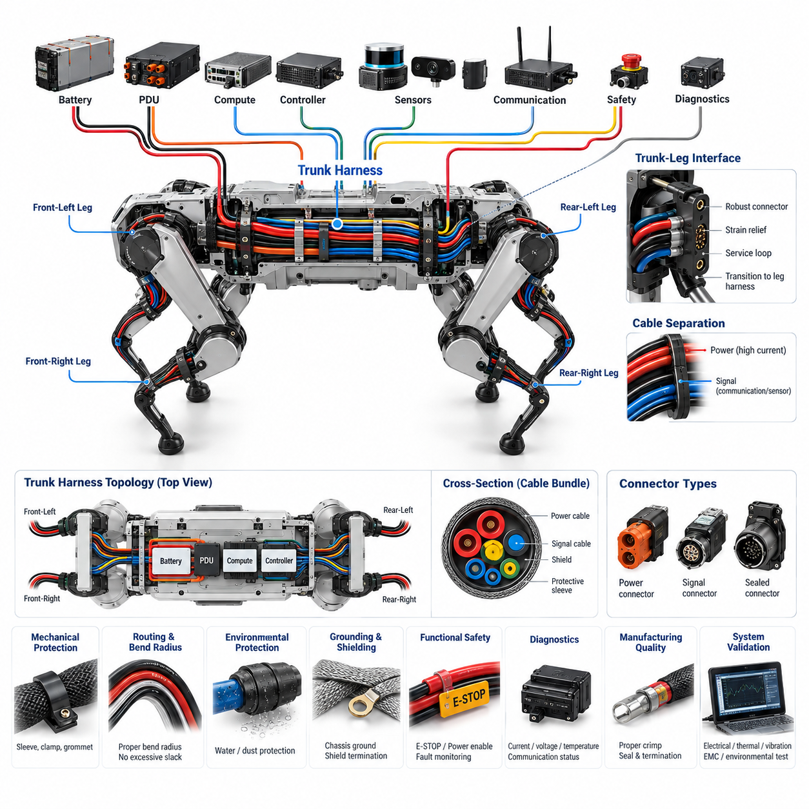
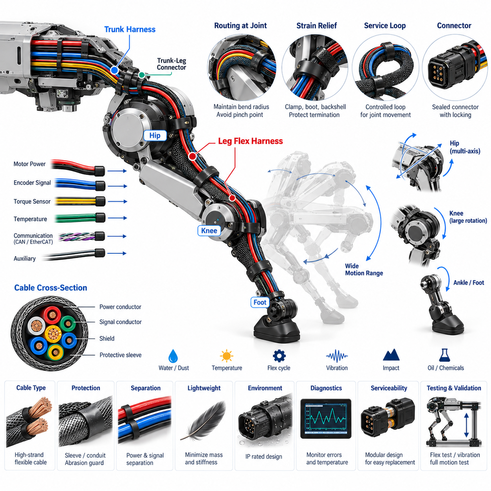
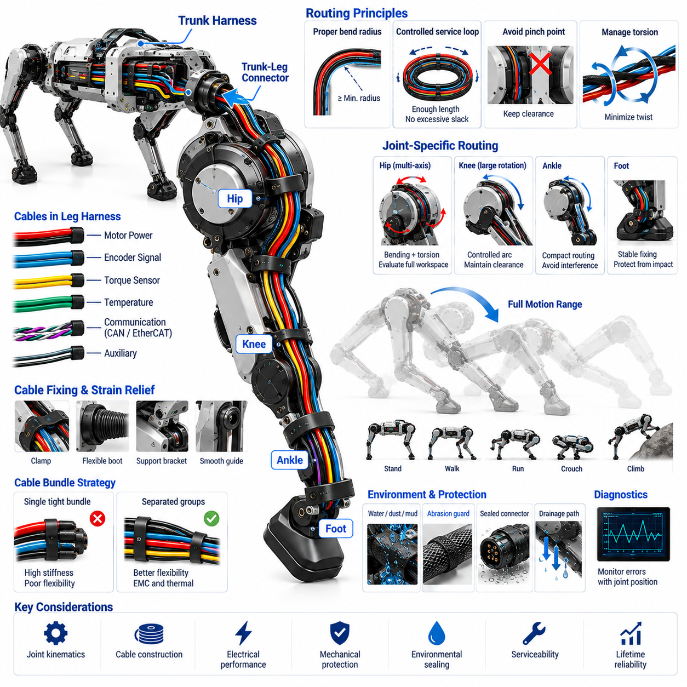
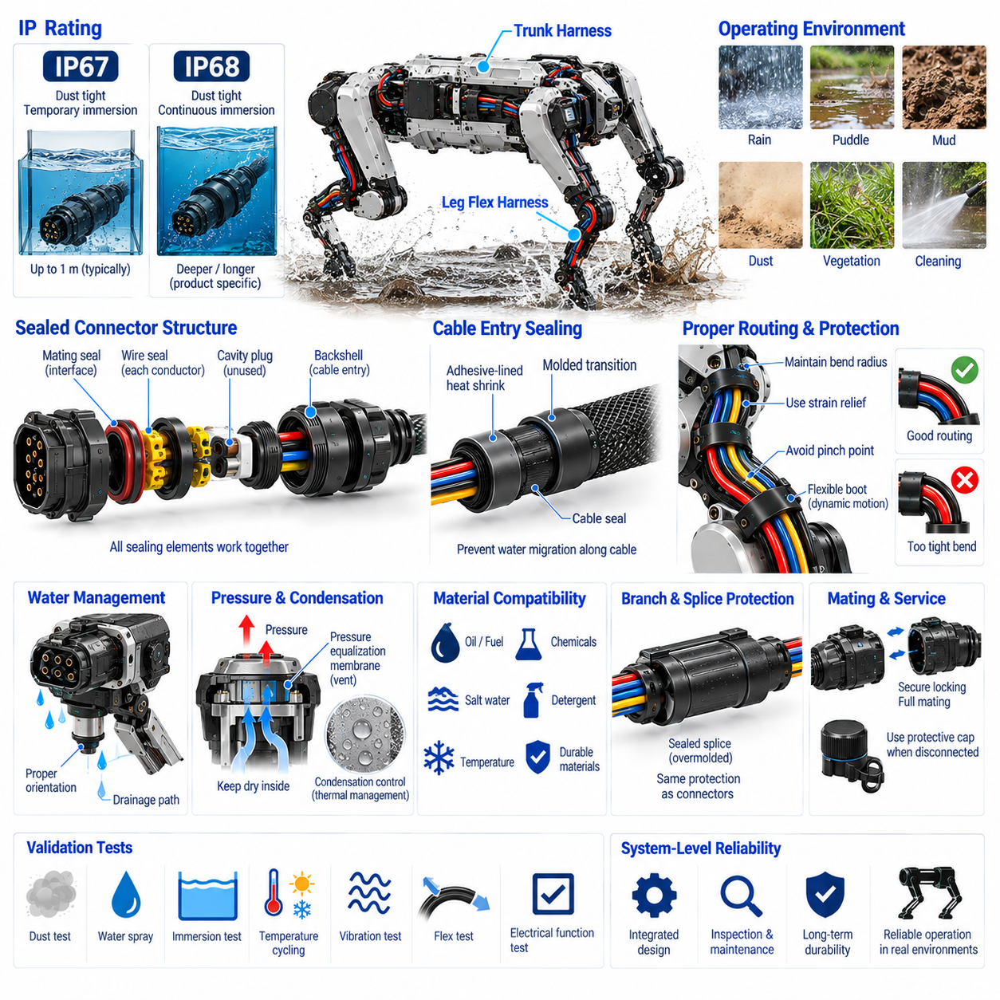
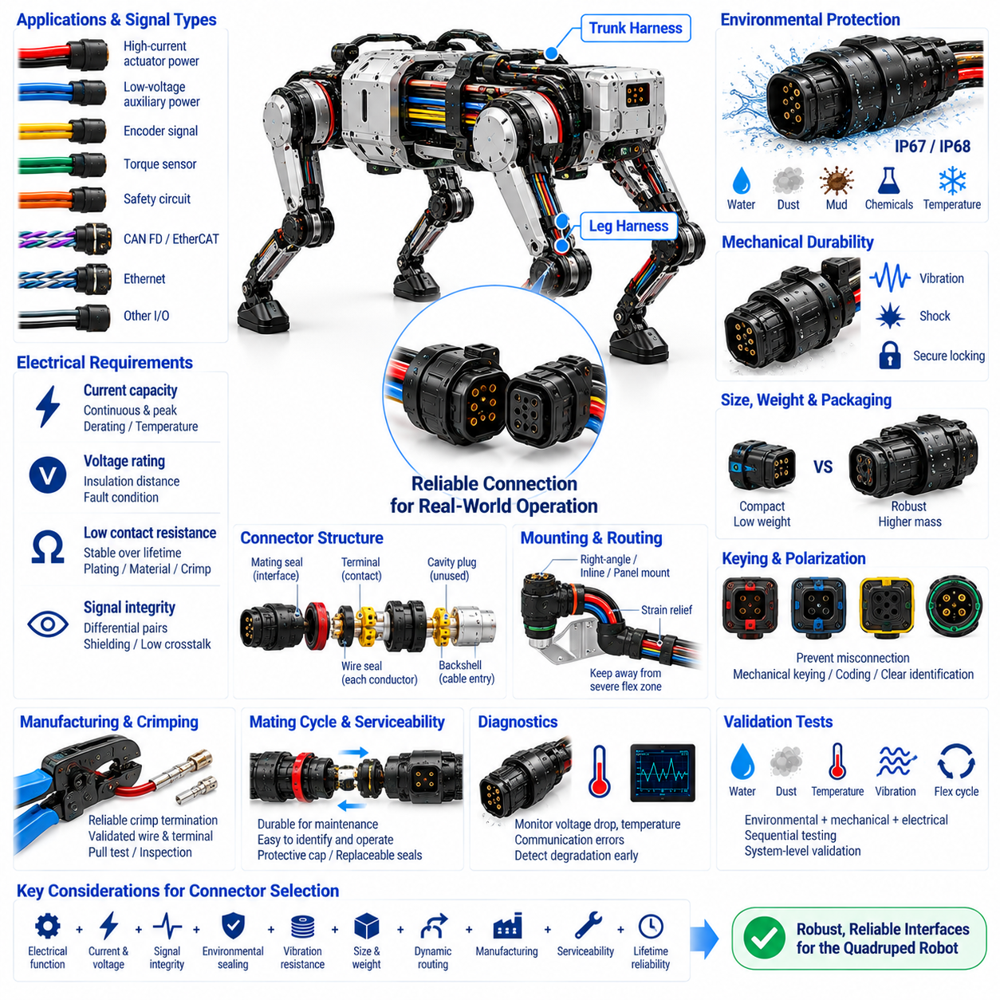
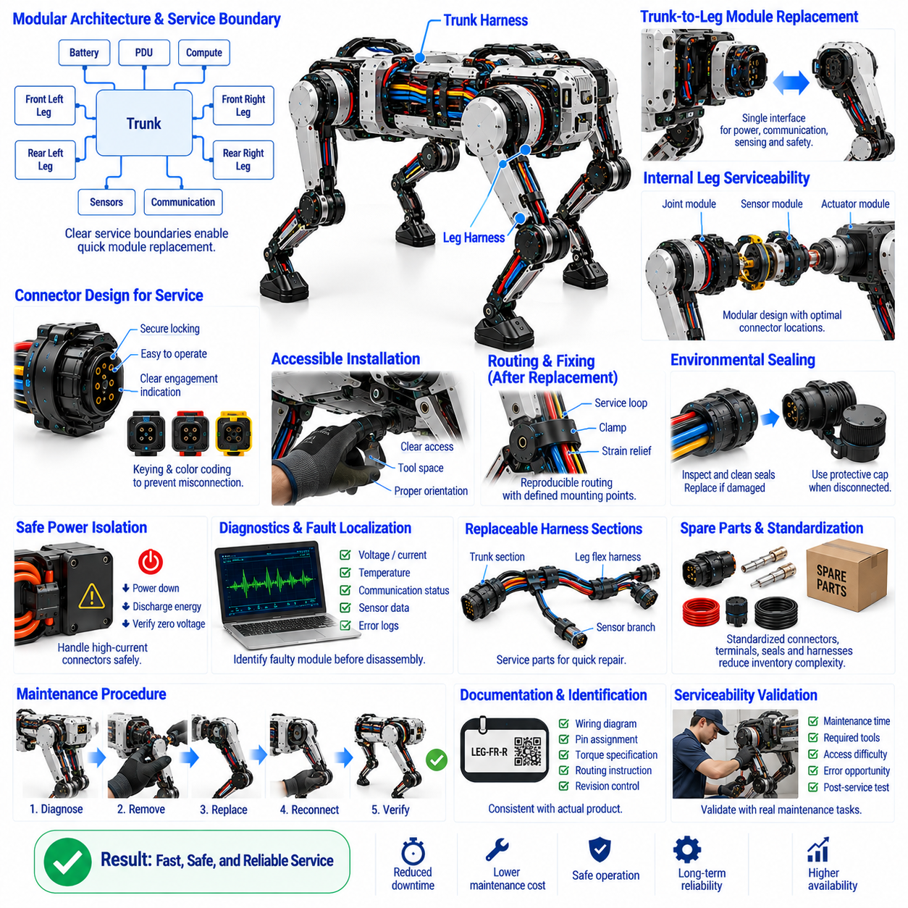

**Volume 20. Quadruped Electrical Architecture**

# Chapter 06. Harness and Connector Engineering

## 06.01. Trunk Harness

{width="7.268055555555556in" height="7.268055555555556in"}

몸통 하네스(Trunk Harness)는 사족보행 로봇(Quadruped Robot)의 주요 전기 분배 백본(Electrical Distribution Backbone)을 구성하며, 배터리(Battery)와 전력 분배 시스템(Power Distribution System)을 컴퓨팅 유닛(Computing Unit), 통신 게이트웨이(Communication Gateway), 센서(Sensor), 그리고 네 개의 다리 어셈블리(Leg Assembly)와 연결한다. 일반적인 고정형 하네스와 달리 제한된 몸체 공간에서 높은 액추에이터 전력(Actuator Power)을 전달하면서 저전압 제어(Low-Voltage Control)와 고속 통신(High-Speed Communication)의 신뢰성을 유지해야 한다.

실용적인 몸통 하네스(Trunk Harness)는 배터리(Battery)와 전력 분배 장치(Power Distribution Unit, PDU) 인근에서 시작하며, 여기에서 보호된 전력 분기(Power Branch)는 전기 부하(Electrical Load)와 안전 기능(Safety Function)에 따라 분리된다. 관절 액추에이터(Joint Actuator)에 전력을 공급하는 고전류 도체(High-Current Conductor)는 컴퓨터, 센서, 통신 장치 및 보조 전자장치에 전력을 공급하는 저전력 회로(Low-Power Circuit)와 구분하는 것이 바람직하다. 이러한 분리는 보호 협조(Protection Coordination), 전압 강하(Voltage Drop), 진단(Diagnostics), 고장 시 전력 차단(Power Isolation)을 체계적으로 관리할 수 있게 한다.

도체 크기 선정(Conductor Sizing)은 연속 전류(Continuous Current), 순간 모터 전류(Transient Motor Current), 주변 온도(Ambient Temperature), 번들 밀도(Bundle Density), 절연체 온도 등급(Insulation Temperature Rating), 허용 전압 강하(Allowable Voltage Drop), 설치 조건(Installation Condition)을 고려해야 한다. 사족보행 로봇의 액추에이터는 가속, 점프, 등반 또는 외란 복구(Disturbance Recovery) 과정에서 급격하게 변화하는 부하를 발생시킬 수 있다. 따라서 몸통 하네스에는 단시간 피크 전류(Peak Current)가 과도한 전압 저하나 도체 발열을 일으키지 않도록 충분한 전기적·열적 여유(Electrical and Thermal Margin)가 필요하다.

물리적 토폴로지(Physical Topology)는 단순히 장치를 가장 짧은 거리로 연결하는 것이 아니라 로봇의 기계 구조(Mechanical Structure)를 따라 설계해야 한다. 중앙 몸통 하네스(Central Trunk)는 몸체 내부를 통과하면서 전방 좌측(Front-Left), 전방 우측(Front-Right), 후방 좌측(Rear-Left), 후방 우측(Rear-Right) 다리 인터페이스(Leg Interface)로 분기될 수 있다. 추가 분기는 중앙 컴퓨팅 플랫폼(Central Compute Platform), 실시간 제어기(Real-Time Controller), 인지 센서(Perception Sensor), 통신 하드웨어, 안전 회로(Safety Circuit), 진단 인터페이스(Diagnostic Interface)를 연결하면서 명확한 기능적 분리(Functional Segmentation)를 유지한다.

전력 회로(Power Circuit)와 통신 회로(Communication Circuit)는 모터 드라이브(Motor Drive)와 스위칭 전력 변환기(Switching Power Converter)가 상당한 전자기 잡음(Electromagnetic Noise)을 발생시키기 때문에 신중한 배선 경로 설계가 필요하다. 패키징 공간이 허용하는 범위에서 고전류 모터 도체는 민감한 엔코더(Encoder), 관성측정장치(Inertial Measurement Unit, IMU), 이더넷(Ethernet), 시간 동기화(Time Synchronization), 센서 신호선과 물리적으로 분리해야 한다. 차동 통신선(Differential Communication Pair)은 설계된 배선 형상을 유지해야 하며, 실드(Shield)와 접지 경로(Grounding Path)는 임의로 연결하지 않고 선정된 전자파 적합성 아키텍처(EMC Architecture)에 따라 종단해야 한다.

몸통 하네스와 각 다리 사이의 인터페이스(Interface)는 상대적으로 고정된 몸체 배선과 지속적으로 움직이는 다리 플렉스 하네스(Leg Flex Harness)의 경계를 형성하기 때문에 특히 중요하다. 몸통 측에는 기계적으로 안정적인 커넥터 장착(Connector Mounting), 변형 방지(Strain Relief), 정의된 서비스 루프(Service Loop), 그리고 다리 플렉스 하네스로 연결되는 제어된 전환 구조가 필요하다. 커넥터 방향(Connector Orientation)은 로봇이 충격, 진동 또는 반복적인 다리 운동을 받을 때 케이블 하중이 접점(Contact)에 직접 전달되지 않도록 설계해야 한다.

사족보행 로봇은 지속적인 진동, 충격 하중(Impact Load), 섀시 변형(Chassis Deformation), 그리고 가혹한 현장 환경에 노출될 수 있으므로 몸체 전체에 걸친 기계적 보호(Mechanical Protection)가 필요하다. 하네스 분기부는 적절한 간격으로 고정하고 날카로운 모서리, 체결부품, 열원(Heat Source), 기어 및 움직이는 기구로부터 보호해야 한다. 슬리빙(Sleeving), 전선관(Conduit), 내마모성 피복(Abrasion-Resistant Covering), 클램프(Clamp), 그로밋(Grommet), 국부 보강(Local Reinforcement)은 각 배선 구역의 기계적 노출 수준에 따라 선정할 수 있다.

배선 경로 설계(Routing Design)는 굽힘 반경(Bend Radius)과 3차원 패키징(Three-Dimensional Packaging)도 고려해야 한다. 지나치게 작은 굽힘 반경은 도체, 실드, 연선 쌍(Twisted Pair) 또는 광학 요소(Optical Element)를 손상시키고 커넥터 백셸(Connector Backshell) 주변에 응력을 집중시킬 수 있다. 반대로 과도한 여유 길이는 보행 중 지지되지 않은 케이블이 주변 구조물과 충돌하게 만들 수 있다. 따라서 하네스 형상(Harness Geometry)은 로봇의 전체 동작 범위에서 최소 굽힘 반경과 자유 케이블 움직임을 모두 제어하도록 설계해야 한다.

몸통 하네스의 커넥터 선정(Connector Selection)은 전류 용량(Current Capacity), 정격 전압(Voltage Rating), 접촉 저항(Contact Resistance), 환경 밀봉(Environmental Sealing), 내진동성(Vibration Resistance), 결합 내구성(Mating Durability), 크기, 무게 및 정비 요구사항(Service Requirement)을 반영해야 한다. 결합 간섭과 조립 오류를 줄이기 위해 전력 커넥터(Power Connector)와 신호 커넥터(Signal Connector)를 물리적으로 분리할 수 있다. 키잉(Keying), 극성 구조(Polarization), 코딩(Coding), 커넥터 위치는 제조 및 현장 정비 과정에서 유사한 다리, 센서, 전력 또는 통신 인터페이스가 잘못 연결되는 것을 방지해야 한다.

사족보행 로봇이 실외 또는 산업 시설에서 운용될 경우 환경 보호(Environmental Protection)는 더욱 중요해진다. 물, 먼지, 진흙, 전도성 오염물질(Conductive Contamination), 세척액 및 결로(Condensation)는 설계가 미흡한 하네스 인터페이스를 통해 침투할 수 있다. 밀봉형 커넥터(Sealed Connector), 적절한 케이블 재킷(Cable Jacket), 백셸 밀봉(Backshell Sealing), 캐비티 플러그(Cavity Plug), 제어된 배수(Controlled Drainage), 적절히 설계된 하네스 인입부(Harness Entry Point)는 커넥터 자체의 명목상 IP 등급(IP Rating)에만 의존하지 않고 목표 환경 보호 성능을 유지하도록 한다.

접지(Grounding)와 실딩(Shielding)은 부수적인 설치 요소가 아니라 몸통 하네스 아키텍처의 일부로 다루어야 한다. 전력 귀환 경로(Power Return Path), 섀시 본딩(Chassis Bonding), 실드 연결(Shield Connection), 전자회로 기준 접지(Electronic Reference Ground)는 전자파 적합성(Electromagnetic Compatibility, EMC)과 센서 정확도 모두에 영향을 미친다. 제어되지 않은 귀환 전류는 접지 전위차(Ground Offset)를 발생시켜 특히 액추에이터 전류가 급격히 변할 때 엔코더, 통신 트랜시버(Communication Transceiver), 아날로그 센서 및 컴퓨팅 장비의 동작을 방해할 수 있다.

몸통 하네스는 비상 정지(Emergency Stop), 전력 활성화(Power Enable), 컨택터 제어(Contactor Control), 워치독(Watchdog), 고장 모니터링(Fault Monitoring) 신호를 안전 관련 구성요소 사이에서 전달함으로써 기능 안전(Functional Safety)에도 참여한다. 안전 필수 회로(Safety-Critical Circuit)는 단일 마모, 커넥터 고장 또는 단락(Short Circuit)이 의도된 보호 기능을 감지되지 않은 상태로 무력화하지 않도록 배선하고 보호해야 한다. 필요한 경우 독립 도체(Independent Conductor), 이중화 채널(Redundant Channel), 진단 피드백(Diagnostic Feedback), 물리적 분리(Physical Separation)를 적용하여 공통 원인 취약성(Common-Cause Vulnerability)을 줄일 수 있다.

정비성(Serviceability)은 초기 아키텍처 설계 단계부터 고려해야 한다. 사족보행 로봇은 전체 하네스를 제거하지 않고도 다리, 컴퓨팅 모듈(Compute Module), 배터리 어셈블리, 센서 패키지 또는 전력 분배 장치를 교체할 수 있어야 한다. 모듈형 커넥터(Modular Connector)와 명확하게 정의된 전기적 경계(Electrical Boundary)는 정비 기술자가 결함 어셈블리를 효율적으로 분리할 수 있게 한다. 식별 라벨(Identification Label), 커넥터 코드(Connector Code), 분기 표시(Branch Marking), 문서화된 핀 할당(Pin Assignment)은 정비 오류와 고장 진단 시간을 더욱 줄여준다.

하네스 진단(Harness Diagnostics)은 단순한 도통 검사(Continuity Check)를 넘어 확장될 수 있다. 전압 감지(Voltage Sensing), 전류 모니터링(Current Monitoring), 통신 오류 카운터(Communication Error Counter), 절연 또는 단락 검출(Insulation or Short-Circuit Detection), 커넥터 온도 모니터링(Connector Temperature Monitoring), 지능형 전력 분배(Intelligent Power Distribution)는 진행 중인 전기적 문제를 조기에 식별하는 데 활용될 수 있다. 이러한 신호를 개별 몸통 분기 또는 다리 인터페이스와 연계하면 로봇이 액추에이터 고장과 배선 고장을 구분하고 예지 정비(Predictive Maintenance)를 수행하는 데 도움이 된다.

많은 하네스 고장이 크림프(Crimp), 스플라이스(Splice), 실(Seal), 커넥터 종단(Connector Termination), 또는 부적절하게 관리된 분기 전환부에서 시작되므로 제조 품질(Manufacturing Quality)은 장기 신뢰성에 직접적인 영향을 미친다. 따라서 전선 전처리(Wire Preparation), 크림프 힘(Crimp Force), 단자 삽입(Terminal Insertion), 실 장착(Seal Installation), 스플라이스 제작(Splice Construction), 실드 종단(Shield Termination), 치수 기반 배선(Dimensional Routing)은 관리된 공정에 따라 수행해야 한다. 생산라인 종단 검사(End-of-Line Testing)를 통해 도통, 절연, 핀 매핑(Pin Mapping), 저항, 통신 무결성(Communication Integrity), 주요 전력 경로 특성을 검증할 수 있다.

완성된 몸통 하네스는 독립적인 배선 부품으로만 검증하는 것이 아니라 조립된 로봇 시스템의 일부로 검증해야 한다. 전기 부하 시험(Electrical Load Testing), 전압 강하 측정(Voltage-Drop Measurement), 열 평가(Thermal Evaluation), 진동 시험(Vibration Testing), 전자파 적합성 시험(EMC Testing), 환경 노출 시험(Environmental Exposure), 반복 보행 시험(Repeated Locomotion Trial)을 통해 벤치 검사에서 발견하기 어려운 상호작용을 확인할 수 있다. 특히 분기점, 커넥터 인터페이스, 클램프 위치, 고정형 몸통 배선과 동적 다리 하네스 사이의 전환부를 중점적으로 평가해야 한다.

잘 설계된 몸통 하네스(Trunk Harness)는 궁극적으로 사족보행 로봇의 전력(Power), 컴퓨팅(Computing), 통신(Communication), 센싱(Sensing), 안전(Safety), 구동(Actuation) 아키텍처를 연결하는 공학적 물리 인터페이스(Engineered Physical Interface)로 기능한다. 그 설계 품질은 이동 성능(Mobility Performance), 전자파 강건성(Electromagnetic Robustness), 환경 내구성(Environmental Durability), 정비성(Maintainability), 시스템 가용성(System Availability)에 직접적인 영향을 준다. 단순한 전선 집합이 아니라 시스템 수준 백본(System-Level Backbone)으로 설계하는 것이 고성능 사족보행 플랫폼으로 확장하기 위한 안정적인 기반을 제공한다.

## 06.02. Leg Flex Harness

{width="7.268055555555556in" height="7.268055555555556in"}

다리 플렉스 하네스(Leg Flex Harness)는 상대적으로 고정된 몸통 하네스(Trunk Harness)와 사족보행 로봇의 각 다리에 분산된 움직이는 전기 구성요소를 연결하는 동적 전기 연결부(Dynamic Electrical Link)이다. 이 하네스는 보행 중 지속적으로 회전하는 관절을 가로질러 액추에이터 전력(Actuator Power), 모터 제어 통신(Motor-Control Communication), 엔코더 신호(Encoder Signal), 토크 또는 힘 센싱(Torque or Force Sensing), 온도 모니터링(Temperature Monitoring), 보조 회로(Auxiliary Circuit)를 전달한다. 따라서 전기적 용량과 높은 기계적 유연성 및 피로 수명(Fatigue Resistance)을 동시에 확보해야 한다.

주로 섀시 진동(Chassis Vibration)과 제한적인 구조 운동을 받는 몸통 하네스와 달리, 다리 플렉스 하네스는 반복적인 굽힘(Bending), 비틀림(Twisting), 가속(Acceleration), 방향 전환(Direction Reversal)을 지속적으로 받는다. 단순한 보행만으로도 로봇의 운용 수명 동안 수백만 회의 굽힘 사이클(Flex Cycle)이 발생할 수 있으며, 달리기, 등반, 점프 또는 외란 복구(Disturbance Recovery)는 운동 범위와 기계적 하중을 더욱 증가시킨다. 따라서 케이블 구조는 정적 설치용이 아니라 연속적인 동적 운용(Continuous Dynamic Operation)에 적합하도록 선정해야 한다.

전기 아키텍처(Electrical Architecture)는 일반적으로 엉덩이 영역(Hip Region)에서 무릎(Knee), 하퇴부(Lower Leg), 발(Foot) 방향으로 이어지는 다리의 기계적 계층 구조(Mechanical Hierarchy)를 따른다. 전력 및 통신 경로는 관련 장치에 도달하기 전에 여러 관절 영역을 통과할 수 있다. 분기 위치(Branch Location)는 모듈 경계(Module Boundary)와 일치하도록 설계하여 개별 액추에이터, 센서 또는 전체 다리 구간을 교체할 때 관련 없는 배선을 건드리거나 로봇을 광범위하게 분해하지 않도록 해야 한다.

도체 선정(Conductor Selection)은 전류 용량(Current Capacity)과 굽힘 수명(Flex Life)을 모두 고려해야 한다. 고연선 도체(High-Strand-Count Conductor)는 기계적 변형을 다수의 미세 소선에 분산시킬 수 있으므로 정적 배선에만 최적화된 도체보다 반복 운동에 일반적으로 더 적합하다. 그러나 도체 단면적(Conductor Cross-Section)은 예상 운용 환경 전체에서 연속 및 피크 액추에이터 전류, 허용 전압 강하(Allowable Voltage Drop), 온도 상승(Temperature Rise), 절연 등급(Insulation Rating), 번들 디레이팅(Bundle Derating), 고장 전류(Fault Current) 요구사항을 만족해야 한다.

관절 운동(Joint Motion)은 가장 중요한 배선 경로 제약조건(Routing Constraint)을 결정한다. 각 케이블 구간은 움직임이 급격한 접힘, 제어되지 않은 비틀림 또는 인장 하중(Tensile Loading)이 아니라 제어된 굽힘(Controlled Bending)을 발생시키도록 배치해야 한다. 최소 동적 굽힘 반경(Minimum Dynamic Bend Radius)은 전체 관절 운동 범위에서 유지되어야 한다. 또한 하네스가 끼임 지점(Pinch Point)에 진입하거나 회전 부품과 마찰하거나 날카로운 구조물과 접촉하거나 움직이는 기계 요소 사이에 끼이지 않도록 배선해야 한다.

엉덩이 영역(Hip Region)은 여러 회전축(Rotational Axis)이 복합적인 굽힘과 비틀림 운동을 발생시킬 수 있기 때문에 특히 복잡한 설계 과제가 된다. 하나의 축에서는 양호하게 작동하는 배선 전략이 다른 축이 동시에 움직일 경우 과도한 비틀림을 발생시킬 수 있다. 따라서 하네스 경로(Harness Path)는 각 축을 독립적으로 시험하는 것에 그치지 않고 극한 자세(Extreme Posture)와 복합 관절 운동(Combined Joint Movement)을 포함하는 전체 3차원 관절 작업공간(Three-Dimensional Joint Workspace)을 기준으로 평가해야 한다.

무릎 및 하퇴부 배선(Knee and Lower-Leg Routing)은 일반적으로 제한된 기계적 공간에서 큰 반복 각운동(Angular Motion)을 받는다. 제어된 서비스 루프(Service Loop)는 관절 운동에 필요한 추가 케이블 길이를 제공할 수 있지만 과도한 여유 길이는 케이블 휘날림(Whipping), 마모(Abrasion), 얽힘(Entanglement)을 발생시킬 수 있다. 따라서 루프 형상(Loop Geometry)은 기계적 변형이 커넥터나 클램프 바로 뒤에 집중되지 않고 설계된 굽힘 영역(Flex Zone) 전체에 분산되도록 예측 가능한 변형 패턴을 가져야 한다.

변형 방지(Strain Relief)는 유연한 케이블과 기계적으로 고정된 구성요소 사이의 모든 전환부에서 필수적이다. 커넥터(Connector), 스플라이스 영역(Splice Region), 센서 인터페이스(Sensor Interface), 액추에이터 인입부(Actuator Entry)는 반복적인 케이블 굽힘 하중이 전기적 종단부(Electrical Termination)에 직접 전달되지 않도록 해야 한다. 적절한 클램프, 부트(Boot), 백셸(Backshell), 몰딩 전환부(Molded Transition), 유연한 지지 구조(Flexible Support Structure)는 접점과 도체 종단부에서 기계적 하중을 분산하면서 필요한 관절 움직임의 자유도를 유지한다.

BLDC 또는 PMSM 액추에이터의 전력 도체(Power Conductor)는 주변 엔코더, 토크 센서, 통신 및 저레벨 측정 회로(Low-Level Measurement Circuit)에 영향을 줄 수 있는 전자기 간섭(Electromagnetic Interference, EMI)을 발생시킬 수 있다. 패키징이 허용하는 경우 모터 전력선과 민감한 신호선 사이에 물리적 간격을 유지해야 한다. 꼬임 차동선(Twisted Differential Pair), 적절한 실딩(Shielding), 제어된 귀환 경로(Return Path), 적절한 실드 종단(Shield Termination)을 적용하면 동적 굽힘 수명을 저하시키는 과도한 케이블 강성을 피하면서 신호 무결성(Signal Integrity)을 유지할 수 있다.

CAN FD 또는 EtherCAT과 같은 통신 네트워크(Communication Network)는 반복적인 케이블 변형으로 인해 선쌍 구조(Pair Geometry)나 임피던스(Impedance)가 크게 변하지 않도록 추가적인 주의가 필요하다. 차동 선쌍(Differential Pair)은 동적 구간과 커넥터 전환부에서도 제어된 꼬임 구조를 유지해야 한다. 기계적 손상, 실드 열화(Shield Degradation), 도체 피로(Conductor Fatigue)는 완전한 전기적 단선보다 간헐적 통신 오류(Intermittent Communication Error)로 먼저 나타날 수 있으므로 네트워크 오류 모니터링(Network Error Monitoring)은 초기 하네스 열화를 감지하는 데 유용하다.

환경 보호(Environmental Protection)는 하네스가 움직이는 동안에도 유지되어야 한다. 사족보행 로봇의 다리는 몸통 내부의 전자장치보다 물, 먼지, 진흙, 오일, 세척액, 식생(Vegetation), 모래 및 기타 오염물질에 훨씬 직접적으로 노출될 수 있다. 따라서 케이블 재킷(Cable Jacket), 실(Seal), 커넥터 인터페이스, 보호 슬리브(Protective Sleeve), 부트는 균열, 풀림 또는 수분 침투 경로를 발생시키지 않으면서 환경 노출과 반복적인 기계 변형을 모두 견딜 수 있어야 한다.

보호 피복(Protective Covering)은 내구성과 유연성 사이의 균형을 유지해야 한다. 무거운 전선관(Conduit)이나 과도한 보강은 내마모성(Abrasion Resistance)을 높일 수 있지만 질량, 강성 및 관절 저항(Joint Resistance)을 증가시킨다. 반대로 가볍고 보호되지 않은 케이블은 뛰어난 유연성을 확보할 수 있지만 현장 운용에서 빠르게 마모될 수 있다. 따라서 슬리빙(Sleeving), 편조 보호재(Braided Protection), 국부 마모 보호대(Local Abrasion Guard), 유연 전선관(Flexible Conduit), 전략적으로 배치된 기계적 커버(Mechanical Cover)를 각 다리 영역의 노출 수준에 맞추어 적용해야 한다.

하네스의 질량과 강성(Harness Mass and Stiffness)은 배선 자체가 움직이는 기계 시스템의 일부가 되기 때문에 다리 동역학(Leg Dynamics)에 영향을 줄 수 있다. 하퇴부나 발과 같은 원위부(Distal Section)의 추가 질량은 관성(Inertia)을 증가시키고 액추에이터 효율을 저하시킬 수 있다. 과도한 케이블 강성 역시 기생 관절 토크(Parasitic Joint Torque)를 발생시키거나 제어 동작에 영향을 줄 수 있다. 따라서 동적 하네스 설계는 필요한 전기적·환경적·기계적 신뢰성을 유지하면서 불필요한 재료를 최소화해야 한다.

커넥터 위치(Connector Placement)는 가능한 경우 운동량이 가장 큰 영역을 피해야 한다. 인터페이스는 커넥터를 견고하게 장착하고 직접적인 충격으로부터 보호할 수 있는 기계적으로 안정적인 영역에 배치하는 것이 바람직하다. 키잉(Keying)과 극성 구조(Polarization)는 오조립을 방지하며 적절한 잠금 구조(Locking Mechanism)는 진동으로 인한 분리를 방지한다. 외부에 노출된 다리 영역에는 밀봉형 커넥터(Sealed Connector)가 필요할 수 있지만 커넥터의 크기와 강성도 전체 동적 하네스 설계의 일부로 고려해야 한다.

다리는 충격과 기계적 손상에 가장 많이 노출되는 구성요소 중 하나이므로 다리 플렉스 하네스는 모듈형 정비(Modular Service)와 교체를 지원해야 한다. 명확하게 정의된 몸통-다리 커넥터(Trunk-to-Leg Connector)를 적용하면 중앙 전기 아키텍처를 개방하지 않고 전체 다리 어셈블리를 분리할 수 있다. 추가 내부 인터페이스를 통해 관절 모듈이나 센서의 교체를 지원할 수 있지만, 모든 인터페이스는 저항, 질량, 패키징 요구사항 및 잠재적 고장 지점을 증가시키므로 과도한 커넥터 사용은 피해야 한다.

진단(Diagnostics)은 케이블 열화와 액추에이터 또는 센서 고장을 구분하는 데 도움이 될 수 있다. 간헐적인 통신 오류, 비정상적인 전압 강하, 증가하는 접촉 저항(Contact Resistance), 예상하지 못한 센서 단절(Sensor Discontinuity), 온도 변화는 진행 중인 하네스 문제를 나타낼 수 있다. 특히 손상된 도체는 다리가 특정 각도에 도달할 때만 고장을 일으킬 수 있으므로 이러한 증상을 관절 위치(Joint Position) 및 움직임과 연계하면 기존의 정적 도통 검사(Stationary Continuity Testing)만으로 발견하기 어려운 문제를 진단할 수 있다.

검증(Validation)은 정적인 전기 시험에만 의존하지 않고 실제와 유사한 동적 하중(Dynamic Loading)을 재현해야 한다. 굽힘 사이클 시험(Flex-Cycle Testing), 비틀림 시험(Torsion Testing), 전체 범위 관절 운동(Full-Range Joint Motion), 진동, 충격, 온도 사이클링(Temperature Cycling), 환경 노출, 전원이 인가된 보행 시험(Powered Locomotion Trial)을 통해 취약한 배선 영역을 식별해야 한다. 가장 심각한 하네스 변형은 단일 관절의 한계 위치보다 복잡한 전체 다리 운동에서 발생할 수 있으므로 대표적인 복합 관절 움직임을 시험에 포함해야 한다.

신뢰성 높은 다리 플렉스 하네스(Leg Flex Harness)는 다리 기구 설계가 완료된 이후 단순히 부착하는 유연 배선이 아니라 전기와 기계를 함께 설계하는 통합 서브시스템(Integrated Subsystem)이다. 관절 형상(Joint Geometry), 액추에이터 배치(Actuator Placement), 커넥터 위치, 케이블 구조(Cable Construction), 배선 공간(Routing Volume), 보호 구조, 센싱(Sensing), 정비 전략(Service Strategy)을 함께 개발해야 한다. 이러한 통합 접근법은 지속적인 보행에서도 전기적 연결성을 유지하면서 이동성(Mobility), 신호 무결성, 안전성(Safety), 정비성(Maintainability), 장기적인 사족보행 로봇 신뢰성(Quadruped Reliability)을 확보할 수 있게 한다.

## 06.03. Dynamic Cable Routing

{width="7.268055555555556in" height="7.268055555555556in"}

동적 케이블 라우팅(Dynamic Cable Routing)은 사족보행 로봇(Quadruped Robot)의 움직이는 영역을 통과하는 전기 도체(Electrical Conductor)와 통신선(Communication Line)을 전기적 성능과 기계적 내구성(Mechanical Durability)을 유지하면서 배치하는 방법을 정의한다. 정적인 몸체 배선과 달리 엉덩이(Hip), 무릎(Knee), 발목(Ankle) 및 기타 관절 인터페이스 주변의 케이블은 보행 중 지속적으로 형상이 변한다. 따라서 라우팅은 최종 패키징 작업이 아니라 관절 메커니즘(Joint Mechanism)의 일부로 설계해야 한다.

기본적인 목표는 복잡한 관절 운동(Joint Motion)을 예측 가능한 케이블 변형(Cable Deformation)으로 변환하는 것이다. 적절하게 배치된 케이블은 급격하게 접히거나 축 방향으로 늘어나거나 예측 불가능하게 비틀리는 대신 정의된 굽힘 영역(Flex Zone)에서 점진적으로 굽혀져야 한다. 케이블 경로(Cable Path), 고정 지점(Fixing Point), 자유 길이(Free Length), 방향(Orientation)은 기계적 변형이 발생하는 위치를 결정한다. 이러한 요소는 실제 하네스 치수를 확정하기 전에 전체 관절 작업공간(Joint Workspace)을 기준으로 설정해야 한다.

최소 동적 굽힘 반경(Minimum Dynamic Bend Radius)은 가장 중요한 라우팅 제약조건 중 하나이다. 케이블의 허용 반경보다 작은 상태에서 반복적으로 굽혀지면 도체 피로(Conductor Fatigue), 절연체 균열(Insulation Cracking), 실드 열화(Shield Degradation), 임피던스 변화(Impedance Variation)가 가속될 수 있다. 필요한 반경은 케이블 직경, 도체 구조, 절연 재료, 실딩(Shielding), 굽힘 사이클 요구조건(Flex-Cycle Requirement)에 따라 달라진다. 동적 응용에서는 일반적으로 동일한 케이블을 고정형 장비에 설치할 때보다 더 보수적인 굽힘 반경 관리가 필요하다.

케이블 길이는 제어되지 않는 여유 길이를 발생시키지 않으면서 전체 기계적 운동 범위를 충분히 허용해야 한다. 케이블이 너무 짧으면 관절의 극한 위치에서 인장 하중(Tensile Loading)이 발생하고, 지나치게 길면 휘날림(Whipping), 마찰(Rubbing), 얽힘(Entanglement), 인접 기구와의 간섭(Interference)이 발생할 수 있다. 제어된 서비스 루프(Service Loop)를 이용해 운동에 필요한 길이를 확보할 수 있지만, 보행, 달리기, 웅크리기, 등반 및 자세 복구 동작 전체에서 루프의 형상과 변형 방향이 예측 가능하게 유지되어야 한다.

다축 엉덩이 관절(Multi-Axis Hip Joint) 주변의 라우팅은 하네스가 굽힘과 비틀림을 동시에 받을 수 있기 때문에 특히 어렵다. 하나의 회전축에 최적화된 경로가 외전(Abduction), 내전(Adduction), 굴곡(Flexion), 신전(Extension)이 동시에 발생하면 심하게 비틀릴 수 있다. 따라서 라우팅 공간(Routing Volume)은 대표적인 복합 운동을 통해 평가해야 하며, 누적 케이블 비틀림(Accumulated Cable Twist)과 반복 운동에 의해 하네스가 점진적으로 회전하거나 위치가 이동하는 가능성도 고려해야 한다.

무릎 라우팅(Knee Routing)은 일반적으로 더 크지만 상대적으로 예측 가능한 각도 운동 범위(Angular Sweep)를 갖는다. 케이블은 주요 변형이 관절 주변의 넓고 제어된 원호(Controlled Arc)를 따라 발생하도록 배치할 수 있다. 고정 지점은 굽힘 영역이 커넥터 또는 날카로운 기계적 경계로 이동하지 않도록 해야 한다. 최대 굴곡(Maximum Flexion)과 최대 신전(Maximum Extension) 상태에서도 하네스와 링크(Link), 액추에이터 하우징(Actuator Housing), 커버, 체결부품 및 주변 구조물 사이에 충분한 간격이 유지되어야 한다.

고정 케이블 구간과 움직이는 케이블 구간 사이의 전환부에는 신중하게 설계된 변형 방지(Strain Relief)가 필요하다. 강한 굽힘 영역 바로 옆에 강성 클램프(Rigid Clamp)를 설치하면 클램프 가장자리에 기계적 응력이 집중될 수 있으며, 반대로 구속이 부족하면 전체 하네스가 예측할 수 없는 방식으로 움직일 수 있다. 유연한 부트(Flexible Boot), 제어된 클램프 간격(Controlled Clamp Spacing), 순응형 지지 구조(Compliant Support), 적절한 보호 슬리빙(Protective Sleeving)을 이용한 점진적 전환 구조는 케이블의 더 긴 구간에 변형을 분산시킬 수 있다.

끼임 지점 회피(Pinch-Point Avoidance)는 전체 운동 범위(Motion Envelope)에 걸쳐 검증해야 한다. 정상적인 기립 자세에서는 충분한 공간이 있어 보이는 케이블도 깊게 웅크리거나 방향을 전환하거나 등반하거나 충격 후 자세를 복구하는 과정에서 링크 또는 액추에이터 하우징 사이에 끼일 수 있다. 따라서 간격 분석(Clearance Analysis)은 명목상의 CAD 표면만을 기준으로 하지 않고 제조 공차(Manufacturing Tolerance), 케이블 직경 편차, 하네스 움직임, 구조 변형(Structural Deflection), 커넥터 형상을 함께 고려해야 한다.

마모(Abrasion)는 또 다른 주요 동적 라우팅 고장 메커니즘(Dynamic-Routing Failure Mechanism)이다. 작은 접촉력이라도 반복적으로 작용하면 보호 슬리빙, 케이블 재킷(Cable Jacket), 실드, 절연체가 결국 손상될 수 있다. 따라서 가능한 경우 하네스가 지속적으로 미끄러지며 접촉하는 구조를 피해야 한다. 접촉을 제거할 수 없는 경우에는 국부 마모 보호대(Local Abrasion Guard), 매끄러운 가이드 표면(Smooth Guide Surface), 교체 가능한 보호 슬리브(Replaceable Protective Sleeve), 기계적으로 정의된 케이블 가이드(Cable Guide)를 적용하여 마모를 제어하고 전기적으로 중요한 층의 손상을 방지할 수 있다.

케이블 비틀림(Cable Torsion)은 많은 케이블 구조가 굽힘과 비틀림 하중을 서로 다르게 견디기 때문에 굽힘과 별도로 관리해야 한다. 반복적인 축 방향 비틀림(Axial Twisting)은 실드를 느슨하게 만들고 선쌍 구조(Pair Geometry)를 변화시키며 도체 소선을 손상시키고 토크를 커넥터 종단부(Connector Termination)로 전달할 수 있다. 라우팅은 누적 비틀림을 최소화하고 충분한 자유 케이블 길이에 걸쳐 비틀림 변형이 분산되도록 해야 한다. 다축 관절에는 비틀림 정격 케이블(Torsion-Rated Cable) 또는 전용 기계식 가이드(Mechanical Guidance)가 필요할 수 있다.

제한된 동적 라우팅 공간에서도 전기적 분리(Electrical Separation) 요구사항은 중요하다. 고전류 모터 도체(High-Current Motor Conductor)는 엔코더, 토크 센서, 통신선 및 기타 저레벨 신호선(Low-Level Signal Line) 주변에서 전자기 간섭(Electromagnetic Interference, EMI)을 발생시킬 수 있다. 물리적 분리가 제한되는 경우 꼬임 선쌍(Twisted Pair), 실딩, 제어된 귀환 경로(Controlled Return Path), 적절한 케이블 그룹화(Cable Grouping)가 더욱 중요해진다. 라우팅은 번들이 과도하게 강해지지 않으면서 움직일 수 있도록 이러한 전기적 관계를 유지해야 한다.

고속 통신 케이블(High-Speed Communication Cable)은 전기적 특성이 도체 형상에 영향을 받기 때문에 추가적인 기계적 제약조건을 갖는다. 이더넷(Ethernet), EtherCAT 또는 이와 유사한 차동 링크(Differential Link)의 반복 변형이 선쌍 꼬임(Pair Twist), 특성 임피던스(Characteristic Impedance), 실드 연속성(Shielding Continuity)을 크게 변화시키지 않도록 해야 한다. 특히 커넥터와 전환 영역은 급격한 기계적 강성 변화가 응력을 집중시켜 완전한 도체 단선보다 먼저 간헐적인 통신 고장(Intermittent Communication Fault)을 발생시킬 수 있으므로 주의해야 한다.

케이블 번들(Cable Bundle)을 항상 하나의 유연한 요소로 간주해서는 안 된다. 굵은 전력 도체, 통신 선쌍, 센서 배선, 안전 회로(Safety Circuit)를 하나의 강하게 구속된 번들에 결합하면 과도한 강성이 발생하고 모든 회로가 동일한 굽힘 경로를 따라가도록 강제될 수 있다. 일부 관절 영역에서는 하네스를 더 작은 기능 그룹(Functional Group)으로 분리함으로써 유연성(Flexibility), 전자파 적합성(Electromagnetic Compatibility), 열적 특성(Thermal Behavior), 고장 격리(Fault Isolation)를 향상시킬 수 있다.

하네스 지지 구조(Harness Support)는 관절에 필요한 움직임을 방해하지 않으면서 케이블의 운동을 제어해야 한다. 클램프(Clamp), 가이드(Guide), 클립(Clip), 브래킷(Bracket)은 유효 굽힘 길이(Effective Flex Length)를 결정하고 케이블 하중이 로봇 구조물로 전달되는 방식을 결정한다. 따라서 이들의 위치는 단순히 조립 편의성을 기준으로 선택하는 것이 아니라 공학적으로 설계해야 한다. 지지 구조의 형상 역시 반복 운동 과정에서 케이블을 손상시킬 수 있는 날카로운 모서리와 집중 압력(Concentrated Pressure)을 피해야 한다.

환경 보호(Environmental Protection)와 동적 라우팅은 함께 고려해야 한다. 물, 먼지, 진흙, 모래, 오일 및 세척액은 움직이는 인터페이스 내부로 침투하거나 케이블과 보호 구조 사이에 축적될 수 있다. 보호 슬리브와 부트는 반복적으로 굽혀지는 동안에도 보호 기능을 유지해야 하며, 배수 경로(Drainage Path)는 낮은 위치에 오염물질이 축적되는 것을 방지해야 한다. 재료는 예상되는 운용 온도 범위와 환경 노출 조건 전체에서 충분한 유연성을 유지해야 한다.

라우팅 설계는 다리 동역학(Leg Dynamics)에도 영향을 미친다. 케이블의 질량, 강성 및 마찰은 관절 액추에이터가 움직임 과정에서 극복해야 하는 힘을 발생시킨다. 이러한 영향은 추가적인 이동 질량이 관성(Inertia)을 증가시키는 다리 원위부(Distal Leg)에서 특히 중요하다. 잘 설계된 라우팅 시스템은 불필요한 케이블 길이와 무거운 보호 구조를 최소화하면서 케이블 힘을 정밀 관절 제어(Precision Joint Control)에 영향을 주지 않을 정도로 작고 반복 가능하게 유지한다.

정비성(Serviceability)을 확보하려면 유지보수 이후에도 동적 라우팅 경로를 이해하고 동일하게 재현할 수 있어야 한다. 기술자는 하네스 또는 관절 모듈을 교체한 뒤 원래의 케이블 경로, 클램프 위치, 서비스 루프 형상(Service-Loop Geometry), 커넥터 방향을 복원할 수 있어야 한다. 명확하게 정의된 라우팅 기준(Routing Reference)과 조립 구조는 로봇 간 편차를 줄이고 정비 과정에서 굽힘 수명을 단축하거나 움직이는 구조물과의 간섭을 발생시키는 것을 방지한다.

동적 하네스 진단(Dynamic Harness Diagnostics)은 전기적 고장과 관절 위치 사이의 관계를 활용할 수 있다. 특정 관절 각도에서 반복적으로 발생하는 간헐적 저항 변화, 통신 오류, 센서 신호 단절(Sensor Dropout), 전력 이상(Power Disturbance)은 도체 피로 또는 커넥터 응력(Connector Stress)을 나타낼 수 있다. 이러한 이벤트를 관절 위치(Joint Position), 속도(Velocity), 하중(Load)과 함께 기록하면 라우팅 관련 열화와 액추에이터, 센서 또는 제어기 고장을 구분하는 데 유용한 근거를 제공한다.

검증(Validation)은 기계 시뮬레이션(Mechanical Simulation), 패키징 검사(Packaging Inspection), 실제 내구 시험(Physical Endurance Testing)을 결합해야 한다. 전체 범위 관절 운동 시험은 명확한 간섭 문제를 식별할 수 있으며, 반복 굽힘 및 비틀림 사이클 시험은 정적 형상만으로 예측하기 어려운 피로 메커니즘(Fatigue Mechanism)을 확인할 수 있다. 실제 보행 시험(Powered Locomotion Test)에는 대표적인 걷기, 달리기, 방향 전환, 웅크리기, 등반 및 외란 복구 동작을 포함하여 실제와 유사한 관절 운동과 진동의 조합을 재현해야 한다.

최종적인 동적 케이블 라우팅 아키텍처(Dynamic Cable Routing Architecture)는 관절 운동학(Joint Kinematics), 케이블 구조(Cable Construction), 전기적 기능(Electrical Function), 기계적 보호(Mechanical Protection), 환경 밀봉(Environmental Sealing), 정비성(Serviceability), 예상 수명(Expected Lifetime) 사이의 통합된 관계로 구성된다. 성공적인 라우팅은 제어된 굽힘 반경, 최소화된 비틀림, 충분한 간격, 보호된 전환 영역을 통해 예측 가능한 케이블 변형을 만든다. 이를 통해 사족보행 로봇은 지속적이고 매우 역동적인 보행 환경에서도 안정적인 전기적 연결(Electrical Connectivity)을 유지할 수 있다.

## 06.04. IP67/IP68 Design

{width="7.268055555555556in" height="7.268055555555556in"}

사족보행 로봇 하네스의 침투 보호(Ingress Protection)는 개별 커넥터에 표시된 보호 등급만으로 결정하는 것이 아니라 완전한 밀봉 시스템(Sealing System)으로 설계해야 한다. IP67 및 IP68 보호 성능은 커넥터, 케이블 재킷(Cable Jacket), 실(Seal), 백셸(Backshell), 인클로저 인터페이스(Enclosure Interface), 분기점(Branch Point), 조립 품질(Assembly Quality)의 상호작용에 따라 결정된다. 하나의 취약한 전환부만 존재해도 물이나 오염물질이 다른 밀봉된 전기 구성요소를 우회하여 침투할 수 있다.

IP67은 일반적으로 먼지 침투에 대한 보호와 정의된 시험 조건에서의 일시적 침수(Temporary Immersion)에 대한 보호를 나타내며, IP68은 특정 제품에 대해 합의된 조건에 따른 지속적 또는 더욱 가혹한 침수(Continuous or More Demanding Immersion)에 대응한다. 이러한 등급을 모든 수심, 시간, 온도 또는 운용 환경에 적용되는 보편적인 보증으로 해석해서는 안 된다. 따라서 로봇 제조사는 구성요소와 검증 절차를 선정하기 전에 실제 운용 환경에 적합한 노출 요구사항(Exposure Requirement)을 정의해야 한다.

사족보행 로봇은 전기 시스템이 지면 가까이에서 작동하며 먼지, 비, 물웅덩이, 진흙, 물 튀김(Splash), 젖은 식생(Wet Vegetation), 세척 과정 및 결로(Condensation)에 반복적으로 노출되기 때문에 까다로운 밀봉 조건을 갖는다. 또한 다리 운동은 반복적인 압력 및 체적 변화를 통해 오염물질을 인터페이스 방향으로 이동시키는 펌핑 효과(Pumping Effect)를 발생시킬 수 있다. 따라서 환경 설계는 직접적인 외부 노출뿐만 아니라 움직이는 케이블과 기계 구조를 통해 이동하는 오염물질까지 고려해야 한다.

몸통 하네스(Trunk Harness)와 다리 플렉스 하네스(Leg Flex Harness)는 서로 다른 환경적 위험(Environmental Risk)에 노출된다. 몸체에 장착된 연결부는 일반적으로 커버와 내부 패키징으로 보호할 수 있지만, 다리 커넥터는 직접적인 물 튀김, 진흙 충격 및 일시적인 침수에 노출될 수 있다. 따라서 커넥터 위치(Connector Location)는 밀봉 전략(Sealing Strategy)의 일부로 다루어야 한다. 움직임이 많거나 외부에 크게 노출된 인터페이스에는 중앙 몸체 내부의 보호된 연결부보다 높은 수준의 기계적 보호와 밀봉 강건성(Sealing Robustness)이 필요하다.

커넥터 밀봉(Connector Sealing)은 일반적으로 인터페이스 실(Interface Seal), 개별 전선 실(Individual Wire Seal), 캐비티 플러그(Cavity Plug), 밀봉형 백셸 또는 케이블 인입 구조(Cable-Entry Structure)의 조합으로 구성된다. 결합 인터페이스(Mating Interface)는 커넥터 양쪽 사이로 오염물질이 통과하는 것을 방지하고, 후방 전선 실(Rear Wire Seal)은 개별 도체를 따라 오염물질이 침투하는 것을 제한한다. 사용하지 않는 캐비티도 올바르게 밀폐해야 하며, 빈 단자 위치는 커넥터 하우징 자체가 적절한 환경 등급을 가지고 있더라도 직접적인 누설 경로(Leakage Path)가 될 수 있다.

케이블 인입부(Cable Entry Region)는 손상된 재킷이나 불완전하게 밀봉된 종단부를 통해 물이 침투한 이후 도체 또는 케이블 층 사이를 따라 이동할 수 있으므로 특별한 주의가 필요하다. 커넥터 전면만 밀봉하는 것으로는 이러한 종방향 수분 이동(Longitudinal Moisture Migration)을 방지할 수 없다. 노출된 하네스 구간에서 보호된 전자장치 방향으로 수분이 이동하는 것을 방지해야 하는 아키텍처에서는 적절한 케이블 실(Cable Seal), 접착제 내장 열수축 튜브(Adhesive-Lined Heat Shrink), 몰딩 전환부(Molded Transition), 밀봉 스플라이스(Sealed Splice) 또는 이에 상응하는 기술이 필요할 수 있다.

실의 성능(Seal Performance)은 케이블 직경과 표면 상태에 크게 영향을 받는다. 특정 직경 범위에 맞게 설계된 전선 실(Wire Seal)에 직경이 너무 작은 도체를 사용하면 충분한 압축력을 확보하지 못할 수 있고, 지나치게 큰 재킷을 사용하면 과도한 응력이 발생할 수 있다. 긁힘, 오염, 손상된 절연체, 잘못된 단자 삽입(Terminal Insertion), 윤활제 비호환성(Lubricant Incompatibility) 역시 밀봉 성능을 저하시킬 수 있다. 따라서 하네스 사양에는 서로 호환되는 전선, 실, 단자 및 커넥터 조합을 정의해야 한다.

동적 케이블 라우팅(Dynamic Cable Routing)은 반복적인 굽힘으로 인해 환경 보호 성능이 점진적으로 저하될 수 있으므로 추가적인 설계 과제를 발생시킨다. 부트(Boot), 슬리브(Sleeve), 오버몰드(Overmold), 케이블 재킷은 많은 횟수의 운동 사이클 이후에도 균열 없이 유연성을 유지해야 한다. 심한 굽힘 영역 내부에 직접 배치된 밀봉 인터페이스는 반복적인 기계적 하중으로 인해 실이 변형되거나 백셸이 느슨해질 수 있다. 따라서 환경 밀봉(Environmental Sealing)과 동적 라우팅은 하나의 통합된 기계 설계로 개발해야 한다.

물 관리(Water Management)는 주변 기계 구조 내부로 모든 물방울이 침투하는 것을 완전히 방지하는 방법에만 의존해서는 안 된다. 로봇에는 커넥터, 케이블 루프, 캐비티 또는 낮은 위치에 물이 축적되지 않도록 배수 경로(Drainage Path)도 마련해야 한다. 커넥터 방향(Connector Orientation)을 적절하게 설정하면 밀봉 인터페이스 주변에 물이 고이는 것을 줄일 수 있으며, 배수 구멍이나 채널은 보호된 전기 인클로저의 성능을 저하시키지 않으면서 오염물질을 민감한 영역에서 외부로 유도할 수 있다.

압력 변화(Pressure Variation)는 밀봉된 전기 어셈블리에 부담을 줄 수 있다. 온도 변화, 고도 변화, 내부 발열 및 물에 노출된 후의 급격한 냉각은 밀봉된 공간과 외부 환경 사이에 압력 차이(Pressure Difference)를 발생시킬 수 있다. 이러한 차이는 취약한 실을 통해 수분을 내부로 끌어들일 수 있다. 필요한 경우 압력 평형 멤브레인(Pressure-Equalization Membrane) 또는 벤트(Vent)를 적용하여 액체 상태의 물과 입자 오염에 대한 저항성을 유지하면서 차압(Differential Pressure)을 감소시킬 수 있다.

결로(Condensation)는 직접적인 물 침투와 별도로 고려해야 한다. 외부 액체의 침투를 성공적으로 방지하는 인클로저라도 내부에 습한 공기가 존재하면 온도가 낮아질 때 수분이 응축될 수 있다. 이 경우 전자장치, 단자 및 노출된 도전성 표면(Conductive Surface)에 부식(Corrosion)이나 누설 전류(Leakage Current)가 발생할 수 있다. 재료 선정, 인클로저 환기 전략(Enclosure Ventilation Strategy), 필요한 경우 컨포멀 보호(Conformal Protection), 열 관리(Thermal Management)는 외부 밀봉뿐만 아니라 내부 수분 환경도 함께 고려해야 한다.

진흙과 미세 입자(Fine Particle)는 깨끗한 물을 사용하는 시험에서 예상하는 것보다 더욱 까다로운 문제를 발생시킬 수 있다. 오염물질은 커넥터 잠금부, 실, 케이블 인입부 및 움직이는 인터페이스 주변에 축적된 후 건조되어 연마성 침전물(Abrasive Deposit)을 형성할 수 있다. 반복적인 움직임은 이러한 입자를 밀봉 표면에 지속적으로 마찰시킬 수 있다. 보호 커버, 매끄러운 외부 형상, 접근 가능한 세척 경로(Cleaning Path), 내마모성 재료(Abrasion-Resistant Material)를 적용하면 정비 접근성을 유지하면서 오염물질 축적을 줄일 수 있다.

커넥터 결합 무결성(Connector Mating Integrity)은 의도된 IP 보호 성능을 유지하는 데 필수적이다. 잠금 메커니즘(Locking Mechanism)은 진동, 충격 및 케이블 하중이 작용하더라도 완전히 체결된 상태를 유지해야 한다. 부분 결합(Partial Mating)은 초기에는 전기 접촉이 정상적으로 유지되더라도 실의 압축력을 감소시킬 수 있다. 따라서 커넥터 위치 보증(Connector Position Assurance), 2차 잠금 장치(Secondary Lock), 시각적 결합 표시(Visible Mating Indicator), 기계적 유지 구조(Mechanical Retention Feature)를 적용하면 진동이 심한 사족보행 로봇에서 전기적 신뢰성과 환경 밀봉 성능을 함께 향상시킬 수 있다.

정비 작업(Service Operation)은 또 다른 주요 밀봉 위험을 발생시킨다. 현장에서 커넥터를 분리하면 밀봉 표면이 먼지, 수분, 그리스 및 우발적인 손상에 노출된다. 유지보수 절차에는 재결합 전에 실을 검사하고 청소하는 과정이 포함되어야 하며, 손상된 실은 가능한 경우 교체할 수 있어야 한다. 커넥터가 분리된 상태로 유지되는 경우 보호 캡(Protective Cap)을 사용할 수 있다. 정비 문서에는 올바른 결합력(Mating Force), 잠금 체결 상태 및 교체 기준도 명시해야 한다.

로봇이 오일, 연료, 유압유(Hydraulic Fluid), 세제, 소독제, 염분 또는 산업용 화학물질에 노출되는 경우 재료 호환성(Material Compatibility)이 중요해진다. 물에서는 우수한 성능을 보이는 재료라도 화학물질에 노출되면 팽창, 경화, 연화 또는 균열이 발생할 수 있다. 따라서 케이블 재킷, 커넥터 하우징, 탄성체 실(Elastomer Seal), 접착제, 보호 슬리브, 오버몰드는 IP 등급만을 기준으로 선정하지 않고 실제 임무 환경(Mission Environment)에 따라 선정해야 한다.

장기간의 현장 운용 과정에서는 소량의 수분이 결국 전기 인터페이스에 도달할 가능성이 있으므로 부식 방지(Corrosion Protection)는 침투 보호를 보완한다. 단자 도금(Terminal Plating), 호환 가능한 접촉 재료(Contact Material), 제어된 접지(Grounding), 밀봉 스플라이스 및 적절한 재료 조합(Material Pairing)은 부식 위험을 감소시킬 수 있다. 또한 습하거나 전도성이 있는 환경에서 커넥터, 섀시 구성요소, 체결부품 및 실딩 하드웨어에 서로 다른 금속이 사용되는 경우 갈바닉 상호작용(Galvanic Interaction)도 고려해야 한다.

하네스 분기점(Harness Branch Point)과 스플라이스(Splice)에도 커넥터와 동일한 수준의 환경 공학(Environmental Engineering)이 필요하다. 일반 테이프나 슬리빙 아래에 숨겨진 노출형 스플라이스는 수분이 축적되는 지점이 되어 이후 저항 변화나 부식을 발생시킬 수 있다. 노출 수준, 전류 용량, 기계적 하중 및 정비 요구사항에 따라 밀봉 스플라이스 시스템(Sealed Splice System), 적절한 오버몰딩(Overmolding), 접착제 내장 보호 구조(Adhesive-Lined Protection), 보호형 정션 모듈(Protected Junction Module)을 선정해야 한다.

개별 구성요소가 IP67 또는 IP68 인증을 받았다고 해서 조립된 로봇 전체가 자동으로 동일한 등급을 갖는 것은 아니다. 실제 설치는 실 압축(Seal Compression), 케이블 하중, 커넥터 방향, 인클로저 인터페이스 및 배수 특성을 변화시킬 수 있다. 따라서 대표적인 하네스 어셈블리를 대상으로 검증을 수행하고 최종적으로는 양산과 동등한 케이블, 커넥터, 실, 클램프, 커버 및 제조 공정(Manufacturing Process)을 적용한 통합 로봇 수준에서 검증해야 한다.

환경 검증(Environmental Validation)은 먼지 노출(Dust Exposure), 물 분사(Water Spray), 필요한 경우 침수(Immersion), 온도 사이클링(Temperature Cycling), 진동(Vibration), 굽힘 사이클(Flex Cycling), 기능적 전기 시험(Functional Electrical Testing)을 결합해야 한다. 순차 시험(Sequential Testing)은 특히 중요하다. 새로운 상태에서는 수밀 시험을 통과한 실도 진동이나 반복적인 케이블 운동 이후에는 실패할 수 있기 때문이다. 기계적 노화(Mechanical Aging) 이후 수행하는 시험은 밀봉 아키텍처가 의도된 서비스 수명(Service Life) 전체에서 보호 성능을 유지할 수 있는지를 보다 현실적으로 평가할 수 있다.

강건한 IP67/IP68 설계는 궁극적으로 커넥터 선정(Connector Selection), 케이블 밀봉(Cable Sealing), 라우팅(Routing), 배수(Drainage), 압력 관리(Pressure Management), 재료(Material), 제조 관리(Manufacturing Control), 정비 절차(Service Procedure), 시스템 수준 검증(System-Level Validation)을 통합적으로 조정하는 데 달려 있다. 환경 보호 성능은 초기 실험실 시험에서만 만족하는 것이 아니라 보행, 진동, 온도 사이클, 오염 및 유지보수 이후에도 유지되어야 한다. 이러한 시스템 수준 접근법(System-Level Approach)은 까다로운 실외 및 산업 환경에서 운용되는 사족보행 로봇에 필요한 장기적인 내구성(Durability)을 제공한다.

## 06.05. Connector Selection

{width="7.268055555555556in" height="7.268055555555556in"}

사족보행 로봇(Quadruped Robot)에서 커넥터 선정(Connector Selection)은 전력 무결성(Power Integrity), 통신 신뢰성(Communication Reliability), 환경 보호(Environmental Protection), 기계적 내구성(Mechanical Durability), 제조(Manufacturing), 정비성(Serviceability)에 직접적인 영향을 미치는 시스템 수준 공학 의사결정(System-Level Engineering Decision)이다. 몸통 하네스(Trunk Harness)와 다리 하네스(Leg Harness)에 사용되는 커넥터는 제한된 패키징 공간에서 진동, 충격, 반복 운동 및 오염에 노출되면서도 로봇의 목표 서비스 수명(Intended Service Life) 전체에 걸쳐 안정적인 전기 접촉(Electrical Contact)을 유지해야 한다.

선정 과정은 각 인터페이스(Interface)의 전기적 기능(Electrical Function)을 정의하는 것에서 시작한다. 고전류 액추에이터 전력(High-Current Actuator Power), 저전압 보조 전력(Low-Voltage Auxiliary Power), 엔코더 신호(Encoder Signal), 토크 센서(Torque Sensor), 안전 회로(Safety Circuit), CAN FD, EtherCAT, 이더넷(Ethernet) 및 기타 통신 링크(Communication Link)는 서로 다른 요구사항을 갖는다. 모든 기능에 하나의 커넥터 제품군(Connector Family)을 적용하면 구매는 단순해질 수 있지만 전류 용량, 신호 무결성(Signal Integrity), 크기, 무게 및 환경 성능 측면에서 절충이 발생할 수 있다.

전력 커넥터(Power Connector)는 정격 운전 전류만이 아니라 연속 전류(Continuous Current)와 과도 전류(Transient Current)를 모두 기준으로 선정해야 한다. 사족보행 로봇의 관절은 가속, 등반, 점프 또는 외란 복구(Disturbance Recovery) 과정에서 큰 피크 전류(Peak Current)를 요구할 수 있다. 따라서 필요한 전류 용량을 결정할 때 접촉 저항(Contact Resistance), 단자 온도 상승(Terminal Temperature Rise), 도체 크기(Conductor Size), 커넥터 디레이팅(Connector Derating), 주변 온도(Ambient Temperature), 동시에 부하가 인가되는 접점 수를 함께 평가해야 한다.

정격 전압(Voltage Rating) 역시 중요하며 정상 및 고장 조건에서 충분한 절연 거리(Insulation Distance)를 유지해야 한다. 48 V 또는 72 V 아키텍처를 기반으로 하는 시스템은 일반적인 자동차용 고전압 커넥터(High-Voltage Automotive Connector)를 반드시 필요로 하지는 않지만, 커넥터 절연, 오염 조건(Contamination Condition), 과도 전압(Transient Voltage), 고장 에너지(Fault Energy)는 여전히 고려해야 한다. 전기적 결합(Electrical Coupling)을 방지하고 보호 설계를 단순화하기 위해 필요한 경우 전력 회로와 저레벨 신호 회로(Low-Level Signal Circuit)를 분리해야 한다.

접촉 저항(Contact Resistance)은 커넥터의 전체 수명 동안 낮고 안정적으로 유지되어야 한다. 높은 액추에이터 전류가 인터페이스를 통과할 때 저항이 조금만 증가해도 상당한 발열이 발생할 수 있다. 단자 재료(Terminal Material), 도금(Plating), 접점 형상(Contact Geometry), 접촉력(Normal Force), 크림프 품질(Crimp Quality), 오염, 진동, 결합 사이클(Mating Cycle)은 모두 저항에 영향을 미친다. 따라서 열 평가(Thermal Evaluation)는 카탈로그 수치에만 의존하지 않고 노화된 상태와 실제 조립 상태를 대표하는 커넥터를 포함해야 한다.

신호 커넥터(Signal Connector)는 서로 다른 우선순위를 요구한다. 엔코더, 토크 센서, 관성측정장치(Inertial Measurement Unit, IMU) 및 기타 측정 인터페이스는 접촉 불안정(Contact Instability)과 전자기 간섭(Electromagnetic Interference, EMI)에 민감한 저레벨 신호를 전달할 수 있다. 차동 통신 네트워크(Differential Communication Network)는 추가적으로 커넥터를 통과할 때 제어된 선쌍 형상(Controlled Pair Geometry)과 적절한 종단 구조가 필요하다. 핀 할당(Pin Assignment)은 잡음이 많은 전력 접점과 불필요하게 가까워지는 것을 피하면서 신호 선쌍, 귀환 경로(Return Path), 실딩(Shielding)의 관계를 유지해야 한다.

CAN FD와 EtherCAT 인터페이스는 진동과 반복적인 기계적 하중에서도 신뢰성 높은 차동 연결(Differential Connectivity)을 유지해야 한다. 커넥터 전환부는 꼬임 선쌍 형상(Twisted-Pair Geometry)의 변화를 최소화하고 실딩을 사용하는 경우 적절한 실드 연속성(Shield Continuity)을 제공해야 한다. 더 높은 속도의 이더넷 링크에서는 임피던스 불연속(Impedance Discontinuity), 누화(Crosstalk), 삽입 손실(Insertion Loss), 반사 손실(Return Loss)이 더욱 중요해지므로 커넥터의 전기적 성능을 단순한 기계 인터페이스가 아니라 통신 채널 설계(Communication-Channel Design)의 일부로 다루어야 한다.

외부에 노출되는 다리 어셈블리(Leg Assembly)에 배치되는 커넥터에서는 환경 등급(Environmental Rating)이 매우 중요하다. 물, 먼지, 진흙, 모래, 세척액 및 결로(Condensation)는 접점이나 밀봉 인터페이스(Sealing Interface)를 손상시킬 수 있다. 정의된 임무 환경(Mission Environment)에 따라 IP67 또는 IP68 성능이 필요할 수 있지만, 커넥터의 등급은 전선 실(Wire Seal), 사용하지 않는 캐비티 플러그(Cavity Plug), 백셸(Backshell), 케이블 인입부 밀봉(Cable-Entry Sealing), 결합 상태(Mating Condition), 설치 방향과 함께 고려해야 한다.

기계적 유지 구조(Mechanical Retention)는 지속적인 진동과 간헐적인 높은 충격 하중을 견뎌야 한다. 커넥터가 점진적으로 빠지기 시작하면 완전히 분리되기 전에 간헐적인 통신 또는 전력 고장(Intermittent Communication or Power Fault)이 먼저 발생할 수 있다. 확실한 잠금 메커니즘(Positive Locking Mechanism), 2차 잠금 장치(Secondary Lock), 커넥터 위치 보증(Connector Position Assurance) 또는 기타 유지 구조를 적용하면 결합 안정성을 향상시킬 수 있다. 잠금 시스템은 커넥터가 완전히 결합된 상태에 도달했음을 명확하게 확인할 수 있어야 한다.

커넥터의 크기와 질량(Connector Size and Mass)은 움직이는 구조물에 부착되는 모든 구성요소가 관성(Inertia)에 영향을 미치기 때문에 다리 어셈블리에서 특히 중요하다. 대형 산업용 커넥터는 뛰어난 강건성(Robustness)을 제공할 수 있지만 관절 주변에서 과도한 질량과 패키징 부피를 요구할 수 있다. 소형 커넥터는 이러한 부담을 줄일 수 있지만 전류 용량이 작거나 밀봉 구조가 제한적이거나 정비 시 취급이 어려울 수 있다. 따라서 강건성과 동적 성능(Dynamic Performance) 사이의 균형을 고려하여 선정해야 한다.

커넥터 배치(Connector Placement)와 커넥터 선정은 함께 고려해야 한다. 심한 굽힘 영역(Flex Zone) 근처에 위치한 인터페이스는 케이블 굽힘력을 단자와 실에 직접 전달할 수 있다. 가능한 경우 커넥터를 기계적으로 안정적인 영역에 장착하고 변형 방지(Strain Relief)를 통해 커넥터와 동적 케이블 구간을 분리해야 한다. 직각형(Right-Angle), 인라인형(Inline), 패널 장착형(Panel-Mount), 벌크헤드형(Bulkhead) 구성은 배선 방향, 가용 공간 및 기계적 보호 요구사항에 따라 선정할 수 있다.

여러 개의 유사한 인터페이스가 존재하는 경우 키잉(Keying)과 극성 구조(Polarization)는 필수적이다. 네 개의 다리에는 거의 동일한 액추에이터 및 센서 연결부가 포함될 수 있으므로 조립이나 정비 과정에서 잘못 결합될 가능성이 있다. 기계적 키잉(Mechanical Keying), 서로 다른 커넥터 코딩(Connector Coding), 고유한 셸 구조(Shell Arrangement), 명확하게 관리된 핀 구성을 통해 이러한 위험을 줄일 수 있다. 색상 식별(Color Identification)과 라벨(Label)은 설계를 보조할 수 있지만 위험한 오접속을 물리적으로 방지하는 구조를 대신해서는 안 된다.

핀 할당(Pin Assignment)은 전기 아키텍처(Electrical Architecture)의 일부로 개발해야 한다. 고전류 접점은 충분한 열적 간격(Thermal Spacing)을 가져야 하고, 차동 선쌍은 필요한 경우 서로 인접한 상태를 유지해야 하며, 접지(Ground)와 귀환선(Return)은 의도적으로 배치해야 한다. 사용하지 않는 핀도 정의되지 않은 상태로 방치하지 않고 관리해야 한다. 시스템 개념에 따라 안전 관련 신호(Safety-Related Signal)는 분리 또는 이중화 접점(Redundant Contact)이 필요할 수 있으며, 플랫폼의 향후 확장이 예상되는 경우 타당한 범위에서 확장용 핀을 확보할 수 있다.

크림프 종단(Crimp Termination)은 올바르게 설계된 크림프가 굽혀지는 전선 내부에 강성 솔더 전환부(Rigid Solder Transition)를 만들지 않으면서 기계적으로 강하고 전기적으로 안정적인 연결을 형성하므로 로봇 하네스에 적합한 경우가 많다. 단자와 전선 조합은 도체 단면적, 연선 구조(Strand Construction), 절연체 직경 및 크림프 공구(Crimp Tooling)에 대해 검증해야 한다. 인장력(Pull Force), 크림프 높이(Crimp Height), 외관 및 전기 검사를 제조 품질 관리(Manufacturing Quality Control)에 포함할 수 있다.

결합 사이클 내구성(Mating-Cycle Durability)은 예상되는 유지보수 전략(Maintenance Strategy)을 반영해야 한다. 몸통-다리 커넥터(Trunk-to-Leg Connector)는 다리 모듈을 교체할 때마다 분리될 수 있지만 내부 커넥터는 로봇 수명의 대부분 동안 결합 상태를 유지할 수 있다. 반복적인 결합은 도금을 마모시키거나 실을 손상시키거나 접촉 성능을 저하시킬 수 있다. 따라서 커넥터 사양에서는 자주 정비되는 인터페이스와 영구적 또는 결합 횟수가 적은 내부 연결을 구분해야 한다.

정비성(Serviceability)을 확보하려면 기술자가 주변 구성요소를 손상시키지 않고 커넥터를 식별하고 접근하며 잠금을 해제하고 다시 연결할 수 있어야 한다. 지나치게 작은 커넥터는 공간을 절약할 수 있지만 특히 장갑이나 보호 장비를 착용하는 현장 환경에서는 취급이 어려워질 수 있다. 충분한 손가락 접근 공간(Finger Access), 공구 여유 공간(Tool Clearance), 눈으로 확인할 수 있는 잠금 구조, 교체 가능한 실, 보호 캡(Protective Cap), 명확한 방향성을 확보하면 정비 시간과 조립 오류를 크게 줄일 수 있다.

모듈성(Modularity)은 커넥터 수와 균형을 이루어야 한다. 모든 서브시스템 경계에 커넥터를 추가하면 교체는 쉬워지지만 추가적인 접촉 저항, 질량, 비용, 밀봉 인터페이스 및 잠재적 고장 지점(Failure Point)이 증가한다. 실용적인 아키텍처에서는 몸통-다리, 관절 모듈(Joint Module), 센서 모듈(Sensor Module), 탈착식 컴퓨팅 인터페이스(Removable Compute Interface)와 같이 의미 있는 정비 및 제조 경계에 커넥터를 배치하면서 안정적인 하네스 구간 내부의 불필요한 중간 연결은 피한다.

진단(Diagnostics)을 활용하면 커넥터 고장 검출(Connector Fault Detection)을 향상시킬 수 있다. 전력 인터페이스의 전압 강하, 접점 온도(Contact Temperature), 통신 오류 카운터(Communication Error Counter), 간헐적인 센서 신호 또는 저항 변화는 완전한 고장이 발생하기 전에 열화되는 접점을 나타낼 수 있다. 커넥터 문제는 특정 기계적 또는 전기적 조건에서만 나타날 수 있으므로 이러한 고장을 진동, 관절 운동, 온도 또는 운전 전류와 연계하여 분석하는 것이 특히 유용하다.

커넥터 적격성 검증(Connector Qualification)은 실제 운용에서 예상되는 복합 스트레스(Combined Stress)를 재현해야 한다. 필요에 따라 전기 부하(Electrical Load), 온도 상승, 진동, 기계적 충격(Mechanical Shock), 결합 내구성, 먼지, 물 노출, 온도 사이클링(Temperature Cycling), 부식(Corrosion), 케이블 운동을 평가해야 한다. 개별 시험에서는 각각 통과한 커넥터라도 환경적·기계적 노화가 결합되면 누설이나 접촉 불안정이 발생할 수 있으므로 순차 시험(Sequential Testing)이 중요하다.

제조 검증(Manufacturing Validation)은 선정된 커넥터가 일관되게 조립될 수 있는지를 확인해야 한다. 단자 삽입(Terminal Insertion), 2차 잠금 장치 체결, 실 위치(Seal Positioning), 캐비티 플러그 장착, 크림프 치수, 전선 전처리(Wire Preparation), 커넥터 결합은 관리 가능하고 검사 가능해야 한다. 생산라인 종단 도통 시험(End-of-Line Continuity Test)과 핀 매핑 시험(Pin-Mapping Test)을 통해 조립 오류를 검출할 수 있으며, 대표적인 부하 및 통신 시험을 통해 중요 인터페이스에 대한 추가적인 신뢰성을 확보할 수 있다.

최종 커넥터 아키텍처(Connector Architecture)는 전기적 기능, 전류 및 전압 용량, 신호 무결성, 환경 밀봉(Environmental Sealing), 내진동성(Vibration Resistance), 패키징, 무게, 동적 라우팅(Dynamic Routing), 제조, 정비성 및 수명 신뢰성(Lifetime Reliability)을 종합적으로 고려하여 결정해야 한다. 커넥터를 전체 사족보행 로봇 전기 아키텍처의 일부로 선정하면 몸통 하네스, 유연한 다리 배선, 액추에이터, 센서, 컴퓨팅 시스템, 통신 네트워크 및 안전 기능 사이에 강건하고 신뢰성 높은 인터페이스를 구축할 수 있다.

## 06.06. Serviceability Design

{width="7.268055555555556in" height="7.268055555555556in"}

정비성 설계(Serviceability Design)는 사족보행 로봇(Quadruped Robot)의 하네스 및 커넥터 아키텍처가 전체 운용 수명 동안 효율적으로 검사, 진단, 수리 및 교체될 수 있도록 하는 것이다. 다리, 액추에이터, 센서, 배터리 및 컴퓨팅 모듈(Computing Module)은 현장에서 교체해야 할 수 있으므로, 전기 인터페이스(Electrical Interface)는 기술자가 로봇의 넓은 부분을 분해하거나 관련 없는 배선을 건드리지 않고 모듈형 유지보수(Modular Maintenance)를 수행할 수 있도록 지원해야 한다.

정비 경계(Service Boundary)는 로봇의 물리적·기능적 모듈성(Physical and Functional Modularity)을 따라야 한다. 몸통 하네스(Trunk Harness)는 각 다리, 배터리, 전력 분배 장치(Power Distribution Unit, PDU), 컴퓨팅 모듈, 센서 그룹 및 통신 서브시스템(Communication Subsystem)에 정의된 인터페이스를 제공할 수 있다. 이러한 경계가 교체 가능한 어셈블리와 일치하면 나머지 전기 아키텍처를 그대로 유지하면서 고장 모듈을 분리하고 교환할 수 있어 정비 시간과 2차 손상(Secondary Damage)의 위험을 줄일 수 있다.

몸통-다리 인터페이스(Trunk-to-Leg Interface)는 다리 어셈블리가 높은 기계적 하중과 환경 노출을 받기 때문에 가장 중요한 정비 지점 중 하나이다. 전체 다리는 명확하게 정의된 전기적 분리 구조와 기계적 체결 지점을 통해 제거할 수 있는 것이 바람직하다. 전력, 통신, 센싱(Sensing), 안전 회로를 적절한 커넥터 구성에 통합하면 중앙 하네스를 개방하지 않고도 다리를 신속하게 교체할 수 있다.

다리 내부 정비성(Internal Leg Serviceability)은 모듈성과 커넥터 수 사이의 균형이 필요하다. 모든 액추에이터나 센서에 커넥터를 제공하면 개별 교체는 간단해지지만 각각의 인터페이스는 질량, 전기 저항, 밀봉 요구사항, 비용 및 잠재적 고장 지점(Failure Point)을 증가시킨다. 따라서 커넥터는 단순한 조립 편의성을 위해 추가하기보다 관절 모듈(Joint Module), 센서 모듈 또는 주요 다리 구간과 같이 의미 있는 유지보수 경계에 배치해야 한다.

효율적인 유지보수를 위해서는 물리적 접근성(Physical Accessibility)이 필수적이다. 커넥터가 전기적으로 이상적이더라도 구조 부품 뒤에 숨겨져 있거나 일반적인 공구로 접근할 수 없다면 정비하기 어렵다. 커넥터 방향(Connector Orientation), 손 접근 공간(Hand Clearance), 공구 접근성(Tool Access), 분리 방향(Release Direction), 케이블 움직임 및 주변 기계 구성요소를 조립된 CAD 형상만으로 판단하지 않고 실제 유지보수 절차를 기준으로 평가해야 한다.

커넥터 잠금 메커니즘(Connector Locking Mechanism)은 운용 중에는 견고하면서 정비 시에는 이해하고 조작하기 쉬워야 한다. 진동 저항성을 위해 2차 잠금 장치(Secondary Lock), 커넥터 위치 보증(Connector Position Assurance), 나사식 결합(Threaded Coupling), 확실한 래치(Positive Latch)가 필요할 수 있다. 그러나 과도한 힘이나 특수 공구가 필요한 잠금 시스템은 정비를 어렵게 만들 수 있다. 설계는 완전한 결합과 의도적인 분리 상태를 모두 명확하게 확인할 수 있도록 해야 한다.

식별(Identification)은 잘못된 재연결 가능성을 줄인다. 커넥터, 하네스 분기 및 모듈에는 내구성 있는 라벨, 식별 코드(Identification Code), 색상 기준(Color Reference), 기계 판독형 표시(Machine-Readable Marking)를 사용할 수 있다. 유사한 인터페이스가 가까이 배치된 경우 물리적 키잉(Physical Keying)과 극성 구조(Polarization)를 통해 위험한 오접속을 방지해야 한다. 문서에서도 실제 하드웨어와 동일한 식별자를 사용하여 기술자가 배선 정보와 로봇의 실제 구성 사이를 직접 대응시킬 수 있도록 해야 한다.

하네스 라우팅(Harness Routing)은 교체 이후에도 동일하게 재현할 수 있어야 한다. 서비스 루프(Service Loop), 클램프 위치, 굽힘 반경(Bend Radius), 분기 방향, 변형 방지(Strain-Relief) 위치를 전적으로 기술자의 판단에 의존해서는 안 된다. 정의된 장착 구조와 라우팅 기준(Routing Reference)을 사용하면 교체 하네스를 검증된 형상과 동일하게 설치할 수 있다. 이는 작은 라우팅 변화만으로도 굽힘 수명(Flex Life)이 크게 달라지거나 관절 운동 중 간섭이 발생할 수 있는 동적 다리 배선에서 특히 중요하다.

클램프와 케이블 지지 구조(Cable Support)는 하네스를 손상시키지 않고 정비할 수 있어야 한다. 반복적인 접근이 예상되는 영역에서는 재사용 가능한 클램프(Reusable Clamp)가 유지보수를 단순화할 수 있으며, 거의 분해하지 않는 영역에는 영구 체결 방식이 적합할 수 있다. 지지 하드웨어는 케이블 재킷이나 실드(Shield)를 압착하지 않으면서 충분한 고정력을 제공해야 한다. 체결부품 선정에서도 접근성, 체결 토크 관리(Torque Control), 내진동성 및 풀린 부품이 발생할 위험을 고려해야 한다.

환경 밀봉(Environmental Sealing)은 정비 이후에도 복원할 수 있어야 한다. IP67 또는 IP68 인터페이스를 분리하면 실(Seal)과 커넥터 캐비티(Connector Cavity)가 오염과 손상 가능성에 노출된다. 유지보수 절차에는 밀봉 표면 검사, 필요한 경우 세척, 손상된 실 교체, 캐비티 플러그(Cavity Plug)의 올바른 장착, 커넥터 완전 결합 확인이 포함되어야 한다. 장시간 정비 작업으로 인터페이스가 분리된 상태에서는 보호 캡(Protective Cap)을 사용할 수 있다.

아키텍처는 관련 없는 수리 작업에서 고전류 전력 연결(High-Current Power Connection)을 불필요하게 분리하지 않도록 설계해야 한다. 배터리와 액추에이터 전력 인터페이스에는 상당한 저장 에너지 또는 공급 가능한 에너지가 존재할 수 있으므로, 커넥터를 취급하기 전에 안전하게 전력을 격리할 수 있는 정비 경계가 필요하다. 정비 절차에는 전원 차단 상태(Power-Down State), 에너지 방전(Energy Discharge), 커넥터 분리 순서(Connector Sequencing), 무전압 상태(De-Energized Condition) 확인 방법을 정의해야 한다.

진단 접근성(Diagnostic Access)은 수리 시간을 크게 단축할 수 있다. 정비용 커넥터(Service Connector), 통신 인터페이스, 소프트웨어 진단 포트(Software Diagnostic Port), 원격으로 접근 가능한 상태 데이터(Health Data)를 활용하면 기계적 분해를 시작하기 전에 고장 서브시스템을 식별할 수 있다. 전압, 전류, 온도, 통신 상태, 센서 유효성(Sensor Validity), 고장 이력(Fault History)을 특정 하네스 분기 또는 모듈과 연계하면 반복적인 부품 교환에 의존하지 않고 목표 지향적인 고장 진단이 가능해진다.

고장 위치 추적(Fault Localization)은 고장 난 장치와 전기 연결부의 문제를 구분할 수 있어야 한다. 예를 들어 액추에이터 통신 고장은 액추에이터 전자장치, 커넥터 접점, 케이블 도체, 네트워크 토폴로지(Network Topology), 전원 공급 장치에서 발생할 수 있다. 하네스 아키텍처와 진단 시스템은 이러한 가능성을 좁힐 수 있는 충분한 관측성(Observability)을 제공해야 한다. 커넥터 전압 측정, 네트워크 오류 카운터(Network Error Counter), 도통 검사(Continuity Check), 대체 시험(Substitution Test)은 체계적인 고장 격리(Fault Isolation)를 지원할 수 있다.

고장이 간헐적으로 발생하는 경우 이벤트 로깅(Event Logging)은 정비성을 향상시킬 수 있다. 도체나 커넥터가 정지 상태에서는 정상적으로 동작하지만 진동 중이거나 특정 관절 각도에서 고장날 수 있다. 통신 오류, 전압 이상(Voltage Disturbance), 온도, 관절 위치(Joint Position), 운용 하중(Operating Load)을 기록하면 정비 담당자가 전기적 증상과 로봇 움직임 사이의 상관관계를 분석할 수 있다. 이를 통해 정비 환경의 정적 검사에서는 재현하기 어려운 동적 하네스 고장(Dynamic Harness Fault)을 발견할 수 있다.

교체 가능한 하네스 구간(Replaceable Harness Section)을 적용하면 로봇 전체 배선 시스템을 교체하는 것보다 수리 비용을 줄일 수 있다. 손상된 다리 플렉스 하네스(Leg Flex Harness), 센서 분기 또는 몸통 하네스의 국부 구간을 필요에 따라 독립적인 정비 부품(Service Part)으로 설계할 수 있다. 모듈형 교체는 외부에 노출된 영역에서 특히 유용하지만, 유지보수상의 이점이 커넥터 수, 무게, 패키징 복잡성 및 신뢰성 위험 증가보다 클 경우에만 추가 인터페이스를 도입해야 한다.

예비 부품 전략(Spare-Part Strategy)은 전기 설계 단계에서 고려해야 한다. 표준화된 커넥터 제품군, 단자, 실, 케이블, 클램프 및 하네스 모듈을 사용하면 재고 복잡성을 줄이고 현장 지원(Field Support)을 향상시킬 수 있다. 좌우 또는 전후 어셈블리 사이에 지나치게 많은 변형이 존재하면 필요한 정비 부품의 종류가 증가한다. 기계적 형상이 허용하는 경우 공통 구성요소(Common Component)와 대칭형 인터페이스(Symmetric Interface)를 사용하면 전기적 성능을 저하시키지 않으면서 정비성을 향상시킬 수 있다.

수리 정책(Repair Policy)은 어떤 고장을 구성요소 수준에서 수리하고 어떤 고장은 모듈 전체를 교체할 것인지 정의해야 한다. 현장 기술자는 완전한 밀봉 하네스 또는 관절 모듈 전체를 교체하고, 전문 정비 시설에서는 단자 교체, 크림프 수리(Crimp Repair), 커넥터 재구축(Connector Rebuilding)을 수행할 수 있다. 이러한 구분은 커넥터 위치, 접근성, 문서, 공구, 시험 장비 및 예비 부품 패키징에 영향을 미치므로 아키텍처 개발 단계에서 설정해야 한다.

제조 및 정비 문서(Manufacturing and Service Documentation)는 실제 제품과 일관성을 유지해야 한다. 하네스 도면(Harness Drawing), 커넥터 뷰(Connector View), 핀 할당(Pin Assignment), 전선 식별자(Wire Identifier), 라우팅 지침, 체결 토크 요구사항, 실 정보 및 시험 절차가 실제 구성과 일치해야 한다. 오래된 핀 맵(Pin Map)이나 라우팅 정보를 정비에 사용하면 정상적인 로봇에 새로운 고장을 유발할 수 있으므로 개정 관리(Revision Control)가 필수적이다.

정비 후 검증(Post-Service Verification)은 전기적 기능뿐만 아니라 기계적 복원 상태도 확인해야 한다. 교체 후 도통, 절연(Insulation), 전력 공급(Power Delivery), 통신, 센서 동작, 진단 상태를 검사할 수 있다. 동적 구간은 로봇을 정상 운용으로 복귀시키기 전에 대표적인 관절 운동을 수행하면서 굽힘 반경, 간격(Clearance), 서비스 루프 형상, 변형 방지 및 커넥터 유지 상태(Connector Retention)가 올바르게 복원되었는지 확인해야 한다.

정비성은 설계 도면만으로 충분하다고 가정하지 않고 실험적으로 검증해야 한다. 대표적인 기술자가 양산과 동등한 하드웨어(Production-Equivalent Hardware)를 사용하여 다리 교체, 하네스 교환, 커넥터 검사 및 센서 모듈 정비와 같은 일반적인 작업을 수행할 수 있다. 정비 시간(Maintenance Time), 필요한 공구, 접근상의 어려움, 오류 발생 가능성 및 정비 후 검증 결과는 이후 설계 개정(Design Revision)에 반영할 수 있는 정량적인 피드백을 제공한다.

성공적인 정비성 아키텍처(Serviceability Architecture)는 모듈형 전기 경계(Modular Electrical Boundary), 접근 가능한 커넥터, 재현 가능한 라우팅, 복원 가능한 환경 밀봉, 진단, 문서, 예비 부품 및 검증 절차를 통합한다. 이러한 요소를 몸통 하네스, 다리 플렉스 하네스, 동적 라우팅(Dynamic Routing), 커넥터 아키텍처와 함께 설계하면 고장 이후 사족보행 로봇을 신속하게 운용 상태로 복귀시키면서 전기 안전(Electrical Safety), 환경 보호 및 장기 신뢰성(Long-Term Reliability)을 유지할 수 있다.
