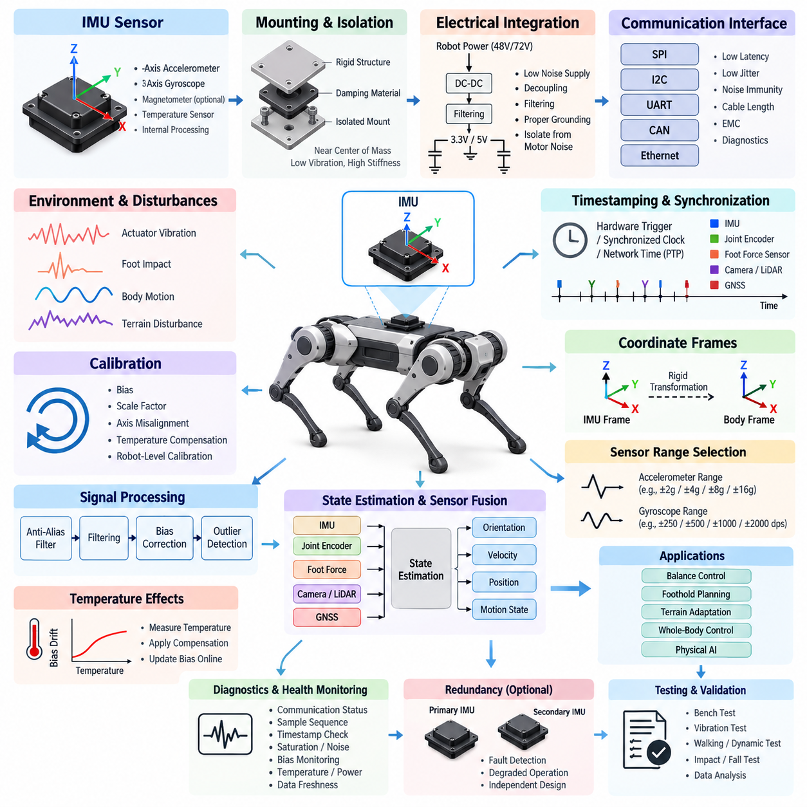
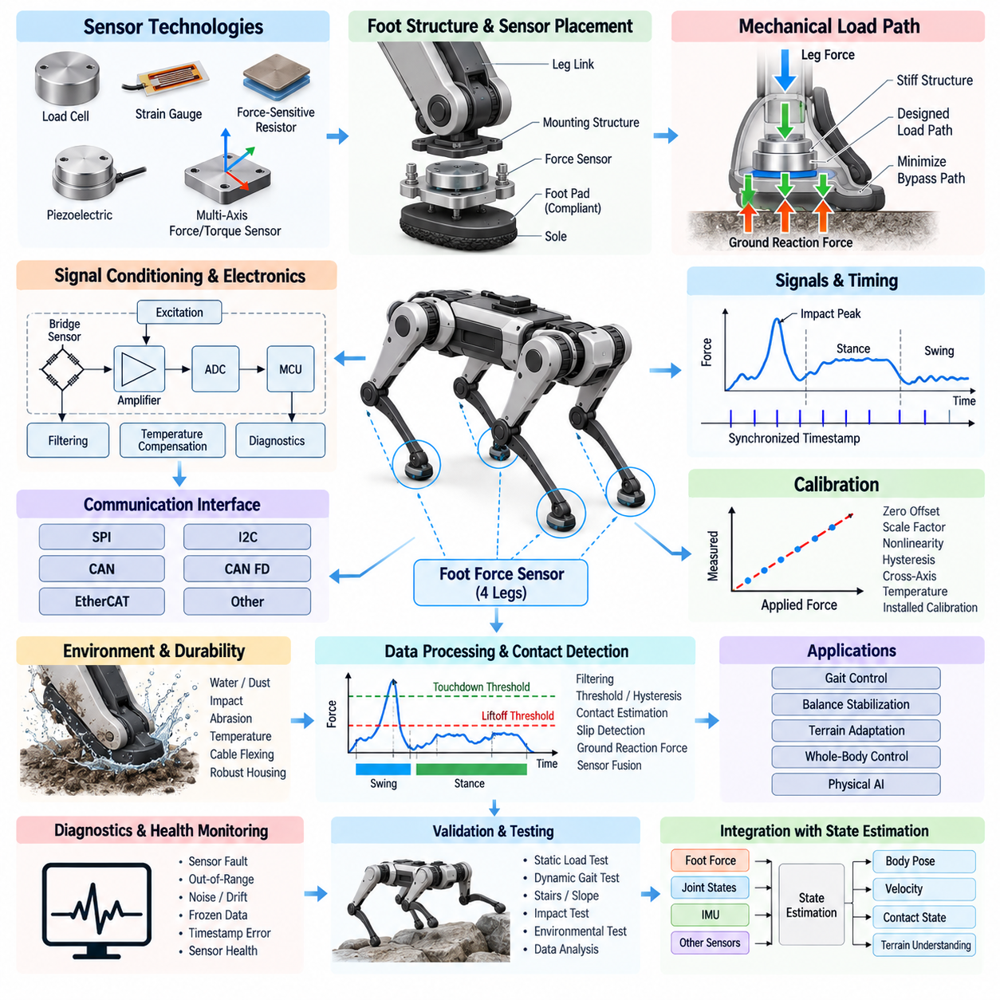
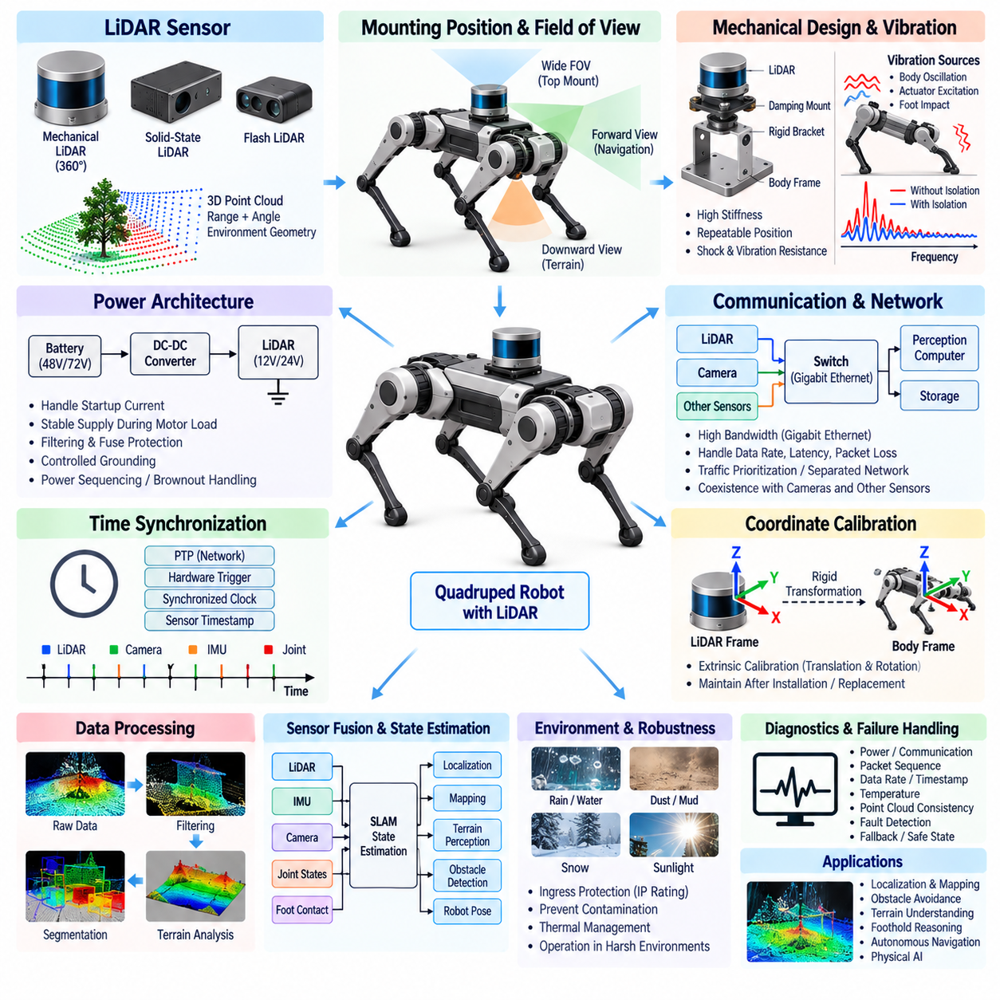
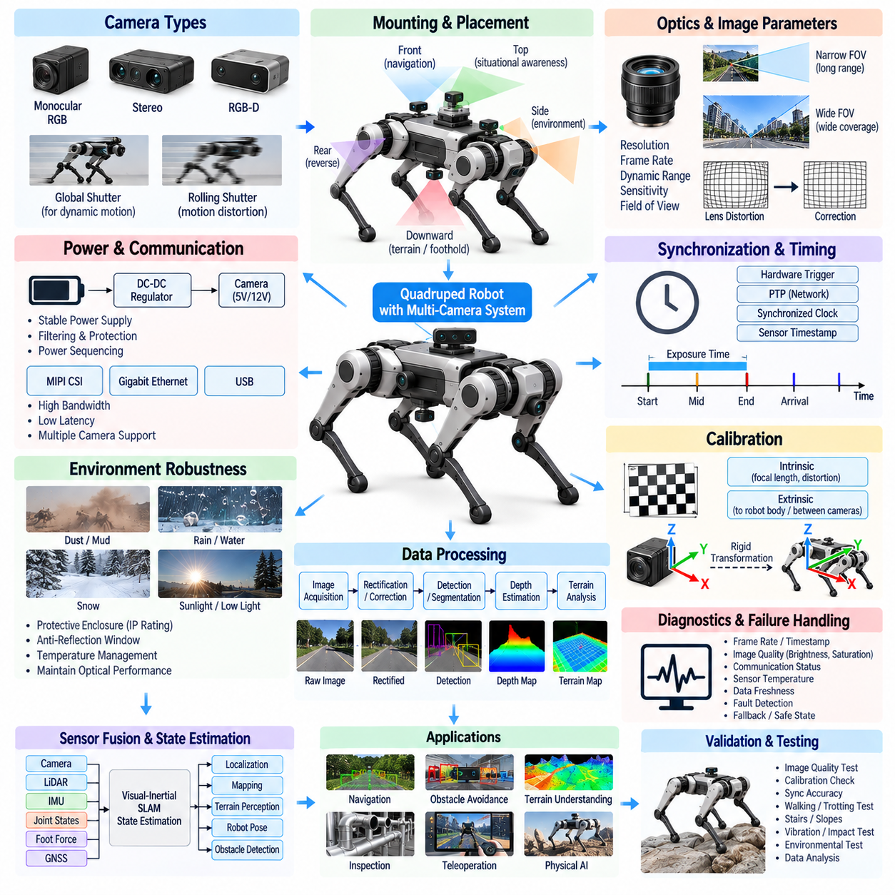
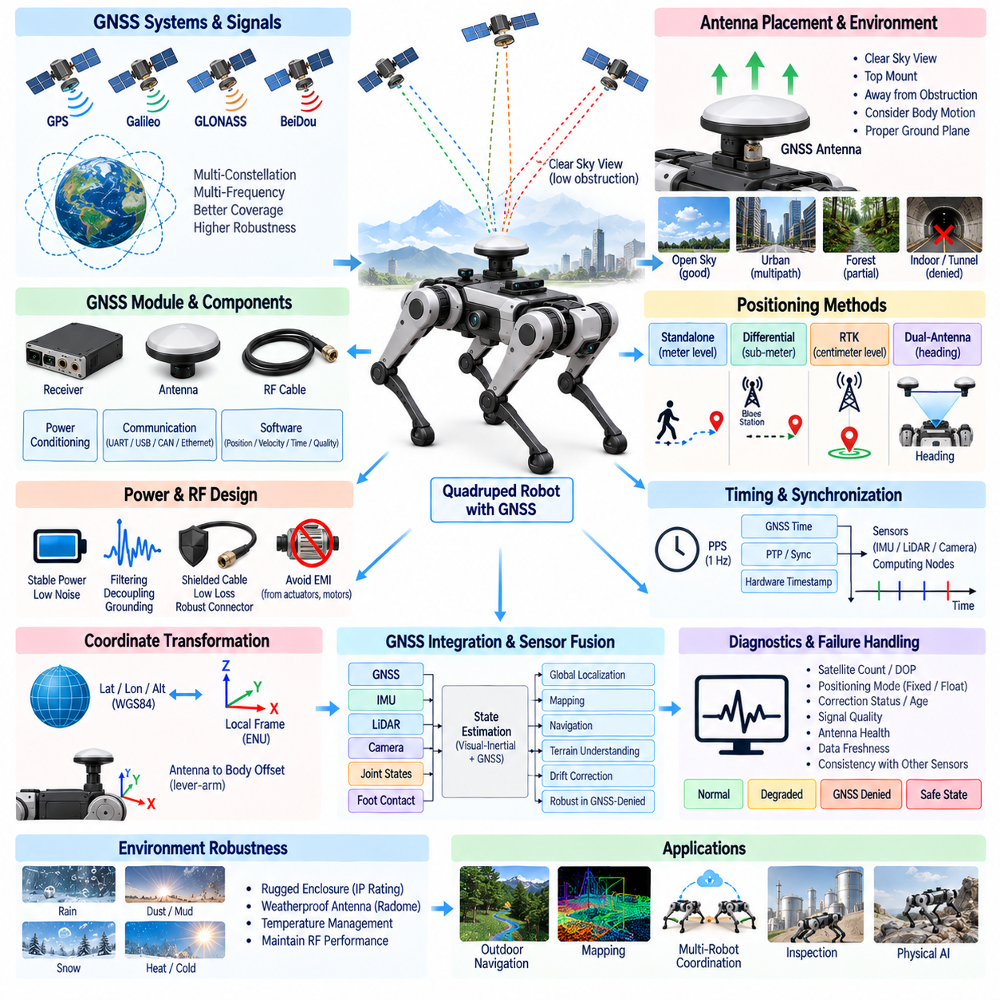
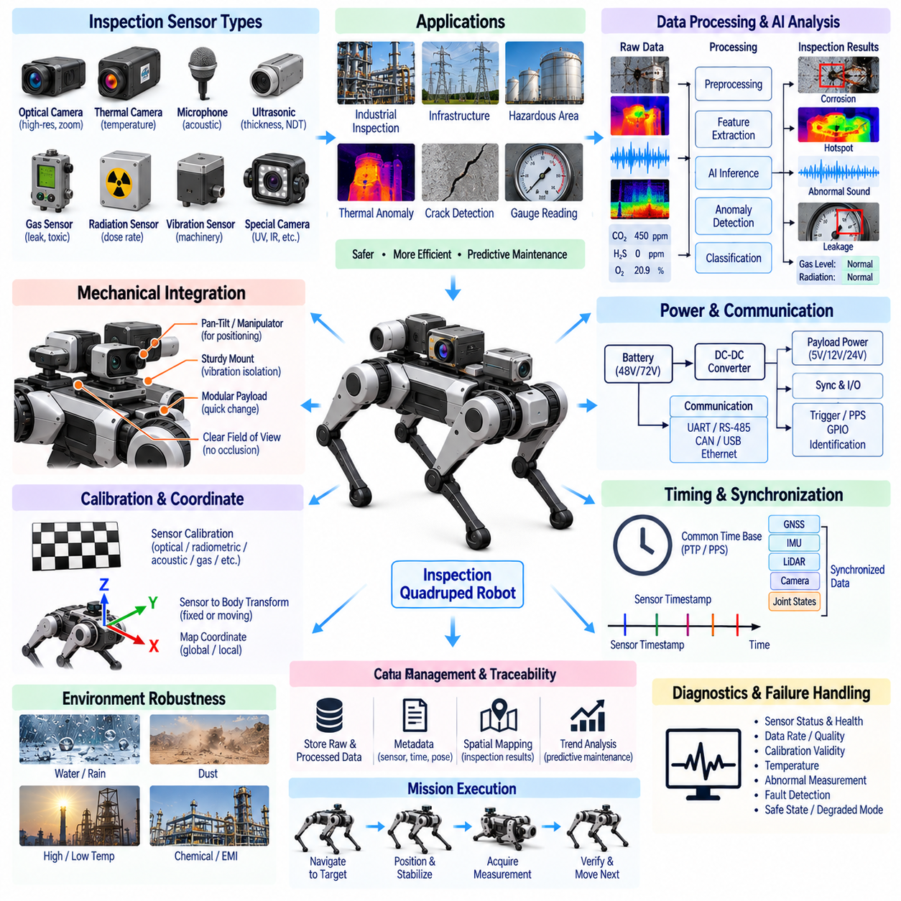

**Volume 20. Quadruped Electrical Architecture**

# Chapter 07. Sensor Architecture

## 07.01. IMU Integration

{width="7.268055555555556in" height="7.268055555555556in"}

In a quadruped robot, the inertial measurement unit is a core proprioceptive sensor that provides high-rate measurements of angular velocity and linear acceleration for estimating body motion. Unlike wheeled robots operating on relatively smooth surfaces, quadrupeds experience repeated impacts, rapid attitude changes, body oscillation, and short periods of reduced ground constraint during locomotion. IMU integration must therefore be treated as a system-level electrical, mechanical, timing, and estimation problem rather than as the simple installation of a sensor.

The primary IMU should be mounted on a structurally rigid region of the main body, preferably near the robot's effective center of mass and close to the body reference frame used by the state estimator. This location reduces rotational acceleration effects caused by a large lever arm between the sensor and the body center. The mounting surface must provide repeatable orientation, low mechanical compliance, and sufficient stiffness to prevent local deformation from appearing as false inertial motion.

Mechanical isolation requires careful balance. Excessively rigid mounting can transmit high-frequency actuator vibration, gearbox excitation, and foot-impact shock directly into the sensor, while overly soft isolation introduces resonance, phase delay, and relative motion between the IMU and chassis. Elastomeric or engineered damping structures should therefore be selected from measured vibration spectra rather than by intuition. Their resonance characteristics must remain outside the dominant locomotion and control bandwidths.

A typical robotics IMU contains a three-axis accelerometer and three-axis gyroscope, with some devices also incorporating a magnetometer, temperature sensor, or internal signal-processing functions. Gyroscope measurements provide short-term rotational dynamics with excellent responsiveness but accumulate bias-driven orientation error over time. Accelerometers provide gravity-related attitude information under appropriate dynamic conditions, although leg impacts and translational acceleration make direct interpretation difficult during aggressive locomotion.

Electrical integration must provide a clean and stable supply because IMU measurements can be affected by supply noise generated by motor drivers, switching regulators, high-current actuator transients, and digital electronics. Local regulation, decoupling capacitors, filtering, controlled grounding, and careful return-current design should separate sensitive inertial sensing from noisy power paths. The IMU supply and reference ground should be considered part of the sensor measurement chain rather than ordinary auxiliary wiring.

Communication interfaces may include SPI, I2C, UART, CAN-based modules, or Ethernet-oriented intelligent sensor interfaces depending on system architecture. For an embedded body controller, SPI is attractive because of its deterministic transaction behavior and relatively high update rate. Long-distance sensor placement may favor differential or networked interfaces with greater noise immunity. Interface selection must consider latency, jitter, cable length, EMC exposure, processor loading, and diagnostic requirements together.

Accurate timestamping is as important as measurement precision. Quadruped state estimation combines IMU information with joint encoders, foot-force sensors, cameras, LiDAR, GNSS, and other measurements that may operate at very different rates. A numerically accurate sample associated with an incorrect acquisition time can create velocity, orientation, and contact-state errors. Timestamp generation should therefore occur as close as practical to the physical sampling event rather than after unpredictable software transport delays.

System-wide synchronization becomes increasingly important when the IMU participates in high-performance sensor fusion. Hardware interrupt lines, synchronized clocks, trigger signals, or precision network timing can establish a common temporal reference between inertial sensing and distributed computing nodes. The architecture should distinguish sensor acquisition time, communication arrival time, processing time, and publication time. Preserving this timestamp provenance simplifies debugging when estimation errors originate from latency or synchronization rather than sensor noise.

Coordinate-frame definition must be established explicitly during mechanical and software integration. The IMU sensor frame may not naturally match the robot body frame, and even a small mounting-angle error can couple gravitational acceleration into horizontal axes or corrupt angular-rate interpretation. The rigid transformation between the IMU frame and body frame should therefore be defined from mechanical references, calibrated after assembly, stored as configuration data, and verified whenever the sensor or body structure is serviced.

Calibration must address more than static zero offsets. Accelerometer bias, gyroscope bias, scale-factor error, axis misalignment, temperature dependence, and potentially nonlinear behavior contribute to state-estimation error. Factory calibration provides an initial baseline, but robot-level calibration is required after installation. Stationary initialization can estimate short-term gyro bias and gravity direction, while controlled orientation and motion procedures can characterize additional parameters needed by the estimator.

Temperature compensation is particularly important for outdoor and industrial quadrupeds because the IMU may operate across cold startup, actuator-generated heating, direct sunlight, or enclosure temperature gradients. Bias parameters can shift as the sensor warms during operation. Temperature should therefore be measured and associated with calibration coefficients when necessary. The estimator can apply temperature-dependent corrections or update slowly varying bias states online while preventing transient motion from being mistaken for thermal drift.

Raw IMU data should normally pass through a controlled signal-processing chain before being consumed by state estimation and locomotion control. Anti-alias filtering, sensor-internal filtering, software low-pass filtering, bias correction, and outlier detection must be coordinated with the sampling frequency. Aggressive filtering may produce attractive low-noise signals while introducing unacceptable phase delay. Filter design should therefore be based on the robot's mechanical dynamics and estimator bandwidth rather than visual smoothness alone.

Quadruped locomotion creates distinctive disturbance patterns that must be considered during integration. Foot strikes generate short-duration acceleration peaks, joint drives introduce periodic vibration, and body pitching or rolling produces rotational components correlated with gait phase. These effects are not necessarily sensor faults. The sensing architecture should preserve sufficient bandwidth to distinguish legitimate body dynamics from unwanted structural vibration while avoiding saturation during expected impacts, jumps, slips, or recovery maneuvers.

The IMU is usually fused with joint position, joint velocity, contact, and force information to estimate body orientation, velocity, position, and motion state. During stance, known or estimated foot contacts provide constraints that reduce inertial drift. During flight or uncertain contact, the estimator relies more heavily on inertial propagation and other exteroceptive sensors. Reliable IMU integration therefore directly influences balance control, foothold planning, terrain adaptation, and whole-body control performance.

Sensor range selection must account for abnormal events as well as nominal walking. An accelerometer range optimized only for quiet standing may saturate during a hard foot strike or fall, while an unnecessarily large range can sacrifice useful resolution. The same tradeoff applies to gyroscope range during rapid turns or recovery motions. Representative measurements from walking, trotting, stair traversal, jumping, slipping, collision, and controlled fall conditions should guide final range and sampling-rate configuration.

Diagnostics should continuously evaluate communication status, sample sequence, timestamp progression, saturation, excessive noise, bias excursions, temperature, supply condition, and data freshness. A frozen IMU stream can be more dangerous than an explicit communication failure because stale values may remain numerically plausible. The computing architecture should therefore monitor both signal validity and temporal validity and communicate degraded sensor status to the state estimator, locomotion controller, and safety supervision functions.

Redundancy may be justified when loss of inertial sensing can immediately compromise stability. A secondary IMU can provide fault detection, degraded-state estimation, or controlled transition to a safe posture, but redundancy is useful only when common-cause failures are considered. Two sensors sharing the same regulator, connector, clock source, processor, or mechanically vulnerable mounting location may fail together. Redundant design should therefore evaluate electrical, communication, timing, thermal, and mechanical independence.

Verification should progress from bench characterization to integrated robot testing. Static bias stability, noise density, thermal behavior, communication integrity, timestamp accuracy, and orientation alignment can first be measured without locomotion. Subsequent tests should introduce actuator operation, controlled vibration, individual leg movement, walking, dynamic gait transitions, terrain disturbance, and impact events. Recorded raw measurements and estimator outputs allow electrical, mechanical, timing, and algorithmic problems to be separated systematically.

A well-integrated IMU ultimately becomes part of the quadruped's motion reference infrastructure. Its performance depends on rigid mechanical referencing, controlled vibration transmission, low-noise electrical power, deterministic communication, accurate timestamps, calibrated coordinate transformations, appropriate filtering, and continuous diagnostics. When these elements are engineered together, inertial sensing provides the stable high-rate foundation required for state estimation, dynamic balance, locomotion control, sensor fusion, and increasingly capable Physical AI behavior.

## 07.02. Foot Force Sensor

{width="7.268055555555556in" height="7.268055555555556in"}

Foot force sensing provides a quadruped robot with direct information about the interaction between each foot and the terrain. While joint encoders and an IMU describe internal configuration and body motion, foot force sensors reveal whether a leg is actually supporting the robot and how strongly it is loading the ground. This information is fundamental for contact estimation, gait control, balance stabilization, terrain adaptation, slip detection, and whole-body state estimation in dynamic locomotion.

A foot force sensing architecture can be implemented using load cells, strain gauges, force-sensitive resistors, piezoelectric devices, or multi-axis force and torque sensors. The appropriate technology depends on required accuracy, bandwidth, mechanical packaging, impact tolerance, environmental resistance, and cost. Simple contact sensors may only distinguish loaded and unloaded states, whereas advanced sensing modules can measure normal and tangential forces required for detailed ground-reaction-force estimation.

Sensor placement determines what mechanical quantity is actually measured. A sensor integrated directly into the foot can measure forces close to the terrain interface, while sensing elements positioned within the lower leg or joint structure may infer foot loading through structural deformation. Direct foot sensing provides intuitive contact information but exposes electronics to impact, contamination, and cable motion. Structural sensing may offer better protection but requires more careful mechanical modeling and calibration.

The mechanical load path must be designed so that ground reaction forces pass through the intended sensing element without uncontrolled bypass paths. Fasteners, housings, protective covers, compliant foot pads, and structural interfaces can redistribute forces and create measurement errors if they carry significant load around the sensor. Mechanical design should therefore define a repeatable force path from the contact surface through the sensing structure while maintaining sufficient stiffness and impact durability.

Quadruped feet experience highly dynamic loads. Walking produces cyclic loading and unloading, while trotting, running, jumping, stair traversal, and recovery maneuvers generate substantially larger transient forces. Foot impacts may produce short-duration peaks well above the nominal static weight supported by one leg. The sensor measurement range should therefore include sufficient overload margin while retaining adequate resolution for detecting light contact during touchdown, liftoff, and uncertain terrain interaction.

Signal bandwidth must reflect the dynamics of locomotion rather than only the average support force. Low-bandwidth sensing may adequately estimate static weight distribution but can miss touchdown transients, rapid load transfer, or early slip signatures. Excessively high bandwidth, however, can expose control algorithms to structural vibration and impact ringing. Sampling rate and filtering should therefore preserve meaningful contact dynamics while suppressing frequencies that do not contribute useful information to state estimation or control.

Strain-gauge and load-cell implementations typically require stable excitation, precision amplification, and high-resolution analog-to-digital conversion. Because the useful sensor signal may be small, electrical noise from motor drivers, DC-DC converters, switching power stages, and high-current leg wiring can significantly degrade measurement quality. Differential measurement, appropriate shielding, local filtering, controlled grounding, and careful separation between sensor and actuator current paths are important parts of the foot sensor electrical architecture.

Local signal conditioning can reduce the vulnerability of low-level analog signals. Instead of routing sensitive bridge outputs through the entire moving leg, amplification and analog-to-digital conversion can be located close to the sensing element. A local microcontroller or sensor interface can then transmit digital force measurements to the leg controller or central computing system. This approach can improve noise immunity while also supporting calibration storage, temperature compensation, diagnostics, and sensor health monitoring.

Communication architecture must account for the repeated articulation of each leg. Short local interfaces such as SPI or I2C may be practical inside a compact foot or lower-leg module, while CAN, CAN FD, EtherCAT, or other robust differential interfaces may be more appropriate for transmitting measurements through the leg and into the body. Interface selection should consider update rate, deterministic latency, wiring complexity, EMC robustness, synchronization requirements, and fault containment.

Accurate timing is essential because foot force information is interpreted together with IMU measurements and joint states. During locomotion, the transition from swing to stance can occur within a short interval, and even modest timestamp errors can shift the estimated contact event relative to body acceleration or joint motion. Force samples should therefore carry timestamps representing their acquisition time, and distributed sensing nodes should operate from synchronized clocks or well-characterized timing relationships.

Calibration establishes the relationship between raw sensor output and physical force. At minimum, zero offset and scale factor must be determined, but practical systems may also require compensation for hysteresis, nonlinearity, cross-axis sensitivity, mounting preload, temperature, and mechanical assembly variation. Calibration should be performed after the sensor has been installed in its final mechanical structure because fastening torque, foot-pad compression, and structural preload can change the effective measurement response.

Zero-force estimation requires particular attention because a quadruped foot is not always mechanically unloaded even when it is above the ground. Cable forces, protective boots, structural preload, temperature changes, or internal leg dynamics can shift the apparent zero level. Automatic zero adjustment may be useful during confirmed swing phases, but it must be constrained carefully. Incorrectly resetting the zero while the foot is touching terrain can introduce systematic errors into subsequent contact and force estimates.

Temperature effects can originate from both the sensing element and nearby actuators. Motors and gearboxes located close to the foot or lower leg may heat the mechanical structure during extended operation, changing strain-gauge resistance, amplifier characteristics, or structural stiffness. Temperature measurements can therefore be incorporated into the sensing module, allowing compensation coefficients to be applied during operation. Thermal characterization should cover both environmental temperature and internally generated heating.

Contact detection converts continuous force measurements into discrete or probabilistic information describing whether the foot is supporting the robot. A simple force threshold can work under controlled conditions, but dynamic locomotion often requires hysteresis, temporal filtering, expected gait phase, and joint-motion information. Separate touchdown and liftoff thresholds can prevent rapid switching near the decision boundary. More advanced estimators can combine force, kinematics, and inertial information to determine contact confidence.

Ground reaction force estimation provides information beyond binary contact. The distribution of forces among the four feet reveals how the robot supports its body and how loads shift during acceleration, turning, climbing, or disturbance recovery. These measurements can be compared with forces predicted by the locomotion controller. Significant differences between commanded and measured loading may indicate terrain compliance, unexpected contact, actuator limitations, model error, or emerging instability.

Multi-axis sensing can provide tangential force information that supports slip detection and friction estimation. When the ratio between tangential and normal force approaches the available friction limit, the controller can reduce commanded acceleration, modify foothold loading, or redistribute forces among other legs. Even when only normal force is directly measured, combining it with foot velocity, joint torque estimates, and IMU motion can provide useful evidence that a supporting foot has begun to slide.

Foot force measurements also strengthen state estimation. During reliable stance, a contacting foot can be treated approximately as a temporary reference relative to the terrain, providing constraints on body velocity and motion. Contact confidence derived from force sensing helps the estimator determine when such constraints are valid. Incorrect contact classification can corrupt state estimates, so force information should be fused with kinematic and inertial evidence rather than treated as an unquestionable binary signal.

Diagnostics should detect disconnected sensors, broken conductors, bridge imbalance, amplifier saturation, ADC faults, implausible force values, excessive noise, frozen measurements, timestamp discontinuities, and calibration corruption. Cross-checking against gait state and joint torque can reveal failures that remain electrically plausible. For example, a foot reporting constant high force during swing is inconsistent with expected robot dynamics and should trigger degraded-confidence handling or a diagnostic event.

Foot-mounted sensors require robust environmental and harness design because they operate near the most mechanically exposed region of the robot. Repeated bending, mud, water, dust, debris, abrasion, shock, and connector movement can degrade both sensing elements and wiring. Cable routing should avoid excessive strain near ankle motion, while connectors and enclosures should provide appropriate ingress protection. Mechanical protection must not create unintended load paths that bypass or preload the sensing structure.

Validation should begin with controlled static loads covering the intended measurement range and continue with repeated loading, unloading, off-axis forces, thermal variation, vibration, and impact testing. Integrated tests should then examine standing, weight shifting, walking, trotting, slopes, stairs, uneven terrain, slipping, jumping, and recovery maneuvers. Recorded force, joint, and IMU data should be compared to expected contact sequences and controller commands to identify systematic mechanical, electrical, timing, or estimation errors.

When correctly integrated, the foot force sensor becomes more than a load-measurement device. It provides the quadruped with direct evidence of physical interaction between the robot and its environment, connecting mechanical contact to state estimation and locomotion control. Robust sensing, calibrated load paths, synchronized acquisition, reliable communication, diagnostics, and sensor fusion together enable safer balance control, more accurate contact reasoning, adaptive terrain behavior, and increasingly capable Physical AI operation.

## 07.03. LiDAR Integration

{width="7.268055555555556in" height="7.268055555555556in"}

LiDAR integration in a quadruped robot provides precise three-dimensional information about surrounding geometry and supports localization, mapping, obstacle detection, terrain perception, and autonomous navigation. Unlike stationary or wheeled platforms, a quadruped continuously changes body height, roll, pitch, and yaw while walking. LiDAR measurements must therefore be interpreted together with robot motion, making mechanical placement, calibration, synchronization, communication, and state estimation fundamental parts of the sensor architecture.

The LiDAR mounting position determines both environmental visibility and measurement stability. A sensor placed high on the body can obtain a wide field of view and reduce occlusion from the robot itself, while lower or forward-facing placement may improve detection of nearby terrain and small obstacles. The mechanical design should minimize obstruction by legs, payloads, protective structures, and cables while preserving sufficient coverage during body pitching, rolling, crouching, climbing, and dynamic gait transitions.

Mechanical mounting must maintain a stable geometric relationship between the LiDAR and robot body frame. Small structural deflections or mounting-angle changes can create significant spatial errors at long sensing distances. The supporting bracket should therefore provide high stiffness, repeatable positioning, and resistance to shock and vibration. Mechanical interfaces should also permit accurate installation after maintenance so that sensor replacement does not require extensive reconstruction of the robot's geometric calibration.

Vibration presents a particular challenge because quadruped locomotion generates periodic body oscillation, actuator excitation, and high-frequency foot-impact disturbances. Excessive vibration can degrade point-cloud consistency or introduce motion-dependent measurement errors. Isolation structures may be used when necessary, but overly compliant mounts can allow the LiDAR to move relative to the robot body. Damping characteristics should therefore be selected from measured vibration behavior while maintaining the rigid transformation assumed by perception algorithms.

Electrical power architecture must account for LiDAR startup current, operating power, voltage tolerance, and transient behavior. The sensor supply should remain stable during simultaneous actuator acceleration or other high-current events. Dedicated DC-DC conversion, local filtering, appropriate fuse protection, and controlled grounding can prevent motor-related disturbances from propagating into the sensor. Power sequencing and brownout behavior should also be defined so that temporary voltage disturbances do not create uncontrolled communication or perception failures.

LiDAR communication commonly requires a high-bandwidth digital interface because three-dimensional sensors can generate large point-cloud streams. Gigabit Ethernet is particularly suitable for many high-resolution LiDAR systems, while other interfaces may be used for configuration, diagnostics, or synchronization. Network design must consider sustained data rate, packet bursts, latency, packet loss, switch capacity, processor loading, and coexistence with cameras and other high-bandwidth sensors sharing the robot's communication backbone.

Network architecture should prevent perception traffic from interfering with time-critical control communication. LiDAR and camera streams can consume substantial bandwidth, particularly when several sensors operate simultaneously. Dedicated Ethernet segments, managed switches, traffic prioritization, or separated control and perception networks can improve determinism. The architecture should be sized using measured worst-case traffic rather than only nominal average bandwidth, because packet bursts may create temporary congestion and unpredictable processing delays.

Time synchronization is essential for a moving quadruped because a LiDAR scan is collected while the robot body is changing position and orientation. Each point or scan must be associated with an accurate acquisition time so that motion compensation can reconstruct the geometry correctly. Synchronization methods may include hardware trigger signals, synchronized sensor clocks, Precision Time Protocol, or other common timing references shared among LiDAR, IMU, cameras, joint controllers, and computing nodes.

Timestamp provenance should distinguish the physical measurement time from packet reception and software processing time. Assigning a timestamp only when a LiDAR packet reaches the perception computer can introduce variable network and operating-system latency. Whenever supported, hardware-generated sensor timestamps should be preserved through the processing pipeline. Accurate temporal metadata allows the perception stack to align point clouds with IMU orientation, joint states, camera frames, and robot poses during dynamic locomotion.

Coordinate-frame calibration defines the rigid transformation between the LiDAR frame and the quadruped body frame. Translation and rotation errors directly affect localization, obstacle positions, terrain reconstruction, and multi-sensor fusion. Extrinsic calibration should therefore be performed after final mechanical installation and stored as controlled configuration data. Calibration validity should be checked after sensor replacement, mechanical impact, bracket adjustment, enclosure service, or any event capable of altering sensor alignment.

Motion distortion becomes important when a scan is accumulated over a finite time while the robot is walking. A point measured at the beginning of a scan corresponds to a different body pose from one measured near the end. IMU measurements and state-estimation outputs can be used to deskew the point cloud by transforming measurements according to their acquisition times. Accurate synchronization and low-latency body-motion estimates are therefore directly connected to LiDAR spatial quality.

LiDAR data processing typically converts raw range measurements into structured or unstructured point clouds before applying filtering, segmentation, mapping, localization, or terrain analysis. Invalid returns, isolated outliers, near-field reflections, and measurements from the robot's own structure may need to be removed. Filtering must preserve geometrically important features such as curbs, steps, narrow obstacles, edges, and terrain discontinuities that can influence foothold selection or autonomous navigation.

Self-occlusion and self-reflection require explicit consideration because the quadruped's legs continuously move through the sensor field of view. Point clouds may contain returns from feet, leg links, cables, antennas, or payload structures. A robot-body exclusion model can remove points corresponding to known geometry using current joint states. Dynamic self-filtering is preferable to a large fixed exclusion region because it preserves useful environmental measurements close to the robot while rejecting moving robot components.

Terrain perception places different requirements on LiDAR integration than conventional obstacle detection. A quadruped may need to identify slopes, steps, gaps, rocks, vegetation, uneven surfaces, and possible foothold regions rather than merely determining whether a path is occupied. Point density and viewing geometry near the ground therefore matter significantly. Sensor placement should provide adequate downward visibility while maintaining sufficient forward and lateral coverage for navigation and advance terrain assessment.

LiDAR information can be fused with IMU measurements to support simultaneous localization and mapping, odometry, and body-motion estimation. The IMU provides high-rate rotational and acceleration information between LiDAR observations, while LiDAR constrains accumulated inertial drift through geometric alignment with the environment. Joint states and foot contact information can provide additional locomotion constraints. Reliable fusion depends on consistent coordinate frames, accurate timing, and well-characterized sensor uncertainty.

Camera and LiDAR fusion can further improve environmental understanding by combining geometric measurements with visual appearance. LiDAR provides accurate range and structure, while cameras contribute texture, color, semantic features, and object information. Extrinsic and temporal calibration between these sensors must be maintained carefully. Even when individual sensors operate correctly, misalignment in time or geometry can produce incorrect object positions or inconsistent terrain interpretation during rapid robot motion.

Environmental protection is important because quadruped robots may operate in dust, rain, mud, snow, direct sunlight, and changing temperatures. The LiDAR enclosure and connector system should provide suitable ingress protection while preserving the optical field of view. Protective windows must not introduce unacceptable reflections or attenuation. Water droplets, dust accumulation, condensation, and contamination of optical surfaces should be considered because they can reduce effective range or create false returns.

Thermal behavior should be evaluated at both sensor and system levels. LiDAR electronics may generate significant heat, while outdoor temperature and nearby computing or actuator systems can raise enclosure temperature further. Mounting structures should support appropriate heat dissipation without compromising alignment. Temperature monitoring can be incorporated into system diagnostics, and perception software should distinguish gradual performance degradation from abrupt sensor faults when environmental conditions approach operating limits.

Diagnostics should monitor sensor power, communication state, packet sequence, data rate, timestamp progression, internal temperature, synchronization status, point-cloud density, and measurement plausibility. A sensor may remain connected while producing degraded or stale data, so communication availability alone is insufficient. Cross-checking LiDAR motion against IMU and robot state can help identify frozen scans, timing failures, calibration shifts, or severe environmental degradation that would otherwise appear as valid network traffic.

Failure handling should define how autonomy behaves when LiDAR information becomes unavailable or unreliable. Depending on mission requirements, the robot may reduce speed, increase reliance on cameras or other ranging sensors, stop autonomous navigation, return to a known location, or transition to a safe state. Sensor redundancy should be evaluated at the functional level because two LiDAR units sharing the same power rail, switch, synchronization source, or vulnerable mounting structure may still experience common-cause failure.

Validation should begin with static range accuracy, field-of-view coverage, network throughput, timestamp accuracy, thermal behavior, and geometric calibration. Integrated testing should then introduce actuator operation, body vibration, walking, trotting, slopes, stairs, uneven terrain, rapidly changing attitude, and environmental contamination. Recorded LiDAR, IMU, joint, and localization data can reveal whether errors originate from sensing, mechanical motion, timing, networking, calibration, or perception algorithms.

A properly integrated LiDAR becomes part of the quadruped's spatial reference infrastructure rather than an isolated ranging sensor. Stable mounting, reliable power, high-bandwidth communication, synchronized timestamps, calibrated coordinate transformations, motion compensation, environmental protection, diagnostics, and multi-sensor fusion collectively determine its practical performance. When these elements operate together, LiDAR supports robust localization, terrain understanding, obstacle avoidance, foothold reasoning, autonomous navigation, and advanced Physical AI behavior.

## 07.04. Camera Integration

{width="7.268055555555556in" height="7.268055555555556in"}

Camera integration in a quadruped robot provides rich visual information that complements geometric and inertial sensing. Cameras support object detection, semantic understanding, visual odometry, terrain classification, inspection, teleoperation, and Physical AI perception. Because the robot continuously changes height and attitude while walking, camera integration must address mechanical placement, optical coverage, synchronization, calibration, communication bandwidth, environmental robustness, and real-time computing as one coordinated sensor architecture.

Camera selection begins with the perception functions required by the robot. Monocular RGB cameras provide compact and efficient visual sensing, stereo cameras enable depth estimation from geometric disparity, and RGB-D cameras combine appearance with direct depth information. Global-shutter devices are often advantageous for dynamic motion because they reduce geometric distortion caused by sequential exposure, while rolling-shutter cameras require careful consideration of exposure time, robot motion, vibration, and algorithmic compensation.

Sensor resolution, frame rate, dynamic range, sensitivity, and field of view must be selected together rather than independently. High resolution improves recognition of distant or small objects but increases network traffic and computing load. High frame rates improve temporal tracking during rapid motion but similarly increase bandwidth. Wide-angle lenses provide greater environmental coverage, although excessive distortion can reduce useful spatial resolution and increase calibration complexity near the edges of the image.

Camera placement should provide the visual coverage required for navigation while minimizing occlusion from the robot itself. Forward-facing cameras can support obstacle detection and route understanding, lateral cameras improve situational awareness, and downward-facing cameras can observe terrain and candidate footholds. Rear-facing sensing may support reverse motion and complete environmental awareness. Multi-camera configurations should be designed from required combined coverage rather than simply maximizing the number of cameras installed.

The mounting structure must preserve a stable relationship between the camera optical frame and the robot body frame. Quadruped locomotion introduces repeated shock, vibration, and structural loading that can alter sensor orientation if the mounting bracket lacks stiffness. Small angular changes can create significant projection errors at distance. Camera mounts should therefore provide high stiffness, repeatable installation, controlled vibration behavior, and mechanical references that support accurate reassembly after maintenance.

Vibration and rapid body motion affect image quality through blur, frame-to-frame displacement, and changes in optical orientation. Short exposure times can reduce motion blur but require sufficient illumination or greater sensor sensitivity. Mechanical damping may suppress high-frequency vibration, although excessively compliant isolation can allow the camera to move relative to the body frame. Optical, mechanical, and exposure parameters should therefore be optimized using representative walking, trotting, impact, and terrain conditions.

Electrical power should remain stable despite actuator-induced voltage transients and high-current switching elsewhere in the robot. Camera modules may require regulated low-voltage rails and can be sensitive to supply disturbances that cause frame loss, interface resets, or image corruption. Dedicated regulation, local decoupling, filtering, grounding, and suitable circuit protection should be applied. Power sequencing should also coordinate cameras, communication interfaces, and perception computers during startup, shutdown, and recovery.

Camera communication architecture depends strongly on sensor count, resolution, frame rate, and interface technology. MIPI CSI is efficient for cameras located close to embedded computing platforms, while Gigabit Ethernet or higher-speed Ethernet can support distributed cameras over longer distances. USB may be appropriate for some modules but requires careful consideration of topology and robustness. The architecture should evaluate sustained throughput, peak traffic, latency, packet loss, cable complexity, and processor interface limitations.

Multiple high-resolution cameras can produce substantial aggregate data rates, especially when combined with LiDAR and other perception sensors. Network and compute architecture should therefore be dimensioned for simultaneous worst-case operation. Managed Ethernet switches, dedicated perception networks, traffic prioritization, or direct camera interfaces can prevent visual data from interfering with deterministic control communication. Compression may reduce bandwidth but introduces additional latency, processing demand, and potentially information loss.

Accurate time synchronization is critical when camera frames are fused with IMU, LiDAR, joint encoder, foot-force, or GNSS measurements. During rapid body rotation, even a small temporal offset can cause significant spatial disagreement between visual and geometric observations. Hardware triggering, synchronized clocks, Precision Time Protocol, or sensor-specific synchronization mechanisms can establish a common temporal reference. The architecture should preserve the actual exposure time rather than only the later frame-arrival time.

Timestamp provenance should distinguish exposure start, exposure midpoint, frame completion, transport arrival, and software publication time where relevant. Using only the timestamp generated after a frame reaches the perception computer can hide variable interface and operating-system delays. Hardware timestamps associated closely with image exposure are preferable for precise sensor fusion. Maintaining this temporal information through the software pipeline enables accurate alignment with robot pose and high-rate inertial measurements.

Intrinsic calibration characterizes the internal optical geometry of each camera, including focal length, principal point, lens distortion, and related projection parameters. Calibration quality directly influences visual odometry, stereo depth, geometric reconstruction, and camera-LiDAR fusion. Parameters should be determined for the final optical configuration and stored as controlled calibration data. Lens replacement, focus adjustment, protective-window changes, or mechanical service may require calibration verification or repetition.

Extrinsic calibration determines the translation and rotation between the camera frame and the quadruped body frame or between multiple sensors. Multi-camera systems additionally require accurate camera-to-camera transformations, while fused perception requires camera-to-LiDAR and camera-to-IMU relationships. These transformations should be measured after final mechanical installation. Calibration validity should be checked after impacts, sensor replacement, bracket adjustment, or any maintenance that can alter physical alignment.

Stereo camera integration requires particular attention to baseline stability and synchronization. Depth accuracy depends on the known geometric separation and orientation between the two optical centers. Mechanical deformation of the stereo structure can therefore directly degrade depth estimation. Left and right images should also represent the same physical instant as closely as possible. Hardware-synchronized exposure and a rigid stereo mounting structure are especially valuable for dynamic quadruped locomotion.

Image processing typically begins with frame acquisition, correction of optical distortion, exposure handling, and optional rectification before higher-level perception. Subsequent functions may include feature extraction, optical flow, object detection, semantic segmentation, depth estimation, terrain classification, and visual localization. Processing pipelines should be designed around mission requirements because unnecessary image transformations can consume memory bandwidth and computing resources while adding latency to real-time perception.

Visual odometry estimates robot motion from changes in image observations over time and can complement IMU and LiDAR-based localization. Camera measurements provide rich environmental constraints, while the IMU supplies high-rate rotational and acceleration information between image frames. Visual-inertial odometry can therefore provide robust motion estimation when the environment contains sufficient visual structure. Performance may degrade in darkness, repetitive textures, severe blur, or low-feature environments, requiring multi-sensor fusion.

Terrain perception is particularly important for quadrupeds because safe navigation involves more than detecting large obstacles. Cameras can identify stairs, rocks, vegetation, wet surfaces, loose material, gaps, slopes, and other semantic characteristics that geometric sensing alone may not fully describe. Downward and forward visual coverage can support foothold reasoning by providing contextual information about candidate contact regions before the leg is committed to the next step.

Camera-LiDAR fusion combines complementary sensing characteristics. Cameras provide dense appearance, color, texture, and semantic information, while LiDAR provides accurate geometric range measurements. Correct temporal synchronization and extrinsic calibration allow LiDAR points to be projected consistently into image coordinates. This enables applications such as semantic point clouds, object localization, terrain classification, and more robust environmental models for autonomous navigation and Physical AI reasoning.

Exposure control must handle large illumination changes encountered during real-world operation. A robot may transition between indoor and outdoor environments, sunlight and shadow, or bright and dark inspection regions within seconds. Automatic exposure and gain control can maintain visibility but may produce frame-to-frame appearance changes. High dynamic range techniques can help preserve information in challenging scenes, while perception algorithms should remain robust to exposure transitions and temporary saturation.

Environmental protection must preserve optical performance while protecting electronics from water, dust, mud, impact, and temperature variation. Protective windows should be optically suitable and positioned to minimize reflections, ghosting, and contamination. Water droplets, condensation, dust, scratches, or mud on the window can degrade perception even when the camera electronics remain fully operational. The system should therefore consider optical cleanliness as part of sensor health rather than only enclosure integrity.

Thermal management is important for cameras operating near embedded computers, actuators, or sealed protective enclosures. Image sensors and interface electronics generate heat, while elevated temperature can increase image noise or reduce component reliability. Mounting structures may provide conductive heat paths, and temperature monitoring can support diagnostics. Thermal design should maintain camera performance without introducing mechanical distortion that changes optical alignment or invalidates calibration.

Diagnostics should monitor power, communication state, frame sequence, frame rate, timestamp progression, synchronization status, image brightness, saturation, temperature, and data freshness. A camera can remain electrically connected while producing frozen, obscured, overexposed, or corrupted images. Image-quality metrics and consistency checks against other sensors can identify degraded perception that ordinary communication diagnostics would miss, allowing the autonomy system to reduce confidence in affected visual information.

Failure handling should define how the robot responds when one or more cameras become unreliable. A multi-camera system may continue with reduced field of view, while a fused architecture may temporarily rely more heavily on LiDAR, IMU, or other sensors. Depending on mission criticality, the robot may reduce speed, restrict movement direction, terminate autonomous operation, or enter a safe state. Functional redundancy should consider common power, network, compute, and environmental failure mechanisms.

Validation should begin with image quality, optical coverage, intrinsic calibration, interface throughput, synchronization accuracy, and thermal operation. Integrated testing should then include walking, trotting, rapid turns, stairs, slopes, vibration, impacts, low light, bright sunlight, shadows, rain, dust, and partial lens contamination. Synchronized camera, LiDAR, IMU, joint, and localization recordings help distinguish optical, mechanical, temporal, communication, calibration, and perception-algorithm problems.

A properly integrated camera system becomes a primary semantic perception interface between the quadruped and its environment. Reliable mechanical alignment, controlled optics, stable power, sufficient communication bandwidth, precise synchronization, calibrated coordinate frames, environmental protection, diagnostics, and multi-sensor fusion determine practical performance. Together these capabilities support visual localization, terrain understanding, object recognition, inspection, autonomous navigation, foothold reasoning, and advanced Physical AI behavior.

## 07.05. GNSS Module

{width="7.268055555555556in" height="7.268055555555556in"}

Global Navigation Satellite System integration provides a quadruped robot with an absolute geographic reference for outdoor localization, navigation, mapping, mission execution, and coordination with other robotic systems. Unlike local odometry, GNSS measurements are referenced to a global coordinate system and do not accumulate position drift in the same manner. However, satellite visibility, multipath, antenna placement, timing, calibration, and sensor fusion strongly determine whether GNSS information is reliable enough for autonomous quadruped operation.

A GNSS module typically consists of a satellite receiver, antenna, RF interconnection, power conditioning, communication interface, and software responsible for interpreting position, velocity, timing, and quality information. Modern receivers may support multiple constellations such as GPS, Galileo, GLONASS, and BeiDou. Multi-constellation and multi-frequency reception can improve satellite availability, convergence, and robustness, particularly when the robot operates near buildings, vegetation, terrain structures, or other partial obstructions.

Receiver selection should reflect the required localization performance rather than simply the advertised standalone accuracy. Basic GNSS may provide meter-level positioning suitable for coarse navigation, while differential techniques can provide substantially improved accuracy. Real-Time Kinematic positioning can achieve centimeter-class performance under favorable conditions by using carrier-phase measurements and correction information. The required solution should be matched to mission needs, environmental conditions, communication availability, and system cost.

Antenna placement is one of the most important mechanical integration decisions. The antenna should have a clear view of the sky and should normally be positioned near the upper surface of the robot, away from structures that block or reflect satellite signals. Cameras, LiDAR units, payloads, communication antennas, metallic covers, and moving legs can influence reception. The installation should maintain adequate visibility as the quadruped changes body attitude during walking, climbing, crouching, and terrain traversal.

The antenna ground plane and surrounding mechanical structure influence RF performance. Depending on antenna technology, an appropriate conductive ground plane can improve radiation characteristics and reduce sensitivity to signals arriving from undesirable directions. Metallic structures placed too close to the antenna can distort the radiation pattern or create reflections. Antenna integration should therefore be treated as an RF design problem rather than simply locating a component wherever mechanical packaging space remains available.

Multipath occurs when satellite signals reflect from buildings, vehicles, metallic structures, walls, or terrain before reaching the antenna. These reflected paths can introduce significant positioning errors even when the receiver reports a valid solution. Quadruped robots may operate close to industrial equipment or urban structures where multipath is common. Antenna placement, receiver quality metrics, multi-frequency processing, and fusion with other sensors should therefore be used to reduce dependence on degraded satellite observations.

Electrical power supplied to the GNSS receiver and active antenna should be stable and low in noise. Switching converters, motor drives, high-current actuator cables, processors, radios, and other digital electronics can introduce conducted or radiated interference into sensitive RF and receiver circuits. Dedicated regulation, local decoupling, filtering, controlled grounding, shielded RF cabling, and physical separation from strong noise sources can significantly improve GNSS reception and prevent intermittent positioning degradation.

RF cabling between the antenna and receiver should minimize insertion loss while maintaining reliable shielding and mechanical durability. Cable length, connector type, impedance control, bending radius, and routing should be considered together. Long or poorly routed coaxial cables can reduce signal quality, while repeated motion or vibration can damage connectors and shielding. Where an active antenna is used, the architecture must also support appropriate bias power and protection for the antenna electronics.

Communication between the GNSS receiver and robot computer may use UART, USB, CAN, Ethernet, or another supported digital interface. The required bandwidth is generally modest compared with cameras or LiDAR, but deterministic delivery and accurate timing remain important. The interface should carry not only latitude, longitude, and altitude but also velocity, satellite status, correction state, uncertainty estimates, receiver diagnostics, and other quality indicators required by the localization system.

GNSS timing can provide a valuable global time reference in addition to geographic position. Many receivers generate a precise pulse-per-second signal that can synchronize computing nodes and sensors to satellite-derived time. This timing reference may be combined with Precision Time Protocol or local synchronized clocks to establish a robot-wide temporal framework. GNSS can therefore contribute both to localization and to the time infrastructure required for multi-sensor perception and distributed computing.

Timestamp accuracy is essential when GNSS measurements are fused with IMU, LiDAR, cameras, joint states, and foot contact information. The architecture should distinguish the physical GNSS measurement epoch from the later time at which a message arrives at the computer. Variable communication latency can otherwise create apparent position or velocity inconsistencies during motion. Hardware timing signals and receiver-generated timestamps should be preserved whenever possible throughout the localization pipeline.

Coordinate transformation is required because GNSS produces information in geographic or Earth-referenced frames, while locomotion and perception normally operate in local map, odometry, and robot body frames. Latitude, longitude, and altitude may therefore be transformed into a local Cartesian representation appropriate for navigation. The transformation origin, reference datum, altitude convention, axis orientation, and relationship between global and local maps must be explicitly defined to avoid systematic localization errors.

The physical offset between the GNSS antenna phase center and the robot body reference point must also be considered. When the antenna is mounted above or away from the body origin, robot rotation causes the antenna position to move even if the body reference point remains approximately fixed. This lever-arm effect can become relevant for precise positioning. The antenna-to-body transformation should therefore be measured and included in the localization model, particularly for RTK-level accuracy.

Real-Time Kinematic GNSS requires correction information from a reference station or correction service. The robot may receive corrections through a radio link, cellular network, Wi-Fi infrastructure, or another communication channel depending on deployment. Correction age, communication interruptions, reference availability, and solution status should be monitored continuously. The autonomy system should distinguish fixed, float, differential, and standalone positioning modes rather than treating every reported coordinate as equally accurate.

RTK initialization and recovery behavior should be considered during mission design. A receiver may require time and sufficient satellite geometry to achieve a fixed carrier-phase solution, and temporary obstruction can cause the solution to degrade. The robot should not assume centimeter-level accuracy immediately after startup or after passing through a GNSS-denied region. Localization confidence should change according to receiver status, estimated uncertainty, correction availability, and agreement with other sensors.

GNSS and IMU fusion provides complementary information. GNSS offers globally referenced position and velocity but can operate at a lower rate and may become unreliable when satellite visibility is poor. The IMU provides high-rate motion information but accumulates drift when integrated over time. A state estimator can combine these characteristics so that inertial sensing propagates motion between GNSS updates while satellite measurements constrain long-term position and velocity drift.

LiDAR, cameras, joint states, and foot contacts can further strengthen localization. LiDAR or visual odometry can estimate local motion when GNSS is degraded, while leg kinematics and confirmed foot contacts can provide short-term constraints on body movement. The localization architecture can therefore maintain a local continuous estimate while using GNSS as a global correction source. This separation is particularly useful when a quadruped repeatedly moves between open outdoor areas and partially obstructed environments.

Localization algorithms should consume GNSS quality information rather than only the position output. Satellite count, dilution of precision, carrier-phase status, correction age, estimated covariance, signal quality, and receiver fault indicators can help determine measurement confidence. A state estimator should reduce the influence of degraded observations and reject physically implausible jumps instead of allowing a single poor GNSS measurement to abruptly shift the robot's estimated position.

GNSS-denied operation must be considered because satellite positioning cannot be guaranteed in tunnels, indoor areas, beneath dense structures, between tall buildings, or under severe foliage. The robot should be capable of continuing local state estimation using IMU, LiDAR, cameras, joint sensing, and foot contact information. When reliable GNSS returns, global corrections should be introduced carefully to avoid discontinuities that could destabilize navigation, mapping, or mission-level planning.

Dual-antenna GNSS can provide heading information by measuring the relative carrier-phase relationship between separated antennas. This can be valuable when magnetic compasses are unreliable near motors, steel structures, or electrical equipment. The antenna baseline must remain mechanically rigid and accurately known, and both antennas require adequate satellite visibility. Dual-antenna architecture introduces additional packaging and RF requirements but can provide globally referenced heading even when the robot is stationary.

Environmental protection is necessary because GNSS antennas and receivers may be exposed to rain, dust, mud, vibration, impact, sunlight, and large temperature changes. Antenna covers or radomes should protect the RF components without significantly attenuating satellite signals. Water accumulation, metallic coatings, contamination, or unsuitable protective materials can degrade reception. Connectors and cable transitions should provide appropriate ingress protection while maintaining RF integrity throughout field operation.

Diagnostics should monitor receiver communication, satellite visibility, positioning mode, correction status, uncertainty, timing output, antenna condition, data freshness, and sudden position or velocity changes. RF interference or antenna damage may produce degraded performance without a complete communication failure. Comparing GNSS-derived motion with IMU, LiDAR, visual odometry, and commanded robot behavior can identify measurements that are inconsistent with the physical state of the platform.

Failure handling should be based on localization confidence rather than a simple GNSS available-or-unavailable flag. If accuracy degrades, the robot may reduce speed, rely more heavily on local perception, restrict global navigation functions, or continue temporarily using dead reckoning. Mission-critical applications may require redundant receivers, antennas, correction links, or alternative localization methods. Common power, RF, communication, and environmental failure mechanisms should be considered when designing redundancy.

Validation should include open-sky accuracy, startup convergence, RTK fixed and degraded modes, correction interruption, multipath environments, partial sky obstruction, dynamic walking, rapid attitude changes, slopes, and transitions into and out of GNSS-denied areas. Recorded GNSS, IMU, LiDAR, camera, joint, and localization data should be compared to trusted references so that RF, timing, calibration, communication, and state-estimation errors can be distinguished systematically.

A properly integrated GNSS module becomes the global spatial and temporal reference of an outdoor quadruped rather than merely a source of latitude and longitude. Effective antenna placement, RF integrity, stable power, precise timing, coordinate transformation, RTK correction handling, quality-aware diagnostics, and multi-sensor fusion collectively determine practical performance. Together they enable globally consistent localization, outdoor navigation, mapping, mission coordination, autonomous operation, and advanced Physical AI behavior.

## 07.06. Inspection Sensors

{width="7.268055555555556in" height="7.268055555555556in"}

Inspection sensors transform a quadruped robot from a mobility platform into a mobile measurement system capable of observing assets, environments, and processes that may be difficult or unsafe for humans to access. While IMU, foot-force, LiDAR, camera, and GNSS sensors primarily support robot operation, inspection sensors are selected according to the mission itself. Their integration must therefore connect payload sensing requirements with electrical power, communication, timing, mechanical positioning, data processing, and autonomous mission execution.

Inspection payloads vary significantly according to the target application. Industrial robots may carry thermal cameras, acoustic sensors, microphones, gas detectors, radiation sensors, ultrasonic instruments, vibration sensors, or specialized optical cameras. Infrastructure inspection may require crack imaging or thermal anomaly detection, while hazardous-area missions may emphasize gas, radiation, or environmental measurements. The electrical architecture should therefore provide a modular payload interface rather than assuming one permanently fixed inspection sensor configuration.

Optical inspection cameras differ from navigation cameras because their primary objective is measurement quality rather than continuous environmental awareness. High-resolution imaging may be required to identify corrosion, cracks, leakage, labels, gauges, or surface defects. Lens selection, working distance, focus, illumination, exposure, and viewing angle must correspond to the inspection target. A quadruped may need to stop or adopt a controlled posture before acquisition so that image quality is not degraded by locomotion-induced motion.

Thermal imaging provides temperature-distribution information that cannot be obtained from ordinary RGB cameras. Thermal sensors can identify overheated electrical components, abnormal bearings, insulation problems, fluid leakage patterns, or unexpected thermal signatures. Their practical accuracy depends on sensor calibration, target emissivity, viewing angle, atmospheric conditions, and reflected radiation. Thermal inspection should therefore preserve radiometric information when quantitative temperature measurement is required rather than treating the thermal image only as a visual picture.

Acoustic sensing enables detection of abnormal sound generated by motors, bearings, valves, compressed-air leakage, electrical discharge, and other equipment. Conventional microphones can capture audible-frequency information, while ultrasonic acoustic sensors can detect phenomena outside the normal human hearing range. Mechanical vibration and actuator noise generated by the quadruped itself can contaminate measurements, so inspection sequences may require stationary acquisition, noise characterization, directional sensing, or signal-processing methods that distinguish target equipment from robot-generated sound.

Gas sensing can extend the robot into environments where leaks or hazardous atmospheres must be detected before human entry. Depending on the mission, sensing may target combustible gases, oxygen concentration, toxic compounds, volatile organic compounds, or other environmental substances. Sensor response time, cross-sensitivity, warm-up time, calibration interval, operating temperature, airflow, and mounting position must be considered because a chemically accurate sensor may still provide misleading measurements if the sampled air does not represent the surrounding environment.

Radiation sensing may be required for nuclear facilities, emergency response, contaminated environments, or specialized industrial inspection. Detectors may measure dose rate, accumulated dose, particle events, or energy-related characteristics depending on the technology. Integration must consider sensor range, saturation behavior, measurement interval, shielding effects, and the influence of robot structures on directional response. Radiation data should be associated with robot position and time so that measurements can be converted into spatial hazard maps.

Vibration inspection sensors can evaluate rotating machinery, pumps, motors, gearboxes, and structural components by measuring acceleration or other vibration characteristics near the target. The robot's own locomotion produces strong vibration, making measurement strategy particularly important. Reliable inspection may require the quadruped to stop, establish a stable stance, position a contact probe, and wait for structural settling before acquisition. The system should distinguish navigation IMU data from dedicated inspection vibration measurements because their locations, bandwidths, and objectives differ.

Contact-based inspection introduces additional mechanical and control requirements. Ultrasonic thickness measurement, contact vibration probes, electrical probes, or other instruments may require a controlled force against the target surface. A quadruped may use a leg, dedicated mechanism, manipulator, or compliant sensor mount to establish contact. The electrical architecture must support the sensor while the motion-control system regulates contact force, alignment, and dwell time so that the measurement remains repeatable and does not damage either the sensor or inspected asset.

Non-contact sensors simplify some mechanical requirements but create their own geometric constraints. Thermal cameras, optical inspection cameras, laser measurement devices, acoustic arrays, and gas sensors may require specific working distances or viewing directions. Sensor placement should minimize occlusion by the robot body while allowing the platform to approach inspection targets safely. If the sensor is mounted on a pan-tilt mechanism or manipulator, its changing transformation relative to the robot body must be available to the inspection software.

Mechanical mounting should provide sufficient stiffness to preserve sensor alignment while isolating the payload from harmful shock and vibration where appropriate. Inspection modules may be more delicate than navigation sensors and can contain calibrated optics or precision analog electronics. Mounting structures should also support repeatable removal and replacement so that mission-specific payloads can be exchanged. Mechanical keying, locating features, and controlled fastening can reduce the need for complete recalibration whenever an inspection module is serviced.

A modular electrical interface can greatly improve payload flexibility. Standardized power rails, protected power outputs, communication ports, synchronization signals, identification lines, and diagnostic channels allow different inspection modules to share a common robot interface. The platform should define allowable voltage, current, startup surge, connector pinout, grounding, and fault behavior. Payload identification can allow software to recognize the installed sensor package and automatically load the appropriate drivers, calibration data, and mission configuration.

Inspection sensors may require several power domains because precision analog instruments, heaters, illumination devices, cameras, and embedded processors have different electrical characteristics. Power distribution should account for nominal consumption, startup current, transient load, and thermal dissipation. Sensitive analog sensing should be isolated from actuator switching noise where necessary. Individually protected payload channels can prevent a failed inspection instrument from disabling the robot's locomotion, safety controller, or primary perception system.

Communication requirements range from very low-rate environmental measurements to high-bandwidth thermal or high-resolution imagery. UART, RS-485, CAN, CAN FD, USB, Ethernet, or dedicated interfaces may therefore coexist within the inspection architecture. The robot should avoid converting every sensor to a single interface merely for uniformity. Instead, local interface controllers or payload gateways can normalize heterogeneous sensor protocols into a common software representation while preserving timing, quality, and diagnostic information.

Time synchronization connects inspection measurements to the robot's physical location and state. A temperature image, gas concentration, acoustic spectrum, or radiation reading has limited value if its acquisition position or orientation is uncertain. Inspection data should therefore carry timestamps referenced to the robot-wide time base. For moving measurements, synchronization with GNSS, LiDAR, IMU, cameras, and joint states allows each observation to be associated with an estimated sensor pose in the environment.

Coordinate-frame management is particularly important for sensors mounted away from the robot body or on movable mechanisms. The transformation from the inspection sensor frame to the body frame must be known, and moving payloads require joint-dependent transformations. Combined with localization, this allows observations to be expressed in map or facility coordinates. A detected thermal hotspot or radiation event can then be recorded as a spatially meaningful asset location rather than merely as a value observed somewhere during the mission.

Calibration requirements depend strongly on sensor technology. Cameras require optical calibration, thermal sensors may require radiometric verification, gas detectors require concentration references, acoustic systems require sensitivity characterization, and contact instruments may require force or distance calibration. Calibration coefficients, serial numbers, dates, environmental dependencies, and validity status should be stored as controlled metadata so that inspection results remain traceable to the sensing configuration that produced them.

Inspection data processing should separate raw measurements from derived findings. Raw images, spectra, waveforms, concentrations, or radiation counts provide evidence that can be reprocessed later, while algorithms may generate defects, anomalies, severity scores, or alarms. Preserving both levels is valuable for engineering verification and machine-learning improvement. Edge processing can reduce communication requirements by extracting relevant features, but mission-critical raw data may still need to be retained for later review.

Artificial intelligence can convert inspection measurements into semantic findings. Vision models may detect corrosion or cracks, thermal algorithms may identify abnormal temperature regions, acoustic models may classify machine conditions, and multimodal models may combine several observations with asset context. AI confidence should not replace sensor validity. The inspection architecture should maintain the distinction between physical measurement quality, algorithmic confidence, and mission-level interpretation so that uncertain evidence is not automatically treated as a confirmed defect.

Autonomous inspection requires integration with mission planning. The robot must navigate to an inspection point, establish the required position and orientation, stabilize its body, configure the sensor, acquire measurements, verify data quality, and then proceed to the next target. Failed acquisition may require repositioning or repeated measurement. Inspection sensing is therefore closely connected to locomotion, localization, perception, and mission-level orchestration rather than operating as an independent payload subsystem.

Diagnostics should monitor payload presence, power, communication, calibration validity, temperature, data rate, timestamps, sensor status, and measurement plausibility. Technology-specific checks are also required, such as lens obstruction, gas-sensor warm-up, acoustic saturation, radiation detector overload, or contact-probe failure. The system should distinguish an unavailable sensor from a valid measurement indicating a normal environment because both conditions may otherwise appear as an absence of detected anomalies.

Environmental protection must reflect the intended mission. Inspection sensors may encounter dust, water, chemical contamination, radiation, high temperature, electromagnetic interference, or mechanical impact. Protective windows, membranes, filters, housings, and cable interfaces should preserve sensing performance while providing the required protection. A protective structure that blocks airflow, attenuates acoustic energy, changes thermal transmission, or interferes with radiation detection can protect the electronics while making the measurement itself unreliable.

Inspection records should preserve traceability between measurement, location, time, robot configuration, sensor identity, calibration state, and analysis result. This enables repeated inspections to be compared over weeks or months and supports predictive maintenance. Changes in temperature, vibration, sound, corrosion, or other indicators can then be evaluated as trends rather than isolated events. Consistent metadata is therefore as important as the measurement itself for long-term industrial inspection.

Validation should begin with each sensor under controlled reference conditions and then progress to robot-level operation. Testing should include power disturbances, communication loading, vibration, temperature variation, sensor replacement, synchronization, calibration recovery, and representative inspection targets. Dynamic missions should verify that measurements are associated with the correct asset and location. Known defects or controlled anomalies can be used to evaluate the complete sensing, processing, localization, and reporting chain.

A properly integrated inspection sensor architecture turns the quadruped into a configurable Physical AI inspection platform. Modular payload interfaces, stable power, heterogeneous communication support, precise timing, coordinate management, calibration traceability, environmental protection, diagnostics, and intelligent processing allow many sensing technologies to operate on one mobile system. Combined with autonomous locomotion and localization, these capabilities enable repeatable inspection, spatial anomaly mapping, hazardous-area assessment, predictive maintenance, and increasingly autonomous industrial missions.
