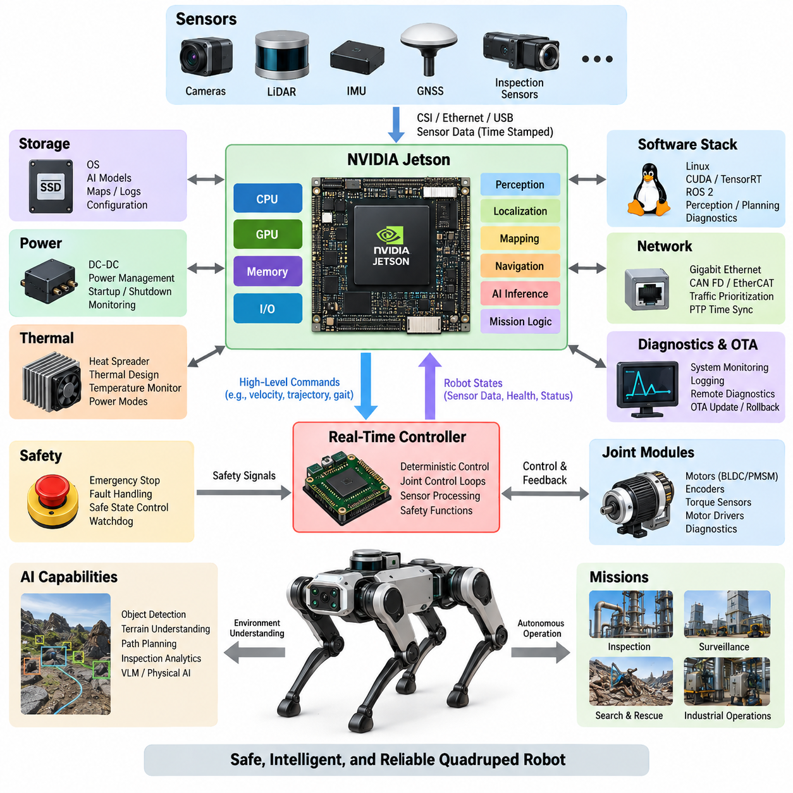
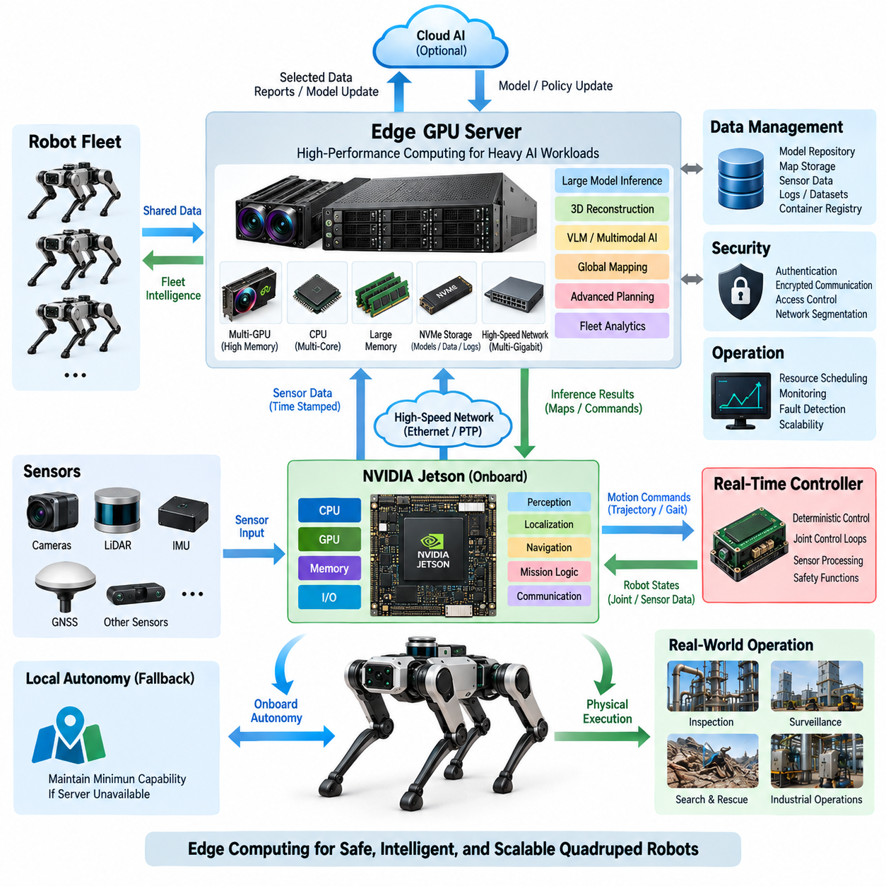
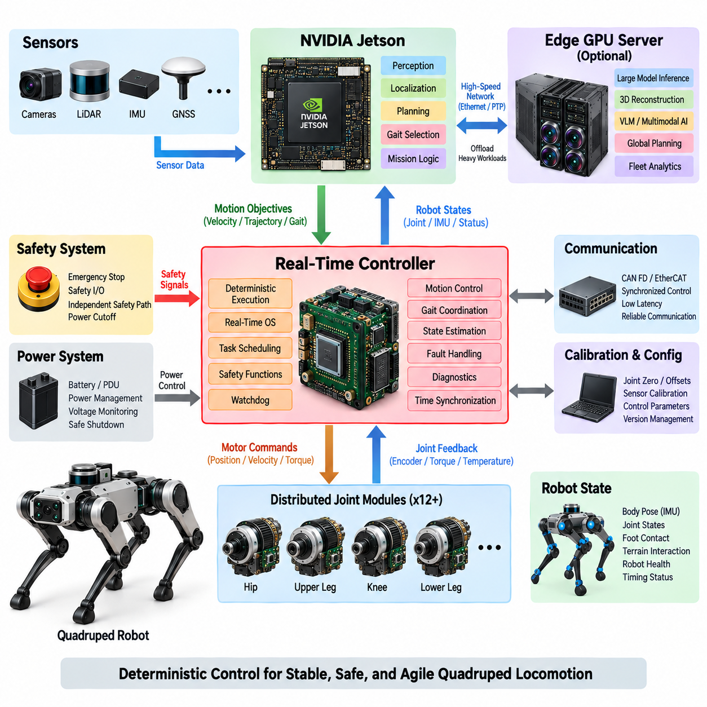
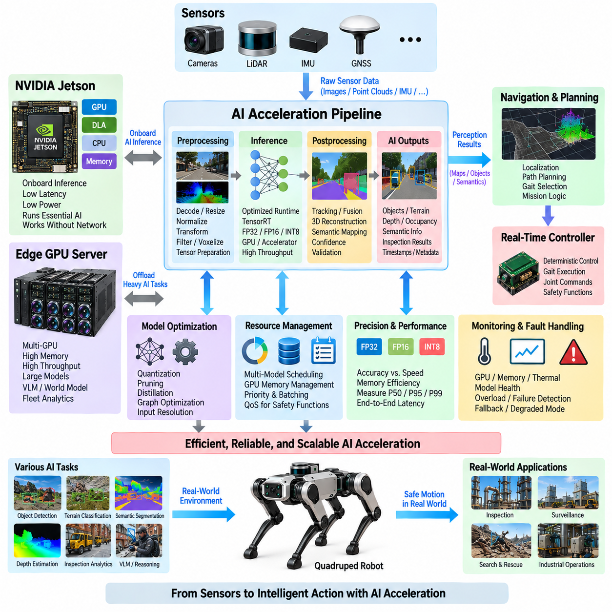
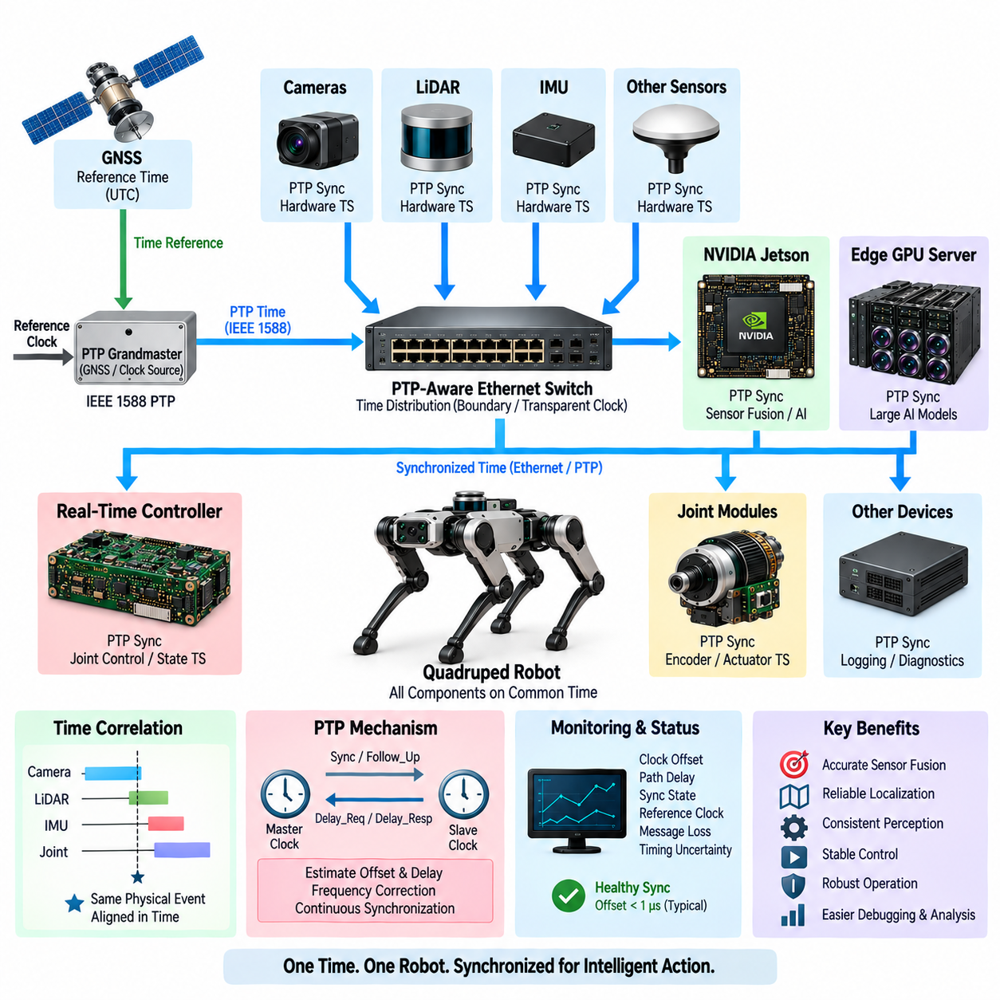
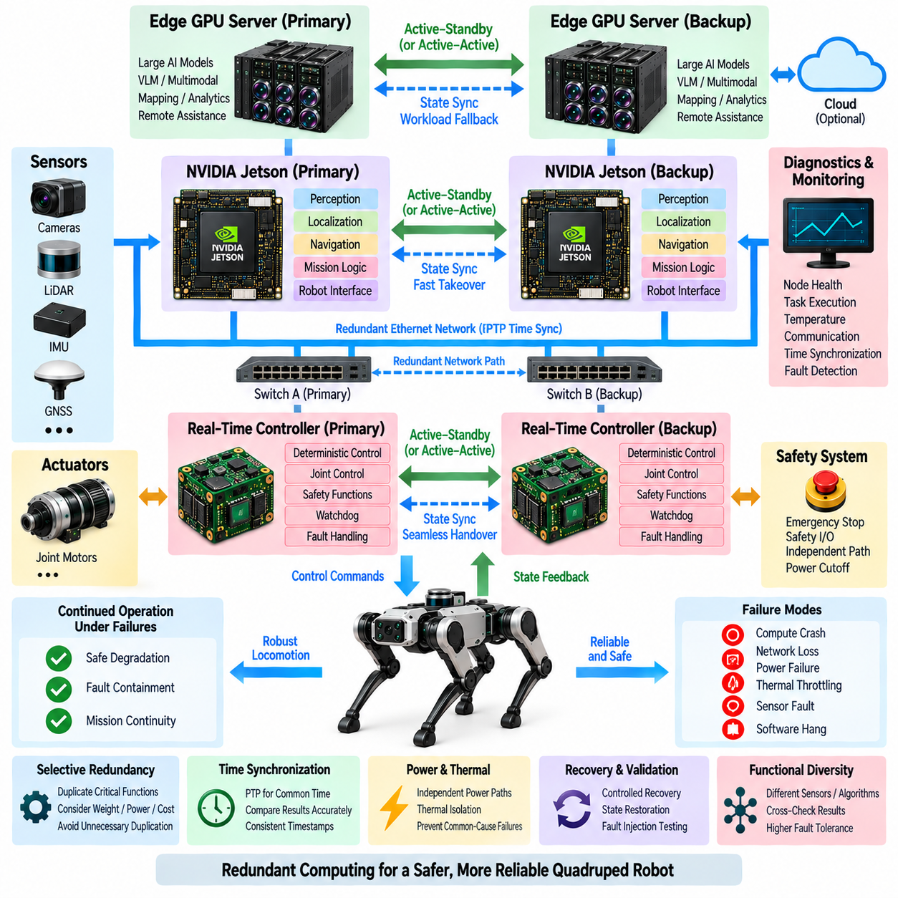

**Volume 20. Quadruped Electrical Architecture**

# Chapter 08. Computing Architecture

## 08.01. Jetson Architecture

{width="7.268055555555556in" height="7.268055555555556in"}

In a quadruped robot, the Jetson architecture serves as the primary high-performance computing layer for perception, localization, mapping, intelligent navigation, and Physical AI workloads. It complements rather than replaces deterministic motor and safety controllers. The computing structure should therefore separate AI-intensive processing from hard real-time joint control while providing reliable interfaces between both domains.

A Jetson-based computing node combines CPU cores, GPU acceleration, memory, storage, and high-speed I/O within an embedded power envelope suitable for a mobile robot. The CPU typically manages operating-system services, ROS 2 processes, communication, and supervisory logic, while the GPU executes highly parallel workloads such as neural-network inference, image processing, point-cloud processing, and learned perception.

Platform selection must consider the complete mission profile rather than peak AI performance alone. Compute demand depends on the number and resolution of cameras, LiDAR processing rate, localization algorithms, neural-network complexity, planning frequency, and additional inspection workloads. Thermal limits, battery consumption, physical packaging, available interfaces, and future model growth are equally important design parameters.

The Jetson node normally occupies the upper layer of a heterogeneous computing hierarchy. Real-time controllers close fast control loops for BLDC or PMSM actuators, process encoder and torque information, and maintain deterministic communication with joint modules. Jetson receives processed robot states and sensor streams, estimates the environment and robot condition, generates higher-level commands, and transfers motion objectives to the real-time domain.

Sensor connectivity strongly influences Jetson architecture. Cameras may use CSI or Ethernet interfaces, while LiDAR, GNSS, inspection sensors, and external computing devices commonly rely on Ethernet, USB, or dedicated gateways. High-bandwidth sensors should be distributed so that simultaneous traffic does not create interface congestion. Timestamp integrity must also be maintained from sensor acquisition through perception and state estimation.

Memory architecture is particularly important because perception pipelines frequently move large tensors, images, feature maps, and point clouds between processing stages. Excessive copying increases latency and memory bandwidth consumption even when GPU utilization appears moderate. Efficient implementations therefore favor hardware-assisted decoding, GPU-resident processing, shared or zero-copy buffers where appropriate, and carefully controlled transitions between CPU and GPU memory spaces.

Storage must support more than the operating system. A practical quadruped may retain AI models, calibration parameters, maps, mission configurations, diagnostic traces, event logs, and temporary sensor recordings. High-performance local storage can reduce model-loading and logging bottlenecks, while partitions or logically separated storage areas help protect critical software from uncontrolled growth of recorded data.

Power integration requires the Jetson subsystem to be treated as a managed electrical load rather than an ordinary computer. DC-DC conversion should tolerate battery-voltage variation and actuator-induced transients while maintaining stable supply conditions. Startup sequencing, controlled shutdown, undervoltage handling, and power-state monitoring are essential because abrupt power loss can corrupt storage, interrupt logging, or leave mission software in an uncertain state.

Thermal architecture directly determines sustainable computing performance. A Jetson module that meets nominal inference requirements may throttle when installed inside a sealed quadruped body exposed to high ambient temperature or continuous locomotion. Heat spreaders, conduction paths, airflow where practical, temperature telemetry, and workload-aware power modes should therefore be designed together with mechanical packaging rather than added after software development.

The software stack should isolate hardware-specific acceleration from application-level robotics functions. Linux and the Jetson software environment provide device drivers and GPU services, while CUDA-based libraries and inference runtimes accelerate perception and AI models. ROS 2 can then organize cameras, LiDAR, localization, mapping, planning, diagnostics, and mission functions into modular nodes with explicit interfaces and measurable timing behavior.

AI inference should be engineered around end-to-end latency instead of raw throughput alone. A quadruped navigating irregular terrain must convert sensor observations into useful motion decisions within bounded time. Preprocessing, inference, postprocessing, middleware transport, synchronization, and command delivery all contribute to response latency. Profiling should therefore measure complete pipelines under realistic simultaneous sensor and locomotion workloads.

Communication between Jetson and the lower control layer should preserve a clear authority boundary. High-level commands may represent desired body velocity, trajectory, foothold target, gait request, or mission state, whereas joint-level current, torque, position, and protection loops remain under deterministic controllers. This prevents operating-system scheduling or GPU workload variation from directly destabilizing actuator control.

Fault containment is equally important. A Jetson application can fail because of software defects, memory exhaustion, thermal throttling, corrupted sensor input, or overloaded computation. Such failures should not remove fundamental electrical protection or emergency-stop capability. Independent controllers must retain the ability to place actuators into a defined safe state, while watchdogs and health-monitoring mechanisms detect loss of the high-level computing node.

Network architecture should anticipate the bandwidth generated by multiple perception sensors and distributed controllers. Gigabit or higher-speed Ethernet can provide the backbone for cameras, LiDAR, companion computers, and diagnostic equipment, while CAN FD or EtherCAT may serve control-oriented subsystems according to determinism and topology requirements. Traffic prioritization prevents bulk data or logging transfers from interfering with control-relevant communication.

Time synchronization connects the Jetson architecture to the robot\'s physical state. Camera frames, LiDAR scans, IMU samples, encoder states, and actuator feedback must correspond to a consistent temporal reference for accurate sensor fusion and motion estimation. Hardware timestamps and PTP-based synchronization can reduce uncertainty, while software should preserve timestamp provenance instead of replacing acquisition time with later processing time.

Boot and recovery behavior should be designed as part of system architecture. After power application, critical interfaces, time synchronization, sensor drivers, localization, AI services, and mission software should start in a controlled dependency sequence. Supervisory logic must distinguish between components that are merely initializing and components that have failed, preventing locomotion until required computing and sensing services reach validated operational states.

Diagnostics should expose CPU utilization, GPU utilization, memory pressure, storage health, temperatures, power state, network statistics, inference latency, sensor freshness, and process status. These signals allow the robot to distinguish a perception failure from a communication or thermal problem. Historical telemetry also supports field debugging and predictive maintenance when intermittent failures cannot be reproduced during laboratory inspection.

The architecture should accommodate software updates without making recovery dependent on a successful update. Versioned AI models, configuration control, rollback capability, integrity verification, and protected system partitions reduce the risk of remote deployment. Because quadrupeds may operate away from engineering personnel, recovery paths should remain available even when application software, an AI model, or a network configuration becomes invalid.

Jetson scalability also supports separation between baseline and advanced robot configurations. A lower-power platform may execute essential perception and navigation, while a higher-performance configuration can support multiple neural networks, dense 3D perception, VLM-based interpretation, or sophisticated inspection analytics. Maintaining common interfaces across these configurations reduces software fragmentation and preserves portability as computing hardware evolves.

For advanced Physical AI, Jetson becomes the bridge between semantic intelligence and physical execution. Perception models interpret the environment, learned representations provide contextual understanding, and planning components convert that understanding into objectives compatible with locomotion control. The architecture must nevertheless maintain the distinction between probabilistic AI outputs and deterministic constraints imposed by safety, stability, actuator limits, and system health.

A well-designed Jetson architecture is therefore not defined simply by installing a powerful GPU module in the robot. It is an integrated computing subsystem combining AI acceleration, sensor interfaces, deterministic-controller coordination, networking, synchronized time, power management, thermal engineering, diagnostics, and fault containment. This structure provides the computational foundation for the later edge GPU, real-time control, AI acceleration, PTP synchronization, and compute-redundancy topics defined in the computing architecture chapter.

## 08.02. Edge GPU Server

{width="7.268055555555556in" height="7.268055555555556in"}

An Edge GPU Server extends the quadruped robot's computing architecture beyond the capabilities of a single embedded Jetson node. It provides a higher-performance computing tier for workloads that require greater GPU memory, parallel processing capacity, or sustained inference throughput. The server complements onboard real-time control and embedded AI rather than replacing them, creating a hierarchical computing architecture optimized for demanding Physical AI workloads.

The server can execute computationally intensive perception, multimodal inference, dense three-dimensional reconstruction, large neural networks, Vision-Language Models, and advanced planning algorithms. By moving selected workloads away from the embedded computer, the robot preserves onboard resources for latency-sensitive navigation and essential autonomy. Workload placement should therefore reflect latency, bandwidth, reliability, power consumption, and mission-criticality rather than GPU performance alone.

A typical Edge GPU Server combines one or more high-performance GPUs with a multicore CPU, large system memory, high-speed NVMe storage, and high-bandwidth networking. Unlike a cloud server, it is deployed physically close to the robot or robot fleet. This proximity reduces communication latency and allows large sensor datasets to remain within the operational site while still providing substantially greater computing capability than an embedded platform.

The relationship between Jetson and the Edge GPU Server should be organized as a cooperative computing hierarchy. Jetson maintains onboard perception, localization, navigation, mission continuity, and communication with the real-time controller, while the server processes computationally expensive or less latency-critical functions. If server connectivity is lost, the robot should retain a defined minimum autonomous capability instead of becoming completely dependent on external computation.

Workload partitioning is one of the most important architectural decisions. Functions requiring immediate physical response should remain onboard, whereas workloads involving large models, multiple sensor streams, global optimization, semantic reasoning, or fleet-wide information can be assigned to the server. A practical architecture may dynamically migrate or replicate selected inference services according to network quality, GPU utilization, mission priority, and robot operating condition.

Multi-GPU configurations provide additional scalability when a single accelerator cannot satisfy model size or throughput requirements. Independent GPUs may execute different perception and reasoning services, while larger models can use model parallelism or other distributed execution techniques. The architecture must consider GPU memory capacity, inter-GPU data movement, CPU-to-GPU transfer overhead, scheduling contention, and synchronization rather than assuming that additional GPUs automatically produce proportional performance gains.

GPU memory is especially important for advanced Physical AI. High-resolution camera inputs, LiDAR tensors, temporal features, occupancy representations, world models, and large foundation models can consume substantial memory before inference even begins. Larger GPU memory enables larger models, larger batches, longer temporal contexts, and simultaneous execution of multiple AI services, but memory bandwidth and data-transfer efficiency remain equally important to sustained performance.

The CPU subsystem coordinates networking, storage, process scheduling, preprocessing, middleware, and system management. Sufficient CPU resources are required to keep high-performance GPUs continuously supplied with useful work. A poorly balanced server can leave expensive accelerators underutilized because decoding, sensor conversion, middleware transport, or storage access becomes the actual bottleneck. System design must therefore consider the complete data path rather than GPU specifications in isolation.

High-speed networking forms the connection between the quadruped and the Edge GPU Server. Gigabit Ethernet may support moderate workloads, while multi-gigabit or higher-speed Ethernet becomes important when multiple high-resolution cameras, LiDAR streams, feature tensors, or several robots share the same infrastructure. Network design should account for aggregate bandwidth, packet loss, congestion, deterministic traffic requirements, and separation between control-related and bulk data flows.

Time synchronization remains essential when processing is distributed across different computers. Sensor data generated onboard must retain its original acquisition timestamp when transmitted to the Edge GPU Server. PTP-based synchronization and hardware timestamping can establish a common temporal reference among robots, Jetson nodes, sensors, and servers. Accurate timing enables remote sensor fusion and prevents network delay from being incorrectly interpreted as physical-world timing.

The server storage subsystem supports AI models, maps, recorded datasets, logs, cached sensor data, software containers, and diagnostic information. NVMe storage provides the throughput required for high-rate recording and rapid model loading. Storage architecture should separate temporary data from mission-critical software and configuration, while retention policies prevent uncontrolled sensor recording from exhausting available capacity during long-duration operation.

Software deployment should provide a consistent execution environment between development systems, Jetson devices, and Edge GPU Servers. Containerized services can isolate dependencies and simplify version control, deployment, rollback, and hardware-specific optimization. ROS 2, DDS, gRPC, or similar communication mechanisms may connect distributed services, but interface definitions should remain stable even when a model moves between onboard and server-side execution.

AI acceleration on the server should be evaluated using end-to-end mission performance rather than theoretical GPU throughput. Metrics should include inference latency, P50/P95/P99 response time, worst-case behavior, memory utilization, data-transfer overhead, and performance under concurrent workloads. A server that performs well for one isolated neural network may behave very differently when perception, VLM reasoning, mapping, logging, and multiple robots operate simultaneously.

Thermal and power requirements differ substantially from embedded Jetson computing. High-performance GPUs can demand hundreds of watts each and generate concentrated thermal loads. The Edge GPU Server therefore requires appropriate power conversion, cooling, airflow, environmental protection, and power monitoring. For mobile or field-deployed systems, the energy required by the server may determine whether it is mounted on a carrier platform, installed in a nearby cabinet, or operated from fixed infrastructure.

Fault isolation should prevent Edge GPU Server failures from propagating into locomotion control. Server crashes, network interruptions, GPU errors, thermal shutdowns, or overloaded inference services must be detectable by the onboard system. Jetson can monitor service heartbeat, communication latency, and response freshness, rejecting outdated results and switching to local fallback functions when external computation becomes unavailable or unreliable.

Security becomes increasingly important because the server creates a high-bandwidth digital connection to the robot. Authentication, encrypted communication, access control, software integrity verification, and controlled service exposure help prevent unauthorized commands or model manipulation. Network segmentation can further separate robot control, sensor transport, maintenance access, and external enterprise networks, reducing the consequences of failures or cybersecurity incidents.

For multiple quadrupeds, the Edge GPU Server can evolve from a companion computer into shared fleet intelligence infrastructure. Several robots may contribute sensor observations while the server performs global mapping, semantic scene understanding, centralized analytics, model inference, or mission coordination. Resource scheduling then becomes essential so that one robot or computationally expensive model cannot consume all GPU capacity and degrade services required by the rest of the fleet.

An Edge GPU Server also creates an intermediate layer between individual robots and cloud AI. Sensitive or high-volume sensor data can be processed locally, while only selected results, compressed representations, reports, or model updates are exchanged with cloud systems. This reduces external bandwidth requirements and enables operation in environments where internet connectivity is limited, intermittent, expensive, or restricted by operational security requirements.

In advanced Physical AI architectures, the server can host larger semantic and reasoning models that are impractical on the robot. Jetson handles immediate embodied interaction, the real-time controller maintains deterministic physical execution, and the Edge GPU Server provides deeper perception, world representation, reasoning, and fleet-level intelligence. This separation aligns computational responsibility with the timing and resource characteristics of each layer.

The resulting architecture should therefore be viewed as a distributed computing continuum rather than a simple external GPU expansion. Real-time controllers protect deterministic motion, Jetson maintains local autonomy, and the Edge GPU Server supplies scalable AI computation close to the operational environment. Together, these layers provide the foundation for subsequent real-time control, AI acceleration, PTP synchronization, and compute redundancy within the quadruped computing architecture.

## 08.03. Real Time Controller

{width="7.268055555555556in" height="7.268055555555556in"}

A Real-Time Controller forms the deterministic execution layer between high-level computing and the physical joints of a quadruped robot. While Jetson or an Edge GPU Server performs perception, localization, planning, and AI inference, the real-time controller executes timing-critical motion functions with predictable latency. This separation prevents variable AI workloads and operating-system scheduling from directly disturbing robot stability and actuator control.

Quadruped locomotion requires coordinated control of multiple joints operating at high update rates. Hip, upper-leg, knee, and lower-leg actuators must respond consistently to commanded positions, velocities, or torques while the robot experiences rapidly changing ground forces. The controller therefore maintains periodic execution cycles with bounded jitter, ensuring that sensing, control computation, communication, and actuator commands occur within defined timing constraints.

The real-time controller typically receives higher-level motion objectives from the Jetson computing layer. These objectives may include desired body velocity, orientation, trajectory, gait mode, foothold targets, or locomotion state. Instead of directly commanding motor power from AI software, the controller converts these objectives into deterministic joint-level references while enforcing physical constraints such as position, velocity, torque, current, and thermal limits.

At the lower interface, the controller communicates with distributed joint modules containing motor drivers, encoders, and potentially torque or temperature sensors. Joint position and velocity feedback provide the fundamental state required for closed-loop control, while torque and current measurements help estimate mechanical loading. The controller continuously combines these signals to regulate actuator behavior and detect abnormal conditions before they develop into larger system failures.

Control-loop timing must be engineered from the complete signal path rather than from processor speed alone. Sensor sampling, bus transmission, task scheduling, control calculation, command transmission, and motor-driver response all contribute to effective loop latency. A fast processor cannot compensate for unpredictable communication delays or excessive jitter, so timing analysis must consider worst-case execution and communication behavior throughout the entire control chain.

A real-time operating system or equivalent deterministic execution environment can organize periodic control tasks according to explicit priorities and deadlines. High-priority actuator and safety functions should remain isolated from lower-priority logging, diagnostics, or configuration services. Memory allocation, blocking operations, background processes, and uncontrolled communication should also be minimized in critical paths because they can introduce timing variations that degrade locomotion performance.

CAN FD can provide robust communication for distributed joint and auxiliary controllers where bandwidth requirements are moderate and fault handling is important. EtherCAT can support higher-rate synchronized control when tighter timing and coordinated multi-axis operation are required. The appropriate network depends on joint count, update frequency, payload size, topology, synchronization requirements, wiring constraints, and the required level of determinism.

The controller must maintain an accurate representation of robot state. Encoder measurements describe joint configuration, while IMU information contributes body orientation and angular motion. Foot force sensors or torque estimates indicate contact with the ground. Combining these signals allows the control system to determine whether each leg is supporting the body, transitioning through swing, encountering an obstacle, or experiencing unexpected mechanical loading.

Gait execution requires precise coordination among all four legs rather than independent joint control. Walking, trotting, crawling, climbing, and recovery behaviors impose different timing relationships between stance and swing phases. The real-time controller translates the selected gait strategy into synchronized joint references and maintains phase consistency even when terrain contact or actuator response differs from the nominal model.

Safety constraints must remain active independently of high-level AI decisions. The controller should reject commands that exceed allowable joint position, speed, torque, or current ranges and should detect stale, missing, or inconsistent commands. When communication with the Jetson node is interrupted, the controller must transition according to a predefined policy rather than continuing indefinitely with the last received motion command.

Emergency-stop handling requires an explicit relationship between logical control and electrical power architecture. Software can request a controlled stop or torque reduction, but critical emergency functions should not depend exclusively on the real-time software remaining operational. Independent safety paths can disable actuator enable signals or command the power architecture toward a defined safe state when hazardous conditions are detected.

Watchdog mechanisms provide another layer of fault containment. A hardware or independent supervisory watchdog can verify that critical controller tasks continue executing within expected timing limits. If the controller stalls, misses repeated deadlines, or produces invalid health signals, the watchdog can initiate a controlled reset, inhibit actuator operation, or trigger another defined response according to the system safety architecture.

Fault handling should distinguish between failures that require immediate shutdown and those that permit degraded operation. A temporary sensor anomaly may allow reduced-speed locomotion, whereas loss of essential joint feedback can require stopping the affected leg or the entire robot. This distinction supports fail-safe and potentially fail-operational strategies while preventing minor faults from unnecessarily causing complete mission termination.

Communication with Jetson should use clearly defined command and state interfaces. Jetson provides high-level objectives, while the controller returns joint states, body states, actuator temperatures, fault information, execution status, and timing health. Sequence counters, timestamps, validity indicators, and timeout mechanisms help determine whether received information is current and trustworthy rather than merely present on the communication interface.

Time synchronization becomes particularly important when control information is combined with camera, LiDAR, IMU, and other sensor observations. The real-time controller may operate with a local high-resolution clock while participating in a broader synchronized time domain. PTP or related synchronization mechanisms can align distributed timestamps, allowing high-level computing to associate physical joint motion with sensor observations accurately.

Diagnostics should monitor both functional behavior and timing behavior. CPU utilization alone does not indicate whether real-time performance is healthy. Useful information includes control-cycle duration, maximum execution time, deadline misses, communication latency, packet errors, actuator response, sensor freshness, watchdog status, and synchronization quality. Recording these metrics helps identify intermittent problems that appear only during demanding locomotion or AI workloads.

The controller should also support calibration and commissioning procedures without compromising operational safety. Joint zero positions, encoder offsets, torque-sensor calibration, motor direction, current limits, and mechanical range parameters must be stored and validated. Configuration data should be version controlled and protected against accidental modification because incorrect calibration can produce physically dangerous motion even when the control algorithms themselves operate correctly.

Startup sequencing ensures that actuator control begins only after required components have reached valid states. Communication buses, sensors, joint modules, calibration parameters, safety inputs, and high-level command interfaces should be checked before torque is enabled. Shutdown should similarly transition the robot toward a mechanically stable condition before actuator power is removed whenever operating conditions allow a controlled sequence.

The boundary between AI and deterministic control becomes increasingly important as Physical AI capabilities expand. Learned models may generate trajectories, footholds, gait selections, or semantic motion objectives, but their outputs should pass through deterministic validation and constraint enforcement before reaching actuators. This architecture allows advanced intelligence to influence behavior without granting probabilistic AI models unrestricted authority over safety-critical motor execution.

A robust Real-Time Controller therefore acts as the trusted physical execution layer of the quadruped computing architecture. It connects Jetson-based intelligence with distributed actuators through deterministic scheduling, synchronized communication, closed-loop control, diagnostics, watchdogs, and safety constraints. Together with the Jetson Architecture and Edge GPU Server, it establishes a hierarchical foundation for subsequent AI acceleration, PTP time synchronization, and compute redundancy.

## 08.04. AI Acceleration

{width="7.268055555555556in" height="7.268055555555556in"}

AI acceleration in a quadruped robot provides the computational capability required to execute perception, prediction, semantic understanding, and learned decision functions within practical latency and power limits. Rather than treating AI as a single application, the computing architecture should provide an acceleration pipeline spanning sensor preprocessing, neural-network inference, postprocessing, and delivery of validated results to navigation, planning, and control functions.

The GPU is the primary acceleration resource for highly parallel neural-network workloads. Camera images, LiDAR representations, occupancy grids, feature tensors, and multimodal inputs can be processed simultaneously through thousands of parallel operations. Compared with CPU-only execution, GPU acceleration enables larger models and higher sensor rates while preserving CPU resources for operating-system services, communication, orchestration, diagnostics, and other sequential workloads.

Modern embedded AI platforms may also provide specialized accelerators optimized for neural-network operations. These engines can execute supported layers with improved performance per watt compared with general-purpose GPU execution. Effective architecture therefore does not assume that every model should run on the GPU; workloads should be mapped to CPU, GPU, or dedicated accelerators according to model compatibility, latency requirements, memory behavior, precision, and available power.

The AI software pipeline begins before neural-network inference. Camera decoding, image resizing, normalization, geometric transformation, point-cloud filtering, voxelization, and tensor preparation can consume significant processing time. Hardware-assisted preprocessing and GPU-resident pipelines reduce unnecessary memory transfers. Keeping data close to the accelerator is often as important as increasing raw compute performance because repeated CPU-GPU copies can dominate end-to-end latency.

Inference runtimes convert trained neural networks into optimized execution graphs for the target hardware. Operations may be fused, kernels selected according to tensor dimensions, and memory buffers reused to reduce overhead. TensorRT or comparable optimized runtimes can improve execution efficiency on supported NVIDIA platforms, but acceleration results depend on the actual model structure. Performance should therefore be measured after deployment rather than inferred only from theoretical accelerator specifications.

Numerical precision provides an important tradeoff between model accuracy, memory consumption, and execution speed. FP32 may be useful for development or models sensitive to numerical error, while FP16 or BF16 can reduce memory requirements and increase accelerator utilization. INT8 quantization can provide further efficiency when the model and calibration process support it, but accuracy must be validated against representative robot data before deployment.

AI acceleration must account for multiple models operating simultaneously. A quadruped may execute object detection, terrain classification, depth estimation, localization support, semantic segmentation, anomaly detection, and inspection analytics at the same time. Each model competes for GPU execution time, memory, and bandwidth. Resource planning should therefore evaluate the combined mission workload instead of benchmarking each neural network independently under ideal conditions.

Scheduling becomes more important as the number of AI services increases. Safety-relevant terrain perception may require higher priority and predictable update frequency, while semantic interpretation or inspection analysis may tolerate longer latency. The architecture can assign different execution rates, priorities, batching policies, and resource budgets to each service so that computationally expensive background inference does not degrade functions directly associated with locomotion.

GPU memory capacity establishes a practical limit on model complexity and concurrency. Model parameters occupy only part of the available memory; intermediate activations, input tensors, output buffers, runtime workspaces, temporal states, and other applications also consume capacity. Memory planning should therefore include peak usage under simultaneous operation and sufficient margin for runtime variation rather than selecting hardware based only on model file size.

Temporal AI models introduce additional computational requirements because they process information across multiple time steps. Video models, recurrent networks, world models, and temporal occupancy representations may retain latent states or sequences of features in memory. These models can improve understanding of motion and environmental change, but they increase memory pressure and make predictable scheduling more difficult, particularly on embedded platforms with shared system memory.

The Jetson platform is well suited to AI functions that must remain physically onboard the quadruped. Local inference reduces dependence on external connectivity and enables perception and navigation to continue when communication with an Edge GPU Server is unavailable. Models selected for Jetson should therefore be optimized not only for accuracy but also for sustained thermal performance, power consumption, memory capacity, and worst-case inference latency.

An Edge GPU Server provides a second acceleration tier for models that exceed the practical limits of onboard computing. Large Vision-Language Models, multimodal reasoning systems, dense reconstruction, global mapping, advanced inspection models, and fleet analytics can be offloaded when network conditions permit. This creates a heterogeneous AI architecture in which embedded and server-class accelerators cooperate according to workload characteristics.

Offloading is beneficial only when communication overhead remains compatible with the required response time. Sending raw camera or LiDAR data to an external server may consume substantial bandwidth and introduce variable latency. In some cases, Jetson can perform early feature extraction and transmit compact representations instead. The architecture should compare raw-data transfer, compressed-data transfer, feature transfer, and local inference according to mission requirements.

End-to-end latency is more important than inference latency alone. Sensor exposure, data acquisition, preprocessing, accelerator scheduling, neural-network execution, postprocessing, middleware transport, decision logic, and command generation all contribute to the time between a physical event and robot response. AI acceleration should therefore be evaluated as part of the complete perception-to-action pipeline rather than as an isolated neural-network benchmark.

Performance characterization should include average and tail behavior. P50 latency describes typical operation, while P95 and P99 reveal less frequent delays that may become important during demanding missions. Worst-case behavior should also be examined where practical. GPU utilization, memory usage, thermal state, power consumption, network traffic, and simultaneous workloads should be recorded together so that performance degradation can be traced to its actual cause.

Thermal constraints can convert short benchmark performance into unrealistic expectations. A GPU may sustain maximum frequency during a brief test but throttle after prolonged inference inside a compact quadruped enclosure. AI acceleration must therefore be validated under representative ambient temperature, locomotion load, sensor activity, and mission duration. Cooling design and power modes become part of AI performance engineering rather than independent mechanical considerations.

Model optimization should preserve functional behavior while reducing unnecessary computation. Techniques such as graph optimization, mixed precision, quantization, pruning, input-resolution adjustment, and model distillation can reduce latency or memory requirements. Optimization must be validated using mission-representative datasets because an apparently small accuracy reduction in a generic benchmark may disproportionately affect terrain perception, obstacle recognition, or inspection performance.

AI outputs should carry confidence, timestamps, validity information, and model-version metadata when appropriate. Downstream software must determine whether an inference result is sufficiently recent and trustworthy for use. A technically correct result that arrives too late may be unsafe for motion decisions. Explicit data contracts between AI services, planning software, and deterministic control prevent accelerated inference from becoming an uncontrolled path into physical execution.

Fault handling should detect accelerator overload, memory exhaustion, model failure, thermal throttling, stale inference, and service crashes. The system can respond by reducing inference frequency, disabling lower-priority models, switching to a smaller model, moving selected workloads to another computing node, or entering a degraded autonomous mode. Essential locomotion safety should remain protected by deterministic control functions independent of AI accelerator availability.

As Physical AI evolves, acceleration requirements will expand from conventional perception toward multimodal reasoning, world models, foundation models, and learned planning. These workloads require greater memory, temporal context, and heterogeneous computation. Designing explicit interfaces between Jetson, Edge GPU Servers, and real-time controllers allows computing hardware to evolve without redesigning the complete electrical and control architecture whenever a new AI model is introduced.

AI acceleration is therefore a system-level capability rather than simply the presence of a powerful GPU. Efficient preprocessing, optimized inference, precision management, memory planning, workload scheduling, thermal control, distributed execution, diagnostics, and deterministic interfaces must operate together. Within the quadruped computing architecture, this acceleration layer connects intelligent perception and reasoning to the synchronized, reliable physical execution developed in the surrounding computing subsystems.

## 08.05. PTP Time Synchronization

{width="7.268055555555556in" height="7.268055555555556in"}

PTP time synchronization provides a common temporal reference across the distributed computing, sensing, and control components of a quadruped robot. Cameras, LiDAR, IMU, GNSS, Jetson computers, Edge GPU Servers, and real-time controllers may each contain independent oscillators. Without synchronization, their timestamps gradually diverge, making observations of the same physical event appear to have occurred at different times.

Precise timing is especially important because quadruped locomotion produces rapid changes in body orientation, joint position, foot contact, and sensor viewpoint. A camera image acquired only milliseconds away from the corresponding IMU or joint state can represent a measurably different robot configuration. Synchronization therefore affects sensor fusion, localization, state estimation, mapping, perception, and the ability to associate environmental observations with physical motion.

Precision Time Protocol, commonly implemented according to IEEE 1588, distributes time over an Ethernet network by exchanging timestamped synchronization messages between clocks. Instead of merely setting clocks occasionally, PTP continuously estimates timing relationships and compensates for clock offset and frequency differences. This allows distributed devices to maintain a shared representation of time while continuing to operate with their own local hardware clocks.

A PTP domain typically establishes a reference clock from which other participating clocks derive synchronized time. The reference may originate from a dedicated timing device, GNSS-disciplined source, industrial computer, or another appropriately configured clock. The system architecture should define clock authority explicitly so that startup, reference loss, recovery, and transitions between available timing sources produce predictable behavior.

Hardware timestamping significantly improves synchronization quality because timestamps are captured close to the physical network interface rather than after unpredictable operating-system and software delays. Software timestamps may include scheduling, buffering, and driver latency that varies from packet to packet. Hardware-assisted PTP therefore provides a more stable foundation when accurate correlation between high-rate sensors and real-time control information is required.

Network infrastructure influences achievable synchronization accuracy. Ethernet switches located between the reference clock and synchronized devices introduce forwarding delays and variations. PTP-aware switches can support timing mechanisms that account for these effects, while ordinary network equipment may provide less predictable results. Timing architecture should consequently be considered during switch selection rather than treated purely as a software configuration issue.

PTP message exchange enables a device to estimate the offset between its local clock and the reference clock as well as the propagation delay through the communication path. A clock-control mechanism then adjusts local timing gradually to reduce the measured error. Sudden uncontrolled time jumps should be avoided where they could disturb logging, sensor fusion, or real-time software that assumes monotonically progressing timestamps.

Sensor timestamp provenance is as important as clock synchronization itself. A timestamp should represent when physical data was acquired, not merely when a software process received or processed it. Camera exposure time, LiDAR measurement time, IMU sampling time, and encoder acquisition time may occur significantly before application-level processing. Preserving the original acquisition timestamp allows downstream algorithms to reconstruct the actual temporal relationship between measurements.

Camera synchronization requires particular attention because image exposure and frame delivery are different events. A frame may be timestamped at exposure start, exposure completion, hardware trigger, or driver reception depending on the sensor architecture. The selected convention must be documented and maintained consistently. Where tighter alignment is required, hardware trigger signals can coordinate exposure while PTP provides the common time reference used to identify each frame.

LiDAR sensors similarly generate measurements over finite acquisition intervals rather than at a single instant. A rotating LiDAR may collect points while both the environment and robot are moving. Accurate timestamps enable motion compensation by associating portions of a scan with the corresponding robot pose. Poor synchronization can distort reconstructed geometry and degrade localization even when the LiDAR itself provides highly accurate range measurements.

IMU synchronization is critical because inertial measurements are commonly produced at higher rates than cameras or LiDAR. Orientation and angular-rate information can be interpolated to the acquisition time of slower sensors when all measurements share a common clock reference. This allows camera frames, point clouds, and joint states to be compensated for robot motion instead of being combined according to arrival order at the computing node.

The real-time controller also participates in the temporal architecture by timestamping joint states, actuator feedback, foot-contact information, and control events. High-level computing can then associate a perception result with the actual mechanical configuration of the robot at the relevant instant. This distinction becomes essential when network and processing latency cause sensor information to arrive substantially later than the physical event it represents.

Jetson acts as an important integration point because it receives data from multiple sensors while exchanging state and commands with the real-time controller. Its software should preserve source timestamps throughout ROS 2 or other middleware pipelines rather than replacing them with local reception time. Queues, preprocessing stages, inference services, and message conversions should maintain timestamp metadata so temporal information survives the complete perception pipeline.

An Edge GPU Server introduces another timing boundary because sensor data may cross a network before AI processing occurs. The server should operate within the same synchronized time domain where practical and retain original sensor timestamps. AI results can additionally include processing timestamps and validity information, allowing Jetson to distinguish when the physical observation occurred from when inference completed and when the result was received.

Time synchronization and communication determinism are related but different concepts. PTP aligns clocks, but it does not guarantee that Ethernet packets will arrive within a fixed latency. Network congestion can delay a correctly timestamped message without changing the time represented by its timestamp. System design must therefore manage both clock synchronization and network quality when functions depend on bounded response times.

Monitoring is necessary because synchronization quality can deteriorate without causing obvious communication failure. Useful diagnostics include clock offset, path delay, synchronization state, reference-clock identity, frequency adjustment, message loss, and transitions between timing sources. These parameters should be logged together with robot events so that localization or perception anomalies can later be correlated with timing degradation.

Loss of the PTP reference should produce a defined response rather than an immediate assumption that all timestamps are invalid. Local clocks can continue operating in a holdover state for a limited period, although their error gradually increases according to oscillator quality. Software can expose synchronization status and estimated timing uncertainty so that applications decide whether degraded timing remains acceptable for the current function.

Safety-related functions should not depend exclusively on network time synchronization where an independent local timing mechanism can provide the necessary protection. Emergency stop, actuator current limits, watchdogs, and critical real-time control deadlines should continue functioning with local deterministic clocks. PTP supports coordination across distributed components, but fundamental protection mechanisms should remain robust when the timing network becomes unavailable.

Startup sequencing should verify timing readiness before enabling functions that require synchronized sensor fusion. Devices need time to discover the reference, estimate network delay, and converge toward acceptable clock offset. The robot may allow basic diagnostics during this period while delaying high-precision localization or autonomous movement until synchronization status satisfies predefined acceptance criteria.

Validation should measure synchronization under realistic operating conditions rather than only on an idle laboratory network. Testing should include high sensor bandwidth, concurrent AI traffic, logging, multiple computing nodes, switch loading, startup transitions, reference-clock loss, and recovery. Offset distributions and worst observed timing errors are more informative than a single nominal synchronization value when evaluating robustness.

PTP time synchronization ultimately creates a shared temporal coordinate system for the quadruped robot. When acquisition timestamps, hardware clocks, network timing, middleware metadata, and diagnostics are engineered consistently, distributed sensor and control data can be interpreted according to when events actually occurred. This common time foundation connects Jetson computing, Edge GPU processing, real-time control, and later compute-redundancy mechanisms into a coherent physical system.

## 08.06. Compute Redundancy

{width="7.268055555555556in" height="7.268055555555556in"}

Compute redundancy in a quadruped robot provides continued control, fault containment, and safe degradation when a computing component becomes unavailable or produces unreliable results. Because locomotion depends on coordinated perception, state estimation, planning, and deterministic joint control, a single computing failure can affect the entire robot. Redundancy therefore protects critical computational functions rather than simply duplicating processors.

The redundancy architecture should begin by identifying which functions must survive particular failures. Emergency protection and actuator safety require stronger independence than noncritical inspection analytics, while basic locomotion may need to continue even if advanced AI becomes unavailable. This functional classification determines where duplication, fallback processing, independent monitoring, or controlled shutdown is appropriate.

A hierarchical quadruped architecture naturally provides several levels of computational independence. The Edge GPU Server can execute high-performance AI workloads, Jetson can maintain onboard autonomy, and the real-time controller can preserve deterministic motion and safety functions. Failure of one layer should therefore reduce available capability according to a defined degradation strategy rather than automatically causing uncontrolled loss of the complete system.

Redundancy can be implemented through active-active, active-standby, or functionally diverse configurations. Active-active nodes execute functions simultaneously and can compare outputs or distribute workloads. Active-standby architectures maintain a secondary node capable of taking over after primary failure. Functional diversity instead uses different computing paths or algorithms to reduce the probability that one common failure mechanism disables all available channels.

Complete hardware duplication is not always necessary or desirable. A quadruped has strict constraints on mass, volume, power consumption, thermal dissipation, wiring, and cost. Redundancy should therefore be selective. Critical state estimation, command supervision, safety monitoring, and essential navigation may justify duplicated resources, while large VLM inference or inspection analytics can often be temporarily removed without preventing the robot from reaching a safe state.

The Jetson computing layer is a key candidate for redundancy because it integrates perception, localization, navigation, mission logic, and communication with lower-level control. A secondary Jetson or another independent compute node can maintain essential services or receive replicated state information. The backup does not necessarily require identical performance if its purpose is to provide reduced-speed navigation, controlled retreat, or safe mission termination.

An Edge GPU Server provides another form of computational redundancy when selected AI services can execute either onboard or externally. Heavy inference may normally run on the server while a smaller fallback model remains available on Jetson. Conversely, server-side processing can temporarily replace a failed or overloaded onboard AI service when communication conditions permit. Such redundancy combines workload portability with fault recovery rather than relying only on identical hardware.

The real-time controller must remain sufficiently independent from high-level computing failures. If Jetson crashes or becomes unresponsive, joint control loops, actuator limits, watchdogs, and essential safety functions should continue long enough to execute a predefined safe response. This separation prevents failure of Linux, ROS 2, GPU software, or AI inference from directly eliminating deterministic motor-control authority.

Health monitoring is necessary to determine whether a computing node is truly available. Heartbeat messages can detect complete loss of communication, but they are insufficient for identifying incorrect computation. Monitoring should also examine task execution, data freshness, timing behavior, memory health, temperature, communication status, synchronization state, and application-level plausibility to detect nodes that remain online but no longer provide trustworthy results.

Watchdogs provide a local mechanism for detecting processor or software failure. Independent hardware watchdogs can supervise critical execution and trigger reset or isolation when expected activity disappears. Software watchdogs can additionally monitor individual processes and services. Redundant architectures should avoid having the same failed processor responsible for both performing a critical function and deciding whether that function itself is healthy.

Failover requires reliable detection before authority is transferred. If both primary and backup computers believe they control the same actuator or mission function simultaneously, conflicting commands can occur. The architecture therefore requires explicit ownership, arbitration, and state-transition mechanisms. Control authority should move between nodes according to deterministic rules, with clear handling of startup, recovery, communication loss, and ambiguous node states.

State synchronization determines how quickly a standby node can assume responsibility. A backup processor may require current robot pose, map state, mission progress, joint condition, calibration information, and recent sensor history. Continuously replicating every internal state can be expensive and create tight software coupling, so the architecture should define a minimal recoverable state that allows the backup to resume essential operation safely.

Time synchronization is fundamental to redundant computation because outputs from different nodes must be compared against a common temporal reference. PTP-synchronized clocks allow the system to determine whether two estimates correspond to the same physical instant. Without common time, differences caused by measurement timing or network delay may be incorrectly interpreted as computational disagreement, making fault detection and voting less reliable.

Data-path redundancy must also be considered because duplicated computers connected through a single switch, power converter, or communication cable can still share a single point of failure. Critical channels may require independent network paths, separate switch ports, redundant power feeds, or alternative communication buses. Redundancy analysis should therefore examine the entire dependency chain rather than counting the number of processors.

Power architecture is closely connected to compute redundancy. Two computers powered by the same unprotected converter may fail simultaneously during a power disturbance. Critical redundant nodes can use independently protected power branches or appropriately separated DC-DC conversion paths. Power-good signals, undervoltage monitoring, controlled startup, and independent shutdown mechanisms help distinguish computing faults from underlying electrical failures.

Thermal design can also create common-cause failures. Two redundant processors installed in the same poorly cooled enclosure may simultaneously throttle or shut down during high ambient temperature. Physical placement, heat paths, airflow, and thermal monitoring should therefore be evaluated as part of redundancy design. Logical duplication provides little protection when both channels depend on the same inadequate environmental condition.

Network partitioning introduces another failure mode. A healthy computing node may become isolated from sensors or controllers even though its processor remains operational. Redundancy management must distinguish processor failure from communication-path failure and determine which node still has access to the required information. Network topology and service placement should be designed so that essential functions do not depend on one unnecessary communication bottleneck.

Redundant perception does not necessarily require identical sensors or identical algorithms. Camera, LiDAR, IMU, encoder, and foot-force information provide different observations of robot state and environment. Cross-checking independent modalities can detect implausible results that processor duplication alone cannot identify. Functional diversity is particularly valuable when software defects or corrupted input data could affect identical redundant pipelines in the same manner.

Degraded operation should be explicitly defined as part of the redundancy strategy. Loss of an Edge GPU Server may disable large-model reasoning while preserving normal locomotion. Loss of one perception service may reduce speed or restrict terrain. Loss of primary Jetson computing may trigger backup navigation or controlled stopping. Failure of critical real-time control may instead require immediate transition toward the safest achievable physical state.

Recovery after a fault must be controlled as carefully as failover. A rebooted node should not automatically regain authority merely because it is communicating again. It must restore configuration, synchronize time, verify sensor and network access, recover required state, and demonstrate healthy execution. Only after these conditions are satisfied should the redundancy manager permit reintegration or transfer of responsibility.

Diagnostics and event logging are essential for understanding redundancy behavior in field operation. Failover cause, node health, watchdog events, timing offsets, communication errors, power conditions, thermal state, authority transitions, and recovery actions should be timestamped and recorded. These records allow engineers to determine whether redundancy responded to a genuine hardware failure, software defect, network problem, or false-positive health decision.

Validation must deliberately inject failures instead of assuming redundant hardware guarantees reliability. Tests should include processor crashes, application hangs, network disconnection, delayed messages, corrupted data, loss of PTP synchronization, GPU overload, thermal throttling, power interruption, and recovery. The important measurement is not merely whether a backup exists, but whether the robot detects the fault and reaches the intended operational state within the required time.

Compute redundancy ultimately creates a layered resilience architecture for the quadruped robot. Edge GPU resources, Jetson computing, real-time controllers, communication networks, synchronized time, power distribution, watchdogs, and safety mechanisms must cooperate without introducing hidden common points of failure. Properly engineered redundancy allows advanced AI capabilities to fail gracefully while preserving deterministic control and the safest achievable physical behavior.
