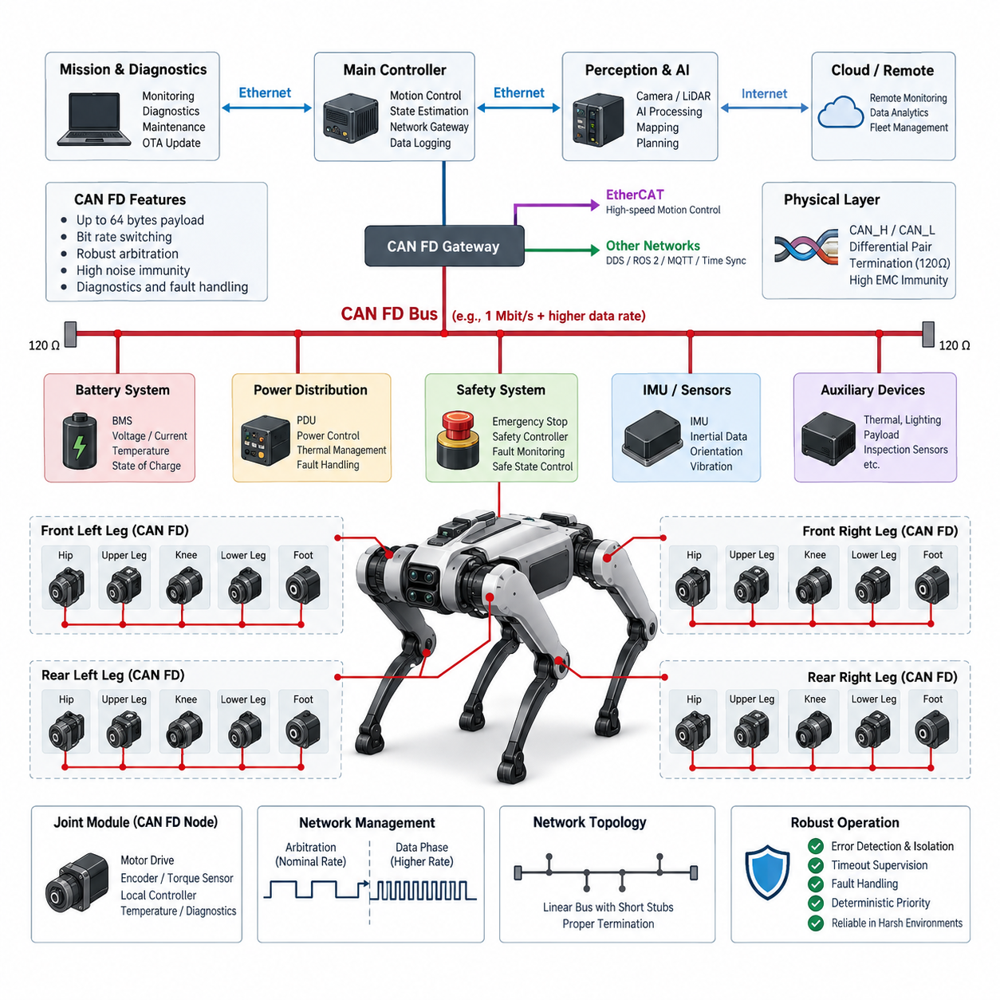
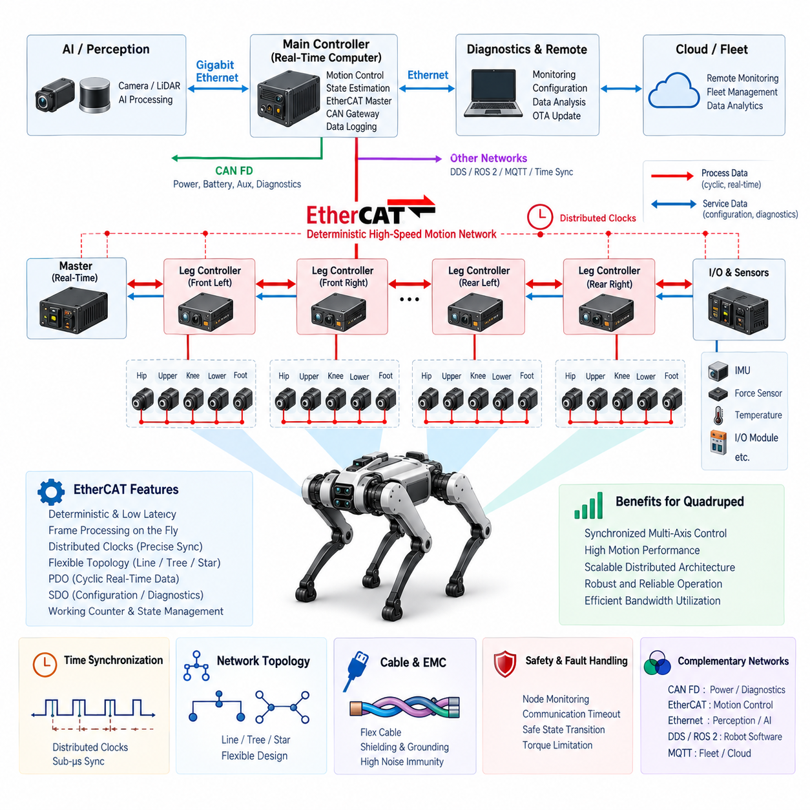
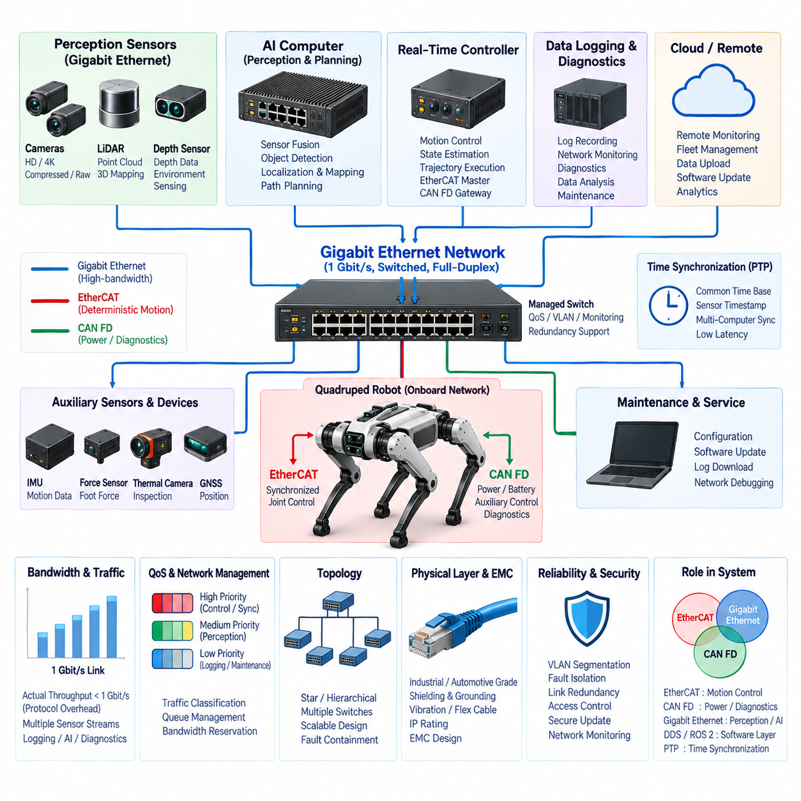
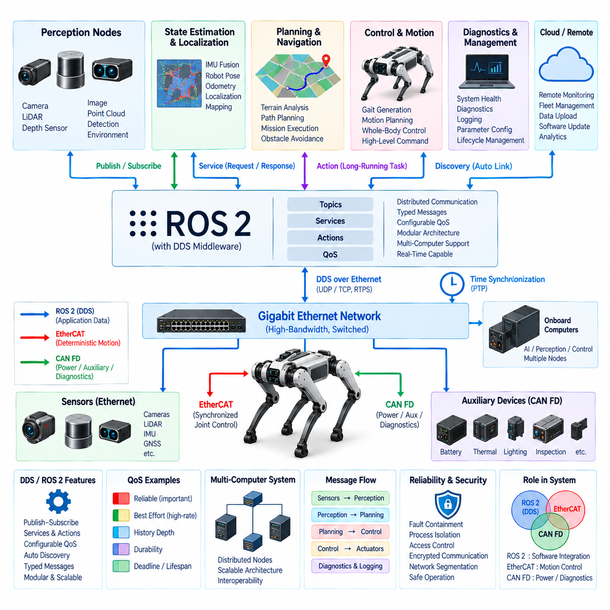
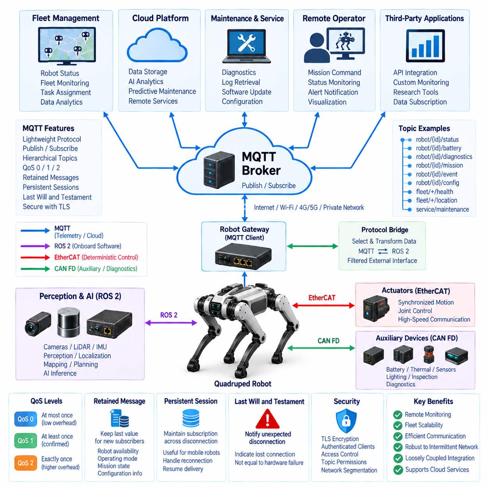
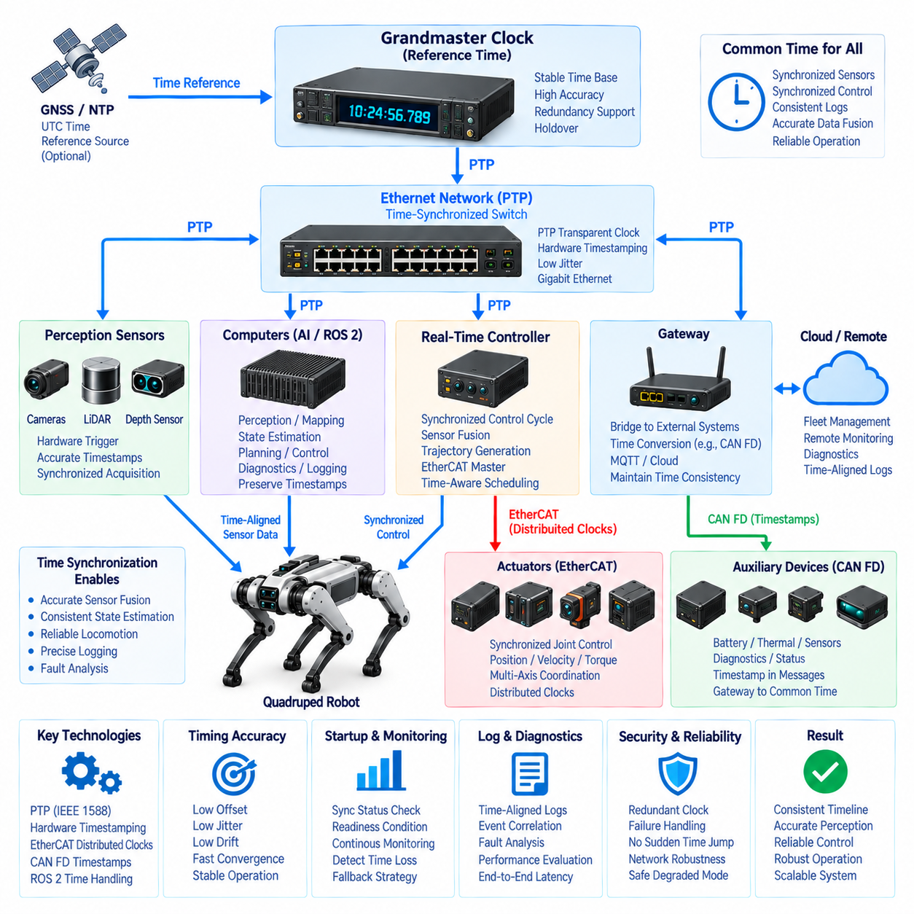

**Volume 20. Quadruped Electrical Architecture**

# Chapter 09. Communication Architecture

## 09.01. CAN FD

{width="7.268055555555556in" height="7.268055555555556in"}

CAN FD는 기존 CAN(Classical CAN)의 강건한 중재 메커니즘(arbitration mechanism), 오류 제한(fault confinement), 다중 마스터 동작(multi-master behavior)을 유지하면서 통신 성능을 확장하도록 설계된 통신 프로토콜(communication protocol)이다. 사족보행 로봇(quadruped robot)에서는 분산 실시간 제어기(distributed real-time controller), 관절 모듈(joint module), 전력 전자장치(power electronics), 배터리 시스템(battery system), 안전 관련 장치(safety-related device)를 연결하는 실용적인 네트워크를 제공한다. 특히 더 큰 페이로드(payload)와 빠른 데이터 구간(data phase)은 다수의 액추에이터가 높은 주기로 상태 정보를 교환해야 할 때 유용하다.

사족보행 로봇은 일반적으로 길고 동적으로 배치되는 와이어 하네스(wire harness)를 통해 연결된 여러 전기적 분산 서브시스템(electrically distributed subsystem)을 포함한다. 각 다리에는 여러 모터 드라이브(motor drive), 엔코더(encoder), 토크 센서(torque sensor), 온도 센서(temperature sensor), 로컬 제어기(local controller)가 포함될 수 있다. CAN FD를 사용하면 이러한 장치를 전용 점대점 배선(point-to-point wiring) 대신 하나의 공통 차동 버스(differential bus)로 연결할 수 있어, 중요 제어 및 진단 정보에 대한 결정론적 우선순위 기반 접근(deterministic priority-based access)을 유지하면서 하네스 복잡성을 줄일 수 있다.

CAN FD는 기존 CAN의 중재 개념(arbitration concept)을 그대로 유지한다. 노드는 송신 중에도 버스를 감시하며, 우성 비트(dominant bit)는 열성 비트(recessive bit)를 덮어쓴다. 여러 제어기가 동시에 송신을 시작하면 일반적으로 숫자 값이 더 낮은 식별자(identifier)를 가진 프레임이 높은 우선순위를 얻어 충돌로 데이터를 파괴하지 않고 전송을 계속한다. 이 메커니즘은 비상 상태, 액추에이터 오류 또는 높은 우선순위의 모션 제어 정보가 낮은 우선순위의 모니터링 및 유지보수 트래픽보다 먼저 처리되도록 구성할 수 있다는 점에서 사족보행 로봇에 유용하다.

CAN FD가 도입한 주요 확장 기능은 기존 CAN의 최대 8바이트 페이로드(payload)와 비교하여 하나의 프레임(frame)에 최대 64바이트의 데이터를 담을 수 있다는 것이다. 이를 통해 로봇 제어기는 여러 관절 상태, 진단 값 또는 명령 파라미터를 더 적은 수의 프레임으로 묶어 전송할 수 있다. 12개 이상의 관절이 위치(position), 속도(velocity), 토크(torque), 전류(current), 전압(voltage), 온도(temperature), 오류 플래그(fault flag), 동작 상태(operating state)를 지속적으로 보고하는 시스템에서는 프로토콜 오버헤드(protocol overhead)의 감소가 특히 중요하다.

CAN FD는 중재가 완료된 이후 전송 속도를 변경할 수도 있다. 중재 구간(arbitration phase)은 안정적인 공유 버스 동작에 적합한 공칭 비트 전송률(nominal bit rate)로 수행되며, 비트 전송률 전환(Bit Rate Switching)이 활성화되면 데이터 구간에서는 더 높은 비트 전송률을 사용할 수 있다. 따라서 강건한 중재 특성을 유지하면서 실질적인 통신 대역폭을 증가시킬 수 있다. 이는 작은 명령 메시지와 상대적으로 큰 텔레메트리(telemetry), 캘리브레이션(calibration), 진단 메시지가 동일한 물리 네트워크에서 공존하는 사족보행 제어 시스템에 유용하다.

물리 계층(physical layer)은 일반적으로 CAN_H와 CAN_L로 구분되는 2선식 차동 페어(two-wire differential pair)를 사용한다. 차동 신호 방식(differential signaling)은 모터 상(motor phase), 스위칭 전력 변환기(switching power converter), DC-DC 컨버터(DC-DC converter), 대전류 배터리 경로에서 발생하는 공통 모드 전기 노이즈(common-mode electrical noise)에 대해 높은 내성을 제공한다. 사족보행 로봇에서는 통신 하네스가 액추에이터 전력 케이블 가까이를 통과하는 경우가 많고 반복적인 다리 움직임으로 신호선과 전력선 사이의 이격 거리가 제한되므로 이러한 특성이 특히 중요하다.

버스 토폴로지(bus topology)는 임의의 배선으로 취급해서는 안 되며 신중하게 설계해야 한다. 일반적으로 짧은 스텁(stub)을 가진 선형 백본(linear backbone)이 선호되며, 버스의 물리적인 양 끝에 종단 저항(termination)을 배치한다. 지나치게 긴 스텁, 불필요한 분기, 커넥터 임피던스 불연속(connector discontinuity), 부적절한 임피던스 제어는 신호 반사(reflection)를 발생시킬 수 있으며 이러한 문제는 CAN FD 데이터 속도가 높아질수록 더욱 중요해진다. 따라서 하네스 토폴로지는 통신 속도, 케이블 특성, 커넥터 선정 및 물리적 패키징과 함께 설계되어야 한다.

사족보행 로봇은 기능적 및 물리적 경계에 따라 CAN FD 네트워크를 분할할 수 있다. 하나의 버스는 다리 또는 액추에이터 제어를 담당하고, 다른 버스는 배터리 관리, 전력 분배, 열 관리 및 보조 장치를 연결할 수 있다. 이러한 네트워크 분할(segmentation)은 중요하지 않은 트래픽이 제어 대역폭을 소비하는 것을 방지하고 통신 장애의 전파 범위를 제한한다. 중앙 실시간 제어기(central real-time controller) 또는 게이트웨이(gateway)는 CAN FD 세그먼트와 EtherCAT 또는 기가비트 이더넷(Gigabit Ethernet) 같은 고대역폭 네트워크 사이의 정보를 조정할 수 있다.

메시지 아키텍처(message architecture)는 단순히 메시지를 발생시키는 장치가 아니라 제어 중요도(control criticality)를 반영해야 한다. 관절 명령 및 상태 메시지는 짧은 주기, 제한된 지연시간(bounded latency), 신중하게 선정된 식별자를 필요로 하지만 온도, 수명 카운터(lifetime counter), 캘리브레이션 정보 및 유지보수 데이터는 상대적으로 느린 전송 주기를 허용할 수 있다. 기능 요구사항에 따라 우선순위와 전송 주기를 할당하면 최대 부하에서도 네트워크 동작을 예측 가능하게 유지하고 진단 또는 모니터링 트래픽이 시간 민감형 액추에이터 통신을 방해하는 것을 방지할 수 있다.

관절 모듈(joint module)은 여러 로컬 신호를 하나의 통신 인터페이스 뒤에서 통합할 수 있기 때문에 CAN FD 노드(node)로 구성하기에 적합하다. 관절 제어기는 목표 위치, 속도, 토크, 동작 모드 및 제한 정보를 수신하면서 측정된 운동 상태와 상태 건전성 정보(health information)를 반환할 수 있다. 높은 주파수의 로컬 전류 제어 또는 모터 제어 루프는 드라이브 내부에 유지하고, CAN FD는 상위 수준의 관절 명령과 상태를 전달할 수 있다. 이러한 계층형 구성(hierarchical arrangement)은 모든 내부 서보 변수를 공유 로봇 네트워크로 전송해야 하는 문제를 방지한다.

로컬 서보 제어(local servo control)와 네트워크 수준의 협조 제어(network-level coordination)를 구분하는 것은 매우 중요하다. 모터 드라이브는 수십 kHz 수준에서 전류 제어(current regulation)를 수행할 수 있으며, 위치 또는 토크 루프 역시 CAN FD 메시지 주기보다 훨씬 높은 주파수로 실행될 수 있다. 따라서 중앙 제어기가 모든 저수준 스위칭 결정을 버스에 의존해서는 안 된다. 대신 통신 네트워크는 설정값(setpoint), 동기화된 상태 정보, 모드 전환, 제한 값 및 상위 제어 명령을 전달하고, 가장 빠른 제어 루프는 결정론적 로컬 전자장치가 담당하는 것이 적절하다.

네트워크 이용률(network utilization)은 평균 트래픽이 아니라 최악 운용 조건(worst operational condition)을 기준으로 계산해야 한다. 프레임 오버헤드, 비트 스터핑(bit stuffing), 중재, 확인 응답(acknowledgement), 재전송, 오류 프레임(error frame), 공칭 구간과 데이터 구간의 서로 다른 비트 전송률이 모두 실효 통신 용량에 영향을 미친다. 특히 장애가 발생하면 신뢰성 높은 제어 통신이 가장 필요한 순간에 진단 트래픽이 증가할 수 있으므로 비정상 상태를 위한 충분한 대역폭을 확보해야 한다. 정상 보행 중 이미 포화 상태에 가까운 네트워크는 복구 또는 장애 처리 과정에서 불안정해질 수 있다.

CAN FD에는 전송 오류를 감지하고 오동작하는 노드를 격리하기 위한 메커니즘이 포함되어 있다. 프레임 검사(frame checking), 확인 응답 감시, 순환 중복 검사(Cyclic Redundancy Check, CRC), 오류 카운터(error counter), 오류 상태(error state)는 결함이 있는 제어기가 통신을 지속적으로 방해하는 것을 억제한다. 사족보행 로봇에서는 이러한 기능을 시스템 수준 상태 감시(system-level health monitoring)와 통합하여 반복적인 통신 오류가 발생할 경우 성능 저하 보행(degraded locomotion), 제어된 정지(controlled stopping), 액추에이터 격리 또는 정의된 안전 동작 상태로의 전환을 수행할 수 있어야 한다.

통신 타임아웃 감시(communication timeout supervision) 역시 중요하다. 문법적으로 정상적인 네트워크 통신이 모든 제어기의 정상 동작을 보장하는 것은 아니기 때문이다. 관절 제어기는 명령 프레임의 도착 시간을 감시할 수 있고 중앙 제어기는 주기적인 관절 상태 메시지를 감시할 수 있다. 누락, 지연, 고정 또는 물리적으로 불가능한 데이터는 명시적인 오류 로직(fault logic)을 통해 판단해야 한다. 안전 개념에서 요구하는 경우 시퀀스 카운터(sequence counter), 얼라이브 카운터(alive counter), 응용 계층 CRC(application-level CRC), 타임스탬프(timestamp), 타당성 검사(plausibility check)를 사용하여 추가적인 종단 간 보호(end-to-end protection)를 구현할 수 있다.

CAN FD는 효과적인 진단 경로(diagnostic path)도 제공한다. 별도의 서비스 배선을 추가하지 않고도 제어기의 소프트웨어 버전, 온도, 전원 상태, 오류 이력, 통신 통계, 액추에이터 상태 및 내부 진단 코드(diagnostic code)를 제공할 수 있다. 이는 사족보행 플랫폼의 전용 진단 및 OTA(Over-the-Air) 아키텍처를 보완하며, 유지보수 소프트웨어가 고장 가능성이 있는 관절이나 간헐적인 하네스 문제를 식별하고 통신 장애를 기계적 하중, 온도, 진동 및 운용 이력과 연계하여 분석할 수 있도록 한다.

시간 동기화(time synchronization)는 별도로 신중하게 고려해야 한다. CAN FD의 중재 방식은 우선순위 기반의 버스 접근을 제공하지만 그 자체만으로 전역적으로 정밀한 로봇 시간 기준(global robot time base)을 생성하지는 않는다. 제어 메시지에는 타임스탬프 또는 동기화 카운터(synchronized counter)를 포함할 수 있으며, 상위 수준의 동기화 메커니즘이 컴퓨팅 아키텍처 전체에 기준 시간을 분배할 수 있다. 이더넷 기반 인지 및 컴퓨팅 네트워크를 함께 사용하는 경우 CAN FD 액추에이터 데이터, IMU 측정값, 카메라, LiDAR 및 제어 출력 사이의 타임스탬프 관계를 명시적으로 유지해야 한다.

CAN FD와 실시간 제어기(real-time controller) 사이의 인터페이스는 중요한 아키텍처 경계를 형성한다. 제어기는 내장 CAN FD 컨트롤러, 외부 트랜시버(transceiver) 또는 절연 인터페이스(isolated interface)를 통해 하나 이상의 CAN FD 채널을 구성할 수 있다. 수신 큐(receive queue), 송신 스케줄링(transmit scheduling), 인터럽트 동작, DMA 지원, 드라이버 지연시간(driver latency), 운영체제 스케줄링(operating-system scheduling)은 모두 종단 간 타이밍(end-to-end timing)에 영향을 미친다. 따라서 네트워크 결정성(network determinism)은 버스 중재뿐 아니라 소프트웨어 아키텍처와 제어기 구현에도 의존한다.

전기적 강건성(electrical robustness)은 프로토콜 설계와 함께 고려해야 한다. 접지 전위차(ground offset), 과도 전기 교란(transient disturbance), 정전기 방전(Electrostatic Discharge, ESD), 커넥터의 간헐적 접촉, 차폐 전략(shielding strategy), 전자기 결합(electromagnetic coupling)은 메시지 스케줄링이 올바르더라도 통신 품질에 영향을 줄 수 있다. 트랜시버는 목표 전압 환경, 데이터 속도, 온도 범위 및 EMC 요구조건에 맞게 선정해야 하며, 보호 소자는 유해한 과도 신호를 억제하면서 과도한 정전용량을 추가하거나 고속 신호 무결성(signal integrity)을 저하시키지 않도록 설계해야 한다.

동적 다리 하네스(dynamic leg harness)는 일반적인 고정형 CAN 시스템보다 더 복잡한 문제를 발생시킨다. 지속적인 굽힘은 도체 형상을 변화시키고 차폐를 손상시키며 접촉 저항을 증가시키거나 간헐적인 단선(open circuit)을 유발할 수 있다. 따라서 CAN FD 배선은 사족보행 로봇의 플렉스 하네스(flex harness) 및 정비성(serviceability) 설계 전략과 연계되어야 한다. 적절한 최소 굽힘 반경, 스트레인 릴리프(strain relief), 적합한 트위스트 페어(twisted pair), 견고한 커넥터 체결 및 고응력 관절 영역을 피하는 배선 경로를 적용해야 한다.

시운전 및 검증(commissioning and verification)에서는 프로토콜 수준과 물리 계층을 모두 확인해야 한다. 엔지니어는 버스 부하, 식별자 분포, 메시지 주기, 중재 지연, 오류 카운터 및 타임아웃 동작을 검사하는 동시에 차동 파형을 측정하고 종단 저항, 신호 반사, 우성 및 열성 전압 수준, 대표 노드에서의 신호 품질을 확인해야 한다. 시험 조건에는 정지, 보행, 달리기, 고토크 기동, 배터리 상태 전환, 오류 주입(fault injection), 그리고 한계 통신 문제를 드러낼 수 있는 다양한 환경 조건이 포함되어야 한다.

궁극적으로 CAN FD는 사족보행 로봇의 모든 통신을 담당하는 범용 네트워크가 아니라 전체 통신 아키텍처(communication architecture)를 구성하는 하나의 계층으로 이해해야 한다. CAN FD는 강건한 분산 제어, 액추에이터 감시, 전력 전자장치 및 진단에 적합하며, EtherCAT은 정밀한 동기화가 필요한 모션 기능을 담당하고 기가비트 이더넷(Gigabit Ethernet)은 인지 및 대용량 컴퓨팅 데이터를 전달할 수 있다. 따라서 본 권의 아키텍처에서는 CAN FD를 EtherCAT, 이더넷(Ethernet), DDS/ROS 2, MQTT 및 시간 동기화(time synchronization)와 상호 보완적으로 사용되는 통신 기술로 배치한다.

## 09.02. EtherCAT

{width="7.268055555555556in" height="7.268055555555556in"}

EtherCAT은 제어기(controller), 드라이브(drive), 센서(sensor), 분산 입출력 장치(distributed I/O device) 사이에서 결정론적(deterministic)이고 낮은 지연시간(low-latency)의 통신을 제공하도록 설계된 고성능 산업용 이더넷(industrial Ethernet) 기술이다. 사족보행 로봇(quadruped robot)의 통신 아키텍처에서는 여러 관절 제어기가 예측 가능한 타이밍으로 명령과 피드백을 교환해야 하는 정밀 협조 모션 기능에 특히 적합하다. EtherCAT은 CAN FD와 기가비트 이더넷(Gigabit Ethernet)을 대체하기보다 상호 보완한다.

EtherCAT의 근본적인 장점은 프레임 처리 원리(frame processing principle)에 있다. 각 노드에서 완전한 이더넷 프레임을 수신하고 처리한 뒤 새로운 프레임을 다시 전송하는 대신, EtherCAT 슬레이브 장치(slave device)는 프레임이 장치를 통과하는 동안 자신에게 해당하는 데이터를 처리한다. 각 장치는 할당된 출력 데이터를 읽고 입력 데이터를 동일한 이동 프레임에 삽입할 수 있으므로 통신 오버헤드를 크게 줄이고 다수의 분산 노드 사이에서 효율적인 주기적 데이터 교환을 가능하게 한다.

사족보행 로봇은 여러 관절이 하나의 통합된 기계 시스템으로 동작해야 하므로 까다로운 분산 제어 문제(distributed-control problem)를 가진다. 엉덩이 관절(hip), 상부 다리(upper-leg), 무릎(knee) 및 기타 액추에이터 모듈(actuator module)은 로봇 몸체와 지면을 통해 지속적으로 상호작용한다. 관절 명령 사이의 작은 타이밍 차이도 균형(balance), 접촉력(contact force), 보행 안정성(gait stability), 동적 응답(dynamic response)에 영향을 줄 수 있다. EtherCAT은 이러한 동기화 다축 제어(synchronized multi-axis control)를 지원할 수 있는 통신 기반을 제공한다.

EtherCAT 마스터(master)는 일반적으로 로봇의 실시간 컴퓨팅 영역(real-time computing domain)에 위치한다. 마스터는 모션 제어 스케줄(motion-control schedule)에 따라 주기적인 통신 프레임을 생성하고 분산된 슬레이브 장치와 프로세스 데이터(process data)를 교환한다. 전기 아키텍처에 따라 슬레이브에는 서보 드라이브(servo drive), 관절 제어기(joint controller), 힘/토크 인터페이스(force/torque interface), 분산 입출력 모듈(distributed I/O module), 전용 다리 제어기(leg controller)가 포함될 수 있다. 이를 통해 중앙 모션 협조 제어와 분산 액추에이터 실행 사이에 명확한 계층 구조가 형성된다.

일반적으로 PDO(Process Data Object)로 표현되는 프로세스 데이터 객체는 마스터와 슬레이브 장치 사이의 주기적 실시간 정보를 전달한다. 사족보행 로봇에서는 목표 위치(target position), 속도(velocity), 토크(torque), 제어 모드(control mode), 상태 워드(status word), 측정 관절 위치, 실제 속도, 토크 피드백, 전류 및 선택된 진단 상태가 포함될 수 있다. 실시간 제어 루프에 필요한 정보만 매핑하면 효율적인 대역폭 활용과 예측 가능한 주기 실행을 유지하는 데 도움이 된다.

서비스 데이터 객체(Service Data Object)와 메일박스 기반 통신(mailbox-based communication)은 구성(configuration), 파라미터 접근(parameter access), 진단(diagnostics) 및 기타 비주기 기능(non-cyclic function)을 지원한다. 이러한 메커니즘을 통해 엔지니어링 소프트웨어 또는 제어기는 모든 설정 값을 주기적 프로세스 데이터로 처리하지 않고도 장치 파라미터에 접근할 수 있다. 시간에 민감한 모션 정보와 낮은 우선순위의 구성 및 진단 통신을 분리하는 것은 높은 동적 성능이 요구되는 보행 중에도 결정론적 동작을 유지하기 위해 중요하다.

분산 클록(Distributed Clocks)은 사족보행 로봇의 모션 제어에서 EtherCAT이 제공하는 가장 중요한 기능 중 하나이다. 각각의 슬레이브 장치는 로컬 클록(local clock)을 가지며, 이 클록들은 매우 작은 상대 시간 오차로 공통 기준 시간에 동기화될 수 있다. 이를 통해 여러 액추에이터 제어기가 거의 동일한 시점에 피드백을 샘플링하거나 명령을 적용할 수 있다. 이러한 동기화는 보행(walking), 트로팅(trotting), 달리기(running), 계단 이동(stair traversal), 외란 복구(disturbance recovery) 과정에서 여러 다리를 협조 제어할 때 중요하다.

시간 동기화(time synchronization)는 EtherCAT 네트워크 내부뿐 아니라 로봇 전체의 관점에서 고려해야 한다. 관절 상태는 IMU 측정값, 발 힘 정보(foot-force information), 카메라(camera), LiDAR 및 상위 수준 상태 추정(state estimation) 정보와 시간적으로 연계되어야 할 수 있다. EtherCAT 분산 클록은 모션 네트워크 내부에서 정밀한 타이밍을 제공하고, 컴퓨팅 아키텍처에서는 PTP 또는 다른 동기화 메커니즘을 사용하여 이더넷 기반 인지(perception) 및 AI 서브시스템과 시간 관계를 구성할 수 있다.

통신 주기(communication cycle)는 제어 아키텍처에 따라 선정해야 한다. 더 빠른 주기는 명령 생성과 액추에이터 피드백 사이의 지연을 줄일 수 있지만 컴퓨팅 및 네트워크 부하를 증가시킨다. 적절한 주기는 축(axis)의 수, 페이로드 크기(payload size), 드라이브 성능, 제어기 실행 시간 및 요구되는 모션 대역폭(motion bandwidth)에 따라 달라진다. 따라서 전체 제어 루프는 센서 샘플링에서 통신, 연산, 명령 전송 및 액추에이터 응답에 이르는 종단 간 관점에서 분석해야 한다.

EtherCAT을 사용한다고 해서 로컬 고주파 서보 루프(local high-frequency servo loop)가 불필요해지는 것은 아니다. 모터 전류 제어(motor current regulation)와 기타 빠른 내부 루프(inner-loop) 기능은 일반적으로 서보 드라이브 또는 관절 제어기 내부에서 직접 수행된다. EtherCAT은 이러한 로컬 제어기와 중앙 실시간 제어기 사이에서 동기화된 설정값(setpoint)과 피드백을 전달한다. 이러한 계층형 접근은 개별 PWM 또는 정류(commutation) 동작을 통신 버스를 통해 전송하지 않고도 네트워크가 전신 모션(whole-body motion)을 협조 제어할 수 있도록 한다.

토폴로지 유연성(topology flexibility)도 EtherCAT의 유용한 특성이다. EtherCAT은 적절한 장치와 인터페이스를 사용하여 라인(line), 트리(tree), 스타(star) 및 이들의 조합을 지원할 수 있다. 따라서 사족보행 아키텍처에서는 몸통 네트워크(trunk network)에서 네 개의 다리 어셈블리(leg assembly)로 분기하는 방식과 같이 로봇의 물리적 구조에 맞추어 통신망을 구성할 수 있다. 다만 커넥터, 케이블 라우팅, 이중화 전략(redundancy strategy), 정비성(serviceability), 장애 전파(failure propagation)는 여전히 중요한 시스템 수준 고려사항이므로 토폴로지는 의도적으로 설계해야 한다.

물리적 구현(physical implementation)은 일반적으로 산업용 이더넷 케이블(industrial Ethernet cable)과 호환되는 PHY 인터페이스를 사용한다. 그러나 사족보행 로봇에서는 다리 움직임으로 인해 지속적인 굽힘, 비틀림(torsion), 진동 및 커넥터 하중이 발생하므로 기존의 고정형 산업 장비에 사용되는 케이블 설계 가정을 그대로 적용하기 어렵다. 동적 케이블 구간에는 플렉스 대응 구조(flex-rated construction), 적절한 굽힘 반경, 스트레인 릴리프(strain relief), 견고한 커넥터 체결 및 반복적인 기계적 응력을 최소화하면서 고속 신호 무결성을 유지하는 배선 설계가 필요하다.

전자기 적합성(Electromagnetic Compatibility, EMC)은 EtherCAT 통신이 고출력 액추에이터 전자장치 가까이에서 동작하기 때문에 특히 중요하다. 모터 상 케이블(motor phase cable), 인버터(inverter), 스위칭 컨버터(switching converter), 배터리 도체 및 회생 제동 전류는 상당한 전자기 교란(electromagnetic disturbance)을 발생시킬 수 있다. 따라서 케이블 차폐(shielding), 접지(grounding), 커넥터 종단(connector termination), 물리적 이격, 귀환 전류 경로(return-current path), 인클로저 설계(enclosure design)는 독립적인 패키징 요소가 아니라 통신 시스템의 일부로 함께 설계해야 한다.

EtherCAT 마스터 구현 역시 결정론적이어야 한다. 빠른 물리 네트워크만으로는 제어기 내부에서 발생하는 예측 불가능한 소프트웨어 스케줄링을 보상할 수 없다. 실시간 운영체제(real-time operating system)의 동작, 태스크 우선순위(task priority), 인터럽트 처리(interrupt handling), 네트워크 드라이버 아키텍처, CPU 어피니티(CPU affinity), 메모리 동작 및 모션 제어 실행 시간은 모두 통신 주기의 지터(jitter)에 영향을 줄 수 있다. 따라서 통신 성능은 단순한 네트워크의 공칭 속도가 아니라 종단 간 실시간 제어 경로(end-to-end real-time control path)로 평가해야 한다.

워킹 카운터(Working Counter) 메커니즘은 예상된 EtherCAT 동작이 정상적으로 처리되었는지 감시하는 중요한 방법을 제공한다. 마스터는 예상된 통신 결과와 실제 통신 동작 사이의 불일치를 감지하고 이를 네트워크 상태 감시(network health monitoring)의 일부로 사용할 수 있다. 사족보행 로봇에서는 통신 감시 기능을 상위 수준의 오류 관리(fault management)와 연결하여 액추에이터 노드의 누락 또는 오동작이 제어되지 않은 기계적 거동으로 이어지기 전에 감지할 수 있어야 한다.

EtherCAT 장치 상태 관리(device state management)는 초기화부터 실제 운용까지 제어된 상태 전환을 제공한다. 이를 통해 시스템은 완전한 주기적 동작을 활성화하기 전에 통신과 장치 구성을 검증할 수 있다. 사족보행 로봇의 기동 시퀀스(startup sequencing)는 전원 공급 상태, 제어기 초기화, 드라이브 구성, 센서 준비 상태, 네트워크 동기화 및 액추에이터 활성화 조건을 협조할 수 있다. 필요한 통신 참여 장치가 유효하고 명시적으로 검증된 운용 상태에 도달한 이후에만 모션을 시작해야 한다.

장애 처리(failure handling)는 특정 노드 또는 네트워크 세그먼트의 손실이 가져오는 기계적 영향을 고려해야 한다. 하나의 관절에 영향을 미치는 통신 장애도 해당 다리 전체의 하중 분포를 즉시 변화시키고 로봇을 불안정하게 만들 수 있다. 따라서 제어기는 통신 타임아웃, 비정상 상태, 동기화 손실 또는 드라이브 고장에 대해 정의된 대응 방식을 가져야 한다. 운용 조건에 따라 토크 제한(torque limitation), 성능 저하 보행(gait degradation), 제어된 자세 전환(controlled posture transition), 안전 정지(safe stopping) 등의 대응이 필요할 수 있다.

안전 관련 통신(safety-related communication)은 일반적인 모션 성능과 아키텍처적으로 구분하여 고려해야 한다. EtherCAT은 안전 메커니즘 및 안전 지향 확장 기능과 함께 사용할 수 있지만, 안전 개념(safety concept)은 어떤 기능에 독립 감시, 안전 상태 전환, 비상 정지 또는 이중화 채널이 필요한지를 정의해야 한다. 통신이 정상적으로 유지된다는 사실만으로 액추에이터의 안전한 동작이 보장된다고 판단해서는 안 된다. 안전 감시는 명령 유효성, 액추에이터 상태, 전기적 격리 및 기계적 결과를 함께 고려해야 한다.

진단(diagnostics)은 동적으로 움직이는 로봇에서 간헐적인 통신 장애를 재현하기 어려울 수 있기 때문에 필수적이다. 엔지니어는 링크 상태(link state), 장치 상태, 통신 주기 타이밍, 동기화 오류, 워킹 카운터 동작, 프레임 손실, 제어기 부하 및 관련 액추에이터 오류를 기록해야 한다. 이러한 기록을 보행 단계(gait phase), 관절 토크, 진동, 온도 및 배터리 상태와 연계하면 문제가 소프트웨어 타이밍, 전기적 노이즈, 커넥터 또는 동적 하네스 열화 중 어디에서 발생하는지 분석할 수 있다.

시운전 및 검증(commissioning and verification)에서는 통신 타이밍과 물리적 구현을 모두 확인해야 한다. 엔지니어는 주기적 지연시간(cyclic latency), 지터, 동기화 정확도, 장치 상태 전환, 장애 복구 및 최대 네트워크 부하를 평가하는 동시에 케이블 무결성과 신호 품질을 검사할 수 있다. 검증에는 정적 기립, 반복 보행, 빠른 보행 패턴 변경, 고토크 기동, 외부 외란, 커넥터 움직임, 전원 상태 전환 및 오류 주입(fault injection)을 포함하여 정적인 실험실 시험에서는 발견되지 않는 취약점을 확인해야 한다.

EtherCAT과 CAN FD는 동일한 사족보행 로봇 내부에서 상호 보완적인 역할을 수행할 수 있다. EtherCAT은 정밀하게 동기화된 다축 모션 제어에 특히 적합하며, CAN FD는 전력 관리, 보조 제어기, 진단 및 기타 분산 기능에 강건한 통신을 제공할 수 있다. 기가비트 이더넷(Gigabit Ethernet)은 카메라, LiDAR, AI 컴퓨팅 및 대용량 데이터를 독립적으로 처리할 수 있다. 게이트웨이(gateway)와 실시간 컴퓨팅 아키텍처는 모든 서브시스템을 하나의 네트워크에 강제로 통합하지 않으면서 이러한 통신 영역을 연결한다.

이러한 계층형 통신 전략(layered communication strategy)은 CAN FD, EtherCAT, 기가비트 이더넷(Gigabit Ethernet), DDS/ROS 2, MQTT 및 시간 동기화(time synchronization)를 서로 독립적이면서 협력하는 기술로 구성하는 사족보행 로봇 전기 아키텍처의 전체 구조를 따른다. EtherCAT은 결정론적 모션 네트워크(deterministic motion network)의 역할을 담당하여 실시간 컴퓨팅과 분산 액추에이터 제어를 연결하고, 상위 수준 네트워크는 인지(perception), 피지컬 AI(Physical AI), 플릿 통신(fleet communication), 진단 및 원격 운용(remote operation)을 지원한다.

## 09.03. Gigabit Ethernet

{width="7.268055555555556in" height="7.268055555555556in"}

기가비트 이더넷(Gigabit Ethernet)은 사족보행 로봇(quadruped robot)에 고대역폭 통신 백본(high-bandwidth communication backbone)을 제공하며, 액추에이터 중심 필드버스(actuator-oriented field bus)에서 일반적으로 요구되는 수준보다 훨씬 높은 데이터 전송률을 지원한다. 통신 아키텍처에서는 주로 인지 센서(perception sensor), AI 컴퓨터(AI computer), 상위 제어기(high-level controller), 데이터 로거(data logger), 게이트웨이(gateway)에 적합하다. 결정론적 모션 제어를 위한 EtherCAT과 강건한 분산 장치 통신을 위한 CAN FD를 대체하는 것이 아니라 상호 보완하는 역할을 한다.

현대의 사족보행 로봇은 카메라(camera), LiDAR, 깊이 센서(depth sensor), 내비게이션 모듈(navigation module), 온보드 컴퓨팅 시스템(onboard computing system)으로부터 대량의 정보를 생성한다. 하나의 인지 파이프라인(perception pipeline)에서도 이미지, 포인트 클라우드(point cloud), 지도(map), 위치추정 결과(localization result), 학습된 특징 표현(learned feature representation)이 지속적으로 전송될 수 있다. 기가비트 이더넷은 이러한 데이터 흐름을 처리할 수 있는 충분한 대역폭을 제공하면서 다양한 장치가 표준화된 네트워크 인프라를 통해 통신할 수 있도록 한다.

기가비트 이더넷의 공칭 1 Gbit/s 링크 용량(nominal link capacity)은 로봇 센서 데이터 집계(sensor aggregation)를 위한 유용한 기반을 제공하지만, 실제 응용 계층 처리량(application throughput)은 이더넷, IP, 전송 프로토콜(transport protocol), 응용 메시지(application message)의 오버헤드 때문에 이보다 낮다. 따라서 네트워크 설계는 단순한 공칭 링크 속도가 아니라 측정된 트래픽 또는 최악 조건 트래픽(worst-case traffic)을 기준으로 해야 한다. 여러 카메라 스트림, LiDAR 패킷, 로깅 트래픽 및 AI 출력이 동시에 발생하면 순간적으로 상당한 대역폭이 요구될 수 있다.

공유형 CAN 버스(shared CAN bus)와 달리 스위치드 이더넷(switched Ethernet)은 일반적으로 엔드포인트(endpoint)와 이더넷 스위치(Ethernet switch) 사이에 전용 전이중 링크(full-duplex link)를 제공한다. 장치는 기존 버스 중재(bus arbitration) 없이 동시에 송신과 수신을 수행할 수 있다. 이러한 구조는 전체 대역폭을 증가시키고 여러 센서와 컴퓨터의 트래픽이 효율적으로 공존하도록 한다. 사족보행 로봇에서는 중앙 또는 분산 이더넷 스위치를 통해 인지 컴퓨터, 실시간 제어기, 센서 모듈, 진단 인터페이스 및 외부 통신 게이트웨이를 연결할 수 있다.

이더넷 스위칭(Ethernet switching)은 중요한 아키텍처 설계 요소를 만든다. 여러 입력 포트의 트래픽이 하나의 출력 포트에 집중되면 개별 링크가 1 Gbit/s로 동작하더라도 큐잉(queueing)과 혼잡(congestion)이 발생할 수 있다. 따라서 엔지니어는 단순히 각 장치의 링크 속도를 계산하는 것이 아니라 스위치를 통과하는 실제 트래픽 경로를 분석해야 한다. 대용량 카메라 또는 LiDAR 스트림이 제어, 동기화, 진단 또는 안전 관련 상위 감시 트래픽과 예상치 못하게 경쟁하지 않도록 설계해야 한다.

서비스 품질(Quality of Service, QoS)은 시스템 요구사항에 따라 이더넷 트래픽을 분류하고 우선순위를 부여할 수 있다. 시간 민감형 제어 또는 동기화 패킷에는 대용량 로깅, 파일 전송 또는 유지보수 데이터보다 높은 우선순위를 부여할 수 있다. QoS가 일반적인 이더넷을 자동으로 결정론적 네트워크로 만드는 것은 아니지만, 신중한 트래픽 분류, 스위치 설정, 큐 관리(queue management), 대역폭 예약(bandwidth reservation)을 적용하면 높은 부하 조건에서 지연시간 특성을 크게 개선할 수 있다.

사족보행 로봇의 이더넷 네트워크 물리 토폴로지(physical topology)는 일반적으로 스타(star) 또는 계층형 스위치 구조(hierarchical switched structure)를 기반으로 한다. 몸통(trunk)에 위치한 중앙 스위치가 주요 컴퓨팅 및 인지 장치를 연결하고, 필요한 경우 추가적인 로컬 스위치가 분산 센서 그룹을 담당할 수 있다. 토폴로지는 단순히 네트워크 구성요소의 수를 최소화하기보다 대역폭, 케이블 질량, 커넥터 수, 장애 격리(fault containment), 정비성(serviceability), 패키징 제약조건을 종합적으로 고려하여 설계해야 한다.

인지 센서는 기가비트 이더넷의 대표적인 엔드포인트이다. 고해상도 카메라는 압축 또는 비압축 이미지 스트림을 전송할 수 있으며, 3D LiDAR 장치는 연속적인 포인트 클라우드 패킷과 관련 메타데이터(metadata)를 생성한다. 검사 페이로드(inspection payload)는 추가적인 열화상, 음향, 영상 또는 특수 센싱 데이터를 생성할 수 있다. 이더넷은 각 장치가 독립적인 데이터 스트림을 유지하면서 인지 컴퓨터가 이를 수신하고 결합하여 위치추정, 매핑(mapping), 장애물 감지 및 환경 이해(environment understanding)를 수행하도록 지원한다.

온보드 AI 컴퓨터(onboard AI computer) 역시 다른 컴퓨팅 영역과 정보를 교환하기 위해 이더넷을 활용한다. 인지 결과, 객체 목록(object list), 지형 표현(terrain representation), 로컬 지도(local map), 궤적(trajectory), 로봇 상태 및 임무 명령(mission command)을 AI 처리 영역과 실시간 제어 영역 사이에서 전달할 수 있으며, 모든 내부 텐서(tensor)나 모델의 중간 표현을 네트워크에 노출할 필요는 없다. 인터페이스 설계에서는 각 서브시스템 경계에 적합한 간결하고 안정적인 데이터 계약(data contract)을 정의해야 한다.

DDS와 ROS 2는 이더넷 인프라 상위에서 동작하면서 로봇 애플리케이션 사이의 소프트웨어 수준 데이터 분배(software-level data distribution)를 제공할 수 있다. 기가비트 이더넷은 기본 패킷 전송(packet transport)을 담당하고, DDS는 탐색(discovery), 발행(publication), 구독(subscription), 신뢰성(reliability), 지속성(durability) 등의 통신 동작을 정의한다. 이더넷 자체는 로봇 메시지의 의미를 정의하지 않기 때문에 이러한 계층 구분이 중요하며, 네트워크 엔지니어링과 미들웨어 아키텍처(middleware architecture)는 서로 연관되어 있지만 구별되는 계층으로 설계해야 한다.

UDP는 상대적으로 낮은 전송 오버헤드를 가지며 손실된 패킷의 재전송을 기다리지 않기 때문에 고주기 센서 또는 실시간 데이터에 적합한 경우가 많다. TCP는 최소 지연시간보다 신뢰성 있는 순차 전달(reliable ordered delivery)이 중요한 구성, 파일 전송, 소프트웨어 관리 등의 작업에 더 적합할 수 있다. 모든 인터페이스에 하나의 전송 방식을 적용하기보다는 각각의 데이터 흐름에서 요구하는 동작 특성에 따라 적절한 프로토콜을 선택해야 한다.

패킷 손실(packet loss)은 애플리케이션 종류에 따라 다르게 해석해야 한다. 다음 측정값이 즉시 도착하는 경우 간헐적인 카메라 또는 LiDAR 패킷 손실은 처리 가능할 수 있지만, 설정 명령이나 소프트웨어 패키지 일부가 손실되면 신뢰성 있는 재전송이 필요할 수 있다. 로봇 통신 설계에서는 각 인터페이스에 허용되는 손실, 지연시간, 지터(jitter), 순서 보장(ordering), 복구 동작을 명시적으로 정의하여 응용 소프트웨어가 정의되지 않은 네트워크 특성에 의존하지 않도록 해야 한다.

시간 동기화(time synchronization)는 기가비트 이더넷이 여러 센서와 컴퓨터를 연결할 때 핵심적인 기능이다. 카메라 이미지, LiDAR 스캔, IMU 측정값, 액추에이터 상태 및 상태 추정 결과는 공통 시간 기준(common time reference)을 기준으로 상호 연계되어야 하는 경우가 많다. 정밀 시간 프로토콜(Precision Time Protocol, PTP)은 호환되는 이더넷 장치에 시간을 분배할 수 있으며, 하드웨어 타임스탬핑(hardware timestamping)을 사용하면 소프트웨어 스택과 운영체제 스케줄링으로 발생하는 시간 불확실성을 줄일 수 있다.

정확한 타임스탬프(timestamp)는 동적 보행 중 특히 중요하다. 사족보행 로봇은 센서가 서로 다른 위치와 주기로 데이터를 획득하는 동안 빠르게 회전하고 이동하며 몸체 운동을 경험할 수 있다. 작은 시간 오차도 여러 센서 측정값을 결합할 때 공간 오차(spatial error)로 나타날 수 있다. 따라서 통신 아키텍처에서는 패킷이 AI 컴퓨터에 도착했을 때 새로운 시간을 단순히 부여하기보다 센서 데이터 획득 시점부터 전송 및 처리 단계까지 타임스탬프 출처(timestamp provenance)를 보존해야 한다.

기가비트 이더넷은 개발 및 유지보수 과정에서 로봇과 서비스 장비 사이의 통신 경로도 제공할 수 있다. 엔지니어는 표준 이더넷 인터페이스를 통해 로그를 가져오고 네트워크 상태를 확인하며 소프트웨어를 설정하고 진단 정보에 접근하거나 기록된 데이터셋을 전송할 수 있다. 유지보수 트래픽과 운용상 중요한 통신을 논리적 또는 물리적으로 분리하면 대용량 파일 전송이나 디버깅 작업이 로봇의 정상 동작에 영향을 주는 것을 방지하는 데 도움이 된다.

이더넷이 상용 컴퓨팅에서 광범위하게 사용되더라도 물리 계층 엔지니어링(physical-layer engineering)은 여전히 중요하다. 사족보행 로봇의 케이블과 커넥터는 진동, 반복적인 기계 운동, 충격, 오염 및 전자기 간섭(Electromagnetic Interference, EMI)에 노출된다. 따라서 운용 환경에 따라 산업용 또는 자동차 등급 부품이 필요할 수 있다. 커넥터 체결 유지력, 차폐, 스트레인 릴리프(strain relief), 케이블 유연성, 접지 및 방진·방수 성능(ingress protection)은 실제 로봇의 기계적·환경적 조건에 맞추어 선정해야 한다.

기가비트 이더넷 케이블이 모터 드라이브, 모터 상 도체, DC-DC 컨버터, 배터리 배선 및 스위칭 전력 전자장치 가까이를 통과하면 전자기 적합성(Electromagnetic Compatibility, EMC)이 중요한 문제가 될 수 있다. 적절한 트위스트 페어(twisted pair), 차폐 종단(shield termination), 섀시 본딩(chassis bonding), 커넥터 설계, 케이블 이격 및 라우팅은 신호 무결성(signal integrity)을 유지하는 데 도움이 된다. 전기적 노이즈는 정적인 실험실 환경과 고출력 보행 환경에서 크게 달라질 수 있으므로 EMC 설계는 높은 액추에이터 부하 조건에서도 검증해야 한다.

네트워크 장애 격리(network fault containment)는 링크 수준과 시스템 수준에서 모두 고려해야 한다. 하나의 센서 케이블이 분리되었다고 해서 관련 없는 통신까지 불필요하게 중단되어서는 안 되며, 오동작 장치가 과도한 트래픽을 생성하여 로봇 전체 네트워크를 혼잡하게 만드는 것도 방지해야 한다. 관리형 스위치(managed switch)는 플랫폼의 복잡성과 신뢰성 요구사항에 따라 포트 통계(port statistics), VLAN 분할, 트래픽 모니터링 및 장애 격리와 같은 유용한 기능을 제공할 수 있다.

가상 근거리 통신망(Virtual LAN, VLAN)은 공유된 물리적 스위칭 인프라를 사용하면서 트래픽 클래스를 논리적으로 분리할 수 있다. 인지, 제어, 진단, 유지보수 및 외부 통신을 필요에 따라 정의된 네트워크 영역에 배치할 수 있다. VLAN 분리 자체가 안전 메커니즘(safety mechanism)은 아니지만 네트워크 구성을 명확하게 하고 의도하지 않은 트래픽 전파를 줄이며 서로 다른 성능 및 운용 요구조건을 가진 서브시스템 사이의 인터페이스 경계를 보다 명확하게 정의할 수 있다.

통신 가용성(communication availability)의 향상이 추가적인 스위치, 인터페이스, 케이블, 전력 소비 및 소프트웨어 복잡성을 정당화하는 경우 이중화(redundancy)를 적용할 수 있다. 중요 컴퓨팅 노드는 복수의 이더넷 인터페이스 또는 대체 통신 경로를 사용할 수 있지만 이중화는 전체 아키텍처 관점에서 분석해야 한다. 두 개의 네트워크 링크가 동일한 스위치, 커넥터, 전원 레일 또는 취약한 하네스 구간에 의존한다면 공통 고장점(common point of failure)이 남아 있으므로 이중화 효과는 제한적이다.

사이버보안(cybersecurity)은 이더넷이 범용 컴퓨터, 유지보수 인터페이스, 무선 게이트웨이 및 잠재적인 외부 네트워크를 연결하기 때문에 더욱 중요해진다. 네트워크 분할, 인증된 서비스(authenticated service), 제한된 포트, 안전한 업데이트 메커니즘(secure update mechanism), 접근 제어(access control), 소프트웨어 강화(software hardening)를 적용하여 외부 인터페이스가 모션 또는 안전 중요 시스템에 제한 없이 접근하는 것을 방지해야 한다. 통신 아키텍처에서는 온보드 제어, 서비스, 플릿(fleet), 클라우드(cloud), 외부 장치 사이의 신뢰 경계(trust boundary)를 명확하게 정의해야 한다.

성능 검증(performance validation)에서는 실제 처리량(throughput), 종단 간 지연시간(end-to-end latency), 지터, 패킷 손실, 큐 점유율(queue occupancy), 스위치 동작, CPU 및 네트워크 인터페이스 부하를 실제 로봇 운용 조건에서 측정해야 한다. 개별 장치를 독립적으로 평가하는 것에 그치지 않고 여러 카메라 스트림, LiDAR 트래픽, AI 처리, 로깅, 진단 및 외부 통신을 동시에 실행하여 시험해야 한다. 스트레스 시험(stress testing)은 개별 인터페이스 시험에서는 발견하기 어려운 혼잡 또는 스케줄링 상호작용을 확인하는 데 유용하다.

따라서 기가비트 이더넷은 사족보행 로봇의 통신 아키텍처에서 고대역폭 데이터 네트워크(high-bandwidth data network)의 역할을 담당한다. EtherCAT은 정밀하게 동기화된 결정론적 액추에이터 통신을 제공하고, CAN FD는 전력, 보조 제어 및 진단 기능을 지원하며, 기가비트 이더넷은 인지 및 컴퓨팅 트래픽을 전달한다. DDS/ROS 2와 기타 미들웨어는 이러한 물리 네트워크 상위에서 동작하고, 전용 시간 동기화 메커니즘은 로봇 시스템 전체에 일관된 시간 관계를 구성한다.

## 09.04. DDS/ROS2

{width="7.268055555555556in" height="7.268055555555556in"}

DDS와 ROS 2는 사족보행 로봇(quadruped robot)의 컴퓨팅 아키텍처 전반에 분산된 애플리케이션을 연결하는 소프트웨어 통신 계층(software communication layer)을 구성한다. CAN FD와 EtherCAT이 주로 임베디드 장치(embedded device) 및 결정론적 액추에이터 통신(deterministic actuator communication)을 지원하고 기가비트 이더넷(Gigabit Ethernet)이 고대역폭 전송을 제공한다면, DDS와 ROS 2는 소프트웨어 컴포넌트가 서로를 탐색하고 형식화된 데이터(typed data)를 교환하며 인지, 제어, 계획, 진단 및 시스템 관리를 협조하도록 구성한다.

ROS 2는 소프트웨어 기능을 일반적으로 노드(node)로 분리하는 분산 통신 모델(distributed communication model)을 사용한다. 사족보행 로봇에는 카메라, LiDAR 처리, IMU 처리, 상태 추정(state estimation), 위치추정(localization), 지형 분석(terrain analysis), 보행 생성(gait generation), 모션 계획(motion planning), 진단 및 임무 실행(mission execution)을 위한 노드가 포함될 수 있다. 이러한 노드는 하나의 컴퓨터 또는 여러 컴퓨터에 분산되어 실행되면서 표준화된 ROS 2 인터페이스를 통해 통신할 수 있다.

DDS(Data Distribution Service)는 ROS 2 하위에서 일반적으로 사용되는 데이터 중심 발행-구독(data-centric publish-subscribe) 기반을 제공한다. 모든 애플리케이션이 명시적인 점대점 연결(point-to-point connection)을 설정하는 대신, 발행자(publisher)는 정의된 토픽(topic)에 연결된 데이터를 제공하고 구독자(subscriber)는 필요한 토픽을 수신한다. 이러한 방식은 소프트웨어 사이의 직접적인 의존성을 줄이고 로봇 기능을 이기종 컴퓨팅 자원(heterogeneous computing resource)에 분산하기 쉽게 한다.

발행-구독 모델(publish-subscribe model)은 인지 및 로봇 상태 정보에 특히 적합하다. 상태 추정 노드는 로봇의 자세와 속도를 발행할 수 있으며, 보행, 내비게이션, 시각화 및 로깅 노드는 동일한 정보를 각각 독립적으로 구독할 수 있다. 마찬가지로 인지 파이프라인은 감지된 장애물이나 지형 특성을 발행하면서 그 결과를 사용하는 모든 애플리케이션의 세부 구조를 알 필요가 없다.

ROS 2 토픽(topic)은 지속적으로 생성되는 정보를 위한 비동기 데이터 스트림(asynchronous data stream)을 제공한다. 사족보행 로봇의 대표적인 토픽에는 관절 상태, IMU 측정값, 포인트 클라우드(point cloud), 카메라 이미지, 오도메트리(odometry), 위치추정 결과, 지형 지도(terrain map), 액추에이터 온도, 배터리 상태 및 진단 정보가 포함될 수 있다. 메시지 정의(message definition)는 형식화된 인터페이스를 구성하여 데이터 생산자와 소비자가 전송 정보에 대해 일관된 표현을 공유하도록 한다.

서비스(service)는 노드가 특정 작업을 요청하고 이에 대응하는 응답을 기다리는 요청-응답 상호작용(request-response interaction)을 지원한다. 지속적인 스트리밍이 필요하지 않은 구성 정보 조회, 서브시스템 초기화, 진단 결과 요청 또는 파라미터 변경 등에 유용하다. 서비스의 상호작용 모델은 지속적인 실시간 데이터 교환과 다르기 때문에 일반적으로 주기적인 제어 통신(cyclic control communication)을 대체하는 용도로 사용해서는 안 된다.

ROS 2 액션(action)은 피드백, 진행 상태 감시 및 취소 기능이 필요한 장시간 실행 작업(long-running operation)을 지원한다. 사족보행 로봇의 임무 관리자(mission manager)는 목표 위치까지의 내비게이션, 자율 도킹(autonomous docking), 검사 작업 수행 또는 제어된 자세 전환(controlled posture transition)에 액션을 사용할 수 있다. 액션 인터페이스를 통해 요청자는 중간 피드백을 받고 최종적으로 명령된 작업이 성공, 실패 또는 취소되었는지를 판단할 수 있다.

서비스 품질(Quality of Service, QoS)은 ROS 2를 통해 제공되는 DDS의 가장 중요한 기능 중 하나이다. 서로 다른 로봇 데이터 흐름은 서로 다른 통신 요구조건을 가지므로 신뢰성(reliability), 이력 깊이(history depth), 지속성(durability), 데드라인(deadline), 수명(lifespan) 및 기타 정책을 각 인터페이스 특성에 따라 설정할 수 있다. QoS를 의도적으로 선정하면 모든 데이터 스트림을 동일한 타이밍, 신뢰성 및 저장 요구조건을 가진 것처럼 처리하는 문제를 방지할 수 있다.

손실되어서는 안 되는 정보에는 신뢰성 있는 전달(reliable delivery)이 적합할 수 있으며, 오래된 데이터의 가치가 빠르게 감소하는 고주기 센서 스트림에는 최선형 전달(best-effort communication)이 더 적합할 수 있다. 예를 들어 오래된 인지 데이터를 재전송하는 것보다 최신 측정값을 즉시 수신하는 것이 더 유용한 경우가 있다. 따라서 QoS는 단순한 소프트웨어 편의성이 아니라 각 메시지의 물리적 의미와 타이밍 요구조건을 반영하여 선정해야 한다.

DDS 탐색(discovery)을 통해 분산된 참여자(participant)는 발행자, 구독자 및 호환 가능한 통신 엔드포인트(endpoint)를 동적으로 식별할 수 있다. 이를 통해 수동으로 구성된 점대점 연결의 필요성을 줄이고 모듈화된 로봇 소프트웨어를 지원할 수 있다. 그러나 탐색 과정 자체에서도 네트워크 트래픽과 기동 동작이 발생하므로 사족보행 로봇에 여러 컴퓨터와 다수의 노드 또는 제한된 통신 링크가 포함되는 경우 이러한 특성을 이해하고 설계해야 한다.

일반적으로 RMW라고 하는 ROS 미들웨어 인터페이스(ROS Middleware interface)는 ROS 2 API와 하위 미들웨어 구현(underlying middleware implementation)을 분리한다. 이러한 추상화를 통해 ROS 2 시스템은 애플리케이션 수준 노드를 다시 작성하지 않고도 지원되는 DDS 또는 기타 호환 미들웨어 구현을 사용할 수 있다. 양산형 사족보행 로봇에서는 미들웨어를 선정할 때 지연시간, 자원 소비, 탐색 동작, 상호운용성(interoperability), 개발 도구, 플랫폼 지원 및 운용 안정성을 고려해야 한다.

DDS/ROS 2 통신은 일반적으로 로봇의 이더넷 인프라에서 동작한다. 기가비트 이더넷은 대용량 인지 및 애플리케이션 트래픽을 전송하고, DDS는 분산 소프트웨어가 해당 정보를 어떻게 교환하는지를 정의한다. 이러한 구분은 매우 중요하다. 이더넷은 네트워크 연결과 패킷 전송을 제공하는 반면, DDS/ROS 2는 소프트웨어 수준의 통신 의미(communication semantics), 인터페이스, 탐색 및 설정 가능한 데이터 전달 동작을 제공한다.

사족보행 로봇에서는 모든 저수준 액추에이터 인터페이스를 ROS 2 메시징으로 대체해서는 안 된다. 빠른 모터 전류 루프(motor-current loop), 정류(commutation) 및 엄격하게 제한된 타이밍을 요구하는 서보 기능은 로컬 드라이브 또는 결정론적 제어 영역(deterministic control domain) 내부에 위치해야 한다. EtherCAT은 동기화된 모션 네트워크 통신을 제공하고, ROS 2는 상위 수준의 상태, 명령, 궤적, 계획 결과 및 컴퓨팅 애플리케이션 사이의 협조 정보를 분배할 수 있다.

이러한 분리는 계층형 제어 아키텍처(hierarchical control architecture)를 형성한다. 로컬 모터 제어기는 가장 빠른 전기 및 서보 기능을 수행하고, 실시간 제어기(real-time controller)는 관절과 전신 모션(whole-body motion)을 협조 제어하며, ROS 2는 이 제어 영역을 인지, 위치추정, 계획, AI, 진단 및 임무 수준 소프트웨어와 연결한다. 명확한 경계를 구성하면 비결정론적인 상위 수준 소프트웨어 동작이 엄격한 타이밍 보장을 요구하는 제어 루프에 직접 영향을 미치는 것을 방지할 수 있다.

ROS 2 실행기(executor)는 각 노드 또는 프로세스 내부에서 콜백(callback)이 언제 처리되는지에 영향을 준다. 구독 콜백(subscription callback), 타이머(timer), 서비스 및 기타 이벤트가 CPU 실행 자원을 두고 경쟁할 수 있으므로 네트워크 통신이 빠르더라도 실행기 구성에 따라 지연시간과 지터가 달라질 수 있다. 따라서 중요 애플리케이션에서는 콜백 구성, 스레드 할당(thread allocation), 우선순위, CPU 어피니티(CPU affinity) 및 하위 운영체제와의 상호작용을 고려해야 한다.

대용량 인지 메시지(perception message)는 직렬화(serialization), 메모리 복사(memory copying), 전송 과정에서 상당한 CPU 및 메모리 대역폭을 사용할 수 있으므로 특별한 고려가 필요하다. 고해상도 이미지와 포인트 클라우드는 여러 인지 프로세스 사이에서 높은 주기로 이동할 수 있다. 컴포지션(composition), 공유 메모리(shared memory), 대여 메시지(loaned message) 또는 기타 최적화된 전송 기술은 지원되는 환경에서 불필요한 복사를 줄일 수 있지만, 실제 동작은 선정된 하드웨어와 미들웨어 스택에서 검증해야 한다.

메시지 아키텍처(message architecture)는 네트워크 대역폭이 충분하다는 이유만으로 원시 데이터(raw data)를 무분별하게 발행하지 않도록 설계해야 한다. 인지, AI 및 제어 영역 사이의 인터페이스는 수신 서브시스템에 적합한 정보를 제공해야 한다. 모션 제어기는 신경망의 모든 중간 특징보다 지형 형상, 접촉 추정(contact estimate), 장애물 경계 또는 목표 궤적이 필요할 수 있다. 안정적인 의미 기반 인터페이스(semantic interface)는 소프트웨어 결합도를 낮추고 시스템의 지속적인 발전을 용이하게 한다.

컴포넌트 수가 증가할수록 네임스페이스(namespace)와 토픽 구성(topic organization)의 중요성도 증가한다. 일관된 명명 규칙을 사용하면 센서, 다리, 제어기, 진단 및 로봇 수준 정보를 명확하게 구분할 수 있다. 다중 로봇 운용(multi-robot deployment)에서는 네임스페이스를 이용하여 공통 소프트웨어 구조를 유지하면서 각각의 사족보행 로봇을 구별할 수 있다. 인터페이스 규칙은 각 개발팀이 독립적으로 결정하기보다 시스템 아키텍처의 일부로 정의해야 한다.

시간 정보(time information)는 DDS/ROS 2 애플리케이션 전체에서 일관되게 유지되어야 한다. 카메라, LiDAR, IMU, 관절 제어기 및 상태 추정기에서 생성되는 메시지는 명확하게 정의된 시간 소스와 연결된 의미 있는 타임스탬프(timestamp)를 포함해야 한다. 이더넷 기반 PTP와 하드웨어 타임스탬핑(hardware timestamping)은 하위의 동기화 시간 인프라를 제공할 수 있으며, ROS 2 메시지는 이러한 타임스탬프를 보존하여 소프트웨어가 서로 다른 장치와 컴퓨팅 영역에서 생성된 측정값을 올바르게 연계하도록 한다.

진단(diagnostics) 정보 역시 동일한 소프트웨어 아키텍처를 통해 분산할 수 있다. 하드웨어 드라이버와 애플리케이션 노드는 온도, 통신 상태, 자원 사용률, 센서 건전성(sensor health), 액추에이터 상태, 소프트웨어 상태 및 오류 정보를 발행할 수 있다. 시스템 건전성 컴포넌트(system-health component)는 이러한 정보를 통합하여 로봇이 정상 운용을 계속할지, 성능 저하 모드(degraded mode)로 전환할지, 유지보수를 요청할지 또는 적절한 제어 대응을 시작할지를 결정할 수 있다.

수명주기 관리(lifecycle management)는 복잡한 로봇의 기동 및 종료 동작을 협조하는 데 유용하다. 컴포넌트는 제어된 순서에 따라 구성(configure), 활성화(activate), 비활성화(deactivate), 정리(clean up), 재시작될 필요가 있다. 프로세스가 실행되고 있다는 이유만으로 사족보행 로봇이 자율 보행을 시작해서는 안 된다. 운용 기능을 활성화하기 전에 센서 준비 상태, 위치추정 유효성, 통신 상태, 제어기 가용성, 동기화 및 안전 조건을 검증해야 한다.

장애 격리(fault containment)는 하나의 소프트웨어 컴포넌트 고장이 관련 없는 기능을 불안정하게 만들지 않도록 구성해야 한다. 인지 노드의 충돌, 과도한 발행 주기, 비정상 메시지 또는 과부하된 로깅 프로세스가 모션 제어를 자동으로 손상시켜서는 안 된다. 프로세스 분리(process separation), 자원 제한(resource limit), 통신 경계, 워치독(watchdog), 상태 감시 및 정의된 성능 저하 모드는 개별 소프트웨어 컴포넌트를 사용할 수 없게 된 상황에서도 시스템 동작을 유지하는 데 도움이 된다.

사이버보안(cybersecurity)은 DDS/ROS 2가 이더넷을 통해 많은 애플리케이션을 연결하고 잠재적으로 게이트웨이를 통해 외부 네트워크와 연결될 수 있기 때문에 중요하다. 인증(authentication), 접근 제어(access control), 필요한 경우 암호화 통신(encrypted communication), 안전한 구성(secure configuration), 네트워크 분할(network segmentation)을 통해 어떤 참여자가 탐색, 발행, 구독 또는 서비스 호출을 수행할 수 있는지 제한할 수 있다. 보안 설계는 모든 네트워크 참여자를 동일하게 신뢰하기보다 로봇의 신뢰 경계(trust boundary)를 기준으로 구성해야 한다.

성능 검증(performance validation)에서는 실제 부하 조건에서 전체 소프트웨어 통신 경로를 평가해야 한다. 엔지니어는 메시지 지연시간, 지터, 처리량, 패킷 손실, 콜백 지연(callback delay), CPU 사용량, 메모리 사용량, 탐색 동작 및 노드 또는 네트워크 장애 이후의 복구 동작을 측정해야 한다. 자원 경합(resource contention)은 전체 시스템이 동시에 동작할 때 나타나는 경우가 많으므로 인지 스트림, 상태 추정, 계획, 시각화, 진단 및 로깅을 함께 실행하여 시험해야 한다.

따라서 사족보행 로봇의 통신 아키텍처에서 DDS/ROS 2는 하위 통신 네트워크 위에 위치하는 분산 소프트웨어 통합 계층(distributed software integration layer)을 제공한다. EtherCAT은 동기화된 모션을 지원하고, CAN FD는 강건한 임베디드 및 진단 통신을 담당하며, 기가비트 이더넷은 고대역폭 전송을 제공한다. DDS/ROS 2는 구조화된 인터페이스를 통해 인지, AI, 계획, 제어, 진단 및 임무 애플리케이션을 연결하며, 시간 동기화는 이러한 모든 계층에 일관된 시간 기반을 제공한다.

## 09.05. MQTT

{width="7.268055555555556in" height="7.268055555555556in"}

MQTT는 분산 장치(distributed device), 애플리케이션(application), 게이트웨이(gateway), 원격 서비스(remote service) 사이에서 효율적인 통신을 제공하도록 설계된 경량 발행-구독 메시징 프로토콜(lightweight publish-subscribe messaging protocol)이다. 사족보행 로봇(quadruped robot)의 통신 아키텍처에서 MQTT는 실시간 모션 및 임베디드 제어 계층보다 상위에 배치하는 것이 적합하며, 텔레메트리(telemetry), 플릿 관리(fleet management), 원격 진단, 임무 정보, 유지보수 및 클라우드 연결을 위한 실용적인 인터페이스를 제공한다.

EtherCAT 또는 CAN FD와 달리 MQTT는 결정론적 관절 제어(deterministic joint control)나 고주파 서보 통신(high-frequency servo communication)을 수행하기 위한 프로토콜이 아니다. MQTT는 네트워크 상태에 따른 지연시간을 어느 정도 허용할 수 있는 상위 시스템 계층에서 동작한다. 따라서 사족보행 로봇은 로컬 인지 및 모션 기능을 독립적으로 계속 수행하면서 MQTT를 통해 운용 상태, 임무 진행 상황, 건전성 정보, 경보 및 관리 명령을 외부 시스템과 교환할 수 있다.

MQTT는 브로커 중심 발행-구독 아키텍처(broker-centered publish-subscribe architecture)를 사용한다. 발행자(publisher)는 어떤 애플리케이션이 메시지를 사용할지 알 필요 없이 이름이 지정된 토픽(topic)으로 메시지를 전송하며, 구독자(subscriber)는 필요한 토픽을 등록하고 브로커를 통해 해당 메시지를 수신한다. 이를 통해 데이터 생산자와 소비자를 위치, 구현 및 시간 측면에서 분리할 수 있으며, 로봇, 플릿 서버, 유지보수 도구 및 클라우드 애플리케이션이 독립적으로 발전하는 환경에서 유용하다.

브로커(broker)는 MQTT 트래픽의 논리적 통신 허브(logical communication hub)가 된다. 사족보행 로봇은 온보드 게이트웨이(onboard gateway), 시설 네트워크, Wi-Fi, 사설 무선 네트워크 또는 기타 외부 통신 경로를 통해 브로커에 연결될 수 있다. 브로커는 발행된 메시지를 수신하고 토픽 및 세션 규칙을 적용한 후 적절한 구독자에게 분배한다. 따라서 브로커의 위치는 가용성, 사이버보안, 네트워크 접근성 및 플릿 아키텍처 요구사항을 고려하여 결정해야 한다.

토픽(topic)은 MQTT 정보를 구성하기 위한 계층적 주소 구조(hierarchical addressing structure)를 제공한다. 로봇 시스템에서는 로봇, 서브시스템 및 데이터 범주를 식별하는 토픽 경로를 정의하여 텔레메트리, 배터리 정보, 진단, 임무 상태, 환경 측정값 및 유지보수 이벤트를 논리적으로 분리할 수 있다. 시스템이 하나의 사족보행 로봇에서 전체 플릿으로 확장될수록 일관된 토픽 네임스페이스(topic namespace)의 중요성은 더욱 증가한다.

와일드카드(wildcard)를 사용하면 구독자가 각각의 토픽 경로를 개별적으로 등록하지 않고 관련 토픽 그룹을 수신할 수 있다. 플릿 모니터링 서비스는 여러 로봇의 건전성 정보를 구독할 수 있으며, 유지보수 애플리케이션은 특정 로봇이나 서브시스템의 진단 토픽에 집중할 수 있다. 그러나 지나치게 광범위한 구독은 불필요한 트래픽을 생성하고 처리 부하를 증가시킬 수 있으므로 토픽 구조와 구독 범위를 신중하게 관리해야 한다.

MQTT는 통신 오버헤드와 전달 보장 수준 사이의 균형을 조정할 수 있도록 여러 서비스 품질(Quality of Service, QoS) 수준을 제공한다. QoS 0은 확인 응답 없이 전달을 시도하고, QoS 1은 최소 한 번 전달(at-least-once delivery)을 제공하며, QoS 2는 추가적인 프로토콜 교환을 통해 정확히 한 번 전달(exactly-once delivery)을 제공한다. 전달 보장 수준이 높아질수록 통신 트래픽, 처리량, 상태 관리 및 지연시간도 증가하므로 메시지의 의미에 따라 적절한 수준을 선택해야 한다.

지속적으로 최신 값으로 갱신되는 고주기 텔레메트리는 새로운 샘플이 손실된 메시지를 빠르게 대체할 수 있으므로 QoS 0을 허용할 수 있다. 중요한 경보, 유지보수 이벤트 또는 임무 상태 전환에는 중복 처리가 필요하더라도 전달 확인이 가능한 QoS 1이 적합할 수 있다. QoS 2는 가장 높은 신뢰성을 모든 로봇 트래픽에 일괄 적용하기보다 강력한 전달 의미가 실제로 필요한 경우에 제한적으로 사용하는 것이 적절하다.

보존 메시지(retained message)를 사용하면 브로커가 특정 토픽의 가장 최근 보존 값을 저장하고 새로운 구독자가 연결되었을 때 즉시 전달할 수 있다. 이는 로봇 가용성(robot availability), 운용 모드, 현재 임무 상태 또는 일부 구성 상태 정보에 유용할 수 있다. 그러나 보존 데이터는 시간이 지나도 의미가 유지되는 상태를 표현해야 하며, 순간적인 센서 샘플이나 일시적인 이벤트가 나중에 현재 상태인 것처럼 전달되지 않도록 주의해야 한다.

영구 세션(persistent session)은 일시적인 연결 중단 이후에도 클라이언트의 구독 및 전달 상태를 유지하는 데 도움이 될 수 있다. 사족보행 로봇은 건물, 산업 시설, 터널, 야외 지역 또는 인프라 현장을 이동하면서 무선 연결 상태가 변할 수 있으므로 이러한 기능이 유용하다. 시스템에서는 통신 중단 동안 반드시 유지해야 하는 정보와 재연결 이후 최신 값부터 다시 전송하면 되는 고주기 데이터를 명확하게 구분해야 한다.

유언 메시지(Last Will and Testament) 메커니즘은 예상하지 못한 클라이언트 연결 종료를 알리는 유용한 방법을 제공한다. 정상 운용을 시작하기 전에 로봇은 MQTT 연결이 비정상적으로 종료될 경우 브로커가 발행할 메시지를 설정할 수 있다. 플릿 또는 모니터링 소프트웨어는 이를 로봇과의 통신이 끊어졌음을 나타내는 하나의 지표로 사용할 수 있지만, 통신 손실을 자동으로 로봇 하드웨어 고장으로 판단해서는 안 된다.

MQTT 통신은 안전 중요 로컬 동작(safety-critical local behavior)과 분리되어야 한다. 브로커, 플릿 서버 또는 클라우드와의 연결이 끊어지더라도 사족보행 로봇은 안전 운용에 필요한 로컬 기능을 계속 유지해야 한다. 모션 안정화, 액추에이터 제어, 장애물 대응, 비상 정지 및 필수 건전성 감시는 지속적인 MQTT 연결에 의존해서는 안 된다. 외부 통신 손실은 정의된 성능 저하 운용 정책(degraded operating policy) 또는 자율 운용 정책으로 처리해야 한다.

게이트웨이(gateway)는 MQTT와 로봇 내부 네트워크 사이의 적절한 경계를 형성하는 경우가 많다. 내부 CAN FD 장치, EtherCAT 액추에이터 시스템, 센서 및 ROS 2 애플리케이션이 모두 직접 MQTT에 연결될 필요는 없다. 게이트웨이 또는 상위 감시 애플리케이션(supervisory application)은 필요한 내부 정보를 선택하여 안정적인 외부 메시지로 변환하고 브로커에 발행하며, 승인된 MQTT 입력 명령을 제어된 내부 요청으로 변환할 수 있다.

이러한 게이트웨이 경계는 외부 인터페이스에 불필요한 내부 구현 세부사항이 노출되는 것을 방지한다. 예를 들어 플릿 시스템에는 원시 관절 전류나 모든 ROS 2 토픽보다 로봇 위치, 배터리 상태, 임무 상태, 건전성 요약 및 가용성 정보가 필요할 수 있다. 간결한 외부 데이터 계약(external data contract)을 정의하면 대역폭 사용을 줄이고 시스템 결합도를 낮추며 버전 관리를 단순화하고 원격 애플리케이션 변경으로부터 내부 소프트웨어 아키텍처를 보호할 수 있다.

따라서 ROS 2와 MQTT는 서로 다른 통신 범위를 담당한다. ROS 2와 DDS는 로봇 내부 또는 긴밀하게 통합된 로봇 시스템에서 분산 소프트웨어 상호작용에 적합한 반면, MQTT는 느슨하게 결합된(loosely coupled) 플릿, 시설, 서비스 및 클라우드 애플리케이션과의 통신에 특히 적합하다. 브리지(bridge)는 MQTT를 로봇 내부 소프트웨어 미들웨어의 대체 수단으로 사용하지 않으면서 선택된 ROS 2 정보를 MQTT 토픽으로 변환할 수 있다.

텔레메트리(telemetry)는 MQTT의 가장 대표적인 응용 분야 중 하나이다. 사족보행 로봇은 배터리 충전 상태(state of charge), 온도, 네트워크 건전성, 컴퓨팅 자원 사용률, 임무 진행 상황, 위치추정 품질, 운용 모드 및 요약된 액추에이터 상태를 주기적으로 발행할 수 있다. 원격 시스템은 이러한 정보를 시간에 따라 축적하여 대시보드, 유지보수 분석, 플릿 감시, 운용 통계 및 잠재적인 신뢰성 문제의 조기 식별에 활용할 수 있다.

이벤트 통신(event communication)은 주기적인 텔레메트리와 구분해야 한다. 갑작스러운 액추에이터 고장, 열 경고, 위치추정 실패, 검사 결과 감지 또는 임무 상태 전환은 다음 주기 상태 메시지를 기다리지 않고 즉시 발행해야 할 수 있다. 이벤트 토픽은 상대적으로 느린 건전성 요약 정보와 상호 보완적으로 사용하여 불필요하게 상세한 내부 정보를 지속적으로 전송하지 않으면서 원격 시스템이 중요한 변화에 빠르게 대응하도록 할 수 있다.

아키텍처에서 원격 운용을 허용하는 경우 임무 수준 통신(mission-level communication)에 MQTT를 사용하여 상위 수준 요청과 상태를 교환할 수 있다. 플릿 시스템은 검사 목적지, 작업 식별자(task identifier) 또는 임무 목표를 할당하고, 로봇은 수락, 실행 상태, 진행률, 완료 또는 실패 정보를 발행할 수 있다. 세부 궤적 생성과 균형 제어는 지연시간이 변할 수 있는 외부 MQTT 연결을 통해 지속적으로 명령하기보다 로봇 내부에서 수행해야 한다.

페이로드 표현(payload representation)은 상호운용성, 대역폭, 처리 비용 및 유지보수성을 고려하여 선정해야 한다. 사람이 읽을 수 있는 형식(human-readable format)은 개발과 디버깅을 단순화할 수 있으며, 압축된 바이너리 표현(compact binary representation)은 대규모 플릿 또는 제한된 무선 링크에서 메시지 크기를 줄일 수 있다. 어떤 표현 방식을 사용하든 메시지 스키마(message schema)는 버전 관리되고 문서화되어야 하며, 로봇 소프트웨어, 게이트웨이, 플릿 시스템 및 클라우드 서비스가 모호한 해석 없이 발전할 수 있어야 한다.

무선 통신(wireless communication)은 로봇 내부의 유선 네트워크와 매우 다른 조건을 가진다. 사족보행 로봇이 이동하면서 지연시간, 가용 대역폭, 패킷 손실, 로밍(roaming), 일시적 연결 중단 및 신호 품질이 변화할 수 있다. MQTT의 비동기 메시징 모델(asynchronous messaging model)은 이러한 조건에 유용하지만, 애플리케이션은 오래된 정보(stale information), 지연된 명령, 중복 메시지, 재연결 및 원격 통신이 완전히 불가능한 상황을 명시적으로 처리해야 한다.

사이버보안(cybersecurity)은 MQTT가 로봇과 외부 인프라 사이의 경계를 통과할 수 있기 때문에 필수적이다. TLS와 같은 전송 암호화(transport encryption), 인증된 클라이언트(authenticated client), 브로커 권한 제어(broker authorization), 인증서 또는 자격증명 관리(credential management), 토픽 수준 접근 정책을 통해 승인된 참여자만 통신하도록 제한할 수 있다. 텔레메트리만 필요한 모니터링 클라이언트에 로봇 동작을 변경할 수 있는 명령 발행 권한까지 자동으로 부여해서는 안 된다.

네트워크 분할(network segmentation)은 이러한 신뢰 경계를 더욱 강화해야 한다. 외부 MQTT 경로는 액추에이터 또는 안전 네트워크를 직접 노출하기보다 게이트웨이 또는 통제된 컴퓨팅 영역에서 종료되도록 구성할 수 있다. 방화벽 정책, 제한된 포트, 인증된 서비스, 로깅 및 통제된 라우팅(controlled routing)을 사용하면 클라우드, 무선 또는 유지보수 인터페이스가 침해되더라도 그 영향이 결정론적 모션 제어 시스템으로 직접 전파될 가능성을 줄일 수 있다.

플릿 확장성(fleet scalability)은 초기 설계 단계부터 고려해야 한다. 로봇 수가 증가하면 텔레메트리 주기, 토픽 수, 브로커 부하, 보존 상태, 클라이언트 연결, 저장 공간 및 분석 트래픽이 빠르게 증가할 수 있다. 모든 로봇의 모든 내부 신호를 발행하는 방식은 일반적으로 효율적이지 않다. 데이터 집계(aggregation), 이벤트 기반 보고(event-driven reporting), 적응형 전송률(adaptive rate), 건전성 요약 및 신중하게 선정된 텔레메트리를 통해 통신 및 백엔드 인프라에 과도한 부하를 주지 않으면서 필요한 플릿 가시성을 유지할 수 있다.

모니터링은 MQTT 통신 시스템 자체도 포함해야 한다. 연결 상태, 재연결 빈도, 메시지 전송률, 확인 응답 지연, 대기 메시지, 브로커 가용성, 거부된 인증 시도 및 통신 오류를 감시하면 네트워크 또는 인프라 문제를 식별할 수 있다. 이러한 정보를 로봇의 운용 로그와 연계하면 엔지니어가 온보드 고장과 무선 네트워크, 브로커, 게이트웨이 또는 원격 서비스에서 발생한 문제를 구분하는 데 도움이 된다.

검증(validation)은 안정적인 실험실 네트워크만을 사용하지 않고 실제 운용에서 발생할 수 있는 연결 상태를 재현해야 한다. 정상 운용, 대역폭 감소, 지연시간 변화, 패킷 손실, 브로커 재시작, 클라이언트 재시작, 인증 실패, 장시간 연결 중단, 재연결 및 중복 전달을 평가해야 한다. MQTT가 느려지거나 사용할 수 없는 상황에서도 로봇의 동작은 예측 가능해야 하며, 연결 복구 후 대기 중이던 정보가 오래되었거나 위험한 명령을 실행시키지 않도록 해야 한다.

따라서 사족보행 로봇의 통신 아키텍처에서 MQTT는 플릿, 원격 서비스 및 클라우드 메시징 계층(fleet, remote-service, and cloud messaging layer)을 담당한다. EtherCAT은 동기화된 모션을 처리하고, CAN FD는 강건한 임베디드 통신을 지원하며, 기가비트 이더넷(Gigabit Ethernet)은 고대역폭 온보드 데이터를 전달하고, DDS/ROS 2는 분산 로봇 소프트웨어를 통합한다. MQTT는 이러한 온보드 영역에서 선택된 정보를 외부로 확장하여 느슨하게 결합된 텔레메트리, 플릿 협조, 진단, 유지보수 및 원격 시스템 통합을 제공한다.

## 09.06. Time Synchronization

{width="7.268055555555556in" height="7.268055555555556in"}

시간 동기화(Time Synchronization)는 사족보행 로봇(quadruped robot)에 분산된 센서, 제어기, 컴퓨터 및 통신 네트워크 전체에 공통 시간 기준(common temporal reference)을 설정한다. 정확한 타이밍은 인지(perception), 상태 추정(state estimation), 보행 제어(locomotion), 진단(diagnostics)이 서로 다른 장치에서 서로 다른 주기로 생성되는 측정값에 의존하기 때문에 필수적이다. 일관된 시간 기준이 없으면 개별적으로 정확한 데이터라도 서로 다른 물리적 순간을 나타낼 수 있으며, 결과적으로 시스템 수준에서 잘못된 해석이 발생할 수 있다.

사족보행 로봇은 몸체가 지속적으로 병진 이동하고 회전하며 가속하고 지면과 상호작용하기 때문에 타이밍에 특히 민감하다. 카메라(camera), LiDAR, IMU, 관절 엔코더(joint encoder), 토크 센서(torque sensor), 발 힘 센서(foot-force sensor)는 서로 다른 위치에서 이러한 동적 시스템을 관측한다. 비교적 작은 타임스탬프 오류(timestamp error)도 위치추정, 균형 추정, 지형 이해 또는 전신 제어(whole-body control)를 위해 측정값을 융합할 때 공간, 속도 또는 접촉 상태의 오류로 변환될 수 있다.

동기화 아키텍처(synchronization architecture)는 클록 동기화(clock synchronization)와 데이터 동기화(data synchronization)를 구분해야 한다. 클록 동기화는 분산 장치가 유지하는 시간 기준을 정렬하고, 데이터 동기화는 서로 호환되는 물리적 시점에 해당하는 측정값을 연계한다. 정확한 클록은 데이터 연계를 가능하게 하지만, 소프트웨어는 동기화된 데이터셋을 구성할 때 센서 샘플링 주기, 전송 지연, 처리 지연시간, 버퍼링 및 서로 다른 측정 주기를 함께 고려해야 한다.

공통 기준 클록(common reference clock)은 로봇의 시간적 기반(temporal foundation)을 제공한다. 다른 클록들은 이 기준을 중심으로 조정되거나 해석되어 서로 다른 서브시스템의 타임스탬프를 의미 있게 비교할 수 있다. 기준 클록은 시스템 아키텍처, 요구 정확도, 기동 동작(startup behavior), 홀드오버(holdover) 요구조건 및 장애 대응 전략에 따라 선정해야 한다. 기준 클록의 변경이나 손실이 제어 또는 센서 융합 계산을 무효화하는 시간 불연속을 조용히 발생시켜서는 안 된다.

정밀 시간 프로토콜(Precision Time Protocol, PTP)은 사족보행 로봇의 이더넷 인프라를 통해 정밀한 시간을 분배하는 데 적합하다. PTP는 참여 클록(participating clock) 사이에서 타이밍 메시지를 교환하고 각각의 로컬 시간 기준 사이의 관계를 추정한다. 적절한 네트워크 하드웨어와 타임스탬핑 메커니즘(timestamping mechanism)이 지원되는 경우, 범용 컴퓨팅 네트워크를 위해 설계된 소프트웨어 기반 클록 조정 방식보다 훨씬 정밀한 동기화를 제공할 수 있다.

하드웨어 타임스탬핑(hardware timestamping)은 패킷이 가변적인 소프트웨어 처리 과정을 통과한 이후가 아니라 네트워크 인터페이스에 가까운 위치에서 패킷의 시간을 기록하여 동기화 성능을 향상시킨다. 운영체제 스케줄링, 드라이버 큐(driver queue), 인터럽트(interrupt), 애플리케이션 실행은 비결정론적인 지연을 발생시킬 수 있다. 타임스탬프 생성을 이더넷 MAC 또는 PHY에 가깝게 이동하면 이러한 불확실성을 줄이고 여러 고주기 센서와 컴퓨터의 측정값을 연계하기 위한 보다 안정적인 시간 기반을 제공할 수 있다.

PTP 지원 스위치(PTP-capable switch)는 스위치드 이더넷 토폴로지(switched Ethernet topology)를 통해 정확한 시간을 분배할 수 있도록 지원한다. 선택된 동기화 아키텍처에 따라 네트워크 장치는 체류 시간(residence time)을 보정하거나 클록 분배 과정에 참여하여 스위치 처리 시간이 제어되지 않는 시간 오차로 작용하는 것을 방지할 수 있다. 따라서 정밀한 다중 장치 타이밍이 필요한 경우 스위치의 동기화 기능을 일반적인 이더넷 연결에서 자동으로 제공되는 기능으로 가정하지 말고 아키텍처 요구사항으로 명확하게 정의해야 한다.

EtherCAT은 분산 클록(Distributed Clocks)을 통해 자체적인 정밀 동기화 메커니즘을 제공한다. 슬레이브 장치(slave device)는 로컬 클록을 정렬하고 결정론적 모션 네트워크(deterministic motion network) 전체에서 프로세스 데이터 타이밍을 협조할 수 있다. 이는 여러 축의 위치, 속도, 토크 및 힘 정보가 서로 밀접하게 정렬된 제어 시점에 대응해야 하는 관절 제어기에서 특히 중요하다. 협조된 타이밍은 다중 다리 모션과 전신 제어 계산의 일관성을 향상시킨다.

따라서 로봇 내부에는 하나 이상의 동기화 영역(synchronization domain)이 존재할 수 있다. EtherCAT 분산 클록은 액추에이터 네트워크 내부에서 정밀한 타이밍을 설정하고, PTP는 이더넷으로 연결된 센서와 컴퓨터 전체에 시간을 분배할 수 있다. 시스템 아키텍처는 모션 데이터와 인지 데이터를 서로 연계할 수 있도록 이러한 영역 사이의 관계를 정의해야 한다. 개별적으로 동기화된 두 네트워크가 존재한다는 사실만으로 두 네트워크의 타임스탬프가 동일한 전역 시간 기준(global time reference)을 나타내는 것은 아니다.

CAN FD는 PTP 또는 EtherCAT 분산 클록과 동일한 수준의 고유한 클록 분배 기능을 제공하지 않지만, CAN FD 장치 역시 정의된 시간 관계를 가져야 한다. 애플리케이션 메시지는 타임스탬프, 카운터(counter) 또는 동기화 정보를 포함할 수 있으며, 게이트웨이(gateway)는 CAN FD 데이터를 로봇의 공통 시간 영역과 연계할 수 있다. 요구되는 정확도는 해당 정보가 저속 진단, 전력 상태 또는 시간에 민감한 액추에이터 및 센서 상태 중 무엇을 나타내는지에 따라 달라진다.

센서 타임스탬프 출처(sensor timestamp provenance)는 실제 측정 순간부터 보존되어야 한다. 카메라 프레임이나 LiDAR 패킷이 AI 컴퓨터에 도착했을 때 생성된 타임스탬프는 데이터 획득 시간(acquisition time)이 아니라 도착 시간(arrival time)을 나타내며 가변적인 전송 지연을 포함할 수 있다. 하드웨어가 지원하는 경우 실제 센싱 이벤트에 가까운 위치에서 타임스탬프를 생성하고, 원래의 시간적 의미를 잃지 않은 상태로 드라이버, 미들웨어, 처리 파이프라인, 로깅 시스템 및 후속 애플리케이션까지 전달해야 한다.

여러 카메라가 빠르게 변화하는 로봇 환경을 관측하는 경우 카메라 동기화(camera synchronization)가 중요해진다. 하드웨어 트리거링(hardware triggering)은 독립적인 소프트웨어 명령보다 노출 시간(exposure time)을 정확하게 정렬할 수 있으며, 동기화된 타임스탬프는 각 이미지가 획득된 시점을 식별한다. 스테레오 비전(stereo vision), 시각-관성 추정(visual-inertial estimation), 다중 카메라 인지 및 고속 검사는 카메라 캘리브레이션이 정확하더라도 이미지 노출 시점 사이에 제어되지 않는 시간 오프셋이 존재하면 성능이 저하될 수 있다.

LiDAR의 타이밍 역시 개별 스캔 또는 측정값이 언제 획득되었는지를 정확하게 나타내야 한다. 로봇 몸체가 빠르게 회전하거나 이동하는 동안 하나의 포인트 클라우드(point cloud)는 단일 순간이 아니라 일정한 스캔 구간에 걸쳐 수집된 측정값을 포함할 수 있다. 따라서 모션 보상(motion compensation)과 센서 융합(sensor fusion)에는 정확한 측정 시간과 로봇 자세 추정값이 함께 필요하다. 거리 측정 자체가 정확하더라도 잘못된 타임스탬프는 재구성된 기하 구조를 왜곡할 수 있다.

IMU 타이밍은 관성 측정값이 일반적으로 비교적 높은 주기로 사용되고 상태 추정과 안정화에 직접적인 영향을 주기 때문에 특히 중요하다. 자이로스코프(gyroscope)와 가속도계(accelerometer) 샘플은 정확한 데이터 획득 시간과 연결되어야 카메라, LiDAR, 관절 상태 또는 GNSS와의 적분 및 융합을 일관되게 수행할 수 있다. 타이밍 지터(timing jitter) 또는 알려지지 않은 고정 오프셋(fixed offset)은 추정 오차로 나타날 수 있으며 공격적인 동적 보행에서 더욱 뚜렷해질 수 있다.

관절 및 발 접촉 정보(joint and foot-contact information) 역시 시간적 일관성에 의존한다. 관절 위치, 속도, 토크 및 발 힘 측정값은 특정 시점의 로봇 기계적 구성과 상호작용 상태를 나타낸다. 이러한 측정값의 시간이 서로 정렬되지 않으면 제어기 또는 추정기는 잘못된 몸체 구성이나 접촉 상태를 추론할 수 있다. 이는 착지(touchdown), 이륙(liftoff), 미끄러짐(slipping), 충격(impact) 또는 빠른 보행 전환 과정에서 특히 중요하다.

ROS 2와 DDS 애플리케이션은 하위 인프라에서 설정된 동기화 타이밍을 보존해야 한다. 메시지는 원본 측정값과 연결된 타임스탬프를 포함할 수 있으며, 이를 통해 인지, 상태 추정, 계획, 시각화, 진단 및 로깅 애플리케이션이 시간 관계를 재구성할 수 있다. 미들웨어 전송 과정에서 메시지가 다른 노드나 컴퓨터를 통과한다는 이유만으로 유효한 데이터 획득 타임스탬프를 새로운 시간으로 대체해서는 안 된다.

실시간 제어기(real-time controller)는 통신 시간과 제어 주기 시간(control-cycle time) 사이의 관계도 명확하게 유지해야 한다. 센서 획득, 상태 추정, 궤적 생성, EtherCAT 데이터 교환 및 액추에이터 명령 적용은 하나의 제어 주기 내부에서도 서로 다른 시점에 수행된다. 결정론적 스케줄링(deterministic scheduling)과 동기화된 클록을 사용하면 하나의 소프트웨어 반복 주기에서 수신된 모든 정보를 동시에 발생한 것으로 간주하지 않고 이러한 시간 관계와 종단 간 지연시간(end-to-end delay)을 명확하게 정의하고 측정할 수 있다.

동기화 정확도(synchronization accuracy)와 동기화 안정성(synchronization stability)은 서로 다른 엔지니어링 고려사항이다. 시스템이 일시적으로 매우 작은 클록 오프셋(clock offset)을 달성하더라도 시간이 지나면서 과도한 지터나 드리프트(drift)가 발생할 수 있다. 따라서 성능은 오프셋, 지터, 드리프트, 수렴 시간(convergence time), 네트워크 교란 상황에서의 동작을 기준으로 평가해야 한다. 요구조건은 모든 서브시스템에 임의의 동일한 목표를 적용하기보다 가장 시간에 민감한 기능을 기준으로 도출해야 한다.

기동 동작(startup behavior)을 명확하게 정의해야 하는 이유는 클록이 기준 시간을 탐색하고 필요한 동기화 정확도에 수렴하기까지 시간이 필요할 수 있기 때문이다. 동기화된 데이터에 의존하는 인지 또는 보행 기능은 시간 유효성이 확보되기 전에 자동으로 운용 상태가 되어서는 안 된다. 시스템 초기화 과정에서는 센서 가용성, 제어기 상태, 위치추정 유효성 및 안전 검사와 함께 동기화 상태를 명시적인 준비 조건(readiness condition)으로 포함할 수 있다.

동기화 손실(loss of synchronization)은 반드시 감지할 수 있어야 한다. 장치 또는 상위 감시 소프트웨어(supervisory software)는 클록 오프셋, 동기화 상태, 메시지 타이밍 및 기타 이용 가능한 건전성 지표를 감시해야 한다. 시간 품질이 정의된 한계를 초과하면 시스템은 영향을 받은 센서 융합 결과를 거부하거나 자율 기능을 축소하고 모션 성능을 낮추거나 다른 제어된 운용 모드로 전환할 수 있다. 동기화가 실패한 이후에도 정밀한 타임스탬프처럼 보이는 데이터를 계속 처리하는 것은 해당 데이터를 명확하게 무효로 선언하는 것보다 더 위험할 수 있다.

클록 불연속(clock discontinuity)은 필터(filter), 제어기, 로거(logger), 타임아웃 메커니즘(timeout mechanism)의 가정을 위반할 수 있으므로 특별하게 처리해야 한다. 동기화 알고리즘은 가능한 경우 제어되지 않는 시간 점프(time jump)를 방지해야 하며, 애플리케이션은 유효하지 않거나 불연속적인 시간을 인식하도록 설계해야 한다. 단조 시간(monotonic timing)은 로컬 시간 간격을 측정하는 데 사용할 수 있으며, 동기화된 시스템 시간은 분산 장치 사이의 이벤트를 연계하는 데 사용할 수 있다.

진단 및 이벤트 로깅(diagnostics and event logging)은 공통 시간 기준에 크게 의존한다. 사족보행 로봇의 고장은 전기적 또는 통신 이벤트에서 기계적 동작으로 매우 빠르게 전파될 수 있다. 모터 드라이브, 제어기, 센서, AI 컴퓨터, 전력 시스템 및 게이트웨이의 로그를 동기화하면 엔지니어가 실제 이벤트 발생 순서를 재구성할 수 있다. 동기화된 타임스탬프가 없으면 통신 장애가 액추에이터 이상보다 먼저 발생했는지 이후에 발생했는지를 판단하기 어려워질 수 있다.

시간 동기화는 검증(validation)과 성능 분석(performance analysis)의 정확성도 향상시킨다. 엔지니어는 명령 생성, 네트워크 전송, 센서 데이터 획득, 상태 추정, 액추에이터 응답 및 실제 물리적 움직임을 하나의 시간축에서 비교할 수 있다. 이를 통해 종단 간 지연시간을 정확하게 측정하고 성능 한계가 센서, 통신, 소프트웨어 스케줄링, 연산 또는 액추에이터 실행 중 어디에서 발생하는지를 평균 처리 속도에만 의존하지 않고 분석할 수 있다.

동기화가 지속적인 운용에 중요한 경우 이중화(redundancy)와 장애 대응 전략(failure strategy)을 함께 고려해야 한다. 로봇은 선호하는 기준 클록이 사라지거나 네트워크 경로가 중단될 경우의 대응 방식을 정의해야 할 수 있다. 아키텍처에 따라 다른 적격 클록(qualified clock)이 새로운 기준이 되거나 로컬 클록이 일정 시간 홀드오버 상태로 동작하거나 영향을 받는 기능이 성능 저하 모드로 전환될 수 있다. 기준 클록의 전환은 제어 가능하고 관측 가능해야 한다.

따라서 전체 동기화 설계는 하드웨어, 네트워크, 미들웨어 및 애플리케이션 전체에 걸쳐 구성된다. PTP와 하드웨어 타임스탬핑은 이더넷으로 연결된 컴퓨터와 센서를 정렬하고, EtherCAT 분산 클록은 모션 제어 영역을 동기화하며, CAN FD 정보는 타임스탬프와 게이트웨이를 통해 공통 시간 기준과 연계할 수 있다. ROS 2는 소프트웨어 컴포넌트 사이에서 이러한 시간 메타데이터(temporal metadata)를 보존한다. 이러한 메커니즘은 독립적인 장치 클록들의 집합이 아니라 일관된 시간 아키텍처(coherent time architecture)를 형성한다.

결과적으로 사족보행 로봇의 통신 아키텍처에서 시간 동기화는 CAN FD, EtherCAT, 기가비트 이더넷(Gigabit Ethernet), DDS/ROS 2 및 상위 수준 통신 기능을 연결하는 횡단형 인프라(cross-cutting infrastructure)로 작동한다. 그 목적은 단순히 모든 클록이 동일한 값을 표시하도록 만드는 것이 아니라, 로봇 전체에서 센싱, 연산, 통신, 제어, 진단 및 기록된 이벤트를 하나의 일관된 물리적 시간축(physical timeline) 위에서 해석할 수 있도록 보장하는 것이다.
