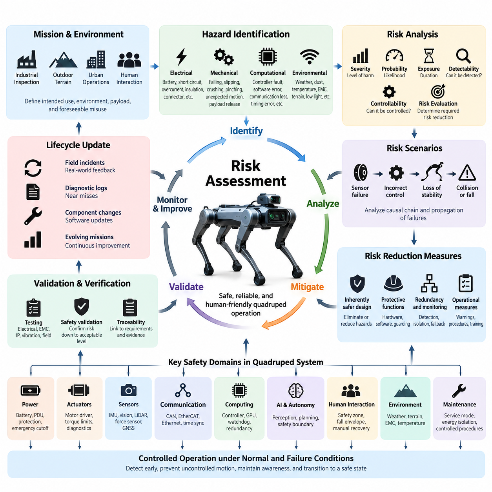
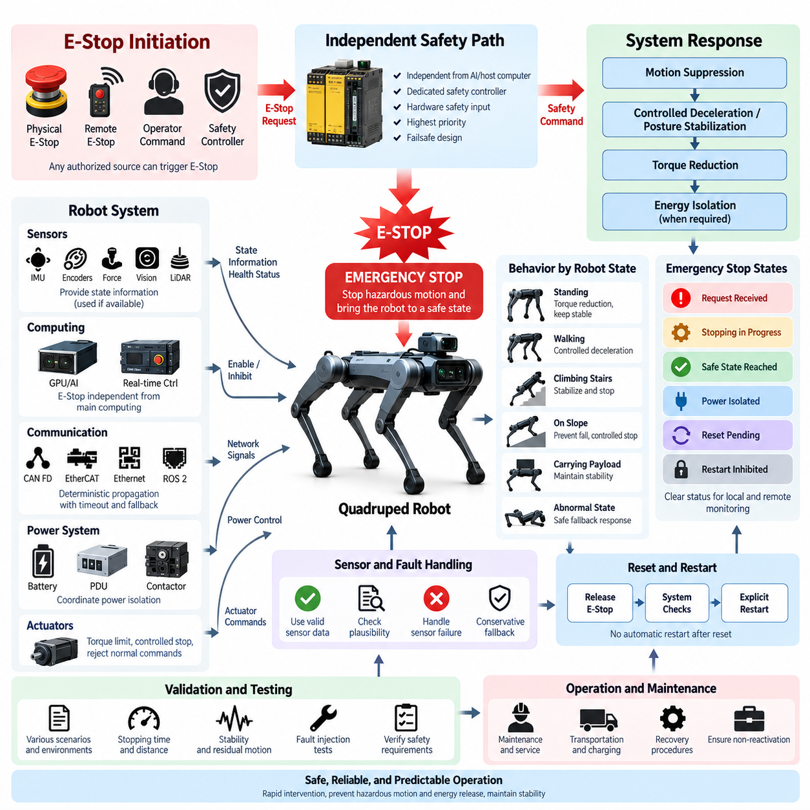
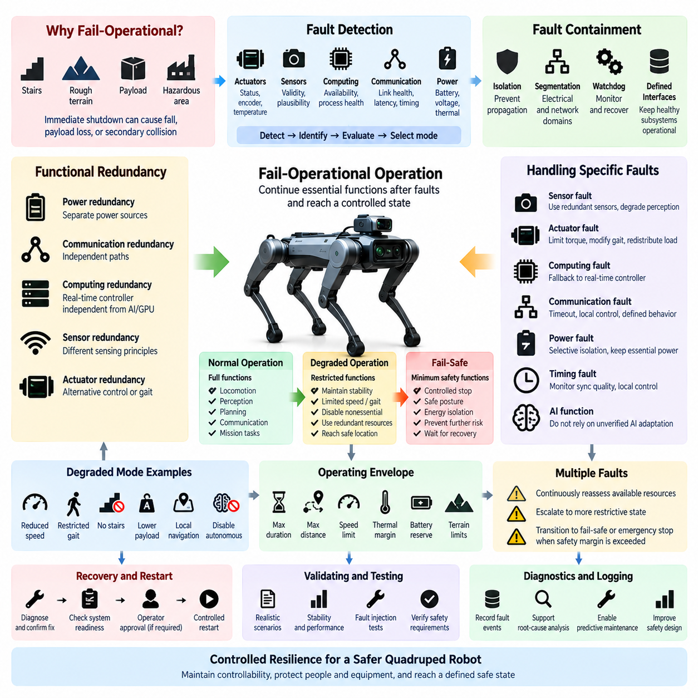
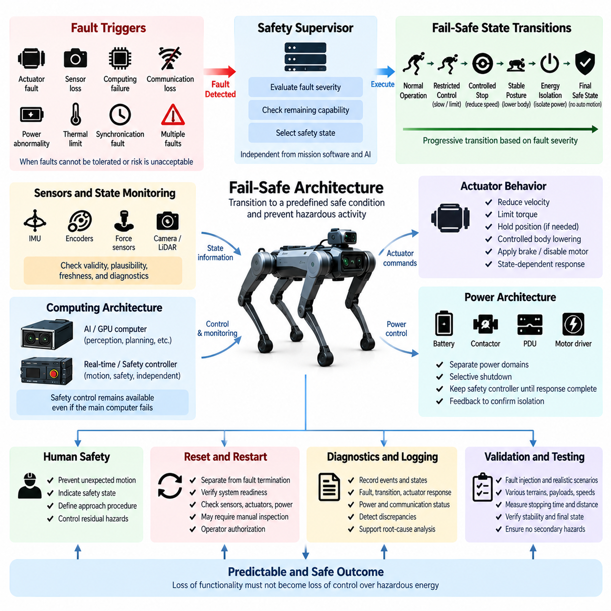
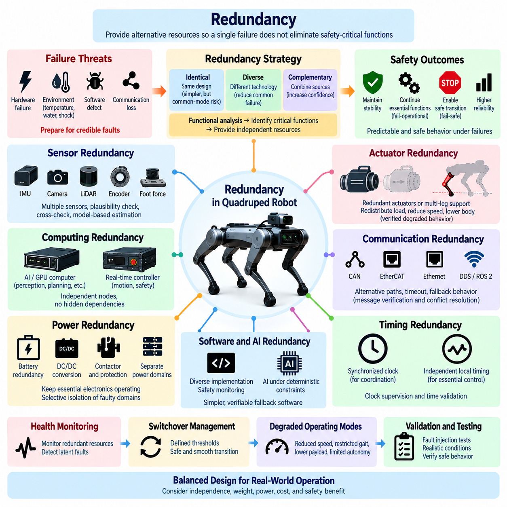
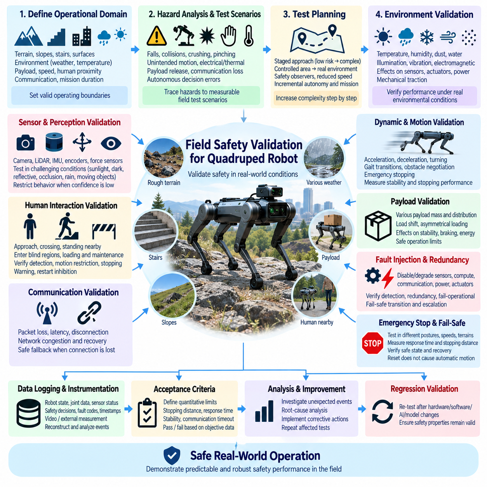

**Volume 20. Quadruped Electrical Architecture**


# Chapter 10. Functional Safety

##  

## 10.01. Risk Assessment

{width="7.268055555555556in" height="7.268055555555556in"}

Risk assessment for a quadruped robot is the systematic process of identifying hazardous conditions, estimating their potential consequences, and defining engineering measures that reduce risk to an acceptable level. Unlike a stationary industrial machine, a quadruped continuously changes posture, contact points, velocity, and interaction geometry. Safety analysis must therefore consider electrical, mechanical, computational, environmental, and behavioral hazards together throughout the complete operating mission.

A useful starting point is to define the intended use, operating environment, mission boundaries, payload configuration, expected human interaction, and reasonably foreseeable misuse. A quadruped intended for industrial inspection may encounter stairs, narrow passages, wet floors, machinery, cables, elevated platforms, or personnel. Each operating context changes the probability and severity of hazardous events, so risk assessment should be performed against representative missions rather than only against nominal laboratory operation.

Hazard identification begins at the system level and is progressively decomposed into subsystems. Electrical hazards include battery short circuits, insulation failure, connector overheating, uncontrolled current paths, and loss of protective power switching. Mechanical hazards include falling, slipping, crushing, pinching, unexpected joint motion, and payload release. Computational hazards include controller faults, corrupted sensor information, communication loss, timing errors, software deadlock, and unintended commands generated by higher-level autonomy.

The dynamic nature of quadruped locomotion introduces hazards that do not exist in conventional wheeled robots. Every walking cycle transfers load among multiple legs while the robot continuously modifies joint torque to preserve balance. Failure of a single actuator, encoder, torque sensor, communication link, or real-time controller can rapidly alter the support polygon. Risk analysis must therefore evaluate not only component failure itself but also how quickly that failure can propagate into instability, collapse, uncontrolled motion, or collision.

Risk is commonly evaluated by combining the severity of possible harm with the probability or frequency of occurrence. Additional factors may include exposure duration, possibility of avoidance, detectability, and the controllability of the hazardous situation. The objective is not merely to assign a numerical score. The assessment must establish whether an identified risk requires elimination through architecture, reduction through protective functions, operational restriction, warning, maintenance control, or a combination of these measures.

Hazardous scenarios should be expressed as causal sequences rather than isolated component faults. For example, loss of an encoder signal may produce an incorrect joint position estimate, which may cause inappropriate motor torque, leg trajectory deviation, loss of foothold, body instability, and eventual robot collapse. Constructing such chains helps engineers identify where detection, isolation, redundancy, torque limitation, controlled shutdown, or mechanical protection can interrupt the progression before unacceptable harm occurs.

Electrical power deserves particular attention because the battery and actuator network can contain substantial stored energy. Risk assessment should examine overcurrent, short circuits, reverse polarity, ground faults, contactor welding, DC/DC converter failures, damaged leg harnesses, connector contamination, and thermal overload. Protective measures should be coordinated across the battery management system, power distribution unit, fuses, contactors, emergency cutoff paths, motor drivers, and diagnostic controllers so that electrical faults are contained without creating secondary motion hazards.

Actuator hazards require analysis at both joint and whole-body levels. A motor driver may generate excessive torque because of sensor corruption, software failure, communication errors, or power-stage malfunction. Torque, velocity, position, temperature, and current monitoring provide complementary evidence of abnormal behavior. Limits should be defined according to the mechanical capability and mission state, while independent protection paths should prevent a failure in the primary motion-control software from defeating critical safety constraints.

Sensor faults can create dangerous behavior even when every actuator remains electrically healthy. IMU drift may corrupt attitude estimation, foot-force errors may produce incorrect contact detection, cameras or LiDAR may fail to identify nearby people, and GNSS errors may affect outdoor navigation. Risk assessment must determine which sensing functions are safety relevant and whether plausibility checking, sensor diversity, redundant measurement, confidence monitoring, environmental constraints, or transition to a degraded operating mode is required.

Communication architecture is another important source of common and cascading failures. CAN FD, EtherCAT, Gigabit Ethernet, DDS/ROS 2, and time-synchronization mechanisms may serve different control and information domains within the quadruped architecture. Packet loss, excessive latency, bus saturation, clock divergence, duplicated messages, or network partitioning can transform valid local data into unsafe system behavior. Safety analysis should therefore specify timeout behavior, freshness checks, sequence validation, communication supervision, and deterministic responses to loss of connectivity.

Timing faults must be treated as functional faults rather than simply performance degradation. A sensor measurement can be numerically correct yet unsafe when associated with the wrong time. Joint states, IMU data, foot contact measurements, perception results, and control commands should therefore carry sufficient temporal information to determine validity and freshness. Where synchronized computing nodes are used, clock quality and synchronization status should be monitored so that degraded timing cannot silently propagate through estimation and control functions.

The computing architecture must distinguish failures that can be detected from failures that can be tolerated. Processor crashes, GPU faults, memory corruption, thermal throttling, operating-system stalls, watchdog expiration, and power loss can affect different functions with different consequences. Safety-critical control should not depend unnecessarily on complex AI computing resources. A practical architecture separates fast deterministic protection and motion supervision from computationally intensive perception, planning, foundation-model, or agent functions.

Autonomous and AI-enabled functions introduce additional uncertainty because behavior may depend on learned representations rather than explicitly programmed rules. A perception model can misclassify an obstacle, a planner can select an inappropriate route, or an AI agent can generate a command that is semantically reasonable but physically unsafe. Risk reduction therefore requires an architectural boundary in which AI-generated intentions are checked against deterministic constraints governing velocity, workspace, stability, actuator capability, collision avoidance, and permitted mission states.

Human interaction must be evaluated under realistic conditions. Personnel may approach the robot unexpectedly, touch it during operation, walk behind it, enter blind regions, attempt to recover it manually, or remain close during maintenance. A quadruped may also fall in a direction that differs from its commanded trajectory. Safety zones should consequently account for body dimensions, leg sweep, stopping behavior, possible sliding, payload geometry, and credible fall envelopes rather than relying solely on navigation obstacle-clearance distances.

Environmental conditions can convert otherwise acceptable faults into serious hazards. Rain, dust, mud, temperature extremes, vibration, electromagnetic interference, steep slopes, loose gravel, stairs, reflective surfaces, and low illumination can degrade electrical components and perception simultaneously. Environmental risk assessment should connect expected exposure conditions with enclosure protection, connector design, harness routing, thermal margins, sensor limitations, traction capability, and operating restrictions so that environmental assumptions become explicit engineering requirements.

Maintenance and service activities require a separate assessment because normal protective assumptions may no longer apply. Covers may be removed, connectors disconnected, batteries replaced, legs lifted from the ground, or diagnostic commands issued directly to actuators. Hazardous stored electrical and mechanical energy should be identified before service procedures are defined. Maintenance states should prevent unintended motion, clearly indicate power status, restrict actuator enablement, and provide controlled procedures for isolation, verification, recovery, and return to operation.

Risk reduction should follow an architectural hierarchy. Hazards should first be eliminated or reduced through inherently safer design wherever practical. Remaining risks should then be addressed through protective hardware, safety functions, diagnostics, redundancy, monitoring, controlled degradation, emergency stopping, and physical guarding where appropriate. Information, warnings, and operating procedures are important but should not substitute for engineering controls when the hazardous condition can reasonably be prevented or automatically mitigated by the system.

The risk assessment should remain traceable to engineering requirements and validation evidence. Each significant hazard should be associated with its initiating conditions, affected functions, estimated risk, required mitigation, responsible subsystem, detection mechanism, system response, and verification method. This traceability connects functional safety with later activities such as emergency-stop design, fail-operational behavior, fail-safe architecture, redundancy, and field safety validation, which form the subsequent safety topics of the quadruped architecture.

Risk assessment is therefore not a document produced once near the end of development. It is a lifecycle activity that evolves as the electrical architecture, software, sensors, actuators, payloads, missions, and operating environments change. Field incidents, diagnostic logs, near misses, component revisions, software updates, and new autonomous capabilities should feed back into the hazard analysis. This closed-loop process allows safety assumptions to remain aligned with the actual robot rather than with an obsolete design baseline.

For a mature quadruped platform, the final objective is controlled behavior under both normal operation and credible failure conditions. The architecture should detect abnormal states early, prevent uncontrolled energy release, maintain sufficient awareness of its own health, and transition predictably toward a safe or degraded state. Risk assessment provides the engineering foundation for these decisions by translating physical hazards into explicit safety requirements that can be implemented, tested, validated, and maintained throughout the robot lifecycle.

사족보행 로봇(Quadruped Robot)의 위험 평가(Risk Assessment)는 위험한 상태(Hazardous Condition)를 체계적으로 식별하고, 잠재적인 결과를 추정하며, 위험(Risk)을 허용 가능한 수준으로 낮추기 위한 공학적 대책을 정의하는 과정이다. 고정형 산업 기계와 달리 사족보행 로봇은 자세(Posture), 접촉점(Contact Point), 속도(Velocity), 상호작용 형상(Interaction Geometry)이 지속적으로 변화한다. 따라서 안전 분석(Safety Analysis)은 전체 운용 임무(Operating Mission)에 걸쳐 전기적, 기계적, 연산적, 환경적, 행동적 위험요소(Hazard)를 함께 고려해야 한다.

유용한 출발점은 의도된 사용(Intended Use), 운용 환경(Operating Environment), 임무 경계(Mission Boundary), 페이로드 구성(Payload Configuration), 예상되는 인간 상호작용(Human Interaction), 합리적으로 예측 가능한 오사용(Reasonably Foreseeable Misuse)을 정의하는 것이다. 산업 검사(Industrial Inspection)를 수행하는 사족보행 로봇은 계단, 좁은 통로, 젖은 바닥, 기계 설비, 케이블, 고가 작업 구역 또는 작업자를 마주할 수 있다. 각각의 운용 환경은 위험 사건(Hazardous Event)의 발생 가능성과 심각도를 변화시키므로, 위험 평가는 정상적인 실험실 운용만이 아니라 대표적인 실제 임무를 기준으로 수행해야 한다.

위험요소 식별(Hazard Identification)은 시스템 수준(System Level)에서 시작하여 점진적으로 하위 시스템(Subsystem)으로 분해된다. 전기적 위험요소(Electrical Hazard)에는 배터리 단락(Battery Short Circuit), 절연 고장(Insulation Failure), 커넥터 과열(Connector Overheating), 제어되지 않는 전류 경로(Uncontrolled Current Path), 보호 전원 차단 기능의 상실이 포함된다. 기계적 위험요소(Mechanical Hazard)에는 전도(Falling), 미끄러짐(Slipping), 압착(Crushing), 끼임(Pinching), 예기치 않은 관절 운동(Unexpected Joint Motion), 페이로드 이탈(Payload Release)이 포함된다. 연산적 위험요소(Computational Hazard)에는 제어기 고장, 손상된 센서 정보, 통신 손실, 타이밍 오류, 소프트웨어 교착(Software Deadlock), 상위 자율 시스템에서 생성되는 의도하지 않은 명령이 포함된다.

사족보행 이동(Quadruped Locomotion)의 동적 특성은 기존의 바퀴형 로봇(Wheeled Robot)에는 존재하지 않는 위험을 발생시킨다. 모든 보행 주기(Walking Cycle)에서 여러 다리 사이로 하중이 전달되는 동시에 로봇은 균형을 유지하기 위해 관절 토크(Joint Torque)를 지속적으로 조정한다. 단일 액추에이터(Actuator), 엔코더(Encoder), 토크 센서(Torque Sensor), 통신 링크(Communication Link), 실시간 제어기(Real-Time Controller)의 고장도 지지 다각형(Support Polygon)을 빠르게 변화시킬 수 있다. 따라서 위험 분석은 부품 자체의 고장뿐 아니라 해당 고장이 얼마나 빠르게 불안정성, 붕괴, 제어되지 않는 운동 또는 충돌로 전파될 수 있는지도 평가해야 한다.

위험(Risk)은 일반적으로 발생 가능한 피해의 심각도(Severity)와 발생 확률 또는 빈도(Probability or Frequency)를 결합하여 평가한다. 추가적인 요소로는 노출 시간(Exposure Duration), 회피 가능성(Possibility of Avoidance), 검출 가능성(Detectability), 위험 상황의 제어 가능성(Controllability)이 포함될 수 있다. 목적은 단순히 수치화된 점수(Numerical Score)를 부여하는 것이 아니다. 평가를 통해 식별된 위험이 아키텍처(Architecture)를 통한 제거, 보호 기능(Protective Function)을 통한 감소, 운용 제한(Operational Restriction), 경고(Warning), 유지보수 관리(Maintenance Control), 또는 이러한 방법의 조합 중 무엇을 요구하는지 결정해야 한다.

위험 시나리오(Hazardous Scenario)는 개별 부품 고장이 아니라 인과 관계의 연속(Causal Sequence)으로 표현해야 한다. 예를 들어 엔코더 신호(Encoder Signal)의 손실은 잘못된 관절 위치 추정(Joint Position Estimation)을 발생시키고, 이는 부적절한 모터 토크, 다리 궤적 편차(Leg Trajectory Deviation), 발 접촉 상실(Loss of Foothold), 몸체 불안정성(Body Instability), 최종적인 로봇 붕괴로 이어질 수 있다. 이러한 고장 연쇄(Failure Chain)를 구성하면 엔지니어는 허용할 수 없는 피해가 발생하기 전에 검출(Detection), 격리(Isolation), 이중화(Redundancy), 토크 제한(Torque Limitation), 제어된 정지(Controlled Shutdown), 기계적 보호(Mechanical Protection)가 고장 진행을 차단할 수 있는 지점을 식별할 수 있다.

전력(Electrical Power)은 배터리와 액추에이터 네트워크(Actuator Network)가 상당한 저장 에너지(Stored Energy)를 포함할 수 있기 때문에 특별한 주의가 필요하다. 위험 평가는 과전류(Overcurrent), 단락(Short Circuit), 역극성(Reverse Polarity), 접지 고장(Ground Fault), 컨택터 용착(Contactor Welding), DC/DC 컨버터 고장(DC/DC Converter Failure), 손상된 다리 하네스(Leg Harness), 커넥터 오염(Connector Contamination), 열 과부하(Thermal Overload)를 검토해야 한다. 전기적 고장이 2차적인 운동 위험(Motion Hazard)을 발생시키지 않으면서 제한될 수 있도록 배터리 관리 시스템(Battery Management System), 전력 분배 장치(Power Distribution Unit), 퓨즈(Fuse), 컨택터(Contactor), 비상 차단 경로(Emergency Cutoff Path), 모터 드라이버(Motor Driver), 진단 제어기(Diagnostic Controller) 전반에 걸쳐 보호 대책을 조정해야 한다.

액추에이터 위험(Actuator Hazard)은 관절 수준(Joint Level)과 전신 수준(Whole-Body Level) 모두에서 분석해야 한다. 센서 정보 손상, 소프트웨어 고장, 통신 오류 또는 전력단 고장(Power-Stage Malfunction)으로 인해 모터 드라이버가 과도한 토크를 발생시킬 수 있다. 토크(Torque), 속도(Velocity), 위치(Position), 온도(Temperature), 전류(Current)의 모니터링은 비정상 동작에 대한 상호 보완적인 정보를 제공한다. 제한값은 기계적 성능과 임무 상태(Mission State)에 따라 정의해야 하며, 독립적인 보호 경로(Independent Protection Path)를 통해 주 운동 제어 소프트웨어(Primary Motion-Control Software)의 고장이 핵심 안전 제약조건(Safety Constraint)을 무력화하지 못하도록 해야 한다.

센서 고장(Sensor Fault)은 모든 액추에이터가 전기적으로 정상인 경우에도 위험한 동작을 발생시킬 수 있다. 관성측정장치(IMU) 드리프트는 자세 추정(Attitude Estimation)을 손상시킬 수 있고, 발 힘 센서(Foot-Force Sensor)의 오류는 잘못된 접촉 검출(Contact Detection)을 발생시킬 수 있으며, 카메라(Camera)나 라이다(LiDAR)는 주변 작업자를 감지하지 못할 수 있고, 위성항법시스템(GNSS) 오류는 실외 내비게이션(Outdoor Navigation)에 영향을 줄 수 있다. 위험 평가에서는 어떤 센싱 기능(Sensing Function)이 안전과 관련되는지 판단하고, 타당성 검사(Plausibility Checking), 센서 다양성(Sensor Diversity), 중복 측정(Redundant Measurement), 신뢰도 모니터링(Confidence Monitoring), 환경적 제약 또는 성능 저하 운용 모드(Degraded Operating Mode)로의 전환이 필요한지 결정해야 한다.

통신 아키텍처(Communication Architecture)는 공통 고장(Common Failure)과 연쇄 고장(Cascading Failure)의 또 다른 중요한 원인이다. CAN FD, EtherCAT, 기가비트 이더넷(Gigabit Ethernet), DDS/ROS 2, 시간 동기화(Time Synchronization) 메커니즘은 사족보행 로봇 아키텍처 내부에서 서로 다른 제어 및 정보 영역(Control and Information Domain)을 담당할 수 있다. 패킷 손실(Packet Loss), 과도한 지연(Excessive Latency), 버스 포화(Bus Saturation), 클록 편차(Clock Divergence), 중복 메시지(Duplicated Message), 네트워크 분할(Network Partition)은 정상적인 로컬 데이터(Local Data)를 위험한 시스템 동작으로 변화시킬 수 있다. 따라서 안전 분석은 타임아웃 동작(Timeout Behavior), 최신성 검사(Freshness Check), 순서 검증(Sequence Validation), 통신 감시(Communication Supervision), 연결 손실에 대한 결정론적 대응(Deterministic Response)을 정의해야 한다.

타이밍 고장(Timing Fault)은 단순한 성능 저하가 아니라 기능적 고장(Functional Fault)으로 취급해야 한다. 센서 측정값이 수치적으로 정확하더라도 잘못된 시간과 연결되면 위험할 수 있다. 따라서 관절 상태(Joint State), IMU 데이터, 발 접촉 측정값(Foot Contact Measurement), 인지 결과(Perception Result), 제어 명령(Control Command)은 유효성과 최신성을 판단할 수 있는 충분한 시간 정보(Temporal Information)를 포함해야 한다. 동기화된 컴퓨팅 노드(Synchronized Computing Node)를 사용하는 경우에는 저하된 타이밍 상태가 상태 추정과 제어 기능으로 조용히 전파되지 않도록 클록 품질(Clock Quality)과 동기화 상태(Synchronization Status)를 모니터링해야 한다.

컴퓨팅 아키텍처(Computing Architecture)는 검출할 수 있는 고장과 허용할 수 있는 고장을 구분해야 한다. 프로세서 충돌(Processor Crash), GPU 고장, 메모리 손상(Memory Corruption), 열 스로틀링(Thermal Throttling), 운영체제 정지(Operating-System Stall), 워치독 만료(Watchdog Expiration), 전원 손실은 서로 다른 기능에 서로 다른 영향을 줄 수 있다. 안전 필수 제어(Safety-Critical Control)는 복잡한 AI 컴퓨팅 자원에 불필요하게 의존해서는 안 된다. 실용적인 아키텍처는 빠르고 결정론적인 보호 및 운동 감시(Motion Supervision)를 계산 집약적인 인지(Perception), 계획(Planning), 파운데이션 모델(Foundation Model), 에이전트 기능(Agent Function)과 분리한다.

자율 및 AI 기반 기능(Autonomous and AI-Enabled Function)은 명시적으로 프로그래밍된 규칙이 아니라 학습된 표현(Learned Representation)에 따라 행동이 결정될 수 있기 때문에 추가적인 불확실성을 도입한다. 인지 모델(Perception Model)은 장애물을 잘못 분류할 수 있고, 계획기(Planner)는 부적절한 경로를 선택할 수 있으며, AI 에이전트(AI Agent)는 의미적으로는 타당하지만 물리적으로 위험한 명령을 생성할 수 있다. 따라서 위험 감소를 위해서는 AI가 생성한 의도(Intent)를 속도, 작업 공간(Workspace), 안정성(Stability), 액추에이터 성능, 충돌 회피(Collision Avoidance), 허용된 임무 상태를 관리하는 결정론적 제약조건(Deterministic Constraint)에 대해 검사하는 아키텍처 경계(Architectural Boundary)가 필요하다.

인간 상호작용(Human Interaction)은 현실적인 조건에서 평가해야 한다. 작업자는 예상하지 못한 순간에 로봇에 접근하거나, 운용 중 로봇을 만지거나, 로봇 뒤를 지나가거나, 사각 영역(Blind Region)에 들어가거나, 수동 복구(Manual Recovery)를 시도하거나, 유지보수 중 가까이 머무를 수 있다. 또한 사족보행 로봇은 명령된 이동 방향과 다른 방향으로 넘어질 수도 있다. 따라서 안전 영역(Safety Zone)은 단순히 내비게이션의 장애물 이격 거리(Obstacle-Clearance Distance)에 의존하지 않고 몸체 크기, 다리의 움직임 범위(Leg Sweep), 정지 동작(Stopping Behavior), 가능한 미끄러짐, 페이로드 형상(Payload Geometry), 현실적으로 가능한 전도 영역(Fall Envelope)을 고려해야 한다.

환경 조건(Environmental Condition)은 일반적으로 허용 가능한 고장을 심각한 위험으로 변화시킬 수 있다. 비, 먼지, 진흙, 극한 온도, 진동, 전자기 간섭(Electromagnetic Interference), 급경사, 느슨한 자갈, 계단, 반사 표면, 저조도 환경은 전기 부품과 인지 기능을 동시에 저하시킬 수 있다. 환경 위험 평가(Environmental Risk Assessment)는 예상되는 노출 조건을 외함 보호(Enclosure Protection), 커넥터 설계, 하네스 라우팅(Harness Routing), 열적 여유(Thermal Margin), 센서 한계, 접지력(Traction Capability), 운용 제한과 연결하여 환경적 가정이 명시적인 공학 요구사항(Engineering Requirement)이 되도록 해야 한다.

유지보수 및 서비스 활동(Maintenance and Service Activity)은 정상적인 보호 가정이 더 이상 적용되지 않을 수 있으므로 별도의 평가가 필요하다. 커버가 제거되고, 커넥터가 분리되고, 배터리가 교체되고, 다리가 지면에서 들어 올려지거나, 진단 명령(Diagnostic Command)이 액추에이터에 직접 전달될 수 있다. 서비스 절차를 정의하기 전에 위험한 저장 전기 에너지와 기계 에너지(Stored Electrical and Mechanical Energy)를 식별해야 한다. 유지보수 상태(Maintenance State)는 의도하지 않은 움직임을 방지하고, 전원 상태를 명확하게 표시하며, 액추에이터 활성화(Actuator Enablement)를 제한하고, 격리(Isolation), 검증(Verification), 복구(Recovery), 정상 운용 복귀(Return to Operation)를 위한 제어된 절차를 제공해야 한다.

위험 감소(Risk Reduction)는 아키텍처 계층구조(Architectural Hierarchy)를 따라 수행해야 한다. 가능한 경우 본질적으로 더 안전한 설계(Inherently Safer Design)를 통해 위험요소를 먼저 제거하거나 감소시켜야 한다. 남아 있는 위험은 보호 하드웨어(Protective Hardware), 안전 기능(Safety Function), 진단(Diagnostics), 이중화(Redundancy), 모니터링(Monitoring), 제어된 성능 저하(Controlled Degradation), 비상 정지(Emergency Stopping), 필요한 경우 물리적 방호(Physical Guarding)를 통해 처리해야 한다. 정보, 경고 및 운용 절차도 중요하지만 공학적 제어를 통해 합리적으로 예방하거나 자동 완화할 수 있는 위험 상황에서 이를 공학적 보호 대책의 대체 수단으로 사용해서는 안 된다.

위험 평가는 공학 요구사항(Engineering Requirement)과 검증 증거(Validation Evidence)까지 추적 가능(Traceable)해야 한다. 각각의 주요 위험요소는 발생 조건(Initiating Condition), 영향을 받는 기능, 추정 위험, 필요한 완화 대책(Mitigation), 담당 하위 시스템, 검출 메커니즘(Detection Mechanism), 시스템 대응(System Response), 검증 방법(Verification Method)과 연결되어야 한다. 이러한 추적성(Traceability)은 기능 안전(Functional Safety)을 이후의 비상 정지(Emergency Stop), 고장 운용 설계(Fail-Operational Design), 고장 안전 아키텍처(Fail-Safe Architecture), 이중화(Redundancy), 현장 안전 검증(Field Safety Validation)과 연결한다.

따라서 위험 평가(Risk Assessment)는 개발 후반에 한 번 작성하고 끝나는 문서가 아니다. 전기 아키텍처, 소프트웨어, 센서, 액추에이터, 페이로드, 임무 및 운용 환경이 변화함에 따라 지속적으로 발전하는 수명주기 활동(Lifecycle Activity)이다. 현장 사고(Field Incident), 진단 로그(Diagnostic Log), 아차 사고(Near Miss), 부품 변경(Component Revision), 소프트웨어 업데이트(Software Update), 새로운 자율 기능은 위험요소 분석(Hazard Analysis)에 다시 반영되어야 한다. 이러한 폐루프 과정(Closed-Loop Process)을 통해 안전 가정(Safety Assumption)이 오래된 설계 기준이 아니라 실제 로봇의 현재 상태와 지속적으로 일치하도록 할 수 있다.

성숙한 사족보행 로봇 플랫폼(Quadruped Robot Platform)의 최종 목표는 정상 운용뿐 아니라 현실적으로 발생 가능한 고장 조건에서도 제어된 동작(Controlled Behavior)을 유지하는 것이다. 아키텍처는 비정상 상태를 조기에 검출하고, 제어되지 않는 에너지 방출(Uncontrolled Energy Release)을 방지하며, 자체 상태에 대한 충분한 인식(System Health Awareness)을 유지하고, 안전 상태(Safe State) 또는 성능 저하 상태(Degraded State)로 예측 가능하게 전환할 수 있어야 한다. 위험 평가는 물리적 위험요소를 구현, 시험, 검증 및 로봇의 전체 수명주기 동안 유지할 수 있는 명시적인 안전 요구사항(Safety Requirement)으로 변환함으로써 이러한 설계 판단의 공학적 기반을 제공한다.

##  

## 10.02. Emergency Stop

{width="7.268055555555556in" height="7.268055555555556in"}

An emergency stop function provides a deliberate and independent means of bringing a quadruped robot into a controlled safety condition when continued operation presents an immediate hazard. Because a quadruped combines high-torque joints, stored battery energy, autonomous motion, and dynamically changing body support, emergency stopping cannot be treated as a simple software command. It must be designed as a system-level safety function spanning human interfaces, control electronics, power distribution, actuators, communication, and diagnostics.

The primary purpose of an emergency stop is to override normal mission execution when hazardous motion or another dangerous condition requires immediate intervention. Activation may originate from a physical emergency-stop device, remote operator interface, safety controller, or another authorized safety mechanism. The resulting action must have higher priority than navigation, locomotion, AI planning, inspection tasks, and ordinary supervisory commands so that autonomous behavior cannot prevent or delay the required safety response.

Emergency-stop behavior must consider the dynamic characteristics of legged locomotion. Simply removing electrical power from every actuator can cause a standing or walking quadruped to collapse because joint torque may be required to support the body. Conversely, maintaining unrestricted actuator power after an emergency request can permit hazardous movement to continue. The architecture must therefore define a controlled transition that balances rapid motion suppression with preservation of mechanical stability wherever the operating condition permits.

The required stopping response depends strongly on the robot state when the emergency stop is activated. A stationary robot standing on level ground presents a different problem from a robot climbing stairs, traversing a slope, carrying a payload, or walking at high speed. Safety logic should evaluate available state information and execute a predefined response, such as controlled deceleration, stabilization, posture lowering, actuator torque restriction, or final power isolation, while preventing normal autonomous commands from reactivating motion.

A physical emergency-stop interface should be positioned so that personnel can identify and operate it rapidly without entering an additional hazardous region. The device should provide an unambiguous command and remain in the activated state until intentionally reset. Where personnel may supervise the robot from a distance, an appropriately engineered remote emergency-stop mechanism can complement the local interface, but communication loss must not create uncertainty about whether the safety command has been received and executed.

The emergency-stop signal path should be sufficiently independent from the main autonomy and AI computing stack. A failure of the GPU computer, operating system, ROS 2 process, perception pipeline, planner, or high-level network should not eliminate the ability to stop hazardous motion. A dedicated safety controller, real-time controller, hardware safety input, or equivalent independent mechanism can supervise the stop path and directly influence actuator enable signals or protected power-control devices without depending on normal mission software.

Electrical architecture plays a central role in implementing the emergency-stop response. The battery, power distribution unit, contactors, DC/DC converters, motor drivers, and actuator power domains should be coordinated so that hazardous energy can be isolated when required. However, power removal should follow the defined safety sequence rather than assuming that immediate total disconnection is always safest. Logic power, safety controllers, brakes, or selected actuators may temporarily require energy to complete controlled stabilization or shutdown.

Actuator-level emergency behavior should define what happens to torque, velocity, position control, and motor enable states during the transition. Depending on the mechanical design, joints may first receive bounded commands that reduce velocity and stabilize the body before drive torque is disabled. Motor drivers should reject ordinary motion commands once the emergency state is active, and independent enable or inhibit mechanisms should provide additional protection against software continuing to generate commands after the safety function has been triggered.

Communication networks must propagate emergency-related state deterministically while avoiding excessive dependence on a single communication channel. CAN FD, EtherCAT, Ethernet, and higher-level DDS/ROS 2 communication may participate in normal control, but critical emergency actions should account for network interruption, delayed messages, corrupted data, and node failure. Local controllers should therefore define timeout and fallback behavior so that loss of communication during an emergency transition does not result in uncontrolled actuator operation.

The stopping sequence should also consider perception and sensor availability. IMU data, joint encoders, torque measurements, foot-force sensors, and other state information may be useful for determining whether controlled stabilization remains possible. Nevertheless, the emergency-stop architecture must anticipate that the initiating hazard may itself involve sensor failure. Safety behavior should therefore use validated information where available while retaining a conservative fallback response when required measurements become unavailable, implausible, stale, or internally inconsistent.

A practical emergency-stop architecture separates the emergency request, safety decision, motion suppression, energy isolation, and status confirmation into traceable functions. This prevents a single ambiguous command from representing the entire safety mechanism. Each stage can be monitored to determine whether the request was detected, whether actuators entered the commanded safe condition, whether hazardous power was removed when necessary, and whether any discrepancy requires escalation to a more restrictive fallback state.

Resetting the emergency stop must not automatically restart locomotion. Release of the physical emergency-stop device indicates that the emergency command has been reset, but it does not prove that the environment or robot is safe for operation. The system should remain in a controlled inhibited state until required checks are completed and an explicit restart or enable command is issued. This separation prevents unexpected movement immediately after personnel release an emergency-stop device.

Restart authorization should verify relevant system conditions before actuator motion is restored. Depending on the architecture, these conditions can include acceptable battery and power status, valid communication, healthy controllers, available sensors, actuator readiness, stable posture, and absence of unresolved critical diagnostic faults. If the robot collapsed or entered an abnormal configuration during the emergency event, a dedicated recovery procedure may be required rather than returning directly to the interrupted autonomous mission.

Emergency-stop status should be clearly observable both locally and remotely. Operators, maintenance personnel, fleet systems, and diagnostic software should be able to distinguish normal operation, emergency-stop requested, stopping in progress, safe state reached, power isolated, reset pending, and restart inhibited where these states are implemented. Clear state representation reduces uncertainty during recovery and enables diagnostic logs to reconstruct the sequence of events that occurred before, during, and after activation.

Remote and fleet-operated quadrupeds require particular attention because the operator may not have direct visual contact with the robot. A remote emergency-stop command must account for wireless latency, connection loss, network partitioning, and remote-system failure. The robot should not depend exclusively on cloud connectivity or fleet software for immediate safety action. Local safety supervision remains necessary so that hazardous motion can be terminated even when communication with remote infrastructure becomes unavailable.

AI and autonomous functions must remain subordinate to the emergency-stop architecture. A vision-language model, agent, navigation planner, learned locomotion policy, or foundation-model interface must not reinterpret, suppress, postpone, or autonomously cancel an active emergency-stop condition. Once the safety function is triggered, AI-generated actions should be blocked at an architectural boundary until the safety state is intentionally cleared and normal control authority is restored through the defined restart process.

Diagnostics are essential for demonstrating that the emergency-stop function remains available throughout the robot lifecycle. The system should detect failures such as broken signal wiring, stuck inputs, welded contactors, failed actuator inhibits, safety-controller faults, communication inconsistencies, and unexpected power states where the architecture permits such monitoring. Relevant events should be recorded with sufficient timing and state information to support maintenance, fault investigation, safety validation, and improvement of future system revisions.

Emergency-stop validation must extend beyond verifying that a button can stop the robot under ideal laboratory conditions. Tests should cover representative postures, locomotion states, speeds, payloads, slopes, communication failures, sensor faults, computing faults, power abnormalities, and realistic environmental conditions. Measurements such as stopping time, stopping distance, residual motion, body stability, actuator response, power isolation time, and final robot state provide objective evidence that the implemented behavior satisfies its safety requirements.

The emergency-stop function must also be considered during maintenance, transportation, charging, recovery, and field servicing. Different operating modes can expose personnel to different combinations of electrical and mechanical energy, and a single stopping strategy may not be appropriate for every condition. Service procedures should define when emergency stopping is available, how hazardous energy is isolated, how actuator motion is prevented, and how technicians verify that the robot cannot unexpectedly return to an enabled state.

A robust emergency-stop design therefore combines rapid intervention with predictable system behavior. Its objective is not merely to disconnect power as quickly as possible, but to prevent hazardous motion and energy release while bringing the quadruped toward a defined safe condition. By coordinating independent safety logic, actuator control, power isolation, communication supervision, diagnostics, reset management, and validation, the emergency-stop architecture becomes a fundamental protective layer within the quadruped functional safety system.

비상 정지 기능(Emergency Stop Function)은 사족보행 로봇(Quadruped Robot)이 계속 동작할 경우 즉각적인 위험이 발생할 수 있을 때, 로봇을 제어된 안전 상태(Controlled Safety Condition)로 전환하기 위한 의도적이고 독립적인 수단을 제공한다. 사족보행 로봇은 고토크 관절(High-Torque Joint), 배터리에 저장된 에너지(Stored Battery Energy), 자율 이동(Autonomous Motion), 지속적으로 변화하는 몸체 지지 상태를 결합하고 있으므로, 비상 정지를 단순한 소프트웨어 명령으로 취급할 수 없다. 이는 인간 인터페이스(Human Interface), 제어 전자장치(Control Electronics), 전력 분배(Power Distribution), 액추에이터(Actuator), 통신(Communication), 진단(Diagnostics)을 포괄하는 시스템 수준 안전 기능(System-Level Safety Function)으로 설계되어야 한다.

비상 정지(Emergency Stop)의 주요 목적은 위험한 움직임이나 다른 위험 상태로 인해 즉각적인 개입이 필요한 경우 정상 임무 수행(Normal Mission Execution)을 우선적으로 중단하는 것이다. 비상 정지는 물리적 비상 정지 장치(Physical Emergency-Stop Device), 원격 운용자 인터페이스(Remote Operator Interface), 안전 제어기(Safety Controller) 또는 기타 승인된 안전 메커니즘(Safety Mechanism)을 통해 활성화될 수 있다. 그 결과로 수행되는 동작은 내비게이션(Navigation), 보행 제어(Locomotion), AI 계획(AI Planning), 검사 작업(Inspection Task), 일반적인 감독 명령(Supervisory Command)보다 높은 우선순위를 가져야 하며, 자율 기능이 필요한 안전 대응을 방해하거나 지연시켜서는 안 된다.

비상 정지 동작(Emergency-Stop Behavior)은 다족보행(Legged Locomotion)의 동적 특성을 고려해야 한다. 모든 액추에이터의 전력을 단순히 차단하면 서 있거나 보행 중인 사족보행 로봇이 몸체를 지지하기 위한 관절 토크(Joint Torque)를 잃어 넘어질 수 있다. 반대로 비상 정지 요청 후에도 액추에이터에 제한 없이 전력을 공급하면 위험한 움직임이 계속될 수 있다. 따라서 아키텍처는 운용 조건이 허용하는 범위에서 빠른 운동 억제(Motion Suppression)와 기계적 안정성(Mechanical Stability) 유지 사이의 균형을 확보하는 제어된 전환(Controlled Transition)을 정의해야 한다.

필요한 정지 대응(Stopping Response)은 비상 정지가 활성화되는 순간의 로봇 상태에 크게 좌우된다. 평지에서 정지 상태로 서 있는 로봇과 계단을 오르거나, 경사면을 이동하거나, 페이로드(Payload)를 운반하거나, 고속으로 보행 중인 로봇은 서로 다른 문제를 가진다. 안전 로직(Safety Logic)은 사용 가능한 상태 정보(State Information)를 평가하고 제어 감속(Controlled Deceleration), 안정화(Stabilization), 자세 낮춤(Posture Lowering), 액추에이터 토크 제한(Actuator Torque Restriction), 최종 전력 차단(Final Power Isolation)과 같은 사전에 정의된 대응을 실행해야 하며, 정상 자율 명령이 다시 움직임을 활성화하지 못하도록 해야 한다.

물리적 비상 정지 인터페이스(Physical Emergency-Stop Interface)는 작업자가 추가적인 위험 영역에 진입하지 않고 신속하게 식별하고 조작할 수 있는 위치에 배치되어야 한다. 장치는 명확한 명령을 제공해야 하며 의도적으로 리셋(Reset)될 때까지 활성 상태를 유지해야 한다. 작업자가 원격에서 로봇을 감독하는 경우 적절하게 설계된 원격 비상 정지 메커니즘(Remote Emergency-Stop Mechanism)이 로컬 인터페이스(Local Interface)를 보완할 수 있지만, 통신 손실로 인해 안전 명령의 수신 및 실행 여부가 불확실해져서는 안 된다.

비상 정지 신호 경로(Emergency-Stop Signal Path)는 주 자율 시스템(Main Autonomy System)과 AI 컴퓨팅 스택(AI Computing Stack)으로부터 충분히 독립되어야 한다. GPU 컴퓨터, 운영체제(Operating System), ROS 2 프로세스(Process), 인지 파이프라인(Perception Pipeline), 계획기(Planner), 상위 네트워크(High-Level Network)의 고장이 위험한 움직임을 정지시키는 기능까지 제거해서는 안 된다. 전용 안전 제어기(Dedicated Safety Controller), 실시간 제어기(Real-Time Controller), 하드웨어 안전 입력(Hardware Safety Input) 또는 이에 상응하는 독립 메커니즘을 통해 정상 임무 소프트웨어에 의존하지 않고 정지 경로를 감시하고 액추에이터 활성화 신호(Actuator Enable Signal) 또는 보호된 전력 제어 장치에 직접 영향을 줄 수 있어야 한다.

전기 아키텍처(Electrical Architecture)는 비상 정지 대응을 구현하는 데 핵심적인 역할을 한다. 배터리(Battery), 전력 분배 장치(Power Distribution Unit), 컨택터(Contactor), DC/DC 컨버터(DC/DC Converter), 모터 드라이버(Motor Driver), 액추에이터 전력 도메인(Actuator Power Domain)은 필요할 때 위험 에너지(Hazardous Energy)를 격리할 수 있도록 상호 조정되어야 한다. 그러나 전력 제거(Power Removal)는 즉각적인 전체 전력 차단이 항상 가장 안전하다고 가정하는 것이 아니라 정의된 안전 시퀀스(Safety Sequence)를 따라야 한다. 제어된 안정화 또는 종료를 완료하기 위해 로직 전원(Logic Power), 안전 제어기, 브레이크(Brake) 또는 일부 액추에이터에는 일시적으로 에너지가 필요할 수 있다.

액추에이터 수준 비상 동작(Actuator-Level Emergency Behavior)은 전환 과정에서 토크(Torque), 속도(Velocity), 위치 제어(Position Control), 모터 활성화 상태(Motor Enable State)가 어떻게 변화하는지 정의해야 한다. 기계적 설계에 따라 관절은 드라이브 토크(Drive Torque)가 비활성화되기 전에 속도를 감소시키고 몸체를 안정화하기 위한 제한된 명령(Bounded Command)을 받을 수 있다. 비상 상태가 활성화된 이후에는 모터 드라이버가 일반 운동 명령을 거부해야 하며, 독립적인 활성화 또는 억제 메커니즘(Independent Enable or Inhibit Mechanism)을 통해 안전 기능이 작동한 이후에도 소프트웨어가 계속 명령을 생성하는 상황에 대한 추가적인 보호를 제공해야 한다.

통신 네트워크(Communication Network)는 단일 통신 채널에 과도하게 의존하지 않으면서 비상 관련 상태를 결정론적으로 전파해야 한다. CAN FD, EtherCAT, 이더넷(Ethernet), 상위 수준 DDS/ROS 2 통신은 정상 제어에 사용될 수 있지만, 핵심 비상 동작(Critical Emergency Action)은 네트워크 단절, 메시지 지연, 데이터 손상, 노드 고장(Node Failure)을 고려해야 한다. 따라서 로컬 제어기(Local Controller)는 비상 전환 중 통신 손실이 제어되지 않는 액추에이터 동작으로 이어지지 않도록 타임아웃(Timeout)과 폴백 동작(Fallback Behavior)을 정의해야 한다.

정지 시퀀스(Stopping Sequence)는 인지(Perception) 및 센서 가용성(Sensor Availability)도 고려해야 한다. 관성측정장치(IMU) 데이터, 관절 엔코더(Joint Encoder), 토크 측정(Torque Measurement), 발 힘 센서(Foot-Force Sensor) 및 기타 상태 정보는 제어된 안정화가 가능한지를 판단하는 데 활용될 수 있다. 그러나 비상 정지를 유발한 위험 자체가 센서 고장일 가능성도 고려해야 한다. 따라서 안전 동작은 가능한 경우 검증된 정보를 사용하되, 필요한 측정값을 사용할 수 없거나 타당하지 않거나 오래되었거나 내부적으로 불일치하는 경우 보수적인 폴백 대응(Conservative Fallback Response)을 유지해야 한다.

실용적인 비상 정지 아키텍처(Emergency-Stop Architecture)는 비상 요청(Emergency Request), 안전 판단(Safety Decision), 운동 억제(Motion Suppression), 에너지 격리(Energy Isolation), 상태 확인(Status Confirmation)을 추적 가능한 개별 기능으로 분리한다. 이를 통해 하나의 모호한 명령이 전체 안전 메커니즘을 대표하는 것을 방지할 수 있다. 각 단계에서는 요청이 검출되었는지, 액추에이터가 명령된 안전 상태에 진입했는지, 필요할 때 위험 전력이 제거되었는지, 그리고 불일치가 발생했을 경우 더 제한적인 폴백 상태(Fallback State)로 전환해야 하는지를 감시할 수 있다.

비상 정지를 리셋(Reset)한다고 해서 보행이 자동으로 재시작되어서는 안 된다. 물리적 비상 정지 장치의 해제는 비상 명령이 리셋되었다는 것을 의미하지만, 환경이나 로봇이 안전한 상태라는 것을 증명하지는 않는다. 필요한 검사가 완료되고 명시적인 재시작 또는 활성화 명령(Restart or Enable Command)이 입력될 때까지 시스템은 제어된 동작 억제 상태(Controlled Inhibited State)를 유지해야 한다. 이러한 분리는 작업자가 비상 정지 장치를 해제한 직후 로봇이 예상하지 못하게 움직이는 것을 방지한다.

재시작 승인(Restart Authorization)은 액추에이터 움직임이 복원되기 전에 관련 시스템 상태를 검증해야 한다. 아키텍처에 따라 허용 가능한 배터리 및 전력 상태, 정상 통신, 정상 제어기, 사용 가능한 센서, 액추에이터 준비 상태(Actuator Readiness), 안정적인 자세(Stable Posture), 해결되지 않은 중요 진단 고장(Critical Diagnostic Fault)의 부재 등을 확인할 수 있다. 비상 상황 중 로봇이 넘어졌거나 비정상적인 형상(Abnormal Configuration)에 진입한 경우에는 중단된 자율 임무로 즉시 복귀하는 대신 전용 복구 절차(Dedicated Recovery Procedure)가 필요할 수 있다.

비상 정지 상태(Emergency-Stop Status)는 로컬과 원격 모두에서 명확하게 확인할 수 있어야 한다. 운용자, 유지보수 작업자, 플릿 시스템(Fleet System), 진단 소프트웨어(Diagnostic Software)는 구현된 상태에 따라 정상 운용, 비상 정지 요청, 정지 진행 중, 안전 상태 도달, 전력 격리, 리셋 대기(Reset Pending), 재시작 억제(Restart Inhibited)를 구분할 수 있어야 한다. 명확한 상태 표현(State Representation)은 복구 과정의 불확실성을 줄이고 진단 로그를 통해 활성화 전후 및 진행 과정에서 발생한 사건의 순서를 재구성할 수 있도록 한다.

원격 및 플릿 운용 사족보행 로봇(Remote and Fleet-Operated Quadruped)은 운용자가 로봇을 직접 볼 수 없을 가능성이 있기 때문에 특별한 주의가 필요하다. 원격 비상 정지 명령(Remote Emergency-Stop Command)은 무선 지연(Wireless Latency), 연결 손실(Connection Loss), 네트워크 분할(Network Partition), 원격 시스템 고장을 고려해야 한다. 로봇은 즉각적인 안전 동작을 위해 클라우드 연결(Cloud Connectivity)이나 플릿 소프트웨어에만 의존해서는 안 된다. 원격 인프라와의 통신이 불가능한 경우에도 위험한 움직임을 종료할 수 있도록 로컬 안전 감시(Local Safety Supervision)가 필요하다.

AI 및 자율 기능(AI and Autonomous Function)은 비상 정지 아키텍처보다 낮은 제어 우선순위를 가져야 한다. 비전-언어 모델(Vision-Language Model), 에이전트(Agent), 내비게이션 계획기(Navigation Planner), 학습 기반 보행 정책(Learned Locomotion Policy), 파운데이션 모델 인터페이스(Foundation-Model Interface)는 활성화된 비상 정지 상태를 재해석하거나, 억제하거나, 지연하거나, 자율적으로 취소해서는 안 된다. 안전 기능이 작동하면 안전 상태가 의도적으로 해제되고 정의된 재시작 절차를 통해 정상 제어 권한(Control Authority)이 복원될 때까지 AI가 생성하는 동작은 아키텍처 경계(Architectural Boundary)에서 차단되어야 한다.

진단(Diagnostics)은 비상 정지 기능이 로봇의 전체 수명주기 동안 계속 사용 가능한지를 입증하는 데 필수적이다. 시스템은 아키텍처가 허용하는 범위에서 신호 배선 단선(Broken Signal Wiring), 고착된 입력(Stuck Input), 컨택터 용착(Welded Contactor), 액추에이터 억제 기능 고장(Failed Actuator Inhibit), 안전 제어기 고장, 통신 불일치(Communication Inconsistency), 예상하지 못한 전력 상태를 검출해야 한다. 관련 이벤트는 유지보수, 고장 조사(Fault Investigation), 안전 검증(Safety Validation), 향후 시스템 개정의 개선을 지원할 수 있도록 충분한 시간 및 상태 정보와 함께 기록되어야 한다.

비상 정지 검증(Emergency-Stop Validation)은 이상적인 실험실 조건에서 버튼을 눌렀을 때 로봇이 정지하는지만 확인하는 수준을 넘어야 한다. 시험은 대표적인 자세, 보행 상태, 속도, 페이로드, 경사면, 통신 고장, 센서 고장, 컴퓨팅 고장, 전력 이상 및 현실적인 환경 조건을 포함해야 한다. 정지 시간(Stopping Time), 정지 거리(Stopping Distance), 잔류 운동(Residual Motion), 몸체 안정성(Body Stability), 액추에이터 응답(Actuator Response), 전력 격리 시간(Power Isolation Time), 최종 로봇 상태(Final Robot State) 등의 측정값은 구현된 동작이 안전 요구사항(Safety Requirement)을 충족한다는 객관적인 증거를 제공한다.

비상 정지 기능은 유지보수(Maintenance), 운송(Transportation), 충전(Charging), 복구(Recovery), 현장 서비스(Field Servicing) 과정에서도 고려해야 한다. 서로 다른 운용 모드(Operating Mode)는 작업자를 서로 다른 전기적 및 기계적 에너지 조합에 노출시킬 수 있으며, 하나의 정지 전략이 모든 조건에 적합하지 않을 수 있다. 서비스 절차(Service Procedure)는 비상 정지가 언제 사용 가능한지, 위험 에너지를 어떻게 격리하는지, 액추에이터 움직임을 어떻게 방지하는지, 그리고 기술자가 로봇이 예상하지 못하게 다시 활성화될 수 없음을 어떻게 검증하는지를 정의해야 한다.

따라서 견고한 비상 정지 설계(Robust Emergency-Stop Design)는 신속한 개입(Rapid Intervention)과 예측 가능한 시스템 동작(Predictable System Behavior)을 결합해야 한다. 목적은 단순히 가능한 한 빠르게 전원을 차단하는 것이 아니라, 위험한 움직임과 에너지 방출을 방지하면서 사족보행 로봇을 정의된 안전 상태(Safe Condition)로 전환하는 것이다. 독립적인 안전 로직(Independent Safety Logic), 액추에이터 제어, 전력 격리, 통신 감시, 진단, 리셋 관리(Reset Management), 검증(Validation)을 조정함으로써 비상 정지 아키텍처는 사족보행 로봇의 기능 안전 시스템(Functional Safety System)을 구성하는 핵심 보호 계층(Protective Layer)이 된다.

##  

## 10.03. Fail Operational Design

{width="7.268055555555556in" height="7.268055555555556in"}

Fail-operational design enables a quadruped robot to continue performing essential functions after one or more faults have occurred, rather than immediately terminating all operation. The objective is not unrestricted continuation of the original mission, but preservation of sufficient control authority to maintain stability, protect people and equipment, and reach a controlled condition. This capability is particularly important for dynamically balanced robots that may become more hazardous if power or control is removed abruptly.

The need for fail-operational behavior originates from the physical characteristics of quadruped locomotion. A robot may be walking on stairs, traversing uneven terrain, carrying a payload, or operating near hazardous equipment when a fault occurs. Immediate shutdown could cause collapse, sliding, payload loss, or secondary collision. The safety architecture must therefore determine which functions must remain available temporarily and which functions can be disabled without compromising the robot's ability to manage the fault safely.

Fail-operational design begins by identifying essential functions and their required duration after failure. Body stabilization, joint control, attitude estimation, contact detection, communication supervision, and controlled power management may need to remain active long enough to stop locomotion or reach a safer posture. Mission-level perception, inspection processing, cloud communication, or advanced AI reasoning may be unnecessary during this transition and can often be suspended to preserve computational and electrical resources.

The architecture should distinguish full functionality, degraded functionality, and minimum safety functionality. During normal operation, all locomotion, perception, planning, communication, and mission functions may be available. Following a fault, selected capabilities can be restricted while essential control remains operational. If additional failures occur or the remaining resources become insufficient, the robot should transition from degraded operation toward a defined fail-safe state rather than attempting to continue beyond its available safety margin.

Fault detection is the entry point to any fail-operational transition. Controllers should supervise actuator status, encoder validity, sensor plausibility, communication health, computing availability, battery condition, power distribution, timing integrity, and thermal state. Detection alone is insufficient; the system must determine the affected function, evaluate whether redundant or alternative resources remain available, and select an operating mode that matches the robot's remaining physical and computational capability.

Fault containment prevents a localized failure from propagating across the robot. A failed joint controller should not corrupt communication for healthy legs, and a malfunctioning AI computer should not prevent the real-time controller from maintaining balance. Electrical protection, communication segmentation, process isolation, watchdogs, independent controllers, and well-defined interfaces help establish fault-containment regions. These boundaries allow healthy subsystems to remain usable while the failed element is isolated or disabled.

Redundancy is a major enabler of fail-operational behavior, but redundancy must be designed at the functional level rather than by simply duplicating components. Two sensors connected to the same failed power rail or two controllers dependent on the same communication switch may provide little effective independence. Useful redundancy considers power sources, communication paths, computing resources, sensing principles, timing sources, and software dependencies so that a common-cause failure does not simultaneously eliminate both primary and backup capability.

Computing redundancy should preserve deterministic safety and motion functions when higher-performance computing becomes unavailable. A GPU or AI computer may execute perception, mapping, planning, and learned models, while a separate real-time controller maintains joint supervision and stability functions. If the main computing node crashes, overheats, or becomes unresponsive, the remaining controller should retain enough validated state information and predefined behavior to inhibit new autonomous actions and execute a controlled stabilization or stopping sequence.

Sensor degradation requires similar architectural treatment. Loss of a camera may reduce perception capability without immediately preventing locomotion, whereas loss of reliable attitude information can directly threaten stability. The system should classify sensors according to functional criticality and identify allowable substitutes. Redundant IMUs, joint encoders, foot-force information, LiDAR, proprioceptive estimation, or other independent observations can provide limited continuation when one sensing source becomes unavailable or unreliable.

Actuator faults are especially challenging because each leg contributes directly to body support and locomotion. A joint may experience encoder failure, motor-driver fault, overtemperature, communication loss, or reduced torque capability. Depending on robot geometry and current posture, limited operation may remain possible by restricting speed, modifying gait, redistributing loads, locking or constraining the affected joint, or transitioning toward a stable posture. Such strategies require explicit validation and must not be assumed safe merely because motion remains physically possible.

Power architecture must support controlled degradation as well as fault isolation. Failure of a nonessential power domain should not necessarily remove energy from safety controllers or stabilization functions. Segmented power distribution, protected logic supplies, monitored contactors, DC/DC converters, battery supervision, and selective actuator isolation can preserve essential functions during a fault. At the same time, electrical protection must prevent continued operation from worsening short circuits, overheating, insulation faults, or other hazardous energy conditions.

Communication failures can divide a distributed quadruped architecture into partially isolated subsystems. CAN FD, EtherCAT, Gigabit Ethernet, DDS/ROS 2, and synchronization services may support different control layers, so fail-operational behavior should define what each node does when messages become delayed, stale, corrupted, or unavailable. Local controllers should have bounded fallback behavior and should not indefinitely maintain the last received command when communication authority or state validity can no longer be guaranteed.

Time synchronization is also part of operational availability. Distributed sensor and controller data may remain numerically valid while becoming unsafe because timestamps or clock relationships are incorrect. The system should monitor synchronization quality and distinguish loss of precise global timing from loss of local real-time control. Where possible, local deterministic control should continue independently for the limited period required to stabilize or stop the robot while functions dependent on synchronized multi-sensor information are restricted.

Degraded modes must be explicitly defined rather than improvised after a fault. Examples can include reduced speed, restricted gait, prohibited stairs, reduced payload capability, local-only navigation, disabled autonomous planning, limited sensor coverage, or controlled return to a recovery location. Each degraded mode should specify its entry conditions, available functions, operating limits, monitoring requirements, exit conditions, and the faults that require escalation to a more restrictive state.

A fail-operational system also requires a clear hierarchy of control authority. Safety controllers and deterministic motion supervision should override mission software, fleet commands, AI agents, and autonomous planners when degraded operation is active. Higher-level software may request a destination or recovery action, but it should not bypass safety restrictions imposed because of a detected fault. This architectural separation ensures that intelligent behavior remains bounded by the robot's verified remaining capability.

AI-enabled functions require particular caution because their output may be difficult to validate under abnormal conditions. A perception model or learned locomotion policy trained primarily on nominal data may behave unpredictably when sensors, timing, computing resources, or actuators are degraded. Fail-operational design should therefore avoid relying on unverified AI adaptation as the primary safety mechanism. Deterministic constraints, validated fallback controllers, predefined motion limits, and explicit authority boundaries should govern behavior after safety-relevant faults.

Fail-operational capability must have a finite operating envelope. Continuing operation indefinitely after a fault can transform resilience into additional risk. The architecture should define maximum duration, distance, speed, thermal margin, battery reserve, terrain constraints, or other limits applicable to each degraded state. When these boundaries are approached, the robot should transition toward a controlled stop, safe posture, recovery location, or other predefined safe condition before the remaining capability is exhausted.

Multiple faults require escalation logic because a system designed to tolerate one failure may no longer remain safe after a second independent failure. The safety supervisor should continuously reassess available resources after entering degraded operation. Loss of a backup sensor, additional actuator degradation, falling battery voltage, communication failure, or thermal overload may invalidate the assumptions supporting continued operation and trigger transition from fail-operational behavior to fail-safe response or emergency stopping.

Recovery from fail-operational operation must be controlled. A temporary communication restoration or component reset should not automatically return the robot to full autonomous operation. Diagnostic checks should confirm that the original fault has cleared, redundant resources are available, sensor information is valid, actuator capability is acceptable, and the robot remains physically stable. Depending on fault severity, maintenance authorization or operator confirmation may be required before full functionality is restored.

Diagnostics and event logging provide evidence for both runtime decisions and later safety analysis. The system should record the initiating fault, detection time, affected subsystem, selected degraded mode, unavailable resources, control restrictions, subsequent faults, recovery actions, and final state. These records support root-cause analysis, predictive maintenance, field validation, and refinement of the safety architecture as operational experience accumulates.

Validation of fail-operational behavior must reproduce realistic combinations of robot state and fault conditions. Testing should include walking, standing, slopes, stairs, payload operation, communication interruption, sensor loss, actuator degradation, computing failure, power-domain faults, and timing abnormalities. Evaluation should determine whether the robot detects the fault correctly, contains it, selects the intended degraded mode, preserves stability, respects operating limits, and reaches the required final condition without introducing secondary hazards.

Fail-operational design therefore represents controlled resilience rather than simple fault tolerance. Its purpose is to preserve only the capabilities required to manage a failure safely, while progressively restricting functions as system confidence decreases. By combining fault detection, containment, functional redundancy, degraded modes, independent safety control, bounded operating envelopes, diagnostics, and validated transitions, a quadruped can remain controllable long enough to protect people, payloads, equipment, and the robot itself before reaching a safe state.

고장 시 운용 지속 설계(Fail-Operational Design)는 하나 이상의 고장이 발생한 이후 모든 운용을 즉시 종료하는 대신, 사족보행 로봇(Quadruped Robot)이 필수 기능(Essential Function)을 계속 수행할 수 있도록 한다. 목적은 기존 임무를 제한 없이 계속하는 것이 아니라, 안정성을 유지하고 사람과 장비를 보호하며 제어된 상태(Controlled Condition)에 도달하는 데 충분한 제어 권한(Control Authority)을 보존하는 것이다. 이러한 능력은 전력이나 제어가 갑자기 제거될 경우 오히려 더 위험해질 수 있는 동적 균형 로봇(Dynamically Balanced Robot)에서 특히 중요하다.

고장 시 운용 지속 동작(Fail-Operational Behavior)의 필요성은 사족보행(Quadruped Locomotion)의 물리적 특성에서 비롯된다. 로봇은 고장이 발생하는 순간 계단을 걷거나, 불규칙한 지형을 횡단하거나, 페이로드(Payload)를 운반하거나, 위험한 장비 주변에서 작업하고 있을 수 있다. 즉각적인 종료(Immediate Shutdown)는 전도, 미끄러짐, 페이로드 이탈 또는 2차 충돌(Secondary Collision)을 발생시킬 수 있다. 따라서 안전 아키텍처(Safety Architecture)는 어떤 기능을 일시적으로 계속 유지해야 하는지, 그리고 고장을 안전하게 처리하는 능력을 손상시키지 않으면서 어떤 기능을 비활성화할 수 있는지를 결정해야 한다.

고장 시 운용 지속 설계는 필수 기능(Essential Function)과 고장 발생 후 해당 기능이 유지되어야 하는 시간을 식별하는 것에서 시작한다. 몸체 안정화(Body Stabilization), 관절 제어(Joint Control), 자세 추정(Attitude Estimation), 접촉 검출(Contact Detection), 통신 감시(Communication Supervision), 제어된 전력 관리(Controlled Power Management)는 보행을 정지하거나 더 안전한 자세에 도달할 때까지 유지되어야 할 수 있다. 임무 수준 인지(Mission-Level Perception), 검사 처리(Inspection Processing), 클라우드 통신(Cloud Communication), 고급 AI 추론(Advanced AI Reasoning)은 이러한 전환 과정에서 필요하지 않을 수 있으며, 연산 및 전력 자원을 보존하기 위해 중단할 수 있다.

아키텍처는 완전 기능(Full Functionality), 성능 저하 기능(Degraded Functionality), 최소 안전 기능(Minimum Safety Function)을 구분해야 한다. 정상 운용 중에는 모든 보행, 인지, 계획, 통신 및 임무 기능을 사용할 수 있다. 고장이 발생하면 필수 제어 기능은 유지하면서 일부 기능을 제한할 수 있다. 추가적인 고장이 발생하거나 남아 있는 자원이 충분하지 않은 경우에는 사용 가능한 안전 여유(Safety Margin)를 초과하여 계속 운용하려고 시도하는 대신 성능 저하 운용(Degraded Operation)에서 정의된 고장 안전 상태(Fail-Safe State)로 전환해야 한다.

고장 검출(Fault Detection)은 모든 고장 시 운용 지속 전환(Fail-Operational Transition)의 시작점이다. 제어기는 액추에이터 상태(Actuator Status), 엔코더 유효성(Encoder Validity), 센서 타당성(Sensor Plausibility), 통신 상태(Communication Health), 컴퓨팅 가용성(Computing Availability), 배터리 상태(Battery Condition), 전력 분배(Power Distribution), 타이밍 무결성(Timing Integrity), 열 상태(Thermal State)를 감시해야 한다. 단순한 검출만으로는 충분하지 않으며, 시스템은 영향을 받은 기능을 판단하고 중복 또는 대체 자원이 남아 있는지 평가한 후 로봇에 남아 있는 물리적 및 연산 능력에 적합한 운용 모드(Operating Mode)를 선택해야 한다.

고장 격리(Fault Containment)는 국부적인 고장이 로봇 전체로 전파되는 것을 방지한다. 고장 난 관절 제어기(Joint Controller)가 정상적인 다른 다리의 통신을 손상시켜서는 안 되며, 오작동하는 AI 컴퓨터가 실시간 제어기(Real-Time Controller)의 균형 유지 기능을 방해해서도 안 된다. 전기적 보호(Electrical Protection), 통신 분할(Communication Segmentation), 프로세스 격리(Process Isolation), 워치독(Watchdog), 독립 제어기(Independent Controller), 명확하게 정의된 인터페이스를 통해 고장 격리 영역(Fault-Containment Region)을 구성할 수 있다. 이러한 경계를 통해 고장 요소를 격리하거나 비활성화하면서 정상적인 하위 시스템을 계속 사용할 수 있다.

이중화(Redundancy)는 고장 시 운용 지속 동작을 가능하게 하는 핵심 요소이지만, 단순히 부품을 복제하는 것이 아니라 기능 수준(Functional Level)에서 설계해야 한다. 동일하게 고장 난 전력 레일(Power Rail)에 연결된 두 센서나 동일한 통신 스위치에 의존하는 두 제어기는 실질적인 독립성을 거의 제공하지 못할 수 있다. 유효한 이중화는 전원, 통신 경로(Communication Path), 컴퓨팅 자원(Computing Resource), 센싱 원리(Sensing Principle), 타이밍 소스(Timing Source), 소프트웨어 의존성을 함께 고려하여 공통 원인 고장(Common-Cause Failure)이 주 기능과 백업 기능을 동시에 제거하지 않도록 해야 한다.

컴퓨팅 이중화(Computing Redundancy)는 고성능 컴퓨팅 자원을 사용할 수 없게 된 경우에도 결정론적 안전 기능(Deterministic Safety Function)과 운동 기능을 유지해야 한다. GPU 또는 AI 컴퓨터는 인지(Perception), 매핑(Mapping), 계획(Planning), 학습 모델(Learned Model)을 실행하고 별도의 실시간 제어기는 관절 감시(Joint Supervision)와 안정화 기능(Stability Function)을 유지할 수 있다. 주 컴퓨팅 노드(Main Computing Node)가 충돌하거나, 과열되거나, 응답하지 않게 되더라도 남아 있는 제어기는 새로운 자율 동작을 억제하고 제어된 안정화 또는 정지 시퀀스(Stopping Sequence)를 수행할 수 있을 만큼 충분한 검증된 상태 정보(Validated State Information)와 사전 정의된 동작을 유지해야 한다.

센서 성능 저하(Sensor Degradation)도 동일한 아키텍처적 접근이 필요하다. 카메라(Camera)의 손실은 보행 자체를 즉시 불가능하게 하지 않으면서 인지 능력을 감소시킬 수 있지만, 신뢰할 수 있는 자세 정보(Attitude Information)의 손실은 안정성을 직접 위협할 수 있다. 시스템은 기능 중요도(Functional Criticality)에 따라 센서를 분류하고 허용 가능한 대체 수단을 식별해야 한다. 중복 관성측정장치(Redundant IMU), 관절 엔코더(Joint Encoder), 발 힘 정보(Foot-Force Information), 라이다(LiDAR), 고유수용성 추정(Proprioceptive Estimation) 또는 기타 독립적인 관측 정보를 이용하면 하나의 센싱 소스를 사용할 수 없거나 신뢰할 수 없게 되었을 때 제한된 운용을 지속할 수 있다.

액추에이터 고장(Actuator Fault)은 각각의 다리가 몸체 지지와 보행에 직접 기여하기 때문에 특히 해결하기 어렵다. 관절에는 엔코더 고장, 모터 드라이버 고장(Motor-Driver Fault), 과열(Overtemperature), 통신 손실 또는 토크 성능 저하(Reduced Torque Capability)가 발생할 수 있다. 로봇의 기하학적 구조와 현재 자세에 따라 속도 제한, 보행 패턴(Gait) 변경, 하중 재분배(Load Redistribution), 고장 관절의 잠금 또는 제한, 안정된 자세로의 전환을 통해 제한된 운용이 가능할 수 있다. 이러한 전략은 명시적으로 검증되어야 하며 단순히 물리적으로 움직일 수 있다는 이유만으로 안전하다고 가정해서는 안 된다.

전력 아키텍처(Power Architecture)는 고장 격리뿐 아니라 제어된 성능 저하(Controlled Degradation)도 지원해야 한다. 비필수 전력 도메인(Nonessential Power Domain)의 고장이 반드시 안전 제어기나 안정화 기능의 전력을 제거해서는 안 된다. 분할된 전력 분배(Segmented Power Distribution), 보호된 로직 전원(Protected Logic Supply), 감시되는 컨택터(Monitored Contactor), DC/DC 컨버터(DC/DC Converter), 배터리 감시(Battery Supervision), 선택적 액추에이터 격리(Selective Actuator Isolation)를 통해 고장 발생 중에도 필수 기능을 유지할 수 있다. 동시에 전기적 보호는 운용 지속으로 인해 단락, 과열, 절연 고장 또는 기타 위험 에너지 상태가 악화되지 않도록 해야 한다.

통신 고장(Communication Failure)은 분산형 사족보행 아키텍처(Distributed Quadruped Architecture)를 부분적으로 격리된 하위 시스템으로 나눌 수 있다. CAN FD, EtherCAT, 기가비트 이더넷(Gigabit Ethernet), DDS/ROS 2, 동기화 서비스(Synchronization Service)는 서로 다른 제어 계층을 지원할 수 있으므로, 고장 시 운용 지속 동작은 메시지가 지연되거나, 오래되거나, 손상되거나, 사용할 수 없을 때 각 노드가 어떻게 동작할지를 정의해야 한다. 로컬 제어기(Local Controller)는 제한된 폴백 동작(Bounded Fallback Behavior)을 가져야 하며, 통신 제어 권한이나 상태 유효성을 더 이상 보장할 수 없는 경우 마지막으로 수신한 명령을 무기한 유지해서는 안 된다.

시간 동기화(Time Synchronization) 역시 운용 가용성(Operational Availability)의 일부이다. 분산된 센서와 제어기 데이터는 수치적으로는 유효하더라도 타임스탬프(Timestamp) 또는 클록 관계(Clock Relationship)가 잘못되면 안전하지 않을 수 있다. 시스템은 동기화 품질(Synchronization Quality)을 감시하고 정밀한 전역 타이밍(Global Timing)의 손실과 로컬 실시간 제어(Local Real-Time Control)의 손실을 구분해야 한다. 가능한 경우 로컬 결정론적 제어(Local Deterministic Control)는 로봇을 안정화하거나 정지시키는 데 필요한 제한된 시간 동안 독립적으로 계속 수행되고, 동기화된 다중 센서 정보에 의존하는 기능은 제한되어야 한다.

성능 저하 모드(Degraded Mode)는 고장이 발생한 이후 즉흥적으로 결정하는 것이 아니라 명시적으로 정의되어야 한다. 예를 들어 속도 감소(Reduced Speed), 제한된 보행 패턴(Restricted Gait), 계단 이동 금지(Prohibited Stairs), 페이로드 능력 감소(Reduced Payload Capability), 로컬 전용 내비게이션(Local-Only Navigation), 자율 계획 비활성화(Disabled Autonomous Planning), 제한된 센서 범위(Limited Sensor Coverage), 복구 위치로의 제어된 복귀(Controlled Return to Recovery Location) 등이 포함될 수 있다. 각각의 성능 저하 모드는 진입 조건, 사용 가능한 기능, 운용 제한, 감시 요구사항, 종료 조건, 그리고 더 제한적인 상태로 전환해야 하는 고장을 명확히 정의해야 한다.

고장 시 운용 지속 시스템(Fail-Operational System)은 또한 명확한 제어 권한 계층(Control Authority Hierarchy)을 필요로 한다. 성능 저하 운용이 활성화된 경우 안전 제어기(Safety Controller)와 결정론적 운동 감시(Deterministic Motion Supervision)가 임무 소프트웨어, 플릿 명령(Fleet Command), AI 에이전트(AI Agent), 자율 계획기(Autonomous Planner)보다 높은 우선순위를 가져야 한다. 상위 수준 소프트웨어가 목적지 또는 복구 동작을 요청할 수는 있지만 검출된 고장으로 인해 적용된 안전 제한을 우회해서는 안 된다. 이러한 아키텍처적 분리를 통해 지능형 동작(Intelligent Behavior)은 검증된 로봇의 잔여 능력(Remaining Capability) 범위 안에서 유지된다.

AI 기반 기능(AI-Enabled Function)은 비정상 상태에서 출력의 유효성을 검증하기 어려울 수 있으므로 특별한 주의가 필요하다. 정상 데이터(Nominal Data)를 중심으로 학습된 인지 모델(Perception Model)이나 학습 기반 보행 정책(Learned Locomotion Policy)은 센서, 타이밍, 컴퓨팅 자원 또는 액추에이터의 성능이 저하될 경우 예측하기 어려운 동작을 보일 수 있다. 따라서 고장 시 운용 지속 설계는 검증되지 않은 AI 적응(Unverified AI Adaptation)을 주요 안전 메커니즘으로 사용해서는 안 된다. 안전 관련 고장 이후에는 결정론적 제약조건(Deterministic Constraint), 검증된 폴백 제어기(Validated Fallback Controller), 사전 정의된 운동 제한(Predefined Motion Limit), 명확한 제어 권한 경계(Authority Boundary)가 동작을 지배해야 한다.

고장 시 운용 지속 능력(Fail-Operational Capability)은 유한한 운용 영역(Finite Operating Envelope)을 가져야 한다. 고장 발생 후 무기한으로 운용을 지속하면 회복탄력성(Resilience)이 오히려 추가적인 위험으로 변할 수 있다. 아키텍처는 각각의 성능 저하 상태에 적용되는 최대 지속 시간(Maximum Duration), 이동 거리, 속도, 열적 여유(Thermal Margin), 배터리 예비 용량(Battery Reserve), 지형 제약(Terrain Constraint) 또는 기타 제한을 정의해야 한다. 이러한 경계에 접근하면 남아 있는 능력이 소진되기 전에 로봇이 제어된 정지(Controlled Stop), 안전 자세(Safe Posture), 복구 위치(Recovery Location) 또는 기타 사전 정의된 안전 상태로 전환해야 한다.

다중 고장(Multiple Fault)은 하나의 고장을 허용하도록 설계된 시스템이 두 번째 독립 고장 이후에는 더 이상 안전하지 않을 수 있으므로 단계적 전환 로직(Escalation Logic)을 필요로 한다. 안전 감독기(Safety Supervisor)는 성능 저하 운용에 진입한 이후에도 사용 가능한 자원을 지속적으로 재평가해야 한다. 백업 센서의 손실, 추가적인 액추에이터 성능 저하, 배터리 전압 저하, 통신 고장 또는 열 과부하는 운용 지속을 뒷받침하던 가정을 무효화할 수 있으며, 고장 시 운용 지속 동작에서 고장 안전 대응(Fail-Safe Response) 또는 비상 정지(Emergency Stop)로 전환하도록 할 수 있다.

고장 시 운용 지속 상태에서의 복구(Recovery)는 제어된 방식으로 수행되어야 한다. 일시적으로 통신이 복구되거나 부품이 리셋되었다는 이유만으로 로봇이 완전 자율 운용(Full Autonomous Operation)으로 자동 복귀해서는 안 된다. 진단 검사(Diagnostic Check)를 통해 원래의 고장이 해소되었는지, 중복 자원을 사용할 수 있는지, 센서 정보가 유효한지, 액추에이터 성능이 허용 가능한지, 로봇이 물리적으로 안정된 상태를 유지하는지를 확인해야 한다. 고장의 심각도에 따라 전체 기능을 복원하기 전에 유지보수 승인(Maintenance Authorization) 또는 운용자 확인(Operator Confirmation)이 필요할 수 있다.

진단(Diagnostics)과 이벤트 로깅(Event Logging)은 실행 중 판단과 이후의 안전 분석 모두에 필요한 증거를 제공한다. 시스템은 최초 고장(Initiating Fault), 검출 시간(Detection Time), 영향을 받은 하위 시스템, 선택된 성능 저하 모드, 사용할 수 없는 자원, 제어 제한(Control Restriction), 후속 고장(Subsequent Fault), 복구 동작(Recovery Action), 최종 상태(Final State)를 기록해야 한다. 이러한 기록은 근본 원인 분석(Root-Cause Analysis), 예지 정비(Predictive Maintenance), 현장 검증(Field Validation), 그리고 운용 경험이 축적됨에 따른 안전 아키텍처 개선을 지원한다.

고장 시 운용 지속 동작의 검증(Validation)은 현실적인 로봇 상태와 고장 조건의 조합을 재현해야 한다. 시험에는 보행, 정지 자세, 경사면, 계단, 페이로드 운용, 통신 단절, 센서 손실, 액추에이터 성능 저하, 컴퓨팅 고장, 전력 도메인 고장(Power-Domain Fault), 타이밍 이상(Timing Abnormality)이 포함되어야 한다. 평가에서는 로봇이 고장을 정확하게 검출하고, 이를 격리하고, 의도된 성능 저하 모드를 선택하고, 안정성을 유지하고, 운용 제한을 준수하며, 2차 위험을 발생시키지 않고 요구되는 최종 상태에 도달하는지를 확인해야 한다.

따라서 고장 시 운용 지속 설계(Fail-Operational Design)는 단순한 고장 허용(Fault Tolerance)이 아니라 제어된 회복탄력성(Controlled Resilience)을 의미한다. 그 목적은 고장을 안전하게 처리하는 데 필요한 기능만을 유지하고 시스템에 대한 신뢰도(System Confidence)가 감소함에 따라 기능을 단계적으로 제한하는 것이다. 고장 검출, 고장 격리, 기능적 이중화(Functional Redundancy), 성능 저하 모드, 독립 안전 제어(Independent Safety Control), 제한된 운용 영역(Bounded Operating Envelope), 진단 및 검증된 상태 전환(Validated Transition)을 결합함으로써 사족보행 로봇은 안전 상태에 도달하기 전까지 사람, 페이로드, 장비 및 로봇 자체를 보호하는 데 필요한 제어 가능성(Controllability)을 유지할 수 있다.

##  

## 10.04. Fail Safe Architecture

{width="7.268055555555556in" height="7.268055555555556in"}

Fail-safe architecture defines how a quadruped robot transitions toward a predetermined safe condition when faults can no longer be tolerated or when continued operation would create unacceptable risk. Unlike fail-operational design, which preserves selected functions after a fault, fail-safe behavior prioritizes termination or restriction of hazardous activity. The transition must remain controlled because abrupt loss of torque, power, sensing, or computation can itself destabilize a dynamically balanced legged robot.

A safe state is not necessarily equivalent to complete electrical shutdown. For a quadruped standing, walking, climbing, or carrying a payload, immediate removal of actuator power may cause collapse, uncontrolled sliding, or payload release. The safe state must therefore be defined according to physical configuration and operating context. It may involve stopping locomotion, lowering the body, restricting joint motion, maintaining temporary support torque, isolating hazardous power, and preventing subsequent autonomous movement.

The transition to fail-safe operation begins when the safety architecture determines that normal or degraded operation can no longer be maintained with sufficient confidence. Triggers may include unrecoverable actuator faults, loss of critical sensing, computing failure, communication loss, power abnormalities, thermal limits, synchronization faults, or multiple simultaneous failures. The safety supervisor must evaluate these conditions against predefined criteria rather than allowing mission software or AI functions to decide whether continued operation remains acceptable.

Fail-safe architecture should use a hierarchy of safety states rather than treating every failure identically. A minor fault may first cause motion restriction or controlled deceleration, while a severe electrical or control fault may require immediate actuator inhibition or power isolation. The system can progressively move from normal operation through restricted control, controlled stop, stable posture, energy isolation, and final safe state according to fault severity and the remaining capability of the robot.

Controlled stopping is particularly important because kinetic and gravitational energy remain present even after a stop request is issued. The robot may require active joint control to reduce velocity, establish reliable foot contact, redistribute load, and lower its center of mass. Once mechanical stability has been achieved, actuator torque can be reduced or removed according to the design. This sequence minimizes the possibility that the safety response itself produces a fall or other secondary hazard.

When stabilization is no longer possible, the architecture should provide a conservative fallback response. Loss of critical attitude sensing, extensive actuator failure, severe power faults, or structural instability may prevent execution of the preferred controlled-stop sequence. In such conditions, the robot should inhibit further commanded locomotion, minimize available hazardous energy where practical, and enter the most predictable physical condition achievable with the remaining hardware rather than attempting uncertain autonomous recovery.

Power-domain control is fundamental to fail-safe behavior. Battery power, actuator buses, computing supplies, sensor rails, and auxiliary loads should be separated sufficiently to support selective shutdown. A fault in a motor or high-current branch should not unnecessarily remove power from the safety controller before it completes the required response. Conversely, a hazardous electrical condition should not remain energized merely to preserve mission availability. Power sequencing must therefore follow safety priorities rather than normal operational priorities.

Contactors, fuses, protection devices, power distribution units, and motor-driver enable circuits form important hardware layers within the fail-safe path. Software commands alone are insufficient when the initiating fault may involve the main computer or communication system. Independent hardware or safety-controller outputs should be capable of inhibiting hazardous actuator operation and disconnecting relevant energy domains. Feedback should confirm whether commanded isolation actually occurred and identify failures such as welded contactors or persistent drive enablement.

Actuator behavior must be explicitly defined for each fail-safe transition. Depending on the joint design, the response may include velocity reduction, torque limitation, position holding, controlled body lowering, brake application, motor disablement, or combinations of these actions. The safest sequence can differ between standing and moving conditions. The design should therefore avoid a universal assumption that either maintaining torque or removing torque is always the correct response for every joint and robot state.

Sensor validity determines whether sophisticated stabilization remains trustworthy. IMUs, encoders, foot-force sensors, torque sensors, LiDAR, cameras, and other measurements may contribute to the decision process, but a safety-relevant fault may make some of these inputs unreliable. Plausibility checks, freshness monitoring, cross-comparison, and diagnostic status should determine which information remains usable. When confidence becomes insufficient, the controller should select simpler and more conservative behavior rather than extrapolating uncertain state estimates.

Communication failure must lead to predetermined local behavior. Distributed joint controllers should not continue executing stale commands indefinitely after losing communication with the supervisory controller. Timeouts, command counters, heartbeat supervision, message freshness checks, and local safety states can establish deterministic responses. The communication architecture should ensure that a network partition or failed central computer results in bounded local behavior rather than uncontrolled continuation of the last valid locomotion command.

Computing failures require independence between complex autonomous computation and essential safety control. A GPU computer executing perception, navigation, foundation models, or learned locomotion functions may crash or become unavailable without warning. A separate real-time or safety controller should retain authority to inhibit motion, monitor critical hardware, execute predefined stabilization behavior where possible, and command power isolation. This separation prevents failure of computational intelligence from becoming simultaneous failure of the robot's final protective mechanism.

AI functions must never override a fail-safe transition. Once a safety condition requires restricted operation, an AI agent, learned policy, navigation planner, vision-language model, or remote mission system should lose authority to initiate unrestricted motion. AI-generated commands should pass through deterministic safety constraints during normal operation and be rejected when the robot enters a protected state. Returning control to AI should require completion of the defined recovery and restart process rather than autonomous reinterpretation of the fault.

The relationship between fail-operational and fail-safe behavior should be explicitly designed. Fail-operational mechanisms may initially preserve stability and limited mobility after a tolerable fault, but their operating envelope is finite. If redundant resources are lost, another fault occurs, battery reserve falls below a threshold, thermal margins disappear, or confidence in state estimation becomes inadequate, the safety architecture should escalate from degraded operation to fail-safe behavior before controllability is lost.

Human interaction affects the definition of the final safe state. A robot that has stopped may still present crushing, pinching, electrical, thermal, or stored-energy hazards. Indicators should communicate that the system is in a safety-related state, while restart inhibition prevents unexpected movement during inspection or recovery. Where personnel must approach the robot, procedures should define how actuator energy is isolated, how mechanical stability is verified, and how residual hazards are controlled before physical intervention begins.

Reset and restart must remain separate from fault termination. Clearing a fault flag or restoring communication does not prove that the robot is ready to move. Before normal control is restored, the system should verify power integrity, controller health, communication status, sensor validity, actuator readiness, posture, and unresolved diagnostics as appropriate. Severe events may require manual inspection, maintenance authorization, or physical repositioning before autonomous operation can safely resume.

Diagnostics provide the evidence required to understand whether fail-safe mechanisms actually performed as intended. Event records should capture the initiating fault, safety-state transition, controller decisions, actuator responses, power changes, communication status, sensor validity, and final state. Diagnostic feedback from contactors, drives, controllers, and power domains can reveal discrepancies between commanded and achieved safety conditions and support root-cause analysis after field events.

Fail-safe validation must include fault injection and realistic physical operating conditions. Tests should evaluate standing, walking, stairs, slopes, different speeds, payload configurations, low battery conditions, sensor loss, communication interruption, controller failure, actuator faults, thermal events, and power abnormalities. The objective is to confirm not only that hazardous functions stop, but that the transition itself remains bounded and does not introduce unacceptable secondary motion or energy hazards.

Verification should measure observable safety performance such as fault-detection time, reaction time, stopping time, stopping distance, residual velocity, body stability, joint response, power-isolation time, and final energy state. Requirements should be traceable from identified hazards through safety mechanisms to test evidence. This allows the fail-safe architecture to be evaluated as an integrated system rather than as a collection of individually functioning protection components.

Field operation should continuously provide feedback into fail-safe design. Near misses, unexpected falls, diagnostic events, connector failures, actuator degradation, software updates, environmental exposure, and new payload configurations can reveal assumptions that were not captured during development. Safety requirements and transition logic should therefore be reassessed as the platform evolves, particularly when new autonomous capabilities or operating environments expand the robot's original functional boundaries.

A mature fail-safe architecture ultimately ensures that loss of functionality does not become loss of control over hazardous energy. It combines fault recognition, deterministic authority, controlled stopping, stabilization, selective power isolation, actuator inhibition, communication fallback, diagnostics, restart management, and validation. The goal is a predictable progression from abnormal operation toward the safest achievable physical condition, while preventing the robot from resuming hazardous activity until safe operation has been deliberately re-established.

고장 안전 아키텍처(Fail-Safe Architecture)는 고장을 더 이상 허용할 수 없거나 운용을 계속할 경우 허용할 수 없는 위험이 발생할 때 사족보행 로봇(Quadruped Robot)이 사전에 정의된 안전 상태(Safe Condition)로 어떻게 전환하는지를 정의한다. 고장 이후에도 선택된 기능을 유지하는 고장 시 운용 지속 설계(Fail-Operational Design)와 달리, 고장 안전 동작(Fail-Safe Behavior)은 위험한 활동의 종료 또는 제한을 우선한다. 그러나 토크(Torque), 전력(Power), 센싱(Sensing), 연산(Computation)의 갑작스러운 손실 자체가 동적 균형을 유지하는 다족보행 로봇을 불안정하게 만들 수 있으므로 이러한 전환은 제어된 방식으로 이루어져야 한다.

안전 상태(Safe State)가 반드시 전체 전기 시스템의 완전한 종료를 의미하는 것은 아니다. 사족보행 로봇이 서 있거나, 걷거나, 계단을 오르거나, 페이로드(Payload)를 운반하는 상황에서는 액추에이터 전력을 즉시 제거할 경우 전도, 제어되지 않는 미끄러짐 또는 페이로드 이탈이 발생할 수 있다. 따라서 안전 상태는 물리적 구성(Physical Configuration)과 운용 상황(Operating Context)에 따라 정의되어야 한다. 여기에는 보행 정지, 몸체 낮춤, 관절 움직임 제한, 일시적인 지지 토크(Support Torque) 유지, 위험 전력 격리(Hazardous Power Isolation), 이후의 자율 움직임 방지가 포함될 수 있다.

고장 안전 운용(Fail-Safe Operation)으로의 전환은 안전 아키텍처(Safety Architecture)가 정상 운용 또는 성능 저하 운용(Degraded Operation)을 더 이상 충분한 신뢰도로 유지할 수 없다고 판단할 때 시작된다. 전환 조건에는 복구할 수 없는 액추에이터 고장, 핵심 센싱 손실, 컴퓨팅 고장, 통신 손실, 전력 이상, 열적 한계(Thermal Limit), 동기화 고장(Synchronization Fault), 다중 동시 고장(Multiple Simultaneous Failure) 등이 포함될 수 있다. 안전 감독기(Safety Supervisor)는 임무 소프트웨어나 AI 기능이 운용 지속 여부를 결정하도록 하는 대신 사전에 정의된 기준에 따라 이러한 상태를 평가해야 한다.

고장 안전 아키텍처는 모든 고장을 동일하게 처리하기보다 안전 상태의 계층구조(Hierarchy of Safety States)를 사용해야 한다. 경미한 고장은 먼저 운동 제한(Motion Restriction)이나 제어 감속(Controlled Deceleration)을 유발할 수 있는 반면, 심각한 전기적 또는 제어 고장은 즉각적인 액추에이터 억제(Actuator Inhibition)나 전력 격리(Power Isolation)를 요구할 수 있다. 시스템은 고장의 심각도와 로봇에 남아 있는 기능에 따라 정상 운용에서 제한 제어(Restricted Control), 제어 정지(Controlled Stop), 안정 자세(Stable Posture), 에너지 격리(Energy Isolation), 최종 안전 상태(Final Safe State)로 단계적으로 전환할 수 있다.

제어 정지(Controlled Stopping)는 정지 요청이 발생한 이후에도 운동 에너지(Kinetic Energy)와 중력 에너지(Gravitational Energy)가 남아 있기 때문에 특히 중요하다. 로봇은 속도를 감소시키고, 신뢰할 수 있는 발 접촉(Foot Contact)을 확보하고, 하중을 재분배하며, 무게중심(Center of Mass)을 낮추기 위해 능동적인 관절 제어(Active Joint Control)가 필요할 수 있다. 기계적 안정성(Mechanical Stability)이 확보되면 설계에 따라 액추에이터 토크를 감소시키거나 제거할 수 있다. 이러한 시퀀스는 안전 대응 자체가 전도나 다른 2차 위험(Secondary Hazard)을 발생시킬 가능성을 최소화한다.

안정화(Stabilization)가 더 이상 가능하지 않은 경우 아키텍처는 보수적인 폴백 대응(Conservative Fallback Response)을 제공해야 한다. 핵심 자세 센싱(Critical Attitude Sensing)의 손실, 광범위한 액추에이터 고장, 심각한 전력 고장 또는 구조적 불안정성(Structural Instability)은 선호되는 제어 정지 시퀀스의 수행을 불가능하게 만들 수 있다. 이러한 상황에서 로봇은 추가적인 보행 명령을 억제하고, 가능한 범위에서 사용 가능한 위험 에너지(Hazardous Energy)를 최소화하며, 불확실한 자율 복구(Autonomous Recovery)를 시도하기보다 남아 있는 하드웨어로 달성할 수 있는 가장 예측 가능한 물리적 상태에 진입해야 한다.

전력 도메인 제어(Power-Domain Control)는 고장 안전 동작의 핵심 요소이다. 배터리 전력, 액추에이터 버스(Actuator Bus), 컴퓨팅 전원, 센서 전원 레일(Sensor Rail), 보조 부하(Auxiliary Load)는 선택적 종료(Selective Shutdown)를 지원할 수 있도록 충분히 분리되어야 한다. 모터나 고전류 분기(High-Current Branch)의 고장이 안전 제어기가 필요한 대응을 완료하기 전에 불필요하게 안전 제어기의 전력까지 제거해서는 안 된다. 반대로 위험한 전기 상태가 임무 가용성(Mission Availability)을 유지하기 위해 계속 통전되어서도 안 된다. 따라서 전력 시퀀싱(Power Sequencing)은 정상 운용의 우선순위가 아니라 안전 우선순위(Safety Priority)를 따라야 한다.

컨택터(Contactor), 퓨즈(Fuse), 보호 장치(Protection Device), 전력 분배 장치(Power Distribution Unit), 모터 드라이버 활성화 회로(Motor-Driver Enable Circuit)는 고장 안전 경로(Fail-Safe Path)를 구성하는 중요한 하드웨어 계층이다. 고장의 원인이 주 컴퓨터나 통신 시스템일 수 있으므로 소프트웨어 명령만으로는 충분하지 않다. 독립적인 하드웨어 또는 안전 제어기 출력(Safety-Controller Output)은 위험한 액추에이터 동작을 억제하고 관련 에너지 도메인을 차단할 수 있어야 한다. 피드백(Feedback)을 통해 명령된 격리가 실제로 수행되었는지 확인하고 컨택터 용착(Welded Contactor)이나 지속적인 드라이브 활성화(Persistent Drive Enablement)와 같은 고장을 식별해야 한다.

액추에이터 동작(Actuator Behavior)은 각각의 고장 안전 전환(Fail-Safe Transition)에 대해 명시적으로 정의되어야 한다. 관절 설계에 따라 대응에는 속도 감소, 토크 제한(Torque Limitation), 위치 유지(Position Holding), 제어된 몸체 낮춤(Controlled Body Lowering), 브레이크 작동(Brake Application), 모터 비활성화(Motor Disablement) 또는 이러한 동작의 조합이 포함될 수 있다. 가장 안전한 시퀀스는 정지 상태와 이동 상태에서 서로 다를 수 있다. 따라서 모든 관절과 로봇 상태에서 토크를 유지하거나 제거하는 것 중 어느 하나가 항상 올바른 대응이라는 보편적인 가정을 피해야 한다.

센서 유효성(Sensor Validity)은 정교한 안정화 동작을 신뢰할 수 있는지를 결정한다. 관성측정장치(IMU), 엔코더(Encoder), 발 힘 센서(Foot-Force Sensor), 토크 센서(Torque Sensor), 라이다(LiDAR), 카메라(Camera) 및 기타 측정값이 판단 과정에 사용될 수 있지만, 안전 관련 고장(Safety-Relevant Fault)으로 인해 일부 입력이 신뢰할 수 없게 될 수 있다. 타당성 검사(Plausibility Check), 최신성 감시(Freshness Monitoring), 교차 비교(Cross-Comparison), 진단 상태(Diagnostic Status)를 통해 어떤 정보를 계속 사용할 수 있는지 판단해야 한다. 신뢰도가 충분하지 않은 경우에는 불확실한 상태 추정(State Estimation)을 외삽하는 대신 더 단순하고 보수적인 동작을 선택해야 한다.

통신 고장(Communication Failure)은 사전에 정의된 로컬 동작(Local Behavior)으로 이어져야 한다. 분산 관절 제어기(Distributed Joint Controller)는 감독 제어기(Supervisory Controller)와의 통신이 손실된 이후 오래된 명령(Stale Command)을 무기한 계속 실행해서는 안 된다. 타임아웃(Timeout), 명령 카운터(Command Counter), 하트비트 감시(Heartbeat Supervision), 메시지 최신성 검사(Message Freshness Check), 로컬 안전 상태(Local Safety State)를 통해 결정론적 대응(Deterministic Response)을 구성할 수 있다. 통신 아키텍처는 네트워크 분할(Network Partition)이나 중앙 컴퓨터 고장이 마지막 유효 보행 명령을 제어되지 않은 상태로 계속 실행하는 대신 제한된 로컬 동작(Bounded Local Behavior)으로 이어지도록 해야 한다.

컴퓨팅 고장(Computing Failure)은 복잡한 자율 연산(Autonomous Computation)과 필수 안전 제어(Essential Safety Control) 사이의 독립성을 요구한다. 인지, 내비게이션, 파운데이션 모델(Foundation Model), 학습 기반 보행 기능을 실행하는 GPU 컴퓨터가 예고 없이 충돌하거나 사용할 수 없게 될 수 있다. 별도의 실시간 제어기(Real-Time Controller) 또는 안전 제어기는 운동을 억제하고, 핵심 하드웨어를 감시하며, 가능한 경우 사전에 정의된 안정화 동작을 실행하고, 전력 격리를 명령할 수 있는 권한을 유지해야 한다. 이러한 분리는 연산 지능(Computational Intelligence)의 고장이 동시에 로봇의 최종 보호 메커니즘(Final Protective Mechanism)의 고장으로 이어지는 것을 방지한다.

AI 기능(AI Function)은 고장 안전 전환을 절대로 우회해서는 안 된다. 안전 상태가 제한된 운용을 요구하면 AI 에이전트(AI Agent), 학습 정책(Learned Policy), 내비게이션 계획기(Navigation Planner), 비전-언어 모델(Vision-Language Model), 원격 임무 시스템(Remote Mission System)은 제한되지 않은 움직임을 시작할 권한을 상실해야 한다. 정상 운용 중에도 AI가 생성한 명령은 결정론적 안전 제약조건(Deterministic Safety Constraint)을 통과해야 하며, 로봇이 보호 상태(Protected State)에 진입하면 해당 명령은 거부되어야 한다. AI에 대한 제어 권한 복원은 고장에 대한 자율적인 재해석이 아니라 정의된 복구 및 재시작 과정이 완료된 이후에 이루어져야 한다.

고장 시 운용 지속 동작(Fail-Operational Behavior)과 고장 안전 동작(Fail-Safe Behavior)의 관계는 명시적으로 설계되어야 한다. 고장 시 운용 지속 메커니즘은 허용 가능한 고장 이후 처음에는 안정성과 제한된 이동성을 유지할 수 있지만, 해당 운용 영역(Operating Envelope)은 유한하다. 중복 자원이 손실되거나, 추가 고장이 발생하거나, 배터리 예비 용량(Battery Reserve)이 임계값 이하로 감소하거나, 열적 여유(Thermal Margin)가 사라지거나, 상태 추정에 대한 신뢰도가 부족해지면 안전 아키텍처는 제어 가능성(Controllability)을 잃기 전에 성능 저하 운용에서 고장 안전 동작으로 단계적으로 전환해야 한다.

인간 상호작용(Human Interaction)은 최종 안전 상태(Final Safe State)의 정의에 영향을 준다. 정지한 로봇도 여전히 압착(Crushing), 끼임(Pinching), 전기적 위험, 열적 위험 또는 저장 에너지(Stored Energy) 위험을 가질 수 있다. 표시 장치(Indicator)는 시스템이 안전 관련 상태에 있음을 전달해야 하며, 재시작 억제(Restart Inhibition)는 검사나 복구 과정에서 예상하지 못한 움직임을 방지해야 한다. 작업자가 로봇에 접근해야 하는 경우에는 액추에이터 에너지를 어떻게 격리하고, 기계적 안정성을 어떻게 확인하며, 물리적 개입 전에 잔류 위험(Residual Hazard)을 어떻게 통제할 것인지를 절차로 정의해야 한다.

리셋(Reset)과 재시작(Restart)은 고장 종료(Fault Termination)와 분리되어야 한다. 고장 플래그(Fault Flag)를 해제하거나 통신이 복구되었다는 사실만으로 로봇이 움직일 준비가 되었다고 판단할 수 없다. 정상 제어를 복원하기 전에 시스템은 필요에 따라 전력 무결성(Power Integrity), 제어기 상태, 통신 상태, 센서 유효성, 액추에이터 준비 상태(Actuator Readiness), 자세(Posture), 미해결 진단 항목(Unresolved Diagnostic)을 검증해야 한다. 심각한 사건이 발생한 경우에는 자율 운용을 안전하게 재개하기 전에 수동 검사(Manual Inspection), 유지보수 승인(Maintenance Authorization), 물리적 재배치(Physical Repositioning)가 필요할 수 있다.

진단(Diagnostics)은 고장 안전 메커니즘이 실제로 의도한 대로 수행되었는지를 이해하는 데 필요한 증거를 제공한다. 이벤트 기록(Event Record)은 최초 고장(Initiating Fault), 안전 상태 전환(Safety-State Transition), 제어기 판단, 액추에이터 응답, 전력 변화, 통신 상태, 센서 유효성, 최종 상태를 기록해야 한다. 컨택터, 드라이브(Drive), 제어기, 전력 도메인의 진단 피드백(Diagnostic Feedback)은 명령된 안전 상태와 실제로 달성된 안전 상태 사이의 불일치를 식별하고 현장 사건 이후 근본 원인 분석(Root-Cause Analysis)을 지원할 수 있다.

고장 안전 검증(Fail-Safe Validation)은 고장 주입(Fault Injection)과 현실적인 물리적 운용 조건을 포함해야 한다. 시험에서는 정지 자세, 보행, 계단, 경사면, 다양한 속도, 페이로드 구성, 낮은 배터리 상태, 센서 손실, 통신 단절, 제어기 고장, 액추에이터 고장, 열적 이상(Thermal Event), 전력 이상을 평가해야 한다. 목적은 위험 기능이 정지하는지만 확인하는 것이 아니라 전환 과정 자체가 제한된 범위 내에서 이루어지고 허용할 수 없는 2차 운동 위험 또는 에너지 위험을 발생시키지 않는지를 확인하는 것이다.

검증(Verification)은 고장 검출 시간(Fault-Detection Time), 반응 시간(Reaction Time), 정지 시간(Stopping Time), 정지 거리(Stopping Distance), 잔류 속도(Residual Velocity), 몸체 안정성(Body Stability), 관절 응답(Joint Response), 전력 격리 시간(Power-Isolation Time), 최종 에너지 상태(Final Energy State)와 같이 관측 가능한 안전 성능을 측정해야 한다. 요구사항은 식별된 위험요소에서 안전 메커니즘을 거쳐 시험 증거(Test Evidence)까지 추적 가능해야 한다. 이를 통해 고장 안전 아키텍처를 개별 보호 부품의 집합이 아니라 하나의 통합 시스템(Integrated System)으로 평가할 수 있다.

현장 운용(Field Operation)은 고장 안전 설계에 지속적으로 피드백을 제공해야 한다. 아차 사고(Near Miss), 예상하지 못한 전도, 진단 이벤트, 커넥터 고장, 액추에이터 성능 저하, 소프트웨어 업데이트, 환경 노출(Environmental Exposure), 새로운 페이로드 구성은 개발 과정에서 포착하지 못했던 가정을 드러낼 수 있다. 따라서 플랫폼이 발전함에 따라 안전 요구사항과 전환 로직(Transition Logic)을 재평가해야 하며, 특히 새로운 자율 기능이나 운용 환경이 로봇의 기존 기능 경계(Functional Boundary)를 확장하는 경우 이러한 재평가가 중요하다.

성숙한 고장 안전 아키텍처(Fail-Safe Architecture)는 궁극적으로 기능 손실(Loss of Functionality)이 위험 에너지에 대한 제어 상실(Loss of Control over Hazardous Energy)로 이어지지 않도록 보장한다. 이를 위해 고장 인식(Fault Recognition), 결정론적 제어 권한(Deterministic Authority), 제어 정지, 안정화, 선택적 전력 격리, 액추에이터 억제, 통신 폴백(Communication Fallback), 진단, 재시작 관리(Restart Management), 검증을 결합한다. 최종 목표는 비정상 운용에서 달성 가능한 가장 안전한 물리적 상태로 예측 가능하게 전환하고, 안전한 운용이 의도적으로 다시 확립될 때까지 로봇이 위험한 활동을 재개하지 못하도록 하는 것이다.

##  

## 10.05. Redundancy

{width="7.268055555555556in" height="7.268055555555556in"}

Redundancy in a quadruped robot is the deliberate provision of alternative resources, information paths, or control capabilities so that a single failure does not immediately eliminate a safety-critical function. Within the functional safety architecture, redundancy supports both fail-operational and fail-safe behavior by preserving sufficient sensing, computation, communication, power, or control authority to detect faults, maintain stability, and transition toward a controlled condition.

Effective redundancy begins with functional analysis rather than simple duplication of hardware. Installing two identical components does not necessarily provide meaningful fault tolerance if both depend on the same power rail, connector, communication network, clock source, software process, or environmental condition. The architecture must identify the function that must survive, determine credible failure causes, and provide sufficiently independent resources capable of maintaining that function when the primary path becomes unavailable.

Redundancy can be implemented through identical, diverse, or complementary technologies. Identical redundancy simplifies interfaces and replacement but can remain vulnerable to common design defects. Diverse redundancy uses different hardware, algorithms, sensing principles, or communication paths to reduce common-mode vulnerability. Complementary redundancy combines information from different sources, such as inertial, joint, force, and environmental sensing, to maintain confidence when one measurement becomes degraded or unavailable.

Sensor redundancy is particularly important because quadruped stability depends continuously on knowledge of body orientation, joint configuration, ground contact, and surrounding obstacles. Multiple IMUs, joint encoders, foot-force sensors, cameras, LiDAR, GNSS, or proprioceptive estimates can provide overlapping information. The safety architecture should determine which sensors require direct duplication and which functions can be reconstructed from independent observations when a primary sensing source fails.

Redundant sensors require more than parallel data acquisition. Their outputs must be compared, checked for plausibility, monitored for freshness, and evaluated against physical constraints. When two measurements disagree, the system must determine whether one source can be identified as faulty or whether overall confidence has become insufficient. Voting, cross-checking, analytical redundancy, model-based estimation, and consistency monitoring can support this decision without assuming that every redundant measurement is equally trustworthy.

Actuator redundancy is more difficult because duplicating every motor, gearbox, drive, and joint may be impractical in a compact quadruped. Functional redundancy can instead exploit the robot's multi-legged structure. Remaining joints and legs may temporarily redistribute support forces, reduce gait speed, alter footholds, or lower the body after a localized actuator fault. Such strategies constitute redundancy only when the resulting degraded behavior has been explicitly analyzed and validated within defined mechanical and stability limits.

Joint-level redundancy should also consider sensing and control electronics. A motor may remain mechanically healthy while its encoder, torque sensor, driver, or communication interface fails. Independent measurements or secondary estimates may preserve limited control long enough to stabilize the robot. However, alternative estimation should not be treated as equivalent to the primary feedback path unless its accuracy, latency, observability, and failure behavior are sufficient for the intended degraded operating mode.

Computing redundancy separates essential safety and motion functions from complex autonomous processing. A high-performance GPU computer may execute perception, mapping, planning, AI models, and mission applications, while an independent real-time controller maintains actuator supervision, health monitoring, stabilization, and safety-state management. If the main computer crashes or becomes unavailable, the redundant control path should retain enough authority to suppress new autonomous actions and execute validated fallback behavior.

Redundant computing nodes must avoid hidden dependencies that can defeat their intended independence. Two processors connected to the same power converter, Ethernet switch, storage device, operating-system service, or synchronization source may fail together. Independence analysis should therefore examine electrical supply, reset circuits, clocks, communication interfaces, thermal conditions, software dependencies, and physical packaging. Separation should reflect the failure mechanisms that the architecture is intended to tolerate.

Communication redundancy provides alternative paths for safety-relevant state and commands when a network segment becomes unavailable. The quadruped architecture may use CAN FD, EtherCAT, Gigabit Ethernet, DDS/ROS 2, and time-synchronization mechanisms for different functions. Critical communication should be analyzed for cable damage, connector failure, switch failure, bus faults, excessive latency, packet loss, and node isolation, with local controllers providing deterministic fallback when communication cannot be restored.

Communication diversity can reduce dependence on a single network technology, but multiple networks should not be added without a defined safety purpose. A redundant path must specify which messages it carries, when control transfers to it, how message freshness and sequence are verified, and how conflicting information is resolved. For fast safety functions, local hardware or deterministic controller behavior may provide more reliable redundancy than attempting to reroute every command through a complex higher-level network.

Power redundancy must ensure that failure of one electrical domain does not unnecessarily disable all safety-critical functions. Separate protected supplies may be provided for safety controllers, real-time control, essential sensing, communication, and actuator stabilization. Segmented power distribution, independent DC/DC conversion, monitored contactors, protected logic rails, and selective isolation can allow essential electronics to remain operational while a faulty high-power branch is disconnected.

Battery redundancy or multiple energy paths can increase availability, but energy sources require careful coordination. Parallel batteries, hot-swap arrangements, backup supplies, or hold-up energy may introduce additional contactors, protection devices, balancing requirements, and failure modes. The safety objective should determine whether redundant energy is needed for continued mission operation, controlled stopping, maintaining safety electronics, or preserving sufficient actuator torque to reach a stable posture before final isolation.

Timing redundancy is relevant in distributed control because correct data with incorrect temporal relationships can become unsafe. Controllers may use synchronized clocks for sensor fusion and coordination while retaining independent local timing for essential control loops. Loss of global synchronization should therefore not necessarily eliminate local stabilization capability. Clock supervision, timestamp validation, local oscillators, and defined behavior during synchronization degradation can provide temporal resilience without concealing timing faults.

Software redundancy must be approached carefully because two instances of the same defective algorithm can reproduce the same unsafe result. Diverse implementations, independent monitoring logic, safety kernels, watchdog processes, range checking, and simplified fallback controllers can provide stronger protection than straightforward software duplication. Safety-critical fallback software should preferably be smaller, deterministic, and easier to verify than the complex autonomy or AI software whose failure it is intended to supervise.

AI redundancy introduces additional challenges because multiple learned models can share training data, architectures, biases, and failure characteristics. Running two neural networks does not automatically provide independent safety evidence. AI outputs should therefore remain supervised by deterministic constraints and conventional safety mechanisms. Where multiple perception models or modalities are used, their diversity should improve confidence, while disagreement should trigger restriction or degradation rather than uncontrolled selection of a convenient result.

Redundancy management requires continuous health monitoring. Backup resources that are never checked may remain silently failed until they are needed. Controllers should supervise redundant sensors, communication paths, power supplies, processors, actuators, and safety mechanisms during operation whenever practical. Latent faults should be detected early, recorded, and communicated so that the system does not continue operating under the false assumption that its required fault-tolerance capability remains available.

Switchover between primary and redundant resources must itself be treated as a safety-relevant function. The transition can introduce discontinuities in sensor values, control commands, timing, network authority, or power. Switching logic should therefore define detection thresholds, confirmation criteria, transfer timing, initialization requirements, state synchronization, and fallback behavior if the redundant resource cannot assume control successfully. A poorly controlled switchover can create a larger disturbance than the original failure.

Redundancy should support clearly defined degraded operating modes rather than attempting to preserve full performance after every fault. Loss of one sensor, compute node, communication path, or actuator may require reduced speed, restricted gait, lower payload, prohibited stairs, limited autonomy, or return to a recovery location. The remaining redundant resources determine what capability is still trustworthy, and safety limits should be tightened as redundancy is consumed.

Multiple failures require continuous reassessment because redundancy is a finite resource. After the primary component fails and the backup assumes its function, the architecture may no longer tolerate another failure in the same safety path. The safety supervisor should recognize this reduction in fault tolerance and modify the operating envelope accordingly. Further degradation can require escalation from fail-operational behavior to controlled stopping, fail-safe transition, or emergency stopping.

Common-cause and common-mode failures are among the most important limitations of redundant architecture. Water ingress, excessive temperature, electromagnetic interference, mechanical impact, software defects, shared grounding faults, connector damage, or loss of a common power source can disable multiple supposedly redundant channels simultaneously. Physical separation, design diversity, independent protection, environmental qualification, and dependency analysis are therefore essential complements to component duplication.

Diagnostics and logging should record the health and use of redundant resources throughout the robot lifecycle. Relevant information includes detected faults, disagreement between channels, backup activation, switchover timing, degraded-mode entry, unavailable redundancy, and recovery results. These records provide evidence for field reliability analysis and reveal whether redundancy mechanisms are actually improving safety or merely increasing architectural complexity without providing effective independence.

Validation must demonstrate redundancy under realistic fault conditions rather than only verifying that duplicate hardware exists. Fault-injection tests should disable sensors, processors, communication links, power domains, and selected actuator functions while the robot is standing, walking, climbing, or carrying payloads. Testing should confirm fault detection, isolation, successful transfer to redundant resources, stability during transition, correct degraded behavior, and escalation when redundancy is exhausted.

A mature redundancy architecture therefore balances availability, independence, complexity, weight, power consumption, cost, and safety benefit. The objective is not maximum duplication but sufficient functional resilience against credible faults. By combining diverse sensing, independent computing, segmented power, deterministic communication fallback, health monitoring, controlled switchover, degraded modes, and common-cause analysis, redundancy becomes an engineered foundation for predictable quadruped behavior under failure conditions.

사족보행 로봇(Quadruped Robot)에서 이중화(Redundancy)는 단일 고장(Single Failure)이 안전 필수 기능(Safety-Critical Function)을 즉시 상실시키지 않도록 대체 자원(Alternative Resource), 정보 경로(Information Path) 또는 제어 능력(Control Capability)을 의도적으로 제공하는 것이다. 기능 안전 아키텍처(Functional Safety Architecture)에서 이중화는 고장 시 운용 지속(Fail-Operational)과 고장 안전(Fail-Safe) 동작을 모두 지원하며, 고장을 검출하고 안정성을 유지하며 제어된 상태(Controlled Condition)로 전환하는 데 필요한 센싱(Sensing), 연산(Computation), 통신(Communication), 전력(Power), 제어 권한(Control Authority)을 유지한다.

효과적인 이중화는 단순한 하드웨어 복제가 아니라 기능 분석(Functional Analysis)에서 시작한다. 두 개의 동일한 부품을 설치하더라도 두 부품이 동일한 전력 레일(Power Rail), 커넥터(Connector), 통신 네트워크(Communication Network), 클록 소스(Clock Source), 소프트웨어 프로세스(Software Process), 환경 조건(Environmental Condition)에 의존한다면 의미 있는 고장 허용(Fault Tolerance)을 제공하지 못할 수 있다. 아키텍처는 유지되어야 하는 기능을 식별하고 현실적으로 가능한 고장 원인을 결정한 후, 주 경로(Primary Path)를 사용할 수 없게 되었을 때 해당 기능을 유지할 수 있는 충분히 독립적인 자원을 제공해야 한다.

이중화는 동일 기술(Identical Technology), 이종 기술(Diverse Technology) 또는 상호 보완 기술(Complementary Technology)을 통해 구현할 수 있다. 동일 이중화(Identical Redundancy)는 인터페이스와 교체를 단순화하지만 공통 설계 결함(Common Design Defect)에 취약할 수 있다. 이종 이중화(Diverse Redundancy)는 서로 다른 하드웨어, 알고리즘, 센싱 원리(Sensing Principle), 통신 경로를 사용하여 공통 모드 취약성(Common-Mode Vulnerability)을 줄인다. 상호 보완 이중화(Complementary Redundancy)는 관성, 관절, 힘, 환경 센싱과 같은 서로 다른 정보원을 결합하여 하나의 측정값이 저하되거나 사용할 수 없을 때에도 신뢰도를 유지한다.

센서 이중화(Sensor Redundancy)는 사족보행 로봇의 안정성이 몸체 방향(Body Orientation), 관절 구성(Joint Configuration), 지면 접촉(Ground Contact), 주변 장애물에 대한 지속적인 정보에 의존하기 때문에 특히 중요하다. 다중 관성측정장치(IMU), 관절 엔코더(Joint Encoder), 발 힘 센서(Foot-Force Sensor), 카메라(Camera), 라이다(LiDAR), 위성항법시스템(GNSS), 고유수용성 추정(Proprioceptive Estimate)은 중첩된 정보를 제공할 수 있다. 안전 아키텍처는 어떤 센서를 직접 이중화해야 하는지와 주 센싱 소스가 고장 났을 때 어떤 기능을 독립적인 관측 정보로 재구성할 수 있는지를 결정해야 한다.

중복 센서(Redundant Sensor)는 단순히 데이터를 병렬로 획득하는 것 이상의 기능을 필요로 한다. 센서 출력은 서로 비교되고, 타당성 검사(Plausibility Check)를 거치며, 최신성(Freshness)을 감시하고, 물리적 제약조건(Physical Constraint)에 대해 평가되어야 한다. 두 측정값이 일치하지 않을 경우 시스템은 어느 한 소스를 고장으로 식별할 수 있는지 또는 전체적인 신뢰도가 불충분해졌는지를 판단해야 한다. 투표(Voting), 교차 검사(Cross-Checking), 해석적 이중화(Analytical Redundancy), 모델 기반 추정(Model-Based Estimation), 일관성 감시(Consistency Monitoring)를 통해 모든 중복 측정값이 동일하게 신뢰할 수 있다고 가정하지 않으면서 이러한 판단을 지원할 수 있다.

액추에이터 이중화(Actuator Redundancy)는 소형 사족보행 로봇에서 모든 모터, 기어박스(Gearbox), 드라이브(Drive), 관절(Joint)을 복제하는 것이 현실적으로 어려울 수 있기 때문에 더 복잡하다. 대신 기능적 이중화(Functional Redundancy)는 로봇의 다족 구조(Multi-Legged Structure)를 활용할 수 있다. 국부적인 액추에이터 고장 이후 정상 관절과 다리가 일시적으로 지지력을 재분배하고, 보행 속도를 낮추고, 발 디딤 위치(Foothold)를 변경하거나 몸체를 낮출 수 있다. 이러한 전략은 그 결과로 발생하는 성능 저하 동작(Degraded Behavior)이 정의된 기계적 및 안정성 한계 내에서 명시적으로 분석되고 검증된 경우에만 이중화로 간주할 수 있다.

관절 수준 이중화(Joint-Level Redundancy)는 센싱과 제어 전자장치(Control Electronics)도 고려해야 한다. 모터 자체는 기계적으로 정상인 상태에서 엔코더, 토크 센서(Torque Sensor), 드라이버(Driver), 통신 인터페이스(Communication Interface)가 고장 날 수 있다. 독립적인 측정값이나 2차 추정(Secondary Estimate)을 사용하여 로봇을 안정화하는 데 필요한 제한적인 제어를 일시적으로 유지할 수 있다. 그러나 대체 추정(Alternative Estimation)의 정확도, 지연시간(Latency), 관측 가능성(Observability), 고장 동작이 의도된 성능 저하 운용 모드에 충분하지 않다면 이를 주 피드백 경로(Primary Feedback Path)와 동등한 것으로 취급해서는 안 된다.

컴퓨팅 이중화(Computing Redundancy)는 필수적인 안전 및 운동 기능을 복잡한 자율 연산(Autonomous Processing)으로부터 분리한다. 고성능 GPU 컴퓨터는 인지(Perception), 매핑(Mapping), 계획(Planning), AI 모델, 임무 애플리케이션(Mission Application)을 실행하고, 독립적인 실시간 제어기(Real-Time Controller)는 액추에이터 감시(Actuator Supervision), 상태 감시(Health Monitoring), 안정화(Stabilization), 안전 상태 관리(Safety-State Management)를 유지할 수 있다. 주 컴퓨터가 충돌하거나 사용할 수 없게 되더라도 중복 제어 경로(Redundant Control Path)는 새로운 자율 동작을 억제하고 검증된 폴백 동작(Validated Fallback Behavior)을 수행할 수 있는 충분한 제어 권한을 유지해야 한다.

중복 컴퓨팅 노드(Redundant Computing Node)는 의도된 독립성을 무력화할 수 있는 숨겨진 의존성(Hidden Dependency)을 피해야 한다. 동일한 전력 컨버터(Power Converter), 이더넷 스위치(Ethernet Switch), 저장 장치(Storage Device), 운영체제 서비스(Operating-System Service), 동기화 소스(Synchronization Source)에 연결된 두 프로세서는 동시에 고장 날 수 있다. 따라서 독립성 분석(Independence Analysis)은 전원 공급, 리셋 회로(Reset Circuit), 클록(Clock), 통신 인터페이스, 열적 조건(Thermal Condition), 소프트웨어 의존성, 물리적 패키징(Physical Packaging)을 검토해야 한다. 분리 수준은 아키텍처가 허용하도록 설계된 고장 메커니즘(Failure Mechanism)을 반영해야 한다.

통신 이중화(Communication Redundancy)는 네트워크 구간(Network Segment)을 사용할 수 없게 되었을 때 안전 관련 상태와 명령을 위한 대체 경로를 제공한다. 사족보행 아키텍처는 서로 다른 기능을 위해 CAN FD, EtherCAT, 기가비트 이더넷(Gigabit Ethernet), DDS/ROS 2, 시간 동기화(Time Synchronization) 메커니즘을 사용할 수 있다. 핵심 통신은 케이블 손상, 커넥터 고장, 스위치 고장, 버스 고장(Bus Fault), 과도한 지연, 패킷 손실(Packet Loss), 노드 격리(Node Isolation)를 고려하여 분석해야 하며, 통신을 복구할 수 없을 때 로컬 제어기(Local Controller)가 결정론적 폴백(Deterministic Fallback)을 제공해야 한다.

통신 다양성(Communication Diversity)은 단일 네트워크 기술에 대한 의존성을 줄일 수 있지만, 명확한 안전 목적 없이 여러 네트워크를 추가해서는 안 된다. 중복 경로(Redundant Path)는 어떤 메시지를 전달하는지, 언제 해당 경로로 제어가 전환되는지, 메시지 최신성과 순서를 어떻게 검증하는지, 상충하는 정보를 어떻게 해결하는지를 정의해야 한다. 빠른 안전 기능(Fast Safety Function)의 경우 복잡한 상위 네트워크를 통해 모든 명령을 재라우팅하는 것보다 로컬 하드웨어 또는 결정론적 제어기 동작이 더 신뢰할 수 있는 이중화를 제공할 수 있다.

전력 이중화(Power Redundancy)는 하나의 전기 도메인(Electrical Domain)이 고장 나더라도 모든 안전 필수 기능이 불필요하게 비활성화되지 않도록 해야 한다. 안전 제어기(Safety Controller), 실시간 제어, 필수 센싱(Essential Sensing), 통신, 액추에이터 안정화 기능을 위해 분리되고 보호된 전원 공급을 제공할 수 있다. 분할된 전력 분배(Segmented Power Distribution), 독립 DC/DC 변환(Independent DC/DC Conversion), 감시되는 컨택터(Monitored Contactor), 보호된 로직 전원 레일(Protected Logic Rail), 선택적 격리(Selective Isolation)를 통해 고장 난 고전력 분기(High-Power Branch)를 차단하면서 필수 전자장치가 계속 동작하도록 할 수 있다.

배터리 이중화(Battery Redundancy) 또는 다중 에너지 경로(Multiple Energy Path)는 가용성(Availability)을 높일 수 있지만 에너지원 사이의 세심한 조정이 필요하다. 병렬 배터리(Parallel Battery), 핫스왑 구성(Hot-Swap Arrangement), 백업 전원(Backup Supply), 유지 에너지(Hold-Up Energy)는 추가적인 컨택터, 보호 장치, 밸런싱 요구사항(Balancing Requirement), 고장 모드(Failure Mode)를 발생시킬 수 있다. 안전 목표(Safety Objective)에 따라 중복 에너지가 임무 지속, 제어 정지(Controlled Stopping), 안전 전자장치 유지 또는 최종 격리 전에 안정된 자세에 도달하기 위한 충분한 액추에이터 토크 유지 중 어디에 필요한지를 결정해야 한다.

타이밍 이중화(Timing Redundancy)는 정확한 데이터라도 시간적 관계(Temporal Relationship)가 잘못되면 위험해질 수 있기 때문에 분산 제어(Distributed Control)에서 중요하다. 제어기는 센서 융합(Sensor Fusion)과 협조 제어를 위해 동기화된 클록(Synchronized Clock)을 사용하면서 필수 제어 루프(Essential Control Loop)를 위한 독립적인 로컬 타이밍(Local Timing)을 유지할 수 있다. 따라서 전역 동기화(Global Synchronization)의 손실이 반드시 로컬 안정화 기능의 손실로 이어져서는 안 된다. 클록 감시(Clock Supervision), 타임스탬프 검증(Timestamp Validation), 로컬 오실레이터(Local Oscillator), 동기화 성능 저하 시 정의된 동작을 통해 타이밍 고장을 숨기지 않으면서 시간적 회복탄력성(Temporal Resilience)을 제공할 수 있다.

소프트웨어 이중화(Software Redundancy)는 동일하게 결함이 있는 알고리즘 두 개가 동일한 위험 결과를 재현할 수 있기 때문에 신중하게 접근해야 한다. 이종 구현(Diverse Implementation), 독립 감시 로직(Independent Monitoring Logic), 안전 커널(Safety Kernel), 워치독 프로세스(Watchdog Process), 범위 검사(Range Checking), 단순화된 폴백 제어기(Simplified Fallback Controller)는 단순한 소프트웨어 복제보다 강력한 보호를 제공할 수 있다. 안전 필수 폴백 소프트웨어는 감시 대상인 복잡한 자율 또는 AI 소프트웨어보다 작고, 결정론적이며, 검증하기 쉬운 형태가 바람직하다.

AI 이중화(AI Redundancy)는 여러 학습 모델이 동일한 학습 데이터, 아키텍처, 편향(Bias), 고장 특성을 공유할 수 있기 때문에 추가적인 문제를 발생시킨다. 두 개의 신경망(Neural Network)을 실행한다고 해서 자동으로 독립적인 안전 증거(Safety Evidence)가 제공되는 것은 아니다. 따라서 AI 출력은 결정론적 제약조건(Deterministic Constraint)과 기존 안전 메커니즘의 감독을 받아야 한다. 여러 인지 모델이나 센서 양식(Modality)을 사용하는 경우에는 그 다양성이 신뢰도를 향상시켜야 하며, 결과가 불일치하면 편리한 결과를 임의로 선택하기보다 기능 제한 또는 성능 저하(Degradation)를 유발해야 한다.

이중화 관리(Redundancy Management)는 지속적인 상태 감시(Health Monitoring)를 필요로 한다. 한 번도 검사되지 않는 백업 자원(Backup Resource)은 실제로 필요한 순간까지 잠재 고장(Latent Fault) 상태로 남아 있을 수 있다. 가능한 경우 제어기는 운용 중 중복 센서, 통신 경로, 전원 공급, 프로세서, 액추에이터, 안전 메커니즘을 지속적으로 감시해야 한다. 잠재 고장은 조기에 검출하고 기록하며 전달해야 하며, 시스템이 필요한 고장 허용 능력이 여전히 존재한다고 잘못 가정한 상태에서 계속 운용되는 것을 방지해야 한다.

주 자원과 중복 자원 사이의 전환(Switchover) 자체도 안전 관련 기능(Safety-Relevant Function)으로 취급해야 한다. 전환 과정에서 센서 값, 제어 명령, 타이밍, 네트워크 제어 권한(Network Authority), 전력에 불연속(Discontinuity)이 발생할 수 있다. 따라서 전환 로직(Switching Logic)은 검출 임계값(Detection Threshold), 확인 기준(Confirmation Criteria), 전환 타이밍(Transfer Timing), 초기화 요구사항(Initialization Requirement), 상태 동기화(State Synchronization), 중복 자원이 성공적으로 제어를 인계받지 못할 경우의 폴백 동작을 정의해야 한다. 제대로 제어되지 않은 전환은 원래의 고장보다 더 큰 교란(Disturbance)을 발생시킬 수 있다.

이중화는 모든 고장 이후 완전한 성능을 유지하려 하기보다 명확하게 정의된 성능 저하 운용 모드(Degraded Operating Mode)를 지원해야 한다. 하나의 센서, 컴퓨팅 노드, 통신 경로 또는 액추에이터를 상실하면 속도 감소, 제한된 보행 패턴(Restricted Gait), 페이로드 감소, 계단 이동 금지, 제한된 자율 기능(Limited Autonomy), 복구 위치(Recovery Location)로의 복귀가 필요할 수 있다. 남아 있는 중복 자원은 어떤 기능을 여전히 신뢰할 수 있는지를 결정하며, 이중화 자원이 소모될수록 안전 제한(Safety Limit)을 강화해야 한다.

다중 고장(Multiple Failure)은 이중화가 유한한 자원이므로 지속적인 재평가(Continuous Reassessment)를 요구한다. 주 부품이 고장 나고 백업이 해당 기능을 인계받으면 아키텍처는 동일한 안전 경로에서 추가 고장을 더 이상 허용하지 못할 수 있다. 안전 감독기(Safety Supervisor)는 이러한 고장 허용 능력의 감소를 인식하고 이에 따라 운용 영역(Operating Envelope)을 변경해야 한다. 추가적인 성능 저하는 고장 시 운용 지속 동작(Fail-Operational Behavior)에서 제어 정지, 고장 안전 전환(Fail-Safe Transition), 비상 정지(Emergency Stop)로의 단계적 전환을 요구할 수 있다.

공통 원인 고장(Common-Cause Failure)과 공통 모드 고장(Common-Mode Failure)은 이중화 아키텍처의 가장 중요한 한계 중 하나이다. 침수(Water Ingress), 과도한 온도, 전자기 간섭(Electromagnetic Interference), 기계적 충격, 소프트웨어 결함, 공유 접지 고장(Shared Grounding Fault), 커넥터 손상, 공통 전원 손실은 이중화된 것으로 간주되는 여러 채널을 동시에 비활성화할 수 있다. 따라서 물리적 분리(Physical Separation), 설계 다양성(Design Diversity), 독립 보호(Independent Protection), 환경 적합성 검증(Environmental Qualification), 의존성 분석(Dependency Analysis)은 단순한 부품 복제를 보완하는 필수 요소이다.

진단(Diagnostics)과 로깅(Logging)은 로봇의 전체 수명주기 동안 중복 자원의 상태와 사용 이력을 기록해야 한다. 관련 정보에는 검출된 고장, 채널 간 불일치(Channel Disagreement), 백업 활성화(Backup Activation), 전환 시점, 성능 저하 모드 진입, 사용할 수 없는 이중화 자원, 복구 결과가 포함된다. 이러한 기록은 현장 신뢰성 분석(Field Reliability Analysis)을 위한 증거를 제공하며, 이중화 메커니즘이 실제로 안전성을 향상시키는지 또는 효과적인 독립성을 제공하지 못한 채 아키텍처의 복잡성만 증가시키는지를 확인할 수 있게 한다.

검증(Validation)은 단순히 중복 하드웨어가 존재하는지를 확인하는 것이 아니라 현실적인 고장 조건에서 이중화 기능을 입증해야 한다. 고장 주입 시험(Fault-Injection Test)은 로봇이 정지하거나, 걷거나, 계단을 오르거나, 페이로드를 운반하는 동안 센서, 프로세서, 통신 링크, 전력 도메인, 선택된 액추에이터 기능을 비활성화해야 한다. 시험을 통해 고장 검출, 격리, 중복 자원으로의 성공적인 전환, 전환 과정의 안정성, 올바른 성능 저하 동작, 이중화 자원이 소진되었을 때의 단계적 안전 전환을 확인해야 한다.

성숙한 이중화 아키텍처(Redundancy Architecture)는 가용성, 독립성(Independence), 복잡성, 중량, 전력 소비, 비용, 안전 이점(Safety Benefit) 사이의 균형을 유지해야 한다. 목표는 최대한 많은 부품을 복제하는 것이 아니라 현실적으로 가능한 고장에 대해 충분한 기능적 회복탄력성(Functional Resilience)을 확보하는 것이다. 다양한 센싱(Diverse Sensing), 독립 컴퓨팅(Independent Computing), 분할 전력(Segmented Power), 결정론적 통신 폴백(Deterministic Communication Fallback), 상태 감시, 제어된 전환(Controlled Switchover), 성능 저하 모드, 공통 원인 분석(Common-Cause Analysis)을 결합함으로써 이중화는 고장 조건에서도 예측 가능한 사족보행 로봇 동작을 구현하기 위한 공학적 기반이 된다.

##  

## 10.06. Field Safety Validation

{width="7.268055555555556in" height="7.268055555555556in"}

Field safety validation determines whether a quadruped robot's safety architecture remains effective when the system leaves controlled laboratory conditions and operates in representative real-world environments. Laboratory verification can demonstrate individual requirements, but field operation introduces terrain variation, weather, communication disturbances, human interaction, payload uncertainty, and unexpected combinations of faults. Validation must therefore demonstrate that the integrated robot behaves predictably within its intended operational boundaries.

Field validation begins with a clearly defined operational design domain and intended use. The test program should identify expected terrain, slopes, stairs, floor conditions, outdoor surfaces, environmental exposure, payload ranges, operating speeds, human proximity, communication coverage, and mission duration. These boundaries establish the conditions under which safety claims are valid and prevent successful testing in favorable environments from being generalized to operating conditions that were never evaluated.

Safety requirements should be traceable from identified hazards to field validation scenarios. Risks associated with falls, collisions, crushing, pinching, unintended motion, electrical faults, thermal events, payload release, communication loss, and autonomous decision errors should be represented by measurable test conditions. Each scenario should identify the initiating condition, expected safety response, acceptance criteria, required instrumentation, and evidence needed to demonstrate that residual risk remains within the defined safety objective.

Field testing should progress gradually from low-risk environments toward increasingly representative and challenging conditions. Initial tests can use controlled areas with barriers, safety observers, reduced speed, and limited autonomy before expanding toward realistic terrain and mission execution. This staged approach allows unexpected behavior to be identified while exposure remains limited. Test complexity should increase only after prerequisite safety functions and recovery procedures have demonstrated sufficient reliability.

Terrain validation is especially important for quadruped robots because stability depends directly on ground geometry and contact conditions. Tests should include flat surfaces, slopes, steps, stairs, uneven ground, loose material, wet or low-friction surfaces, gaps, and representative obstacles where these conditions belong to the intended operation. Evaluation should consider foot placement, body stability, slip behavior, joint loading, ground clearance, stopping capability, and the ability to enter a controlled state after locomotion becomes unreliable.

Dynamic testing should cover the operating speed and gait envelope rather than only stationary or slow movement. Acceleration, deceleration, turning, gait transitions, obstacle negotiation, and emergency stopping can produce different mechanical and control loads. Safety validation should measure whether stability margins remain adequate and whether stopping distance, residual motion, actuator response, and body movement remain within defined limits when safety functions are triggered during representative dynamic states.

Payload conditions can significantly alter the robot's center of mass, actuator loading, braking behavior, energy consumption, and stability. Field validation should therefore include representative payload masses and distributions rather than relying only on an unloaded platform. Tests should evaluate secure retention, load shift, asymmetrical loading, degraded actuator capability, slopes, turning, stopping, and recovery behavior so that safety limits reflect the actual mechanical configuration expected during operation.

Environmental testing should reproduce realistic temperature, humidity, dust, water exposure, illumination, vibration, and electromagnetic conditions where relevant to the intended application. Environmental factors can affect sensors, connectors, batteries, motor drives, cooling systems, communication links, and mechanical traction simultaneously. Field validation should examine not only whether components continue operating, but whether environmental degradation causes incorrect state estimation or delayed safety responses.

Perception safety must be evaluated under conditions that challenge sensor performance. Bright sunlight, darkness, shadows, reflective surfaces, dust, rain, partial occlusion, repetitive textures, and moving objects can reduce perception reliability. Cameras, LiDAR, IMUs, encoders, force sensors, and other sensing systems should be assessed individually and as an integrated perception system. When confidence decreases, the robot should restrict behavior or transition toward a safer operating state rather than continuing with unsupported assumptions.

Human interaction scenarios should represent realistic proximity and behavior rather than assuming that people remain outside the robot's path. Validation should consider personnel approaching unexpectedly, crossing the trajectory, standing near the robot, entering blind regions, or interacting during loading and maintenance. The objective is to verify detection, motion restriction, stopping, warning, restart inhibition, and safe recovery while ensuring that foreseeable human behavior does not create uncontrolled robot responses.

Communication validation should reproduce packet loss, latency, temporary interruption, complete disconnection, network congestion, and restoration of connectivity. Remote or fleet-operated robots must remain safe when cloud services, wireless networks, supervisory systems, or operator interfaces become unavailable. Local controllers should enter predefined fallback behavior without indefinitely executing stale commands. Restoration of communication should not automatically restore unrestricted motion until required safety conditions are confirmed.

Fault injection provides direct evidence that fail-operational, fail-safe, emergency-stop, and redundancy mechanisms work under realistic operating conditions. Selected sensors, communication paths, computing nodes, power domains, and actuator functions can be intentionally disabled or degraded using controlled procedures. Tests should verify fault detection, containment, redundant-resource activation, degraded-mode entry, controlled stopping, power isolation, and escalation when the remaining safety capability becomes insufficient.

Multiple-fault testing is important where the architecture claims tolerance to a fault while continuing limited operation. Once a redundant resource has been consumed, an additional failure can require immediate escalation. Field scenarios should therefore examine representative sequences such as sensor failure followed by communication loss, computing degradation followed by low battery, or actuator degradation followed by thermal limitation. The expected transition must remain predictable as available safety margins decrease.

Emergency-stop validation should include different postures, speeds, terrains, slopes, payloads, and operator locations. Testing should determine whether the emergency request is detected, prioritized over autonomous commands, and converted into the intended stopping or stabilization sequence. Measurements can include response time, stopping time, stopping distance, residual velocity, body motion, final posture, actuator state, and power state. Reset must also be tested to confirm that release does not cause automatic locomotion restart.

Fail-safe validation should verify the complete transition from abnormal operation to the defined safe state. It should confirm that the robot suppresses hazardous commands, preserves stabilization when appropriate, isolates faulty energy domains, inhibits unsafe actuators, and reaches a predictable physical condition. Cases where normal stabilization is impossible should also be tested so that conservative fallback behavior is understood rather than discovered for the first time during an actual field incident.

Fail-operational validation should demonstrate that degraded operation remains within a bounded and verified envelope. If the robot is permitted to continue after a fault, tests should confirm reduced speed, restricted gait, limited terrain access, reduced autonomy, or other imposed constraints. Validation must also demonstrate the exit condition from degraded operation, including the point at which remaining capability is no longer sufficient and the system must transition toward fail-safe stopping.

Redundancy validation should demonstrate effective independence rather than merely confirming that backup hardware is installed. Tests should verify sensor disagreement handling, processor switchover, communication fallback, power-domain isolation, and backup resource health monitoring. Common-cause conditions should also be considered because shared power, environmental exposure, connectors, software, or communication infrastructure can defeat multiple nominally redundant channels at the same time.

Instrumentation and data logging are essential for objective field validation. Robot state, joint position, velocity, torque, IMU data, sensor validity, communication status, safety-controller decisions, power states, fault codes, timestamps, and operator commands should be recorded with sufficient synchronization. Video or external measurement systems can provide independent evidence of physical behavior. Accurate records allow unexpected events to be reconstructed and compared with the safety architecture's intended response.

Acceptance criteria should be established before testing whenever practical. Pass or fail decisions should not depend only on subjective observation after an event. Criteria can define allowable stopping distance, response time, residual motion, posture stability, communication timeout, temperature, voltage, fault-detection latency, or successful transition to a required safety state. Quantitative limits make repeated tests comparable and allow safety performance to be tracked as hardware and software revisions evolve.

Unexpected events, near misses, and failed tests are valuable safety evidence and should not be treated merely as test interruptions. Each event should be classified, reconstructed, and linked to its initiating conditions and system response. Root-cause analysis can reveal incorrect assumptions, insufficient diagnostics, weak redundancy, unsuitable operating limits, or interactions between subsystems. Corrective actions should be implemented and the affected scenarios repeated before the corresponding safety claim is accepted.

Regression validation is necessary whenever safety-relevant hardware, firmware, software, AI models, calibration, payload configuration, or operating procedures change. A modification that improves one function can unintentionally alter timing, resource consumption, actuator response, or communication behavior elsewhere. A maintained regression suite should therefore repeat critical field scenarios and verify that previously demonstrated safety properties remain valid across system revisions.

AI-enabled behavior requires additional field evidence because learned functions may encounter conditions not represented adequately during training. Perception and planning outputs should be monitored against deterministic safety constraints, and unusual confidence patterns or disagreements should be recorded. Field validation should focus on whether the safety architecture bounds AI behavior when uncertainty increases, rather than assuming that successful nominal AI performance alone demonstrates system-level safety.

Recovery and maintenance procedures should also be validated in the field. Personnel may need to approach a stopped or fallen robot, isolate power, remove a payload, replace components, or manually reposition the platform. Tests should confirm that indicators, restart inhibition, energy isolation, mechanical stability, and diagnostic information support safe intervention. The robot should not unexpectedly return to an enabled state while personnel remain within a hazardous area.

Field safety validation is therefore an iterative lifecycle activity rather than a final demonstration performed immediately before deployment. Test results, operational logs, near misses, maintenance findings, environmental exposure, and new mission requirements should continuously refine the safety case. By combining representative scenarios, fault injection, quantitative acceptance criteria, traceable evidence, regression testing, and operational feedback, field validation demonstrates that the quadruped's safety mechanisms remain effective where they ultimately matter: during real physical operation.

현장 안전 검증(Field Safety Validation)은 사족보행 로봇(Quadruped Robot)이 통제된 실험실 환경을 벗어나 실제 운용 환경을 대표하는 조건에서 작동할 때에도 안전 아키텍처(Safety Architecture)가 유효하게 유지되는지를 확인하는 과정이다. 실험실 검증(Laboratory Verification)은 개별 요구사항을 입증할 수 있지만, 현장 운용에서는 지형 변화, 기상 조건, 통신 장애, 인간과의 상호작용, 페이로드 불확실성(Payload Uncertainty), 예상하지 못한 고장 조합이 발생한다. 따라서 현장 검증은 통합된 로봇이 의도된 운용 경계(Operational Boundary) 내에서 예측 가능하게 동작한다는 것을 입증해야 한다.

현장 검증은 명확하게 정의된 운용 설계 영역(Operational Design Domain)과 의도된 사용 목적(Intended Use)에서 시작한다. 시험 프로그램(Test Program)은 예상 지형, 경사면, 계단, 바닥 조건, 실외 노면, 환경 노출(Environmental Exposure), 페이로드 범위, 운용 속도, 인간과의 근접성, 통신 범위, 임무 지속시간을 정의해야 한다. 이러한 경계는 안전 주장(Safety Claim)이 유효한 조건을 설정하며, 유리한 환경에서 성공한 시험 결과가 평가되지 않은 운용 조건까지 일반화되는 것을 방지한다.

안전 요구사항(Safety Requirement)은 식별된 위험요소(Hazard)에서 현장 검증 시나리오(Field Validation Scenario)까지 추적 가능해야 한다. 전도, 충돌, 압착, 끼임, 의도하지 않은 움직임, 전기적 고장, 열적 이상(Thermal Event), 페이로드 이탈, 통신 손실, 자율 판단 오류와 관련된 위험은 측정 가능한 시험 조건으로 표현되어야 한다. 각 시나리오는 초기 조건(Initiating Condition), 예상되는 안전 대응, 합격 기준(Acceptance Criteria), 필요한 계측 장비(Instrumentation), 잔류 위험(Residual Risk)이 정의된 안전 목표 내에 있음을 입증하는 데 필요한 증거를 명시해야 한다.

현장 시험(Field Testing)은 낮은 위험 환경에서 시작하여 점진적으로 실제 환경을 대표하는 더욱 어려운 조건으로 확대해야 한다. 초기 시험은 장벽, 안전 감시자(Safety Observer), 제한된 속도, 제한된 자율 기능을 갖춘 통제 구역에서 수행한 후 현실적인 지형과 임무 수행 환경으로 확장할 수 있다. 이러한 단계적 접근(Staged Approach)은 위험 노출을 제한한 상태에서 예상하지 못한 동작을 식별할 수 있게 한다. 시험 복잡도(Test Complexity)는 선행 안전 기능과 복구 절차(Recovery Procedure)가 충분한 신뢰성을 입증한 이후에만 증가시켜야 한다.

지형 검증(Terrain Validation)은 사족보행 로봇의 안정성이 지면 형상(Ground Geometry)과 접촉 조건(Contact Condition)에 직접적으로 의존하기 때문에 특히 중요하다. 시험에는 의도된 운용 범위에 해당하는 평지, 경사면, 단차, 계단, 불규칙 지면, 느슨한 지면 재질, 젖거나 마찰력이 낮은 표면, 틈새, 대표 장애물이 포함되어야 한다. 평가는 발 디딤 위치(Foot Placement), 몸체 안정성(Body Stability), 미끄러짐 동작(Slip Behavior), 관절 하중(Joint Loading), 지상고(Ground Clearance), 정지 능력, 보행 신뢰성이 저하된 이후 제어된 상태로 진입하는 능력을 고려해야 한다.

동적 시험(Dynamic Testing)은 정지 상태나 저속 이동만이 아니라 전체 운용 속도 및 보행 영역(Gait Envelope)을 포함해야 한다. 가속, 감속, 회전, 보행 전환(Gait Transition), 장애물 통과, 비상 정지(Emergency Stopping)는 서로 다른 기계적 및 제어 부하를 발생시킬 수 있다. 안전 검증은 대표적인 동적 상태에서 안전 기능이 작동할 때 안정성 여유(Stability Margin)가 충분히 유지되는지와 정지 거리, 잔류 운동(Residual Motion), 액추에이터 응답, 몸체 움직임이 정의된 한계 내에 유지되는지를 측정해야 한다.

페이로드 조건(Payload Condition)은 로봇의 무게중심(Center of Mass), 액추에이터 하중, 제동 동작(Braking Behavior), 에너지 소비, 안정성을 크게 변화시킬 수 있다. 따라서 현장 검증에는 무부하 플랫폼만 사용하는 것이 아니라 실제 운용을 대표하는 페이로드 질량과 분포를 포함해야 한다. 시험에서는 안전한 고정(Secure Retention), 하중 이동(Load Shift), 비대칭 하중(Asymmetrical Loading), 액추에이터 성능 저하, 경사면, 회전, 정지, 복구 동작을 평가하여 안전 한계가 실제 운용에서 예상되는 기계적 구성을 반영하도록 해야 한다.

환경 시험(Environmental Testing)은 의도된 응용 분야와 관련된 실제 온도, 습도, 먼지, 수분 노출, 조명, 진동, 전자기 환경(Electromagnetic Condition)을 재현해야 한다. 환경 요인은 센서, 커넥터, 배터리, 모터 드라이브(Motor Drive), 냉각 시스템(Cooling System), 통신 링크, 기계적 접지력(Mechanical Traction)에 동시에 영향을 줄 수 있다. 현장 검증은 단순히 부품이 계속 작동하는지를 확인하는 것을 넘어 환경적 성능 저하가 잘못된 상태 추정(State Estimation)이나 지연된 안전 대응을 발생시키는지를 평가해야 한다.

인지 안전(Perception Safety)은 센서 성능을 어렵게 만드는 조건에서 평가되어야 한다. 강한 햇빛, 어둠, 그림자, 반사 표면, 먼지, 비, 부분 가림(Partial Occlusion), 반복적인 텍스처(Repetitive Texture), 움직이는 물체는 인지 신뢰성을 감소시킬 수 있다. 카메라, 라이다(LiDAR), 관성측정장치(IMU), 엔코더(Encoder), 힘 센서(Force Sensor) 및 기타 센싱 시스템은 개별적으로 그리고 통합 인지 시스템(Integrated Perception System)으로 평가되어야 한다. 신뢰도가 감소하면 로봇은 근거가 부족한 가정을 유지하면서 계속 운용하기보다 동작을 제한하거나 더 안전한 운용 상태로 전환해야 한다.

인간 상호작용 시나리오(Human Interaction Scenario)는 사람이 항상 로봇의 이동 경로 밖에 있다고 가정하기보다 현실적인 근접 상황과 행동을 반영해야 한다. 검증에서는 작업자가 갑자기 접근하거나, 이동 경로를 가로지르거나, 로봇 가까이에 서 있거나, 사각 영역(Blind Region)에 진입하거나, 적재 및 유지보수 과정에서 상호작용하는 상황을 고려해야 한다. 목표는 예측 가능한 인간 행동이 제어되지 않은 로봇 반응을 발생시키지 않도록 하면서 감지, 운동 제한, 정지, 경고, 재시작 억제(Restart Inhibition), 안전 복구(Safe Recovery)를 검증하는 것이다.

통신 검증(Communication Validation)은 패킷 손실(Packet Loss), 지연시간(Latency), 일시적 통신 중단, 완전한 연결 단절, 네트워크 혼잡(Network Congestion), 연결 복구 상황을 재현해야 한다. 원격 또는 플릿 운용(Fleet Operation) 로봇은 클라우드 서비스, 무선 네트워크, 감독 시스템(Supervisory System), 운영자 인터페이스(Operator Interface)를 사용할 수 없게 되어도 안전을 유지해야 한다. 로컬 제어기(Local Controller)는 오래된 명령(Stale Command)을 무기한 실행하지 않고 사전에 정의된 폴백 동작(Fallback Behavior)에 진입해야 한다. 통신이 복구되어도 필요한 안전 조건이 확인되기 전까지 제한되지 않은 움직임이 자동으로 복원되어서는 안 된다.

고장 주입(Fault Injection)은 고장 시 운용 지속(Fail-Operational), 고장 안전(Fail-Safe), 비상 정지(Emergency Stop), 이중화(Redundancy) 메커니즘이 실제 운용 조건에서 작동한다는 직접적인 증거를 제공한다. 선택된 센서, 통신 경로, 컴퓨팅 노드(Computing Node), 전력 도메인(Power Domain), 액추에이터 기능을 통제된 절차에 따라 의도적으로 비활성화하거나 성능을 저하시킬 수 있다. 시험에서는 고장 검출, 고장 격리(Fault Containment), 중복 자원 활성화, 성능 저하 모드(Degraded Mode) 진입, 제어 정지(Controlled Stopping), 전력 격리(Power Isolation), 남은 안전 능력이 불충분해질 때의 단계적 전환을 검증해야 한다.

다중 고장 시험(Multiple-Fault Testing)은 아키텍처가 하나의 고장을 허용하면서 제한된 운용을 지속할 수 있다고 정의한 경우 중요하다. 중복 자원(Redundant Resource)이 소모된 이후에는 추가 고장으로 인해 즉각적인 단계적 안전 전환(Escalation)이 필요할 수 있다. 따라서 현장 시나리오에서는 센서 고장 후 통신 손실, 컴퓨팅 성능 저하 후 배터리 부족, 액추에이터 성능 저하 후 열적 제한(Thermal Limitation)과 같은 대표적인 고장 순서를 평가해야 한다. 사용 가능한 안전 여유(Safety Margin)가 감소하더라도 예상되는 전환은 예측 가능한 상태를 유지해야 한다.

비상 정지 검증(Emergency-Stop Validation)은 서로 다른 자세, 속도, 지형, 경사면, 페이로드, 운영자 위치를 포함해야 한다. 시험에서는 비상 요청(Emergency Request)이 감지되고 자율 명령보다 우선되며 의도된 정지 또는 안정화 시퀀스(Stabilization Sequence)로 변환되는지를 확인해야 한다. 측정 항목에는 반응 시간(Response Time), 정지 시간(Stopping Time), 정지 거리(Stopping Distance), 잔류 속도(Residual Velocity), 몸체 움직임, 최종 자세, 액추에이터 상태, 전력 상태가 포함될 수 있다. 또한 리셋(Reset) 해제가 자동적인 보행 재시작으로 이어지지 않는지도 시험해야 한다.

고장 안전 검증(Fail-Safe Validation)은 비정상 운용에서 정의된 안전 상태(Safe State)까지의 전체 전환을 검증해야 한다. 로봇이 위험한 명령을 억제하고, 적절한 경우 안정화를 유지하며, 고장 난 에너지 도메인을 격리하고, 안전하지 않은 액추에이터를 억제하며, 예측 가능한 물리적 상태에 도달하는지를 확인해야 한다. 정상적인 안정화가 불가능한 경우도 시험하여 보수적인 폴백 동작(Conservative Fallback Behavior)이 실제 현장 사고에서 처음 발견되는 것이 아니라 사전에 충분히 이해되도록 해야 한다.

고장 시 운용 지속 검증(Fail-Operational Validation)은 성능 저하 운용이 제한되고 검증된 운용 영역(Operating Envelope) 내에서 유지된다는 것을 입증해야 한다. 고장 이후 로봇의 운용 지속이 허용되는 경우 시험을 통해 속도 감소, 제한된 보행(Restricted Gait), 제한된 지형 접근, 감소된 자율 기능(Reduced Autonomy) 또는 기타 적용된 제약조건이 유지되는지를 확인해야 한다. 또한 남아 있는 기능이 더 이상 충분하지 않아 시스템이 고장 안전 정지(Fail-Safe Stopping)로 전환해야 하는 시점을 포함하여 성능 저하 운용에서의 이탈 조건(Exit Condition)을 검증해야 한다.

이중화 검증(Redundancy Validation)은 단순히 백업 하드웨어(Backup Hardware)가 설치되어 있음을 확인하는 것이 아니라 실질적인 독립성(Effective Independence)을 입증해야 한다. 시험에서는 센서 불일치 처리(Sensor Disagreement Handling), 프로세서 전환(Processor Switchover), 통신 폴백(Communication Fallback), 전력 도메인 격리, 백업 자원 상태 감시(Backup Resource Health Monitoring)를 검증해야 한다. 공유 전원, 환경 노출, 커넥터, 소프트웨어 또는 통신 인프라가 명목상 이중화된 여러 채널을 동시에 무력화할 수 있으므로 공통 원인 조건(Common-Cause Condition)도 고려해야 한다.

계측(Instrumentation)과 데이터 로깅(Data Logging)은 객관적인 현장 검증을 위해 필수적이다. 로봇 상태, 관절 위치, 속도, 토크, 관성측정장치 데이터(IMU Data), 센서 유효성, 통신 상태, 안전 제어기 판단, 전력 상태, 고장 코드(Fault Code), 타임스탬프(Timestamp), 운영자 명령을 충분한 동기화 수준으로 기록해야 한다. 비디오(Video)나 외부 측정 시스템(External Measurement System)은 물리적 동작에 대한 독립적인 증거를 제공할 수 있다. 정확한 기록을 통해 예상하지 못한 사건을 재구성하고 안전 아키텍처가 의도한 대응과 비교할 수 있다.

가능한 경우 시험 전에 합격 기준(Acceptance Criteria)을 설정해야 한다. 합격 또는 불합격 판단이 사건 발생 이후의 주관적인 관찰에만 의존해서는 안 된다. 기준에는 허용 가능한 정지 거리, 반응 시간, 잔류 운동, 자세 안정성(Posture Stability), 통신 타임아웃(Communication Timeout), 온도, 전압, 고장 검출 지연시간(Fault-Detection Latency), 요구되는 안전 상태로의 성공적인 전환을 정의할 수 있다. 정량적 한계(Quantitative Limit)를 사용하면 반복 시험 결과를 비교할 수 있고 하드웨어와 소프트웨어 개정에 따른 안전 성능 변화를 추적할 수 있다.

예상하지 못한 사건(Unexpected Event), 아차 사고(Near Miss), 실패한 시험(Failed Test)은 중요한 안전 증거이며 단순한 시험 중단으로 취급해서는 안 된다. 각 사건은 분류하고 재구성하며 최초 발생 조건과 시스템 대응에 연결해야 한다. 근본 원인 분석(Root-Cause Analysis)을 통해 잘못된 가정, 불충분한 진단, 취약한 이중화, 부적절한 운용 한계 또는 서브시스템 간 상호작용을 식별할 수 있다. 수정 조치(Corrective Action)를 구현한 후 해당 안전 주장을 승인하기 전에 관련 시나리오를 다시 시험해야 한다.

회귀 검증(Regression Validation)은 안전 관련 하드웨어, 펌웨어(Firmware), 소프트웨어, AI 모델, 캘리브레이션(Calibration), 페이로드 구성 또는 운용 절차가 변경될 때마다 필요하다. 하나의 기능을 개선하는 변경이 다른 영역의 타이밍, 자원 소비, 액추에이터 응답 또는 통신 동작을 의도하지 않게 변화시킬 수 있다. 따라서 유지 관리되는 회귀 시험군(Regression Suite)을 통해 핵심 현장 시나리오를 반복하고 이전에 입증된 안전 특성(Safety Property)이 시스템 개정 이후에도 유효하게 유지되는지를 검증해야 한다.

AI 기반 동작(AI-Enabled Behavior)은 학습 기능이 훈련 과정에서 충분히 표현되지 않은 조건을 만날 수 있으므로 추가적인 현장 증거가 필요하다. 인지 및 계획 출력은 결정론적 안전 제약조건(Deterministic Safety Constraint)에 대해 감시되어야 하며 비정상적인 신뢰도 패턴(Confidence Pattern)이나 불일치는 기록되어야 한다. 현장 검증은 정상적인 AI 성능의 성공만으로 시스템 수준의 안전을 입증했다고 가정하기보다 불확실성이 증가할 때 안전 아키텍처가 AI 동작을 제한된 범위 내에 유지하는지를 중점적으로 평가해야 한다.

복구 및 유지보수 절차(Recovery and Maintenance Procedure)도 현장에서 검증되어야 한다. 작업자는 정지하거나 전도된 로봇에 접근하고, 전력을 격리하며, 페이로드를 제거하고, 부품을 교체하거나 플랫폼을 수동으로 재배치해야 할 수 있다. 시험에서는 표시 장치(Indicator), 재시작 억제(Restart Inhibition), 에너지 격리(Energy Isolation), 기계적 안정성(Mechanical Stability), 진단 정보가 안전한 작업자 개입을 지원하는지를 확인해야 한다. 작업자가 위험 영역(Hazardous Area)에 있는 동안 로봇이 예기치 않게 활성 상태로 복귀해서는 안 된다.

따라서 현장 안전 검증(Field Safety Validation)은 배치(Deployment) 직전에 한 번 수행하는 최종 시연이 아니라 반복적으로 수행되는 수명주기 활동(Lifecycle Activity)이다. 시험 결과, 운용 로그(Operational Log), 아차 사고, 유지보수 결과, 환경 노출, 새로운 임무 요구사항은 안전 논증(Safety Case)을 지속적으로 개선해야 한다. 대표 시나리오, 고장 주입, 정량적 합격 기준, 추적 가능한 증거(Traceable Evidence), 회귀 시험, 운용 피드백을 결합함으로써 현장 검증은 사족보행 로봇의 안전 메커니즘이 궁극적으로 가장 중요한 실제 물리적 운용(Real Physical Operation) 환경에서도 유효하게 유지된다는 것을 입증한다.
