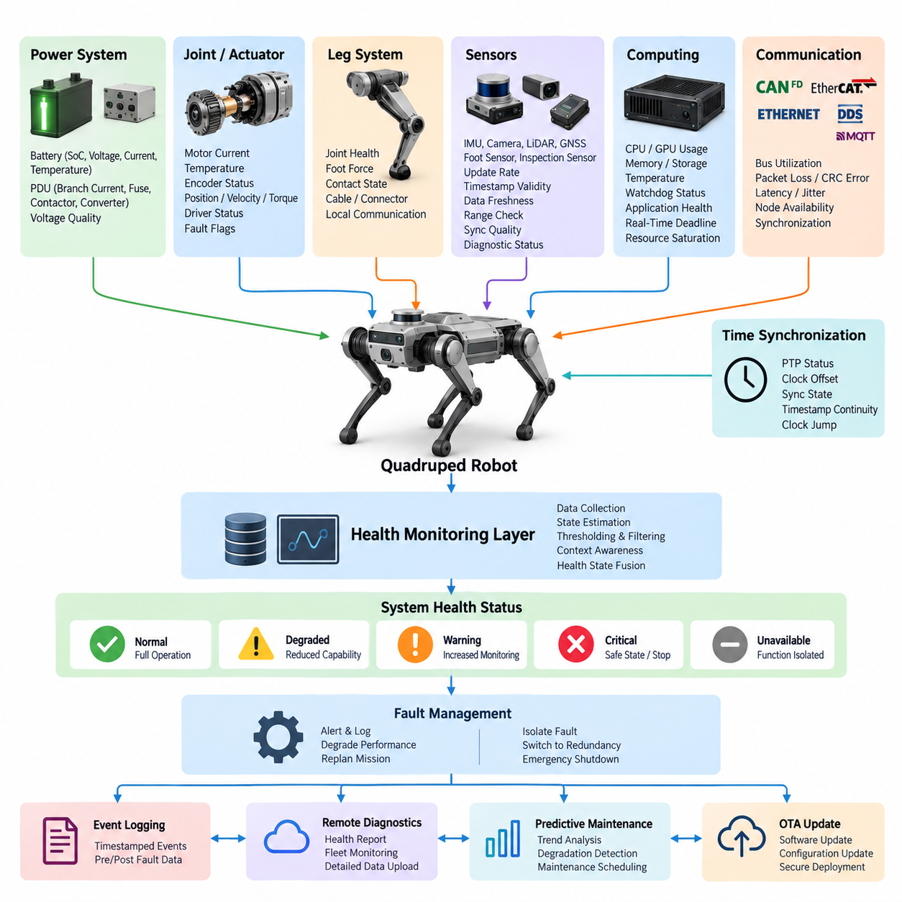
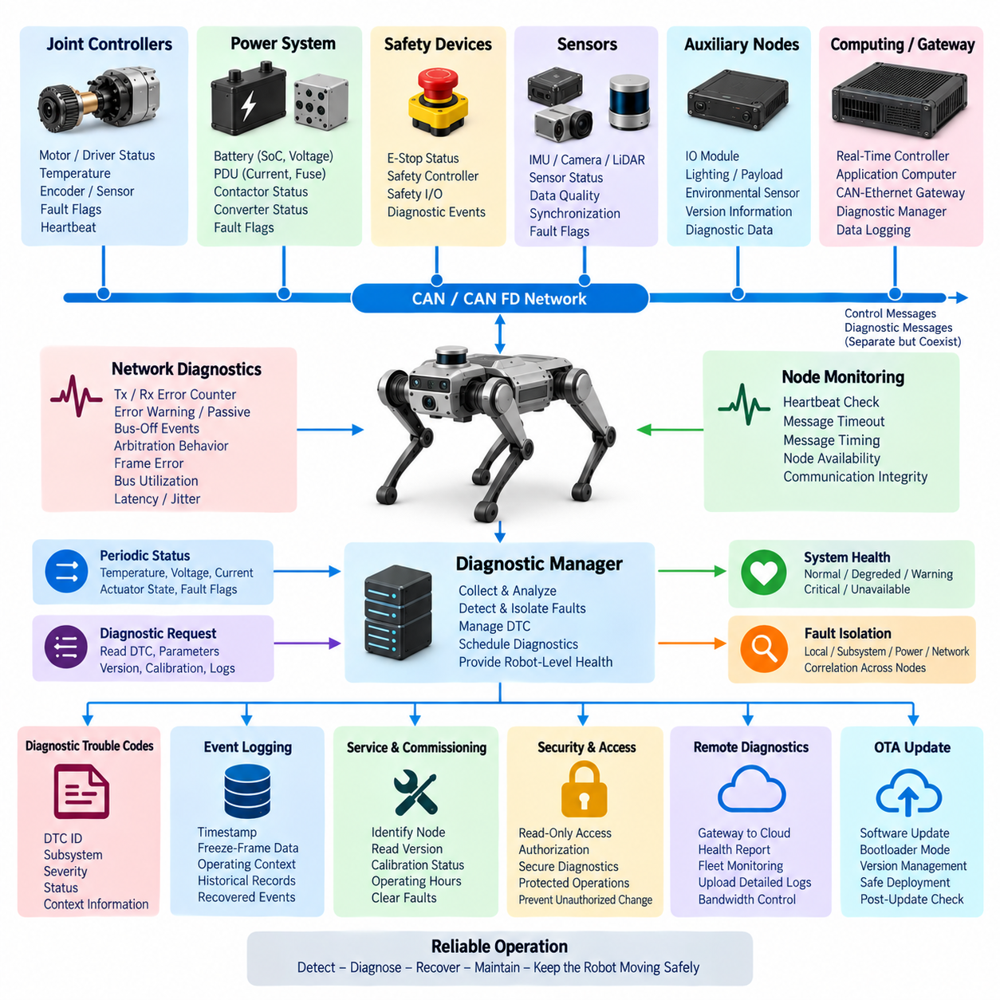
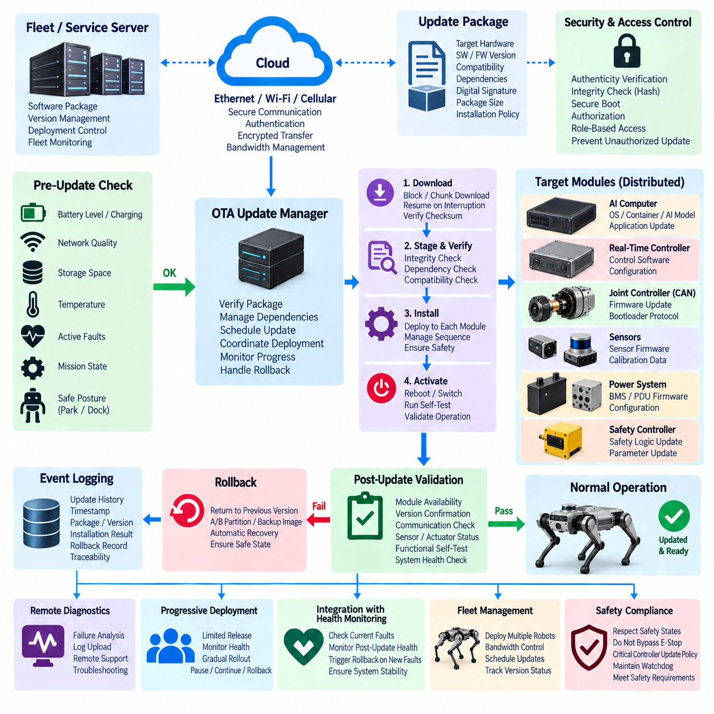
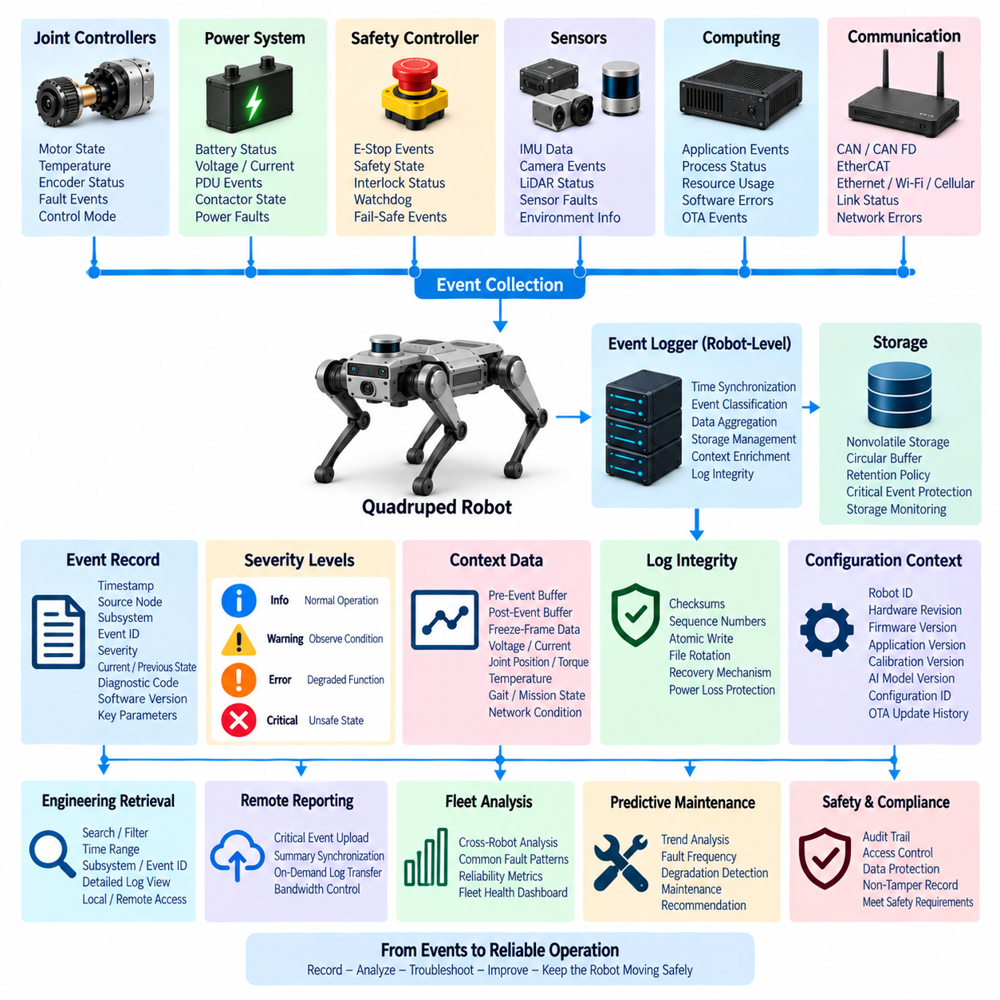
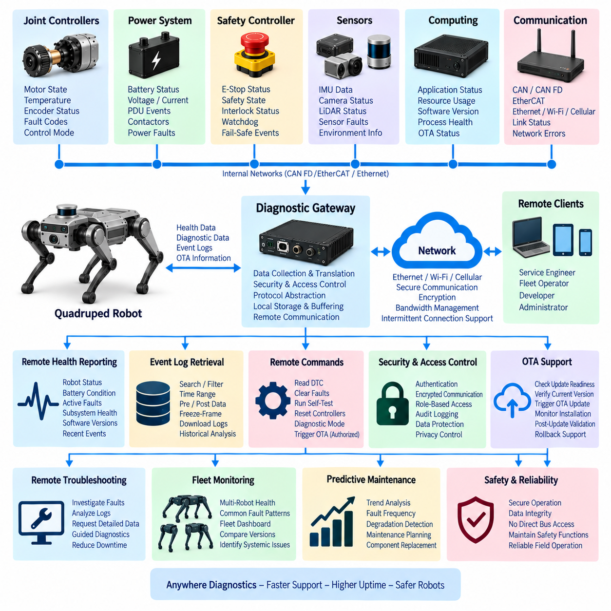
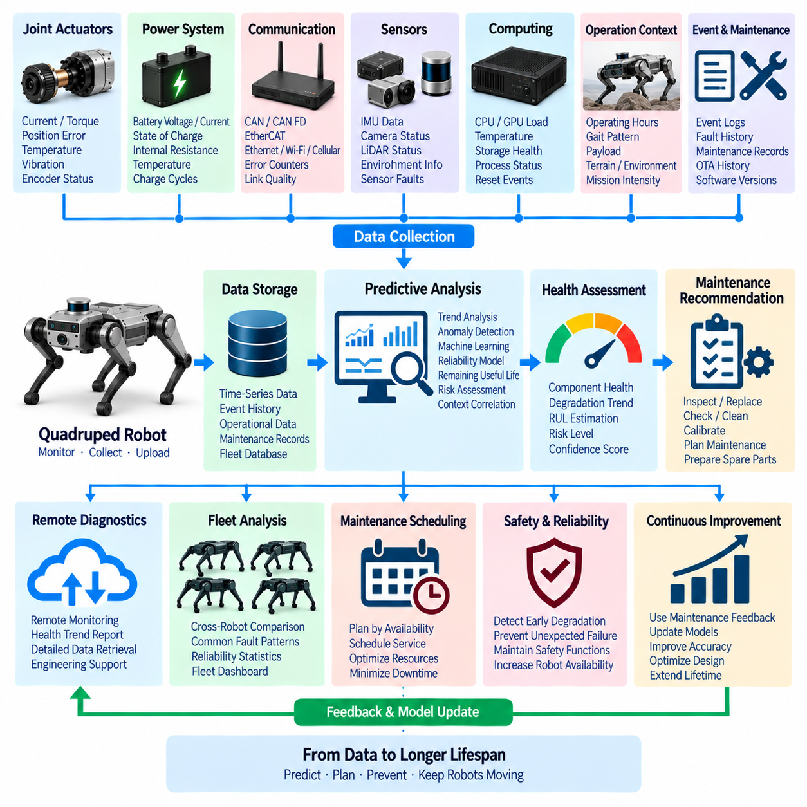

**Volume 20. Quadruped Electrical Architecture**


# Chapter 11. Diagnostics and OTA

##  

## 11.01. System Health Monitoring

{width="7.268055555555556in" height="7.268055555555556in"}

System health monitoring in a quadruped robot is the continuous observation of electrical, computational, communication, sensing, and actuator conditions that determine whether the machine can safely perform its mission. Unlike a stationary industrial system, a quadruped experiences rapidly changing loads, repeated impacts, vibration, joint motion, and environmental exposure, so health information must be evaluated continuously during operation.

A practical monitoring architecture combines information from the battery management system, power distribution unit, joint controllers, real-time controller, AI computer, sensors, communication interfaces, and safety controller. These components generate measurements and diagnostic states at different rates. The monitoring layer converts this distributed information into a coherent representation of overall robot condition rather than treating each subsystem as an isolated diagnostic domain.

Power health begins with continuous observation of battery voltage, current, state of charge, temperature, cell imbalance, insulation condition where applicable, and abnormal charge or discharge behavior. The power distribution system should additionally report branch currents, fuse or electronic protection states, contactor conditions, converter outputs, and voltage quality. Sudden voltage sag during high-torque locomotion can therefore be distinguished from persistent battery or distribution faults.

Joint health monitoring is especially important because locomotion depends on coordinated operation of multiple high-power actuators. Each joint controller can expose motor current, phase current, winding temperature, driver temperature, encoder status, commanded and measured position, velocity, estimated torque, and internal fault flags. Comparing these signals allows the system to recognize abnormal friction, overload, sensor disagreement, thermal stress, or deteriorating actuator performance before complete failure.

The leg-level monitor aggregates joint information with foot force, contact state, and local communication status. A joint that remains electrically functional may still behave abnormally when mechanical resistance, cable degradation, encoder instability, or impact damage develops. Cross-checking commanded motion against measured motion and expected contact forces therefore provides stronger diagnostic evidence than a single threshold. Repeated deviations can be classified as persistent degradation rather than transient terrain disturbances.

Sensor health requires more than checking whether data packets continue to arrive. IMUs, cameras, LiDAR, GNSS, foot sensors, and inspection sensors should be evaluated for update frequency, timestamp validity, data freshness, range plausibility, synchronization quality, and internal diagnostic status. A sensor producing stale or temporally misaligned data may be more dangerous than a completely unavailable sensor because apparently valid measurements can silently corrupt localization, perception, and control.

Computing health monitoring covers the real-time controller, Jetson or other AI processor, GPU resources, storage, memory, operating temperature, processor utilization, watchdog state, and application execution. The architecture should distinguish resource saturation from actual hardware failure. Persistent GPU overload, memory exhaustion, thermal throttling, or missed real-time deadlines can progressively reduce perception and planning capability even when the computing platform continues to respond to ordinary network requests.

Communication health must reflect the heterogeneous network architecture of the robot, including CAN FD, EtherCAT, Gigabit Ethernet, DDS/ROS 2, and other supervisory channels identified in the quadruped architecture. Monitoring can include bus utilization, packet loss, CRC errors, retransmissions, node availability, communication latency, jitter, and timeout frequency. These measurements help separate a defective endpoint from congestion, wiring degradation, synchronization failure, or network-wide disturbance.

Time synchronization is itself a health variable because distributed sensing and control depend on consistent temporal references. PTP status, clock offset, synchronization state, timestamp continuity, and detected clock jumps should therefore be monitored alongside ordinary network metrics. If synchronization accuracy moves outside an allowed operating envelope, sensor fusion and distributed control functions can be degraded or isolated even though the associated sensors and controllers remain electrically healthy.

Raw diagnostic signals become useful only when converted into interpretable health states. A hierarchical model can summarize component conditions into joint, leg, perception, compute, power, communication, and robot-level health. Typical states may represent normal operation, degraded operation, warning, critical fault, and unavailable functionality. The important principle is that state transitions should combine persistence, severity, operational context, and confidence instead of responding blindly to every instantaneous threshold crossing.

Threshold design must account for the highly dynamic behavior of quadruped locomotion. Motor current that indicates overload while standing may be completely normal during jumping, climbing, recovery, or acceleration. Battery voltage sag and processor load can also vary strongly with mission state. Health logic should therefore use operating envelopes, filtering, hysteresis, duration conditions, rate-of-change detection, and mission context to reduce false alarms while preserving rapid detection of genuinely dangerous conditions.

Watchdogs provide an independent mechanism for detecting functions that stop progressing even when ordinary diagnostic values appear valid. Hardware and software watchdogs can supervise controller execution, communication heartbeat, actuator command freshness, safety processes, and critical application loops. A missed heartbeat should not automatically imply identical responses for every subsystem; the required reaction depends on whether redundancy exists and whether the affected function is necessary for stabilization, perception, locomotion, or mission execution.

Health monitoring becomes operationally valuable when it is connected to fault management. A warning may only require logging and increased observation, while a persistent degraded condition can trigger reduced speed, restricted gait, reduced payload, sensor substitution, or mission replanning. Critical failures may require controlled stopping, stabilization, isolation of faulty power branches, transition to redundant computation, or emergency shutdown according to the functional safety architecture established for the robot.

Diagnostic information should preserve the sequence of events surrounding a failure. Health-state transitions, sensor abnormalities, power disturbances, communication errors, watchdog events, actuator faults, and software conditions should be timestamped using a common time reference. This provides the foundation for the event logging, remote diagnostics, and predictive maintenance functions that follow system health monitoring within the Diagnostics and OTA chapter structure.

Remote health reporting should transmit summarized information rather than indiscriminately streaming every internal signal. Robot identity, mission state, battery condition, subsystem health, active diagnostic codes, thermal margins, communication quality, and critical events can form a compact health report for fleet supervision. Detailed high-frequency traces can remain locally buffered and be uploaded when a significant event occurs, enabling deeper investigation without continuously consuming network bandwidth.

The monitoring architecture should also separate detection from diagnosis. Detection answers whether observed behavior has departed from its acceptable operating envelope, while diagnosis attempts to identify the likely source and propagation path. For example, several simultaneous joint undervoltage events may originate from a battery or PDU disturbance rather than independent actuator failures. Correlating events across power, communication, computing, sensing, and actuation domains reduces misleading fault conclusions.

Health history creates the transition from reactive diagnostics toward predictive maintenance, which is explicitly positioned later in the chapter structure. Trends in motor current, temperature, encoder errors, battery resistance indicators, communication error rates, connector-related intermittency, and computation margins can reveal gradual degradation. Maintenance can then be scheduled according to measured condition and accumulated stress rather than relying only on fixed service intervals.

Ultimately, system health monitoring forms the observability layer connecting the quadruped\'s electrical architecture with functional safety, diagnostics, OTA management, remote operation, and maintenance. Its purpose is not merely to report faults after they occur, but to maintain an evolving estimate of whether the robot can continue its current mission safely, whether capability should be degraded, and what evidence must be preserved for engineering analysis and future reliability improvement.

사족보행 로봇(Quadruped Robot)의 시스템 상태 모니터링(System Health Monitoring)은 로봇이 임무를 안전하게 수행할 수 있는지를 결정하는 전기(Electrical), 컴퓨팅(Computing), 통신(Communication), 센싱(Sensing), 액추에이터(Actuator) 상태를 지속적으로 관찰하는 과정이다. 고정형 산업 시스템과 달리 사족보행 로봇은 급격하게 변화하는 부하, 반복적인 충격과 진동, 관절 운동, 다양한 환경 노출을 경험하므로 운용 중에도 상태 정보를 지속적으로 평가해야 한다.

실용적인 상태 모니터링 아키텍처(Health Monitoring Architecture)는 배터리 관리 시스템(Battery Management System), 전력 분배 장치(Power Distribution Unit), 관절 제어기(Joint Controller), 실시간 제어기(Real-Time Controller), AI 컴퓨터(AI Computer), 센서(Sensor), 통신 인터페이스(Communication Interface), 안전 제어기(Safety Controller)의 정보를 통합한다. 이 구성요소들은 서로 다른 주기로 측정값과 진단 상태를 생성하며, 모니터링 계층(Monitoring Layer)은 이를 개별 진단 영역이 아닌 로봇 전체 상태를 나타내는 일관된 정보로 변환한다.

전력 상태(Power Health)는 배터리 전압, 전류, 충전 상태(State of Charge), 온도, 셀 불균형(Cell Imbalance), 필요한 경우 절연 상태(Insulation Condition), 비정상적인 충·방전 동작을 지속적으로 관찰하는 것에서 시작한다. 전력 분배 시스템(Power Distribution System)은 추가적으로 분기 전류, 퓨즈 또는 전자식 보호장치 상태, 접촉기(Contactor) 상태, 컨버터 출력, 전압 품질을 보고해야 한다. 이를 통해 고토크 보행 시 발생하는 순간적인 전압 강하와 지속적인 배터리 또는 전력 분배 계통의 고장을 구분할 수 있다.

관절 상태 모니터링(Joint Health Monitoring)은 보행이 여러 고출력 액추에이터(High-Power Actuator)의 협조 동작에 의존하기 때문에 특히 중요하다. 각 관절 제어기(Joint Controller)는 모터 전류, 상전류(Phase Current), 권선 온도, 드라이버 온도, 엔코더 상태, 명령 및 측정 위치, 속도, 추정 토크, 내부 고장 플래그(Fault Flag)를 제공할 수 있다. 이러한 신호를 비교하면 완전한 고장이 발생하기 전에 비정상 마찰, 과부하, 센서 불일치, 열적 스트레스, 액추에이터 성능 저하를 식별할 수 있다.

다리 수준 모니터링(Leg-Level Monitoring)은 관절 정보와 발 힘(Foot Force), 접촉 상태(Contact State), 로컬 통신 상태(Local Communication Status)를 통합한다. 관절이 전기적으로 정상이어도 기계적 저항, 케이블 열화, 엔코더 불안정, 충격 손상이 발생하면 비정상적으로 동작할 수 있다. 따라서 명령된 움직임과 실제 측정 움직임 및 예상 접촉력을 교차 검증(Cross-Checking)하면 단일 임계값보다 강력한 진단 근거를 확보할 수 있으며, 반복적인 편차는 일시적인 지형 영향이 아닌 지속적인 성능 열화로 분류할 수 있다.

센서 상태(Sensor Health)는 단순히 데이터 패킷(Data Packet)이 계속 수신되는지를 확인하는 것 이상으로 평가해야 한다. 관성 측정 장치(IMU), 카메라(Camera), 라이다(LiDAR), 위성항법시스템(GNSS), 발 센서(Foot Sensor), 검사 센서(Inspection Sensor)는 업데이트 주기, 타임스탬프 유효성(Timestamp Validity), 데이터 최신성(Data Freshness), 측정 범위 타당성, 동기화 품질(Synchronization Quality), 내부 진단 상태를 기준으로 평가해야 한다. 오래되거나 시간적으로 정렬되지 않은 데이터를 생성하는 센서는 겉보기에는 정상적인 측정값으로 위치추정, 인지, 제어를 조용히 손상시킬 수 있기 때문에 완전히 동작하지 않는 센서보다 더 위험할 수 있다.

컴퓨팅 상태 모니터링(Computing Health Monitoring)은 실시간 제어기(Real-Time Controller), 젯슨(Jetson) 또는 기타 AI 프로세서(AI Processor), GPU 자원, 저장장치, 메모리, 동작 온도, 프로세서 사용률, 감시 타이머(Watchdog) 상태, 애플리케이션 실행 상태를 포함한다. 아키텍처는 단순한 자원 포화(Resource Saturation)와 실제 하드웨어 고장(Hardware Failure)을 구분해야 한다. 지속적인 GPU 과부하, 메모리 고갈, 열 스로틀링(Thermal Throttling), 실시간 마감시간 초과(Missed Real-Time Deadline)는 컴퓨팅 플랫폼이 일반적인 네트워크 요청에 계속 응답하더라도 인지와 경로 계획 능력을 점진적으로 저하시킬 수 있다.

통신 상태(Communication Health)는 CAN FD, EtherCAT, 기가비트 이더넷(Gigabit Ethernet), DDS/ROS 2 및 기타 상위 관리 채널을 포함하는 로봇의 이종 네트워크 아키텍처(Heterogeneous Network Architecture)를 반영해야 한다. 모니터링 항목에는 버스 사용률(Bus Utilization), 패킷 손실, CRC 오류, 재전송, 노드 가용성(Node Availability), 통신 지연시간(Latency), 지터(Jitter), 타임아웃 발생 빈도 등이 포함될 수 있다. 이러한 측정값을 이용하면 개별 노드의 고장과 네트워크 혼잡, 배선 열화, 동기화 실패 또는 네트워크 전체의 장애를 구분할 수 있다.

분산 센싱(Distributed Sensing)과 제어가 일관된 시간 기준에 의존하기 때문에 시간 동기화(Time Synchronization) 자체도 하나의 상태 변수(Health Variable)로 관리해야 한다. PTP 상태, 클록 오프셋(Clock Offset), 동기화 상태, 타임스탬프 연속성(Timestamp Continuity), 클록 점프(Clock Jump) 발생 여부를 일반적인 네트워크 지표와 함께 감시해야 한다. 동기화 정확도가 허용 가능한 운용 범위를 벗어나면 관련 센서와 제어기가 전기적으로 정상이어도 센서 융합(Sensor Fusion)과 분산 제어 기능을 제한하거나 격리할 수 있어야 한다.

원시 진단 신호(Raw Diagnostic Signal)는 해석 가능한 상태(Health State)로 변환되어야 실질적인 의미를 가진다. 계층적 모델(Hierarchical Model)은 구성요소의 상태를 관절, 다리, 인지(Perception), 컴퓨팅, 전력, 통신 및 로봇 전체 수준의 상태로 통합할 수 있다. 대표적인 상태는 정상 운용(Normal Operation), 성능 저하 운용(Degraded Operation), 경고(Warning), 치명적 고장(Critical Fault), 기능 사용 불가(Unavailable Functionality) 등으로 구성할 수 있다. 중요한 원칙은 모든 순간적인 임계값 초과에 반응하는 것이 아니라 지속시간, 심각도, 운용 상황, 신뢰도를 함께 고려하여 상태를 전환하는 것이다.

임계값 설계(Threshold Design)는 사족보행 로봇의 매우 동적인 보행 특성을 고려해야 한다. 정지 상태에서 과부하를 의미하는 모터 전류가 점프, 등반, 자세 복구 또는 가속 중에는 정상적인 값일 수 있다. 배터리 전압 강하와 프로세서 부하 역시 임무 상태에 따라 크게 변화할 수 있다. 따라서 상태 판단 로직(Health Logic)은 오경보(False Alarm)를 줄이면서 실제 위험 상태를 신속하게 탐지하기 위해 운용 범위(Operating Envelope), 필터링, 히스테리시스(Hysteresis), 지속시간 조건, 변화율 감지(Rate-of-Change Detection), 임무 상황(Mission Context)을 함께 활용해야 한다.

감시 타이머(Watchdog)는 일반적인 진단 값이 정상으로 보이는 상황에서도 특정 기능의 실행이 중단되는 것을 탐지하는 독립적인 수단을 제공한다. 하드웨어 및 소프트웨어 감시 타이머는 제어기 실행, 통신 하트비트(Heartbeat), 액추에이터 명령의 최신성, 안전 프로세스, 핵심 애플리케이션 루프를 감독할 수 있다. 하트비트 손실에 대한 대응은 모든 서브시스템에서 동일해서는 안 되며, 중복성(Redundancy)의 존재 여부와 해당 기능이 안정화, 인지, 보행 또는 임무 수행에 필수적인지를 기준으로 결정해야 한다.

상태 모니터링은 고장 관리(Fault Management)와 연결될 때 실제 운용 가치를 갖는다. 경고 상태에서는 이벤트 기록과 강화된 모니터링만 필요할 수 있지만, 지속적인 성능 저하 상태에서는 속도 제한, 보행 패턴(Gait) 제한, 적재량 감소, 대체 센서 사용 또는 임무 재계획(Mission Replanning)을 수행할 수 있다. 치명적인 고장에서는 로봇의 기능 안전 아키텍처(Functional Safety Architecture)에 따라 제어된 정지, 자세 안정화, 고장 전력 분기의 격리, 중복 컴퓨팅으로의 전환 또는 비상 종료(Emergency Shutdown)가 요구될 수 있다.

진단 정보(Diagnostic Information)는 고장 전후의 이벤트 순서를 보존해야 한다. 상태 전환, 센서 이상, 전력 이상, 통신 오류, 감시 타이머 이벤트, 액추에이터 고장, 소프트웨어 상태에는 공통 시간 기준(Common Time Reference)을 기반으로 타임스탬프를 부여해야 한다. 이러한 정보는 시스템 상태 모니터링 이후 진단 및 OTA(Diagnostics and OTA) 체계에서 다루는 이벤트 로깅(Event Logging), 원격 진단(Remote Diagnostics), 예지 정비(Predictive Maintenance)의 기반을 제공한다.

원격 상태 보고(Remote Health Reporting)는 모든 내부 신호를 무분별하게 스트리밍하는 대신 요약된 정보를 전송해야 한다. 로봇 식별 정보, 임무 상태, 배터리 상태, 서브시스템 상태, 활성 진단 코드(Active Diagnostic Code), 열적 여유(Thermal Margin), 통신 품질, 주요 이벤트를 조합하여 플릿 관리(Fleet Supervision)를 위한 간결한 상태 보고서를 구성할 수 있다. 상세한 고주파 데이터는 로컬 버퍼(Local Buffer)에 유지하고 중요한 이벤트가 발생했을 때 업로드함으로써 네트워크 대역폭을 지속적으로 소비하지 않으면서 심층 분석을 지원할 수 있다.

모니터링 아키텍처(Monitoring Architecture)는 고장 탐지(Fault Detection)와 고장 진단(Fault Diagnosis)을 구분해야 한다. 탐지는 관찰된 동작이 허용 가능한 운용 범위를 벗어났는지를 판단하며, 진단은 그 원인과 고장 전파 경로(Fault Propagation Path)를 식별하는 과정이다. 예를 들어 여러 관절에서 동시에 저전압 이벤트가 발생했다면 각각의 액추에이터가 독립적으로 고장 난 것이 아니라 배터리 또는 전력 분배 장치(PDU)의 이상이 원인일 수 있다. 전력, 통신, 컴퓨팅, 센싱, 액추에이션 영역의 이벤트를 상호 연관시키면 잘못된 고장 판단을 줄일 수 있다.

상태 이력(Health History)은 반응형 진단(Reactive Diagnostics)을 예지 정비(Predictive Maintenance)로 발전시키는 기반을 제공한다. 모터 전류, 온도, 엔코더 오류, 배터리 내부 저항 관련 지표, 통신 오류율, 커넥터 접촉 불량과 관련된 간헐적 이상, 컴퓨팅 자원 여유 등의 장기적인 변화는 점진적인 열화를 나타낼 수 있다. 이를 이용하면 고정된 정비 주기에만 의존하지 않고 실제 측정 상태와 누적된 스트레스에 따라 유지보수 시점을 결정할 수 있다.

궁극적으로 시스템 상태 모니터링(System Health Monitoring)은 사족보행 로봇의 전기 아키텍처(Electrical Architecture)를 기능 안전(Functional Safety), 진단(Diagnostics), OTA 관리(OTA Management), 원격 운용(Remote Operation), 유지보수(Maintenance)와 연결하는 관측 가능성 계층(Observability Layer)을 형성한다. 목적은 고장이 발생한 이후 단순히 오류를 보고하는 것이 아니라, 로봇이 현재 임무를 안전하게 계속 수행할 수 있는지, 기능을 제한된 상태로 전환해야 하는지, 그리고 향후 신뢰성 향상을 위한 엔지니어링 분석에 어떠한 근거를 보존해야 하는지를 지속적으로 판단하는 데 있다.

##  

## 11.02. CAN Diagnostics [w/Code]

{width="7.268055555555556in" height="7.268055555555556in"}

CAN diagnostics in a quadruped robot provides a structured mechanism for observing, identifying, and isolating faults across distributed electronic controllers connected through CAN or CAN FD networks. Joint controllers, power modules, battery systems, safety devices, and auxiliary nodes continuously exchange operational data, while diagnostic information allows supervisory software to determine whether each node is communicating correctly and operating within its expected electrical and functional limits.

The diagnostic architecture should distinguish normal control traffic from diagnostic information without allowing diagnostic activity to interfere with deterministic motion control. Periodic status messages can report temperatures, voltages, currents, actuator states, and fault flags, while dedicated diagnostic requests retrieve detailed information when required. CAN FD is particularly useful because its larger payload capacity enables richer diagnostic records to be transferred while preserving compatibility with distributed embedded control architectures.

Network-level diagnostics begins with monitoring communication integrity. CAN controllers provide information such as transmit and receive error counters, error-warning conditions, error-passive states, bus-off events, arbitration behavior, and frame errors. These indicators reveal whether communication degradation originates from an individual node, physical wiring problem, termination fault, electromagnetic interference, excessive bus utilization, or a controller that repeatedly generates invalid traffic.

A healthy CAN node should transmit expected heartbeat or status messages within defined timing limits. The supervisory controller can maintain a node table containing expected message identifiers, update periods, timeout thresholds, and current communication states. If a joint controller stops transmitting, the system can classify it as unavailable after a defined timeout rather than waiting for higher-level locomotion software to discover the failure indirectly through missing actuator response.

CAN diagnostics should also evaluate message timing rather than checking only message presence. Increased latency, irregular transmission periods, excessive jitter, or repeated deadline violations may indicate bus saturation or deteriorating controller performance before complete communication loss occurs. Comparing observed message intervals with their configured periods allows the monitoring system to identify gradual communication degradation and provides useful evidence when diagnosing intermittent failures.

Physical-layer problems often appear as communication symptoms before they become complete network failures. Loose connectors, damaged twisted-pair wiring, incorrect termination resistance, grounding problems, water ingress, or electromagnetic interference can increase error counters and produce intermittent frame loss. Correlating CAN error statistics with robot motion, vibration, temperature, and leg position can help identify faults that occur only when a harness bends or a connector experiences mechanical stress.

Node-level diagnostics should expose internal conditions through compact status words or diagnostic messages. A joint controller may report motor overcurrent, driver overtemperature, encoder failure, torque sensor disagreement, undervoltage, overvoltage, communication timeout, or internal software faults. The battery management system and power distribution unit can similarly report battery protection events, contactor state, branch faults, converter abnormalities, and other conditions relevant to robot-level health assessment.

Diagnostic trouble codes can provide a consistent abstraction above vendor-specific fault registers. Each code should identify the affected subsystem, fault category, severity, status, and sufficient contextual information for troubleshooting. The diagnostic layer can map low-level controller faults into robot-level meanings such as actuator degraded, leg unavailable, power supply unstable, or communication unreliable. This prevents higher-level software from depending directly on hardware-specific register definitions.

Fault information should distinguish active, intermittent, historical, and recovered conditions. An active fault represents a condition currently affecting operation, while an intermittent fault records behavior that appears and disappears. Historical records preserve evidence after recovery or reboot. This distinction is important for quadruped robots because vibration, repeated impacts, dynamic harness movement, and rapidly changing actuator loads can create temporary electrical faults that cannot be reproduced easily during stationary maintenance.

Diagnostic messages should preserve contextual data around significant events. When an overcurrent or communication fault occurs, associated information such as timestamp, joint position, velocity, motor current, temperature, supply voltage, robot gait, and network state can be captured as freeze-frame data. This transforms a simple fault code into an engineering record that helps determine what the robot was doing immediately before and during the abnormal condition.

The supervisory diagnostic manager can periodically request detailed information from selected controllers while receiving lightweight status information continuously. Polling frequency should reflect fault criticality and network capacity. Safety-critical communication status may require rapid supervision, whereas detailed historical records can be retrieved at much lower rates. Diagnostic scheduling therefore needs to consider CAN bandwidth so that troubleshooting traffic never compromises actuator control or safety-related communication.

CAN FD provides additional flexibility for transferring richer diagnostic payloads, but bandwidth must still be managed carefully. High-frequency actuator control messages normally receive predictable communication opportunities, while health reports, detailed fault records, calibration information, and service data can operate at lower priorities or frequencies. Bus-load monitoring should be integrated into diagnostics so that diagnostic traffic itself cannot unintentionally create congestion during demanding locomotion conditions.

Fault isolation requires correlation across multiple CAN nodes. If one joint reports undervoltage while neighboring controllers remain normal, the problem may be local to that joint or its wiring. If several controllers simultaneously report undervoltage, the likely source moves toward the power distribution or battery domain. Similarly, simultaneous communication errors across multiple nodes may indicate a shared harness, termination, gateway, grounding, or electromagnetic compatibility problem rather than independent controller failures.

Recovery behavior must be controlled rather than allowing nodes to restart indefinitely. A controller entering bus-off may attempt recovery according to defined network rules, but repeated bus-off events should increase diagnostic severity. Automatic recovery can be appropriate for transient disturbances, whereas persistent failures may require node isolation, reduced robot capability, controlled stopping, or maintenance intervention. Recovery counters and timestamps should therefore become part of the diagnostic history.

CAN diagnostics also supports service and commissioning activities. Engineering tools can request controller identification, hardware and software versions, serial information, calibration status, operating hours, accumulated fault counts, and current diagnostic states. These capabilities allow technicians to verify that the correct controller configuration is installed and help identify mismatches between robot hardware, embedded firmware, calibration data, and higher-level software following maintenance or module replacement.

Security and access control become increasingly important when diagnostic interfaces can modify controller states or parameters. Read-only health information may be broadly accessible inside the robot, while operations such as clearing faults, changing calibration values, entering bootloader mode, or initiating software updates should require controlled authorization. Diagnostic functionality should therefore be designed as an engineering and service interface rather than an unrestricted path into safety-critical controllers.

CAN diagnostic events should be integrated with the system-wide event logging architecture. Local controller timestamps, network events, power disturbances, actuator faults, and supervisory decisions should be aligned to a consistent temporal reference whenever possible. This allows engineers to reconstruct fault propagation across the distributed system and determine whether a communication failure caused another subsystem fault or merely appeared as a consequence of an earlier electrical or mechanical problem.

Remote diagnostics can expose selected CAN information through the robot\'s higher-level communication architecture without directly extending the CAN bus outside the machine. A gateway or diagnostic manager can translate internal diagnostic states into structured reports for fleet management and service systems. Detailed CAN traces may be buffered locally and uploaded only after significant events, reducing external bandwidth while preserving valuable evidence for difficult intermittent failures.

The relationship between CAN diagnostics and system health monitoring is hierarchical. CAN diagnostics provides detailed visibility into network nodes and embedded controllers, while system health monitoring combines this information with Ethernet, computing, sensing, power, safety, and mission-level observations. Within the chapter structure, CAN diagnostics therefore forms a foundation for subsequent OTA update, event logging, remote diagnostics, and predictive maintenance capabilities.

A well-designed CAN diagnostic system ultimately converts distributed low-level electrical and communication observations into actionable information about robot capability. Instead of merely reporting that an error frame or controller fault occurred, it helps determine which component is affected, how severe the condition is, whether recovery is possible, and whether locomotion can continue safely. This makes CAN diagnostics an essential bridge between embedded joint electronics and dependable quadruped-level operation.

사족보행 로봇(Quadruped Robot)의 CAN 진단(CAN Diagnostics)은 CAN 또는 CAN FD 네트워크에 연결된 분산 전자 제어기(Distributed Electronic Controller)의 고장을 관찰하고 식별하며 격리하기 위한 체계적인 메커니즘을 제공한다. 관절 제어기(Joint Controller), 전력 모듈(Power Module), 배터리 시스템(Battery System), 안전 장치(Safety Device), 보조 노드(Auxiliary Node)는 운용 데이터를 지속적으로 교환하며, 진단 정보는 상위 감독 소프트웨어(Supervisory Software)가 각 노드의 정상 통신 여부와 전기적·기능적 운용 범위 준수 여부를 판단할 수 있도록 한다.

진단 아키텍처(Diagnostic Architecture)는 진단 활동이 결정론적 모션 제어(Deterministic Motion Control)를 방해하지 않도록 일반 제어 트래픽(Control Traffic)과 진단 정보(Diagnostic Information)를 구분해야 한다. 주기적인 상태 메시지는 온도, 전압, 전류, 액추에이터 상태, 고장 플래그(Fault Flag)를 전달하고, 전용 진단 요청(Diagnostic Request)은 필요할 때 상세 정보를 조회할 수 있다. CAN FD는 더 큰 페이로드(Payload)를 제공하므로 분산 임베디드 제어 아키텍처(Distributed Embedded Control Architecture)와의 호환성을 유지하면서 더욱 풍부한 진단 데이터를 전송하는 데 유용하다.

네트워크 수준 진단(Network-Level Diagnostics)은 통신 무결성(Communication Integrity)을 감시하는 것에서 시작한다. CAN 제어기는 송신 및 수신 오류 카운터, 오류 경고(Error Warning), 오류 수동(Error-Passive) 상태, 버스 오프(Bus-Off) 이벤트, 중재 동작(Arbitration Behavior), 프레임 오류(Frame Error) 등의 정보를 제공한다. 이러한 지표를 통해 통신 성능 저하의 원인이 개별 노드, 물리적 배선 문제, 종단 저항(Termination) 이상, 전자기 간섭(Electromagnetic Interference), 과도한 버스 사용률 또는 반복적으로 비정상 트래픽을 발생시키는 제어기인지 판단할 수 있다.

정상적인 CAN 노드(CAN Node)는 정의된 시간 범위 내에서 예상되는 하트비트(Heartbeat) 또는 상태 메시지를 전송해야 한다. 상위 감독 제어기(Supervisory Controller)는 예상 메시지 식별자(Message Identifier), 업데이트 주기, 타임아웃 임계값(Timeout Threshold), 현재 통신 상태를 포함하는 노드 테이블(Node Table)을 유지할 수 있다. 관절 제어기가 메시지 전송을 중단하면 상위 보행 소프트웨어가 액추에이터 응답 누락을 통해 간접적으로 고장을 발견할 때까지 기다리지 않고 정의된 타임아웃 이후 해당 노드를 사용 불가 상태로 분류할 수 있다.

CAN 진단은 메시지 존재 여부뿐만 아니라 메시지 타이밍(Message Timing)도 평가해야 한다. 증가하는 지연시간(Latency), 불규칙한 전송 주기, 과도한 지터(Jitter), 반복적인 마감시간 위반(Deadline Violation)은 통신이 완전히 중단되기 전에 버스 포화(Bus Saturation) 또는 제어기 성능 저하를 나타낼 수 있다. 실제 메시지 간격을 설정된 주기와 비교하면 점진적인 통신 성능 저하를 식별할 수 있으며, 간헐적 고장(Intermittent Failure)을 진단할 때 유용한 근거를 제공할 수 있다.

물리 계층(Physical Layer)의 문제는 네트워크가 완전히 고장 나기 전에 통신 이상으로 나타나는 경우가 많다. 느슨한 커넥터, 손상된 연선(Twisted-Pair) 배선, 잘못된 종단 저항, 접지 문제, 수분 침투(Water Ingress), 전자기 간섭은 오류 카운터를 증가시키고 간헐적인 프레임 손실을 발생시킬 수 있다. CAN 오류 통계를 로봇의 움직임, 진동, 온도, 다리 위치와 연계하면 하네스가 굽혀지거나 커넥터에 기계적 스트레스가 발생할 때만 나타나는 고장을 식별하는 데 도움이 된다.

노드 수준 진단(Node-Level Diagnostics)은 간결한 상태 워드(Status Word) 또는 진단 메시지를 통해 내부 상태를 제공해야 한다. 관절 제어기는 모터 과전류, 드라이버 과열, 엔코더 고장, 토크 센서 불일치, 저전압, 과전압, 통신 타임아웃, 내부 소프트웨어 고장 등을 보고할 수 있다. 배터리 관리 시스템(Battery Management System)과 전력 분배 장치(Power Distribution Unit)도 배터리 보호 이벤트, 접촉기(Contactor) 상태, 분기 회로 고장, 컨버터 이상 및 로봇 전체 상태 평가에 필요한 기타 조건을 보고할 수 있다.

진단 고장 코드(Diagnostic Trouble Code)는 제조사별 고장 레지스터(Vendor-Specific Fault Register)보다 상위 수준에서 일관된 추상화를 제공할 수 있다. 각 코드는 영향을 받는 서브시스템, 고장 유형, 심각도, 상태 및 문제 해결에 필요한 충분한 상황 정보를 식별해야 한다. 진단 계층(Diagnostic Layer)은 저수준 제어기 고장을 액추에이터 성능 저하, 다리 사용 불가, 전원 공급 불안정, 통신 신뢰성 저하 등의 로봇 수준 의미로 변환할 수 있다. 이를 통해 상위 소프트웨어가 하드웨어별 레지스터 정의에 직접 의존하는 것을 방지할 수 있다.

고장 정보(Fault Information)는 활성(Active), 간헐적(Intermittent), 이력(Historical), 복구(Recovered) 상태를 구분해야 한다. 활성 고장은 현재 운용에 영향을 미치는 상태를 의미하고, 간헐적 고장은 나타났다가 사라지는 동작을 기록한다. 이력 정보는 복구 또는 재부팅 이후에도 고장의 증거를 보존한다. 사족보행 로봇에서는 진동, 반복적인 충격, 동적 하네스 움직임, 급격하게 변화하는 액추에이터 부하가 정지 상태의 유지보수 과정에서는 쉽게 재현되지 않는 일시적인 전기적 고장을 발생시킬 수 있으므로 이러한 구분이 중요하다.

진단 메시지는 중요한 이벤트 주변의 상황 데이터(Contextual Data)를 보존해야 한다. 과전류 또는 통신 고장이 발생하면 타임스탬프(Timestamp), 관절 위치, 속도, 모터 전류, 온도, 공급 전압, 로봇 보행 상태(Gait), 네트워크 상태 등의 관련 정보를 프리즈 프레임 데이터(Freeze-Frame Data)로 저장할 수 있다. 이를 통해 단순한 고장 코드를 로봇이 비정상 상태 발생 직전과 발생 중에 무엇을 수행하고 있었는지 분석할 수 있는 엔지니어링 기록(Engineering Record)으로 확장할 수 있다.

상위 진단 관리자(Supervisory Diagnostic Manager)는 경량 상태 정보(Lightweight Status Information)를 지속적으로 수신하면서 선택된 제어기에 상세 정보를 주기적으로 요청할 수 있다. 폴링 주기(Polling Frequency)는 고장의 중요도와 네트워크 용량을 고려해야 한다. 안전 필수 통신 상태는 빠른 감시가 필요할 수 있지만 상세 이력 정보는 훨씬 낮은 빈도로 조회할 수 있다. 따라서 진단 스케줄링(Diagnostic Scheduling)은 문제 해결용 트래픽이 액추에이터 제어 또는 안전 관련 통신을 방해하지 않도록 CAN 대역폭을 고려해야 한다.

CAN FD는 더욱 풍부한 진단 페이로드(Diagnostic Payload)를 전송할 수 있는 유연성을 제공하지만 대역폭은 여전히 신중하게 관리해야 한다. 고주파 액추에이터 제어 메시지는 일반적으로 예측 가능한 통신 기회를 우선적으로 확보해야 하며, 상태 보고, 상세 고장 기록, 캘리브레이션(Calibration) 정보, 서비스 데이터는 낮은 우선순위 또는 낮은 주기로 운용할 수 있다. 진단 트래픽 자체가 높은 동적 보행 조건에서 의도하지 않은 네트워크 혼잡을 발생시키지 않도록 버스 부하 모니터링(Bus-Load Monitoring)을 진단 기능에 통합해야 한다.

고장 격리(Fault Isolation)를 위해서는 여러 CAN 노드의 정보를 상호 연관시켜야 한다. 하나의 관절에서 저전압을 보고하지만 인접 제어기들이 정상이라면 해당 관절 또는 배선의 국부적인 문제가 원인일 수 있다. 여러 제어기가 동시에 저전압을 보고하면 원인의 가능성은 전력 분배 또는 배터리 영역으로 이동한다. 마찬가지로 여러 노드에서 동시에 통신 오류가 발생한다면 개별 제어기 고장보다는 공통 하네스, 종단 저항, 게이트웨이(Gateway), 접지 또는 전자기 적합성(Electromagnetic Compatibility) 문제가 원인일 가능성이 높다.

복구 동작(Recovery Behavior)은 노드가 무제한으로 재시작하도록 허용하는 대신 제어된 방식으로 관리해야 한다. 버스 오프(Bus-Off) 상태에 진입한 제어기는 정의된 네트워크 규칙에 따라 복구를 시도할 수 있지만, 반복적인 버스 오프 이벤트가 발생하면 진단 심각도(Diagnostic Severity)를 높여야 한다. 일시적인 장애에는 자동 복구가 적절할 수 있지만 지속적인 고장은 노드 격리, 로봇 기능 제한, 제어된 정지 또는 유지보수 개입으로 이어질 수 있다. 따라서 복구 횟수와 타임스탬프도 진단 이력에 포함되어야 한다.

CAN 진단은 서비스(Service) 및 시운전(Commissioning) 활동도 지원한다. 엔지니어링 도구(Engineering Tool)는 제어기 식별 정보, 하드웨어 및 소프트웨어 버전, 일련번호, 캘리브레이션 상태, 누적 운용 시간, 누적 고장 횟수, 현재 진단 상태를 요청할 수 있다. 이러한 기능을 통해 기술자는 올바른 제어기 구성이 설치되었는지 확인하고 유지보수 또는 모듈 교체 이후 로봇 하드웨어, 임베디드 펌웨어(Embedded Firmware), 캘리브레이션 데이터, 상위 소프트웨어 사이의 불일치를 식별할 수 있다.

진단 인터페이스(Diagnostic Interface)를 통해 제어기 상태나 파라미터를 변경할 수 있다면 보안(Security)과 접근 제어(Access Control)의 중요성이 더욱 커진다. 읽기 전용 상태 정보는 로봇 내부에서 비교적 폭넓게 접근할 수 있지만, 고장 코드 삭제, 캘리브레이션 값 변경, 부트로더 모드(Bootloader Mode) 진입 또는 소프트웨어 업데이트 시작과 같은 작업은 통제된 인증(Authorization)을 요구해야 한다. 따라서 진단 기능은 안전 필수 제어기로 자유롭게 접근할 수 있는 경로가 아니라 엔지니어링 및 서비스 인터페이스로 설계해야 한다.

CAN 진단 이벤트는 시스템 전체 이벤트 로깅 아키텍처(Event Logging Architecture)와 통합되어야 한다. 로컬 제어기의 타임스탬프, 네트워크 이벤트, 전력 이상, 액추에이터 고장, 상위 감독 시스템의 결정은 가능한 경우 일관된 시간 기준(Consistent Temporal Reference)에 맞추어 정렬해야 한다. 이를 통해 엔지니어는 분산 시스템 전체에서 고장 전파(Fault Propagation)를 재구성하고 통신 고장이 다른 서브시스템의 고장을 발생시켰는지 또는 이전에 발생한 전기적·기계적 문제의 결과로 나타났는지를 판단할 수 있다.

원격 진단(Remote Diagnostics)은 CAN 버스를 로봇 외부로 직접 확장하지 않고도 상위 통신 아키텍처를 통해 선택된 CAN 정보를 제공할 수 있다. 게이트웨이(Gateway) 또는 진단 관리자(Diagnostic Manager)는 내부 진단 상태를 플릿 관리(Fleet Management)와 서비스 시스템을 위한 구조화된 보고서(Structured Report)로 변환할 수 있다. 상세한 CAN 트레이스(CAN Trace)는 로컬에 버퍼링하고 중요한 이벤트 이후에만 업로드함으로써 외부 통신 대역폭을 줄이면서 분석하기 어려운 간헐적 고장에 대한 중요한 증거를 보존할 수 있다.

CAN 진단과 시스템 상태 모니터링(System Health Monitoring)의 관계는 계층적이다. CAN 진단은 네트워크 노드와 임베디드 제어기의 상세 상태를 제공하며, 시스템 상태 모니터링은 이를 이더넷(Ethernet), 컴퓨팅, 센싱, 전력, 안전 및 임무 수준의 관찰 정보와 결합한다. 따라서 CAN 진단은 이후의 OTA 업데이트(OTA Update), 이벤트 로깅(Event Logging), 원격 진단(Remote Diagnostics), 예지 정비(Predictive Maintenance) 기능을 구현하기 위한 기반을 형성한다.

잘 설계된 CAN 진단 시스템(CAN Diagnostic System)은 궁극적으로 분산된 저수준 전기 및 통신 관찰 정보를 로봇의 실제 운용 능력을 판단할 수 있는 실행 가능한 정보(Actionable Information)로 변환한다. 단순히 오류 프레임(Error Frame)이나 제어기 고장이 발생했다는 사실을 보고하는 것에 그치지 않고, 어떤 구성요소가 영향을 받았는지, 상태가 얼마나 심각한지, 복구가 가능한지, 그리고 보행을 안전하게 계속할 수 있는지를 판단하도록 지원한다. 이러한 이유로 CAN 진단은 임베디드 관절 전자장치(Embedded Joint Electronics)와 신뢰성 높은 사족보행 로봇 운용을 연결하는 핵심적인 가교 역할을 한다.

##  

## 11.03. OTA Update [w/Code]

{width="7.268055555555556in" height="7.268055555555556in"}

OTA update in a quadruped robot provides a controlled mechanism for distributing new software, firmware, configuration, and selected calibration data without physically connecting service equipment to every electronic module. Because the robot contains distributed joint controllers, real-time controllers, AI computers, gateways, sensors, and power-management devices, OTA must be treated as a system-level engineering function rather than a simple file-transfer process.

The OTA architecture normally separates external update distribution from the robot\'s internal deployment network. A fleet or service server can deliver an approved software package to the robot through Ethernet, Wi-Fi, cellular, or another secure communication channel. The onboard update manager then verifies the package and coordinates installation across internal computing platforms and embedded controllers without exposing low-level CAN or EtherCAT devices directly to external networks.

Every update package should carry sufficient metadata to determine exactly what is being installed. Typical information includes target hardware, software version, firmware version, compatibility requirements, package size, cryptographic integrity information, dependencies, and installation policy. The robot should reject a package intended for an incompatible controller or hardware revision before any modification begins, preventing configuration mismatches from propagating into safety-critical subsystems.

Package authenticity and integrity are fundamental requirements because an update mechanism can modify executable software controlling physical motion. Digital signatures allow the robot to verify that an update originates from an authorized source, while cryptographic hashes detect accidental or malicious modification during storage and transmission. Secure boot and trusted software verification can extend this chain of trust from package delivery through startup of the newly installed software.

The update manager should evaluate robot operating conditions before beginning deployment. Battery state of charge, charging status, network quality, available storage, thermal condition, active faults, mission state, and robot posture may all influence whether an update is safe to execute. Updating critical controllers during walking, climbing, inspection, or payload transport should normally be prohibited, while a stable parked or docked condition provides a more appropriate maintenance state.

Download and installation should be treated as separate phases. Large packages can be downloaded while the robot remains operational if bandwidth and storage permit, but activation can be delayed until an approved maintenance window. Staging the package locally allows integrity verification, dependency checking, and compatibility validation to occur before existing software is modified, reducing the time during which the robot must remain unavailable for service.

A robust OTA design should tolerate interrupted communication. Update packages can be divided into blocks or chunks so that transmission resumes from the last successfully received portion rather than restarting the entire download. Checksums or hashes can verify individual blocks and the complete package. This capability is especially important for mobile robots operating through wireless networks where temporary signal loss, roaming, interference, or limited coverage can interrupt connectivity.

Different computing domains require different deployment mechanisms. An AI computer may update operating-system components, containers, perception models, planning software, or application services, while an embedded joint controller may require a compact firmware image transferred through a bootloader. The OTA manager therefore coordinates heterogeneous update procedures while presenting a consistent robot-level view of package state, progress, success, failure, and recovery.

CAN-connected controllers require particular care because firmware transfer shares network resources with control and diagnostic communication. The gateway or diagnostic manager can place selected nodes into an authorized programming state and transfer firmware through a defined bootloader protocol. Update scheduling must prevent programming traffic from disrupting critical communication, and controllers required for stabilization or locomotion should only be reprogrammed when the robot is in a safe non-operational state.

Version management should preserve relationships between distributed components rather than considering each controller independently. A new locomotion controller may require specific joint firmware, sensor interfaces, calibration formats, or communication definitions. The OTA system should therefore maintain a compatibility matrix or dependency policy that prevents partial combinations known to be invalid and ensures that the deployed robot configuration represents a tested software and firmware baseline.

Atomic update concepts are valuable when several components must change together. The system can first stage all required packages, verify their compatibility, and only then initiate coordinated activation. If one required component cannot be prepared successfully, activation of the remaining components can be cancelled. This prevents a robot from entering an unintended mixed-version state in which individual modules operate correctly but their interfaces are mutually incompatible.

Rollback capability is essential for recovering from an update that installs successfully but fails during operation. Computing platforms can use dual partitions, A/B system images, container versioning, or retained previous packages to preserve a known-good software state. Embedded controllers can similarly maintain a recovery bootloader or alternate image where resources permit. If startup validation fails, the system can automatically return to the previously approved configuration.

Post-update validation determines whether installation success actually corresponds to operational readiness. The robot should verify controller availability, expected software versions, communication interfaces, sensor status, actuator diagnostics, configuration consistency, and essential application processes after restart. Critical functions can perform self-tests before motion is enabled. Only after these checks pass should the update state transition from installed to operationally accepted.

Health monitoring and OTA should therefore be tightly connected. Existing active faults may block an update, while new faults appearing immediately after installation can trigger rollback or quarantine of the new version. System health information provides evidence that the updated configuration remains stable across power, communication, sensing, computing, and actuator domains. This relationship prevents OTA success from being defined merely as successful transfer and reboot.

Event logging should record the complete OTA lifecycle. Relevant records include update request time, package identity, previous and target versions, authorization result, download status, integrity verification, installation progress, reboot events, validation results, rollback activity, and final system state. Timestamped records allow engineers to correlate newly observed faults with software changes and provide traceability when investigating field incidents or fleet-wide reliability issues.

Remote diagnostics becomes especially valuable when an OTA operation fails. Service personnel should be able to determine whether failure occurred during download, signature verification, storage preparation, bootloader communication, installation, restart, or post-update validation. Detailed logs can remain on the robot and be uploaded on demand, allowing engineers to investigate the problem without requiring immediate physical access to a robot operating at a remote industrial or inspection site.

Fleet deployment should avoid updating every robot simultaneously. A new release can first be deployed to a limited group of robots and observed through system health monitoring and event logging before broader distribution. Progressive deployment reduces fleet-level risk because unexpected software behavior can be detected while most robots remain on the previous validated version. Deployment can then continue, pause, or roll back according to observed health indicators.

OTA bandwidth management is important when many robots share the same wireless or facility network. Packages can be downloaded during low-traffic periods, cached locally, rate-limited, or distributed according to fleet priority. The update manager should prevent large software transfers from degrading teleoperation, safety supervision, mission communication, or other operational traffic. Download priority and activation priority should therefore be independently controlled.

Access control must distinguish ordinary monitoring from privileged software modification. Reading robot health or version information may require relatively limited authority, while installing firmware, entering bootloader mode, changing protected configuration, or approving rollback should require stronger authentication and authorization. Credentials, update permissions, and package-signing authority should be managed so that unauthorized software cannot be introduced through maintenance interfaces.

Safety architecture places additional constraints on OTA because some controllers directly influence actuator torque, emergency behavior, power isolation, or stabilization. Updates affecting these functions require stricter compatibility verification and post-installation testing than ordinary application software. The OTA manager should respect subsystem criticality and prevent software deployment from bypassing safety states, emergency-stop behavior, watchdog supervision, or other independent protective mechanisms.

The relationship between OTA, CAN diagnostics, and subsequent diagnostic functions is therefore continuous. CAN diagnostics identifies controller versions and fault conditions before deployment, OTA modifies approved software, event logging preserves the update history, and remote diagnostics provides field visibility afterward. Predictive maintenance can further use this history to distinguish hardware degradation from behavior introduced by software or configuration changes within the distributed robot architecture.

A dependable OTA system ultimately manages the complete transition from one validated robot configuration to another. It must answer not only whether a package was downloaded, but whether it was authentic, compatible, safely installed, successfully activated, verified across dependent subsystems, and recoverable if problems appear. By combining secure delivery, controlled deployment, validation, rollback, diagnostics, and traceability, OTA becomes a core lifecycle capability for maintaining reliable quadruped robots in the field.

사족보행 로봇(Quadruped Robot)의 OTA 업데이트(OTA Update)는 모든 전자 모듈에 서비스 장비를 물리적으로 연결하지 않고도 새로운 소프트웨어, 펌웨어(Firmware), 구성(Configuration), 선택된 캘리브레이션 데이터(Calibration Data)를 배포하기 위한 제어된 메커니즘을 제공한다. 로봇에는 분산된 관절 제어기, 실시간 제어기, AI 컴퓨터, 게이트웨이(Gateway), 센서, 전력 관리 장치가 포함되므로 OTA는 단순한 파일 전송 과정이 아니라 시스템 수준 엔지니어링 기능(System-Level Engineering Function)으로 다루어야 한다.

OTA 아키텍처(OTA Architecture)는 일반적으로 외부 업데이트 배포(External Update Distribution)와 로봇 내부 배포 네트워크(Internal Deployment Network)를 분리한다. 플릿(Fleet) 또는 서비스 서버(Service Server)는 이더넷(Ethernet), Wi-Fi, 셀룰러(Cellular) 또는 기타 보안 통신 채널을 통해 승인된 소프트웨어 패키지를 로봇에 전달할 수 있다. 온보드 업데이트 관리자(Onboard Update Manager)는 패키지를 검증한 후 저수준 CAN 또는 EtherCAT 장치를 외부 네트워크에 직접 노출하지 않고 내부 컴퓨팅 플랫폼과 임베디드 제어기(Embedded Controller)의 설치를 조정한다.

모든 업데이트 패키지(Update Package)는 무엇이 설치되는지를 정확하게 판단할 수 있는 충분한 메타데이터(Metadata)를 포함해야 한다. 일반적인 정보에는 대상 하드웨어, 소프트웨어 버전, 펌웨어 버전, 호환성 요구사항, 패키지 크기, 암호학적 무결성 정보(Cryptographic Integrity Information), 의존성(Dependency), 설치 정책이 포함된다. 로봇은 변경 작업이 시작되기 전에 호환되지 않는 제어기나 하드웨어 리비전(Hardware Revision)을 대상으로 하는 패키지를 거부하여 안전 필수 서브시스템(Safety-Critical Subsystem)으로 구성 불일치가 전파되는 것을 방지해야 한다.

업데이트 메커니즘은 물리적 움직임을 제어하는 실행 소프트웨어를 변경할 수 있기 때문에 패키지 인증성(Authenticity)과 무결성(Integrity)은 기본적인 요구사항이다. 디지털 서명(Digital Signature)을 이용하면 업데이트가 승인된 출처에서 제공되었는지 검증할 수 있으며, 암호학적 해시(Cryptographic Hash)는 저장 및 전송 과정에서 발생한 우발적 또는 악의적인 변경을 탐지할 수 있다. 보안 부팅(Secure Boot)과 신뢰 소프트웨어 검증(Trusted Software Verification)은 패키지 전달부터 새로 설치된 소프트웨어의 시작까지 신뢰 체인(Chain of Trust)을 확장할 수 있다.

업데이트 관리자(Update Manager)는 배포를 시작하기 전에 로봇의 운용 조건을 평가해야 한다. 배터리 충전 상태(State of Charge), 충전 여부, 네트워크 품질, 사용 가능한 저장공간, 열 상태(Thermal Condition), 활성 고장(Active Fault), 임무 상태, 로봇 자세 등이 업데이트의 안전한 실행 여부에 영향을 줄 수 있다. 보행, 등반, 검사 또는 화물 운반 중에는 핵심 제어기의 업데이트를 일반적으로 금지해야 하며, 안정적으로 주차되거나 도킹된 상태(Parked or Docked State)가 더욱 적절한 유지보수 조건을 제공한다.

다운로드(Download)와 설치(Installation)는 서로 분리된 단계로 다루어야 한다. 대용량 패키지는 대역폭과 저장공간이 허용된다면 로봇이 운용 중일 때 다운로드할 수 있지만, 활성화(Activation)는 승인된 유지보수 시간까지 지연할 수 있다. 패키지를 로컬에 스테이징(Staging)하면 기존 소프트웨어를 변경하기 전에 무결성 검증, 의존성 확인, 호환성 검증을 수행할 수 있으므로 로봇이 서비스를 위해 사용 불가능한 상태로 유지되어야 하는 시간을 줄일 수 있다.

견고한 OTA 설계(Robust OTA Design)는 통신 중단을 허용할 수 있어야 한다. 업데이트 패키지를 블록(Block) 또는 청크(Chunk) 단위로 분할하면 전체 다운로드를 처음부터 다시 시작하지 않고 마지막으로 정상 수신된 지점부터 전송을 재개할 수 있다. 체크섬(Checksum) 또는 해시(Hash)를 사용하여 개별 블록과 전체 패키지를 검증할 수 있다. 이러한 기능은 일시적인 신호 손실, 로밍(Roaming), 간섭 또는 제한된 통신 범위로 연결이 중단될 수 있는 무선 네트워크 환경의 이동 로봇에서 특히 중요하다.

서로 다른 컴퓨팅 영역(Computing Domain)은 서로 다른 배포 메커니즘을 필요로 한다. AI 컴퓨터는 운영체제 구성요소, 컨테이너(Container), 인지 모델(Perception Model), 경로 계획 소프트웨어 또는 애플리케이션 서비스를 업데이트할 수 있지만, 임베디드 관절 제어기는 부트로더(Bootloader)를 통해 전송되는 소형 펌웨어 이미지를 필요로 할 수 있다. 따라서 OTA 관리자는 이질적인 업데이트 절차를 조정하면서 패키지 상태, 진행률, 성공, 실패, 복구에 대한 일관된 로봇 수준 정보를 제공해야 한다.

CAN 연결 제어기(CAN-Connected Controller)는 펌웨어 전송이 제어 및 진단 통신과 네트워크 자원을 공유하기 때문에 특별한 주의가 필요하다. 게이트웨이 또는 진단 관리자(Diagnostic Manager)는 선택된 노드를 승인된 프로그래밍 상태(Programming State)로 전환하고 정의된 부트로더 프로토콜(Bootloader Protocol)을 통해 펌웨어를 전송할 수 있다. 업데이트 트래픽이 중요 통신을 방해하지 않도록 스케줄링해야 하며, 안정화 또는 보행에 필요한 제어기는 로봇이 안전한 비운용 상태에 있을 때만 다시 프로그래밍해야 한다.

버전 관리(Version Management)는 각각의 제어기를 독립적으로 관리하기보다 분산 구성요소 사이의 관계를 보존해야 한다. 새로운 보행 제어기(Locomotion Controller)는 특정 관절 펌웨어, 센서 인터페이스, 캘리브레이션 형식 또는 통신 정의를 요구할 수 있다. 따라서 OTA 시스템은 호환성 매트릭스(Compatibility Matrix) 또는 의존성 정책(Dependency Policy)을 유지하여 유효하지 않은 부분 조합을 방지하고, 배포된 로봇 구성이 검증된 소프트웨어 및 펌웨어 기준선(Validated Baseline)을 나타내도록 해야 한다.

여러 구성요소를 함께 변경해야 할 때는 원자적 업데이트(Atomic Update) 개념이 유용하다. 시스템은 필요한 모든 패키지를 먼저 스테이징하고 호환성을 검증한 후에만 조정된 활성화를 시작할 수 있다. 필수 구성요소 중 하나라도 성공적으로 준비되지 못하면 나머지 구성요소의 활성화를 취소할 수 있다. 이를 통해 개별 모듈은 정상적으로 동작하지만 서로의 인터페이스가 호환되지 않는 의도하지 않은 혼합 버전 상태(Mixed-Version State)로 로봇이 진입하는 것을 방지할 수 있다.

롤백 기능(Rollback Capability)은 설치 자체는 성공했지만 실제 운용에서 실패하는 업데이트로부터 복구하기 위해 필수적이다. 컴퓨팅 플랫폼은 이중 파티션(Dual Partition), A/B 시스템 이미지(A/B System Image), 컨테이너 버전 관리 또는 이전 패키지 보존을 이용하여 정상 동작이 확인된 소프트웨어 상태(Known-Good Software State)를 유지할 수 있다. 임베디드 제어기도 자원이 허용된다면 복구 부트로더(Recovery Bootloader) 또는 대체 이미지를 유지할 수 있으며, 시작 검증에 실패하면 이전에 승인된 구성으로 자동 복귀할 수 있다.

업데이트 후 검증(Post-Update Validation)은 설치 성공이 실제 운용 준비 상태(Operational Readiness)를 의미하는지를 판단한다. 로봇은 재시작 이후 제어기 가용성, 예상 소프트웨어 버전, 통신 인터페이스, 센서 상태, 액추에이터 진단, 구성 일관성(Configuration Consistency), 필수 애플리케이션 프로세스를 검증해야 한다. 핵심 기능은 움직임을 허용하기 전에 자체 시험(Self-Test)을 수행할 수 있으며, 이러한 검사를 모두 통과한 이후에만 업데이트 상태를 설치 완료에서 운용 승인(Operationally Accepted) 상태로 전환해야 한다.

따라서 상태 모니터링(Health Monitoring)과 OTA는 긴밀하게 연결되어야 한다. 기존의 활성 고장은 업데이트 실행을 차단할 수 있으며, 설치 직후 새로운 고장이 나타나면 롤백 또는 새 버전의 격리(Quarantine)를 실행할 수 있다. 시스템 상태 정보(System Health Information)는 업데이트된 구성이 전력, 통신, 센싱, 컴퓨팅, 액추에이터 영역에서 안정적으로 유지되는지를 판단할 수 있는 근거를 제공한다. 이를 통해 단순히 전송과 재부팅에 성공했다는 사실만으로 OTA 성공을 정의하는 것을 방지한다.

이벤트 로깅(Event Logging)은 전체 OTA 수명주기(OTA Lifecycle)를 기록해야 한다. 관련 기록에는 업데이트 요청 시간, 패키지 식별 정보, 이전 및 대상 버전, 인증 결과, 다운로드 상태, 무결성 검증, 설치 진행 상황, 재부팅 이벤트, 검증 결과, 롤백 동작, 최종 시스템 상태가 포함된다. 타임스탬프가 포함된 기록은 엔지니어가 새롭게 관찰된 고장과 소프트웨어 변경 사이의 관계를 분석할 수 있도록 하며, 현장 사고나 플릿 전체의 신뢰성 문제를 조사할 때 추적성(Traceability)을 제공한다.

OTA 작업이 실패할 경우 원격 진단(Remote Diagnostics)은 특히 중요한 역할을 한다. 서비스 담당자는 실패가 다운로드, 서명 검증(Signature Verification), 저장공간 준비, 부트로더 통신, 설치, 재시작 또는 업데이트 후 검증 중 어느 단계에서 발생했는지 확인할 수 있어야 한다. 상세 로그는 로봇에 유지하고 필요할 때 업로드할 수 있으며, 이를 통해 원격 산업 현장이나 검사 현장에서 운용되는 로봇에 즉시 물리적으로 접근하지 않고도 엔지니어가 문제를 조사할 수 있다.

플릿 배포(Fleet Deployment)에서는 모든 로봇을 동시에 업데이트하는 것을 피해야 한다. 새로운 릴리스(Release)를 먼저 제한된 수의 로봇에 배포하고 시스템 상태 모니터링과 이벤트 로깅을 통해 관찰한 후 더 넓은 범위로 배포할 수 있다. 점진적 배포(Progressive Deployment)는 대부분의 로봇을 이전의 검증된 버전에 유지한 상태에서 예상하지 못한 소프트웨어 동작을 탐지할 수 있으므로 플릿 수준의 위험을 감소시킨다. 관찰된 상태 지표에 따라 배포를 계속하거나 중단하거나 롤백할 수 있다.

많은 로봇이 동일한 무선 또는 시설 네트워크를 공유하는 경우 OTA 대역폭 관리(Bandwidth Management)가 중요하다. 패키지는 트래픽이 적은 시간에 다운로드하거나 로컬에 캐싱(Cache)하고, 전송 속도를 제한하거나 플릿 우선순위에 따라 배포할 수 있다. 업데이트 관리자는 대용량 소프트웨어 전송으로 인해 원격 조작(Teleoperation), 안전 감독, 임무 통신 또는 기타 운용 트래픽의 성능이 저하되지 않도록 해야 한다. 따라서 다운로드 우선순위와 활성화 우선순위는 서로 독립적으로 제어해야 한다.

접근 제어(Access Control)는 일반적인 모니터링과 권한이 필요한 소프트웨어 변경을 구분해야 한다. 로봇 상태나 버전 정보를 읽는 데에는 비교적 제한된 권한만 필요할 수 있지만, 펌웨어 설치, 부트로더 모드 진입, 보호된 구성 변경 또는 롤백 승인에는 더욱 강력한 인증(Authentication)과 권한 부여(Authorization)가 필요하다. 승인되지 않은 소프트웨어가 유지보수 인터페이스를 통해 유입되지 않도록 자격 증명(Credential), 업데이트 권한, 패키지 서명 권한을 관리해야 한다.

일부 제어기는 액추에이터 토크, 비상 동작, 전력 차단 또는 자세 안정화에 직접적인 영향을 미치므로 안전 아키텍처(Safety Architecture)는 OTA에 추가적인 제약을 부여한다. 이러한 기능에 영향을 주는 업데이트는 일반 애플리케이션 소프트웨어보다 더욱 엄격한 호환성 검증과 설치 후 시험을 요구한다. OTA 관리자는 서브시스템의 중요도(Criticality)를 고려해야 하며, 소프트웨어 배포 과정에서 안전 상태, 비상 정지(Emergency Stop), 감시 타이머 감독(Watchdog Supervision) 또는 기타 독립적인 보호 메커니즘을 우회하지 못하도록 해야 한다.

따라서 OTA, CAN 진단(CAN Diagnostics), 그리고 이후의 진단 기능 사이에는 연속적인 관계가 형성된다. CAN 진단은 배포 전에 제어기 버전과 고장 상태를 식별하고, OTA는 승인된 소프트웨어를 변경하며, 이벤트 로깅은 업데이트 이력을 보존하고, 원격 진단은 업데이트 이후의 현장 상태에 대한 가시성을 제공한다. 예지 정비(Predictive Maintenance)는 이러한 이력을 추가로 활용하여 분산 로봇 아키텍처에서 발생하는 하드웨어 열화와 소프트웨어 또는 구성 변경으로 인해 나타난 동작을 구분할 수 있다.

신뢰성 높은 OTA 시스템(Dependable OTA System)은 궁극적으로 하나의 검증된 로봇 구성에서 다른 검증된 구성으로 전환하는 전체 과정을 관리한다. 단순히 패키지가 다운로드되었는지를 확인하는 것이 아니라 해당 패키지가 인증되었는지, 호환되는지, 안전하게 설치되었는지, 성공적으로 활성화되었는지, 의존 관계에 있는 서브시스템 전체에서 검증되었는지, 문제가 발생할 경우 복구할 수 있는지를 판단해야 한다. 보안 전달(Secure Delivery), 제어된 배포(Controlled Deployment), 검증(Validation), 롤백(Rollback), 진단(Diagnostics), 추적성(Traceability)을 결합함으로써 OTA는 현장에서 신뢰성 높은 사족보행 로봇을 유지하기 위한 핵심 수명주기 기능(Lifecycle Capability)이 된다.

##  

## 11.04. Event Logging [w/Code]

{width="7.268055555555556in" height="7.268055555555556in"}

Event logging in a quadruped robot provides a persistent record of significant electrical, computational, communication, sensing, actuator, safety, and software events occurring throughout operation. It complements real-time system health monitoring by preserving evidence after transient conditions disappear. Because quadrupeds operate under vibration, impacts, dynamic loads, and changing network conditions, many failures can only be understood by reconstructing what happened before and after an abnormal event.

An effective logging architecture collects information from distributed joint controllers, the battery management system, power distribution unit, safety controller, real-time controller, AI computer, sensors, communication gateways, and supervisory applications. Rather than allowing every subsystem to maintain unrelated records, a robot-level logging service provides common timestamping, event classification, storage policies, and retrieval mechanisms so that observations from different domains can be analyzed together.

Each event record should contain enough context to identify what occurred without requiring continuous recording of every internal variable. Typical fields include timestamp, source node, subsystem, event identifier, severity, current state, previous state, diagnostic code, software version, and selected operating parameters. Additional contextual values such as battery voltage, motor current, joint position, temperature, robot gait, mission state, or network condition can be attached when they are relevant to the event.

Accurate timestamps are essential because distributed failures often propagate across several controllers within milliseconds. Events from CAN FD, EtherCAT, Ethernet, sensors, real-time applications, and AI processes should therefore be aligned to a consistent temporal reference whenever possible. PTP synchronization or another coordinated clock architecture allows engineers to determine whether a voltage disturbance preceded communication loss, whether actuator errors preceded a fall, or whether software failure occurred after sensor degradation.

Event severity should communicate operational significance rather than simply identify the source of a message. Informational events may document startup, shutdown, mode transitions, docking, or successful updates, while warnings indicate conditions requiring observation. Error and critical events represent degraded or unsafe functionality. Severity can also influence storage duration, remote transmission priority, operator notification, and whether additional high-frequency data should be captured automatically.

Event logging should distinguish state transitions from repetitive measurements. Recording the same overtemperature warning thousands of times provides little diagnostic value and can rapidly consume storage. Instead, the system can record when the condition begins, changes severity, persists beyond defined thresholds, and finally clears. Counters and duration fields can summarize repeated occurrences, preserving meaningful information while controlling the volume of generated records.

Pre-event and post-event data are particularly valuable for diagnosing dynamic failures. A circular memory buffer can continuously retain a short history of selected high-rate signals such as joint current, position, velocity, torque, IMU data, supply voltage, communication errors, and controller state. When a critical trigger occurs, the logger freezes the preceding interval and continues recording for a defined period afterward, creating an engineering snapshot of the complete fault sequence.

Freeze-frame data provides a smaller contextual snapshot when full high-frequency recording is unnecessary. A CAN diagnostic trouble code, for example, can be stored together with motor current, driver temperature, encoder state, supply voltage, gait mode, and communication status at the instant the fault becomes active. This approach connects the CAN diagnostic architecture with robot-level event logging and makes intermittent field failures substantially easier to reproduce and analyze.

Storage architecture must account for both limited onboard capacity and the possibility that network connectivity is unavailable during operation. Critical records should therefore be stored locally in nonvolatile memory before remote transmission is assumed to have succeeded. The logging system can use separate storage classes for persistent fault history, temporary diagnostic traces, operational summaries, and large sensor captures, each with different retention and deletion policies.

Circular storage is useful for bounded diagnostic data because it prevents logging from exhausting the filesystem. Older low-priority records can be overwritten when allocated capacity is reached, while critical safety events, major failures, update history, and maintenance records can receive protected retention. Storage monitoring should itself generate health events when free space falls below defined limits or when persistent-memory errors threaten the reliability of future records.

Log integrity is important because records may be used for engineering analysis, maintenance decisions, safety investigations, and software validation. Unexpected power loss should not corrupt the complete event database, so records should be written using resilient transaction or append-oriented methods. Checksums, sequence numbers, file rotation, and recovery mechanisms can help identify incomplete writes and preserve usable information after abrupt battery isolation or emergency shutdown.

Event sources should use consistent identifiers and schemas across the robot. A standardized event definition can specify source, category, severity, state, parameters, and recommended interpretation. This avoids ambiguous free-form text generated independently by different controller teams. Structured records also allow fleet software to search, filter, correlate, and statistically analyze events across many robots without first translating manufacturer-specific diagnostic messages.

The event logger should preserve configuration context because identical faults can have different meanings under different software baselines. Robot identifier, hardware revision, controller firmware, application version, calibration version, AI model version, and relevant configuration identifiers can be associated with event sessions. This allows engineers to determine whether a fault appeared only after a particular OTA release, calibration change, controller replacement, or hardware revision.

OTA update history is therefore an important event category. Package download, authentication, staging, installation, activation, reboot, post-update validation, failure, and rollback events should be recorded together with previous and target versions. If a new fault begins after an update, engineers can reconstruct the software transition and determine whether the behavior correlates with the deployment rather than assuming that the underlying hardware has degraded.

Safety events require particularly reliable recording. Emergency-stop activation, safety-controller intervention, actuator shutdown, power isolation, watchdog timeout, loss of critical communication, excessive tilt, or transition into a fail-safe state should be recorded with high priority. Logging must not delay or interfere with the safety response itself; the safety mechanism acts first, while the logging architecture preserves available evidence independently or immediately afterward.

Event correlation converts individual records into a system-level fault narrative. A battery voltage drop may be followed by multiple joint undervoltage reports, CAN communication errors, locomotion degradation, and finally a controlled stop. Examined independently, these events may appear to represent several unrelated failures. Ordered by synchronized timestamps and subsystem relationships, they reveal a likely propagation chain beginning in the power domain.

Remote event reporting should prioritize summaries rather than continuously uploading all local data. Critical events can be transmitted immediately when connectivity is available, while warning summaries and routine operational logs can be synchronized later. Large traces, sensor captures, or pre/post-event buffers can remain onboard until specifically requested by remote diagnostics. This approach preserves diagnostic depth while controlling wireless bandwidth and cloud-storage consumption.

The logging system should support efficient engineering retrieval. Engineers may search by time interval, robot, subsystem, event code, severity, software version, mission, or fault state and then retrieve detailed records surrounding a selected event. A diagnostic manager can expose these functions locally through service tools and remotely through the robot gateway, while maintaining separation between internal real-time networks and external fleet or cloud interfaces.

Security and access control apply to logs because diagnostic records can reveal internal architecture, software versions, operational history, and potentially mission-related information. Read permissions, remote upload authority, deletion privileges, and retention policies should therefore be controlled. Critical maintenance or safety records should not be silently modified or deleted by ordinary applications, and protected operations can generate their own audit events to preserve traceability.

Fleet-level aggregation extends event logging beyond individual robot troubleshooting. Repeated motor-temperature warnings, encoder errors, CAN bus-off events, battery abnormalities, or update failures can be compared across many robots to identify population-level patterns. A fault that appears insignificant on one robot may become an important reliability indicator when the same event occurs repeatedly across similar joints, production batches, operating environments, or software versions.

Event history also provides essential input for predictive maintenance. Trends in fault frequency, warning duration, thermal excursions, communication errors, actuator overloads, battery events, and recovery attempts can reveal gradual degradation before a permanent failure occurs. Predictive algorithms can combine event sequences with operating hours, mission conditions, and health measurements to estimate which components require inspection or replacement before availability is affected.

Within the Diagnostics and OTA architecture, event logging connects the preceding system health monitoring, CAN diagnostics, and OTA update functions with the following remote diagnostics and predictive maintenance functions. It transforms transient observations into durable engineering evidence, enabling local troubleshooting, remote support, fleet analysis, software traceability, safety investigation, and long-term reliability improvement through a common diagnostic history.

A well-designed event logging system ultimately functions as the operational memory of the quadruped robot. It should record not everything, but the right information at the right time and with sufficient context to reconstruct significant behavior. By combining synchronized timestamps, structured events, severity classification, pre/post-event capture, resilient storage, remote retrieval, security, and fleet-level correlation, event logging turns field experience into actionable knowledge for safer and more dependable robot operation.

사족보행 로봇(Quadruped Robot)의 이벤트 로깅(Event Logging)은 운용 전반에서 발생하는 중요한 전기(Electrical), 컴퓨팅(Computing), 통신(Communication), 센싱(Sensing), 액추에이터(Actuator), 안전(Safety), 소프트웨어(Software) 이벤트를 지속적으로 기록한다. 이벤트 로깅은 일시적인 상태가 사라진 이후에도 관련 증거를 보존함으로써 실시간 시스템 상태 모니터링(System Health Monitoring)을 보완한다. 사족보행 로봇은 진동, 충격, 동적 부하, 변화하는 네트워크 환경에서 운용되므로 많은 고장은 비정상 이벤트 전후에 발생한 상황을 재구성해야 정확하게 이해할 수 있다.

효과적인 로깅 아키텍처(Logging Architecture)는 분산 관절 제어기(Distributed Joint Controller), 배터리 관리 시스템(Battery Management System), 전력 분배 장치(Power Distribution Unit), 안전 제어기(Safety Controller), 실시간 제어기(Real-Time Controller), AI 컴퓨터(AI Computer), 센서(Sensor), 통신 게이트웨이(Communication Gateway), 상위 감독 애플리케이션(Supervisory Application)의 정보를 수집한다. 각 서브시스템이 서로 관련 없는 기록을 독립적으로 유지하는 대신 로봇 수준 로깅 서비스(Robot-Level Logging Service)가 공통 타임스탬프, 이벤트 분류, 저장 정책, 검색 메커니즘을 제공하여 서로 다른 영역의 정보를 함께 분석할 수 있도록 한다.

각 이벤트 기록(Event Record)은 모든 내부 변수를 지속적으로 기록하지 않고도 어떤 상황이 발생했는지 식별할 수 있는 충분한 정보를 포함해야 한다. 일반적인 항목에는 타임스탬프(Timestamp), 발생 노드(Source Node), 서브시스템(Subsystem), 이벤트 식별자(Event Identifier), 심각도(Severity), 현재 상태, 이전 상태, 진단 코드(Diagnostic Code), 소프트웨어 버전, 선택된 운용 파라미터가 포함된다. 배터리 전압, 모터 전류, 관절 위치, 온도, 로봇 보행 상태(Gait), 임무 상태, 네트워크 상태 등의 추가 상황 정보(Contextual Value)도 해당 이벤트와 관련된 경우 함께 저장할 수 있다.

분산 고장(Distributed Failure)은 여러 제어기에 걸쳐 수 밀리초 이내에 전파될 수 있기 때문에 정확한 타임스탬프가 필수적이다. CAN FD, EtherCAT, 이더넷(Ethernet), 센서, 실시간 애플리케이션, AI 프로세스에서 발생한 이벤트는 가능한 경우 일관된 시간 기준(Consistent Temporal Reference)에 맞추어 정렬해야 한다. PTP 동기화(PTP Synchronization) 또는 기타 통합 클록 아키텍처(Coordinated Clock Architecture)를 사용하면 전압 이상이 통신 손실보다 먼저 발생했는지, 액추에이터 오류가 넘어짐보다 먼저 발생했는지, 또는 소프트웨어 고장이 센서 성능 저하 이후 발생했는지를 판단할 수 있다.

이벤트 심각도(Event Severity)는 단순히 메시지의 발생원을 식별하는 것이 아니라 운용상 중요성을 나타내야 한다. 정보성 이벤트(Informational Event)는 시작, 종료, 모드 전환, 도킹(Docking), 성공적인 업데이트 등을 기록할 수 있으며, 경고(Warning)는 지속적인 관찰이 필요한 상태를 나타낸다. 오류(Error)와 치명적 이벤트(Critical Event)는 성능이 저하되거나 안전하지 않은 기능 상태를 나타낸다. 심각도는 저장 기간, 원격 전송 우선순위, 운용자 알림, 추가적인 고주파 데이터 자동 수집 여부에도 영향을 줄 수 있다.

이벤트 로깅은 반복적인 측정값과 상태 전환(State Transition)을 구분해야 한다. 동일한 과열 경고를 수천 번 기록하는 것은 진단 가치가 낮으며 저장공간을 빠르게 소모할 수 있다. 대신 시스템은 해당 상태가 시작된 시점, 심각도가 변경된 시점, 정의된 임계시간 이상 지속된 시점, 최종적으로 해제된 시점을 기록할 수 있다. 카운터(Counter)와 지속시간(Duration) 항목을 사용하여 반복 발생을 요약하면 생성되는 데이터 양을 제어하면서도 의미 있는 정보를 보존할 수 있다.

이벤트 이전 및 이후 데이터(Pre-Event and Post-Event Data)는 동적인 고장을 진단하는 데 특히 중요하다. 순환 메모리 버퍼(Circular Memory Buffer)는 관절 전류, 위치, 속도, 토크, IMU 데이터, 공급 전압, 통신 오류, 제어기 상태 등의 선택된 고속 신호에 대한 짧은 이력을 지속적으로 유지할 수 있다. 치명적인 트리거(Critical Trigger)가 발생하면 로거(Logger)는 이전 구간의 데이터를 고정하고 이후에도 정의된 시간 동안 기록을 계속하여 전체 고장 발생 과정을 보여주는 엔지니어링 스냅샷(Engineering Snapshot)을 생성할 수 있다.

전체 고주파 기록이 필요하지 않은 경우 프리즈 프레임 데이터(Freeze-Frame Data)를 통해 보다 작은 상황 스냅샷(Contextual Snapshot)을 제공할 수 있다. 예를 들어 CAN 진단 고장 코드(Diagnostic Trouble Code)는 고장이 활성화되는 순간의 모터 전류, 드라이버 온도, 엔코더 상태, 공급 전압, 보행 모드, 통신 상태와 함께 저장될 수 있다. 이러한 접근 방식은 CAN 진단 아키텍처(CAN Diagnostic Architecture)와 로봇 수준 이벤트 로깅을 연결하며, 현장에서 발생하는 간헐적 고장(Intermittent Failure)을 재현하고 분석하는 작업을 훨씬 용이하게 한다.

저장 아키텍처(Storage Architecture)는 제한된 온보드 저장 용량과 운용 중 네트워크 연결이 불가능할 가능성을 모두 고려해야 한다. 따라서 중요 기록은 원격 전송이 성공했다고 가정하기 전에 비휘발성 메모리(Nonvolatile Memory)에 로컬로 저장해야 한다. 로깅 시스템은 영구 고장 이력(Persistent Fault History), 임시 진단 트레이스(Temporary Diagnostic Trace), 운용 요약(Operational Summary), 대용량 센서 캡처(Large Sensor Capture)를 위한 별도의 저장 클래스를 구성하고 각각 서로 다른 보존 및 삭제 정책을 적용할 수 있다.

순환 저장 방식(Circular Storage)은 로깅으로 인해 파일 시스템의 저장공간이 고갈되는 것을 방지할 수 있으므로 용량이 제한된 진단 데이터에 유용하다. 할당된 용량이 가득 차면 오래된 저우선순위 기록을 덮어쓸 수 있으며, 중요한 안전 이벤트, 주요 고장, 업데이트 이력, 유지보수 기록에는 보호된 보존 정책(Protected Retention)을 적용할 수 있다. 사용 가능한 저장공간이 정의된 한계 아래로 감소하거나 영구 메모리 오류로 향후 기록의 신뢰성이 위협받는 경우 저장공간 모니터링 자체에서도 상태 이벤트를 생성해야 한다.

로그 무결성(Log Integrity)은 기록이 엔지니어링 분석, 유지보수 결정, 안전 조사, 소프트웨어 검증에 사용될 수 있기 때문에 중요하다. 예기치 않은 전원 손실이 전체 이벤트 데이터베이스를 손상시키지 않도록 복원력이 높은 트랜잭션(Transaction) 또는 추가 기록 중심(Append-Oriented) 방식으로 데이터를 저장해야 한다. 체크섬(Checksum), 시퀀스 번호(Sequence Number), 파일 로테이션(File Rotation), 복구 메커니즘을 이용하면 불완전한 쓰기 작업을 식별하고 갑작스러운 배터리 차단 또는 비상 종료 이후에도 유효한 정보를 보존할 수 있다.

이벤트 발생원(Event Source)은 로봇 전체에서 일관된 식별자와 스키마(Schema)를 사용해야 한다. 표준화된 이벤트 정의(Standardized Event Definition)는 발생원, 범주, 심각도, 상태, 파라미터, 권장 해석 방법을 정의할 수 있다. 이를 통해 서로 다른 제어기 개발팀이 독립적으로 생성한 모호한 자유 형식 텍스트(Free-Form Text)를 방지할 수 있다. 구조화된 기록(Structured Record)을 사용하면 플릿 소프트웨어(Fleet Software)가 제조사별 진단 메시지를 먼저 변환하지 않고도 여러 로봇의 이벤트를 검색, 필터링, 상관 분석 및 통계 분석할 수 있다.

동일한 고장이라도 서로 다른 소프트웨어 기준선(Software Baseline)에서는 다른 의미를 가질 수 있으므로 이벤트 로거(Event Logger)는 구성 상황(Configuration Context)을 보존해야 한다. 로봇 식별자, 하드웨어 리비전(Hardware Revision), 제어기 펌웨어, 애플리케이션 버전, 캘리브레이션 버전, AI 모델 버전, 관련 구성 식별자를 이벤트 세션(Event Session)과 연결할 수 있다. 이를 통해 특정 OTA 릴리스(OTA Release), 캘리브레이션 변경, 제어기 교체 또는 하드웨어 리비전 이후에만 고장이 발생했는지를 판단할 수 있다.

따라서 OTA 업데이트 이력(OTA Update History)은 중요한 이벤트 범주 중 하나이다. 패키지 다운로드, 인증(Authentication), 스테이징(Staging), 설치, 활성화(Activation), 재부팅, 업데이트 후 검증(Post-Update Validation), 실패, 롤백(Rollback) 이벤트를 이전 및 대상 버전 정보와 함께 기록해야 한다. 업데이트 이후 새로운 고장이 발생하면 엔지니어는 소프트웨어 전환 과정을 재구성하여 해당 동작이 하드웨어 열화로 발생했다고 가정하기 전에 배포와의 상관관계를 판단할 수 있다.

안전 이벤트(Safety Event)는 특히 높은 신뢰성으로 기록되어야 한다. 비상 정지(Emergency Stop) 활성화, 안전 제어기 개입, 액추에이터 정지, 전력 차단, 감시 타이머 타임아웃(Watchdog Timeout), 중요 통신 손실, 과도한 기울기, 페일세이프 상태(Fail-Safe State)로의 전환은 높은 우선순위로 기록해야 한다. 로깅은 안전 대응 자체를 지연하거나 방해해서는 안 되며, 안전 메커니즘이 먼저 동작한 후 로깅 아키텍처가 독립적으로 또는 즉시 그 이후에 사용 가능한 증거를 보존해야 한다.

이벤트 상관 분석(Event Correlation)은 개별 기록을 시스템 수준의 고장 흐름(System-Level Fault Narrative)으로 변환한다. 배터리 전압 강하 이후 여러 관절의 저전압 보고, CAN 통신 오류, 보행 성능 저하, 최종적인 제어 정지가 연속적으로 발생할 수 있다. 이러한 이벤트를 개별적으로 분석하면 서로 관련 없는 여러 고장처럼 보일 수 있지만, 동기화된 타임스탬프와 서브시스템 관계에 따라 정렬하면 전력 영역에서 시작된 하나의 고장 전파 체인(Fault Propagation Chain)으로 해석할 수 있다.

원격 이벤트 보고(Remote Event Reporting)는 모든 로컬 데이터를 지속적으로 업로드하기보다 요약 정보에 우선순위를 부여해야 한다. 네트워크 연결이 가능하면 치명적 이벤트는 즉시 전송할 수 있으며, 경고 요약과 일반 운용 로그는 이후에 동기화할 수 있다. 대용량 트레이스, 센서 캡처, 이벤트 전후 버퍼는 원격 진단(Remote Diagnostics)에서 특별히 요청할 때까지 온보드에 유지할 수 있다. 이러한 방식은 진단에 필요한 상세 정보를 보존하면서 무선 대역폭과 클라우드 저장공간의 사용량을 제어한다.

로깅 시스템은 효율적인 엔지니어링 검색(Engineering Retrieval)을 지원해야 한다. 엔지니어는 시간 구간, 로봇, 서브시스템, 이벤트 코드, 심각도, 소프트웨어 버전, 임무 또는 고장 상태를 기준으로 검색한 후 선택한 이벤트 주변의 상세 기록을 조회할 수 있다. 진단 관리자(Diagnostic Manager)는 로컬 서비스 도구와 로봇 게이트웨이를 통한 원격 환경에서 이러한 기능을 제공하면서 내부 실시간 네트워크와 외부 플릿 또는 클라우드 인터페이스 사이의 분리를 유지할 수 있다.

진단 기록에는 내부 아키텍처, 소프트웨어 버전, 운용 이력, 잠재적으로 임무 관련 정보가 포함될 수 있으므로 보안(Security)과 접근 제어(Access Control)가 로그에도 적용되어야 한다. 읽기 권한, 원격 업로드 권한, 삭제 권한, 보존 정책을 통제해야 한다. 중요한 유지보수 또는 안전 기록은 일반 애플리케이션에 의해 임의로 수정되거나 삭제되어서는 안 되며, 보호된 작업(Protected Operation) 자체도 감사 이벤트(Audit Event)를 생성하여 추적성(Traceability)을 유지할 수 있다.

플릿 수준 집계(Fleet-Level Aggregation)는 이벤트 로깅을 개별 로봇의 문제 해결을 넘어 확장한다. 반복적인 모터 온도 경고, 엔코더 오류, CAN 버스 오프(CAN Bus-Off) 이벤트, 배터리 이상, 업데이트 실패 등을 여러 로봇에 걸쳐 비교하여 전체 로봇군의 패턴을 식별할 수 있다. 한 대의 로봇에서는 중요하지 않아 보이는 고장도 유사한 관절, 생산 배치, 운용 환경 또는 소프트웨어 버전에서 반복적으로 발생하면 중요한 신뢰성 지표(Reliability Indicator)가 될 수 있다.

이벤트 이력(Event History)은 예지 정비(Predictive Maintenance)를 위한 핵심 입력 정보도 제공한다. 고장 발생 빈도, 경고 지속시간, 온도 초과(Thermal Excursion), 통신 오류, 액추에이터 과부하, 배터리 이벤트, 복구 시도의 변화 추세는 영구적인 고장이 발생하기 전에 점진적인 열화를 나타낼 수 있다. 예측 알고리즘(Predictive Algorithm)은 이벤트 시퀀스(Event Sequence)를 운용 시간, 임무 조건, 상태 측정값과 결합하여 가용성에 영향을 주기 전에 어떤 구성요소를 검사하거나 교체해야 하는지 추정할 수 있다.

진단 및 OTA 아키텍처(Diagnostics and OTA Architecture)에서 이벤트 로깅은 앞서 다룬 시스템 상태 모니터링(System Health Monitoring), CAN 진단(CAN Diagnostics), OTA 업데이트(OTA Update)를 이후의 원격 진단(Remote Diagnostics)과 예지 정비(Predictive Maintenance) 기능으로 연결한다. 이벤트 로깅은 일시적인 관찰 결과를 지속적인 엔지니어링 증거(Durable Engineering Evidence)로 변환함으로써 공통 진단 이력을 기반으로 로컬 문제 해결, 원격 지원, 플릿 분석, 소프트웨어 추적성, 안전 조사, 장기적인 신뢰성 향상을 가능하게 한다.

잘 설계된 이벤트 로깅 시스템(Event Logging System)은 궁극적으로 사족보행 로봇의 운용 메모리(Operational Memory) 역할을 한다. 모든 것을 기록하는 것이 아니라 중요한 정보를 적절한 시점에 기록하고, 주요 동작을 재구성하기에 충분한 상황 정보를 함께 보존해야 한다. 동기화된 타임스탬프, 구조화된 이벤트, 심각도 분류, 이벤트 전후 데이터 수집, 복원력 있는 저장(Resilient Storage), 원격 검색, 보안, 플릿 수준 상관 분석을 결합함으로써 이벤트 로깅은 현장 경험을 더욱 안전하고 신뢰성 높은 로봇 운용을 위한 실행 가능한 지식(Actionable Knowledge)으로 변환한다.

##  

## 11.05. Remote Diagnostics

{width="7.268055555555556in" height="7.268055555555556in"}

Remote diagnostics extends the quadruped robot's onboard diagnostic architecture beyond the physical machine, allowing engineers, service personnel, and fleet operators to observe system health and investigate faults without direct access to the robot. It connects system health monitoring, CAN diagnostics, event logging, and OTA information through a controlled external interface while preserving separation between internal real-time networks and remote service infrastructure.

The remote diagnostic architecture should use an onboard gateway or diagnostic manager as the boundary between internal robot networks and external communication. CAN FD, EtherCAT, sensor networks, safety controllers, and real-time control systems remain protected inside the robot, while selected diagnostic information is translated into structured reports. This prevents external clients from directly interacting with time-critical buses or safety-critical embedded controllers.

External connectivity may use Ethernet, Wi-Fi, cellular communication, or other available network technologies depending on the deployment environment. Because industrial inspection robots may move through areas with intermittent coverage, remote diagnostics should not assume continuous connectivity. The robot must continue local health monitoring and logging independently, buffering important diagnostic information until a reliable connection becomes available for synchronization or detailed investigation.

Remote health reporting provides a compact representation of current robot condition. Typical information includes robot identity, mission state, battery condition, active faults, subsystem health, actuator availability, sensor status, computing resources, communication quality, software versions, and recent critical events. Rather than continuously transmitting every internal signal, the robot can summarize these states into periodic health reports suitable for fleet supervision and service dashboards.

Diagnostic information should be organized hierarchically so that an operator can begin with robot-level health and progressively inspect deeper subsystem details. A degraded robot state may lead to examination of a specific leg, followed by an individual joint controller and its diagnostic trouble codes. This drill-down approach reduces information overload while preserving access to detailed electrical, communication, thermal, actuator, and software evidence when troubleshooting requires it.

Remote diagnostics should support both periodic reporting and event-driven communication. Routine health summaries can be transmitted at moderate intervals, while critical faults such as emergency stops, actuator shutdowns, battery protection events, repeated CAN bus-off conditions, or major computing failures can generate immediate notifications when connectivity exists. Event severity therefore becomes an important input to communication priority and remote alert behavior.

Event logging provides the historical foundation for remote troubleshooting. Engineers should be able to request records by time interval, subsystem, event identifier, severity, or diagnostic state and then retrieve contextual information surrounding a selected fault. Pre-event buffers, post-event data, freeze-frame records, and synchronized timestamps can reveal how a failure developed even when the engineer was not connected to the robot when the original event occurred.

Large diagnostic datasets should be transferred selectively. High-frequency joint traces, sensor recordings, network captures, or detailed application logs can consume substantial bandwidth and may not be required for routine monitoring. The remote system can first inspect summaries and metadata, then request a specific time range or data category. This staged retrieval model preserves engineering depth while preventing diagnostic traffic from overwhelming operational wireless networks.

Bandwidth management becomes particularly important when multiple robots share the same infrastructure. Remote diagnostic traffic should not degrade teleoperation, mission commands, safety supervision, fleet coordination, or other operational communication. Transfer rates can be limited according to network condition and mission priority, while large logs can be deferred until the robot is docked, connected through higher-bandwidth Wi-Fi or Ethernet, or otherwise operating under favorable communication conditions.

The remote interface should expose diagnostic states rather than uncontrolled access to internal buses. For example, a remote service application can request joint temperature, fault status, firmware version, or CAN error statistics through the diagnostic manager instead of transmitting arbitrary CAN frames directly. This abstraction protects deterministic communication and allows internal network architecture to evolve without requiring every remote diagnostic application to understand hardware-specific bus implementation.

Command capability requires stronger controls than passive monitoring. Reading system health may be permitted during normal operation, while clearing diagnostic trouble codes, resetting controllers, initiating self-tests, changing diagnostic modes, entering a bootloader, or starting an OTA update should require explicit authorization. Commands that could influence motion or safety must additionally respect robot operating state, local safety logic, and subsystem-specific restrictions.

Authentication and encrypted communication are therefore essential components of remote diagnostics. The robot should verify the identity and authority of remote clients before releasing protected information or accepting privileged operations. Secure sessions can protect diagnostic data against interception and modification, while role-based access control can distinguish fleet operators, service technicians, developers, and administrators according to the functions each role is permitted to perform.

Remote commands should be auditable. The event logging system can record the requester, command type, target subsystem, authorization result, execution time, response, and resulting robot state. This provides traceability when investigating configuration changes, controller resets, fault clearing, or update operations. Audit records are especially important when several engineering teams or external service organizations can access the same fleet.

Connection loss must never leave the robot dependent on a remote diagnostic session for safe operation. Local controllers, watchdogs, safety functions, and health monitoring continue independently if the external network disappears. A partially executed remote operation should either complete safely or return to a defined state. Critical protection mechanisms therefore remain local, while remote diagnostics provides observation, analysis, and controlled service functions rather than replacing onboard autonomy or safety.

Remote diagnostics can also coordinate active tests when the robot is placed in an appropriate maintenance state. Engineers may request sensor self-tests, communication checks, actuator diagnostics, storage verification, or controller status queries. Tests involving actuator movement or power switching require additional safeguards, including confirmation of robot posture, operating mode, local interlocks, and potentially physical service conditions before execution is permitted.

Software and configuration information should accompany diagnostic reports because field behavior often depends on the deployed baseline. Hardware revision, controller firmware, operating-system image, application version, calibration version, AI model version, and OTA history help engineers determine whether an observed failure is specific to a particular configuration. Comparing this information across robots can reveal problems associated with a release or hardware production batch.

Remote diagnostics and OTA update therefore form a closely coupled lifecycle process. Diagnostics establishes whether the robot is healthy enough to accept an update, identifies its current software baseline, and provides evidence when deployment fails. After installation, the same remote interface can inspect post-update health, retrieve validation results, observe new faults, and support rollback decisions when the updated configuration does not meet expected operational behavior.

Fleet-level remote diagnostics expands this capability from individual troubleshooting to population monitoring. A fleet service can aggregate health states, diagnostic codes, software versions, battery events, actuator warnings, network faults, and update results across many robots. Common patterns can then be identified by robot model, subsystem, component revision, operating site, mission type, or software baseline, allowing engineering teams to prioritize recurring reliability problems.

Diagnostic correlation across robots is especially valuable for distinguishing isolated incidents from systematic defects. A repeated encoder fault on one machine may indicate local damage, while the same event appearing on the same joint across many robots may suggest component, harness, firmware, or calibration problems. Remote fleet data therefore transforms individual service records into evidence for design improvement, supplier investigation, and preventive maintenance planning.

Privacy, operational security, and data retention policies should determine what information may leave the robot. Diagnostic records can contain detailed operational history, location-related mission information, internal software identifiers, or sensor-derived context. Remote systems should transmit only information required for the intended service purpose, apply appropriate retention rules, and restrict access to detailed traces according to organizational and operational requirements.

Remote diagnostic services should remain usable even when cloud infrastructure is unavailable. Local service access through a maintenance Ethernet or protected wireless connection can provide similar diagnostic functions using the same structured interface. Designing cloud and local service paths around a common diagnostic model reduces duplicated engineering effort and allows field technicians to troubleshoot robots at sites where external connectivity is restricted or prohibited.

The diagnostic manager can expose stable interfaces above heterogeneous internal technologies. CAN diagnostics, EtherCAT status, Ethernet statistics, system health, application logs, sensor states, event history, and OTA records can all be represented through a unified service model. This abstraction allows remote tools to focus on robot condition and troubleshooting workflows rather than the protocol details used by each embedded subsystem.

Remote diagnostics also provides an important bridge toward predictive maintenance, the next function in the chapter structure. Historical health reports, fault frequency, temperature excursions, actuator warnings, communication degradation, battery events, recovery attempts, and maintenance actions can be aggregated over time. These records create the longitudinal dataset needed to recognize degradation patterns before they develop into permanent failures.

A dependable remote diagnostic system ultimately creates controlled engineering visibility into a robot operating anywhere in the field. Its purpose is not unrestricted remote access, but secure observation, structured fault investigation, selective data retrieval, authorized service actions, and fleet-level analysis. By combining onboard autonomy with remote engineering intelligence, it reduces troubleshooting time while preserving network determinism, cybersecurity, functional safety, and reliable quadruped operation.

원격 진단(Remote Diagnostics)은 사족보행 로봇(Quadruped Robot)의 온보드 진단 아키텍처(Onboard Diagnostic Architecture)를 물리적인 로봇 외부로 확장하여 엔지니어, 서비스 담당자, 플릿 운영자(Fleet Operator)가 로봇에 직접 접근하지 않고도 시스템 상태를 관찰하고 고장을 조사할 수 있도록 한다. 원격 진단은 시스템 상태 모니터링(System Health Monitoring), CAN 진단(CAN Diagnostics), 이벤트 로깅(Event Logging), OTA 정보를 제어된 외부 인터페이스를 통해 연결하면서 내부 실시간 네트워크와 원격 서비스 인프라 사이의 분리를 유지한다.

원격 진단 아키텍처(Remote Diagnostic Architecture)는 온보드 게이트웨이(Onboard Gateway) 또는 진단 관리자(Diagnostic Manager)를 내부 로봇 네트워크와 외부 통신 사이의 경계로 사용해야 한다. CAN FD, EtherCAT, 센서 네트워크, 안전 제어기, 실시간 제어 시스템은 로봇 내부에서 보호된 상태로 유지되며, 선택된 진단 정보만 구조화된 보고서(Structured Report)로 변환된다. 이를 통해 외부 클라이언트가 시간 결정성이 중요한 버스(Time-Critical Bus)나 안전 필수 임베디드 제어기(Safety-Critical Embedded Controller)에 직접 접근하는 것을 방지할 수 있다.

외부 연결(External Connectivity)은 배포 환경에 따라 이더넷(Ethernet), Wi-Fi, 셀룰러 통신(Cellular Communication) 또는 기타 사용 가능한 네트워크 기술을 이용할 수 있다. 산업용 검사 로봇은 통신 범위가 불안정한 지역을 이동할 수 있으므로 원격 진단은 지속적인 연결을 전제로 해서는 안 된다. 로봇은 독립적으로 로컬 상태 모니터링과 로깅을 계속 수행하고, 안정적인 연결이 확보되면 동기화 또는 상세 분석을 수행할 수 있도록 중요한 진단 정보를 버퍼링(Buffering)해야 한다.

원격 상태 보고(Remote Health Reporting)는 현재 로봇 상태를 간결하게 표현한다. 일반적인 정보에는 로봇 식별 정보, 임무 상태, 배터리 상태, 활성 고장(Active Fault), 서브시스템 상태, 액추에이터 가용성, 센서 상태, 컴퓨팅 자원, 통신 품질, 소프트웨어 버전, 최근의 중요 이벤트가 포함된다. 모든 내부 신호를 지속적으로 전송하는 대신 이러한 상태를 플릿 감독(Fleet Supervision)과 서비스 대시보드(Service Dashboard)에 적합한 주기적인 상태 보고서로 요약할 수 있다.

진단 정보(Diagnostic Information)는 운영자가 로봇 수준의 상태에서 시작하여 점진적으로 상세한 서브시스템 정보를 확인할 수 있도록 계층적으로 구성해야 한다. 로봇이 성능 저하 상태(Degraded State)에 있다면 특정 다리를 확인하고, 이어서 개별 관절 제어기와 해당 진단 고장 코드(Diagnostic Trouble Code)를 조사할 수 있다. 이러한 단계적 상세 조회(Drill-Down) 방식은 정보 과부하를 줄이면서 문제 해결에 필요한 상세한 전기, 통신, 열, 액추에이터 및 소프트웨어 정보에 접근할 수 있도록 한다.

원격 진단은 주기적인 보고(Periodic Reporting)와 이벤트 기반 통신(Event-Driven Communication)을 모두 지원해야 한다. 일반적인 상태 요약은 적절한 주기로 전송할 수 있지만, 비상 정지(Emergency Stop), 액추에이터 정지, 배터리 보호 이벤트, 반복적인 CAN 버스 오프(CAN Bus-Off), 주요 컴퓨팅 고장 등의 치명적인 고장은 연결이 가능한 경우 즉각적인 알림을 발생시킬 수 있다. 따라서 이벤트 심각도(Event Severity)는 통신 우선순위와 원격 경고 동작을 결정하는 중요한 입력이 된다.

이벤트 로깅(Event Logging)은 원격 문제 해결을 위한 이력 기반(Historical Foundation)을 제공한다. 엔지니어는 시간 구간, 서브시스템, 이벤트 식별자, 심각도 또는 진단 상태를 기준으로 기록을 요청하고 선택한 고장 주변의 상황 정보를 검색할 수 있어야 한다. 이벤트 전 버퍼(Pre-Event Buffer), 이벤트 후 데이터(Post-Event Data), 프리즈 프레임 기록(Freeze-Frame Record), 동기화된 타임스탬프를 이용하면 고장이 발생한 시점에 엔지니어가 로봇에 연결되어 있지 않았더라도 고장이 어떻게 진행되었는지를 분석할 수 있다.

대용량 진단 데이터셋(Large Diagnostic Dataset)은 선택적으로 전송해야 한다. 고주파 관절 트레이스(High-Frequency Joint Trace), 센서 기록, 네트워크 캡처(Network Capture), 상세 애플리케이션 로그는 상당한 대역폭을 소비할 수 있으며 일반적인 모니터링에는 필요하지 않을 수 있다. 원격 시스템은 먼저 요약 정보와 메타데이터(Metadata)를 확인한 다음 특정 시간 범위 또는 데이터 범주만 요청할 수 있다. 이러한 단계적 검색 모델(Staged Retrieval Model)은 운용 무선 네트워크에 과도한 진단 트래픽을 발생시키지 않으면서 엔지니어링 분석에 필요한 상세 정보를 보존한다.

여러 로봇이 동일한 인프라를 공유하는 경우 대역폭 관리(Bandwidth Management)는 특히 중요하다. 원격 진단 트래픽이 원격 조작(Teleoperation), 임무 명령, 안전 감독, 플릿 조정(Fleet Coordination) 또는 기타 운용 통신의 성능을 저하시켜서는 안 된다. 네트워크 상태와 임무 우선순위에 따라 전송 속도를 제한할 수 있으며, 대용량 로그는 로봇이 도킹되거나 고대역폭 Wi-Fi 또는 이더넷에 연결되는 등 통신 조건이 양호할 때까지 전송을 지연할 수 있다.

원격 인터페이스(Remote Interface)는 내부 버스에 대한 통제되지 않은 접근이 아니라 진단 상태(Diagnostic State)를 제공해야 한다. 예를 들어 원격 서비스 애플리케이션은 임의의 CAN 프레임을 직접 전송하는 대신 진단 관리자를 통해 관절 온도, 고장 상태, 펌웨어 버전 또는 CAN 오류 통계를 요청할 수 있다. 이러한 추상화(Abstraction)는 결정론적 통신(Deterministic Communication)을 보호하며, 원격 진단 애플리케이션이 하드웨어별 버스 구현을 모두 이해하지 않아도 내부 네트워크 아키텍처를 발전시킬 수 있도록 한다.

명령 기능(Command Capability)은 수동적인 모니터링보다 더욱 강력한 제어가 필요하다. 시스템 상태 읽기는 정상 운용 중 허용할 수 있지만 진단 고장 코드 삭제, 제어기 리셋, 자체 시험(Self-Test) 시작, 진단 모드 변경, 부트로더(Bootloader) 진입 또는 OTA 업데이트 시작에는 명시적인 권한 부여(Authorization)가 필요하다. 움직임이나 안전에 영향을 줄 수 있는 명령은 추가적으로 로봇의 운용 상태, 로컬 안전 로직(Local Safety Logic), 서브시스템별 제한 조건을 준수해야 한다.

따라서 인증(Authentication)과 암호화 통신(Encrypted Communication)은 원격 진단의 필수 구성요소이다. 로봇은 보호된 정보를 제공하거나 권한이 필요한 작업을 수락하기 전에 원격 클라이언트의 신원과 권한을 검증해야 한다. 보안 세션(Secure Session)을 통해 진단 데이터의 도청 및 변조를 방지할 수 있으며, 역할 기반 접근 제어(Role-Based Access Control)를 사용하여 플릿 운영자, 서비스 기술자, 개발자, 관리자에게 각각 허용된 기능을 구분할 수 있다.

원격 명령(Remote Command)은 감사 가능해야 한다. 이벤트 로깅 시스템은 요청자, 명령 유형, 대상 서브시스템, 권한 확인 결과, 실행 시간, 응답, 실행 이후의 로봇 상태를 기록할 수 있다. 이를 통해 구성 변경, 제어기 리셋, 고장 코드 삭제 또는 업데이트 작업을 조사할 때 추적성(Traceability)을 확보할 수 있다. 여러 엔지니어링 팀이나 외부 서비스 조직이 동일한 플릿에 접근할 수 있는 경우 감사 기록(Audit Record)은 특히 중요하다.

통신 연결이 끊어지더라도 로봇이 안전한 운용을 위해 원격 진단 세션에 의존하는 상황이 발생해서는 안 된다. 외부 네트워크가 사라지더라도 로컬 제어기, 감시 타이머(Watchdog), 안전 기능, 상태 모니터링은 독립적으로 계속 동작해야 한다. 부분적으로 실행된 원격 작업은 안전하게 완료되거나 정의된 상태로 복귀해야 한다. 따라서 핵심 보호 메커니즘은 로컬에 유지하고, 원격 진단은 온보드 자율 기능이나 안전 기능을 대체하는 것이 아니라 관찰, 분석 및 제어된 서비스 기능을 제공해야 한다.

원격 진단은 로봇이 적절한 유지보수 상태(Maintenance State)에 있을 때 능동 시험(Active Test)을 조정할 수도 있다. 엔지니어는 센서 자체 시험, 통신 검사, 액추에이터 진단, 저장장치 검증 또는 제어기 상태 조회를 요청할 수 있다. 액추에이터 움직임이나 전력 스위칭이 포함되는 시험에는 추가적인 안전 조치가 필요하며, 실행을 허용하기 전에 로봇 자세, 운용 모드, 로컬 인터록(Local Interlock), 필요한 경우 물리적인 서비스 조건까지 확인해야 한다.

현장 동작은 배포된 기준선(Deployed Baseline)에 따라 달라지는 경우가 많으므로 소프트웨어 및 구성 정보(Configuration Information)를 진단 보고서에 포함해야 한다. 하드웨어 리비전(Hardware Revision), 제어기 펌웨어, 운영체제 이미지, 애플리케이션 버전, 캘리브레이션 버전, AI 모델 버전, OTA 이력을 이용하면 관찰된 고장이 특정 구성에만 나타나는지를 판단할 수 있다. 이러한 정보를 여러 로봇에 걸쳐 비교하면 특정 릴리스(Release) 또는 하드웨어 생산 배치(Production Batch)와 관련된 문제를 식별할 수 있다.

따라서 원격 진단과 OTA 업데이트(OTA Update)는 밀접하게 연결된 수명주기 프로세스(Lifecycle Process)를 형성한다. 진단 기능은 로봇이 업데이트를 수용할 만큼 정상적인 상태인지 판단하고 현재 소프트웨어 기준선을 식별하며, 배포가 실패했을 때 분석 근거를 제공한다. 설치 후에는 동일한 원격 인터페이스를 이용하여 업데이트 후 상태, 검증 결과, 새롭게 발생한 고장을 확인하고 업데이트된 구성이 예상되는 운용 동작을 충족하지 못할 경우 롤백(Rollback) 결정을 지원할 수 있다.

플릿 수준 원격 진단(Fleet-Level Remote Diagnostics)은 이러한 기능을 개별 로봇의 문제 해결에서 전체 로봇군의 모니터링으로 확장한다. 플릿 서비스(Fleet Service)는 여러 로봇의 상태, 진단 코드, 소프트웨어 버전, 배터리 이벤트, 액추에이터 경고, 네트워크 고장, 업데이트 결과를 통합할 수 있다. 이를 통해 로봇 모델, 서브시스템, 구성요소 리비전, 운용 현장, 임무 유형 또는 소프트웨어 기준선에 따른 공통 패턴을 식별하고 반복적으로 발생하는 신뢰성 문제의 우선순위를 결정할 수 있다.

여러 로봇에 걸친 진단 상관 분석(Diagnostic Correlation)은 개별적인 사고와 체계적인 결함(Systematic Defect)을 구분하는 데 특히 유용하다. 한 대의 로봇에서 반복되는 엔코더 고장은 국부적인 손상을 의미할 수 있지만, 여러 로봇의 동일한 관절에서 같은 이벤트가 발생하면 구성요소, 하네스, 펌웨어 또는 캘리브레이션 문제일 가능성이 있다. 따라서 원격 플릿 데이터(Remote Fleet Data)는 개별 서비스 기록을 설계 개선, 공급업체 조사, 예방 정비(Preventive Maintenance) 계획을 위한 근거로 변환한다.

개인정보 보호(Privacy), 운용 보안(Operational Security), 데이터 보존 정책(Data Retention Policy)은 어떤 정보가 로봇 외부로 전송될 수 있는지를 결정해야 한다. 진단 기록에는 상세한 운용 이력, 위치와 관련된 임무 정보, 내부 소프트웨어 식별자 또는 센서 기반 상황 정보가 포함될 수 있다. 원격 시스템은 의도된 서비스 목적에 필요한 정보만 전송하고 적절한 보존 규칙을 적용하며, 조직 및 운용 요구사항에 따라 상세 트레이스에 대한 접근을 제한해야 한다.

클라우드 인프라(Cloud Infrastructure)를 사용할 수 없는 경우에도 원격 진단 서비스는 사용할 수 있어야 한다. 유지보수용 이더넷(Maintenance Ethernet) 또는 보호된 무선 연결을 통한 로컬 서비스 접근(Local Service Access)은 동일한 구조화 인터페이스를 이용하여 유사한 진단 기능을 제공할 수 있다. 클라우드와 로컬 서비스 경로를 공통 진단 모델(Common Diagnostic Model)을 중심으로 설계하면 중복된 엔지니어링 작업을 줄이고 외부 연결이 제한되거나 금지된 현장에서도 기술자가 로봇의 문제를 해결할 수 있다.

진단 관리자(Diagnostic Manager)는 서로 다른 내부 기술 위에 안정적인 인터페이스(Stable Interface)를 제공할 수 있다. CAN 진단, EtherCAT 상태, 이더넷 통계, 시스템 상태, 애플리케이션 로그, 센서 상태, 이벤트 이력, OTA 기록을 모두 통합 서비스 모델(Unified Service Model)을 통해 표현할 수 있다. 이러한 추상화를 통해 원격 도구는 각 임베디드 서브시스템에서 사용하는 프로토콜의 세부 구현보다 로봇의 상태와 문제 해결 작업 흐름(Troubleshooting Workflow)에 집중할 수 있다.

원격 진단은 이 장의 다음 기능인 예지 정비(Predictive Maintenance)로 연결되는 중요한 가교 역할도 한다. 과거의 상태 보고서, 고장 발생 빈도, 온도 초과, 액추에이터 경고, 통신 성능 저하, 배터리 이벤트, 복구 시도, 유지보수 작업을 시간에 따라 통합할 수 있다. 이러한 기록은 영구적인 고장으로 발전하기 전에 성능 열화 패턴(Degradation Pattern)을 인식하는 데 필요한 장기 시계열 데이터셋(Longitudinal Dataset)을 형성한다.

신뢰성 높은 원격 진단 시스템(Dependable Remote Diagnostic System)은 궁극적으로 현장 어디에서 운용되는 로봇에 대해서도 제어된 엔지니어링 가시성(Controlled Engineering Visibility)을 제공한다. 그 목적은 제한 없는 원격 접근이 아니라 안전한 상태 관찰, 구조화된 고장 분석, 선택적인 데이터 검색, 승인된 서비스 작업, 플릿 수준 분석을 제공하는 데 있다. 온보드 자율성(Onboard Autonomy)과 원격 엔지니어링 지능(Remote Engineering Intelligence)을 결합함으로써 네트워크 결정성(Network Determinism), 사이버보안(Cybersecurity), 기능 안전(Functional Safety), 신뢰성 높은 사족보행 로봇 운용을 유지하면서 문제 해결 시간을 단축할 수 있다.

##  

## 11.06. Predictive Maintenance

{width="7.268055555555556in" height="7.268055555555556in"}

Predictive maintenance in a quadruped robot uses accumulated health, diagnostic, operational, and maintenance data to identify degradation before it develops into a functional failure. Unlike reactive maintenance, which begins after a component fails, predictive maintenance evaluates changes in actuator behavior, electrical conditions, thermal characteristics, communication quality, battery performance, and computing health to estimate when inspection or replacement should be performed.

The predictive maintenance architecture builds on the diagnostic functions already operating throughout the robot. System health monitoring provides continuous measurements, CAN diagnostics exposes embedded controller conditions, event logging preserves abnormal behavior, and remote diagnostics makes historical information available for fleet analysis. Together, these sources create a longitudinal record that describes how each robot and subsystem changes throughout its operational lifetime.

Data collection should focus on indicators that have meaningful relationships with component degradation. Joint current, torque, position error, motor temperature, vibration, encoder faults, communication errors, battery voltage, current, state of charge, thermal cycles, processor temperature, storage errors, and repeated controller resets can all provide useful evidence. Operating hours, gait patterns, payload, terrain, environmental conditions, and mission intensity provide additional context for interpreting these measurements.

Individual measurements rarely provide sufficient evidence of impending failure. A high motor temperature during demanding locomotion may be completely normal, while a gradual temperature increase under the same load and ambient conditions may indicate increasing friction or deteriorating actuator efficiency. Predictive maintenance therefore emphasizes trends, rates of change, repeated anomalies, and relationships between operating conditions and component responses rather than relying only on fixed thresholds.

A baseline should be established for normal behavior of each important subsystem. This baseline can describe expected current consumption, temperature range, vibration characteristics, communication error rate, joint tracking accuracy, battery behavior, and computing resource usage under representative operating conditions. Future observations can then be compared with the baseline to identify deviations that may indicate wear, contamination, electrical deterioration, mechanical looseness, or calibration drift.

Joint actuators are particularly important predictive maintenance targets because they experience repeated mechanical loading and directly affect locomotion capability. Changes in current required to produce similar torque, increasing tracking error, unusual temperature rise, encoder inconsistencies, vibration changes, or repeated overcurrent events can indicate developing problems in motors, gearboxes, bearings, sensors, connectors, or drive electronics before complete actuator failure occurs.

Electrical and communication degradation can also develop gradually. Increasing CAN error counters, intermittent node timeouts, repeated bus-off recovery, voltage fluctuations, connector-related interruptions, or communication errors correlated with specific leg positions may indicate harness or connector deterioration. Tracking these events over time can reveal problems caused by repeated bending, vibration, contamination, or mechanical stress before communication becomes permanently unavailable.

Battery predictive maintenance should examine more than instantaneous state of charge. Changes in usable capacity, internal resistance, voltage sag under comparable load, charging behavior, temperature response, cell imbalance, protection events, and cycle history can reveal progressive battery aging. Combining these indicators with mission energy consumption allows maintenance planning to consider whether the battery can continue supporting required locomotion and payload performance.

Thermal history provides another valuable degradation indicator. Repeated operation near thermal limits can accelerate aging of motors, power electronics, processors, batteries, and connectors. Predictive analysis can track thermal excursions, duration above defined temperature ranges, heating and cooling rates, and differences between similar components. A joint consistently operating hotter than equivalent joints under comparable loads may warrant inspection even when no overtemperature fault has occurred.

Event history converts intermittent abnormalities into measurable reliability indicators. Repeated encoder warnings, actuator overloads, CAN communication errors, watchdog resets, undervoltage events, sensor interruptions, or recovery attempts can be counted and analyzed over operating time. Increasing event frequency or decreasing intervals between similar events may indicate that a component is moving from occasional disturbance toward persistent degradation.

Pre-event and post-event records provide additional information for understanding degradation mechanisms. If repeated joint faults occur, engineers can compare motor current, torque, temperature, vibration, supply voltage, and robot motion immediately before each event. Similar patterns across multiple occurrences may reveal a consistent precursor that can later be used as an early-warning indicator rather than waiting for the diagnostic fault itself to appear.

Predictive algorithms can range from simple statistical methods to machine-learning models. Trend analysis, moving averages, rate-of-change detection, threshold adaptation, anomaly detection, and survival or reliability models can provide useful results with relatively modest data requirements. More advanced models can learn multidimensional relationships among actuator loads, temperature, vibration, electrical behavior, environmental conditions, and fault history when sufficient representative fleet data is available.

Anomaly detection is useful when explicit failure examples are limited. A model can learn the normal operating distribution of a joint, battery, computing platform, or communication network and identify observations that increasingly deviate from that distribution. The anomaly score should not automatically be interpreted as a confirmed failure; instead, it provides evidence that can be combined with diagnostic codes, trends, event history, and engineering rules.

Remaining useful life estimation attempts to predict how much operational time or usage remains before maintenance becomes necessary. Such estimates may be expressed in operating hours, mission cycles, walking distance, actuator cycles, battery cycles, or another relevant usage metric. Because uncertainty can be substantial, the system should communicate confidence or prediction ranges rather than presenting a precise failure time that cannot be justified by available data.

Maintenance recommendations should translate analytical results into practical engineering actions. Instead of reporting only that an anomaly score has increased, the system can indicate that a particular actuator should be inspected within a defined maintenance window, a battery should undergo capacity testing, a harness should be checked for intermittent communication, or a cooling path should be examined for contamination or airflow restriction.

Predictive maintenance should distinguish between immediate safety concerns and longer-term degradation. Conditions that exceed safety limits remain the responsibility of real-time protection, health monitoring, and fail-safe mechanisms. Predictive analysis operates at a different timescale, identifying components that remain functional today but show evidence of increasing risk. It must therefore complement rather than replace deterministic safety diagnostics and protective controls.

Fleet-level data substantially improves predictive capability. A single robot may provide only a small number of degradation examples, while many robots operating similar hardware can reveal recurring patterns. Event frequency, actuator temperatures, battery aging, communication faults, component replacements, and maintenance outcomes can be compared by hardware revision, production batch, operating environment, software version, and accumulated usage.

Maintenance records are essential feedback for validating predictions. When a component is inspected or replaced, the observed physical condition should be linked with the diagnostic history that triggered the maintenance action. Confirmed bearing wear, connector damage, battery degradation, sensor contamination, or a false alarm provides labeled evidence that can improve future thresholds, engineering rules, and predictive models.

Software and OTA history should also be considered because behavioral changes are not always caused by hardware degradation. A new controller algorithm may change motor current, temperature, network utilization, or computing load without indicating physical wear. Predictive analysis should therefore associate measurements with firmware, application, calibration, and AI model versions so that software-induced changes can be separated from genuine component deterioration.

Predictive maintenance models themselves require monitoring and lifecycle management. Changes in robot hardware, missions, payloads, environments, or software can alter the statistical relationships learned from earlier data. Model performance should therefore be evaluated against confirmed maintenance outcomes, and thresholds or models should be updated when prediction accuracy deteriorates. Versioning provides traceability between maintenance decisions and the analytical model that produced them.

Remote diagnostics provides the operational pathway for delivering predictive information to engineering and service teams. Health trends, risk indicators, maintenance recommendations, and supporting event history can be summarized remotely, while detailed traces remain available for investigation when required. Fleet dashboards can prioritize robots according to predicted maintenance urgency instead of requiring engineers to manually inspect every diagnostic record.

Maintenance scheduling can then be coordinated with robot availability and operational priorities. Components showing gradual degradation can be serviced during planned downtime, docking periods, or scheduled facility maintenance rather than after an unexpected field failure. Spare parts and technical resources can also be prepared in advance, reducing repair time and minimizing the operational impact of maintenance activities.

The value of predictive maintenance should be measured through operational outcomes rather than model accuracy alone. Useful indicators include fewer unexpected failures, reduced emergency maintenance, increased robot availability, improved component utilization, shorter troubleshooting time, and better spare-parts planning. Excessive false alarms can create unnecessary maintenance and reduce trust, while missed degradation can lead to costly downtime or safety-related incidents.

Within the Diagnostics and OTA architecture, predictive maintenance represents the long-term analytical use of information produced by the preceding functions. System health monitoring observes current conditions, CAN diagnostics identifies controller-level abnormalities, OTA records configuration changes, event logging preserves historical evidence, and remote diagnostics aggregates field information. Predictive maintenance converts this accumulated history into forward-looking maintenance decisions.

A well-designed predictive maintenance system ultimately transforms robot operating history into an estimate of future reliability. By combining condition monitoring, synchronized event records, degradation trends, fleet statistics, maintenance feedback, software context, and appropriately validated analytical models, the robot organization can move from repairing failures after they occur toward identifying and servicing components before their degradation compromises availability, performance, or safe quadruped operation.

사족보행 로봇(Quadruped Robot)의 예지 정비(Predictive Maintenance)는 축적된 상태, 진단, 운용 및 유지보수 데이터를 활용하여 기능 고장(Functional Failure)으로 발전하기 전에 성능 열화(Degradation)를 식별한다. 구성요소가 고장 난 이후에 시작되는 사후 정비(Reactive Maintenance)와 달리, 예지 정비는 액추에이터 동작, 전기적 상태, 열 특성, 통신 품질, 배터리 성능, 컴퓨팅 상태의 변화를 평가하여 검사 또는 교체가 필요한 시점을 예측한다.

예지 정비 아키텍처(Predictive Maintenance Architecture)는 로봇 전체에서 이미 동작하고 있는 진단 기능을 기반으로 구축된다. 시스템 상태 모니터링(System Health Monitoring)은 연속적인 측정값을 제공하고, CAN 진단(CAN Diagnostics)은 임베디드 제어기(Embedded Controller)의 상태를 제공하며, 이벤트 로깅(Event Logging)은 비정상 동작을 보존하고, 원격 진단(Remote Diagnostics)은 과거 정보를 플릿 분석(Fleet Analysis)에 활용할 수 있도록 한다. 이러한 데이터 소스가 결합되어 각 로봇과 서브시스템이 전체 운용 수명 동안 어떻게 변화하는지를 나타내는 장기 이력(Longitudinal Record)을 형성한다.

데이터 수집(Data Collection)은 구성요소 열화와 의미 있는 관계를 갖는 지표에 집중해야 한다. 관절 전류, 토크, 위치 오차, 모터 온도, 진동, 엔코더 고장, 통신 오류, 배터리 전압과 전류, 충전 상태(State of Charge), 열 사이클(Thermal Cycle), 프로세서 온도, 저장장치 오류, 반복적인 제어기 리셋은 모두 유용한 근거가 될 수 있다. 운용 시간, 보행 패턴(Gait Pattern), 탑재 하중(Payload), 지형, 환경 조건, 임무 강도(Mission Intensity)는 이러한 측정값을 해석하기 위한 추가적인 상황 정보를 제공한다.

개별 측정값만으로는 임박한 고장을 판단하기에 충분한 근거를 제공하지 못하는 경우가 많다. 고부하 보행 중 높은 모터 온도는 완전히 정상일 수 있지만, 동일한 부하와 주변 환경에서 온도가 점진적으로 증가한다면 마찰 증가 또는 액추에이터 효율 저하를 의미할 수 있다. 따라서 예지 정비는 고정 임계값(Fixed Threshold)에만 의존하기보다 추세(Trend), 변화율(Rate of Change), 반복적인 이상(Repeated Anomaly), 운용 조건과 구성요소 응답 사이의 관계를 중요하게 분석한다.

각 주요 서브시스템의 정상 동작에 대한 기준선(Baseline)을 설정해야 한다. 기준선은 대표적인 운용 조건에서 예상되는 전류 소비, 온도 범위, 진동 특성, 통신 오류율, 관절 추종 정확도(Joint Tracking Accuracy), 배터리 동작, 컴퓨팅 자원 사용량을 나타낼 수 있다. 이후의 관측값을 기준선과 비교함으로써 마모, 오염, 전기적 열화, 기계적 느슨함(Mechanical Looseness), 캘리브레이션 드리프트(Calibration Drift)를 나타낼 수 있는 편차를 식별할 수 있다.

관절 액추에이터(Joint Actuator)는 반복적인 기계 부하를 받으며 보행 능력에 직접적인 영향을 주기 때문에 특히 중요한 예지 정비 대상이다. 동일한 토크를 생성하는 데 필요한 전류 증가, 추종 오차 증가, 비정상적인 온도 상승, 엔코더 불일치, 진동 변화 또는 반복적인 과전류 이벤트는 액추에이터가 완전히 고장 나기 전에 모터, 기어박스, 베어링, 센서, 커넥터 또는 구동 전자장치(Drive Electronics)에서 진행되고 있는 문제를 나타낼 수 있다.

전기 및 통신 열화(Electrical and Communication Degradation) 역시 점진적으로 진행될 수 있다. CAN 오류 카운터 증가, 간헐적인 노드 타임아웃(Node Timeout), 반복적인 버스 오프 복구(Bus-Off Recovery), 전압 변동, 커넥터 관련 통신 단절 또는 특정 다리 위치와 연관된 통신 오류는 하네스나 커넥터의 열화를 나타낼 수 있다. 이러한 이벤트를 시간에 따라 추적하면 반복적인 굽힘, 진동, 오염 또는 기계적 응력으로 인한 문제가 통신의 영구적인 손실로 발전하기 전에 식별할 수 있다.

배터리 예지 정비(Battery Predictive Maintenance)는 순간적인 충전 상태만을 분석해서는 안 된다. 사용 가능 용량(Usable Capacity), 내부 저항(Internal Resistance), 동일 부하에서의 전압 강하(Voltage Sag), 충전 특성, 온도 응답, 셀 불균형(Cell Imbalance), 보호 이벤트, 사이클 이력(Cycle History)의 변화를 통해 점진적인 배터리 노화를 확인할 수 있다. 이러한 지표를 임무 에너지 소비량과 결합하면 배터리가 요구되는 보행 및 탑재 하중 성능을 계속 지원할 수 있는지를 고려하여 유지보수를 계획할 수 있다.

열 이력(Thermal History)은 또 다른 중요한 열화 지표를 제공한다. 열 한계 부근에서 반복적으로 동작하면 모터, 전력 전자장치, 프로세서, 배터리, 커넥터의 노화가 가속될 수 있다. 예측 분석(Predictive Analysis)은 온도 초과(Thermal Excursion), 정의된 온도 범위를 초과한 지속시간, 가열 및 냉각 속도, 유사 구성요소 사이의 온도 차이를 추적할 수 있다. 동일한 부하 조건에서 다른 관절보다 지속적으로 높은 온도로 동작하는 관절은 과열 고장이 발생하지 않았더라도 검사가 필요할 수 있다.

이벤트 이력(Event History)은 간헐적인 이상 현상을 측정 가능한 신뢰성 지표(Reliability Indicator)로 변환한다. 반복적인 엔코더 경고, 액추에이터 과부하, CAN 통신 오류, 감시 타이머 리셋(Watchdog Reset), 저전압 이벤트, 센서 단절 또는 복구 시도 등을 운용 시간에 따라 집계하고 분석할 수 있다. 이벤트 발생 빈도가 증가하거나 동일한 이벤트 사이의 시간 간격이 감소한다면 구성요소가 일시적인 이상 상태에서 지속적인 열화 상태로 진행되고 있음을 나타낼 수 있다.

이벤트 전후 기록(Pre-Event and Post-Event Record)은 열화 메커니즘(Degradation Mechanism)을 이해하기 위한 추가 정보를 제공한다. 관절 고장이 반복적으로 발생한다면 엔지니어는 각 이벤트 직전의 모터 전류, 토크, 온도, 진동, 공급 전압, 로봇 움직임을 비교할 수 있다. 여러 발생 사례에서 유사한 패턴이 발견되면 해당 패턴을 이후에는 진단 고장이 실제로 발생할 때까지 기다리지 않고 조기 경고 지표(Early-Warning Indicator)로 활용할 수 있다.

예측 알고리즘(Predictive Algorithm)은 단순한 통계적 방법부터 머신러닝 모델(Machine-Learning Model)까지 다양하게 구성할 수 있다. 추세 분석(Trend Analysis), 이동 평균(Moving Average), 변화율 검출(Rate-of-Change Detection), 임계값 적응(Threshold Adaptation), 이상 탐지(Anomaly Detection), 생존 모델(Survival Model) 또는 신뢰성 모델(Reliability Model)은 비교적 적은 데이터로도 유용한 결과를 제공할 수 있다. 충분한 대표 플릿 데이터가 확보되면 더욱 발전된 모델을 통해 액추에이터 부하, 온도, 진동, 전기적 동작, 환경 조건, 고장 이력 사이의 다차원 관계를 학습할 수 있다.

명확한 고장 사례가 제한적인 경우 이상 탐지(Anomaly Detection)가 유용하다. 모델은 관절, 배터리, 컴퓨팅 플랫폼 또는 통신 네트워크의 정상 운용 분포(Normal Operating Distribution)를 학습하고 해당 분포에서 점차 벗어나는 관측값을 식별할 수 있다. 이상 점수(Anomaly Score)를 자동으로 확정된 고장으로 해석해서는 안 되며, 진단 코드, 추세, 이벤트 이력, 엔지니어링 규칙(Engineering Rule)과 결합할 수 있는 하나의 근거로 활용해야 한다.

잔여 유효 수명 추정(Remaining Useful Life Estimation)은 유지보수가 필요해지기 전까지 얼마나 많은 운용 시간 또는 사용량이 남아 있는지를 예측한다. 이러한 추정값은 운용 시간, 임무 사이클(Mission Cycle), 보행 거리, 액추에이터 사이클, 배터리 사이클 또는 기타 적절한 사용량 지표로 표현할 수 있다. 불확실성이 상당할 수 있으므로 사용 가능한 데이터로 정당화할 수 없는 정확한 고장 시점을 제시하기보다 신뢰도(Confidence) 또는 예측 범위(Prediction Range)를 함께 제공해야 한다.

유지보수 권고(Maintenance Recommendation)는 분석 결과를 실질적인 엔지니어링 작업으로 변환해야 한다. 단순히 이상 점수가 증가했다고 보고하는 대신 특정 액추에이터를 정의된 정비 기간(Maintenance Window) 내에 검사하거나, 배터리 용량 시험을 수행하거나, 간헐적인 통신 이상이 발생하는 하네스를 점검하거나, 냉각 경로(Cooling Path)의 오염 또는 공기 흐름 제한 여부를 검사하도록 제안할 수 있다.

예지 정비는 즉각적인 안전 문제와 장기적인 열화를 구분해야 한다. 안전 한계를 초과하는 상태는 실시간 보호(Real-Time Protection), 상태 모니터링, 페일세이프 메커니즘(Fail-Safe Mechanism)이 계속 담당한다. 예측 분석은 다른 시간 척도(Time Scale)에서 동작하면서 현재는 정상적으로 기능하지만 위험이 증가하고 있다는 근거를 보이는 구성요소를 식별한다. 따라서 예지 정비는 결정론적 안전 진단(Deterministic Safety Diagnostics)과 보호 제어를 대체하는 것이 아니라 이를 보완해야 한다.

플릿 수준 데이터(Fleet-Level Data)는 예측 능력을 크게 향상시킨다. 단일 로봇에서는 열화 사례가 소수에 불과할 수 있지만 동일하거나 유사한 하드웨어를 사용하는 여러 로봇의 데이터를 이용하면 반복적인 패턴을 발견할 수 있다. 이벤트 발생 빈도, 액추에이터 온도, 배터리 노화, 통신 고장, 구성요소 교체, 유지보수 결과를 하드웨어 리비전, 생산 배치, 운용 환경, 소프트웨어 버전, 누적 사용량을 기준으로 비교할 수 있다.

유지보수 기록(Maintenance Record)은 예측 결과를 검증하기 위한 필수적인 피드백이다. 구성요소를 검사하거나 교체한 경우 실제로 확인된 물리적 상태를 해당 유지보수 작업을 유발한 진단 이력과 연결해야 한다. 확인된 베어링 마모, 커넥터 손상, 배터리 열화, 센서 오염 또는 오경보(False Alarm)는 향후 임계값, 엔지니어링 규칙 및 예측 모델을 개선할 수 있는 라벨링된 근거(Labeled Evidence)를 제공한다.

동작 변화가 항상 하드웨어 열화로 발생하는 것은 아니므로 소프트웨어 및 OTA 이력(Software and OTA History)도 고려해야 한다. 새로운 제어기 알고리즘은 물리적인 마모가 발생하지 않았더라도 모터 전류, 온도, 네트워크 사용률 또는 컴퓨팅 부하를 변화시킬 수 있다. 따라서 예측 분석은 측정값을 펌웨어, 애플리케이션, 캘리브레이션, AI 모델 버전과 연결하여 소프트웨어로 인한 변화와 실제 구성요소 열화를 구분해야 한다.

예지 정비 모델(Predictive Maintenance Model) 자체도 모니터링과 수명주기 관리(Lifecycle Management)가 필요하다. 로봇 하드웨어, 임무, 탑재 하중, 환경 또는 소프트웨어가 변경되면 기존 데이터에서 학습된 통계적 관계가 달라질 수 있다. 따라서 확인된 유지보수 결과를 기준으로 모델 성능을 평가하고 예측 정확도가 저하되는 경우 임계값이나 모델을 업데이트해야 한다. 버전 관리(Versioning)를 통해 유지보수 결정과 해당 결정을 생성한 분석 모델 사이의 추적성을 확보할 수 있다.

원격 진단(Remote Diagnostics)은 예측 정보를 엔지니어링 및 서비스 팀에 전달하는 운용 경로를 제공한다. 상태 추세, 위험 지표(Risk Indicator), 유지보수 권고, 관련 이벤트 이력을 원격으로 요약하여 제공할 수 있으며, 필요한 경우 상세 트레이스를 추가 분석에 활용할 수 있다. 플릿 대시보드(Fleet Dashboard)는 엔지니어가 모든 진단 기록을 수동으로 확인하는 대신 예측된 유지보수 긴급도(Predicted Maintenance Urgency)에 따라 로봇의 우선순위를 지정할 수 있다.

유지보수 일정(Maintenance Scheduling)은 로봇의 가용성과 운용 우선순위를 고려하여 조정할 수 있다. 점진적인 열화가 나타나는 구성요소는 예기치 않은 현장 고장이 발생한 이후가 아니라 계획된 비가동 시간, 도킹 기간 또는 예정된 시설 유지보수 시간에 정비할 수 있다. 필요한 예비 부품(Spare Parts)과 기술 인력도 사전에 준비할 수 있으므로 수리 시간을 줄이고 유지보수가 운용에 미치는 영향을 최소화할 수 있다.

예지 정비의 가치는 모델 정확도(Model Accuracy)만이 아니라 실제 운용 결과를 통해 평가해야 한다. 유용한 지표에는 예기치 않은 고장 감소, 긴급 유지보수 감소, 로봇 가용성 증가, 구성요소 활용도 향상, 문제 해결 시간 단축, 예비 부품 계획 개선 등이 포함된다. 과도한 오경보는 불필요한 유지보수를 발생시키고 시스템에 대한 신뢰를 낮출 수 있으며, 열화를 놓치면 비용이 큰 가동 중단이나 안전 관련 사고로 이어질 수 있다.

진단 및 OTA 아키텍처(Diagnostics and OTA Architecture)에서 예지 정비는 앞선 기능들이 생성한 정보를 장기적으로 분석하여 활용하는 단계에 해당한다. 시스템 상태 모니터링은 현재 상태를 관찰하고, CAN 진단은 제어기 수준의 이상을 식별하며, OTA 기록은 구성 변경을 추적하고, 이벤트 로깅은 과거의 증거를 보존하며, 원격 진단은 현장 정보를 통합한다. 예지 정비는 이렇게 축적된 이력을 미래 지향적인 유지보수 결정(Forward-Looking Maintenance Decision)으로 변환한다.

잘 설계된 예지 정비 시스템(Predictive Maintenance System)은 궁극적으로 로봇의 운용 이력을 미래 신뢰성(Future Reliability)에 대한 추정으로 변환한다. 상태 모니터링, 동기화된 이벤트 기록, 열화 추세, 플릿 통계, 유지보수 피드백, 소프트웨어 상황 정보, 적절하게 검증된 분석 모델을 결합함으로써 로봇 운영 조직은 고장이 발생한 이후 이를 수리하는 방식에서 벗어나 구성요소의 열화가 가용성, 성능 또는 안전한 사족보행 로봇 운용을 저해하기 전에 문제를 식별하고 정비하는 방식으로 전환할 수 있다.
