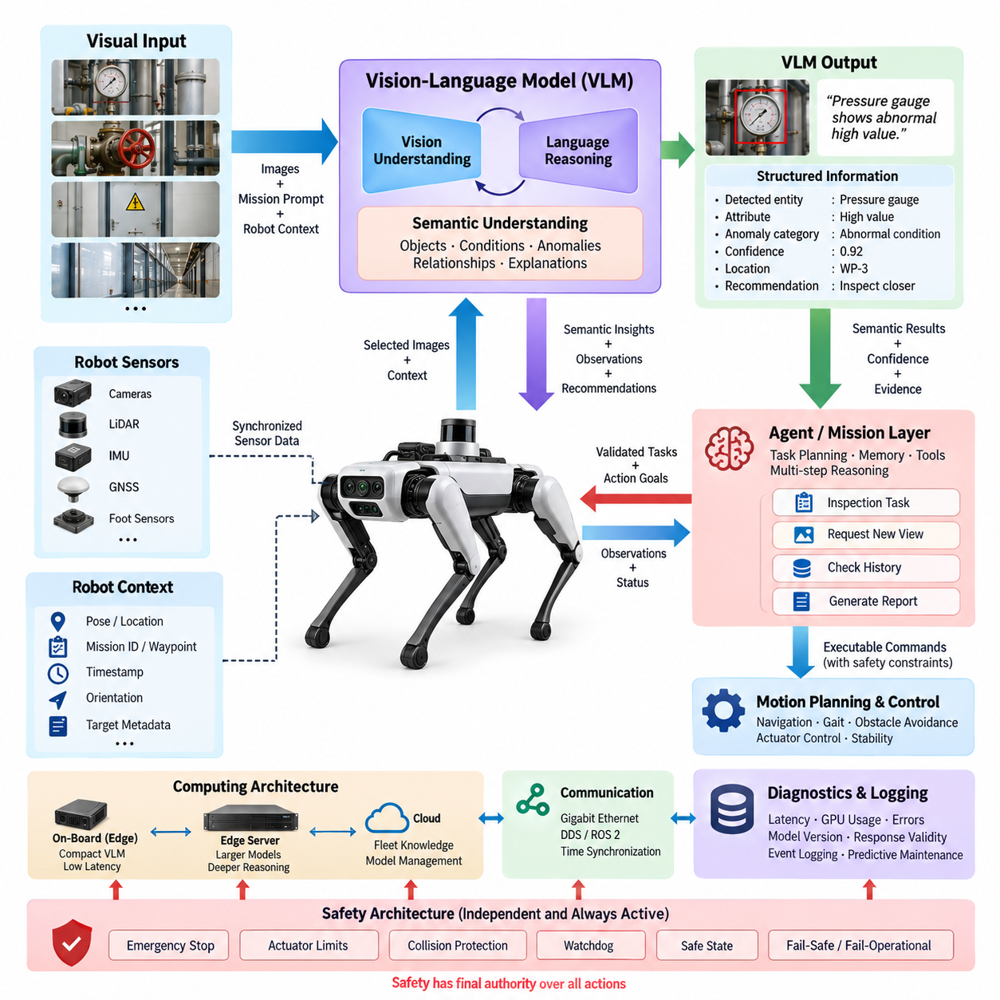
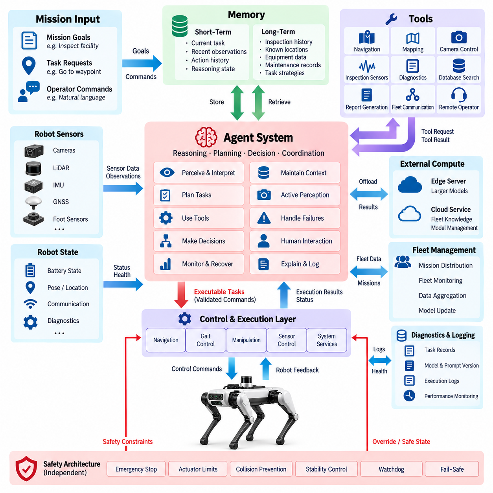
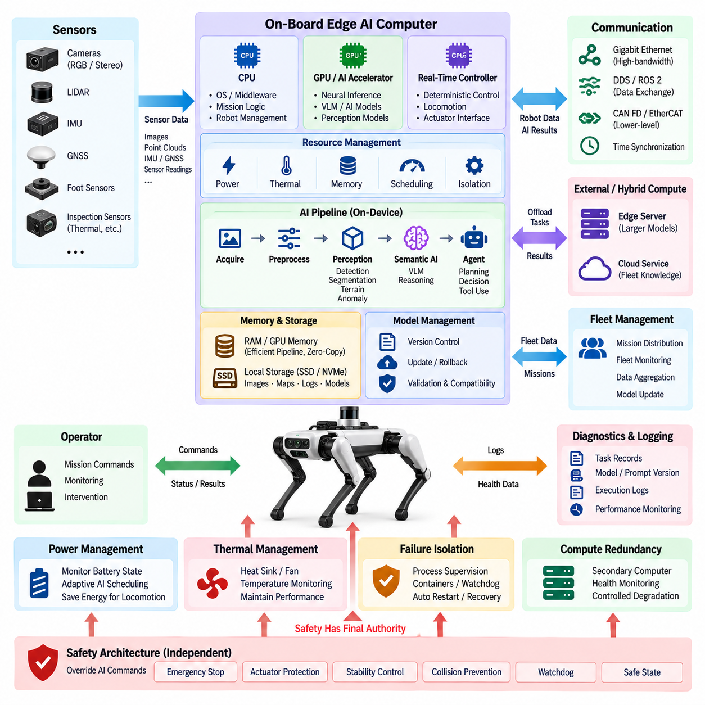
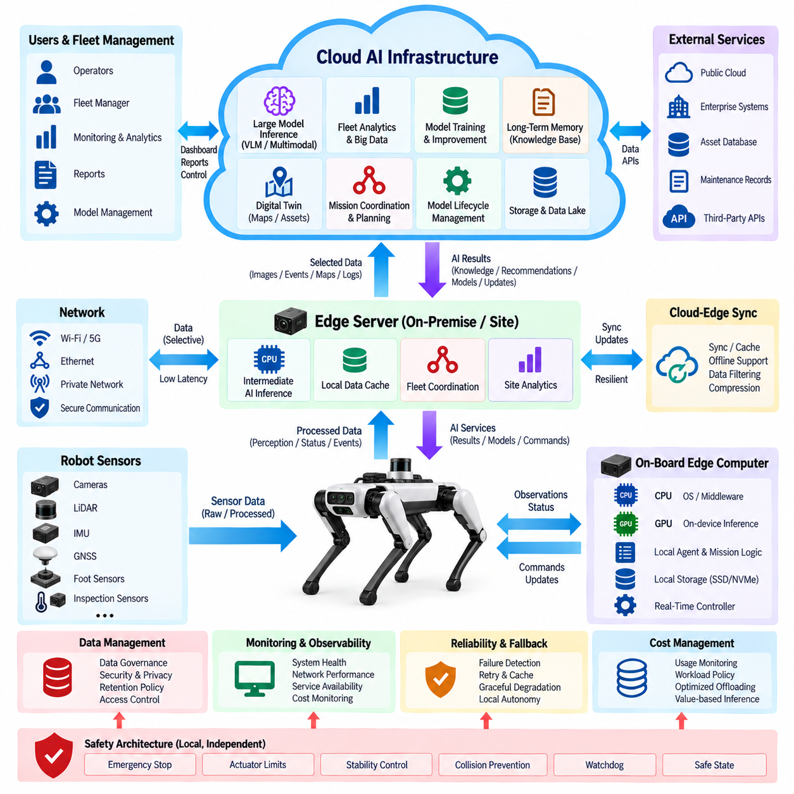
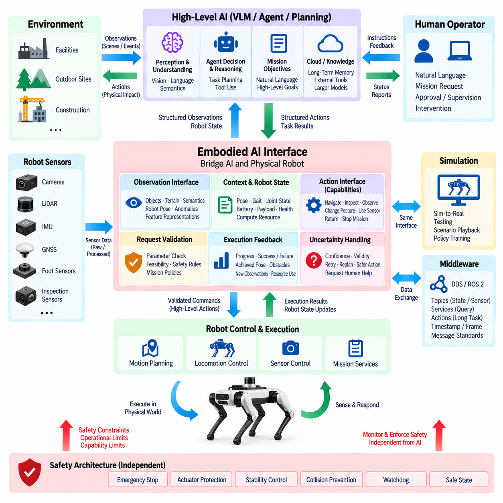
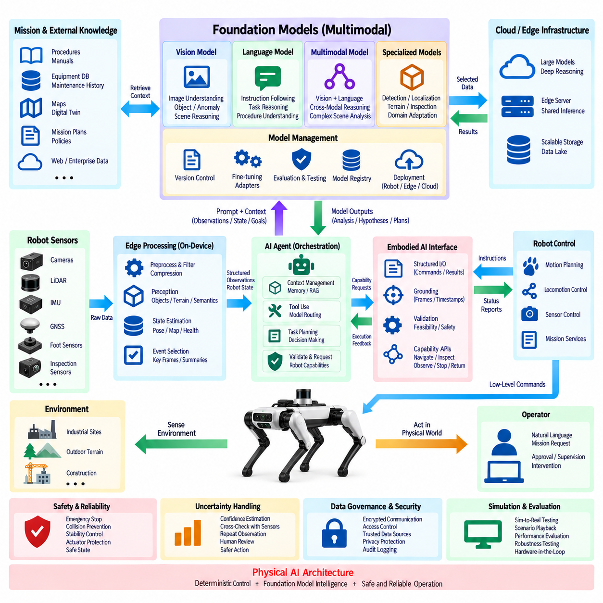

**Volume 20. Quadruped Electrical Architecture**


# Chapter 12. AI and Physical AI Integration

##  

## 12.01. VLM Integration

{width="7.268055555555556in" height="7.268055555555556in"}

Vision-Language Model (VLM) integration gives a quadruped robot the ability to connect visual perception with semantic understanding expressed through natural language. Instead of treating camera images only as inputs to conventional detection or segmentation pipelines, the robot can interpret objects, spatial relationships, environmental conditions, signs, equipment, and human activities within a broader mission context.

A quadruped platform is particularly suitable for VLM-based intelligence because it can physically enter spaces that are difficult, dangerous, or inefficient for humans and wheeled robots. Cameras mounted on the body, head, or inspection payload continuously provide visual observations, while the VLM transforms selected observations into semantic descriptions such as blocked passageways, abnormal equipment states, damaged infrastructure, or potential hazards.

VLM integration should complement rather than replace the robot\'s deterministic perception and control functions. High-frequency locomotion, joint control, obstacle avoidance, emergency stopping, and other safety-critical operations must remain within dedicated real-time control paths. The VLM operates at a higher semantic layer, interpreting observations and providing contextual information to mission planning, inspection logic, or an agent system.

The basic processing path begins with synchronized camera acquisition followed by image selection, preprocessing, and optional region-of-interest extraction. Frames or short visual sequences are delivered to the VLM together with prompts describing the current mission and relevant robot state. The resulting semantic representation can then be converted into structured observations, events, task parameters, or recommendations that downstream software can evaluate.

Prompt construction is an important part of the interface between the robot and the VLM. A generic question such as "What do you see?" may generate a broad description, while mission-specific prompts can focus attention on relevant evidence. An inspection robot may ask whether gauges, valves, cables, doors, warning indicators, corrosion, leakage, or foreign objects exhibit conditions inconsistent with the expected operating state.

Visual information becomes more useful when combined with robot context. Pose estimates, timestamps, camera identity, mission ID, waypoint information, orientation, and inspection target metadata can accompany each VLM request. This allows a semantic observation to be associated with a physical location and operational event rather than remaining an isolated text description. Such grounding is essential for repeatable inspection and fleet-level data analysis.

The VLM interface should preferably return machine-readable information in addition to natural-language explanations. Structured fields may represent detected entities, attributes, spatial relationships, confidence indicators, anomaly categories, recommended follow-up observations, and supporting image references. A downstream agent can validate these outputs against conventional perception, sensor measurements, mission rules, or previously recorded observations before initiating further actions.

Quadruped inspection can exploit active perception because the robot is able to reposition its entire body to obtain better observations. When a target is partially occluded or visually ambiguous, the AI layer may request another viewpoint, shorter viewing distance, different body orientation, or additional sensor measurement. The motion planner then determines whether the requested observation can be obtained safely without allowing the VLM to command joint actuators directly.

This separation establishes an important control boundary. The VLM can propose semantic goals such as "inspect the left side of the cabinet more closely," but a validated task or agent layer translates that intention into allowable robot behaviors. Navigation, foothold selection, gait generation, collision avoidance, actuator commands, and stability control remain under specialized control systems with explicit constraints, watchdogs, and safety supervision.

VLM processing also creates significant computing requirements. High-resolution multi-camera streams can easily exceed the practical inference capacity of an embedded AI computer if every frame is processed by a large model. The architecture therefore requires frame sampling, event-triggered inference, image resizing, region selection, model quantization, caching, and task-dependent scheduling. Conventional vision models can continuously filter observations before invoking the more computationally expensive VLM.

An effective architecture can distribute inference between edge and external computing resources. Compact models running on the quadruped provide low-latency semantic functions when connectivity is limited, while larger models on an edge GPU server or on-premise infrastructure can perform deeper reasoning over selected observations. Cloud processing may support non-real-time analysis, fleet knowledge, model management, and large-scale historical comparison where network availability and data policy permit.

Communication architecture must account for the difference between raw sensor traffic and semantic AI traffic. Gigabit Ethernet can transport high-bandwidth camera data internally, while DDS/ROS 2 can distribute robot state and AI messages among software components. VLM requests should include consistent timestamps and source identifiers so that visual reasoning can be correlated with synchronized LiDAR, IMU, GNSS, force sensing, diagnostics, and mission events.

Reliability requires explicit handling of uncertainty because VLM outputs are probabilistic and may contain incorrect descriptions or unsupported conclusions. Critical decisions should therefore use confidence thresholds, cross-checking, repeated observation, deterministic perception, geometric verification, or human confirmation according to risk. A semantic statement generated by the VLM must never automatically be interpreted as a verified physical fact merely because the response is linguistically convincing.

Safety architecture should prevent semantic AI failures from propagating directly into hazardous motion. The VLM must not bypass emergency-stop logic, real-time controllers, actuator limits, collision protection, communication watchdogs, or predefined safe states. When semantic reasoning conflicts with safety constraints, the deterministic safety layer has authority. Loss of the VLM or external AI service should degrade mission intelligence without destabilizing basic locomotion.

Diagnostics should monitor the complete VLM processing chain rather than only model execution. Useful health information includes camera availability, inference latency, GPU utilization, memory consumption, dropped requests, timeout frequency, model version, prompt version, response validity, and communication status. These records make it possible to distinguish failures caused by sensors, computing resources, networking, model behavior, or mission-level software.

Event logging is especially valuable for Physical AI because semantic decisions need traceability. Important VLM outputs can be stored together with timestamps, selected input frames, robot pose, prompt identifiers, structured responses, validation results, and subsequent actions. Such records support field debugging, model evaluation, incident reconstruction, predictive maintenance, and comparison between software or foundation-model versions deployed through the robot lifecycle.

VLM integration becomes more powerful when connected to the agent system that follows this architectural layer. The VLM provides semantic interpretation, while the agent manages goals, memory, tools, mission state, and multi-step reasoning. For example, an observed abnormal indicator can become an inspection event, trigger closer visual acquisition, request diagnostic data, compare previous records, and generate a structured report without embedding all reasoning inside the perception model.

The broader Physical AI architecture therefore treats the VLM as a semantic bridge between perception and intelligent action. Cameras provide visual evidence, the VLM converts that evidence into contextual meaning, an agent or mission layer evaluates what should happen next, and deterministic robot subsystems execute validated actions. This layered organization preserves the advantages of foundation-model reasoning while respecting the electrical, computing, communication, diagnostic, and safety architecture of the quadruped platform.

A mature implementation ultimately enables the quadruped to move beyond simple remote sensing toward context-aware physical operation. The robot can recognize mission-relevant situations, associate observations with places and tasks, request additional evidence, communicate findings in human-readable language, and contribute structured knowledge to fleet or higher-level AI systems. VLM integration thus forms one of the key interfaces connecting embodied sensing with higher-level Physical AI intelligence.

비전-언어 모델(Vision-Language Model, VLM) 통합은 사족보행 로봇(Quadruped Robot)이 시각적 인식(Visual Perception)을 자연어(Natural Language)로 표현되는 의미론적 이해(Semantic Understanding)와 연결할 수 있도록 한다. 카메라 영상을 기존의 객체 감지(Object Detection)나 분할(Segmentation) 파이프라인의 입력으로만 처리하는 대신, 로봇은 객체, 공간적 관계, 환경 상태, 표지판, 설비 및 사람의 활동을 보다 광범위한 임무 맥락(Mission Context)에서 해석할 수 있다.

사족보행 플랫폼(Quadruped Platform)은 사람이 접근하기 어렵거나 위험한 공간, 또는 바퀴형 로봇(Wheeled Robot)이 효율적으로 접근하기 어려운 공간에 물리적으로 진입할 수 있기 때문에 VLM 기반 지능(VLM-Based Intelligence)에 특히 적합하다. 몸체, 헤드 또는 검사 페이로드(Inspection Payload)에 장착된 카메라는 지속적으로 시각적 관측 정보를 제공하며, VLM은 선택된 관측 정보를 통로 차단, 비정상적인 설비 상태, 손상된 기반시설 또는 잠재적 위험과 같은 의미론적 설명(Semantic Description)으로 변환한다.

VLM 통합은 로봇의 결정론적 인식(Deterministic Perception) 및 제어 기능(Control Function)을 대체하는 것이 아니라 보완해야 한다. 고주파 보행 제어(High-Frequency Locomotion Control), 관절 제어(Joint Control), 장애물 회피(Obstacle Avoidance), 비상 정지(Emergency Stop) 및 기타 안전 필수 기능(Safety-Critical Function)은 전용 실시간 제어 경로(Real-Time Control Path)에 유지되어야 한다. VLM은 보다 상위의 의미론적 계층(Semantic Layer)에서 관측 정보를 해석하고 임무 계획(Mission Planning), 검사 로직(Inspection Logic) 또는 에이전트 시스템(Agent System)에 상황 정보를 제공한다.

기본 처리 경로(Processing Path)는 동기화된 카메라 획득(Synchronized Camera Acquisition)에서 시작하여 영상 선택(Image Selection), 전처리(Preprocessing), 선택적인 관심 영역 추출(Region-of-Interest Extraction)로 이어진다. 프레임(Frame) 또는 짧은 시각 시퀀스(Visual Sequence)는 현재 임무와 관련 로봇 상태를 설명하는 프롬프트(Prompt)와 함께 VLM으로 전달된다. 생성된 의미론적 표현(Semantic Representation)은 이후 하위 소프트웨어가 평가할 수 있는 구조화된 관측 정보, 이벤트(Event), 작업 파라미터(Task Parameter) 또는 권고 사항으로 변환될 수 있다.

프롬프트 구성(Prompt Construction)은 로봇과 VLM 사이의 인터페이스에서 중요한 부분이다. "무엇이 보이는가?"와 같은 일반적인 질문은 광범위한 설명을 생성할 수 있지만, 임무 특화 프롬프트(Mission-Specific Prompt)는 관련 증거에 집중하도록 할 수 있다. 검사 로봇(Inspection Robot)은 게이지(Gauge), 밸브(Valve), 케이블(Cable), 도어(Door), 경고 표시기(Warning Indicator), 부식(Corrosion), 누출(Leakage) 또는 이물질(Foreign Object)이 예상 운용 상태와 일치하지 않는 상태를 보이는지 확인하도록 질의할 수 있다.

시각 정보(Visual Information)는 로봇의 상황 정보(Robot Context)와 결합될 때 더욱 유용해진다. 자세 추정(Pose Estimation), 타임스탬프(Timestamp), 카메라 식별자(Camera Identity), 임무 식별자(Mission ID), 웨이포인트 정보(Waypoint Information), 방향(Orientation) 및 검사 대상 메타데이터(Inspection Target Metadata)를 각 VLM 요청에 함께 제공할 수 있다. 이를 통해 의미론적 관측 결과를 단순한 텍스트 설명으로 남겨두지 않고 실제 물리적 위치와 운용 이벤트에 연결할 수 있으며, 이러한 그라운딩(Grounding)은 반복 가능한 검사와 플릿 수준 데이터 분석(Fleet-Level Data Analysis)에 필수적이다.

VLM 인터페이스는 자연어 설명(Natural-Language Explanation)뿐만 아니라 기계 판독 가능 정보(Machine-Readable Information)를 함께 반환하는 것이 바람직하다. 구조화된 필드(Structured Field)는 감지된 개체(Entity), 속성(Attribute), 공간 관계(Spatial Relationship), 신뢰도 지표(Confidence Indicator), 이상 유형(Anomaly Category), 추가 관측 권고 및 근거 영상 참조 정보를 표현할 수 있다. 하위 에이전트(Agent)는 추가 행동을 시작하기 전에 이러한 출력을 기존 인식, 센서 측정, 임무 규칙 또는 이전 관측 결과와 비교하여 검증할 수 있다.

사족보행 검사(Quadruped Inspection)는 로봇이 더 나은 관측을 얻기 위해 몸 전체의 위치를 변경할 수 있으므로 능동 인식(Active Perception)을 활용할 수 있다. 대상이 부분적으로 가려져 있거나 시각적으로 모호한 경우 AI 계층(AI Layer)은 다른 시점(Viewpoint), 더 가까운 관측 거리, 다른 몸체 방향 또는 추가 센서 측정을 요청할 수 있다. 이후 동작 계획기(Motion Planner)는 VLM이 관절 액추에이터(Joint Actuator)를 직접 명령하지 않으면서 요청된 관측을 안전하게 확보할 수 있는지를 판단한다.

이러한 분리는 중요한 제어 경계(Control Boundary)를 형성한다. VLM은 "캐비닛의 왼쪽을 더 자세히 검사하라"와 같은 의미론적 목표(Semantic Goal)를 제안할 수 있지만, 검증된 작업 계층(Task Layer) 또는 에이전트 계층(Agent Layer)이 이러한 의도를 허용 가능한 로봇 행동으로 변환한다. 내비게이션(Navigation), 발 디딤 위치 선정(Foothold Selection), 보행 생성(Gait Generation), 충돌 회피(Collision Avoidance), 액추에이터 명령(Actuator Command) 및 안정성 제어(Stability Control)는 명시적인 제약 조건, 감시기(Watchdog) 및 안전 감독(Safety Supervision)을 갖춘 전문 제어 시스템에 유지된다.

VLM 처리는 상당한 컴퓨팅 요구사항(Computing Requirement)을 발생시킨다. 고해상도 다중 카메라 스트림(High-Resolution Multi-Camera Stream)의 모든 프레임을 대형 모델로 처리할 경우 임베디드 AI 컴퓨터(Embedded AI Computer)의 실질적인 추론 능력을 쉽게 초과할 수 있다. 따라서 프레임 샘플링(Frame Sampling), 이벤트 기반 추론(Event-Triggered Inference), 영상 크기 조정(Image Resizing), 영역 선택(Region Selection), 모델 양자화(Model Quantization), 캐싱(Caching) 및 작업 의존형 스케줄링(Task-Dependent Scheduling)이 필요하다. 기존 비전 모델(Conventional Vision Model)을 이용해 관측 정보를 지속적으로 필터링한 후 계산 비용이 높은 VLM을 선택적으로 호출할 수 있다.

효과적인 아키텍처는 엣지(Edge)와 외부 컴퓨팅 자원(External Computing Resource) 사이에 추론 작업을 분산할 수 있다. 사족보행 로봇에서 실행되는 경량 모델(Compact Model)은 연결성이 제한된 환경에서 저지연 의미론적 기능(Low-Latency Semantic Function)을 제공하며, 엣지 GPU 서버(Edge GPU Server) 또는 온프레미스 인프라(On-Premise Infrastructure)의 대형 모델은 선택된 관측 정보에 대해 더욱 심층적인 추론을 수행할 수 있다. 클라우드 처리(Cloud Processing)는 네트워크 가용성과 데이터 정책이 허용되는 경우 비실시간 분석, 플릿 지식(Fleet Knowledge), 모델 관리 및 대규모 이력 비교를 지원할 수 있다.

통신 아키텍처(Communication Architecture)는 원시 센서 트래픽(Raw Sensor Traffic)과 의미론적 AI 트래픽(Semantic AI Traffic)의 차이를 고려해야 한다. 기가비트 이더넷(Gigabit Ethernet)은 내부적으로 고대역폭 카메라 데이터를 전송할 수 있으며, DDS/ROS 2는 소프트웨어 구성요소 사이에서 로봇 상태와 AI 메시지를 분배할 수 있다. VLM 요청에는 일관된 타임스탬프와 소스 식별자가 포함되어야 하며, 이를 통해 시각적 추론 결과를 동기화된 LiDAR, IMU, GNSS, 힘 센싱(Force Sensing), 진단(Diagnostics) 및 임무 이벤트와 연계할 수 있다.

VLM 출력은 확률적(Probabilistic)이며 잘못된 설명이나 근거가 부족한 결론을 포함할 수 있기 때문에 신뢰성(Reliability)을 확보하려면 불확실성(Uncertainty)을 명시적으로 처리해야 한다. 중요한 의사결정에는 위험 수준에 따라 신뢰도 임계값(Confidence Threshold), 교차 검증(Cross-Checking), 반복 관측(Repeated Observation), 결정론적 인식(Deterministic Perception), 기하학적 검증(Geometric Verification) 또는 사람의 확인(Human Confirmation)을 적용해야 한다. VLM이 생성한 의미론적 문장이 언어적으로 설득력 있다는 이유만으로 검증된 물리적 사실로 간주되어서는 안 된다.

안전 아키텍처(Safety Architecture)는 의미론적 AI의 오류가 위험한 동작으로 직접 전파되는 것을 방지해야 한다. VLM은 비상 정지 로직(Emergency-Stop Logic), 실시간 제어기(Real-Time Controller), 액추에이터 제한(Actuator Limit), 충돌 보호(Collision Protection), 통신 감시기(Communication Watchdog) 또는 사전에 정의된 안전 상태(Safe State)를 우회해서는 안 된다. 의미론적 추론과 안전 제약 조건이 충돌하는 경우 결정론적 안전 계층(Deterministic Safety Layer)이 최종 권한을 가져야 한다. VLM 또는 외부 AI 서비스가 상실되더라도 기본 보행 안정성을 손상시키지 않고 임무 지능만 단계적으로 저하되어야 한다.

진단(Diagnostics)은 단순히 모델 실행 여부만 확인하는 것이 아니라 전체 VLM 처리 체인(Processing Chain)을 감시해야 한다. 유용한 상태 정보에는 카메라 가용성(Camera Availability), 추론 지연시간(Inference Latency), GPU 사용률(GPU Utilization), 메모리 소비량(Memory Consumption), 누락된 요청(Dropped Request), 타임아웃 빈도(Timeout Frequency), 모델 버전(Model Version), 프롬프트 버전(Prompt Version), 응답 유효성(Response Validity) 및 통신 상태가 포함된다. 이러한 기록을 통해 센서, 컴퓨팅 자원, 네트워크, 모델 동작 또는 임무 수준 소프트웨어에서 발생한 고장을 구분할 수 있다.

이벤트 로깅(Event Logging)은 의미론적 의사결정에 추적성(Traceability)이 요구되는 피지컬 AI(Physical AI)에서 특히 중요하다. 주요 VLM 출력은 타임스탬프, 선택된 입력 프레임, 로봇 자세, 프롬프트 식별자, 구조화된 응답, 검증 결과 및 이후 수행된 행동과 함께 저장할 수 있다. 이러한 기록은 현장 디버깅(Field Debugging), 모델 평가(Model Evaluation), 사고 재구성(Incident Reconstruction), 예지 정비(Predictive Maintenance), 그리고 로봇 수명주기 동안 배포된 소프트웨어 또는 파운데이션 모델(Foundation Model) 버전 간 비교를 지원한다.

VLM 통합은 이 아키텍처 계층 다음에 위치하는 에이전트 시스템(Agent System)과 연결될 때 더욱 강력해진다. VLM은 의미론적 해석(Semantic Interpretation)을 제공하고, 에이전트는 목표(Goal), 메모리(Memory), 도구(Tool), 임무 상태(Mission State) 및 다단계 추론(Multi-Step Reasoning)을 관리한다. 예를 들어 비정상 표시기가 관측되면 이를 검사 이벤트로 변환하고, 보다 근접한 시각 정보 획득을 요청하며, 진단 데이터를 조회하고, 이전 기록과 비교한 후 구조화된 보고서를 생성할 수 있다. 이 과정에서 모든 추론을 인식 모델 내부에 포함할 필요는 없다.

따라서 보다 광범위한 피지컬 AI 아키텍처(Physical AI Architecture)는 VLM을 인식(Perception)과 지능형 행동(Intelligent Action) 사이의 의미론적 연결 계층(Semantic Bridge)으로 취급한다. 카메라는 시각적 증거(Visual Evidence)를 제공하고, VLM은 이를 상황적 의미(Contextual Meaning)로 변환하며, 에이전트 또는 임무 계층은 다음에 수행해야 할 작업을 판단한다. 이후 결정론적 로봇 서브시스템(Deterministic Robot Subsystem)이 검증된 행동을 실행한다. 이러한 계층형 구성은 사족보행 플랫폼의 전기, 컴퓨팅, 통신, 진단 및 안전 아키텍처를 준수하면서 파운데이션 모델 추론(Foundation-Model Reasoning)의 장점을 활용할 수 있게 한다.

성숙한 VLM 통합은 궁극적으로 사족보행 로봇을 단순한 원격 센싱(Remote Sensing) 장치에서 상황 인지형 물리적 운영(Context-Aware Physical Operation) 시스템으로 발전시킨다. 로봇은 임무와 관련된 상황을 인식하고, 관측 결과를 위치와 작업에 연결하며, 필요한 경우 추가 증거를 요청하고, 발견된 정보를 사람이 이해할 수 있는 언어로 전달할 수 있다. 또한 구조화된 지식(Structured Knowledge)을 플릿 또는 상위 AI 시스템에 제공함으로써, VLM 통합은 체화된 센싱(Embodied Sensing)과 상위 수준의 피지컬 AI 지능(Physical AI Intelligence)을 연결하는 핵심 인터페이스 중 하나가 된다.

##  

## 12.02. Agent System

{width="7.268055555555556in" height="7.268055555555556in"}

An agent system transforms a quadruped robot from a collection of perception, locomotion, and communication functions into a goal-oriented Physical AI platform. The agent receives mission objectives, interprets environmental information, maintains operational context, selects appropriate tools, and coordinates multiple robot capabilities. It operates above deterministic control layers and provides the reasoning required to connect semantic understanding with executable tasks.

Within the quadruped architecture, the agent should be treated as a supervisory intelligence layer rather than a direct actuator controller. Joint torque control, gait generation, balance stabilization, collision avoidance, emergency stopping, and other time-critical functions remain under dedicated real-time controllers. The agent determines what should be accomplished, while validated motion and control subsystems determine how the requested physical behavior can be executed safely.

The agent receives information from multiple sources including VLM outputs, conventional perception models, LiDAR processing, IMU and GNSS estimates, foot-force sensors, diagnostics, mission databases, and operator commands. These heterogeneous observations are converted into a common operational context. The agent can therefore reason about both semantic information, such as an abnormal valve condition, and physical information, such as robot position, battery state, communication quality, or available mobility.

A typical agent processing cycle begins with observation and state interpretation. The system evaluates the current mission, robot condition, environmental events, and previously completed actions before determining the next objective. Reasoning may decompose a high-level instruction such as "inspect the equipment room" into navigation, target identification, viewpoint adjustment, image acquisition, anomaly assessment, diagnostic queries, and reporting activities executed through specialized robot services.

Memory is an important architectural component because useful physical operation extends beyond a single inference request. Short-term memory can retain the current task, recent observations, attempted actions, and intermediate reasoning state. Longer-term mission memory can contain inspection history, previously detected anomalies, known locations, equipment metadata, maintenance records, and successful task strategies, allowing new observations to be evaluated against prior operational experience.

Tool use provides the interface between agent reasoning and actual robot capabilities. Tools may expose navigation, mapping, camera control, inspection sensors, diagnostic services, database retrieval, report generation, fleet communication, or remote operator interaction. Each tool should have clearly defined inputs, outputs, execution constraints, timeout behavior, and failure states so that the agent interacts with deterministic software through controlled interfaces instead of directly manipulating low-level hardware.

Task planning converts mission intent into an ordered or conditional sequence of actions. Unlike a fixed state machine, an AI agent can adapt the sequence when observations change, while still operating inside predefined boundaries. If a planned route becomes blocked, for example, the agent may request an alternative path, select another inspection target, gather additional visual evidence, or ask for operator assistance rather than repeatedly attempting an invalid action.

The agent should distinguish between reasoning, decision authorization, and physical execution. A foundation model may propose an action, but the proposal must pass through policy checks and capability validation before becoming an executable command. The system verifies whether the requested behavior is permitted, whether required resources are available, whether environmental conditions satisfy execution constraints, and whether the robot remains inside its operational and safety envelope.

This architecture enables active perception to become part of autonomous reasoning. When a VLM reports an uncertain object or ambiguous equipment state, the agent can determine that additional evidence is required. It may request a new camera viewpoint, adjust inspection distance, activate lighting, acquire thermal or other inspection data, or compare the observation with historical records. The resulting information is then returned to the reasoning loop for reassessment.

Agent execution must explicitly handle failures because physical actions frequently produce outcomes different from predicted results. Navigation may fail, communication may disappear, a sensor may become unavailable, or a requested inspection position may be unreachable. Instead of assuming success, each action should return execution status and evidence. The agent can retry within defined limits, select an alternative strategy, degrade the mission, request human intervention, or transition toward a safe condition.

Human-agent interaction remains important even in highly autonomous quadrupeds. Operators can define goals, approve sensitive actions, modify mission priorities, inspect reasoning summaries, and intervene when uncertainty exceeds acceptable limits. Natural-language interaction can simplify mission specification, but operator commands should be converted into structured task representations and checked against system capabilities and safety policies before physical execution begins.

The agent can also coordinate multiple levels of computing. A local edge agent provides mission continuity and low-latency decisions when external connectivity is unavailable. More computationally demanding reasoning can be delegated to an edge server or on-premise AI infrastructure, while cloud services can support fleet knowledge, large-scale historical analysis, model services, and mission management. Loss of external connectivity should not eliminate essential local safety and recovery functions.

Communication between the agent and robot subsystems should use structured interfaces rather than unrestricted natural-language messages. DDS/ROS 2 services, actions, and topics can expose robot capabilities, while Ethernet provides the underlying high-bandwidth network. Every command should carry sufficient context such as task identity, timestamps, parameters, execution limits, and response status, enabling deterministic components to reject malformed, stale, unauthorized, or unsafe requests.

Time synchronization is necessary when agent decisions depend on observations from several sensors and software components. Camera frames, LiDAR data, robot pose, diagnostic events, VLM responses, and action results must be associated with a consistent temporal reference. Without reliable timestamps, the agent may incorrectly connect an old semantic observation with a new robot state, producing decisions that appear logically valid but are physically inconsistent with the current environment.

Safety authority must remain independent of the agent. Emergency-stop circuits, actuator limits, stability protection, collision prevention, watchdogs, power protection, and fail-safe mechanisms must be able to override or reject agent commands. The agent may request movement or manipulation, but it cannot disable these protections. If agent reasoning becomes unavailable, inconsistent, or excessively delayed, the robot should preserve deterministic control and transition according to predefined degradation policies.

Agent health monitoring should cover reasoning latency, task completion rate, tool failures, invalid command frequency, memory usage, communication timeouts, model availability, and repeated planning loops. A system that continuously generates plans without achieving measurable progress requires detection just as much as a failed sensor does. Watchdogs and mission-level progress monitors can identify stalled reasoning and initiate recovery before it causes excessive energy consumption or operational risk.

Traceability is essential because autonomous decisions must be explainable after field operation. Important records include mission objectives, observations used for decisions, model and prompt versions, selected tools, command parameters, validation results, execution responses, operator interventions, and final outcomes. These records support debugging, performance evaluation, incident analysis, software validation, predictive maintenance, and comparison between different agent configurations deployed across a robot fleet.

The agent system also provides a natural interface to fleet-level intelligence. Individual quadrupeds can report mission status, discovered obstacles, inspection anomalies, and task results to a fleet service. Higher-level coordination can distribute missions according to robot location, battery condition, payload capability, sensor configuration, or availability. However, fleet commands should enter each robot through the same validated agent and safety interfaces rather than bypassing local control authority.

A mature architecture may combine several specialized agents instead of relying on one unrestricted general-purpose agent. Mission planning, inspection reasoning, diagnostics, navigation supervision, and reporting can be separated into bounded functional roles with explicit information exchange. A supervisory mechanism can coordinate these functions while limiting permissions, reducing uncontrolled interactions, and making the overall system easier to validate, monitor, and maintain.

The agent system therefore forms the orchestration layer between semantic AI and physical execution. VLMs and perception systems explain what is happening, memory preserves relevant context, planning determines what should happen next, tools expose available robot capabilities, and deterministic controllers perform validated actions. Safety mechanisms independently constrain the complete process, establishing a clear boundary between probabilistic AI reasoning and safety-critical robotic control.

Through this layered architecture, a quadruped can progress from executing predefined sequences toward adaptive mission autonomy. It can interpret goals, observe its environment, plan multi-step activities, acquire additional evidence, recover from failures, use historical knowledge, collaborate with operators, and generate mission results. The agent does not replace the electrical and control architecture; it coordinates those capabilities into a context-aware Physical AI system capable of purposeful operation.

에이전트 시스템(Agent System)은 사족보행 로봇(Quadruped Robot)을 인식(Perception), 보행(Locomotion), 통신(Communication) 기능의 단순한 집합에서 목표 지향형 피지컬 AI(Physical AI) 플랫폼으로 전환한다. 에이전트(Agent)는 임무 목표(Mission Objective)를 수신하고, 환경 정보를 해석하며, 운용 맥락(Operational Context)을 유지하고, 적절한 도구(Tool)를 선택하여 여러 로봇 기능을 조정한다. 에이전트는 결정론적 제어 계층(Deterministic Control Layer)의 상위에서 동작하며, 의미론적 이해(Semantic Understanding)를 실행 가능한 작업(Executable Task)과 연결하는 데 필요한 추론(Reasoning)을 제공한다.

사족보행 아키텍처(Quadruped Architecture)에서 에이전트는 직접적인 액추에이터 제어기(Actuator Controller)가 아니라 감독형 지능 계층(Supervisory Intelligence Layer)으로 취급되어야 한다. 관절 토크 제어(Joint Torque Control), 보행 생성(Gait Generation), 균형 안정화(Balance Stabilization), 충돌 회피(Collision Avoidance), 비상 정지(Emergency Stop) 및 기타 시간 필수 기능(Time-Critical Function)은 전용 실시간 제어기(Real-Time Controller)에 유지된다. 에이전트는 무엇을 수행해야 하는지를 결정하고, 검증된 동작 및 제어 서브시스템(Motion and Control Subsystem)은 요청된 물리적 행동을 어떻게 안전하게 실행할 것인지를 결정한다.

에이전트는 VLM 출력(VLM Output), 기존 인식 모델(Conventional Perception Model), LiDAR 처리, IMU 및 GNSS 추정값, 발 힘 센서(Foot-Force Sensor), 진단(Diagnostics), 임무 데이터베이스(Mission Database), 운용자 명령(Operator Command) 등 다양한 소스로부터 정보를 수신한다. 이러한 이질적인 관측 정보(Heterogeneous Observation)는 공통 운용 맥락(Common Operational Context)으로 변환된다. 따라서 에이전트는 비정상적인 밸브 상태와 같은 의미론적 정보뿐만 아니라 로봇 위치, 배터리 상태, 통신 품질 또는 가용 이동 능력과 같은 물리적 정보에 대해서도 추론할 수 있다.

일반적인 에이전트 처리 주기(Agent Processing Cycle)는 관측(Observation)과 상태 해석(State Interpretation)으로 시작한다. 시스템은 다음 목표를 결정하기 전에 현재 임무, 로봇 상태, 환경 이벤트(Environmental Event) 및 이전에 완료된 행동을 평가한다. 추론 과정은 "장비실을 검사하라"와 같은 상위 수준 명령(High-Level Instruction)을 내비게이션(Navigation), 대상 식별(Target Identification), 시점 조정(Viewpoint Adjustment), 영상 획득(Image Acquisition), 이상 평가(Anomaly Assessment), 진단 질의(Diagnostic Query), 보고 활동(Reporting Activity)으로 분해하여 전문화된 로봇 서비스를 통해 실행할 수 있다.

유용한 물리적 운용은 단일 추론 요청(Inference Request)을 넘어 지속되기 때문에 메모리(Memory)는 중요한 아키텍처 구성요소이다. 단기 메모리(Short-Term Memory)는 현재 작업, 최근 관측 결과, 시도한 행동 및 중간 추론 상태(Intermediate Reasoning State)를 유지할 수 있다. 장기 임무 메모리(Long-Term Mission Memory)는 검사 이력, 이전에 감지된 이상, 알려진 위치, 장비 메타데이터(Equipment Metadata), 유지보수 기록 및 성공적인 작업 전략을 포함할 수 있으며, 이를 통해 새로운 관측 결과를 이전 운용 경험과 비교하여 평가할 수 있다.

도구 사용(Tool Use)은 에이전트 추론과 실제 로봇 기능 사이의 인터페이스를 제공한다. 도구는 내비게이션, 매핑(Mapping), 카메라 제어(Camera Control), 검사 센서(Inspection Sensor), 진단 서비스(Diagnostic Service), 데이터베이스 검색(Database Retrieval), 보고서 생성(Report Generation), 플릿 통신(Fleet Communication) 또는 원격 운용자 상호작용(Remote Operator Interaction)을 제공할 수 있다. 각 도구는 명확하게 정의된 입력, 출력, 실행 제약 조건, 타임아웃 동작(Timeout Behavior) 및 고장 상태(Failure State)를 가져야 하며, 이를 통해 에이전트는 저수준 하드웨어를 직접 조작하는 대신 제어된 인터페이스를 통해 결정론적 소프트웨어와 상호작용한다.

작업 계획(Task Planning)은 임무 의도(Mission Intent)를 순차적 또는 조건부 행동 시퀀스(Action Sequence)로 변환한다. 고정된 상태 머신(State Machine)과 달리 AI 에이전트(AI Agent)는 사전에 정의된 경계 내에서 동작하면서 관측 결과의 변화에 따라 행동 순서를 조정할 수 있다. 예를 들어 계획된 경로가 차단된 경우 에이전트는 유효하지 않은 행동을 반복적으로 시도하는 대신 대체 경로를 요청하거나, 다른 검사 대상을 선택하거나, 추가적인 시각적 증거를 수집하거나, 운용자의 지원을 요청할 수 있다.

에이전트는 추론(Reasoning), 의사결정 승인(Decision Authorization), 물리적 실행(Physical Execution)을 명확하게 구분해야 한다. 파운데이션 모델(Foundation Model)이 행동을 제안할 수 있지만, 해당 제안은 실행 가능한 명령(Executable Command)이 되기 전에 정책 검사(Policy Check)와 기능 검증(Capability Validation)을 통과해야 한다. 시스템은 요청된 행동이 허용되는지, 필요한 자원이 사용 가능한지, 환경 조건이 실행 제약을 만족하는지, 그리고 로봇이 운용 및 안전 범위(Operational and Safety Envelope) 내에 유지되고 있는지를 검증한다.

이러한 아키텍처는 능동 인식(Active Perception)이 자율 추론(Autonomous Reasoning)의 일부가 되도록 한다. VLM이 불확실한 객체나 모호한 장비 상태를 보고하면 에이전트는 추가적인 증거가 필요한지를 판단할 수 있다. 새로운 카메라 시점(Camera Viewpoint)을 요청하거나, 검사 거리를 조정하거나, 조명을 활성화하거나, 열화상(Thermal) 또는 기타 검사 데이터를 획득하거나, 관측 결과를 과거 기록과 비교할 수 있다. 이렇게 얻어진 정보는 재평가를 위해 다시 추론 루프(Reasoning Loop)로 전달된다.

물리적 행동은 예측된 결과와 다른 결과를 자주 생성하기 때문에 에이전트 실행(Agent Execution)은 고장(Failure)을 명시적으로 처리해야 한다. 내비게이션이 실패하거나, 통신이 끊기거나, 센서를 사용할 수 없게 되거나, 요청된 검사 위치에 접근할 수 없을 수 있다. 각 행동은 성공을 가정하는 대신 실행 상태(Execution Status)와 증거(Evidence)를 반환해야 한다. 에이전트는 정의된 제한 범위 내에서 재시도하거나, 대체 전략을 선택하거나, 임무를 단계적으로 축소하거나, 사람의 개입(Human Intervention)을 요청하거나, 안전 상태(Safe Condition)로 전환할 수 있다.

고도의 자율성을 갖춘 사족보행 로봇에서도 사람-에이전트 상호작용(Human-Agent Interaction)은 여전히 중요하다. 운용자는 목표를 정의하고, 민감한 행동을 승인하고, 임무 우선순위를 변경하고, 추론 요약(Reasoning Summary)을 검토하며, 불확실성이 허용 가능한 한계를 초과할 경우 개입할 수 있다. 자연어 상호작용(Natural-Language Interaction)은 임무 지정을 단순화할 수 있지만, 물리적 실행을 시작하기 전에 운용자 명령을 구조화된 작업 표현(Structured Task Representation)으로 변환하고 시스템 기능 및 안전 정책과 비교하여 검증해야 한다.

에이전트는 여러 수준의 컴퓨팅(Computing)을 조정할 수도 있다. 로컬 엣지 에이전트(Local Edge Agent)는 외부 연결을 사용할 수 없는 경우에도 임무 연속성(Mission Continuity)과 저지연 의사결정(Low-Latency Decision)을 제공한다. 계산 요구량이 높은 추론은 엣지 서버(Edge Server) 또는 온프레미스 AI 인프라(On-Premise AI Infrastructure)에 위임할 수 있으며, 클라우드 서비스(Cloud Service)는 플릿 지식(Fleet Knowledge), 대규모 이력 분석, 모델 서비스 및 임무 관리를 지원할 수 있다. 외부 연결이 상실되더라도 필수적인 로컬 안전 및 복구 기능(Local Safety and Recovery Function)이 제거되어서는 안 된다.

에이전트와 로봇 서브시스템(Robot Subsystem) 사이의 통신은 제한되지 않은 자연어 메시지가 아니라 구조화된 인터페이스(Structured Interface)를 사용해야 한다. DDS/ROS 2 서비스(Service), 액션(Action), 토픽(Topic)을 통해 로봇 기능을 제공할 수 있으며, 이더넷(Ethernet)은 기본적인 고대역폭 네트워크를 제공한다. 모든 명령에는 작업 식별자(Task Identity), 타임스탬프(Timestamp), 파라미터(Parameter), 실행 제한(Execution Limit), 응답 상태(Response Status)와 같은 충분한 맥락 정보가 포함되어야 하며, 이를 통해 결정론적 구성요소가 잘못되거나 오래되었거나 승인되지 않았거나 안전하지 않은 요청을 거부할 수 있다.

에이전트의 의사결정이 여러 센서 및 소프트웨어 구성요소의 관측 정보에 의존하는 경우 시간 동기화(Time Synchronization)가 필요하다. 카메라 프레임(Camera Frame), LiDAR 데이터, 로봇 자세(Robot Pose), 진단 이벤트(Diagnostic Event), VLM 응답 및 행동 결과(Action Result)는 일관된 시간 기준(Temporal Reference)에 연결되어야 한다. 신뢰할 수 있는 타임스탬프가 없으면 에이전트가 오래된 의미론적 관측 결과를 새로운 로봇 상태와 잘못 연결하여 논리적으로는 타당해 보이지만 현재의 물리적 환경과 일치하지 않는 의사결정을 생성할 수 있다.

안전 권한(Safety Authority)은 에이전트로부터 독립적으로 유지되어야 한다. 비상 정지 회로(Emergency-Stop Circuit), 액추에이터 제한(Actuator Limit), 안정성 보호(Stability Protection), 충돌 방지(Collision Prevention), 감시기(Watchdog), 전원 보호(Power Protection), 페일세이프 메커니즘(Fail-Safe Mechanism)은 에이전트 명령을 무시하거나 거부할 수 있어야 한다. 에이전트는 이동 또는 조작을 요청할 수 있지만 이러한 보호 기능을 비활성화할 수 없다. 에이전트 추론을 사용할 수 없거나 일관성이 없거나 지나치게 지연되는 경우에도 로봇은 결정론적 제어를 유지하고 사전에 정의된 성능 저하 정책(Degradation Policy)에 따라 전환해야 한다.

에이전트 상태 감시(Agent Health Monitoring)는 추론 지연시간(Reasoning Latency), 작업 완료율(Task Completion Rate), 도구 실패(Tool Failure), 유효하지 않은 명령 발생 빈도, 메모리 사용량, 통신 타임아웃(Communication Timeout), 모델 가용성(Model Availability) 및 반복적인 계획 루프(Planning Loop)를 포함해야 한다. 측정 가능한 진행 없이 지속적으로 계획만 생성하는 시스템 역시 고장난 센서와 마찬가지로 감지할 필요가 있다. 감시기와 임무 수준 진행 감시기(Mission-Level Progress Monitor)는 정체된 추론(Stalled Reasoning)을 식별하고 과도한 에너지 소비나 운용 위험을 초래하기 전에 복구 절차를 시작할 수 있다.

자율적인 의사결정은 현장 운용 이후에도 설명 가능해야 하기 때문에 추적성(Traceability)이 필수적이다. 주요 기록에는 임무 목표, 의사결정에 사용된 관측 정보, 모델 및 프롬프트 버전(Model and Prompt Version), 선택된 도구, 명령 파라미터, 검증 결과, 실행 응답, 운용자 개입 및 최종 결과가 포함된다. 이러한 기록은 디버깅(Debugging), 성능 평가(Performance Evaluation), 사고 분석(Incident Analysis), 소프트웨어 검증(Software Validation), 예지 정비(Predictive Maintenance) 및 로봇 플릿에 배포된 서로 다른 에이전트 구성 간의 비교를 지원한다.

에이전트 시스템은 또한 플릿 수준 지능(Fleet-Level Intelligence)과 자연스럽게 연결되는 인터페이스를 제공한다. 개별 사족보행 로봇은 임무 상태, 발견된 장애물, 검사 이상 및 작업 결과를 플릿 서비스(Fleet Service)에 보고할 수 있다. 상위 수준의 조정 시스템은 로봇 위치, 배터리 상태, 페이로드 기능(Payload Capability), 센서 구성 또는 가용성에 따라 임무를 분배할 수 있다. 그러나 플릿 명령은 로컬 제어 권한(Local Control Authority)을 우회하지 않고 각 로봇의 동일한 검증된 에이전트 및 안전 인터페이스를 통해 전달되어야 한다.

성숙한 아키텍처에서는 하나의 제한 없는 범용 에이전트(General-Purpose Agent)에 의존하는 대신 여러 전문 에이전트(Specialized Agent)를 결합할 수 있다. 임무 계획, 검사 추론, 진단, 내비게이션 감독(Navigation Supervision) 및 보고 기능을 명확한 정보 교환 구조를 가진 제한된 기능 역할(Bounded Functional Role)로 분리할 수 있다. 감독 메커니즘(Supervisory Mechanism)은 권한을 제한하면서 이러한 기능을 조정하여 통제되지 않은 상호작용을 줄이고 전체 시스템을 더욱 쉽게 검증, 감시 및 유지보수할 수 있도록 한다.

따라서 에이전트 시스템은 의미론적 AI(Semantic AI)와 물리적 실행 사이의 오케스트레이션 계층(Orchestration Layer)을 형성한다. VLM과 인식 시스템은 현재 어떤 상황이 발생하고 있는지를 설명하고, 메모리는 관련 맥락을 유지하며, 계획 기능은 다음에 무엇을 수행해야 하는지를 결정하고, 도구는 사용 가능한 로봇 기능을 제공하며, 결정론적 제어기(Deterministic Controller)는 검증된 행동을 수행한다. 안전 메커니즘은 전체 과정을 독립적으로 제한하여 확률적 AI 추론(Probabilistic AI Reasoning)과 안전 필수 로봇 제어(Safety-Critical Robotic Control) 사이에 명확한 경계를 형성한다.

이러한 계층형 아키텍처(Layered Architecture)를 통해 사족보행 로봇은 사전에 정의된 시퀀스를 실행하는 수준에서 적응형 임무 자율성(Adaptive Mission Autonomy)으로 발전할 수 있다. 로봇은 목표를 해석하고, 환경을 관측하며, 다단계 작업을 계획하고, 추가 증거를 획득하며, 실패로부터 복구하고, 과거 지식을 활용하고, 운용자와 협력하며, 임무 결과를 생성할 수 있다. 에이전트는 전기 및 제어 아키텍처(Electrical and Control Architecture)를 대체하는 것이 아니라 이러한 기능을 조정하여 목적 지향적 운용이 가능한 상황 인지형 피지컬 AI 시스템(Context-Aware Physical AI System)으로 통합한다.

##  

## 12.03. Edge AI Architecture

{width="7.268055555555556in" height="7.268055555555556in"}

Edge AI architecture places the computing resources required for perception, reasoning, and mission intelligence directly on the quadruped or within a nearby edge computing environment. This arrangement reduces dependence on remote cloud services and enables the robot to maintain intelligent operation when network bandwidth is limited, communication latency increases, or external connectivity is completely unavailable during field missions.

The on-board computing platform typically combines heterogeneous processors optimized for different workloads. CPUs execute operating systems, middleware, mission logic, and general software, while GPUs or dedicated AI accelerators execute neural-network inference. Real-time controllers independently handle deterministic locomotion and actuator functions. This separation allows computationally intensive AI workloads to coexist with predictable robotic control without assigning safety-critical timing requirements to probabilistic AI processes.

Sensor processing represents one of the largest edge computing workloads. Multiple cameras, LiDAR, IMU, GNSS, foot sensors, and specialized inspection sensors continuously generate data with different bandwidth and timing characteristics. The edge architecture performs acquisition, synchronization, preprocessing, filtering, compression, feature extraction, and inference close to the sensors, reducing the amount of raw information that must travel through external networks.

A layered AI pipeline can improve computational efficiency. Lightweight perception models may continuously perform object detection, segmentation, terrain classification, or anomaly screening, while larger VLMs and foundation models are invoked only when semantic interpretation is required. Event-triggered inference, region-of-interest processing, frame sampling, and adaptive model scheduling prevent expensive models from consuming GPU resources when simpler processing is sufficient.

Resource management becomes particularly important because a mobile quadruped has strict limits on electrical power, thermal dissipation, physical volume, and battery capacity. AI performance cannot be evaluated only by model accuracy or inference throughput. GPU utilization, memory consumption, power draw, processor temperature, cooling capability, and remaining mission energy must be considered together so that intensive AI processing does not compromise locomotion endurance or system reliability.

The edge platform should support multiple execution priorities. Safety-related perception and essential navigation require predictable access to computing resources, while semantic reasoning, reporting, mapping updates, or background analytics can tolerate greater latency. CPU affinity, GPU scheduling, process priorities, memory allocation, and workload isolation can prevent a large AI model from unexpectedly degrading control-supporting perception or other mission-critical software.

Memory architecture is another critical consideration because high-resolution sensor streams and AI models can consume substantial system memory and GPU memory. Efficient designs minimize unnecessary copies between camera buffers, CPU memory, and accelerator memory. Shared-memory transport, zero-copy mechanisms, hardware-accelerated decoding, tensor pipelines, and controlled buffer pools reduce latency and memory bandwidth while preventing resource exhaustion during prolonged operation.

Local storage complements volatile memory by preserving mission data that cannot be transmitted immediately. Selected images, sensor events, maps, diagnostic records, VLM results, agent decisions, and inspection evidence can be stored on industrial SSD or NVMe devices. Data retention policies should prioritize important events and manage storage capacity automatically, allowing lower-value raw data to be discarded or compressed while preserving information required for traceability.

Edge AI must remain integrated with the communication architecture rather than operating as an isolated computer. Gigabit Ethernet can connect cameras, LiDAR, computing modules, and internal network switches, while DDS/ROS 2 provides structured data exchange among software components. CAN FD or EtherCAT may connect lower-level controllers where appropriate. Time synchronization ensures that AI outputs remain correctly associated with the physical sensor observations and robot states that produced them.

The edge architecture also provides the local execution environment for VLM and agent functions. A compact VLM can interpret selected images without sending sensitive or bandwidth-intensive visual data outside the robot. The local agent can maintain mission context, use robot tools, evaluate execution results, and perform recovery actions. Larger reasoning workloads can be delegated externally without making basic autonomous mission continuity dependent on remote inference.

Hybrid edge computing extends this architecture beyond the robot itself. A nearby edge GPU server can execute larger models, aggregate information from several robots, perform computationally expensive mapping, or provide shared AI services. The quadruped retains essential local intelligence, while the external edge server increases available computing capacity. This division is useful in factories, construction sites, inspection facilities, campuses, and other managed operational environments.

Workload offloading requires dynamic decisions because network quality and available compute capacity can change during a mission. The system may execute a model locally when latency is critical, transfer selected data to an edge server when additional performance is available, or defer nonessential analysis until connectivity improves. Offloading policies should consider latency, bandwidth, model size, data sensitivity, energy consumption, server availability, and the operational importance of each request.

Failure isolation is essential when many AI applications share the same computing platform. A VLM process that consumes excessive memory, a perception node that crashes, or an agent that enters a repeated reasoning loop should not destabilize the complete robot. Process supervision, containers, resource quotas, watchdogs, health checks, and controlled restart mechanisms can isolate software failures and recover individual services without unnecessarily rebooting the entire computing system.

Compute redundancy may be introduced when mission availability requirements justify additional hardware. A secondary computing module can monitor the primary platform, maintain essential perception or mission functions, and support controlled degradation after a failure. Redundancy does not necessarily require duplicating every AI workload. Critical functions can be assigned to a reduced backup configuration that preserves navigation, communication, diagnostics, and safe mission termination.

Thermal management directly affects sustained AI performance. Peak benchmark throughput is insufficient if the processor rapidly reaches thermal limits and reduces clock frequency during continuous field operation. Heat sinks, fans, conductive chassis paths, environmental sealing, airflow design, temperature sensors, and power management must therefore be considered as part of the AI architecture. Thermal telemetry should be available to system health monitoring and mission management software.

Power management can dynamically adapt AI workloads to the robot\'s operating condition. During demanding locomotion, the system may reduce nonessential inference frequency to preserve energy and thermal margin. During stationary inspection, more computing capacity can be allocated to high-resolution vision or deeper semantic reasoning. Such adaptive scheduling connects AI resource consumption with battery state, mission priority, actuator demand, and expected remaining operating time.

Model deployment on the edge requires controlled lifecycle management. Model files, inference engines, calibration parameters, preprocessing definitions, and compatibility information should be versioned together. Updates must be validated before activation and should support rollback when performance or compatibility problems occur. Diagnostic records should identify the exact model and software versions responsible for each inference result, particularly when AI outputs influence mission decisions.

Cybersecurity is also part of edge AI architecture because model packages, mission data, sensor streams, and software services exist directly on the mobile platform. Secure boot, signed software and model packages, authenticated communication, access control, encrypted storage where required, and protected update mechanisms reduce the possibility that compromised software can alter AI behavior or gain access to robot functions.

Observability allows engineers to understand whether edge intelligence is operating within its intended envelope. Important metrics include inference latency, frame processing rate, GPU and CPU utilization, accelerator memory usage, temperature, power consumption, queue depth, dropped frames, model failures, communication delay, and storage capacity. Correlating these metrics with mission events helps distinguish algorithmic limitations from hardware, thermal, network, or resource-management problems.

The safety architecture must remain logically independent from high-performance AI computing. Emergency stopping, actuator protection, stability control, collision protection, watchdog functions, and defined safe states cannot depend solely on a large neural model or general-purpose GPU process. If the edge AI computer becomes overloaded or unavailable, deterministic controllers must retain sufficient authority to stabilize the robot, stop hazardous motion, and execute the defined degradation strategy.

A well-designed edge AI architecture therefore balances intelligence with deterministic engineering constraints. It combines heterogeneous computing, efficient sensor pipelines, local inference, resource management, storage, communication, diagnostics, security, thermal control, and workload offloading while maintaining a strict boundary around safety-critical control. This architecture provides the computational foundation required for VLMs, agents, embodied AI, and future foundation models to operate reliably on a mobile quadruped.

As quadruped intelligence evolves, edge computing becomes the bridge between electrical hardware and higher-level Physical AI capabilities. The robot can perceive and reason locally, continue operating during network disruption, selectively use external computing when beneficial, and continuously adapt computational effort to mission conditions. Edge AI therefore enables advanced autonomy without requiring the physical robot to surrender operational continuity, timing control, or safety authority to remote infrastructure.

엣지 AI 아키텍처(Edge AI Architecture)는 인식(Perception), 추론(Reasoning), 임무 지능(Mission Intelligence)에 필요한 컴퓨팅 자원(Computing Resource)을 사족보행 로봇(Quadruped Robot)에 직접 탑재하거나 인접한 엣지 컴퓨팅 환경(Edge Computing Environment)에 배치한다. 이러한 구성은 원격 클라우드 서비스(Remote Cloud Service)에 대한 의존성을 줄이며, 네트워크 대역폭이 제한되거나 통신 지연시간이 증가하거나 현장 임무 중 외부 연결이 완전히 중단되는 경우에도 로봇이 지능형 운용(Intelligent Operation)을 지속할 수 있도록 한다.

온보드 컴퓨팅 플랫폼(On-Board Computing Platform)은 일반적으로 서로 다른 워크로드(Workload)에 최적화된 이기종 프로세서(Heterogeneous Processor)를 결합한다. CPU는 운영체제, 미들웨어(Middleware), 임무 로직(Mission Logic) 및 일반 소프트웨어를 실행하고, GPU 또는 전용 AI 가속기(Dedicated AI Accelerator)는 신경망 추론(Neural-Network Inference)을 실행한다. 실시간 제어기(Real-Time Controller)는 결정론적 보행 및 액추에이터 기능을 독립적으로 처리한다. 이러한 분리를 통해 계산 집약적인 AI 워크로드와 예측 가능한 로봇 제어가 공존하면서도 확률적 AI 프로세스에 안전 필수 타이밍 요구사항(Safety-Critical Timing Requirement)을 부여하지 않을 수 있다.

센서 처리(Sensor Processing)는 가장 큰 엣지 컴퓨팅 워크로드 중 하나이다. 다수의 카메라, LiDAR, IMU, GNSS, 발 센서(Foot Sensor) 및 특수 검사 센서(Specialized Inspection Sensor)는 서로 다른 대역폭과 타이밍 특성을 가진 데이터를 지속적으로 생성한다. 엣지 아키텍처는 센서와 가까운 위치에서 데이터 획득(Acquisition), 동기화(Synchronization), 전처리(Preprocessing), 필터링(Filtering), 압축(Compression), 특징 추출(Feature Extraction) 및 추론을 수행하여 외부 네트워크를 통해 전송해야 하는 원시 정보(Raw Information)의 양을 줄인다.

계층형 AI 파이프라인(Layered AI Pipeline)은 컴퓨팅 효율성을 향상시킬 수 있다. 경량 인식 모델(Lightweight Perception Model)은 객체 감지(Object Detection), 분할(Segmentation), 지형 분류(Terrain Classification) 또는 이상 선별(Anomaly Screening)을 지속적으로 수행하고, 더 큰 VLM 및 파운데이션 모델(Foundation Model)은 의미론적 해석(Semantic Interpretation)이 필요한 경우에만 호출할 수 있다. 이벤트 기반 추론(Event-Triggered Inference), 관심 영역 처리(Region-of-Interest Processing), 프레임 샘플링(Frame Sampling) 및 적응형 모델 스케줄링(Adaptive Model Scheduling)을 통해 단순한 처리만으로 충분한 상황에서 고비용 모델이 GPU 자원을 소비하는 것을 방지할 수 있다.

모바일 사족보행 로봇은 전력, 열 방출(Thermal Dissipation), 물리적 공간 및 배터리 용량에 엄격한 제약을 가지므로 자원 관리(Resource Management)가 특히 중요하다. AI 성능은 모델 정확도(Model Accuracy)나 추론 처리량(Inference Throughput)만으로 평가할 수 없다. GPU 사용률, 메모리 소비량, 소비 전력(Power Draw), 프로세서 온도, 냉각 능력(Cooling Capability) 및 남은 임무 에너지(Remaining Mission Energy)를 함께 고려하여 집약적인 AI 처리가 보행 지속시간이나 시스템 신뢰성을 저해하지 않도록 해야 한다.

엣지 플랫폼(Edge Platform)은 여러 실행 우선순위(Execution Priority)를 지원해야 한다. 안전 관련 인식(Safety-Related Perception)과 필수 내비게이션(Essential Navigation)은 컴퓨팅 자원에 대한 예측 가능한 접근이 필요하지만, 의미론적 추론, 보고, 매핑 업데이트(Mapping Update) 또는 백그라운드 분석(Background Analytics)은 더 큰 지연시간을 허용할 수 있다. CPU 어피니티(CPU Affinity), GPU 스케줄링(GPU Scheduling), 프로세스 우선순위(Process Priority), 메모리 할당(Memory Allocation) 및 워크로드 격리(Workload Isolation)를 통해 대형 AI 모델이 제어 지원 인식(Control-Supporting Perception)이나 기타 임무 필수 소프트웨어의 성능을 예기치 않게 저하시키는 것을 방지할 수 있다.

고해상도 센서 스트림(High-Resolution Sensor Stream)과 AI 모델은 상당한 시스템 메모리와 GPU 메모리를 소비할 수 있기 때문에 메모리 아키텍처(Memory Architecture) 역시 중요한 고려사항이다. 효율적인 설계는 카메라 버퍼(Camera Buffer), CPU 메모리 및 가속기 메모리(Accelerator Memory) 사이에서 발생하는 불필요한 데이터 복사를 최소화한다. 공유 메모리 전송(Shared-Memory Transport), 제로 카피 메커니즘(Zero-Copy Mechanism), 하드웨어 가속 디코딩(Hardware-Accelerated Decoding), 텐서 파이프라인(Tensor Pipeline) 및 제어된 버퍼 풀(Controlled Buffer Pool)을 통해 지연시간과 메모리 대역폭 사용을 줄이는 동시에 장시간 운용 중 자원 고갈(Resource Exhaustion)을 방지할 수 있다.

로컬 저장장치(Local Storage)는 즉시 전송할 수 없는 임무 데이터를 보존하여 휘발성 메모리(Volatile Memory)를 보완한다. 선택된 영상, 센서 이벤트, 지도, 진단 기록, VLM 결과, 에이전트 의사결정(Agent Decision) 및 검사 증거(Inspection Evidence)를 산업용 SSD 또는 NVMe 장치에 저장할 수 있다. 데이터 보존 정책(Data Retention Policy)은 중요한 이벤트를 우선적으로 보존하고 저장 용량을 자동으로 관리해야 하며, 추적성(Traceability)에 필요한 정보는 유지하면서 중요도가 낮은 원시 데이터는 삭제하거나 압축할 수 있어야 한다.

엣지 AI는 독립된 컴퓨터처럼 동작하는 것이 아니라 통신 아키텍처(Communication Architecture)와 통합되어야 한다. 기가비트 이더넷(Gigabit Ethernet)은 카메라, LiDAR, 컴퓨팅 모듈(Computing Module) 및 내부 네트워크 스위치(Network Switch)를 연결할 수 있으며, DDS/ROS 2는 소프트웨어 구성요소 사이에서 구조화된 데이터 교환(Structured Data Exchange)을 제공한다. 필요한 경우 CAN FD 또는 EtherCAT을 저수준 제어기(Low-Level Controller) 연결에 사용할 수 있다. 시간 동기화(Time Synchronization)는 AI 출력이 해당 결과를 생성한 실제 센서 관측과 로봇 상태에 올바르게 연결되도록 한다.

엣지 아키텍처는 VLM 및 에이전트 기능(Agent Function)을 위한 로컬 실행 환경(Local Execution Environment)도 제공한다. 경량 VLM(Compact VLM)은 민감하거나 높은 대역폭을 요구하는 시각 데이터를 로봇 외부로 전송하지 않고 선택된 영상을 해석할 수 있다. 로컬 에이전트(Local Agent)는 임무 맥락을 유지하고, 로봇 도구를 사용하며, 실행 결과를 평가하고, 복구 행동(Recovery Action)을 수행할 수 있다. 더 큰 추론 워크로드는 외부 시스템에 위임하면서도 기본적인 자율 임무 연속성(Autonomous Mission Continuity)이 원격 추론(Remote Inference)에 의존하지 않도록 할 수 있다.

하이브리드 엣지 컴퓨팅(Hybrid Edge Computing)은 이러한 아키텍처를 로봇 자체를 넘어 확장한다. 인접한 엣지 GPU 서버(Edge GPU Server)는 더 큰 모델을 실행하고, 여러 로봇의 정보를 집계하며, 계산 비용이 높은 매핑을 수행하거나 공유 AI 서비스(Shared AI Service)를 제공할 수 있다. 사족보행 로봇은 필수적인 로컬 지능(Local Intelligence)을 유지하면서 외부 엣지 서버를 통해 사용 가능한 컴퓨팅 용량을 확장할 수 있다. 이러한 분할은 공장, 건설 현장, 검사 시설, 캠퍼스 및 기타 관리형 운용 환경(Managed Operational Environment)에서 유용하다.

워크로드 오프로딩(Workload Offloading)은 임무 수행 중 네트워크 품질과 사용 가능한 컴퓨팅 용량이 변할 수 있기 때문에 동적인 의사결정이 필요하다. 시스템은 지연시간이 중요한 경우 모델을 로컬에서 실행하고, 추가 성능을 사용할 수 있을 경우 선택된 데이터를 엣지 서버로 전송하며, 연결 상태가 개선될 때까지 필수적이지 않은 분석을 연기할 수 있다. 오프로딩 정책(Offloading Policy)은 지연시간, 대역폭, 모델 크기, 데이터 민감도(Data Sensitivity), 에너지 소비, 서버 가용성 및 각 요청의 운용 중요도를 고려해야 한다.

여러 AI 애플리케이션이 동일한 컴퓨팅 플랫폼을 공유하는 경우 고장 격리(Failure Isolation)가 필수적이다. 과도한 메모리를 소비하는 VLM 프로세스, 비정상 종료되는 인식 노드(Perception Node), 또는 반복적인 추론 루프에 진입한 에이전트가 전체 로봇을 불안정하게 만들어서는 안 된다. 프로세스 감독(Process Supervision), 컨테이너(Container), 자원 할당량(Resource Quota), 감시기(Watchdog), 상태 검사(Health Check) 및 제어된 재시작 메커니즘(Controlled Restart Mechanism)을 통해 소프트웨어 고장을 격리하고 전체 컴퓨팅 시스템을 불필요하게 재부팅하지 않으면서 개별 서비스를 복구할 수 있다.

임무 가용성 요구사항(Mission Availability Requirement)에 따라 추가 하드웨어가 정당화되는 경우 컴퓨팅 이중화(Compute Redundancy)를 도입할 수 있다. 보조 컴퓨팅 모듈(Secondary Computing Module)은 주 플랫폼(Primary Platform)을 감시하고 필수적인 인식 또는 임무 기능을 유지하며, 고장 이후 제어된 성능 저하(Controlled Degradation)를 지원할 수 있다. 이중화는 반드시 모든 AI 워크로드를 복제할 필요는 없으며, 핵심 기능을 축소된 백업 구성(Reduced Backup Configuration)에 할당하여 내비게이션, 통신, 진단 및 안전한 임무 종료(Safe Mission Termination)를 유지할 수 있다.

열 관리(Thermal Management)는 지속적인 AI 성능에 직접적인 영향을 미친다. 프로세서가 연속적인 현장 운용 중 빠르게 열 한계(Thermal Limit)에 도달하여 클록 주파수(Clock Frequency)를 낮춘다면 최대 벤치마크 처리량(Peak Benchmark Throughput)은 충분한 성능 지표가 될 수 없다. 따라서 방열판(Heat Sink), 팬(Fan), 전도성 섀시 열 경로(Conductive Chassis Path), 환경 밀봉(Environmental Sealing), 공기 흐름 설계(Airflow Design), 온도 센서 및 전력 관리를 AI 아키텍처의 일부로 고려해야 한다. 열 원격측정(Thermal Telemetry)은 시스템 상태 감시 및 임무 관리 소프트웨어에서 사용할 수 있어야 한다.

전력 관리(Power Management)는 로봇의 운용 상태에 따라 AI 워크로드를 동적으로 조정할 수 있다. 높은 동력을 요구하는 보행 중에는 에너지와 열 여유(Thermal Margin)를 확보하기 위해 필수적이지 않은 추론 빈도를 줄일 수 있다. 정지 상태에서 검사를 수행하는 동안에는 고해상도 비전(High-Resolution Vision) 또는 더욱 심층적인 의미론적 추론에 더 많은 컴퓨팅 용량을 할당할 수 있다. 이러한 적응형 스케줄링(Adaptive Scheduling)은 AI 자원 소비를 배터리 상태, 임무 우선순위, 액추에이터 요구량 및 예상 잔여 운용시간과 연결한다.

엣지에서의 모델 배포(Model Deployment)는 제어된 수명주기 관리(Lifecycle Management)를 필요로 한다. 모델 파일, 추론 엔진(Inference Engine), 캘리브레이션 파라미터(Calibration Parameter), 전처리 정의(Preprocessing Definition) 및 호환성 정보(Compatibility Information)는 함께 버전 관리되어야 한다. 업데이트는 활성화 전에 검증되어야 하며 성능 또는 호환성 문제가 발생한 경우 롤백(Rollback)을 지원해야 한다. 특히 AI 출력이 임무 의사결정에 영향을 미치는 경우 진단 기록에서 각 추론 결과를 생성한 정확한 모델 및 소프트웨어 버전을 식별할 수 있어야 한다.

모델 패키지(Model Package), 임무 데이터, 센서 스트림 및 소프트웨어 서비스가 모바일 플랫폼에 직접 존재하기 때문에 사이버보안(Cybersecurity) 역시 엣지 AI 아키텍처의 일부이다. 보안 부팅(Secure Boot), 서명된 소프트웨어 및 모델 패키지(Signed Software and Model Package), 인증된 통신(Authenticated Communication), 접근 제어(Access Control), 필요한 경우 암호화된 저장장치(Encrypted Storage), 보호된 업데이트 메커니즘(Protected Update Mechanism)을 통해 손상된 소프트웨어가 AI 동작을 변경하거나 로봇 기능에 접근할 가능성을 줄일 수 있다.

관측 가능성(Observability)은 엔지니어가 엣지 지능(Edge Intelligence)이 의도된 운용 범위 내에서 동작하는지를 이해할 수 있도록 한다. 주요 지표에는 추론 지연시간, 프레임 처리율(Frame Processing Rate), GPU 및 CPU 사용률, 가속기 메모리 사용량, 온도, 소비 전력, 큐 깊이(Queue Depth), 누락된 프레임(Dropped Frame), 모델 실패, 통신 지연 및 저장 용량이 포함된다. 이러한 지표를 임무 이벤트와 연계하면 알고리즘 한계와 하드웨어, 열, 네트워크 또는 자원 관리 문제를 구분하는 데 도움이 된다.

안전 아키텍처(Safety Architecture)는 고성능 AI 컴퓨팅(High-Performance AI Computing)으로부터 논리적으로 독립되어야 한다. 비상 정지(Emergency Stop), 액추에이터 보호(Actuator Protection), 안정성 제어(Stability Control), 충돌 보호(Collision Protection), 감시기 기능 및 정의된 안전 상태(Safe State)는 대형 신경망 모델이나 범용 GPU 프로세스에만 의존해서는 안 된다. 엣지 AI 컴퓨터가 과부하되거나 사용할 수 없게 되더라도 결정론적 제어기(Deterministic Controller)는 로봇을 안정화하고 위험한 움직임을 정지시키며 정의된 성능 저하 전략(Degradation Strategy)을 실행할 수 있는 충분한 제어 권한을 유지해야 한다.

잘 설계된 엣지 AI 아키텍처는 지능(Intelligence)과 결정론적 엔지니어링 제약(Deterministic Engineering Constraint) 사이의 균형을 유지한다. 이기종 컴퓨팅, 효율적인 센서 파이프라인, 로컬 추론(Local Inference), 자원 관리, 저장장치, 통신, 진단, 보안, 열 제어 및 워크로드 오프로딩을 결합하면서 안전 필수 제어(Safety-Critical Control) 주위에는 엄격한 경계를 유지한다. 이러한 아키텍처는 VLM, 에이전트, 체화형 AI(Embodied AI) 및 미래의 파운데이션 모델이 모바일 사족보행 로봇에서 신뢰성 있게 동작하기 위해 필요한 컴퓨팅 기반을 제공한다.

사족보행 로봇의 지능이 발전함에 따라 엣지 컴퓨팅(Edge Computing)은 전기 하드웨어(Electrical Hardware)와 상위 수준의 피지컬 AI 기능 사이를 연결하는 가교가 된다. 로봇은 로컬에서 환경을 인식하고 추론하며, 네트워크 장애 중에도 운용을 지속하고, 필요한 경우 외부 컴퓨팅을 선택적으로 활용하며, 임무 조건에 따라 컴퓨팅 자원의 사용 수준을 지속적으로 조정할 수 있다. 따라서 엣지 AI는 물리적 로봇이 운용 연속성, 타이밍 제어(Timing Control) 또는 안전 권한(Safety Authority)을 원격 인프라에 넘기지 않으면서도 고도화된 자율성(Advanced Autonomy)을 구현할 수 있도록 한다.

##  

## 12.04. Cloud AI Architecture

{width="7.268055555555556in" height="7.268055555555556in"}

Cloud AI architecture extends the intelligence of a quadruped robot beyond the computational and storage limits of its on-board platform. It provides scalable resources for foundation models, fleet analytics, historical reasoning, model training, data management, and mission coordination. The cloud complements local edge intelligence rather than replacing it, allowing the robot to preserve essential autonomy while selectively accessing larger computational capabilities.

The fundamental design principle is separation between local operational control and remote intelligence services. Locomotion, stability control, obstacle avoidance, emergency stopping, and other time-critical functions remain on the robot. Cloud services operate on tasks that tolerate network latency, including large-model inference, fleet-wide analysis, report generation, long-term knowledge retrieval, model optimization, and computationally intensive interpretation of selected mission data.

A hierarchical architecture typically includes the on-board edge computer, a nearby edge server when available, and remote cloud infrastructure. The robot executes low-latency perception and mission functions locally, while the edge server can provide intermediate computing capacity for site-level operations. Cloud resources provide elastic computing and storage for workloads that exceed the capacity of individual robots or require information aggregated across many missions and platforms.

Communication between the robot and cloud should exchange selected information rather than continuously uploading every raw sensor stream. Images, video segments, point clouds, semantic events, diagnostic records, maps, and mission summaries can be prioritized according to operational value. Local preprocessing, compression, filtering, and event selection reduce bandwidth consumption while preserving evidence required for deeper cloud analysis or long-term storage.

Cloud inference enables access to models that are impractical to deploy directly on a mobile quadruped because of memory, power, or thermal limitations. Large VLMs, multimodal foundation models, reasoning models, and specialized inspection models can analyze selected observations transferred from the robot. Their results return as semantic information, recommendations, structured data, or mission knowledge rather than direct low-level actuator commands.

The cloud can provide long-term memory for agent-based operation. Individual robots normally retain only the information required for immediate mission continuity, whereas cloud storage can preserve inspection histories, equipment records, maps, anomaly trends, maintenance information, previous mission outcomes, and validated operational knowledge. An agent can retrieve relevant historical context when evaluating a new observation without storing the complete organizational knowledge base on every robot.

Fleet intelligence is one of the strongest advantages of cloud AI architecture. Information collected by multiple quadrupeds can be aggregated to create a broader operational representation of facilities, assets, routes, hazards, and recurring anomalies. Fleet services can compare robot status, battery condition, sensor configuration, location, mission progress, and availability to support task allocation and operational planning across multiple platforms.

Cloud analytics can transform individual observations into long-term operational knowledge. Repeated inspection results can reveal degradation patterns that are difficult to identify during a single mission. Statistical analysis, anomaly clustering, temporal comparison, and predictive models can evaluate equipment conditions across weeks or months. The resulting knowledge can support predictive maintenance, inspection prioritization, and improved mission planning for subsequent robot deployments.

Training and model improvement are naturally separated from real-time robot execution. Mission data collected in the field can be transferred to managed datasets where engineers perform labeling, validation, training, fine-tuning, evaluation, and regression testing using scalable GPU infrastructure. Approved models can then enter a controlled deployment pipeline and eventually be distributed to edge computers after compatibility and safety validation.

Model lifecycle management should maintain clear relationships among datasets, model versions, inference engines, calibration parameters, prompts, evaluation results, and deployed software. A cloud model registry can identify which model is approved for each robot configuration or mission type. Deployment records should show when a model was installed, which version it replaced, and whether rollback is required when unexpected behavior appears in field operation.

Cloud architecture also supports digital representations of robot and mission state. Maps, asset information, robot configuration, inspection targets, and historical observations can be combined into a persistent operational model. New field observations update this representation, while mission planning services use it to prepare routes and inspection objectives. The cloud therefore becomes a shared knowledge environment rather than merely a remote inference computer.

The agent architecture can use cloud services as external tools. A local agent may request historical inspection data, ask a larger model to analyze an ambiguous observation, retrieve equipment documentation, compare anomalies across the fleet, or generate a detailed mission report. Cloud responses return to the local agent as information to be evaluated within the current robot context rather than automatically becoming physical commands.

Network variability must be treated as a normal operating condition. Wireless coverage may degrade, latency may fluctuate, or communication may disappear completely as the quadruped moves through industrial facilities, tunnels, remote sites, or complex structures. The robot should therefore cache necessary mission information locally and continue essential operation without cloud access. Deferred requests and stored data can be synchronized when communication becomes available again.

Service interfaces should define timeouts, retries, request identifiers, timestamps, version information, and validity periods. A cloud response arriving after the physical situation has changed may no longer be appropriate even if its reasoning is correct. The local system must verify that remote information still corresponds to the current mission state before using it, preventing stale cloud results from influencing actions in a changed environment.

Data governance becomes increasingly important as visual, operational, and inspection information leaves the robot. Organizations must determine which data can be transmitted, where it may be stored, how long it should be retained, and which users or services may access it. Sensitive imagery or facility information may require local processing, anonymization, encryption, or restrictions that prevent selected datasets from being transferred to public cloud infrastructure.

Cybersecurity must protect the complete path between robot, edge infrastructure, and cloud services. Mutual authentication, encrypted communication, access control, signed software artifacts, secure credential management, audit logging, and protected APIs reduce the risk of unauthorized access. Cloud connectivity must never create a pathway through which an external service can bypass the robot\'s local command validation or safety mechanisms.

Availability engineering should assume that individual cloud services can fail. Model endpoints may become unavailable, storage services may experience disruption, or authentication infrastructure may temporarily reject requests. Local software should distinguish between optional cloud intelligence and functions required for mission continuity. Redundant services, retry policies, caching, graceful degradation, and local fallback models can prevent remote failures from unnecessarily terminating robot operation.

Observability should cover both the robot-to-cloud communication path and the cloud AI services themselves. Useful metrics include upload and download bandwidth, round-trip latency, request success rate, inference time, queue delay, service availability, storage usage, synchronization backlog, model version, and cost per workload. These metrics help engineers determine whether a function should remain in the cloud, migrate toward the edge, or be redesigned.

Cloud computing introduces an economic dimension that does not exist in the same form for fixed on-board hardware. GPU inference, storage, network transfer, database queries, and large-scale model services can generate recurring operating costs. Workload policies should therefore consider not only technical performance but also mission value. Routine perception can remain local while expensive cloud reasoning is reserved for ambiguous, high-value, or computationally demanding situations.

Safety authority must remain local regardless of cloud capability. A cloud model may recommend a new inspection viewpoint, alternative route, or mission action, but the request must pass through the robot\'s local agent, policy validation, motion planning, and safety layers. Emergency stop, actuator limits, stability protection, collision prevention, watchdogs, and safe-state transitions must remain functional even when every external AI service is unavailable.

Cloud AI architecture therefore creates a distributed intelligence system in which different computing layers perform tasks appropriate to their latency, resource, and reliability characteristics. The quadruped preserves immediate perception and control, nearby edge systems provide additional low-latency capacity, and cloud infrastructure supplies scalable models, knowledge, analytics, training, and fleet coordination. Clear interfaces maintain separation among these responsibilities.

When combined with edge AI, VLM integration, and agent systems, the cloud becomes the long-term intelligence and learning layer of the Physical AI architecture. Knowledge acquired by one mission can improve future missions, models can evolve from accumulated field data, and multiple robots can contribute to shared operational understanding. The result is a scalable architecture in which individual quadrupeds remain autonomous physical systems while participating in a continuously improving distributed AI ecosystem.

클라우드 AI 아키텍처(Cloud AI Architecture)는 사족보행 로봇(Quadruped Robot)의 지능을 온보드 플랫폼(On-Board Platform)의 컴퓨팅 및 저장 용량 한계를 넘어 확장한다. 이는 파운데이션 모델(Foundation Model), 플릿 분석(Fleet Analytics), 이력 기반 추론(Historical Reasoning), 모델 학습(Model Training), 데이터 관리(Data Management) 및 임무 조정(Mission Coordination)을 위한 확장 가능한 자원을 제공한다. 클라우드는 로컬 엣지 지능(Local Edge Intelligence)을 대체하는 것이 아니라 보완하며, 로봇이 필수적인 자율성을 유지하면서 필요에 따라 더 큰 컴퓨팅 자원을 선택적으로 활용할 수 있도록 한다.

기본적인 설계 원칙은 로컬 운용 제어(Local Operational Control)와 원격 지능 서비스(Remote Intelligence Service)를 분리하는 것이다. 보행(Locomotion), 안정성 제어(Stability Control), 장애물 회피(Obstacle Avoidance), 비상 정지(Emergency Stop) 및 기타 시간 필수 기능(Time-Critical Function)은 로봇 내부에 유지된다. 클라우드 서비스는 대형 모델 추론(Large-Model Inference), 플릿 전체 분석(Fleet-Wide Analysis), 보고서 생성(Report Generation), 장기 지식 검색(Long-Term Knowledge Retrieval), 모델 최적화(Model Optimization), 선택된 임무 데이터의 계산 집약적 해석과 같이 네트워크 지연시간을 허용할 수 있는 작업을 수행한다.

계층형 아키텍처(Hierarchical Architecture)는 일반적으로 온보드 엣지 컴퓨터(On-Board Edge Computer), 사용 가능한 경우 인접한 엣지 서버(Edge Server), 그리고 원격 클라우드 인프라(Remote Cloud Infrastructure)로 구성된다. 로봇은 저지연 인식(Low-Latency Perception)과 임무 기능을 로컬에서 실행하고, 엣지 서버는 현장 수준 운용(Site-Level Operation)을 위한 중간 단계의 컴퓨팅 용량을 제공할 수 있다. 클라우드 자원은 개별 로봇의 처리 능력을 초과하거나 여러 임무와 플랫폼에서 집계된 정보를 요구하는 워크로드를 위해 탄력적인 컴퓨팅(Elastic Computing) 및 저장장치를 제공한다.

로봇과 클라우드 사이의 통신은 모든 원시 센서 스트림(Raw Sensor Stream)을 지속적으로 업로드하는 대신 선택된 정보를 교환해야 한다. 영상, 비디오 구간(Video Segment), 포인트 클라우드(Point Cloud), 의미론적 이벤트(Semantic Event), 진단 기록(Diagnostic Record), 지도(Map) 및 임무 요약(Mission Summary)은 운용 가치에 따라 우선순위를 지정할 수 있다. 로컬 전처리(Local Preprocessing), 압축(Compression), 필터링(Filtering) 및 이벤트 선택(Event Selection)을 통해 대역폭 소비를 줄이면서 심층 클라우드 분석이나 장기 저장에 필요한 증거를 보존할 수 있다.

클라우드 추론(Cloud Inference)을 사용하면 메모리, 전력 또는 열 제약(Thermal Limitation)으로 인해 모바일 사족보행 로봇에 직접 배포하기 어려운 모델을 활용할 수 있다. 대형 VLM, 멀티모달 파운데이션 모델(Multimodal Foundation Model), 추론 모델(Reasoning Model) 및 특수 검사 모델(Specialized Inspection Model)은 로봇에서 전송된 선택적 관측 정보를 분석할 수 있다. 분석 결과는 저수준 액추에이터 명령(Low-Level Actuator Command)이 아니라 의미론적 정보(Semantic Information), 권고 사항(Recommendation), 구조화된 데이터(Structured Data) 또는 임무 지식(Mission Knowledge)의 형태로 반환된다.

클라우드는 에이전트 기반 운용(Agent-Based Operation)을 위한 장기 메모리(Long-Term Memory)를 제공할 수 있다. 개별 로봇은 일반적으로 즉각적인 임무 연속성(Mission Continuity)에 필요한 정보만 유지하지만, 클라우드 저장장치는 검사 이력, 장비 기록, 지도, 이상 추세(Anomaly Trend), 유지보수 정보, 이전 임무 결과 및 검증된 운용 지식을 보존할 수 있다. 에이전트(Agent)는 전체 조직의 지식 기반(Knowledge Base)을 모든 로봇에 저장하지 않고도 새로운 관측 결과를 평가할 때 관련된 과거 맥락을 검색할 수 있다.

플릿 지능(Fleet Intelligence)은 클라우드 AI 아키텍처의 가장 큰 장점 중 하나이다. 여러 사족보행 로봇이 수집한 정보를 집계하여 시설, 자산(Asset), 경로, 위험 요소 및 반복되는 이상에 대한 더욱 광범위한 운용 표현(Operational Representation)을 생성할 수 있다. 플릿 서비스(Fleet Service)는 로봇 상태, 배터리 상태, 센서 구성, 위치, 임무 진행 상황 및 가용성을 비교하여 여러 플랫폼에 걸친 작업 할당(Task Allocation)과 운용 계획(Operational Planning)을 지원할 수 있다.

클라우드 분석(Cloud Analytics)은 개별 관측 결과를 장기적인 운용 지식(Long-Term Operational Knowledge)으로 변환할 수 있다. 반복적인 검사 결과를 통해 단일 임무에서는 식별하기 어려운 성능 저하 패턴(Degradation Pattern)을 발견할 수 있다. 통계 분석(Statistical Analysis), 이상 클러스터링(Anomaly Clustering), 시간적 비교(Temporal Comparison) 및 예측 모델(Predictive Model)은 수주 또는 수개월에 걸친 장비 상태를 평가할 수 있다. 생성된 지식은 예지 정비(Predictive Maintenance), 검사 우선순위 결정(Inspection Prioritization) 및 후속 로봇 배치를 위한 개선된 임무 계획을 지원할 수 있다.

학습 및 모델 개선(Model Improvement)은 실시간 로봇 실행(Real-Time Robot Execution)과 자연스럽게 분리된다. 현장에서 수집된 임무 데이터는 관리형 데이터셋(Managed Dataset)으로 전송될 수 있으며, 엔지니어는 확장 가능한 GPU 인프라를 이용하여 라벨링(Labeling), 검증(Validation), 학습(Training), 미세조정(Fine-Tuning), 평가(Evaluation) 및 회귀 시험(Regression Testing)을 수행할 수 있다. 승인된 모델은 이후 제어된 배포 파이프라인(Controlled Deployment Pipeline)에 진입하고, 호환성 및 안전 검증을 거친 후 최종적으로 엣지 컴퓨터에 배포될 수 있다.

모델 수명주기 관리(Model Lifecycle Management)는 데이터셋, 모델 버전(Model Version), 추론 엔진(Inference Engine), 캘리브레이션 파라미터(Calibration Parameter), 프롬프트(Prompt), 평가 결과 및 배포된 소프트웨어 사이의 명확한 관계를 유지해야 한다. 클라우드 모델 레지스트리(Cloud Model Registry)는 각 로봇 구성 또는 임무 유형에 승인된 모델을 식별할 수 있다. 배포 기록(Deployment Record)은 모델이 언제 설치되었는지, 어떤 버전을 대체했는지, 그리고 현장 운용에서 예상하지 못한 동작이 발생한 경우 롤백(Rollback)이 필요한지를 보여주어야 한다.

클라우드 아키텍처는 로봇과 임무 상태의 디지털 표현(Digital Representation)도 지원한다. 지도, 자산 정보, 로봇 구성, 검사 대상 및 과거 관측 정보를 결합하여 지속적으로 유지되는 운용 모델(Persistent Operational Model)을 구성할 수 있다. 새로운 현장 관측 결과는 이러한 표현을 업데이트하며, 임무 계획 서비스(Mission Planning Service)는 이를 활용하여 경로와 검사 목표를 준비한다. 따라서 클라우드는 단순한 원격 추론 컴퓨터(Remote Inference Computer)가 아니라 공유 지식 환경(Shared Knowledge Environment)이 된다.

에이전트 아키텍처(Agent Architecture)는 클라우드 서비스를 외부 도구(External Tool)로 사용할 수 있다. 로컬 에이전트(Local Agent)는 과거 검사 데이터를 요청하고, 모호한 관측 결과를 분석하기 위해 더 큰 모델에 질의하며, 장비 문서를 검색하고, 플릿 전체에서 이상을 비교하거나 상세한 임무 보고서를 생성할 수 있다. 클라우드 응답은 자동으로 물리적 명령이 되는 것이 아니라 현재 로봇의 맥락에서 평가해야 할 정보로 로컬 에이전트에 반환된다.

네트워크 변동성(Network Variability)은 정상적인 운용 조건으로 취급되어야 한다. 사족보행 로봇이 산업 시설, 터널, 원격 현장 또는 복잡한 구조물 내부를 이동하면서 무선 통신 범위가 저하되고, 지연시간이 변동하거나, 통신이 완전히 중단될 수 있다. 따라서 로봇은 필요한 임무 정보를 로컬에 캐시(Cache)하고 클라우드에 접근할 수 없는 경우에도 필수적인 운용을 지속해야 한다. 지연된 요청(Deferred Request)과 저장된 데이터는 통신이 다시 가능해질 때 동기화할 수 있다.

서비스 인터페이스(Service Interface)는 타임아웃(Timeout), 재시도(Retry), 요청 식별자(Request Identifier), 타임스탬프(Timestamp), 버전 정보(Version Information) 및 유효 기간(Validity Period)을 정의해야 한다. 물리적 상황이 변경된 이후 도착한 클라우드 응답은 추론 자체가 정확하더라도 더 이상 적절하지 않을 수 있다. 로컬 시스템은 원격 정보를 사용하기 전에 해당 정보가 현재 임무 상태와 여전히 일치하는지를 검증하여 오래된 클라우드 결과(Stale Cloud Result)가 변경된 환경에서 행동에 영향을 미치는 것을 방지해야 한다.

시각 정보, 운용 정보 및 검사 정보가 로봇 외부로 전송됨에 따라 데이터 거버넌스(Data Governance)의 중요성이 더욱 증가한다. 조직은 어떤 데이터를 전송할 수 있는지, 어디에 저장할 수 있는지, 얼마나 오랫동안 보존해야 하는지, 그리고 어떤 사용자나 서비스가 접근할 수 있는지를 결정해야 한다. 민감한 영상이나 시설 정보는 로컬 처리(Local Processing), 익명화(Anonymization), 암호화(Encryption) 또는 특정 데이터셋이 퍼블릭 클라우드 인프라(Public Cloud Infrastructure)로 전송되지 않도록 하는 제한이 필요할 수 있다.

사이버보안(Cybersecurity)은 로봇, 엣지 인프라 및 클라우드 서비스 사이의 전체 경로를 보호해야 한다. 상호 인증(Mutual Authentication), 암호화 통신(Encrypted Communication), 접근 제어(Access Control), 서명된 소프트웨어 아티팩트(Signed Software Artifact), 안전한 자격 증명 관리(Secure Credential Management), 감사 로깅(Audit Logging) 및 보호된 API를 통해 무단 접근 위험을 줄일 수 있다. 클라우드 연결이 외부 서비스에서 로봇의 로컬 명령 검증(Local Command Validation) 또는 안전 메커니즘(Safety Mechanism)을 우회할 수 있는 경로를 만들어서는 안 된다.

가용성 엔지니어링(Availability Engineering)은 개별 클라우드 서비스가 실패할 수 있음을 전제로 해야 한다. 모델 엔드포인트(Model Endpoint)를 사용할 수 없거나, 저장 서비스가 중단되거나, 인증 인프라(Authentication Infrastructure)가 일시적으로 요청을 거부할 수 있다. 로컬 소프트웨어는 선택적인 클라우드 지능(Optional Cloud Intelligence)과 임무 연속성에 필요한 기능을 구분해야 한다. 중복 서비스(Redundant Service), 재시도 정책(Retry Policy), 캐싱, 단계적 성능 저하(Graceful Degradation) 및 로컬 대체 모델(Local Fallback Model)을 통해 원격 장애로 인해 로봇 운용이 불필요하게 종료되는 것을 방지할 수 있다.

관측 가능성(Observability)은 로봇-클라우드 통신 경로와 클라우드 AI 서비스 자체를 모두 포함해야 한다. 유용한 지표에는 업로드 및 다운로드 대역폭, 왕복 지연시간(Round-Trip Latency), 요청 성공률(Request Success Rate), 추론 시간(Inference Time), 큐 지연(Queue Delay), 서비스 가용성(Service Availability), 저장공간 사용량, 동기화 백로그(Synchronization Backlog), 모델 버전 및 워크로드별 비용(Cost per Workload)이 포함된다. 이러한 지표는 특정 기능을 클라우드에 유지할지, 엣지로 이동할지 또는 재설계할지를 결정하는 데 도움이 된다.

클라우드 컴퓨팅(Cloud Computing)은 고정된 온보드 하드웨어와는 다른 형태의 경제적 요소(Economic Dimension)를 도입한다. GPU 추론, 저장공간, 네트워크 전송, 데이터베이스 질의 및 대규모 모델 서비스는 반복적인 운용 비용(Recurring Operating Cost)을 발생시킬 수 있다. 따라서 워크로드 정책(Workload Policy)은 기술적 성능뿐만 아니라 임무 가치(Mission Value)도 고려해야 한다. 일상적인 인식은 로컬에서 처리하고, 비용이 높은 클라우드 추론은 모호하거나 가치가 높거나 계산 요구량이 큰 상황에 제한적으로 사용할 수 있다.

클라우드의 성능과 관계없이 안전 권한(Safety Authority)은 로컬에 유지되어야 한다. 클라우드 모델은 새로운 검사 시점(Viewpoint), 대체 경로 또는 임무 행동을 권고할 수 있지만, 이러한 요청은 로봇의 로컬 에이전트, 정책 검증(Policy Validation), 동작 계획(Motion Planning) 및 안전 계층(Safety Layer)을 통과해야 한다. 비상 정지, 액추에이터 제한(Actuator Limit), 안정성 보호(Stability Protection), 충돌 방지(Collision Prevention), 감시기(Watchdog) 및 안전 상태 전환(Safe-State Transition)은 모든 외부 AI 서비스를 사용할 수 없는 경우에도 정상적으로 동작해야 한다.

따라서 클라우드 AI 아키텍처는 서로 다른 컴퓨팅 계층이 각자의 지연시간, 자원 및 신뢰성 특성에 적합한 작업을 수행하는 분산 지능 시스템(Distributed Intelligence System)을 구성한다. 사족보행 로봇은 즉각적인 인식과 제어를 유지하고, 인접한 엣지 시스템은 추가적인 저지연 처리 용량을 제공하며, 클라우드 인프라는 확장 가능한 모델, 지식, 분석, 학습 및 플릿 조정 기능을 제공한다. 명확한 인터페이스는 이러한 각 계층의 책임을 분리하여 유지한다.

엣지 AI(Edge AI), VLM 통합(VLM Integration) 및 에이전트 시스템(Agent System)과 결합될 때 클라우드는 피지컬 AI 아키텍처(Physical AI Architecture)의 장기 지능 및 학습 계층(Long-Term Intelligence and Learning Layer)이 된다. 하나의 임무에서 획득한 지식은 이후의 임무를 개선할 수 있고, 축적된 현장 데이터를 기반으로 모델이 발전하며, 여러 로봇이 공유된 운용 이해(Shared Operational Understanding)에 기여할 수 있다. 그 결과 개별 사족보행 로봇은 자율적인 물리 시스템(Autonomous Physical System)으로 유지되면서 지속적으로 발전하는 분산 AI 생태계(Distributed AI Ecosystem)에 참여하는 확장 가능한 아키텍처가 구현된다.

##  

## 12.05. Embodied AI Interface

{width="7.268055555555556in" height="7.268055555555556in"}

The Embodied AI interface connects high-level artificial intelligence with the physical capabilities of a quadruped robot. It defines how perception, semantic reasoning, agent decisions, and learned policies are translated into structured interactions with navigation, locomotion, sensing, and mission services. Rather than allowing AI models to manipulate hardware directly, the interface establishes a controlled boundary between probabilistic intelligence and deterministic robotic execution.

Embodied intelligence differs from conventional software AI because decisions continuously interact with the physical world. A quadruped observes its environment, selects an action, changes its physical state, and receives new sensory evidence resulting from that action. The interface must therefore support a closed perception-action loop in which observations, robot state, actions, execution results, and environmental changes remain consistently connected throughout the mission.

The observation interface combines information from cameras, LiDAR, IMU, GNSS, foot-force sensors, joint states, diagnostics, and specialized inspection sensors. Raw measurements do not always need to reach the higher AI layer. Perception modules can transform them into objects, terrain properties, traversability information, robot pose, anomalies, semantic descriptions, or compact feature representations that provide the intelligence layer with mission-relevant information.

Robot state forms another essential part of the interface because an intelligent action is meaningful only when interpreted relative to the body\'s current condition. The AI layer may require position, orientation, gait state, joint condition, battery level, payload configuration, communication status, thermal state, and available computing resources. This context prevents reasoning from treating the robot as an abstract software agent disconnected from its physical limitations.

The action interface should expose capabilities rather than unrestricted actuator commands. High-level actions may include navigating to a waypoint, approaching an inspection target, changing observation posture, acquiring an image, activating a sensor, returning to a safe location, or stopping a mission. Each capability is implemented by deterministic robot services that translate the requested objective into validated trajectories, gait commands, and low-level actuator operations.

A capability-based interface improves both safety and portability. An AI model can request "move to inspection pose" without needing to understand individual motor currents, encoder protocols, or joint-control frequencies. The robot platform determines whether the request is feasible and how it should be executed. This separation allows higher-level AI components to evolve without tightly coupling foundation models or agents to a specific actuator implementation.

Action requests should include explicit parameters and constraints. A navigation request may contain a destination, speed limit, arrival tolerance, timeout, preferred route, or prohibited region. An inspection request may specify target identity, viewing distance, sensor type, and required evidence. Structured parameters make AI intentions machine-verifiable and allow deterministic software to reject incomplete, unsupported, stale, or unsafe requests before physical execution.

Execution feedback closes the embodied interaction loop. Every action should return more than a simple success indicator when possible. Progress, completion status, failure reason, achieved pose, obstacle information, resource consumption, and newly acquired observations provide evidence about what actually happened in the physical world. The AI system can then update its internal context and determine whether to continue, retry, replan, or request assistance.

Active perception illustrates the importance of this interface. A VLM may determine that an equipment label is unreadable or that an anomaly cannot be confirmed from the current viewpoint. The agent can request another observation pose through the Embodied AI interface. Motion planning and locomotion systems evaluate terrain and stability constraints, reposition the robot, and return new visual evidence for another reasoning cycle.

The interface should also represent affordances, describing actions that are physically possible in the current environment. A location may be visually identifiable but unreachable because of terrain, clearance, slope, payload, or stability limitations. Combining semantic understanding with traversability and robot capability prevents the AI layer from assuming that every recognized target can be physically approached or inspected from an arbitrary position.

Spatial grounding is required to connect language and perception with robot motion. Terms such as "left valve," "door ahead," or "inspect behind the cabinet" must eventually correspond to coordinate frames, mapped objects, poses, or regions. Transform information and timestamps allow semantic references to be associated with the robot frame, sensor frames, local map, and global mission frame so that language-based intentions can be converted into physically meaningful objectives.

Temporal grounding is equally important because both the robot and environment can change while reasoning is performed. Observations, semantic outputs, agent decisions, and action requests should carry timestamps and validity information. Before execution, the system can verify whether the referenced object, robot state, or environmental condition is still current. This prevents delayed AI results from controlling the robot based on an outdated physical situation.

The Embodied AI interface must accommodate learned policies as well as symbolic or language-based agents. A learned locomotion or manipulation policy may produce actions at a different abstraction level from a VLM-based mission agent. Interface boundaries should clearly define which learned components may operate at high frequency, what state they receive, what command range they can generate, and which deterministic monitors constrain their outputs.

Simulation provides an important environment for developing this interface before deployment on physical hardware. The same observation and action abstractions can connect AI components to simulated sensors, robot dynamics, terrain, and mission scenarios. Maintaining compatible interfaces between simulation and the real robot reduces software changes during transfer and enables large-scale testing of agent behavior, failure recovery, and learned policies before field operation.

The interface should expose uncertainty rather than hiding it. Perception confidence, localization quality, terrain uncertainty, VLM confidence indicators, sensor validity, and execution reliability can influence agent decisions. When uncertainty becomes excessive, the AI system may acquire additional observations, reduce speed, select a safer action, request operator confirmation, or abandon a task rather than treating uncertain information as verified physical truth.

Human interaction can enter the same structured interface. An operator may issue a natural-language mission request, approve an AI-proposed action, identify an inspection target, or assume supervisory control. Natural-language instructions should be converted into validated task representations before execution. Operator authority, AI autonomy, and deterministic safety control should remain clearly separated so that command ownership is always identifiable.

Communication middleware provides the technical mechanism for exchanging embodied observations and actions. DDS/ROS 2 topics can distribute state and perception data, services can perform bounded queries, and actions can represent long-running physical tasks with feedback and cancellation. Interface definitions should specify message types, coordinate frames, timestamps, quality indicators, command identifiers, timeouts, and response semantics consistently across software modules.

Diagnostics and logging should record the complete observation-decision-action relationship. Important records include sensor evidence, semantic interpretation, agent objective, requested capability, validation result, execution command, physical outcome, and subsequent observation. This chain allows engineers to reconstruct why the robot performed an action and determine whether unexpected behavior originated from perception, reasoning, interface translation, planning, control, or hardware.

Safety validation must occur before probabilistic AI intentions reach safety-critical execution. Requested actions pass through capability checks, operational limits, collision constraints, stability requirements, and mission policies. Emergency-stop logic, actuator protection, watchdogs, and safe-state mechanisms remain independent and retain final authority. The Embodied AI interface therefore functions as a controlled gateway rather than a direct path from AI inference to motors.

Graceful degradation should be part of the interface contract. If a VLM, agent, external server, or high-level perception service becomes unavailable, lower-level robot functions should continue according to predefined behavior. The interface can report unavailable capabilities and reduced confidence so that mission logic selects alternatives. Essential stabilization, safe stopping, local navigation, and recovery should not depend on continuous availability of higher-level AI.

Standardized capability interfaces also support reuse across different quadruped platforms. Although robots may use different joint arrangements, sensors, computing modules, communication buses, and locomotion controllers, higher AI layers can interact through common concepts such as navigate, observe, inspect, stop, report, and return. Platform-specific adapters translate these abstractions into the electrical and software architecture of each robot.

The Embodied AI interface ultimately creates the contract between intelligence and embodiment. Perception describes the physical world, robot state describes the body, semantic AI interprets context, agents select objectives, and capability interfaces translate those objectives into validated physical tasks. Execution feedback then returns the consequences to the intelligence layer, completing a continuous loop between sensing, reasoning, action, and learning.

Through this architecture, a quadruped becomes more than a mobile carrier for AI models. Its physical body, sensors, actuators, computing resources, environment, and intelligence participate in a unified closed-loop system. A carefully designed Embodied AI interface allows advanced models to exploit physical interaction while preserving deterministic control boundaries, traceability, portability, and independent safety authority required for reliable Physical AI operation.

체화형 AI 인터페이스(Embodied AI Interface)는 상위 수준의 인공지능(Artificial Intelligence)을 사족보행 로봇(Quadruped Robot)의 물리적 기능과 연결한다. 이 인터페이스는 인식(Perception), 의미론적 추론(Semantic Reasoning), 에이전트 의사결정(Agent Decision), 학습된 정책(Learned Policy)이 내비게이션(Navigation), 보행(Locomotion), 센싱(Sensing), 임무 서비스(Mission Service)와의 구조화된 상호작용으로 어떻게 변환되는지를 정의한다. AI 모델이 하드웨어를 직접 조작하도록 허용하는 대신, 확률적 지능(Probabilistic Intelligence)과 결정론적 로봇 실행(Deterministic Robotic Execution) 사이에 제어된 경계(Controlled Boundary)를 설정한다.

체화형 지능(Embodied Intelligence)은 의사결정이 물리적 세계와 지속적으로 상호작용한다는 점에서 기존 소프트웨어 AI(Software AI)와 다르다. 사족보행 로봇은 환경을 관측하고, 행동을 선택하며, 자신의 물리적 상태를 변화시킨 후 그 행동의 결과로 새로운 센서 증거(Sensory Evidence)를 획득한다. 따라서 인터페이스는 관측(Observation), 로봇 상태(Robot State), 행동(Action), 실행 결과(Execution Result), 환경 변화(Environmental Change)가 임무 전체에서 일관되게 연결되는 폐루프 인식-행동 구조(Closed Perception-Action Loop)를 지원해야 한다.

관측 인터페이스(Observation Interface)는 카메라, LiDAR, IMU, GNSS, 발 힘 센서(Foot-Force Sensor), 관절 상태(Joint State), 진단(Diagnostics), 특수 검사 센서(Specialized Inspection Sensor)의 정보를 결합한다. 원시 측정값(Raw Measurement)이 항상 상위 AI 계층에 전달될 필요는 없다. 인식 모듈(Perception Module)은 이를 객체, 지형 특성(Terrain Property), 주행 가능성 정보(Traversability Information), 로봇 자세(Robot Pose), 이상(Anomaly), 의미론적 설명(Semantic Description) 또는 압축된 특징 표현(Compact Feature Representation)으로 변환하여 지능 계층에 임무 관련 정보를 제공할 수 있다.

지능형 행동(Intelligent Action)은 신체의 현재 상태를 기준으로 해석될 때에만 의미가 있으므로 로봇 상태는 인터페이스의 또 다른 필수 요소이다. AI 계층은 위치(Position), 방향(Orientation), 보행 상태(Gait State), 관절 상태(Joint Condition), 배터리 수준(Battery Level), 페이로드 구성(Payload Configuration), 통신 상태(Communication Status), 열 상태(Thermal State), 사용 가능한 컴퓨팅 자원(Computing Resource)을 필요로 할 수 있다. 이러한 맥락은 추론 시스템이 로봇의 물리적 제약과 분리된 추상적인 소프트웨어 에이전트처럼 로봇을 취급하는 것을 방지한다.

행동 인터페이스(Action Interface)는 제한되지 않은 액추에이터 명령(Actuator Command)이 아니라 기능(Capability)을 제공해야 한다. 상위 수준의 행동에는 웨이포인트로 이동하기, 검사 대상에 접근하기, 관측 자세 변경하기, 영상 획득하기, 센서 활성화하기, 안전 위치로 복귀하기 또는 임무 중지하기 등이 포함될 수 있다. 각 기능은 요청된 목표를 검증된 궤적(Validated Trajectory), 보행 명령(Gait Command) 및 저수준 액추에이터 동작(Low-Level Actuator Operation)으로 변환하는 결정론적 로봇 서비스(Deterministic Robot Service)에 의해 구현된다.

기능 기반 인터페이스(Capability-Based Interface)는 안전성과 이식성(Portability)을 모두 향상시킨다. AI 모델은 개별 모터 전류, 엔코더 프로토콜(Encoder Protocol) 또는 관절 제어 주파수(Joint-Control Frequency)를 이해하지 않고도 "검사 자세로 이동하라"와 같은 요청을 할 수 있다. 로봇 플랫폼은 해당 요청이 실행 가능한지를 판단하고 어떻게 실행할지를 결정한다. 이러한 분리를 통해 파운데이션 모델(Foundation Model)이나 에이전트(Agent)를 특정 액추에이터 구현에 강하게 결합하지 않고도 상위 AI 구성요소를 발전시킬 수 있다.

행동 요청(Action Request)에는 명시적인 파라미터(Parameter)와 제약 조건(Constraint)이 포함되어야 한다. 내비게이션 요청에는 목적지, 속도 제한(Speed Limit), 도착 허용오차(Arrival Tolerance), 타임아웃(Timeout), 선호 경로(Preferred Route) 또는 금지 영역(Prohibited Region)이 포함될 수 있다. 검사 요청에는 대상 식별자(Target Identity), 관측 거리(Viewing Distance), 센서 유형 및 필요한 증거가 지정될 수 있다. 구조화된 파라미터를 사용하면 AI 의도를 기계적으로 검증할 수 있으며, 결정론적 소프트웨어가 물리적 실행 전에 불완전하거나 지원되지 않거나 오래되었거나 안전하지 않은 요청을 거부할 수 있다.

실행 피드백(Execution Feedback)은 체화형 상호작용 루프(Embodied Interaction Loop)를 완성한다. 가능한 경우 각 행동은 단순한 성공 여부 이상의 정보를 반환해야 한다. 진행 상태(Progress), 완료 상태(Completion Status), 실패 원인(Failure Reason), 달성된 자세(Achieved Pose), 장애물 정보(Obstacle Information), 자원 소비(Resource Consumption) 및 새롭게 획득한 관측 결과는 실제 물리적 세계에서 어떤 일이 발생했는지에 대한 증거를 제공한다. AI 시스템은 이를 바탕으로 내부 맥락을 업데이트하고 계속 진행할지, 재시도할지, 재계획(Replan)할지 또는 지원을 요청할지를 결정할 수 있다.

능동 인식(Active Perception)은 이러한 인터페이스의 중요성을 잘 보여준다. VLM이 장비 라벨(Equipment Label)을 읽을 수 없거나 현재 시점(Viewpoint)에서 이상을 확인할 수 없다고 판단하면 에이전트는 체화형 AI 인터페이스를 통해 다른 관측 자세를 요청할 수 있다. 동작 계획(Motion Planning) 및 보행 시스템은 지형과 안정성 제약 조건을 평가하고 로봇의 위치를 변경한 후 새로운 시각적 증거(Visual Evidence)를 반환하여 다음 추론 주기를 수행할 수 있도록 한다.

인터페이스는 현재 환경에서 물리적으로 가능한 행동을 설명하는 어포던스(Affordance)도 표현해야 한다. 특정 위치를 시각적으로 식별할 수 있더라도 지형, 공간 여유(Clearance), 경사(Slope), 페이로드 또는 안정성 제한으로 인해 접근할 수 없을 수 있다. 의미론적 이해(Semantic Understanding)를 주행 가능성(Traversability) 및 로봇 기능과 결합하면 AI 계층이 인식된 모든 대상에 물리적으로 접근하거나 임의의 위치에서 검사할 수 있다고 가정하는 것을 방지할 수 있다.

공간 그라운딩(Spatial Grounding)은 언어와 인식을 로봇의 움직임에 연결하기 위해 필요하다. "왼쪽 밸브(Left Valve)", "앞쪽의 문(Door Ahead)", "캐비닛 뒤를 검사하라(Inspect Behind the Cabinet)"와 같은 표현은 최종적으로 좌표 프레임(Coordinate Frame), 지도화된 객체(Mapped Object), 자세(Pose) 또는 영역(Region)에 대응되어야 한다. 변환 정보(Transform Information)와 타임스탬프(Timestamp)를 이용하면 의미론적 참조(Semantic Reference)를 로봇 프레임, 센서 프레임, 로컬 지도(Local Map), 전역 임무 프레임(Global Mission Frame)에 연결하여 언어 기반 의도를 물리적으로 의미 있는 목표로 변환할 수 있다.

추론이 수행되는 동안 로봇과 환경이 모두 변할 수 있으므로 시간적 그라운딩(Temporal Grounding) 역시 중요하다. 관측 결과, 의미론적 출력(Semantic Output), 에이전트 의사결정 및 행동 요청에는 타임스탬프와 유효성 정보(Validity Information)가 포함되어야 한다. 실행 전에 시스템은 참조된 객체, 로봇 상태 또는 환경 조건이 여전히 유효한지를 확인할 수 있다. 이를 통해 지연된 AI 결과가 오래된 물리적 상황을 기반으로 로봇을 제어하는 것을 방지할 수 있다.

체화형 AI 인터페이스는 기호적 또는 언어 기반 에이전트(Symbolic or Language-Based Agent)뿐만 아니라 학습된 정책(Learned Policy)도 수용해야 한다. 학습된 보행 또는 조작 정책(Learned Locomotion or Manipulation Policy)은 VLM 기반 임무 에이전트와 서로 다른 추상화 수준에서 행동을 생성할 수 있다. 인터페이스 경계는 어떤 학습 구성요소가 높은 주파수에서 동작할 수 있는지, 어떤 상태 정보를 입력받는지, 어떤 명령 범위를 생성할 수 있는지, 그리고 어떤 결정론적 감시기(Deterministic Monitor)가 그 출력을 제한하는지를 명확히 정의해야 한다.

시뮬레이션(Simulation)은 물리적 하드웨어에 배포하기 전에 이러한 인터페이스를 개발할 수 있는 중요한 환경을 제공한다. 동일한 관측 및 행동 추상화(Observation and Action Abstraction)를 통해 AI 구성요소를 시뮬레이션된 센서, 로봇 동역학(Robot Dynamics), 지형 및 임무 시나리오와 연결할 수 있다. 시뮬레이션과 실제 로봇 사이에서 호환 가능한 인터페이스를 유지하면 전환 과정에서의 소프트웨어 변경을 줄이고, 현장 운용 전에 에이전트 행동, 고장 복구(Failure Recovery) 및 학습된 정책을 대규모로 시험할 수 있다.

인터페이스는 불확실성(Uncertainty)을 숨기지 않고 명시적으로 제공해야 한다. 인식 신뢰도(Perception Confidence), 위치추정 품질(Localization Quality), 지형 불확실성(Terrain Uncertainty), VLM 신뢰도 지표, 센서 유효성(Sensor Validity) 및 실행 신뢰성(Execution Reliability)은 에이전트의 의사결정에 영향을 줄 수 있다. 불확실성이 지나치게 증가하면 AI 시스템은 불확실한 정보를 검증된 물리적 사실로 취급하는 대신 추가 관측을 획득하거나, 속도를 줄이거나, 더 안전한 행동을 선택하거나, 운용자 확인(Operator Confirmation)을 요청하거나, 작업을 포기할 수 있다.

사람과의 상호작용(Human Interaction) 역시 동일한 구조화된 인터페이스를 통해 입력될 수 있다. 운용자는 자연어 임무 요청(Natural-Language Mission Request)을 제공하거나, AI가 제안한 행동을 승인하거나, 검사 대상을 지정하거나, 감독 제어(Supervisory Control)를 수행할 수 있다. 자연어 명령은 실행 전에 검증된 작업 표현(Validated Task Representation)으로 변환되어야 한다. 운용자 권한(Operator Authority), AI 자율성(AI Autonomy), 결정론적 안전 제어(Deterministic Safety Control)는 명령의 권한 주체(Command Ownership)를 항상 식별할 수 있도록 명확하게 분리되어야 한다.

통신 미들웨어(Communication Middleware)는 체화된 관측 및 행동을 교환하기 위한 기술적 메커니즘을 제공한다. DDS/ROS 2 토픽(Topic)은 상태 및 인식 데이터를 분배하고, 서비스(Service)는 제한된 질의를 수행하며, 액션(Action)은 피드백과 취소 기능을 가진 장시간 물리 작업(Long-Running Physical Task)을 표현할 수 있다. 인터페이스 정의는 메시지 유형(Message Type), 좌표 프레임, 타임스탬프, 품질 지표(Quality Indicator), 명령 식별자(Command Identifier), 타임아웃 및 응답 의미(Response Semantics)를 소프트웨어 모듈 전반에서 일관되게 규정해야 한다.

진단 및 로깅(Diagnostics and Logging)은 전체 관측-의사결정-행동 관계(Observation-Decision-Action Relationship)를 기록해야 한다. 주요 기록에는 센서 증거(Sensor Evidence), 의미론적 해석, 에이전트 목표(Agent Objective), 요청된 기능(Requested Capability), 검증 결과(Validation Result), 실행 명령, 물리적 결과(Physical Outcome) 및 후속 관측 결과가 포함된다. 이러한 연결 관계를 통해 엔지니어는 로봇이 특정 행동을 수행한 이유를 재구성하고 예상하지 못한 동작이 인식, 추론, 인터페이스 변환(Interface Translation), 계획, 제어 또는 하드웨어 중 어디에서 발생했는지를 판단할 수 있다.

확률적 AI 의도(Probabilistic AI Intention)가 안전 필수 실행(Safety-Critical Execution)에 도달하기 전에 안전 검증(Safety Validation)이 수행되어야 한다. 요청된 행동은 기능 검사(Capability Check), 운용 제한(Operational Limit), 충돌 제약(Collision Constraint), 안정성 요구사항(Stability Requirement) 및 임무 정책(Mission Policy)을 통과해야 한다. 비상 정지 로직(Emergency-Stop Logic), 액추에이터 보호(Actuator Protection), 감시기(Watchdog), 안전 상태 메커니즘(Safe-State Mechanism)은 독립성을 유지하며 최종 권한을 가진다. 따라서 체화형 AI 인터페이스는 AI 추론에서 모터로 직접 연결되는 경로가 아니라 제어된 게이트웨이(Controlled Gateway)로 기능한다.

단계적 성능 저하(Graceful Degradation)는 인터페이스 계약(Interface Contract)의 일부가 되어야 한다. VLM, 에이전트, 외부 서버 또는 상위 인식 서비스를 사용할 수 없게 되는 경우에도 저수준 로봇 기능은 사전에 정의된 동작에 따라 계속 수행되어야 한다. 인터페이스는 사용할 수 없는 기능과 감소된 신뢰도를 보고하여 임무 로직이 대체 방법을 선택할 수 있도록 한다. 필수 안정화(Essential Stabilization), 안전 정지(Safe Stopping), 로컬 내비게이션(Local Navigation) 및 복구(Recovery)는 상위 AI의 지속적인 가용성에 의존해서는 안 된다.

표준화된 기능 인터페이스(Standardized Capability Interface)는 서로 다른 사족보행 플랫폼 사이에서의 재사용도 지원한다. 로봇마다 서로 다른 관절 구성, 센서, 컴퓨팅 모듈, 통신 버스(Communication Bus) 및 보행 제어기(Locomotion Controller)를 사용할 수 있지만, 상위 AI 계층은 이동(Navigate), 관측(Observe), 검사(Inspect), 정지(Stop), 보고(Report), 복귀(Return)와 같은 공통 개념을 통해 상호작용할 수 있다. 플랫폼별 어댑터(Platform-Specific Adapter)는 이러한 추상화를 각 로봇의 전기 및 소프트웨어 아키텍처로 변환한다.

궁극적으로 체화형 AI 인터페이스는 지능(Intelligence)과 체화(Embodiment) 사이의 계약(Contract)을 형성한다. 인식은 물리적 세계를 설명하고, 로봇 상태는 신체 상태를 설명하며, 의미론적 AI(Semantic AI)는 맥락을 해석하고, 에이전트는 목표를 선택하며, 기능 인터페이스는 이러한 목표를 검증된 물리 작업(Validated Physical Task)으로 변환한다. 이후 실행 피드백은 행동의 결과를 다시 지능 계층으로 반환하여 센싱(Sensing), 추론(Reasoning), 행동(Action), 학습(Learning) 사이의 연속적인 루프를 완성한다.

이러한 아키텍처를 통해 사족보행 로봇은 단순히 AI 모델을 운반하는 이동 플랫폼 이상의 시스템이 된다. 로봇의 물리적 신체, 센서, 액추에이터, 컴퓨팅 자원, 환경 및 지능이 하나의 통합된 폐루프 시스템(Unified Closed-Loop System)에 참여한다. 신중하게 설계된 체화형 AI 인터페이스는 고급 AI 모델이 물리적 상호작용을 활용할 수 있도록 하면서도 신뢰성 있는 피지컬 AI 운용(Physical AI Operation)에 필요한 결정론적 제어 경계, 추적성(Traceability), 이식성 및 독립적인 안전 권한(Safety Authority)을 유지하도록 한다.

##  

## 12.06. Foundation Model Integration

{width="7.268055555555556in" height="7.268055555555556in"}

Foundation model integration extends a quadruped robot from task-specific AI toward reusable intelligence that can interpret diverse observations, instructions, and mission contexts. Instead of deploying an independent model for every semantic task, foundation models provide shared representations and reasoning capabilities across vision, language, multimodal perception, and planning. They complement specialized perception and control algorithms within the broader Physical AI architecture.

A foundation model should occupy a higher intelligence layer rather than the deterministic control path. Joint control, gait stabilization, emergency stopping, collision avoidance, and other time-critical functions remain under dedicated controllers. Foundation models interpret observations, understand instructions, generate semantic hypotheses, support planning, or propose actions, while validated robotic services determine whether and how those proposals can be executed physically.

Multimodal foundation models are particularly relevant to quadruped operation because field missions combine several information types. Camera images, text instructions, maps, robot state, inspection records, sensor summaries, and previous mission information can be represented within a common reasoning context. This allows the system to interpret an observation not only by visual appearance but also by location, mission objective, equipment identity, and historical condition.

The integration pipeline begins by transforming robot data into model-compatible representations. High-bandwidth sensor streams are filtered and processed locally before selected images, semantic objects, state summaries, or events reach the foundation model. Prompt templates and structured context describe the mission, robot state, available capabilities, constraints, and expected output format. This reduces unnecessary inference and provides the model with operationally relevant grounding.

Foundation models can support several roles without being directly responsible for all robot intelligence. A multimodal model may interpret inspection imagery, a language model may reason about mission procedures, and a learned representation model may encode environmental observations. Specialized models can still provide object detection, localization, terrain estimation, or anomaly measurement when deterministic performance, low latency, or validated accuracy is required.

The model interface should favor structured outputs over unrestricted natural-language responses. Results can include detected entities, semantic relationships, anomaly hypotheses, task recommendations, required evidence, confidence indicators, or proposed capability calls. Structured schemas allow software components to validate model outputs, compare them with sensor evidence, and translate acceptable recommendations into agent goals without interpreting arbitrary text as an executable robot command.

Grounding is essential because a foundation model operates on representations rather than directly experiencing the physical environment. Semantic references must be connected to robot pose, coordinate frames, timestamps, mapped objects, mission identifiers, and sensor sources. A statement such as "inspect the damaged pipe on the left" becomes useful only when the referenced object can be associated with a physical target and a valid observation in the robot\'s current environment.

The agent system provides an important orchestration layer around foundation models. Rather than allowing a model to continuously control the mission, an agent can decide when model reasoning is required, construct appropriate context, call external tools, preserve memory, evaluate responses, and request physical capabilities. This architecture separates model inference from mission state management and prevents a single generative model from becoming an unrestricted system controller.

Foundation models can also participate in active perception. If an observation is insufficient to determine equipment condition, the model may indicate that another viewpoint, higher-resolution image, thermal measurement, or contextual record is required. The agent translates this requirement into a capability request, and the Embodied AI interface validates the requested physical action. New evidence then returns to the model for another reasoning cycle.

Edge deployment provides low-latency access to compact foundation models. Quantization, pruning, optimized inference engines, reduced context windows, and accelerator-specific implementations can make selected models practical on embedded GPUs. Local execution improves privacy and availability while reducing network dependency, although model size, GPU memory, power consumption, thermal limits, and competition with perception workloads constrain what can operate continuously on the robot.

Larger foundation models can be hosted on nearby edge servers or cloud infrastructure when deeper reasoning or greater model capacity is required. The robot can transmit selected observations and structured context rather than complete raw sensor streams. Hybrid execution allows local models to handle routine situations while larger remote models analyze ambiguous or computationally demanding events, provided that communication latency and service availability are acceptable.

Model routing can dynamically select the appropriate inference resource. A simple classification may use a small local model, while a complex inspection anomaly may be sent to a larger multimodal model. Routing decisions can consider task complexity, confidence, latency requirement, network quality, data sensitivity, available GPU resources, energy consumption, and inference cost. This avoids using the most expensive model for every observation.

Memory and retrieval mechanisms can supplement the limited context of foundation models. Retrieval-augmented generation can provide equipment manuals, inspection procedures, previous anomalies, maintenance history, maps, or mission policies when relevant. Instead of expecting model parameters to contain current facility knowledge, the system retrieves controlled information from validated repositories and associates the response with the robot\'s present mission context.

Uncertainty must be explicitly managed because foundation models can generate plausible but incorrect conclusions. Model confidence alone may not reliably indicate correctness, so important outputs should be verified using deterministic perception, geometric constraints, sensor measurements, repeated observations, external databases, or human review. The required level of verification should increase with the physical consequence of the proposed action.

Safety-critical decisions must never rely solely on generative inference. A foundation model may suggest approaching an object, changing a route, or performing another inspection, but the request must pass through capability validation, motion planning, operational limits, and independent safety mechanisms. Emergency stop, stability control, actuator protection, collision prevention, and safe-state logic retain authority regardless of model output.

Model lifecycle management is necessary because foundation models, prompts, adapters, inference engines, and supporting knowledge sources evolve independently. Each deployed configuration should identify the model version, quantization method, prompt template, retrieval source, runtime, and compatibility requirements. Controlled updates, regression testing, staged deployment, rollback, and traceable configuration records prevent uncontrolled model changes from altering robot behavior.

Evaluation must extend beyond conventional AI benchmark scores. A model integrated into a quadruped should be assessed for semantic accuracy, grounding quality, reasoning latency, resource consumption, robustness to environmental variation, tool-use correctness, uncertainty handling, and mission-level task completion. Testing should include ambiguous observations, sensor degradation, communication loss, incorrect contextual information, and adversarial or unexpected instructions.

Simulation can provide large-scale evaluation before models are exposed to physical hardware. Foundation models can interact with simulated cameras, environments, mission events, and robot capabilities through the same interfaces used by the real platform. Scenario variation enables testing of reasoning behavior and failure recovery, while hardware-in-the-loop and field validation progressively confirm whether model recommendations remain appropriate under real timing and physical constraints.

Diagnostics and logging should preserve the complete model interaction chain. Records can include input observations, retrieved context, prompt version, model identifier, inference latency, structured output, validation result, selected action, execution feedback, and subsequent observations. These records allow engineers to determine whether failures originate from perception, retrieval, model reasoning, agent orchestration, interface translation, planning, control, or physical hardware.

Cybersecurity and data governance become important when foundation models access robot observations, external knowledge, or remote inference services. Model packages and adapters should be authenticated, communication encrypted, access permissions controlled, and sensitive mission information protected. External model services must not obtain unrestricted control authority, and retrieved knowledge should come from trusted sources appropriate to the operational environment.

A modular architecture prevents dependence on a single model family or provider. Standardized observation schemas, structured model outputs, capability interfaces, and agent tool definitions allow models to be replaced as technology evolves. Different foundation models can be assigned to vision-language understanding, reasoning, planning support, or specialized inspection while the underlying electrical, communication, control, and safety architecture remains stable.

Foundation model integration therefore creates a scalable intelligence layer above the quadruped\'s deterministic robotic foundation. Perception provides grounded observations, models interpret and reason about them, agents manage context and goals, the Embodied AI interface converts accepted intentions into capabilities, and deterministic controllers execute validated actions. Feedback from the physical world continuously returns to the intelligence layer for reassessment.

Through this layered approach, foundation models become reusable reasoning resources rather than autonomous motor controllers. They allow quadrupeds to understand broader mission contexts, adapt to unfamiliar situations, combine multimodal evidence, use external knowledge, and communicate naturally with humans while remaining constrained by engineering interfaces. This integration establishes a practical path from specialized robotic AI toward general-purpose Physical AI without sacrificing deterministic control, traceability, or independent safety authority.

파운데이션 모델 통합(Foundation Model Integration)은 사족보행 로봇(Quadruped Robot)을 작업 특화형 AI(Task-Specific AI)에서 다양한 관측 정보, 명령 및 임무 맥락을 해석할 수 있는 재사용 가능한 지능(Reusable Intelligence)으로 확장한다. 각각의 의미론적 작업마다 독립적인 모델을 배포하는 대신, 파운데이션 모델(Foundation Model)은 비전(Vision), 언어(Language), 멀티모달 인식(Multimodal Perception) 및 계획(Planning)에 걸쳐 공유 표현(Shared Representation)과 추론 능력(Reasoning Capability)을 제공한다. 이러한 모델은 보다 광범위한 피지컬 AI 아키텍처(Physical AI Architecture)에서 특화된 인식 및 제어 알고리즘을 보완한다.

파운데이션 모델은 결정론적 제어 경로(Deterministic Control Path)가 아니라 상위 지능 계층(Higher Intelligence Layer)에 위치해야 한다. 관절 제어(Joint Control), 보행 안정화(Gait Stabilization), 비상 정지(Emergency Stop), 충돌 회피(Collision Avoidance) 및 기타 시간 필수 기능(Time-Critical Function)은 전용 제어기(Dedicated Controller)에 유지된다. 파운데이션 모델은 관측 정보를 해석하고, 명령을 이해하며, 의미론적 가설(Semantic Hypothesis)을 생성하고, 계획을 지원하거나 행동을 제안하며, 검증된 로봇 서비스(Validated Robotic Service)는 이러한 제안을 물리적으로 실행할 수 있는지와 어떻게 실행할지를 결정한다.

현장 임무(Field Mission)는 여러 유형의 정보를 결합하므로 멀티모달 파운데이션 모델(Multimodal Foundation Model)은 사족보행 로봇 운용에 특히 적합하다. 카메라 영상, 텍스트 명령(Text Instruction), 지도, 로봇 상태, 검사 기록, 센서 요약 및 이전 임무 정보를 공통 추론 맥락(Common Reasoning Context)에서 표현할 수 있다. 이를 통해 시스템은 관측 결과를 시각적 외형뿐만 아니라 위치, 임무 목표, 장비 식별 정보 및 과거 상태와 연계하여 해석할 수 있다.

통합 파이프라인(Integration Pipeline)은 로봇 데이터를 모델과 호환되는 표현(Model-Compatible Representation)으로 변환하는 것에서 시작한다. 고대역폭 센서 스트림(High-Bandwidth Sensor Stream)은 로컬에서 필터링되고 처리된 후 선택된 영상, 의미론적 객체(Semantic Object), 상태 요약(State Summary) 또는 이벤트만 파운데이션 모델에 전달된다. 프롬프트 템플릿(Prompt Template)과 구조화된 맥락(Structured Context)은 임무, 로봇 상태, 사용 가능한 기능, 제약 조건 및 예상 출력 형식을 설명한다. 이를 통해 불필요한 추론을 줄이고 모델에 운용과 관련된 그라운딩(Grounding)을 제공할 수 있다.

파운데이션 모델은 로봇의 모든 지능을 직접 담당하지 않으면서도 여러 역할을 지원할 수 있다. 멀티모달 모델은 검사 영상을 해석하고, 언어 모델(Language Model)은 임무 절차에 대해 추론하며, 학습된 표현 모델(Learned Representation Model)은 환경 관측 정보를 인코딩할 수 있다. 결정론적 성능(Deterministic Performance), 낮은 지연시간 또는 검증된 정확도가 필요한 경우에는 특화 모델(Specialized Model)이 객체 감지(Object Detection), 위치추정(Localization), 지형 추정(Terrain Estimation) 또는 이상 측정(Anomaly Measurement)을 계속 담당할 수 있다.

모델 인터페이스(Model Interface)는 제한되지 않은 자연어 응답(Unrestricted Natural-Language Response)보다 구조화된 출력(Structured Output)을 우선해야 한다. 결과에는 감지된 개체(Entity), 의미론적 관계(Semantic Relationship), 이상 가설(Anomaly Hypothesis), 작업 권고(Task Recommendation), 필요한 증거(Required Evidence), 신뢰도 지표(Confidence Indicator) 또는 제안된 기능 호출(Capability Call)이 포함될 수 있다. 구조화된 스키마(Structured Schema)를 사용하면 소프트웨어 구성요소가 모델 출력을 검증하고 센서 증거와 비교하며, 임의의 텍스트를 실행 가능한 로봇 명령으로 해석하지 않고 허용 가능한 권고를 에이전트 목표(Agent Goal)로 변환할 수 있다.

파운데이션 모델은 물리적 환경을 직접 경험하는 것이 아니라 표현(Representation)을 기반으로 동작하므로 그라운딩(Grounding)이 필수적이다. 의미론적 참조(Semantic Reference)는 로봇 자세(Robot Pose), 좌표 프레임(Coordinate Frame), 타임스탬프(Timestamp), 지도화된 객체(Mapped Object), 임무 식별자(Mission Identifier) 및 센서 소스(Sensor Source)와 연결되어야 한다. "왼쪽의 손상된 파이프를 검사하라"와 같은 표현은 참조된 객체를 로봇의 현재 환경에서 물리적 대상 및 유효한 관측 정보와 연결할 수 있을 때 비로소 유용해진다.

에이전트 시스템(Agent System)은 파운데이션 모델을 둘러싼 중요한 오케스트레이션 계층(Orchestration Layer)을 제공한다. 모델이 지속적으로 임무를 제어하도록 하는 대신 에이전트는 모델 추론이 필요한 시점을 판단하고, 적절한 맥락을 구성하며, 외부 도구(External Tool)를 호출하고, 메모리(Memory)를 유지하며, 응답을 평가하고, 물리적 기능을 요청할 수 있다. 이러한 아키텍처는 모델 추론(Model Inference)과 임무 상태 관리(Mission State Management)를 분리하고 하나의 생성형 모델(Generative Model)이 제한 없는 시스템 제어기가 되는 것을 방지한다.

파운데이션 모델은 능동 인식(Active Perception)에도 참여할 수 있다. 관측 정보만으로 장비 상태를 판단하기에 충분하지 않은 경우 모델은 다른 시점(Viewpoint), 더 높은 해상도의 영상, 열화상 측정(Thermal Measurement) 또는 추가적인 맥락 기록(Contextual Record)이 필요하다고 판단할 수 있다. 에이전트는 이러한 요구사항을 기능 요청(Capability Request)으로 변환하고, 체화형 AI 인터페이스(Embodied AI Interface)는 요청된 물리적 행동을 검증한다. 이후 새로운 증거가 다시 모델에 전달되어 다음 추론 주기(Reasoning Cycle)가 수행된다.

엣지 배포(Edge Deployment)는 경량 파운데이션 모델(Compact Foundation Model)에 대한 저지연 접근(Low-Latency Access)을 제공한다. 양자화(Quantization), 가지치기(Pruning), 최적화된 추론 엔진(Optimized Inference Engine), 축소된 컨텍스트 윈도(Context Window) 및 가속기 특화 구현(Accelerator-Specific Implementation)을 통해 일부 모델을 임베디드 GPU(Embedded GPU)에서 실용적으로 실행할 수 있다. 로컬 실행(Local Execution)은 개인정보 보호(Privacy)와 가용성을 향상시키고 네트워크 의존성을 줄이지만, 모델 크기, GPU 메모리, 소비 전력, 열 한계 및 인식 워크로드와의 자원 경쟁으로 인해 로봇에서 지속적으로 실행할 수 있는 모델에는 제약이 존재한다.

더 심층적인 추론이나 더 큰 모델 용량이 필요한 경우 대형 파운데이션 모델을 인접한 엣지 서버(Edge Server) 또는 클라우드 인프라(Cloud Infrastructure)에 배치할 수 있다. 로봇은 전체 원시 센서 스트림을 전송하는 대신 선택된 관측 정보와 구조화된 맥락을 전송할 수 있다. 하이브리드 실행(Hybrid Execution)을 통해 로컬 모델은 일상적인 상황을 처리하고, 더 큰 원격 모델은 통신 지연시간과 서비스 가용성이 허용되는 경우 모호하거나 계산 요구량이 높은 이벤트를 분석할 수 있다.

모델 라우팅(Model Routing)은 적절한 추론 자원을 동적으로 선택할 수 있다. 단순한 분류(Classification)는 소형 로컬 모델을 사용할 수 있지만 복잡한 검사 이상은 더 큰 멀티모달 모델로 전달할 수 있다. 라우팅 의사결정은 작업 복잡도(Task Complexity), 신뢰도, 지연시간 요구사항, 네트워크 품질, 데이터 민감도(Data Sensitivity), 사용 가능한 GPU 자원, 에너지 소비 및 추론 비용(Inference Cost)을 고려할 수 있다. 이를 통해 모든 관측에 가장 비용이 높은 모델을 사용하는 것을 방지할 수 있다.

메모리 및 검색 메커니즘(Memory and Retrieval Mechanism)은 파운데이션 모델의 제한된 컨텍스트(Context)를 보완할 수 있다. 검색 증강 생성(Retrieval-Augmented Generation, RAG)은 필요한 경우 장비 매뉴얼, 검사 절차, 이전 이상 기록, 유지보수 이력, 지도 또는 임무 정책을 제공할 수 있다. 모델 파라미터(Model Parameter)에 현재 시설에 대한 모든 지식이 포함되어 있다고 가정하는 대신, 시스템은 검증된 저장소(Validated Repository)에서 통제된 정보를 검색하고 응답을 로봇의 현재 임무 맥락과 연결한다.

파운데이션 모델은 그럴듯하지만 잘못된 결론을 생성할 수 있으므로 불확실성(Uncertainty)을 명시적으로 관리해야 한다. 모델 자체의 신뢰도만으로 정확성을 신뢰성 있게 판단할 수 없으므로 중요한 출력은 결정론적 인식(Deterministic Perception), 기하학적 제약(Geometric Constraint), 센서 측정값, 반복 관측(Repeated Observation), 외부 데이터베이스(External Database) 또는 사람의 검토(Human Review)를 통해 검증해야 한다. 제안된 행동의 물리적 영향이 클수록 요구되는 검증 수준도 높아져야 한다.

안전 필수 의사결정(Safety-Critical Decision)은 생성형 추론(Generative Inference)에만 의존해서는 안 된다. 파운데이션 모델은 객체에 접근하거나, 경로를 변경하거나, 추가 검사를 수행하도록 제안할 수 있지만 이러한 요청은 기능 검증(Capability Validation), 동작 계획(Motion Planning), 운용 제한(Operational Limit) 및 독립적인 안전 메커니즘(Safety Mechanism)을 통과해야 한다. 비상 정지, 안정성 제어(Stability Control), 액추에이터 보호(Actuator Protection), 충돌 방지(Collision Prevention) 및 안전 상태 로직(Safe-State Logic)은 모델 출력과 관계없이 최종 권한을 유지한다.

파운데이션 모델, 프롬프트, 어댑터(Adapter), 추론 엔진 및 지원 지식 소스(Supporting Knowledge Source)가 서로 독립적으로 발전하기 때문에 모델 수명주기 관리(Model Lifecycle Management)가 필요하다. 배포된 각 구성은 모델 버전(Model Version), 양자화 방식(Quantization Method), 프롬프트 템플릿, 검색 소스(Retrieval Source), 런타임(Runtime) 및 호환성 요구사항(Compatibility Requirement)을 식별해야 한다. 제어된 업데이트, 회귀 시험(Regression Testing), 단계적 배포(Staged Deployment), 롤백(Rollback) 및 추적 가능한 구성 기록을 통해 통제되지 않은 모델 변경이 로봇의 동작을 변경하는 것을 방지할 수 있다.

평가(Evaluation)는 기존 AI 벤치마크 점수(AI Benchmark Score)를 넘어 확장되어야 한다. 사족보행 로봇에 통합된 모델은 의미론적 정확도(Semantic Accuracy), 그라운딩 품질(Grounding Quality), 추론 지연시간(Reasoning Latency), 자원 소비(Resource Consumption), 환경 변화에 대한 강건성(Robustness), 도구 사용 정확성(Tool-Use Correctness), 불확실성 처리 및 임무 수준 작업 완료율(Mission-Level Task Completion)에 대해 평가되어야 한다. 시험에는 모호한 관측, 센서 성능 저하, 통신 상실, 잘못된 맥락 정보 및 적대적이거나 예상하지 못한 명령도 포함되어야 한다.

시뮬레이션(Simulation)은 모델이 물리적 하드웨어에 적용되기 전에 대규모 평가 환경을 제공할 수 있다. 파운데이션 모델은 실제 플랫폼에서 사용하는 것과 동일한 인터페이스를 통해 시뮬레이션된 카메라, 환경, 임무 이벤트 및 로봇 기능과 상호작용할 수 있다. 다양한 시나리오를 통해 추론 동작과 고장 복구(Failure Recovery)를 시험할 수 있으며, 하드웨어 인 더 루프(Hardware-in-the-Loop) 및 현장 검증(Field Validation)을 통해 실제 타이밍과 물리적 제약 조건에서 모델 권고가 적절한지를 단계적으로 확인할 수 있다.

진단 및 로깅(Diagnostics and Logging)은 전체 모델 상호작용 체인(Model Interaction Chain)을 보존해야 한다. 기록에는 입력 관측 정보, 검색된 맥락(Retrieved Context), 프롬프트 버전, 모델 식별자(Model Identifier), 추론 지연시간, 구조화된 출력, 검증 결과, 선택된 행동, 실행 피드백(Execution Feedback) 및 후속 관측 정보가 포함될 수 있다. 이를 통해 엔지니어는 고장이 인식, 검색, 모델 추론, 에이전트 오케스트레이션(Agent Orchestration), 인터페이스 변환, 계획, 제어 또는 물리적 하드웨어 중 어디에서 발생했는지를 판단할 수 있다.

파운데이션 모델이 로봇 관측 정보, 외부 지식 또는 원격 추론 서비스(Remote Inference Service)에 접근하는 경우 사이버보안(Cybersecurity)과 데이터 거버넌스(Data Governance)가 중요해진다. 모델 패키지와 어댑터는 인증되어야 하며, 통신은 암호화되고, 접근 권한은 제어되며, 민감한 임무 정보는 보호되어야 한다. 외부 모델 서비스가 제한 없는 제어 권한을 획득해서는 안 되며, 검색된 지식은 운용 환경에 적합한 신뢰할 수 있는 소스(Trusted Source)에서 제공되어야 한다.

모듈형 아키텍처(Modular Architecture)는 하나의 모델 계열(Model Family)이나 공급자(Provider)에 대한 의존성을 방지한다. 표준화된 관측 스키마(Standardized Observation Schema), 구조화된 모델 출력, 기능 인터페이스(Capability Interface) 및 에이전트 도구 정의(Agent Tool Definition)를 사용하면 기술 발전에 따라 모델을 교체할 수 있다. 서로 다른 파운데이션 모델을 비전-언어 이해(Vision-Language Understanding), 추론, 계획 지원 또는 특수 검사에 할당하면서도 기반이 되는 전기, 통신, 제어 및 안전 아키텍처는 안정적으로 유지할 수 있다.

따라서 파운데이션 모델 통합은 사족보행 로봇의 결정론적 로봇 기반(Deterministic Robotic Foundation) 위에 확장 가능한 지능 계층(Scalable Intelligence Layer)을 형성한다. 인식 시스템은 그라운딩된 관측 정보(Grounded Observation)를 제공하고, 모델은 이를 해석하고 추론하며, 에이전트는 맥락과 목표를 관리하고, 체화형 AI 인터페이스는 승인된 의도(Accepted Intention)를 기능으로 변환하며, 결정론적 제어기는 검증된 행동을 실행한다. 물리적 세계에서 발생한 피드백은 지속적으로 지능 계층으로 반환되어 재평가된다.

이러한 계층형 접근(Layered Approach)을 통해 파운데이션 모델은 자율적인 모터 제어기(Autonomous Motor Controller)가 아니라 재사용 가능한 추론 자원(Reusable Reasoning Resource)이 된다. 이를 통해 사족보행 로봇은 보다 광범위한 임무 맥락을 이해하고, 익숙하지 않은 상황에 적응하며, 멀티모달 증거(Multimodal Evidence)를 결합하고, 외부 지식을 활용하며, 사람과 자연스럽게 상호작용할 수 있다. 동시에 엔지니어링 인터페이스에 의해 동작이 제한되므로 결정론적 제어, 추적성(Traceability) 및 독립적인 안전 권한(Safety Authority)을 유지하면서 특화형 로봇 AI에서 범용 피지컬 AI(General-Purpose Physical AI)로 발전할 수 있는 실용적인 경로를 제공한다.
