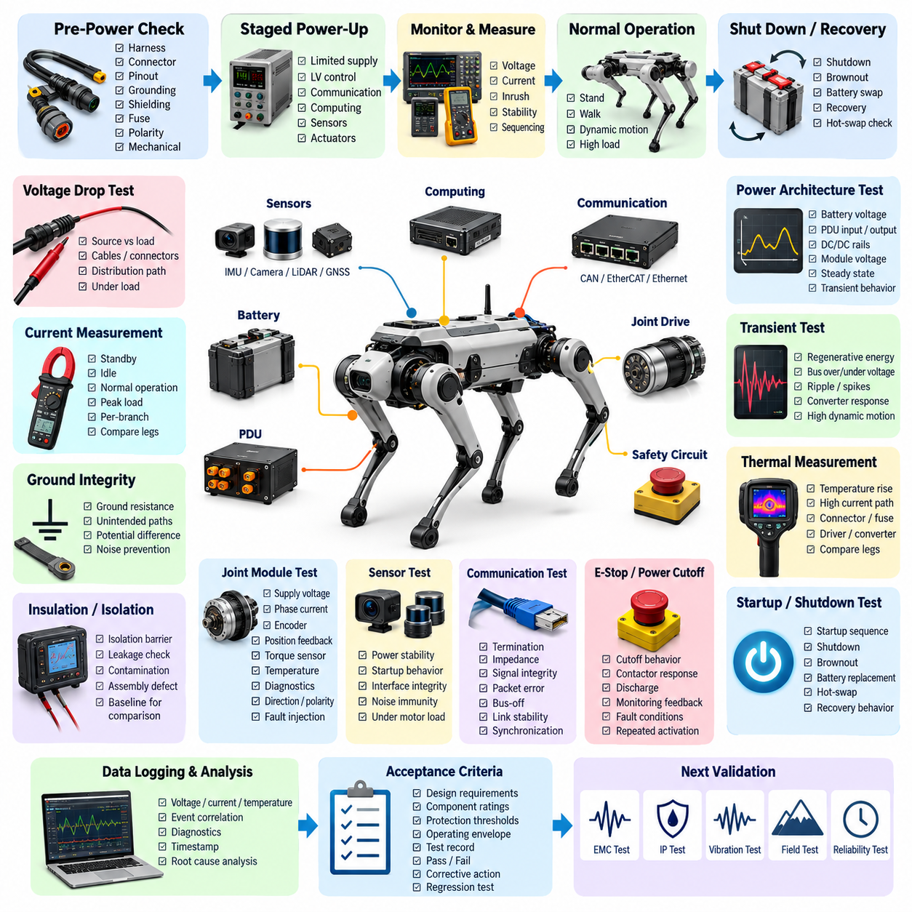
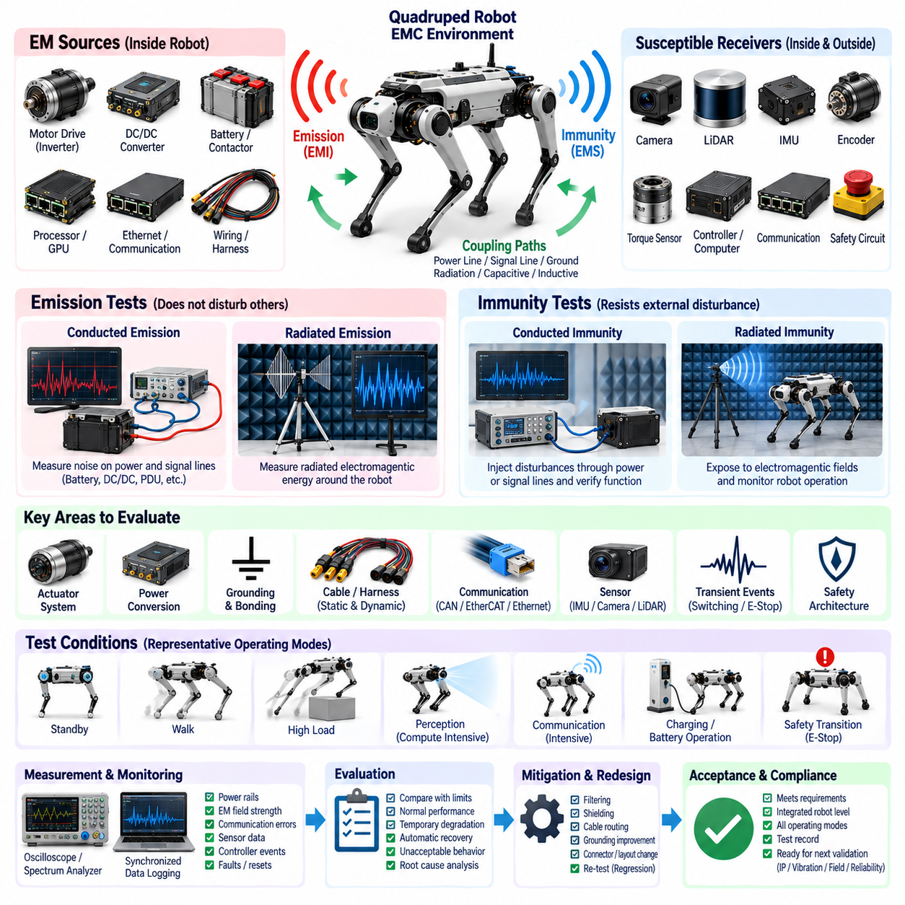
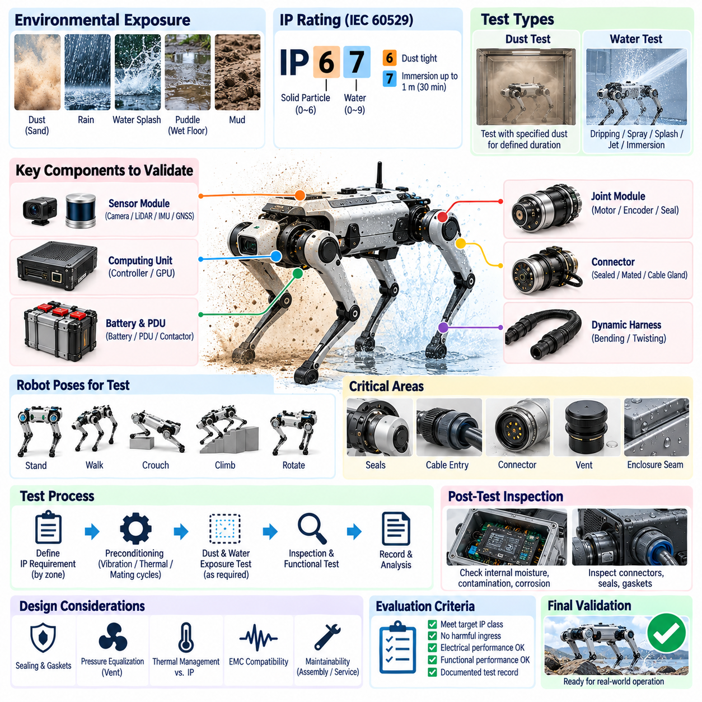
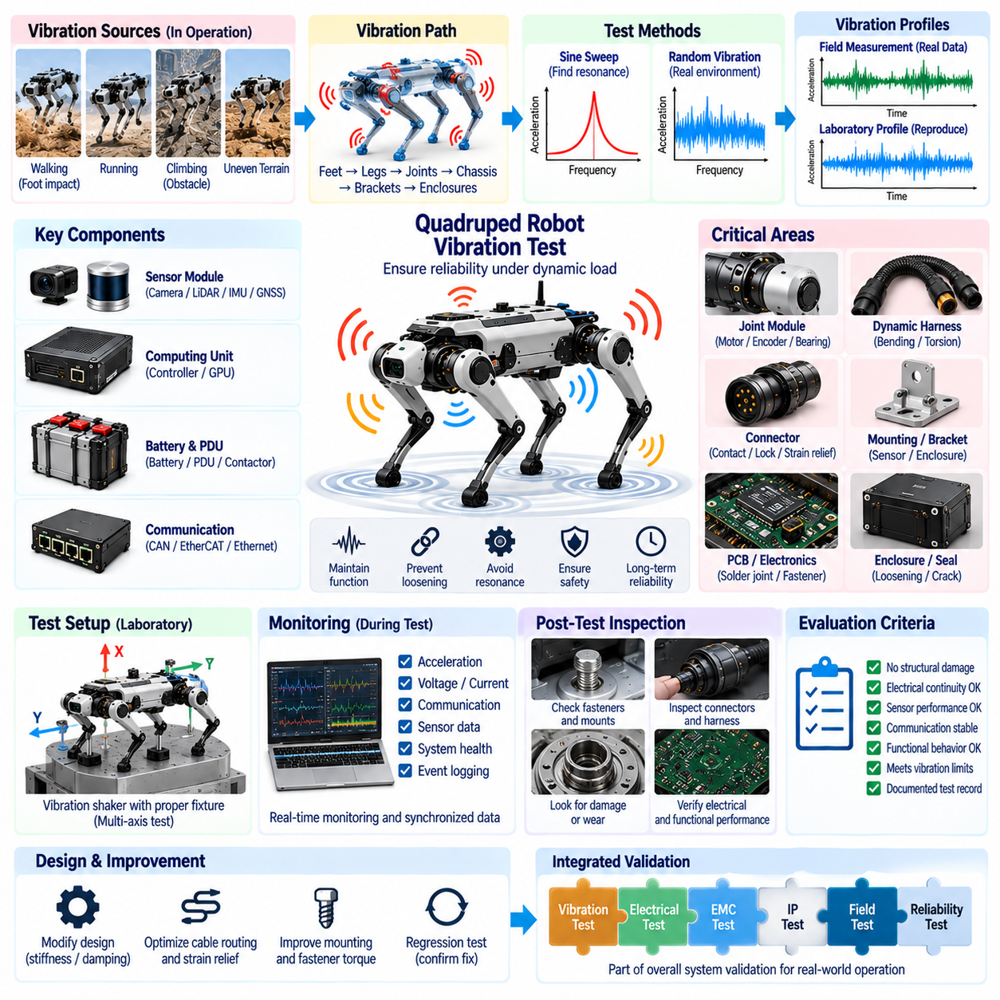
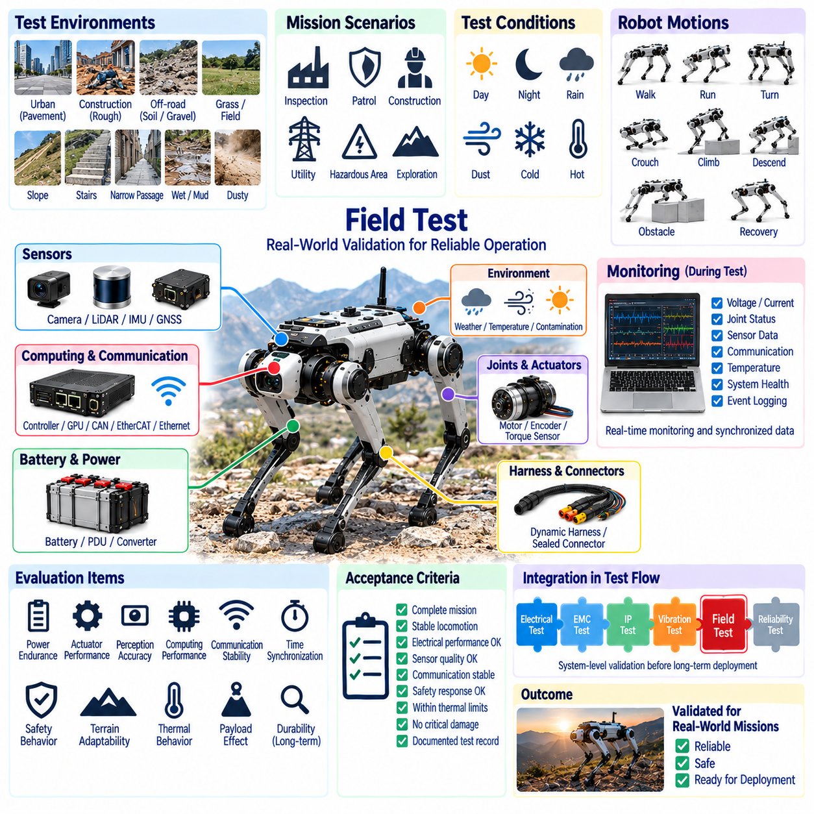
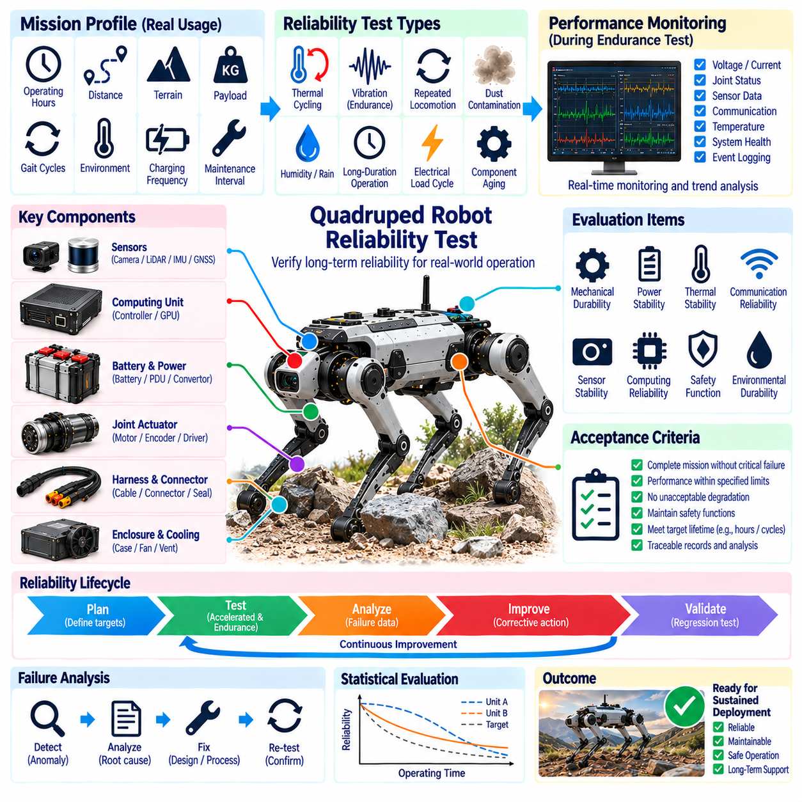

**Volume 20. Quadruped Electrical Architecture**


# Chapter 13. Testing and Validation

##  

## 13.01. Electrical Test

{width="7.268055555555556in" height="7.268055555555556in"}

Electrical testing of a quadruped robot verifies that the complete power, control, sensing, and communication infrastructure operates within its intended electrical limits before higher-level functional validation begins. The test scope should extend from the battery and power distribution unit to joint drives, computing modules, sensors, communication interfaces, safety circuits, and auxiliary loads. Testing must therefore evaluate both individual electrical characteristics and interactions among subsystems.

A practical electrical test strategy begins with controlled inspection before power is applied. Harness routing, connector engagement, pin assignments, grounding points, shielding termination, fuse ratings, polarity, and mechanical protection should be checked against the released electrical design. Continuity and isolation measurements can then identify open circuits, unintended shorts, incorrect cross-connections, or resistance anomalies that might otherwise damage expensive motor drives, sensors, or computing hardware during initial energization.

Power-up testing should use a staged sequence rather than connecting the complete robot directly to its maximum-energy battery source. Current-limited laboratory supplies or protected battery interfaces can first energize low-voltage control domains, followed by communication devices, computing hardware, sensors, and finally actuator power stages. Voltage and current should be recorded during each transition so abnormal inrush current, unexpected standby consumption, converter instability, or incorrect sequencing can be detected before full-power operation.

The quadruped power architecture requires particular attention because multiple high-dynamic actuators can create rapid changes in electrical demand. Battery voltage, PDU input and output voltage, DC/DC converter rails, joint-driver supply voltage, and local module voltages should be measured under representative operating conditions. Tests should capture steady-state values as well as transient behavior during standing, leg lifting, walking, acceleration, recovery motions, and simultaneous joint activation, where short-duration power demand may be substantially higher.

Voltage-drop testing determines whether cables, connectors, fuses, contactors, PCB traces, and distribution paths maintain sufficient voltage at each load. Measurements should preferably be performed at both the source and the actual load terminals while significant current is flowing. This is especially important for distant leg modules because dynamic harness sections and multiple connector interfaces can introduce resistance. Excessive voltage drop can reduce actuator torque capability, disturb electronics, increase conductor heating, and produce intermittent faults that appear only during demanding motions.

Current measurements should characterize the robot at several operational states, including power-off leakage, standby, computing-only operation, actuator-enabled idle, normal locomotion, and peak dynamic loading. Individual branch currents provide additional diagnostic value because abnormal consumption can reveal a damaged motor, excessive mechanical friction, driver malfunction, wiring problem, or sensor fault. Comparing measured current signatures among nominally identical legs can also expose manufacturing variation or early degradation before a conventional fault threshold is exceeded.

Ground integrity testing verifies that power return paths and reference grounds behave as intended throughout the distributed electrical architecture. Resistance between designated grounding points should be measured, while unintended current paths through shields, structural members, communication grounds, or sensor references should be investigated. Under operating conditions, ground-potential differences should remain sufficiently controlled to prevent corrupted analog measurements, communication instability, encoder errors, or resets of sensitive computing and sensing equipment.

Insulation and isolation testing becomes important wherever the architecture contains separated power domains, exposed conductive structures, high-current battery circuits, or isolated communication interfaces. The test must confirm that isolation barriers remain effective without applying stress beyond component ratings. Leakage paths caused by damaged insulation, contamination, assembly defects, or incorrect connector pinning should be detected before environmental exposure. Baseline isolation measurements are also useful for comparison after vibration, moisture, and long-duration reliability testing.

Joint-module electrical testing should verify each actuator interface independently before coordinated locomotion is attempted. Supply voltage, driver enable behavior, phase current response, encoder communication, position feedback, torque-sensor signals, temperature sensing, and diagnostic outputs should be observed together. Direction and polarity checks are essential because an electrically functional but reversed motor or encoder relationship can create immediate instability when closed-loop control is enabled. Fault injection can additionally confirm that diagnostic mechanisms recognize disconnected or abnormal interfaces.

Sensor electrical validation should verify not only whether a device produces data, but whether its power and interface characteristics remain stable across realistic robot operating conditions. IMUs, cameras, LiDAR, GNSS modules, foot-force sensors, and inspection payloads may have different voltage, current, grounding, timing, and communication requirements. Supply ripple, startup behavior, interface integrity, and susceptibility to actuator-generated disturbances should therefore be evaluated while motors and high-current loads are actively switching.

Communication interfaces should be electrically checked together with their protocol-level operation. CAN FD, EtherCAT, Gigabit Ethernet, and other buses depend on correct termination, impedance, grounding, shielding, connector quality, and physical-layer signal integrity. Tests should examine communication during actuator switching and high-load motion rather than only in a quiet laboratory state. Packet errors, bus-off events, link renegotiation, synchronization loss, or intermittent connector behavior may indicate electrical problems even when software configuration appears correct.

Emergency-stop and power-cutoff circuits require dedicated electrical verification because their behavior must remain predictable independently of normal application software. Tests should confirm the commanded removal or inhibition of actuator energy, contactor response, discharge behavior, monitoring feedback, and restoration sequence. Open-circuit, short-circuit, stuck-signal, or loss-of-control-power conditions should be considered where the architecture supports diagnostic coverage. Repeated activation also helps reveal contact degradation or sequencing problems that a single functional demonstration may miss.

Transient testing is particularly relevant to quadrupeds because regenerative motor operation and rapid actuator deceleration can return energy to the DC bus. Engineers should observe bus overvoltage, undervoltage, ripple, switching spikes, and converter response during aggressive acceleration, braking, landing, disturbance recovery, and abrupt emergency stopping. Measurement equipment must have adequate bandwidth and sampling performance; otherwise short electrical events capable of resetting electronics or damaging components may disappear from averaged voltage readings.

Thermal measurements complement electrical measurements because many electrical defects manifest as localized heating. Battery terminals, PDU devices, fuses, contactors, DC/DC converters, motor-driver power stages, connectors, splices, and high-current harness sections should be monitored during sustained operation. Temperature rise should be correlated with measured current and ambient conditions. Unexpected differences between equivalent joints or legs can indicate excessive contact resistance, insufficient conductor capacity, poor assembly, or abnormal actuator loading before visible damage occurs.

Testing should also evaluate startup, shutdown, brownout, battery replacement, and recovery behavior. A quadruped may contain controllers and sensors that reach operational state at different times, so unstable sequencing can generate communication faults or unsafe actuator states. Controlled reduction and restoration of supply voltage can reveal inadequate undervoltage handling, repeated processor resets, corrupted communication states, or unexpected motor-driver enabling. Hot-swap architectures require additional confirmation that insertion and removal do not create destructive current or voltage transients.

Electrical validation becomes substantially more useful when measurements are synchronized with system diagnostics and event logging. Voltage, current, temperature, actuator status, communication faults, controller resets, and timestamps can be correlated to reconstruct the sequence preceding an abnormal event. This approach connects electrical testing with the system health monitoring, event logging, remote diagnostics, and predictive-maintenance functions defined elsewhere in the quadruped architecture, turning test results into reusable engineering evidence rather than isolated laboratory observations.

Acceptance criteria should be established before formal testing and linked to design requirements, component ratings, protection thresholds, and operating envelopes. Each test record should identify hardware revision, firmware and software configuration, battery condition, instrumentation, environmental state, procedure, measured results, and pass/fail determination. Deviations should be traceable to corrective actions and subsequent regression tests. This discipline is essential because electrical behavior can change after harness revisions, connector substitutions, actuator updates, or modifications to power-distribution hardware.

Electrical testing ultimately provides the baseline for the broader validation sequence of the quadruped platform. A robot that passes bench-level electrical checks can proceed with greater confidence into EMC, ingress-protection, vibration, field, and reliability testing, which are explicitly separated as subsequent validation areas in the architecture. Electrical measurements should also be repeated after those tests because environmental and mechanical stresses can reveal latent connector, harness, grounding, insulation, or power-distribution weaknesses that were not observable in the initial laboratory condition.

사족보행 로봇(Quadruped Robot)의 전기 시험(Electrical Testing)은 상위 수준의 기능 검증(Functional Validation)을 시작하기 전에 전체 전력(Power), 제어(Control), 센싱(Sensing), 통신(Communication) 인프라가 설계된 전기적 한계 범위 내에서 동작하는지를 검증한다. 시험 범위는 배터리(Battery)와 전력 분배 장치(Power Distribution Unit, PDU)에서 관절 구동기(Joint Drive), 컴퓨팅 모듈(Computing Module), 센서(Sensor), 통신 인터페이스(Communication Interface), 안전 회로(Safety Circuit), 보조 부하(Auxiliary Load)에 이르기까지 확장되어야 한다. 따라서 시험에서는 개별 전기 특성뿐만 아니라 서브시스템(Subsystem) 간 상호작용도 함께 평가해야 한다.

실질적인 전기 시험 전략(Electrical Test Strategy)은 전원을 인가하기 전에 수행하는 체계적인 검사에서 시작한다. 하네스 라우팅(Harness Routing), 커넥터 체결(Connector Engagement), 핀 할당(Pin Assignment), 접지 지점(Grounding Point), 실드 종단(Shield Termination), 퓨즈 정격(Fuse Rating), 극성(Polarity), 기계적 보호(Mechanical Protection)를 승인된 전기 설계와 대조하여 확인해야 한다. 이후 연속성(Continuity) 및 절연(Isolation) 측정을 통해 개방 회로(Open Circuit), 의도하지 않은 단락(Short Circuit), 잘못된 교차 연결(Cross-Connection), 저항 이상(Resistance Anomaly)을 식별할 수 있다.

전원 인가 시험(Power-Up Test)은 완전한 로봇을 최대 에너지의 배터리 전원에 즉시 연결하는 대신 단계적인 순서로 수행해야 한다. 전류 제한형 실험실 전원 공급기(Current-Limited Laboratory Power Supply) 또는 보호된 배터리 인터페이스(Protected Battery Interface)를 사용하여 저전압 제어 영역(Low-Voltage Control Domain)을 먼저 활성화하고, 이후 통신 장치, 컴퓨팅 하드웨어, 센서, 마지막으로 액추에이터 전력단(Actuator Power Stage)을 활성화할 수 있다. 각 전환 과정에서 전압과 전류를 기록하면 비정상 돌입 전류(Inrush Current), 예상하지 못한 대기 전력 소비, 컨버터 불안정성, 잘못된 전원 시퀀싱(Power Sequencing)을 조기에 검출할 수 있다.

사족보행 로봇의 전력 아키텍처(Power Architecture)는 여러 개의 고동적 액추에이터(High-Dynamic Actuator)가 전기 부하를 빠르게 변화시킬 수 있기 때문에 특별한 주의가 필요하다. 배터리 전압, PDU 입력 및 출력 전압, DC/DC 컨버터(DC/DC Converter) 전원 레일, 관절 드라이버(Joint Driver) 공급 전압, 로컬 모듈 전압을 대표적인 운용 조건에서 측정해야 한다. 시험에서는 정상 상태(Steady-State)뿐만 아니라 기립, 다리 들어 올리기, 보행, 가속, 자세 복구 동작, 다수 관절의 동시 구동 과정에서 발생하는 과도 응답(Transient Behavior)도 포착해야 한다.

전압 강하 시험(Voltage-Drop Testing)은 케이블, 커넥터, 퓨즈, 접촉기(Contactor), PCB 배선, 전력 분배 경로가 각 부하에 충분한 전압을 공급하는지 판단한다. 상당한 전류가 흐르는 상태에서 전원 측과 실제 부하 단자 측의 전압을 동시에 측정하는 것이 바람직하다. 특히 원거리에 위치한 다리 모듈(Leg Module)은 동적 하네스(Dynamic Harness)와 여러 커넥터 인터페이스로 인해 저항이 증가할 수 있다. 과도한 전압 강하는 액추에이터 토크 성능을 저하시키고 전자장치 오동작, 도체 발열, 간헐적 고장을 발생시킬 수 있다.

전류 측정(Current Measurement)은 전원 차단 상태의 누설 전류(Power-Off Leakage), 대기 상태(Standby), 컴퓨팅 단독 동작, 액추에이터 활성화 유휴 상태, 정상 보행, 최대 동적 부하 등 여러 운용 상태에서 로봇을 특성화해야 한다. 개별 분기 전류(Branch Current)는 손상된 모터, 과도한 기계적 마찰, 드라이버 오동작, 배선 문제, 센서 고장 등을 식별하는 추가적인 진단 정보를 제공한다. 명목상 동일한 각 다리의 전류 시그니처(Current Signature)를 비교하면 일반적인 고장 임계값에 도달하기 전에 제조 편차나 초기 열화도 발견할 수 있다.

접지 무결성 시험(Ground Integrity Testing)은 분산형 전기 아키텍처(Distributed Electrical Architecture) 전체에서 전력 귀환 경로(Power Return Path)와 기준 접지(Reference Ground)가 의도한 대로 동작하는지를 검증한다. 지정된 접지 지점 사이의 저항을 측정하고, 실드, 구조물, 통신 접지 또는 센서 기준선을 통과하는 의도하지 않은 전류 경로를 조사해야 한다. 운용 중 접지 전위차(Ground-Potential Difference)는 아날로그 측정 오류, 통신 불안정, 엔코더 오류 또는 민감한 컴퓨팅 및 센싱 장비의 리셋을 방지할 수 있는 수준으로 관리되어야 한다.

절연 및 격리 시험(Insulation and Isolation Testing)은 분리된 전력 도메인(Power Domain), 노출된 전도성 구조물, 고전류 배터리 회로 또는 절연형 통신 인터페이스가 존재하는 아키텍처에서 중요하다. 시험은 부품 정격을 초과하는 스트레스를 가하지 않으면서 절연 장벽(Isolation Barrier)이 효과적으로 유지되는지를 확인해야 한다. 손상된 절연체, 오염, 조립 결함 또는 잘못된 커넥터 핀 연결로 발생하는 누설 경로를 환경 시험 전에 검출해야 한다. 기준 절연 측정값은 진동, 습기 및 장기 신뢰성 시험 이후의 비교 데이터로도 활용할 수 있다.

관절 모듈 전기 시험(Joint-Module Electrical Testing)은 협조 보행(Coordinated Locomotion)을 수행하기 전에 각 액추에이터 인터페이스를 독립적으로 검증해야 한다. 공급 전압, 드라이버 활성화 동작, 상전류(Phase Current) 응답, 엔코더 통신, 위치 피드백(Position Feedback), 토크 센서 신호, 온도 센싱, 진단 출력을 함께 관찰해야 한다. 전기적으로 정상 동작하더라도 모터 또는 엔코더 방향이 반대로 설정되면 폐루프 제어(Closed-Loop Control)가 활성화되는 순간 불안정성이 발생할 수 있으므로 방향과 극성 검증이 필수적이다. 고장 주입(Fault Injection)을 통해 비정상 인터페이스의 진단 검출 능력도 확인할 수 있다.

센서 전기 검증(Sensor Electrical Validation)은 장치가 단순히 데이터를 출력하는지뿐만 아니라 실제 로봇 운용 조건에서 전원 및 인터페이스 특성이 안정적으로 유지되는지도 확인해야 한다. 관성 측정 장치(Inertial Measurement Unit, IMU), 카메라(Camera), 라이다(LiDAR), 위성항법시스템(GNSS) 모듈, 발 힘 센서(Foot-Force Sensor), 검사 페이로드(Inspection Payload)는 서로 다른 전압, 전류, 접지, 타이밍 및 통신 요구사항을 가질 수 있다. 따라서 모터와 고전류 부하가 실제로 스위칭되는 상태에서 전원 리플(Supply Ripple), 기동 특성, 인터페이스 무결성 및 액추에이터 발생 노이즈의 영향을 평가해야 한다.

통신 인터페이스(Communication Interface)는 프로토콜 수준 동작과 함께 전기적으로도 검사해야 한다. CAN FD, EtherCAT, 기가비트 이더넷(Gigabit Ethernet) 등의 버스는 올바른 종단(Termination), 임피던스(Impedance), 접지, 실딩(Shielding), 커넥터 품질 및 물리 계층 신호 무결성(Physical-Layer Signal Integrity)에 의존한다. 시험은 정적인 실험실 조건뿐만 아니라 액추에이터 스위칭 및 고부하 운동 중에도 수행해야 한다. 패킷 오류(Packet Error), 버스 오프(Bus-Off), 링크 재협상(Link Renegotiation), 동기화 손실 또는 간헐적 커넥터 문제는 소프트웨어 설정이 정상이어도 전기적 문제를 나타낼 수 있다.

비상 정지(Emergency Stop) 및 전력 차단(Power Cutoff) 회로는 정상 애플리케이션 소프트웨어(Application Software)와 독립적으로 예측 가능한 동작을 보장해야 하므로 별도의 전기 검증이 필요하다. 시험에서는 액추에이터 에너지의 차단 또는 억제, 접촉기 응답, 방전 동작, 모니터링 피드백, 복구 시퀀스를 확인해야 한다. 아키텍처가 진단 커버리지(Diagnostic Coverage)를 지원하는 경우 개방 회로, 단락, 신호 고착(Stuck Signal), 제어 전원 손실 조건도 고려해야 한다. 반복적인 비상 정지 작동을 통해 단일 기능 시험에서는 발견하기 어려운 접점 열화나 시퀀싱 문제도 확인할 수 있다.

과도 상태 시험(Transient Testing)은 회생 모터 동작(Regenerative Motor Operation)과 액추에이터의 급격한 감속으로 인해 DC 버스로 에너지가 되돌아갈 수 있는 사족보행 로봇에서 특히 중요하다. 급가속, 제동, 착지, 외란 복구(Disturbance Recovery), 급격한 비상 정지 과정에서 버스 과전압, 저전압, 리플, 스위칭 스파이크(Switching Spike), 컨버터 응답을 관찰해야 한다. 측정 장비는 충분한 대역폭(Bandwidth)과 샘플링 성능을 가져야 하며, 그렇지 않으면 전자장치를 리셋시키거나 부품을 손상시킬 수 있는 짧은 전기적 이벤트가 평균 전압 측정에서 사라질 수 있다.

열 측정(Thermal Measurement)은 많은 전기적 결함이 국부적인 발열 형태로 나타나기 때문에 전기 측정을 보완한다. 배터리 단자, PDU 소자, 퓨즈, 접촉기, DC/DC 컨버터, 모터 드라이버 전력단, 커넥터, 스플라이스(Splice), 고전류 하네스 구간을 지속 운전 중 모니터링해야 한다. 온도 상승은 측정 전류 및 주변 환경 조건과 연계하여 분석해야 한다. 동일한 관절 또는 다리 사이에서 예상하지 못한 온도 차이가 나타난다면 과도한 접촉 저항, 부족한 도체 용량, 조립 불량 또는 비정상 액추에이터 부하를 의미할 수 있다.

시험에서는 기동(Start-Up), 종료(Shutdown), 저전압(Brownout), 배터리 교체 및 복구 동작도 평가해야 한다. 사족보행 로봇의 컨트롤러와 센서는 서로 다른 시간에 운용 상태에 도달할 수 있으므로 불안정한 시퀀싱은 통신 장애나 위험한 액추에이터 상태를 발생시킬 수 있다. 공급 전압을 제어된 방식으로 감소시켰다가 복원하면 부적절한 저전압 처리, 반복적인 프로세서 리셋, 손상된 통신 상태 또는 예상하지 못한 모터 드라이버 활성화를 발견할 수 있다. 핫스왑(Hot-Swap) 아키텍처에서는 배터리 삽입과 제거 시 파괴적인 전류 또는 전압 과도 현상이 발생하지 않는지도 추가로 검증해야 한다.

전기 검증(Electrical Validation)은 측정 데이터를 시스템 진단(System Diagnostics) 및 이벤트 로깅(Event Logging)과 동기화할 때 활용 가치가 크게 높아진다. 전압, 전류, 온도, 액추에이터 상태, 통신 고장, 컨트롤러 리셋, 타임스탬프(Timestamp)를 서로 연계하면 비정상 이벤트가 발생하기 직전의 과정을 재구성할 수 있다. 이러한 접근은 전기 시험을 시스템 상태 모니터링(System Health Monitoring), 이벤트 로깅, 원격 진단(Remote Diagnostics), 예지 정비(Predictive Maintenance) 기능과 연결하여 시험 결과를 단순한 실험실 관찰값이 아니라 재사용 가능한 엔지니어링 증거(Engineering Evidence)로 전환한다.

합격 기준(Acceptance Criteria)은 공식 시험을 수행하기 전에 설정하고 설계 요구사항, 부품 정격, 보호 임계값(Protection Threshold), 운용 범위(Operating Envelope)와 연결해야 한다. 각 시험 기록에는 하드웨어 리비전(Hardware Revision), 펌웨어 및 소프트웨어 구성, 배터리 상태, 측정 장비, 환경 상태, 시험 절차, 측정 결과, 합격 및 불합격 판정을 포함해야 한다. 편차 사항은 수정 조치(Corrective Action)와 후속 회귀 시험(Regression Test)까지 추적 가능해야 한다. 하네스 변경, 커넥터 대체, 액추에이터 업데이트 또는 전력 분배 하드웨어 변경 이후에는 전기적 특성이 달라질 수 있으므로 이러한 관리 체계가 필수적이다.

전기 시험은 궁극적으로 사족보행 플랫폼(Quadruped Platform)의 보다 광범위한 검증 절차를 위한 기준선(Baseline)을 제공한다. 벤치 수준 전기 검사(Bench-Level Electrical Check)를 통과한 로봇은 전자파 적합성 시험(EMC Test), 방진·방수 시험(Ingress-Protection Test), 진동 시험(Vibration Test), 필드 시험(Field Test), 신뢰성 시험(Reliability Test)으로 보다 안전하게 진행할 수 있다. 또한 환경적·기계적 스트레스는 초기 실험실 조건에서 발견되지 않았던 커넥터, 하네스, 접지, 절연 또는 전력 분배 계통의 잠재적 취약성을 드러낼 수 있으므로 이러한 시험 이후에도 주요 전기 측정을 반복해야 한다.

##  

## 13.02. EMC Test

{width="7.268055555555556in" height="7.268055555555556in"}

Electromagnetic compatibility testing verifies that a quadruped robot can operate correctly in its intended electromagnetic environment without generating disturbances that interfere with its own subsystems or nearby equipment. Because the platform combines high-current actuators, switching power electronics, distributed controllers, high-speed communication, cameras, LiDAR, IMUs, and sensitive sensor interfaces, EMC validation must address both electromagnetic emissions and immunity across the complete integrated robot.

The EMC test strategy should begin by identifying the major electromagnetic sources, coupling paths, and susceptible receivers within the architecture. Motor inverters, BLDC or PMSM drives, DC/DC converters, contactors, high-current battery cables, processors, GPU modules, and Ethernet interfaces can generate broadband or narrowband disturbances. These disturbances may couple through shared power lines, ground structures, harnesses, connector shields, free-space radiation, or parasitic capacitance and inductance into sensitive circuits.

Conducted emission testing evaluates unwanted electrical noise that propagates through power and signal conductors. Measurements should examine battery lines, DC/DC converter inputs and outputs, PDU branches, actuator supplies, and relevant low-voltage rails under representative operating conditions. Testing only with stationary joints is insufficient because inverter switching patterns and current demand change significantly during locomotion. Standing, walking, acceleration, joint reversal, high-torque motion, and recovery maneuvers should therefore be included when characterizing conducted disturbances.

Radiated emission testing determines whether electromagnetic energy generated by the robot exceeds acceptable levels or creates interference with surrounding systems. The robot should be evaluated with major computing, perception, communication, and actuator subsystems operating simultaneously. Motor-drive switching, processor clocks, GPU activity, Ethernet traffic, and poorly terminated cables can all contribute to radiation. Measurements should consider different robot orientations because the chassis, leg positions, and moving harness geometry can change effective antenna characteristics.

Conducted immunity testing examines whether disturbances entering through power or signal interfaces cause functional degradation. Injected disturbances can expose weaknesses in filtering, grounding, isolation, connector design, or power regulation that may not appear during ordinary operation. During testing, engineers should monitor controller resets, actuator faults, encoder errors, sensor corruption, communication interruptions, diagnostic events, and unexpected safety-state transitions rather than relying solely on whether the robot remains powered.

Radiated immunity testing exposes the integrated robot to controlled electromagnetic fields while its essential functions remain active. The purpose is to determine whether external transmitters or electromagnetic sources can influence locomotion, perception, computing, or safety behavior. Joint control stability, IMU outputs, camera and LiDAR operation, communication links, real-time controllers, and emergency functions should be continuously monitored. Temporary degradation can be significant even when the robot automatically recovers after the electromagnetic field is removed.

The actuator system deserves particular attention because multiple high-power joint modules operate close to sensors, communication cables, and computing electronics. Rapid PWM switching and high phase currents can generate common-mode and differential-mode noise that propagates through the robot structure and harness. EMC measurements should therefore compare individual joint operation with simultaneous multi-joint activation. Aggressive gait transitions and high-torque maneuvers can reveal interference mechanisms that remain hidden when each actuator is tested independently.

Power-conversion devices form another major EMC source. Battery interfaces, PDU switching devices, DC/DC converters, auxiliary converters, and motor drivers generate transient and repetitive switching components over a wide frequency range. Input filters, output filters, local decoupling, cable routing, grounding, and shielding should be evaluated as a coordinated system. A filter that performs adequately on a bench can behave differently after integration because actual cable impedance, chassis coupling, and distributed loads modify its electrical environment.

Grounding and bonding validation should accompany EMC testing because electromagnetic performance depends strongly on return-current paths. Chassis connections, electronics grounds, power returns, sensor references, shield terminations, and structural bonding points should follow the intended architecture. High-frequency currents do not necessarily follow the same paths as DC current, so a connection with acceptable resistance at low frequency may still have excessive high-frequency impedance. Unexpected ground loops can also convert common-mode disturbances into differential noise at sensitive interfaces.

Harness configuration must represent the production design as closely as possible during formal EMC evaluation. Cable length, routing, separation, twisting, shielding, connector backshells, clamp positions, and proximity to motors or power electronics can strongly affect coupling. The dynamic leg harness is particularly important because its geometry changes as the robot moves. EMC testing should therefore consider representative leg postures and cable configurations rather than assuming that one static harness arrangement represents every operational condition.

Communication networks require simultaneous physical-layer and protocol-level observation during EMC testing. CAN FD, EtherCAT, Gigabit Ethernet, and other links may continue operating while experiencing increased error rates, retries, synchronization disturbances, or intermittent packet loss. Bus errors, link status, packet statistics, latency, clock synchronization, and diagnostic counters should be logged together with electromagnetic test conditions. This approach helps distinguish communication susceptibility from application software faults and identifies margins before complete link failure occurs.

Sensor susceptibility is critical because small disturbances can corrupt measurements without producing an obvious electrical failure. IMUs, encoders, torque sensors, foot-force sensors, cameras, LiDAR, GNSS receivers, and inspection sensors should be observed for bias shifts, spikes, dropped frames, invalid measurements, synchronization loss, or temporary communication interruptions. Particular attention should be given to sensor signals used directly by balance and locomotion control because short disturbances can propagate rapidly into actuator commands and whole-body behavior.

Transient electromagnetic events should also be evaluated because switching inductive loads, opening contactors, emergency power cutoff, battery connection, and regenerative actuator operation can generate short-duration disturbances. These events may produce voltage spikes, ringing, ground shifts, or temporary supply interruptions that interact with sensitive electronics. Oscilloscopes and appropriate probes should capture events at relevant power rails and interfaces while system logs record resets, faults, communication errors, and safety responses at synchronized timestamps.

EMC testing of the safety architecture should determine whether electromagnetic disturbances can compromise emergency-stop paths, actuator disable functions, safety controllers, monitoring signals, or power cutoff mechanisms. Safety-related interfaces should move to their defined safe or degraded states when disturbances exceed tolerated limits rather than producing uncontrolled behavior. Testing should also examine whether false emergency triggers occur, since excessive susceptibility can reduce operational availability even when the system ultimately remains safe.

Pre-compliance testing is valuable during development because EMC problems are substantially easier to correct before the mechanical and electrical architecture becomes fixed. Near-field probes, current probes, oscilloscopes, spectrum analyzers, and temporary shielding or filtering can help identify dominant sources and coupling paths. Engineers can compare alternative cable routes, shield termination methods, ferrites, filters, grounding arrangements, and converter configurations before committing to formal laboratory testing and production-intent hardware.

Formal EMC validation should use clearly defined operating modes because electromagnetic behavior varies with robot activity. Representative modes can include standby, computing-intensive perception, communication-intensive operation, actuator-enabled idle, normal walking, maximum practical joint activity, charging or battery-related operation where applicable, and safety transitions. The worst emission condition and the most susceptible operating condition may be different, so test planning should not assume that a single maximum-power state represents every EMC risk.

Test instrumentation and robot diagnostics should share a consistent time reference whenever practical. Correlating field strength, injected disturbance level, frequency, power-rail behavior, communication errors, actuator faults, sensor anomalies, and controller events makes root-cause analysis considerably more effective. The quadruped architecture already incorporates time synchronization, health monitoring, diagnostics, and event logging, allowing EMC results to become part of the broader validation evidence rather than remaining isolated laboratory measurements.

Acceptance criteria should distinguish between normal performance, temporary degradation, automatic recovery, and unacceptable or unsafe behavior. A test record should identify robot hardware configuration, harness revision, firmware and software versions, battery condition, operating mode, test setup, disturbance parameters, observed behavior, diagnostic records, and corrective actions. Any design change introduced to solve an EMC problem should be followed by regression testing because modifications to filters, grounding, shielding, connectors, or cable routing can influence other subsystems.

EMC validation should ultimately demonstrate compatibility at the integrated robot level rather than merely showing that individual components passed isolated tests. A compliant motor driver, computer, sensor, or converter can still create system-level interference after installation because the final chassis, harness, grounding, and power distribution architecture establishes new coupling paths. EMC results should therefore be considered together with electrical, ingress-protection, vibration, field, and reliability testing within the overall quadruped testing and validation framework.

전자파 적합성 시험(Electromagnetic Compatibility Testing)은 사족보행 로봇(Quadruped Robot)이 자체 서브시스템(Subsystem)이나 주변 장비를 방해하는 전자기 교란(Electromagnetic Disturbance)을 발생시키지 않으면서 의도된 전자기 환경(Electromagnetic Environment)에서 정상적으로 동작할 수 있는지를 검증한다. 플랫폼에는 고전류 액추에이터, 스위칭 전력전자 장치, 분산형 컨트롤러, 고속 통신, 카메라, 라이다(LiDAR), 관성 측정 장치(IMU), 민감한 센서 인터페이스가 결합되므로 전자파 적합성(EMC) 검증은 완전히 통합된 로봇 수준에서 전자파 방출(Emission)과 내성(Immunity)을 모두 다루어야 한다.

전자파 적합성 시험 전략(EMC Test Strategy)은 아키텍처 내부의 주요 전자기 발생원(Electromagnetic Source), 결합 경로(Coupling Path), 민감 수신부(Susceptible Receiver)를 식별하는 것에서 시작해야 한다. 모터 인버터, BLDC 또는 PMSM 드라이브, DC/DC 컨버터, 접촉기(Contactor), 고전류 배터리 케이블, 프로세서, GPU 모듈, 이더넷(Ethernet) 인터페이스는 광대역 또는 협대역 교란을 발생시킬 수 있다. 이러한 교란은 공유 전력선, 접지 구조, 하네스, 커넥터 실드, 공간 방사, 기생 커패시턴스(Parasitic Capacitance)와 인덕턴스(Inductance)를 통해 민감한 회로로 결합될 수 있다.

전도성 방출 시험(Conducted Emission Testing)은 전력 및 신호 도체를 통해 전달되는 불필요한 전기적 노이즈를 평가한다. 대표적인 운용 조건에서 배터리 라인, DC/DC 컨버터 입력 및 출력, 전력 분배 장치(PDU) 분기, 액추에이터 전원, 주요 저전압 전원 레일을 측정해야 한다. 정지된 관절만을 대상으로 시험하는 것은 충분하지 않으며, 보행 과정에서 인버터 스위칭 패턴과 전류 요구량이 크게 변화하기 때문이다. 따라서 기립, 보행, 가속, 관절 방향 전환, 고토크 동작 및 자세 복구 동작을 전도성 교란 특성 평가에 포함해야 한다.

방사성 방출 시험(Radiated Emission Testing)은 로봇에서 발생하는 전자기 에너지가 허용 가능한 수준을 초과하거나 주변 시스템에 간섭을 발생시키는지를 판단한다. 주요 컴퓨팅, 인지, 통신 및 액추에이터 서브시스템을 동시에 동작시키면서 로봇을 평가해야 한다. 모터 드라이브 스위칭, 프로세서 클록, GPU 동작, 이더넷 트래픽, 부적절하게 종단된 케이블 등이 모두 방사 원인이 될 수 있다. 또한 섀시, 다리 자세, 움직이는 하네스 형상에 따라 유효 안테나 특성(Effective Antenna Characteristics)이 달라질 수 있으므로 서로 다른 로봇 방향과 자세를 고려해야 한다.

전도성 내성 시험(Conducted Immunity Testing)은 전력 또는 신호 인터페이스를 통해 유입되는 교란이 기능 저하를 발생시키는지를 평가한다. 주입된 교란(Injected Disturbance)은 일반적인 운용에서는 나타나지 않는 필터링, 접지, 절연, 커넥터 설계 또는 전력 조정(Power Regulation)의 취약성을 드러낼 수 있다. 시험 중에는 로봇의 전원이 유지되는지만 확인해서는 안 되며, 컨트롤러 리셋, 액추에이터 고장, 엔코더 오류, 센서 데이터 손상, 통신 중단, 진단 이벤트 및 예상하지 못한 안전 상태 전환을 함께 모니터링해야 한다.

방사성 내성 시험(Radiated Immunity Testing)은 필수 기능을 활성화한 상태의 통합 로봇을 제어된 전자기장에 노출시킨다. 목적은 외부 송신기 또는 전자기 발생원이 보행, 인지, 컴퓨팅 또는 안전 동작에 영향을 줄 수 있는지를 판단하는 것이다. 관절 제어 안정성, IMU 출력, 카메라와 라이다 동작, 통신 링크, 실시간 컨트롤러(Real-Time Controller), 비상 기능을 지속적으로 모니터링해야 한다. 전자기장이 제거된 후 로봇이 자동 복구되더라도 일시적인 성능 저하는 중요한 시험 결과가 될 수 있다.

액추에이터 시스템(Actuator System)은 다수의 고출력 관절 모듈이 센서, 통신 케이블, 컴퓨팅 전자장치와 가까운 위치에서 동작하기 때문에 특별한 주의가 필요하다. 빠른 펄스 폭 변조(PWM) 스위칭과 높은 상전류(Phase Current)는 로봇 구조와 하네스를 통해 전달되는 공통 모드(Common-Mode) 및 차동 모드(Differential-Mode) 노이즈를 발생시킬 수 있다. 따라서 전자파 적합성 측정에서는 개별 관절 동작과 다수 관절의 동시 활성화를 비교해야 한다. 공격적인 보행 전환과 고토크 동작은 개별 액추에이터 시험에서는 나타나지 않는 간섭 메커니즘을 드러낼 수 있다.

전력 변환 장치(Power-Conversion Device)는 또 다른 주요 전자파 발생원이다. 배터리 인터페이스, PDU 스위칭 장치, DC/DC 컨버터, 보조 컨버터, 모터 드라이버는 넓은 주파수 범위에서 과도성 및 반복성 스위칭 성분을 발생시킨다. 입력 필터, 출력 필터, 로컬 디커플링(Local Decoupling), 케이블 라우팅, 접지 및 실딩(Shielding)을 하나의 통합 시스템으로 평가해야 한다. 벤치 시험에서 충분한 성능을 보인 필터라도 실제 케이블 임피던스, 섀시 결합, 분산 부하가 전기적 환경을 변화시키기 때문에 로봇 통합 후에는 다른 특성을 나타낼 수 있다.

접지 및 본딩 검증(Grounding and Bonding Validation)은 전자기적 성능이 귀환 전류 경로(Return-Current Path)에 크게 의존하므로 전자파 적합성 시험과 함께 수행해야 한다. 섀시 연결, 전자장치 접지, 전력 귀환, 센서 기준 접지, 실드 종단 및 구조적 본딩 지점은 설계된 아키텍처를 따라야 한다. 고주파 전류는 반드시 직류 전류와 동일한 경로를 따르는 것이 아니므로 저주파에서 허용 가능한 저항을 갖는 연결도 고주파에서는 과도한 임피던스를 가질 수 있다. 예상하지 못한 접지 루프(Ground Loop)는 공통 모드 교란을 민감한 인터페이스의 차동 노이즈로 변환할 수도 있다.

공식적인 전자파 적합성 평가에서는 하네스 구성(Harness Configuration)이 양산 설계(Production Design)를 가능한 한 정확하게 대표해야 한다. 케이블 길이, 라우팅, 분리 간격, 꼬임(Twisting), 실딩, 커넥터 백셸(Connector Backshell), 클램프 위치, 모터 또는 전력전자 장치와의 거리는 결합 특성에 큰 영향을 줄 수 있다. 동적 다리 하네스(Dynamic Leg Harness)는 로봇의 움직임에 따라 형상이 변하므로 특히 중요하다. 따라서 하나의 정적인 하네스 배치가 모든 운용 조건을 대표한다고 가정하지 말고 대표적인 다리 자세와 케이블 형상을 고려해야 한다.

통신 네트워크(Communication Network)는 전자파 적합성 시험 중 물리 계층(Physical Layer)과 프로토콜 계층(Protocol Layer)을 동시에 관찰해야 한다. CAN FD, EtherCAT, 기가비트 이더넷(Gigabit Ethernet) 등의 링크는 동작을 계속하면서도 오류율 증가, 재전송, 동기화 교란 또는 간헐적인 패킷 손실을 경험할 수 있다. 버스 오류, 링크 상태, 패킷 통계, 지연 시간(Latency), 클록 동기화 및 진단 카운터를 전자기 시험 조건과 함께 기록해야 한다. 이를 통해 통신 내성 문제와 애플리케이션 소프트웨어 오류를 구분하고 완전한 링크 장애에 도달하기 전의 설계 여유를 파악할 수 있다.

센서 내성(Sensor Susceptibility)은 작은 교란도 명확한 전기적 고장을 발생시키지 않은 채 측정값을 손상시킬 수 있기 때문에 중요하다. IMU, 엔코더, 토크 센서, 발 힘 센서(Foot-Force Sensor), 카메라, 라이다, 위성항법시스템(GNSS) 수신기 및 검사 센서를 대상으로 바이어스 변화(Bias Shift), 스파이크, 프레임 손실, 비정상 측정값, 동기화 손실 또는 일시적인 통신 중단을 관찰해야 한다. 특히 균형 및 보행 제어에 직접 사용되는 센서 신호의 짧은 교란은 액추에이터 명령과 전신 동작(Whole-Body Behavior)으로 빠르게 전파될 수 있으므로 세밀하게 평가해야 한다.

과도 전자기 이벤트(Transient Electromagnetic Event)도 평가해야 한다. 유도성 부하의 스위칭, 접촉기 개방, 비상 전력 차단, 배터리 연결 및 액추에이터 회생 동작(Regenerative Actuator Operation)은 짧은 시간 동안 강한 교란을 발생시킬 수 있다. 이러한 이벤트는 전압 스파이크, 링잉(Ringing), 접지 전위 이동 또는 일시적인 전원 중단을 발생시켜 민감한 전자장치에 영향을 줄 수 있다. 오실로스코프(Oscilloscope)와 적절한 프로브를 사용하여 주요 전원 레일과 인터페이스의 현상을 포착하고, 시스템 로그에서는 리셋, 고장, 통신 오류 및 안전 응답을 동기화된 타임스탬프로 기록해야 한다.

안전 아키텍처(Safety Architecture)의 전자파 적합성 시험은 전자기 교란이 비상 정지 경로(Emergency-Stop Path), 액추에이터 비활성화 기능, 안전 컨트롤러(Safety Controller), 모니터링 신호 또는 전력 차단 메커니즘을 손상시킬 수 있는지를 판단해야 한다. 안전 관련 인터페이스는 허용 한계를 초과하는 교란이 발생할 경우 제어되지 않은 동작이 아니라 정의된 안전 상태(Safe State) 또는 성능 저하 상태(Degraded State)로 전환되어야 한다. 또한 과도한 전자파 민감성으로 인한 잘못된 비상 정지(False Emergency Trigger)는 시스템이 안전하더라도 운용 가용성을 저하시킬 수 있으므로 함께 평가해야 한다.

사전 적합성 시험(Pre-Compliance Testing)은 기계 및 전기 아키텍처가 고정되기 전에 전자파 문제를 수정하는 것이 훨씬 용이하기 때문에 개발 과정에서 높은 가치가 있다. 근접장 프로브(Near-Field Probe), 전류 프로브(Current Probe), 오실로스코프, 스펙트럼 분석기(Spectrum Analyzer), 임시 실딩 또는 필터링을 이용하면 주요 전자파 발생원과 결합 경로를 식별할 수 있다. 엔지니어는 공식 시험실 평가와 양산 의도 하드웨어(Production-Intent Hardware)를 확정하기 전에 케이블 경로, 실드 종단 방식, 페라이트(Ferrite), 필터, 접지 구성 및 컨버터 설정의 대안을 비교할 수 있다.

공식 전자파 적합성 검증(Formal EMC Validation)은 로봇의 활동에 따라 전자기 특성이 달라지므로 명확하게 정의된 운용 모드(Operating Mode)를 사용해야 한다. 대표적인 모드에는 대기 상태, 컴퓨팅 집약적 인지 처리, 통신 집약적 동작, 액추에이터 활성화 유휴 상태, 정상 보행, 실제 운용 범위 내 최대 관절 동작, 적용 가능한 경우 충전 또는 배터리 관련 동작, 안전 상태 전환 등이 포함될 수 있다. 최악의 방출 조건과 가장 민감한 내성 조건은 서로 다를 수 있으므로 단일 최대 전력 상태가 모든 전자파 적합성 위험을 대표한다고 가정해서는 안 된다.

가능한 경우 시험 계측 장비(Test Instrumentation)와 로봇 진단 시스템은 일관된 시간 기준(Time Reference)을 공유해야 한다. 전자기장 세기, 주입 교란 수준, 주파수, 전원 레일 동작, 통신 오류, 액추에이터 고장, 센서 이상 및 컨트롤러 이벤트를 서로 연계하면 근본 원인 분석(Root-Cause Analysis)의 효율을 크게 높일 수 있다. 사족보행 로봇 아키텍처에는 시간 동기화(Time Synchronization), 상태 모니터링(Health Monitoring), 진단(Diagnostics), 이벤트 로깅(Event Logging)이 포함되므로 전자파 적합성 결과를 독립된 실험실 측정값이 아닌 전체 검증 증거(Validation Evidence)의 일부로 활용할 수 있다.

합격 기준(Acceptance Criteria)은 정상 성능, 일시적인 성능 저하, 자동 복구 및 허용할 수 없거나 위험한 동작을 구분할 수 있어야 한다. 시험 기록에는 로봇 하드웨어 구성, 하네스 리비전(Harness Revision), 펌웨어 및 소프트웨어 버전, 배터리 상태, 운용 모드, 시험 구성, 교란 조건, 관찰된 동작, 진단 기록 및 수정 조치(Corrective Action)를 포함해야 한다. 전자파 문제 해결을 위해 적용된 모든 설계 변경은 회귀 시험(Regression Testing)을 수행해야 한다. 필터, 접지, 실딩, 커넥터 또는 케이블 라우팅 변경이 다른 서브시스템에 영향을 줄 수 있기 때문이다.

전자파 적합성 검증은 궁극적으로 개별 부품이 독립 시험을 통과했다는 사실만을 확인하는 것이 아니라 통합 로봇 수준(Integrated Robot Level)의 적합성을 입증해야 한다. 적합성을 만족하는 모터 드라이버, 컴퓨터, 센서 또는 컨버터도 최종 섀시, 하네스, 접지 및 전력 분배 아키텍처에 설치되면 새로운 결합 경로가 형성되어 시스템 수준의 간섭을 발생시킬 수 있다. 따라서 전자파 적합성 시험 결과는 사족보행 로봇의 전체 시험 및 검증 프레임워크(Testing and Validation Framework) 내에서 전기 시험(Electrical Test), 방진·방수 시험(Ingress-Protection Test), 진동 시험(Vibration Test), 필드 시험(Field Test), 신뢰성 시험(Reliability Test)의 결과와 함께 종합적으로 평가해야 한다.

##  

## 13.03. IP Test

{width="7.268055555555556in" height="7.268055555555556in"}

Ingress Protection testing verifies whether a quadruped robot can prevent harmful intrusion of solid particles and water into electrical and electronic assemblies under the environmental conditions defined for its mission. Because the robot contains moving legs, articulated joints, dynamic harnesses, sensors, computers, batteries, power electronics, and external connectors, protection must be validated at component, enclosure, interface, and integrated-system levels rather than assumed from individual IP-rated parts.

The IP test strategy should begin by defining the required protection level for each electrical zone. A central computing enclosure may experience different exposure from a foot module, joint actuator, battery compartment, or externally mounted sensor. The target IP rating should therefore reflect installation position, expected dust, rain, splash, cleaning procedures, temporary immersion risk, and mission environment. The final robot rating must consider the weakest relevant enclosure or interface exposed during normal operation.

Solid-particle protection testing evaluates whether dust or other particles can enter an enclosure in quantities that impair operation or create unsafe electrical conditions. Fine particles can contaminate connectors, optical surfaces, cooling systems, bearings, printed circuit boards, and high-voltage or high-current interfaces. For quadrupeds used in industrial, construction, mining, agricultural, or outdoor inspection environments, dust exposure may occur continuously while the robot walks and can be intensified by airflow generated around moving legs.

Dust testing should represent the actual mechanical configuration of the robot or the enclosure being qualified. Cable glands, pressure vents, removable covers, service panels, connector interfaces, shaft seals, and fastening points are common ingress paths and should be installed using production-intent parts and assembly processes. Testing an idealized prototype with additional sealant or temporary closures can produce results that do not represent production performance, so configuration control is essential throughout validation.

Water protection testing evaluates resistance to dripping water, spray, splashing, jets, or immersion according to the required protection class. A quadruped robot can encounter rain, wet floors, puddles, cleaning water, mud, or direct splash generated by its own motion. Water may approach an enclosure from many directions because the robot continuously changes body height and leg orientation. Test planning should therefore consider realistic exposure angles rather than treating the robot as a stationary cabinet.

Joint modules are particularly challenging because they combine electrical interfaces with continuous mechanical motion. Rotary seals, motor housings, encoder covers, torque-sensor interfaces, bearings, cable exits, and connector boundaries must maintain protection throughout the intended joint range. A seal that prevents ingress in a static position may deform or open during repeated articulation. IP validation should therefore include representative joint positions and, where practical, motion before or during environmental exposure.

Dynamic leg harnesses require dedicated attention because repeated bending, twisting, abrasion, and tension can gradually reduce ingress protection at cable jackets, boots, glands, and connectors. Harness routing should be tested in representative standing, crouching, walking, and extreme articulation configurations. Water or dust intrusion at a damaged cable entry can migrate along conductors or braided shields into an enclosure, meaning the visible entry point and the eventual electrical failure location may be physically separated.

Connector sealing should be validated in the fully mated production condition. Interface seals, radial seals, wire seals, backshells, locking mechanisms, unused cavities, and protective caps can all influence performance. Incorrect wire diameter, damaged seal surfaces, incomplete connector engagement, or poor crimp positioning may compromise protection even when the connector family itself carries an IP rating. Service-disconnect connectors should also be evaluated after realistic mating and unmating cycles because sealing performance can deteriorate with handling.

Battery and power-distribution areas require careful ingress validation because moisture or conductive contamination can create leakage currents, corrosion, short circuits, insulation degradation, or unintended current paths. Battery enclosures, PDU housings, fuse and contactor compartments, charging interfaces, emergency disconnects, and high-current connectors should be inspected before and after exposure. Drainage and pressure-equalization features must prevent water accumulation without creating uncontrolled paths for contaminants to reach sensitive electrical components.

Pressure equalization is important in sealed robot enclosures because internal temperature changes can create pressure differences that draw moisture through small gaps. Batteries, motor drivers, processors, and DC/DC converters generate heat during operation, while outdoor environments can expose the robot to rapid temperature changes. Membrane vents or other pressure-management devices should therefore be evaluated as part of the enclosure system. Their location, orientation, contamination resistance, and long-term sealing behavior can directly affect ingress performance.

Sensor modules present additional challenges because their optical or sensing surfaces cannot simply be enclosed behind arbitrary protective structures. Cameras, LiDAR, GNSS modules, IMUs, and inspection sensors may require transparent windows, exposed apertures, radomes, or specialized seals. Water droplets, condensation, dust deposits, and contamination can degrade perception even without entering the electronics. IP validation should therefore distinguish between enclosure integrity and mission-level sensor performance following environmental exposure.

Preconditioning should be considered before formal IP testing because a new enclosure may perform differently from hardware that has experienced realistic mechanical stress. Vibration, thermal cycling, connector mating cycles, joint movement, harness flexing, maintenance access, or controlled aging can expose weaknesses in gaskets and sealing interfaces. Performing ingress tests only on pristine hardware can overestimate field durability. The sequence of environmental tests should therefore be defined according to the failure mechanisms that the validation program intends to reveal.

Post-exposure inspection should combine visual examination with electrical and functional testing. Engineers should inspect internal surfaces, connector cavities, seals, vents, cable entries, corrosion-prone areas, and moisture indicators where provided. Continuity, insulation resistance, leakage current, communication stability, sensor operation, actuator behavior, and diagnostic status should be checked after exposure. A robot that powers on successfully may still contain trapped moisture or contamination capable of causing delayed corrosion and reliability failures.

Water detection should not rely only on obvious pools or droplets. Small quantities of moisture can migrate beneath connectors, along harness braids, around fasteners, or between enclosure interfaces. Condensation may also appear after the robot returns to a different temperature. Controlled disassembly procedures should preserve evidence of ingress rather than allowing water to escape before inspection. Photographs, moisture-sensitive indicators, mass measurements, or localized inspection methods can support root-cause analysis when leakage is difficult to trace.

The interaction between IP protection and thermal management must be considered during design validation. Increasing enclosure sealing can restrict airflow and improve resistance to water and dust while simultaneously increasing internal temperature. Conversely, adding vents, fans, or cooling openings can create new ingress paths. Quadruped electrical architecture therefore requires coordinated evaluation of sealing, pressure equalization, cooling, component temperature, and power dissipation so that environmental protection does not unintentionally reduce electrical or computing reliability.

Ingress protection can also interact with electromagnetic compatibility. Conductive gaskets, metal enclosure joints, connector backshells, shield terminations, and cable glands may contribute simultaneously to environmental sealing and EMC performance. A sealing modification that changes metal-to-metal contact or shield termination can alter electromagnetic behavior, while an EMC modification can compromise a water barrier. Design changes following IP failures should therefore trigger appropriate electrical and EMC regression testing rather than being treated as isolated mechanical corrections.

Integrated robot testing should reproduce representative operating configurations because enclosure orientation changes continuously during quadruped locomotion. Standing, crouching, climbing, turning, and recovery postures can expose seams or connectors that are normally protected by geometry. The underside, foot and lower-leg regions may receive substantially greater contamination than upper-body electronics. Mission-specific tests can supplement standardized IP procedures when standardized exposure alone does not represent the actual environmental risk of the intended application.

Acceptance criteria should specify not only the target ingress-protection classification but also allowable internal evidence, electrical performance, functional behavior, and post-test condition. Test records should document hardware revision, sealing materials, fastener torque, connector configuration, harness routing, preconditioning, exposure parameters, orientation, operating state, inspection results, and corrective actions. This traceability is essential because seemingly minor changes to gaskets, cable glands, covers, vents, or assembly processes can materially change protection performance.

A failed IP test should lead to identification of the physical ingress path and failure mechanism rather than simply adding sealant around the suspected region. Root-cause analysis should determine whether leakage resulted from tolerance stack-up, gasket compression, surface finish, connector assembly, cable movement, pressure differential, mechanical deformation, or an unsuitable sealing concept. Corrective designs should then be retested under equivalent conditions and, where relevant, after mechanical preconditioning to demonstrate that the improvement is robust.

IP validation ultimately establishes whether the quadruped electrical architecture can preserve its required electrical and functional integrity when exposed to dust and water throughout realistic operation. Its results should be evaluated together with electrical, EMC, vibration, field, and reliability testing because ingress protection can degrade through mechanical stress and aging. The testing structure therefore treats IP testing as one part of an integrated validation process rather than an isolated enclosure qualification activity.

방진·방수 보호 시험(Ingress Protection Testing)은 사족보행 로봇(Quadruped Robot)이 임무를 위해 정의된 환경 조건에서 고체 입자(Solid Particle)와 물이 전기 및 전자 장치 내부로 유해하게 침투하는 것을 방지할 수 있는지를 검증한다. 로봇에는 움직이는 다리, 관절형 조인트, 동적 하네스(Dynamic Harness), 센서, 컴퓨터, 배터리, 전력전자 장치 및 외부 커넥터가 포함되므로 개별 IP 등급 부품만으로 보호 성능을 가정해서는 안 되며, 부품, 인클로저(Enclosure), 인터페이스 및 통합 시스템 수준에서 검증해야 한다.

IP 시험 전략(IP Test Strategy)은 각 전기 영역(Electrical Zone)에 필요한 보호 수준을 정의하는 것에서 시작해야 한다. 중앙 컴퓨팅 인클로저(Central Computing Enclosure)는 발 모듈(Foot Module), 관절 액추에이터, 배터리 구획 또는 외부 장착 센서와 서로 다른 환경 노출을 경험할 수 있다. 따라서 목표 IP 등급(IP Rating)은 설치 위치, 예상되는 먼지, 비, 물 튀김, 세척 절차, 일시적 침수 위험 및 임무 환경을 반영해야 한다. 최종 로봇의 등급은 정상 운용 중 노출되는 관련 인클로저 또는 인터페이스 중 가장 취약한 부분을 고려해야 한다.

고체 입자 보호 시험(Solid-Particle Protection Testing)은 먼지 또는 기타 입자가 동작을 저해하거나 위험한 전기적 상태를 발생시킬 정도로 인클로저 내부에 침투할 수 있는지를 평가한다. 미세 입자는 커넥터, 광학 표면, 냉각 시스템, 베어링, 인쇄회로기판(Printed Circuit Board, PCB), 고전압 또는 고전류 인터페이스를 오염시킬 수 있다. 산업, 건설, 광산, 농업 또는 야외 검사 환경에서 사용되는 사족보행 로봇은 보행 중 지속적으로 먼지에 노출될 수 있으며, 움직이는 다리 주변에서 발생하는 공기 흐름으로 인해 이러한 노출이 더욱 심해질 수 있다.

먼지 시험(Dust Testing)은 실제 로봇 또는 인증 대상 인클로저의 기계적 구성을 대표해야 한다. 케이블 글랜드(Cable Gland), 압력 벤트(Pressure Vent), 탈착식 커버, 서비스 패널, 커넥터 인터페이스, 샤프트 실( Shaft Seal), 체결 지점은 일반적인 침투 경로이므로 양산 의도 부품(Production-Intent Part)과 실제 조립 공정을 사용하여 설치해야 한다. 추가 실란트(Sealant)나 임시 밀폐 처리가 적용된 이상적인 시제품을 시험하면 실제 양산 성능을 대표하지 못할 수 있으므로 전체 검증 과정에서 구성 관리(Configuration Control)가 필수적이다.

방수 보호 시험(Water Protection Testing)은 요구되는 보호 등급에 따라 낙수, 분무, 물 튀김, 물 분사 또는 침수에 대한 저항성을 평가한다. 사족보행 로봇은 비, 젖은 바닥, 물웅덩이, 세척수, 진흙 또는 자체 움직임으로 발생하는 직접적인 물 튀김에 노출될 수 있다. 로봇은 몸체 높이와 다리 방향을 지속적으로 변경하기 때문에 물이 여러 방향에서 인클로저에 접근할 수 있다. 따라서 시험 계획에서는 로봇을 고정된 캐비닛처럼 취급하지 말고 실제적인 노출 각도를 고려해야 한다.

관절 모듈(Joint Module)은 전기 인터페이스와 지속적인 기계적 움직임이 결합되기 때문에 특히 까다로운 시험 대상이다. 회전 실(Rotary Seal), 모터 하우징, 엔코더 커버, 토크 센서 인터페이스, 베어링, 케이블 인출부 및 커넥터 경계부는 전체 관절 동작 범위에서 보호 성능을 유지해야 한다. 정적인 위치에서 침투를 방지하는 실(Seal)이라도 반복적인 관절 운동 중 변형되거나 틈이 발생할 수 있다. 따라서 IP 검증에서는 대표적인 관절 자세를 포함하고, 가능한 경우 환경 노출 전 또는 노출 중 실제 움직임도 포함해야 한다.

동적 다리 하네스(Dynamic Leg Harness)는 반복적인 굽힘, 비틀림, 마찰 및 장력으로 인해 케이블 피복, 부트(Boot), 글랜드 및 커넥터의 침투 보호 성능이 점진적으로 저하될 수 있으므로 별도의 주의가 필요하다. 하네스 라우팅은 대표적인 기립, 웅크림, 보행 및 극한 관절 자세에서 시험해야 한다. 손상된 케이블 인입부를 통해 유입된 물이나 먼지는 도체 또는 편조 실드(Braided Shield)를 따라 인클로저 내부로 이동할 수 있으므로 눈에 보이는 침투 지점과 실제 전기적 고장 위치가 물리적으로 떨어져 있을 수 있다.

커넥터 밀봉(Connector Sealing)은 실제 양산 상태와 동일하게 완전히 체결된 조건에서 검증해야 한다. 인터페이스 실(Interface Seal), 방사형 실(Radial Seal), 와이어 실(Wire Seal), 백셸(Backshell), 잠금 메커니즘, 사용하지 않는 캐비티(Cavity) 및 보호 캡은 모두 보호 성능에 영향을 줄 수 있다. 잘못된 전선 직경, 손상된 실 표면, 불완전한 커넥터 체결 또는 부적절한 크림프(Crimp) 위치는 커넥터 제품군 자체가 IP 등급을 보유하고 있더라도 보호 성능을 저하시킬 수 있다. 서비스 분리형 커넥터(Service-Disconnect Connector)는 반복적인 체결과 분리 과정에서 밀봉 성능이 저하될 수 있으므로 실제적인 체결·분리 사이클 이후에도 평가해야 한다.

배터리 및 전력 분배 영역(Battery and Power-Distribution Area)은 수분 또는 전도성 오염 물질이 누설 전류, 부식, 단락, 절연 성능 저하 또는 의도하지 않은 전류 경로를 발생시킬 수 있으므로 세심한 침투 검증이 필요하다. 배터리 인클로저, 전력 분배 장치(PDU) 하우징, 퓨즈 및 접촉기(Contactor) 구획, 충전 인터페이스, 비상 분리 장치 및 고전류 커넥터를 노출 전후에 검사해야 한다. 배수 및 압력 평형(Pressure Equalization) 기능은 민감한 전기 부품으로 오염 물질이 유입되는 통제되지 않은 경로를 만들지 않으면서 물의 축적을 방지해야 한다.

압력 평형(Pressure Equalization)은 내부 온도 변화가 작은 틈을 통해 수분을 빨아들이는 압력차를 발생시킬 수 있기 때문에 밀폐형 로봇 인클로저에서 중요하다. 배터리, 모터 드라이버, 프로세서 및 DC/DC 컨버터는 운용 중 열을 발생시키며, 야외 환경에서는 로봇이 급격한 온도 변화에 노출될 수 있다. 따라서 멤브레인 벤트(Membrane Vent) 또는 기타 압력 관리 장치는 인클로저 시스템의 일부로 평가해야 한다. 벤트의 위치, 방향, 오염 저항성 및 장기간 밀봉 특성은 침투 보호 성능에 직접적인 영향을 줄 수 있다.

센서 모듈(Sensor Module)은 광학 또는 감지 표면을 임의의 보호 구조물 내부에 단순히 밀폐할 수 없기 때문에 추가적인 과제가 존재한다. 카메라, 라이다(LiDAR), 위성항법시스템(GNSS) 모듈, 관성 측정 장치(IMU) 및 검사 센서에는 투명 윈도(Transparent Window), 노출된 개구부, 레이돔(Radome) 또는 특수 실이 필요할 수 있다. 물방울, 결로, 먼지 퇴적 및 오염은 전자장치 내부로 침투하지 않더라도 인지 성능을 저하시킬 수 있다. 따라서 IP 검증에서는 인클로저 무결성(Enclosure Integrity)과 환경 노출 이후의 임무 수준 센서 성능(Mission-Level Sensor Performance)을 구분하여 평가해야 한다.

공식적인 IP 시험 전에 전처리(Preconditioning)를 고려해야 한다. 새로운 인클로저는 실제적인 기계적 스트레스를 경험한 하드웨어와 다른 성능을 보일 수 있기 때문이다. 진동, 열 사이클링(Thermal Cycling), 커넥터 체결·분리 사이클, 관절 움직임, 하네스 굽힘, 유지보수 접근 또는 제어된 노화(Controlled Aging)는 개스킷(Gasket)과 밀봉 인터페이스의 취약성을 드러낼 수 있다. 사용하지 않은 새 하드웨어만 대상으로 침투 시험을 수행하면 현장 내구성을 과대평가할 수 있으므로 환경 시험의 순서는 검증 프로그램에서 확인하려는 고장 메커니즘에 따라 정의해야 한다.

노출 후 검사(Post-Exposure Inspection)는 육안 검사와 전기 및 기능 시험을 함께 수행해야 한다. 엔지니어는 내부 표면, 커넥터 캐비티, 실, 벤트, 케이블 인입부, 부식 가능 영역 및 적용된 경우 수분 표시기(Moisture Indicator)를 검사해야 한다. 노출 이후에는 연속성(Continuity), 절연 저항(Insulation Resistance), 누설 전류, 통신 안정성, 센서 동작, 액추에이터 동작 및 진단 상태를 확인해야 한다. 로봇이 정상적으로 전원이 켜지더라도 내부에 잔류 수분이나 오염 물질이 존재하면 지연성 부식 및 신뢰성 고장을 발생시킬 수 있다.

수분 검출(Water Detection)은 눈에 보이는 물웅덩이나 물방울에만 의존해서는 안 된다. 소량의 수분도 커넥터 아래, 하네스 편조부, 체결부 주변 또는 인클로저 인터페이스 사이로 이동할 수 있다. 또한 로봇이 다른 온도 환경으로 이동한 이후 결로(Condensation)가 발생할 수도 있다. 통제된 분해 절차(Controlled Disassembly Procedure)를 적용하여 검사 전에 물이 빠져나가 침투 증거가 사라지지 않도록 해야 한다. 사진, 수분 감응 표시기, 질량 측정 또는 국부 검사 방법을 활용하면 누설 경로를 추적하기 어려운 경우 근본 원인 분석(Root-Cause Analysis)을 지원할 수 있다.

IP 보호와 열 관리(Thermal Management)의 상호작용도 설계 검증 과정에서 고려해야 한다. 인클로저의 밀폐성을 높이면 물과 먼지에 대한 저항성은 향상되지만 공기 흐름이 제한되어 내부 온도가 상승할 수 있다. 반대로 벤트, 팬 또는 냉각 개구부를 추가하면 새로운 침투 경로가 만들어질 수 있다. 따라서 사족보행 로봇의 전기 아키텍처는 환경 보호가 의도하지 않게 전기 또는 컴퓨팅 신뢰성을 저하시키지 않도록 밀봉, 압력 평형, 냉각, 부품 온도 및 전력 손실을 통합적으로 평가해야 한다.

방진·방수 보호(Ingress Protection)는 전자파 적합성(Electromagnetic Compatibility, EMC)과도 상호작용할 수 있다. 전도성 개스킷(Conductive Gasket), 금속 인클로저 접합부, 커넥터 백셸, 실드 종단 및 케이블 글랜드는 환경 밀봉과 EMC 성능에 동시에 기여할 수 있다. 금속 간 접촉 또는 실드 종단 상태를 변화시키는 밀봉 설계 변경은 전자기적 특성을 바꿀 수 있으며, 반대로 EMC 개선 사항이 방수 장벽을 손상시킬 수도 있다. 따라서 IP 시험 실패 이후 설계를 변경하면 이를 단순한 기계적 수정으로 취급하지 말고 적절한 전기 및 EMC 회귀 시험(Regression Testing)을 수행해야 한다.

통합 로봇 시험(Integrated Robot Testing)은 사족보행 중 인클로저의 방향이 지속적으로 변화하므로 대표적인 운용 구성을 재현해야 한다. 기립, 웅크림, 등반, 회전 및 자세 복구 상태에서는 평상시 구조적으로 보호되던 이음부나 커넥터가 직접 노출될 수 있다. 로봇의 하부, 발 및 하단 다리 영역은 상부 몸체의 전자장치보다 훨씬 많은 오염에 노출될 수 있다. 표준화된 IP 시험만으로 실제 응용 환경의 위험을 충분히 대표하지 못하는 경우에는 임무 특화 시험(Mission-Specific Test)을 추가할 수 있다.

합격 기준(Acceptance Criteria)은 목표 방진·방수 보호 등급뿐만 아니라 허용 가능한 내부 침투 흔적, 전기적 성능, 기능적 동작 및 시험 후 상태까지 명시해야 한다. 시험 기록에는 하드웨어 리비전(Hardware Revision), 밀봉 재료, 체결 토크(Fastener Torque), 커넥터 구성, 하네스 라우팅, 전처리 조건, 노출 조건, 방향, 운용 상태, 검사 결과 및 수정 조치(Corrective Action)를 기록해야 한다. 개스킷, 케이블 글랜드, 커버, 벤트 또는 조립 공정의 사소해 보이는 변경도 보호 성능에 실질적인 영향을 줄 수 있으므로 이러한 추적성(Traceability)이 필수적이다.

IP 시험에 실패한 경우 의심되는 영역 주변에 단순히 실란트를 추가하는 것이 아니라 실제 물리적 침투 경로와 고장 메커니즘을 식별해야 한다. 근본 원인 분석에서는 공차 누적(Tolerance Stack-Up), 개스킷 압축, 표면 마감(Surface Finish), 커넥터 조립, 케이블 움직임, 압력차, 기계적 변형 또는 부적절한 밀봉 개념 중 어떤 요인이 누설을 발생시켰는지를 판단해야 한다. 수정된 설계는 동일한 조건에서 다시 시험하고, 필요한 경우 기계적 전처리 이후에도 재시험하여 개선된 설계가 충분한 강건성(Robustness)을 갖는지 입증해야 한다.

IP 검증(IP Validation)은 궁극적으로 사족보행 로봇의 전기 아키텍처가 실제 운용 과정에서 먼지와 물에 노출되더라도 요구되는 전기적 및 기능적 무결성(Electrical and Functional Integrity)을 유지할 수 있는지를 입증한다. 침투 보호 성능은 기계적 스트레스와 노화에 의해 저하될 수 있으므로 그 결과를 전기 시험(Electrical Test), 전자파 적합성 시험(EMC Test), 진동 시험(Vibration Test), 필드 시험(Field Test), 신뢰성 시험(Reliability Test)과 함께 평가해야 한다. 따라서 전체 시험 구조에서는 IP 시험을 독립적인 인클로저 인증 활동이 아니라 통합 검증 프로세스(Integrated Validation Process)의 한 부분으로 다루어야 한다.

##  

## 13.04. Vibration Test

{width="7.268055555555556in" height="7.268055555555556in"}

Vibration testing verifies that a quadruped robot can maintain mechanical, electrical, sensing, computing, and communication integrity when exposed to dynamic loads generated by locomotion and the external environment. Unlike stationary industrial equipment, a quadruped continuously produces shocks and vibration through foot impacts, joint acceleration, structural flexing, and terrain interaction. Validation must therefore address components, assemblies, articulated legs, harnesses, connectors, sensors, and the integrated robot.

The vibration test strategy should begin by identifying the mechanical excitation sources and the electrical assemblies most susceptible to them. Repeated foot contact, rapid joint reversal, running, climbing, recovery motions, payload movement, transportation, and uneven terrain can introduce vibration over different frequency ranges. These inputs propagate through the feet, legs, joints, chassis, equipment brackets, and enclosures, where structural resonances can amplify local acceleration beyond the vibration measured at the original excitation point.

Representative vibration profiles should be derived from the robot\'s intended operating environment whenever practical. Accelerometers installed at the body, joint modules, sensor mounts, battery enclosure, computing unit, and other critical locations can capture field vibration during standing transitions, walking, turning, climbing, obstacle traversal, and recovery. Measured data can then support laboratory profiles that reproduce relevant frequency content, acceleration levels, shock events, and exposure durations rather than relying only on generic vibration assumptions.

Laboratory vibration testing commonly uses controlled sinusoidal or random excitation to investigate different failure mechanisms. A sine sweep is useful for identifying resonant frequencies and structural responses, while random vibration can represent broadband excitation associated with complex terrain and repeated locomotion. The test fixture must transfer the commanded vibration to the device under test without introducing unrealistic resonances or excessive damping that would distort the actual mechanical environment experienced by the robot.

Resonance identification is especially important for sensors and computing equipment because relatively small external excitation can become severe at a structural natural frequency. Camera brackets, LiDAR mounts, antenna supports, PCB assemblies, battery structures, and electronic enclosures may each have different resonant characteristics. Comparing response measurements before, during, and after exposure helps determine whether mounting stiffness, fastener preload, damping, or structural reinforcement should be modified to prevent amplification and fatigue.

Joint modules require dedicated vibration evaluation because they contain motors, bearings, encoders, torque sensors, power electronics, connectors, and mechanical transmission components within a compact moving assembly. Testing should examine whether vibration causes intermittent electrical contact, encoder instability, sensor drift, fastener loosening, bearing degradation, or changes in motor-control behavior. Representative joint orientation and mechanical preload should be considered because the response of an unloaded actuator may differ significantly from that of a joint installed in a load-bearing leg.

Dynamic leg harnesses are among the most vibration-sensitive electrical elements because they simultaneously experience flexing, torsion, acceleration, and local impact. Conductors, shield braids, crimps, splices, cable jackets, connector strain reliefs, and retention clips should be inspected for fatigue or movement. Electrical continuity monitoring during vibration can reveal momentary open circuits that disappear after the test stops. Such intermittent faults are particularly important because they can produce actuator or sensor failures only during locomotion.

Connector validation should consider both electrical continuity and mechanical retention. Vibration can produce fretting at contact interfaces, reduce contact force, loosen locking mechanisms, or transfer cable loads into terminals. High-current battery and actuator connectors deserve particular attention because increasing contact resistance can create localized heating, while low-level sensor and communication connectors may exhibit intermittent signal corruption. Production-intent mating, backshell, strain-relief, and mounting configurations should therefore be maintained during testing.

Battery and power-distribution assemblies experience vibration while carrying substantial stored energy and current. Battery cells, busbars, terminals, fuses, contactors, PDU components, mounting brackets, and high-current cables should remain mechanically secure and electrically stable throughout exposure. Testing should identify loosening, insulation abrasion, connector displacement, busbar fatigue, or unexpected voltage interruption. Post-test resistance and thermal measurements can reveal degradation that is not visible during an external inspection.

Sensor vibration testing must distinguish between temporary measurement disturbance and permanent mechanical or calibration change. IMUs naturally respond to acceleration and therefore require careful interpretation, while cameras and LiDAR can suffer image blur, point-cloud distortion, mounting displacement, or calibration shift. GNSS antennas and inspection sensors may also be affected by mounting movement. Sensor outputs should be synchronized with reference accelerometers so that vibration-induced artifacts can be separated from genuine changes in the surrounding environment.

Computing hardware should be monitored during vibration rather than evaluated only after exposure. Real-time controllers, Jetson or edge computing modules, storage devices, memory, cooling assemblies, and internal connectors may experience resets, communication loss, thermal-interface movement, or intermittent contact. Continuous health monitoring, event logging, and communication supervision can identify short disturbances that would otherwise disappear when the test is completed. Computing mounts and heavy heat sinks should also be checked for fatigue and fastener loosening.

Communication networks can reveal vibration-induced electrical faults before complete connector failure occurs. CAN FD, EtherCAT, Gigabit Ethernet, and sensor interfaces should be monitored for packet errors, retransmissions, link interruptions, synchronization loss, or bus faults while vibration is applied. Correlating these events with acceleration measurements helps locate mechanically sensitive interfaces. A network that operates correctly before and after testing may still be unacceptable if communication becomes unstable only while the structure is vibrating.

Shock events should complement continuous vibration testing because quadruped robots can experience short, high-amplitude loads during foot impact, stumbling, jumping, obstacle contact, emergency stopping, or recovery from a fall. Mechanical shock can stress solder joints, connectors, sensor mounts, batteries, and structural interfaces differently from broadband vibration. Test severity should represent credible operational events without introducing unrealistic loads that exceed the intended mechanical design envelope.

Multi-axis behavior must be considered because vibration enters the quadruped structure in different directions as the robot changes posture and direction of travel. Testing along orthogonal axes can reveal weaknesses hidden in a single-axis test, particularly for cantilevered sensors, connectors, PCB assemblies, and battery mounts. Component orientation relative to gravity and mechanical preload can also affect response. The test configuration should therefore reproduce representative installation orientation whenever the laboratory equipment allows it.

Preconditioning and test sequencing are important because vibration can alter sealing, electrical connections, calibration, and EMC behavior. An assembly that initially passes an IP test may develop small seal gaps after prolonged mechanical excitation, while shield terminations or grounding interfaces can change after fastener movement. For this reason, vibration testing should be coordinated with electrical, EMC, IP, and environmental validation. Selected tests may need to be repeated after vibration exposure to identify mechanically induced degradation.

Functional monitoring during vibration provides stronger evidence than post-test inspection alone. The robot or subsystem should operate in a safe representative mode while voltage, current, communication status, sensor output, controller health, actuator diagnostics, and safety signals are recorded. Where full locomotion cannot be reproduced on a shaker, electrical loads and communication traffic can emulate relevant operating states. Synchronized timestamps allow transient functional anomalies to be correlated directly with mechanical excitation.

Post-test inspection should search for both obvious damage and subtle changes. Engineers should examine fasteners, brackets, welds, housings, PCB supports, connectors, cable clamps, harness jackets, seals, battery mounts, and sensor alignment. Electrical continuity, insulation resistance, contact resistance, communication stability, actuator performance, and sensor calibration should be compared with pre-test baselines. Small changes may indicate progressive fatigue even when the hardware remains fully functional immediately after the test.

Fatigue assessment becomes important because many quadruped missions involve millions of repeated gait cycles rather than a small number of severe events. Low-amplitude vibration can gradually damage conductors, solder joints, mounting structures, and connector interfaces. Accelerated laboratory testing should reproduce the dominant failure mechanisms without creating unrealistic ones. Exposure duration and severity therefore need engineering justification so that accelerated testing represents long-term operation rather than simply applying the highest possible vibration level.

Acceptance criteria should combine structural condition, electrical continuity, functional behavior, sensor stability, communication performance, and post-test inspection. Test documentation should record hardware revision, fixture configuration, mounting torque, orientation, vibration spectrum, acceleration level, duration, operating state, instrumentation, observed anomalies, and corrective actions. Configuration traceability is essential because changes to brackets, fasteners, cable routing, connectors, enclosure mass, or payload location can significantly modify the vibration response.

A vibration failure should be analyzed by tracing the excitation path from the mechanical input to the affected component. Root-cause analysis may identify resonance, insufficient stiffness, excessive mass, poor damping, inadequate strain relief, connector movement, fastener preload loss, or unsuitable cable routing. Corrective actions should address the actual mechanism rather than merely strengthening the visibly damaged location. The modified design should then undergo equivalent regression testing to confirm that the failure mode has been removed without transferring excessive stress elsewhere.

Vibration validation ultimately demonstrates that the quadruped electrical architecture can preserve its required functions while repeatedly experiencing the mechanical dynamics inherent to legged locomotion. The testing structure places vibration alongside electrical, EMC, IP, field, and reliability validation, emphasizing that mechanical excitation can influence nearly every electrical subsystem. Results should therefore become part of integrated system evidence used to establish readiness for prolonged field operation and subsequent reliability qualification.

진동 시험(Vibration Testing)은 사족보행 로봇(Quadruped Robot)이 보행 및 외부 환경에서 발생하는 동적 하중(Dynamic Load)에 노출될 때 기계적, 전기적, 센싱, 컴퓨팅 및 통신 무결성을 유지할 수 있는지를 검증한다. 정적인 산업 장비와 달리 사족보행 로봇은 발 충격(Foot Impact), 관절 가속, 구조물 휨 및 지형과의 상호작용을 통해 지속적으로 충격과 진동을 발생시킨다. 따라서 검증은 부품, 조립체, 관절형 다리, 하네스, 커넥터, 센서 및 통합 로봇 전체를 대상으로 수행해야 한다.

진동 시험 전략(Vibration Test Strategy)은 기계적 가진원(Mechanical Excitation Source)과 이에 가장 민감한 전기 조립체를 식별하는 것에서 시작해야 한다. 반복적인 발 접촉, 빠른 관절 방향 전환, 달리기, 등반, 자세 복구 동작, 페이로드 움직임, 운송 및 불규칙한 지형은 서로 다른 주파수 범위의 진동을 발생시킬 수 있다. 이러한 입력은 발, 다리, 관절, 섀시, 장비 브래킷 및 인클로저를 통해 전달되며, 구조적 공진(Structural Resonance)에 의해 국부 가속도가 최초 가진 지점에서 측정된 진동보다 크게 증폭될 수 있다.

가능한 경우 대표적인 진동 프로파일(Representative Vibration Profile)은 로봇이 실제로 운용될 환경에서 얻은 데이터를 기반으로 정의해야 한다. 몸체, 관절 모듈, 센서 마운트, 배터리 인클로저, 컴퓨팅 유닛 및 기타 주요 위치에 가속도계(Accelerometer)를 설치하여 기립 전환, 보행, 회전, 등반, 장애물 통과 및 자세 복구 과정의 현장 진동을 측정할 수 있다. 이렇게 측정한 데이터는 일반적인 진동 조건만을 적용하는 대신 실제 주파수 성분, 가속도 수준, 충격 이벤트 및 노출 시간을 재현하는 실험실 시험 프로파일을 구성하는 데 활용할 수 있다.

실험실 진동 시험(Laboratory Vibration Testing)은 일반적으로 서로 다른 고장 메커니즘을 조사하기 위해 제어된 정현파 가진(Sinusoidal Excitation) 또는 랜덤 가진(Random Excitation)을 사용한다. 사인 스윕(Sine Sweep)은 공진 주파수와 구조적 응답을 식별하는 데 유용하며, 랜덤 진동(Random Vibration)은 복잡한 지형과 반복적인 보행에서 발생하는 광대역 가진을 재현할 수 있다. 시험 치구(Test Fixture)는 실제 로봇이 경험하는 기계적 환경을 왜곡할 수 있는 비현실적인 공진이나 과도한 감쇠를 발생시키지 않으면서 명령된 진동을 시험 대상(Device Under Test)에 전달해야 한다.

공진 식별(Resonance Identification)은 비교적 작은 외부 가진도 구조물의 고유 주파수(Natural Frequency)에서 심각하게 증폭될 수 있기 때문에 센서와 컴퓨팅 장비에서 특히 중요하다. 카메라 브래킷, 라이다(LiDAR) 마운트, 안테나 지지대, 인쇄회로기판(PCB) 조립체, 배터리 구조물 및 전자장치 인클로저는 각각 서로 다른 공진 특성을 가질 수 있다. 노출 전, 노출 중 및 노출 후의 응답 측정값을 비교하면 증폭과 피로를 방지하기 위해 장착 강성, 체결부 예압(Fastener Preload), 감쇠(Damping) 또는 구조 보강을 변경해야 하는지를 판단할 수 있다.

관절 모듈(Joint Module)은 소형의 움직이는 조립체 내부에 모터, 베어링, 엔코더, 토크 센서, 전력전자 장치, 커넥터 및 기계식 전달 부품이 포함되므로 별도의 진동 평가가 필요하다. 시험에서는 진동으로 인해 간헐적인 전기 접촉, 엔코더 불안정, 센서 드리프트(Sensor Drift), 체결부 풀림, 베어링 열화 또는 모터 제어 동작의 변화가 발생하는지를 확인해야 한다. 무부하 액추에이터의 응답은 실제 하중을 지지하는 다리에 설치된 관절의 응답과 크게 다를 수 있으므로 대표적인 관절 방향과 기계적 예압(Mechanical Preload)을 고려해야 한다.

동적 다리 하네스(Dynamic Leg Harness)는 굽힘, 비틀림, 가속 및 국부 충격을 동시에 경험하므로 진동에 가장 민감한 전기 요소 중 하나이다. 도체, 편조 실드(Shield Braid), 크림프(Crimp), 스플라이스(Splice), 케이블 피복, 커넥터 스트레인 릴리프(Strain Relief) 및 고정 클립에 피로나 이동이 발생하는지를 검사해야 한다. 진동 중 전기적 연속성(Electrical Continuity)을 모니터링하면 시험이 중단된 후에는 사라지는 순간적인 개방 회로를 검출할 수 있다. 이러한 간헐적 고장은 실제 보행 중에만 액추에이터 또는 센서 고장을 발생시킬 수 있기 때문에 특히 중요하다.

커넥터 검증(Connector Validation)에서는 전기적 연속성과 기계적 고정력을 모두 고려해야 한다. 진동은 접촉 인터페이스에서 프레팅(Fretting)을 발생시키고, 접촉력을 감소시키며, 잠금 메커니즘을 느슨하게 하거나 케이블 하중을 단자로 전달할 수 있다. 고전류 배터리 및 액추에이터 커넥터는 접촉 저항 증가로 국부적인 발열이 발생할 수 있으므로 특별한 주의가 필요하며, 저전압 센서 및 통신 커넥터에서는 간헐적인 신호 손상이 발생할 수 있다. 따라서 시험에서는 양산 의도 체결 상태, 백셸(Backshell), 스트레인 릴리프 및 장착 구성을 유지해야 한다.

배터리 및 전력 분배 조립체(Battery and Power-Distribution Assembly)는 상당한 저장 에너지와 전류를 전달하는 상태에서 진동을 경험한다. 배터리 셀, 버스바(Busbar), 단자, 퓨즈, 접촉기(Contactor), 전력 분배 장치(PDU) 부품, 장착 브래킷 및 고전류 케이블은 전체 진동 노출 과정에서 기계적으로 견고하고 전기적으로 안정적인 상태를 유지해야 한다. 시험에서는 풀림, 절연체 마모, 커넥터 변위, 버스바 피로 또는 예상하지 못한 전압 중단을 식별해야 한다. 시험 후 저항 및 열 측정(Thermal Measurement)을 수행하면 외관 검사에서는 확인하기 어려운 열화를 발견할 수 있다.

센서 진동 시험(Sensor Vibration Testing)에서는 일시적인 측정 교란과 영구적인 기계적 변화 또는 교정 변화(Calibration Change)를 구분해야 한다. 관성 측정 장치(IMU)는 본질적으로 가속도에 반응하므로 세심한 해석이 필요하며, 카메라와 라이다는 영상 흐림(Image Blur), 포인트 클라우드 왜곡(Point-Cloud Distortion), 장착 위치 변화 또는 교정 오차를 경험할 수 있다. 위성항법시스템(GNSS) 안테나와 검사 센서 역시 장착부 움직임의 영향을 받을 수 있다. 센서 출력은 기준 가속도계와 동기화하여 진동에 의한 인공적인 신호와 실제 주변 환경의 변화를 구분해야 한다.

컴퓨팅 하드웨어(Computing Hardware)는 진동 노출 후에만 평가하는 것이 아니라 진동이 가해지는 동안 지속적으로 모니터링해야 한다. 실시간 컨트롤러(Real-Time Controller), Jetson 또는 엣지 컴퓨팅(Edge Computing) 모듈, 저장장치, 메모리, 냉각 조립체 및 내부 커넥터에서는 리셋, 통신 손실, 열 인터페이스 이동 또는 간헐적인 접촉이 발생할 수 있다. 지속적인 상태 모니터링(Health Monitoring), 이벤트 로깅(Event Logging) 및 통신 감시를 통해 시험 종료 후에는 확인할 수 없는 짧은 이상 현상을 검출할 수 있다. 컴퓨팅 장치의 마운트와 무거운 히트싱크(Heat Sink)도 피로 및 체결부 풀림 여부를 확인해야 한다.

통신 네트워크(Communication Network)는 커넥터가 완전히 고장 나기 전에 진동에 의한 전기적 이상을 나타낼 수 있다. CAN FD, EtherCAT, 기가비트 이더넷(Gigabit Ethernet) 및 센서 인터페이스를 대상으로 진동이 가해지는 동안 패킷 오류, 재전송, 링크 중단, 동기화 손실 또는 버스 고장을 모니터링해야 한다. 이러한 이벤트를 가속도 측정값과 연계하면 기계적으로 민감한 인터페이스를 식별할 수 있다. 시험 전후에는 정상적으로 동작하는 네트워크라도 구조물이 진동하는 동안 통신이 불안정하다면 허용 가능한 상태로 판단해서는 안 된다.

사족보행 로봇은 발 충격, 넘어짐, 점프, 장애물 접촉, 비상 정지 또는 낙상 후 자세 복구 과정에서 짧은 시간 동안 높은 진폭의 하중을 경험할 수 있으므로 연속적인 진동 시험과 함께 충격 시험(Shock Testing)도 수행해야 한다. 기계적 충격(Mechanical Shock)은 광대역 진동과 다른 방식으로 솔더 접합부, 커넥터, 센서 마운트, 배터리 및 구조 인터페이스에 스트레스를 가할 수 있다. 시험 가혹도(Test Severity)는 실제로 발생 가능한 운용 이벤트를 대표해야 하며, 설계된 기계적 운용 범위를 초과하는 비현실적인 하중을 적용해서는 안 된다.

로봇이 자세와 이동 방향을 변경함에 따라 진동이 서로 다른 방향으로 사족보행 구조에 유입되므로 다축 거동(Multi-Axis Behavior)을 고려해야 한다. 서로 직교하는 축(Orthogonal Axis)을 따라 시험하면 단일 축 시험에서는 발견되지 않는 취약성을 확인할 수 있으며, 특히 외팔보 형태의 센서, 커넥터, PCB 조립체 및 배터리 마운트에서 중요하다. 중력 방향에 대한 부품의 설치 방향과 기계적 예압 역시 응답에 영향을 줄 수 있으므로 실험실 장비가 허용하는 범위에서 실제 설치 방향을 재현해야 한다.

진동은 밀봉, 전기 연결, 교정 및 전자파 적합성(EMC) 특성을 변화시킬 수 있으므로 전처리(Preconditioning)와 시험 순서(Test Sequencing)가 중요하다. 초기 방진·방수 시험(IP Test)을 통과한 조립체도 장시간 기계적 가진 이후에는 작은 밀봉 틈이 발생할 수 있으며, 체결부가 움직이면 실드 종단 또는 접지 인터페이스 특성이 변할 수 있다. 따라서 진동 시험은 전기 시험(Electrical Test), 전자파 적합성 시험(EMC Test), 방진·방수 시험(IP Test) 및 환경 검증(Environmental Validation)과 연계해야 하며, 기계적 열화를 확인하기 위해 일부 시험은 진동 노출 이후 반복할 필요가 있다.

진동 중 기능 모니터링(Functional Monitoring)은 시험 후 검사만 수행하는 것보다 강력한 검증 증거를 제공한다. 로봇 또는 서브시스템은 안전한 대표 운용 모드에서 동작시키면서 전압, 전류, 통신 상태, 센서 출력, 컨트롤러 상태, 액추에이터 진단 및 안전 신호를 기록해야 한다. 진동 시험기(Shaker)에서 실제 보행을 완전히 재현할 수 없는 경우에는 전기적 부하와 통신 트래픽을 이용하여 관련 운용 상태를 모사할 수 있다. 동기화된 타임스탬프(Timestamp)를 사용하면 일시적인 기능 이상을 기계적 가진과 직접 연계하여 분석할 수 있다.

시험 후 검사(Post-Test Inspection)에서는 명확한 손상뿐만 아니라 미세한 변화도 확인해야 한다. 엔지니어는 체결부, 브래킷, 용접부, 하우징, PCB 지지부, 커넥터, 케이블 클램프, 하네스 피복, 실(Seal), 배터리 마운트 및 센서 정렬 상태를 검사해야 한다. 전기적 연속성, 절연 저항, 접촉 저항, 통신 안정성, 액추에이터 성능 및 센서 교정 상태를 시험 전 기준값(Baseline)과 비교해야 한다. 시험 직후 하드웨어가 완전히 정상적으로 동작하더라도 작은 변화는 점진적인 피로가 진행되고 있음을 나타낼 수 있다.

많은 사족보행 임무에서는 소수의 심각한 충격보다 수백만 회의 반복적인 보행 사이클이 발생하므로 피로 평가(Fatigue Assessment)가 중요하다. 낮은 진폭의 진동도 장기간 반복되면 도체, 솔더 접합부, 장착 구조물 및 커넥터 인터페이스를 점진적으로 손상시킬 수 있다. 가속 수명 시험(Accelerated Laboratory Testing)은 비현실적인 고장 모드를 새롭게 만들어내지 않으면서 실제 지배적인 고장 메커니즘을 재현해야 한다. 따라서 노출 시간과 시험 가혹도에는 장기간의 실제 운용을 대표할 수 있는 공학적 근거가 필요하다.

합격 기준(Acceptance Criteria)은 구조 상태, 전기적 연속성, 기능 동작, 센서 안정성, 통신 성능 및 시험 후 검사 결과를 종합적으로 포함해야 한다. 시험 문서에는 하드웨어 리비전(Hardware Revision), 시험 치구 구성, 장착 토크, 방향, 진동 스펙트럼(Vibration Spectrum), 가속도 수준, 시험 시간, 운용 상태, 계측 장비, 관찰된 이상 및 수정 조치(Corrective Action)를 기록해야 한다. 브래킷, 체결부, 케이블 라우팅, 커넥터, 인클로저 질량 또는 페이로드 위치 변경은 진동 응답을 크게 변화시킬 수 있으므로 구성 추적성(Configuration Traceability)이 필수적이다.

진동 시험에서 고장이 발생한 경우 기계적 입력에서 영향을 받은 부품까지 가진이 전달되는 경로를 추적하여 분석해야 한다. 근본 원인 분석(Root-Cause Analysis)을 통해 공진, 부족한 강성, 과도한 질량, 불충분한 감쇠, 부적절한 스트레인 릴리프, 커넥터 이동, 체결부 예압 손실 또는 부적절한 케이블 라우팅을 원인으로 식별할 수 있다. 수정 조치는 눈에 보이는 손상 부위만 단순히 보강하는 것이 아니라 실제 고장 메커니즘을 해결해야 한다. 수정된 설계는 동일한 조건의 회귀 시험(Regression Testing)을 수행하여 고장 모드가 제거되고 과도한 응력이 다른 위치로 전달되지 않는지를 확인해야 한다.

진동 검증(Vibration Validation)은 궁극적으로 사족보행 로봇의 전기 아키텍처가 다리 기반 보행(Legged Locomotion)에 내재된 기계적 동적 특성을 반복적으로 경험하면서도 요구되는 기능을 유지할 수 있음을 입증한다. 시험 구조에서는 진동 시험을 전기 시험(Electrical Test), 전자파 적합성 시험(EMC Test), 방진·방수 시험(IP Test), 필드 시험(Field Test) 및 신뢰성 시험(Reliability Test)과 함께 배치하며, 이는 기계적 가진이 거의 모든 전기 서브시스템에 영향을 줄 수 있음을 의미한다. 따라서 시험 결과는 장기간의 현장 운용 준비 상태와 후속 신뢰성 인증을 확립하기 위한 통합 시스템 검증 증거(Integrated System Evidence)의 일부로 활용해야 한다.

##  

## 13.05. Field Test

{width="7.268055555555556in" height="7.268055555555556in"}

Field testing validates whether a quadruped robot can perform its intended missions reliably and safely in environments that cannot be fully reproduced by laboratory testing. It combines locomotion, electrical, sensing, computing, communication, safety, and environmental behavior into a single system-level evaluation. Within the testing structure, field validation follows electrical, EMC, IP, and vibration testing and provides operational evidence before long-term reliability qualification.

A field test program should begin with clearly defined mission scenarios and measurable acceptance criteria. The test environment should represent the terrain, obstacles, weather, communication conditions, payloads, operating duration, and human interaction expected in actual deployment. Industrial inspection, outdoor patrol, construction, utility, or hazardous-area missions can impose very different requirements, so successful walking on a controlled demonstration course alone is not sufficient evidence of operational readiness.

Test sites should include representative terrain characteristics such as flat pavement, rough concrete, gravel, soil, grass, slopes, steps, curbs, narrow passages, and irregular surfaces where appropriate to the mission. Terrain transitions are particularly important because they produce rapid changes in foot contact, joint torque, body attitude, and power demand. Engineers should evaluate whether the robot maintains stability and electrical integrity while moving between surfaces rather than validating each terrain type only in isolation.

Locomotion testing should cover more than steady forward walking. Starting, stopping, turning, reversing, crouching, climbing, descending, obstacle traversal, constrained-space movement, and recovery maneuvers should be exercised repeatedly. These behaviors generate different combinations of joint current, mechanical shock, harness movement, and sensor dynamics. Field testing should identify conditions where a motion remains mechanically possible but approaches electrical, thermal, computational, or control-system limits.

Power-system behavior should be monitored throughout representative missions. Battery voltage, current, state of charge, PDU status, converter rails, actuator power, regenerative events, and temperature provide evidence of whether laboratory assumptions remain valid in real operation. Terrain and gait can significantly change energy consumption, while simultaneous high-torque joint activity can create short power peaks. Mission endurance should therefore be determined from measured field profiles rather than nominal battery capacity alone.

Actuator and joint performance should be evaluated under realistic mechanical loading. Motor current, torque command, position error, velocity, temperature, driver status, and diagnostic events can reveal joints that operate closer to their limits than expected. Comparing corresponding joints across four legs is useful for identifying asymmetric loading, mechanical friction, calibration differences, or early degradation. Repeated high-load terrain should also be used to evaluate thermal accumulation rather than considering only short peak events.

Dynamic harnesses and connectors should be inspected throughout extended field operation because locomotion continuously changes cable geometry. Leg flexion, torsion, impact, contamination, and contact with surrounding structures can expose weaknesses not apparent during bench testing. Intermittent continuity faults, connector movement, damaged strain relief, abrasion, or seal displacement should be correlated with robot posture and terrain. Field inspection intervals can help identify progressive damage before it develops into a mission-ending electrical failure.

Perception validation should evaluate sensor performance in realistic environmental variation. Cameras and LiDAR may encounter direct sunlight, shadows, darkness, reflective surfaces, rain, dust, fog, or contamination, while IMUs experience continuous vibration and impact. GNSS performance can change near buildings, vegetation, or partially obstructed sky. Field testing should determine whether these effects remain manageable at the system level and whether degraded sensor quality is correctly detected by diagnostics or sensor-fusion functions.

Sensor mounting and calibration stability should also be checked during prolonged operation. Mechanical impacts, vibration, temperature variation, and repeated handling can gradually change camera, LiDAR, IMU, or inspection-sensor alignment. A sensor may continue producing apparently valid data while its extrinsic calibration has shifted enough to degrade localization or perception. Periodic reference measurements can distinguish algorithmic errors from physical mounting changes and establish appropriate calibration inspection intervals.

Computing performance should be evaluated under actual mission workloads rather than synthetic processing loads alone. Real-time controllers, Jetson or edge GPU systems, perception pipelines, planning functions, logging, diagnostics, and AI workloads may operate simultaneously during field missions. Processor utilization, GPU utilization, memory consumption, storage activity, temperature, latency, and throttling should be monitored. Sustained outdoor operation can expose thermal or resource limitations that short laboratory tests do not reveal.

Communication testing should include both internal and external networks. CAN FD, EtherCAT, and Ethernet must remain stable while the robot experiences vibration and actuator noise, while wireless links may encounter distance, interference, obstacles, handover, or temporary disconnection. DDS/ROS 2, remote diagnostics, telemetry, and mission-control interfaces should be observed for latency, packet loss, reconnection behavior, and synchronization. Loss of external connectivity should not cause uncontrolled local robot behavior.

Time synchronization should be validated during field operation because meaningful reconstruction of system behavior depends on consistent timestamps across sensors, controllers, communication networks, and diagnostic logs. IMU, camera, LiDAR, actuator, and computing events should remain sufficiently aligned during long missions and after communication interruptions or subsystem restarts. Synchronization errors can appear as perception or control faults even when individual devices remain electrically healthy.

Safety validation must include realistic abnormal conditions rather than only nominal mission execution. Emergency stop, communication loss, sensor degradation, actuator fault, low battery, excessive temperature, localization failure, and computing restart should lead to defined safe or degraded behavior. Tests should verify whether the robot stops, maintains balance, limits motion, returns to a safe location, or requests operator intervention according to the intended safety architecture without introducing secondary hazards.

Recovery behavior is particularly important for a legged platform because field operation inevitably includes unexpected contact and loss of ideal posture. The robot should be evaluated after slips, incomplete steps, obstacle contact, temporary perception loss, or other credible disturbances. Recovery actions should remain within electrical and mechanical limits, and repeated recovery should not create excessive joint temperature or battery demand. Failed recovery attempts should transition predictably toward a safe condition.

Environmental exposure during field testing should extend the evidence obtained from IP and vibration qualification. Dust, wet surfaces, rain where permitted, temperature variation, and repeated mechanical contamination can interact in ways that standardized tests do not reproduce. Engineers should inspect seals, vents, connectors, sensor windows, cable entries, and cooling paths during and after missions. Environmental contamination should also be evaluated for its effect on perception and thermal management, not merely enclosure ingress.

Thermal behavior should be observed over complete mission cycles because heat accumulates differently in actuators, batteries, power converters, and computing modules. Ambient temperature, solar loading, terrain difficulty, payload, speed, and cooling conditions all influence thermal margin. Temperature trends are often more informative than isolated peak measurements. A system that remains below protection thresholds may still have insufficient margin for hotter weather, longer missions, component aging, or increased payload.

Field tests should include representative payload configurations because payload mass and placement affect joint torque, power consumption, structural vibration, stability, and thermal loading. Inspection sensors or mission equipment can additionally alter communication traffic and computing demand. Testing only an unloaded base platform may therefore underestimate system stress. Payload configuration, center-of-mass condition, electrical consumption, and mounting arrangement should be recorded as part of each field-test configuration.

Long-duration missions are necessary to expose faults that short demonstrations rarely reveal. Repeated operation can produce thermal drift, connector fretting, harness fatigue, memory accumulation, storage limitations, communication degradation, battery imbalance, or calibration change. Tests should progressively increase mission duration and cycle count while maintaining diagnostic monitoring. Intermittent faults should be treated as significant evidence even when the robot automatically recovers and continues the mission.

Data logging is central to effective field validation. Electrical measurements, actuator states, sensor outputs, localization quality, network statistics, computing utilization, temperatures, safety events, and operator commands should share synchronized timestamps whenever possible. Event markers for terrain transitions, obstacles, disturbances, and environmental changes make later analysis more effective. Logs should preserve enough context to reconstruct the sequence preceding faults rather than recording only final diagnostic codes.

Field anomalies should be reproduced whenever safely practical. A single unexplained reset, communication interruption, sensor dropout, or actuator fault may indicate a systematic weakness that becomes important after deployment. Root-cause analysis should correlate environmental conditions, robot posture, electrical measurements, mechanical loading, and software events. Corrective changes should be followed by regression testing under the same or more representative field conditions rather than being accepted solely from bench verification.

Acceptance criteria should combine mission completion with quantitative subsystem limits. A robot should not be considered validated merely because it reaches its destination. Stability, power margin, actuator temperature, sensor quality, communication performance, computing latency, safety response, environmental integrity, and diagnostic behavior must remain within defined limits. Test records should identify hardware, software, calibration, payload, battery, environmental conditions, route, duration, anomalies, corrective actions, and final disposition.

Field validation ultimately connects controlled engineering tests with real operational performance. Electrical, EMC, IP, and vibration testing isolate important failure mechanisms, while field testing exposes their interactions during complete missions. The resulting evidence should establish whether the integrated quadruped architecture is ready to progress toward reliability testing and sustained deployment. Repeated field results also provide realistic load profiles and failure data that can refine subsequent laboratory qualification and future design revisions.

필드 시험(Field Testing)은 실험실 시험만으로 완전히 재현하기 어려운 환경에서 사족보행 로봇(Quadruped Robot)이 의도된 임무를 신뢰성 있고 안전하게 수행할 수 있는지를 검증한다. 이는 보행, 전기, 센싱, 컴퓨팅, 통신, 안전 및 환경적 동작을 하나의 시스템 수준 평가(System-Level Evaluation)로 통합한다. 전체 시험 구조에서 필드 검증(Field Validation)은 전기 시험(Electrical Test), 전자파 적합성 시험(EMC Test), 방진·방수 시험(IP Test), 진동 시험(Vibration Test) 이후에 수행되며 장기 신뢰성 인증 이전에 실제 운용 증거를 제공한다.

필드 시험 프로그램(Field Test Program)은 명확하게 정의된 임무 시나리오(Mission Scenario)와 측정 가능한 합격 기준(Acceptance Criteria)을 설정하는 것에서 시작해야 한다. 시험 환경은 실제 배치에서 예상되는 지형, 장애물, 날씨, 통신 조건, 페이로드(Payload), 운용 시간 및 사람과의 상호작용을 대표해야 한다. 산업 검사, 야외 순찰, 건설, 유틸리티 또는 위험 지역 임무는 서로 매우 다른 요구사항을 가질 수 있으므로 통제된 시연 코스에서 성공적으로 보행하는 것만으로는 운용 준비 상태(Operational Readiness)를 입증하기에 충분하지 않다.

시험 장소(Test Site)는 임무에 적합한 범위에서 평탄한 포장도로, 거친 콘크리트, 자갈, 흙, 잔디, 경사면, 계단, 연석, 좁은 통로 및 불규칙한 노면과 같은 대표적인 지형 특성을 포함해야 한다. 특히 지형 전환(Terrain Transition)은 발 접촉, 관절 토크, 몸체 자세 및 전력 요구량을 빠르게 변화시키기 때문에 중요하다. 각 지형을 독립적으로 검증하는 데 그치지 않고 서로 다른 노면 사이를 이동하는 동안 로봇이 안정성과 전기적 무결성을 유지하는지를 평가해야 한다.

보행 시험(Locomotion Testing)은 일정한 속도의 전진 보행만을 대상으로 해서는 안 된다. 출발, 정지, 회전, 후진, 웅크림, 등반, 하강, 장애물 통과, 제한된 공간에서의 이동 및 자세 복구 동작을 반복적으로 수행해야 한다. 이러한 동작은 관절 전류, 기계적 충격, 하네스 움직임 및 센서 동역학의 서로 다른 조합을 발생시킨다. 필드 시험에서는 기계적으로 수행 가능한 동작이라도 전기적, 열적, 컴퓨팅 또는 제어 시스템 한계에 접근하는 조건을 식별해야 한다.

대표적인 임무를 수행하는 동안 전력 시스템(Power System)의 동작을 지속적으로 모니터링해야 한다. 배터리 전압, 전류, 충전 상태(State of Charge), 전력 분배 장치(PDU) 상태, 컨버터 전원 레일, 액추에이터 전력, 회생 이벤트(Regenerative Event) 및 온도는 실험실에서 설정한 가정이 실제 운용에서도 유효한지를 판단하는 근거를 제공한다. 지형과 보행 패턴은 에너지 소비량을 크게 변화시킬 수 있으며, 여러 고토크 관절이 동시에 동작하면 짧은 전력 피크가 발생할 수 있다. 따라서 임무 지속시간(Mission Endurance)은 명목상 배터리 용량만이 아니라 실제 필드에서 측정된 전력 프로파일을 기반으로 결정해야 한다.

액추에이터 및 관절 성능(Actuator and Joint Performance)은 실제적인 기계 하중 조건에서 평가해야 한다. 모터 전류, 토크 명령, 위치 오차, 속도, 온도, 드라이버 상태 및 진단 이벤트를 분석하면 예상보다 운용 한계에 가까운 관절을 식별할 수 있다. 네 개의 다리에 위치한 대응 관절을 서로 비교하면 비대칭 하중, 기계적 마찰, 교정 차이 또는 초기 열화를 식별하는 데 유용하다. 또한 고부하 지형을 반복적으로 주행하여 단시간의 최대 부하뿐만 아니라 누적되는 열적 영향도 평가해야 한다.

동적 하네스(Dynamic Harness)와 커넥터는 보행 과정에서 케이블 형상이 지속적으로 변화하기 때문에 장시간 필드 운용 중 반복적으로 검사해야 한다. 다리의 굽힘, 비틀림, 충격, 오염 및 주변 구조물과의 접촉은 벤치 시험에서 발견되지 않은 취약성을 드러낼 수 있다. 간헐적인 연속성 고장, 커넥터 이동, 손상된 스트레인 릴리프(Strain Relief), 마모 또는 실(Seal)의 변위를 로봇 자세 및 지형 조건과 연계하여 분석해야 한다. 주기적인 현장 검사를 통해 점진적인 손상이 임무 중단을 초래하는 전기 고장으로 발전하기 전에 식별할 수 있다.

인지 검증(Perception Validation)은 실제적인 환경 변화 속에서 센서 성능을 평가해야 한다. 카메라와 라이다(LiDAR)는 직사광선, 그림자, 어둠, 반사 표면, 비, 먼지, 안개 또는 오염에 노출될 수 있으며, 관성 측정 장치(IMU)는 지속적인 진동과 충격을 경험한다. 위성항법시스템(GNSS)의 성능도 건물, 식생 또는 부분적으로 가려진 하늘 주변에서 변화할 수 있다. 필드 시험에서는 이러한 영향이 시스템 수준에서 관리 가능한 범위인지, 그리고 저하된 센서 품질이 진단 또는 센서 융합(Sensor Fusion) 기능에 의해 적절하게 감지되는지를 확인해야 한다.

장시간 운용 중에는 센서 장착 및 교정 안정성(Sensor Mounting and Calibration Stability)도 확인해야 한다. 기계적 충격, 진동, 온도 변화 및 반복적인 취급은 카메라, 라이다, IMU 또는 검사 센서의 정렬 상태를 점진적으로 변화시킬 수 있다. 센서가 외관상 정상적인 데이터를 계속 생성하더라도 외부 교정(Extrinsic Calibration)이 충분히 변하면 위치 추정이나 인지 성능이 저하될 수 있다. 주기적인 기준 측정을 통해 알고리즘 오류와 물리적인 장착 위치 변화를 구분하고 적절한 교정 검사 주기를 설정할 수 있다.

컴퓨팅 성능(Computing Performance)은 인위적인 처리 부하만이 아니라 실제 임무 워크로드(Mission Workload)에서 평가해야 한다. 실시간 컨트롤러(Real-Time Controller), Jetson 또는 엣지 GPU 시스템, 인지 파이프라인, 경로 계획 기능, 로깅, 진단 및 인공지능(AI) 워크로드가 필드 임무 중 동시에 동작할 수 있다. 프로세서 사용률, GPU 사용률, 메모리 사용량, 저장장치 동작, 온도, 지연 시간(Latency) 및 스로틀링(Throttling)을 모니터링해야 한다. 장시간 야외 운용은 짧은 실험실 시험에서는 드러나지 않는 열적 또는 컴퓨팅 자원의 한계를 노출할 수 있다.

통신 시험(Communication Testing)은 내부 네트워크와 외부 네트워크를 모두 포함해야 한다. CAN FD, EtherCAT 및 이더넷(Ethernet)은 로봇이 진동과 액추에이터 노이즈를 경험하는 동안에도 안정적으로 동작해야 하며, 무선 링크는 거리, 간섭, 장애물, 핸드오버(Handover) 또는 일시적인 연결 중단을 경험할 수 있다. DDS/ROS 2, 원격 진단(Remote Diagnostics), 텔레메트리(Telemetry) 및 임무 제어 인터페이스를 대상으로 지연 시간, 패킷 손실, 재연결 동작 및 동기화 상태를 관찰해야 한다. 외부 연결이 끊어지더라도 로봇의 로컬 동작이 제어 불능 상태로 전환되어서는 안 된다.

시스템 동작을 의미 있게 재구성하려면 센서, 컨트롤러, 통신 네트워크 및 진단 로그 전체에서 일관된 타임스탬프가 필요하므로 필드 운용 중 시간 동기화(Time Synchronization)를 검증해야 한다. IMU, 카메라, 라이다, 액추에이터 및 컴퓨팅 이벤트는 장시간 임무뿐만 아니라 통신 중단이나 서브시스템 재시작 이후에도 충분한 시간 정렬 상태를 유지해야 한다. 시간 동기화 오류는 개별 장치가 전기적으로 정상인 경우에도 인지 또는 제어 고장처럼 나타날 수 있다.

안전 검증(Safety Validation)은 정상적인 임무 수행뿐만 아니라 실제적으로 발생 가능한 비정상 조건을 포함해야 한다. 비상 정지(Emergency Stop), 통신 손실, 센서 성능 저하, 액추에이터 고장, 배터리 부족, 과도한 온도, 위치 추정 실패 및 컴퓨팅 시스템 재시작이 발생하면 정의된 안전 상태 또는 성능 저하 상태(Degraded State)로 전환되어야 한다. 로봇이 의도된 안전 아키텍처(Safety Architecture)에 따라 정지, 균형 유지, 동작 제한, 안전한 위치로 복귀 또는 운영자 개입 요청을 수행하면서 추가적인 위험을 발생시키지 않는지를 검증해야 한다.

다리 기반 플랫폼에서는 필드 운용 중 예상하지 못한 접촉과 이상 자세가 필연적으로 발생할 수 있으므로 복구 동작(Recovery Behavior)이 특히 중요하다. 미끄러짐, 불완전한 발 디딤, 장애물 접촉, 일시적인 인지 손실 또는 기타 실제적인 외란 이후의 로봇 동작을 평가해야 한다. 복구 동작은 전기적 및 기계적 한계 범위 안에서 이루어져야 하며, 반복적인 자세 복구가 과도한 관절 온도나 배터리 전력 요구량을 발생시켜서는 안 된다. 복구에 실패한 경우에도 예측 가능한 방식으로 안전 상태로 전환되어야 한다.

필드 시험 중 환경 노출(Environmental Exposure)은 방진·방수 및 진동 검증에서 확보한 증거를 확장해야 한다. 먼지, 젖은 노면, 허용되는 조건에서의 비, 온도 변화 및 반복적인 기계적 오염은 표준화된 시험에서는 재현하기 어려운 방식으로 상호작용할 수 있다. 엔지니어는 임무 수행 중과 이후에 실, 벤트(Vent), 커넥터, 센서 윈도, 케이블 인입부 및 냉각 경로를 검사해야 한다. 환경 오염은 단순히 인클로저 내부 침투 여부뿐만 아니라 인지 성능과 열 관리(Thermal Management)에 미치는 영향도 평가해야 한다.

열적 동작(Thermal Behavior)은 액추에이터, 배터리, 전력 컨버터 및 컴퓨팅 모듈에서 서로 다른 방식으로 열이 누적되므로 전체 임무 사이클(Mission Cycle)에 걸쳐 관찰해야 한다. 주변 온도, 태양 복사열(Solar Loading), 지형 난이도, 페이로드, 속도 및 냉각 조건은 모두 열적 여유(Thermal Margin)에 영향을 준다. 단일 최대 온도보다 시간에 따른 온도 추세가 더 중요한 정보를 제공하는 경우가 많다. 시스템이 보호 임계값 이하에서 동작하더라도 더운 날씨, 장시간 임무, 부품 노화 또는 증가된 페이로드를 위한 충분한 여유가 없을 수 있다.

페이로드의 질량과 배치는 관절 토크, 전력 소비, 구조 진동, 안정성 및 열 부하에 영향을 주므로 필드 시험에는 대표적인 페이로드 구성(Payload Configuration)을 포함해야 한다. 검사 센서 또는 임무 장비는 통신 트래픽과 컴퓨팅 요구량을 추가로 증가시킬 수 있다. 따라서 무부하 기본 플랫폼만을 시험하면 실제 시스템 스트레스를 과소평가할 수 있다. 각 필드 시험 구성에는 페이로드 구성, 무게중심(Center of Mass) 조건, 전력 소비량 및 장착 상태를 기록해야 한다.

짧은 시연에서는 거의 나타나지 않는 고장을 발견하기 위해 장시간 임무(Long-Duration Mission)가 필요하다. 반복 운용은 열 드리프트(Thermal Drift), 커넥터 프레팅(Connector Fretting), 하네스 피로, 메모리 누적, 저장공간 제한, 통신 성능 저하, 배터리 불균형 또는 교정 변화를 발생시킬 수 있다. 진단 모니터링을 유지하면서 임무 지속시간과 운용 사이클 수를 점진적으로 증가시켜야 한다. 로봇이 자동으로 복구하여 임무를 계속 수행하더라도 간헐적 고장은 중요한 검증 증거로 취급해야 한다.

효과적인 필드 검증에서 데이터 로깅(Data Logging)은 핵심적인 역할을 한다. 가능한 경우 전기 측정값, 액추에이터 상태, 센서 출력, 위치 추정 품질, 네트워크 통계, 컴퓨팅 사용률, 온도, 안전 이벤트 및 운영자 명령에 동기화된 타임스탬프를 적용해야 한다. 지형 전환, 장애물, 외란 및 환경 변화에 대한 이벤트 마커(Event Marker)를 추가하면 사후 분석의 효율을 높일 수 있다. 로그는 최종 진단 코드만 기록하는 것이 아니라 고장 발생 직전의 과정을 재구성할 수 있을 정도의 충분한 맥락 정보를 보존해야 한다.

필드에서 발생한 이상 현상(Field Anomaly)은 안전하게 재현할 수 있는 경우 반복 시험을 수행해야 한다. 한 번의 원인을 알 수 없는 리셋, 통신 중단, 센서 데이터 손실 또는 액추에이터 고장도 실제 배치 이후 중요해질 수 있는 시스템적 취약성을 나타낼 수 있다. 근본 원인 분석(Root-Cause Analysis)에서는 환경 조건, 로봇 자세, 전기 측정값, 기계적 하중 및 소프트웨어 이벤트를 서로 연계해야 한다. 수정 사항은 벤치 검증만으로 승인하지 말고 동일하거나 보다 대표적인 필드 조건에서 회귀 시험(Regression Testing)을 수행해야 한다.

합격 기준(Acceptance Criteria)은 임무 완료 여부와 정량적인 서브시스템 한계를 함께 포함해야 한다. 로봇이 목적지에 도달했다는 사실만으로 검증이 완료되었다고 판단해서는 안 된다. 안정성, 전력 여유, 액추에이터 온도, 센서 품질, 통신 성능, 컴퓨팅 지연 시간, 안전 응답, 환경적 무결성 및 진단 동작이 정의된 한계 범위 안에 있어야 한다. 시험 기록에는 하드웨어, 소프트웨어, 교정 상태, 페이로드, 배터리, 환경 조건, 이동 경로, 시험 시간, 이상 현상, 수정 조치 및 최종 판정을 기록해야 한다.

필드 검증(Field Validation)은 궁극적으로 통제된 엔지니어링 시험과 실제 운용 성능을 연결한다. 전기 시험(Electrical Test), 전자파 적합성 시험(EMC Test), 방진·방수 시험(IP Test) 및 진동 시험(Vibration Test)은 주요 고장 메커니즘을 개별적으로 검증하는 반면, 필드 시험은 완전한 임무 수행 과정에서 이들의 상호작용을 드러낸다. 이를 통해 확보한 검증 증거는 통합 사족보행 로봇 아키텍처가 신뢰성 시험(Reliability Test)과 지속적인 실제 배치 단계로 진행할 준비가 되었는지를 판단하는 근거가 된다. 반복적인 필드 시험 결과는 이후의 실험실 인증과 향후 설계 변경을 개선하기 위한 실제적인 부하 프로파일 및 고장 데이터로도 활용할 수 있다.

##  

## 13.06. Reliability Test

{width="7.268055555555556in" height="7.268055555555556in"}

Reliability testing verifies that a quadruped robot can preserve required electrical, mechanical, sensing, computing, communication, and safety functions throughout its intended operational life. Unlike qualification tests focused on a single environmental stress, reliability validation evaluates cumulative degradation caused by repeated locomotion, thermal cycling, electrical loading, vibration, contamination, connector wear, and component aging. The objective is to identify failure mechanisms before sustained deployment.

The reliability program should begin by defining mission profiles that represent how the robot will actually be used. Operating hours, gait cycles, traveled distance, terrain distribution, payload, environmental exposure, charging frequency, standby periods, and maintenance intervals determine the stresses accumulated by the system. Reliability targets should therefore be connected to measurable mission quantities rather than expressed only as generic operating time, because different missions can produce substantially different degradation rates.

A system-level reliability model should connect critical components with their functional consequences. Batteries, power distribution units, DC/DC converters, joint actuators, motor drivers, sensors, computing modules, communication interfaces, harnesses, connectors, cooling devices, and safety circuits should be considered together. Failure mode and effects analysis can identify single-point failures, degraded operating states, detectable faults, maintenance requirements, and areas where redundancy or improved diagnostics are necessary.

Accelerated life testing can reduce the time required to expose long-term failure mechanisms, but acceleration factors must be selected carefully. Increased temperature, vibration, electrical load, duty cycle, or mechanical cycling can accelerate degradation when the physical mechanism remains representative of field operation. Excessive stress may instead create artificial failures that would never occur during normal use. Test severity should therefore be justified by the relationship between accelerated conditions and the expected mission environment.

Repeated locomotion is a fundamental reliability stress for quadruped robots. Millions of joint rotations, foot contacts, body oscillations, and gait transitions can progressively affect bearings, gears, seals, fasteners, cables, connectors, sensors, and structural interfaces. Endurance testing should include representative walking, turning, crouching, climbing, obstacle traversal, and recovery sequences. Cycle counts should be recorded together with electrical and thermal measurements so degradation can be related to accumulated mechanical usage.

Joint actuator reliability deserves particular attention because locomotion depends on multiple actuators operating continuously under dynamic loads. Motor current, torque, position error, temperature, bearing condition, gearbox behavior, encoder stability, and driver diagnostics should be trended over endurance testing. Gradual changes can indicate increasing friction, lubrication degradation, mechanical wear, sensor drift, or electrical deterioration before a functional failure occurs. Corresponding joints across different legs can provide useful comparative baselines.

Dynamic harness reliability should be evaluated through repeated flexing, twisting, vibration, and joint motion. Conductors may experience strand fatigue while shield braids, cable jackets, crimps, strain reliefs, and connector interfaces gradually deteriorate. Continuity monitoring during cycling is important because early failures may appear only as short intermittent interruptions. Harness inspection should also identify abrasion, localized bending, seal displacement, or routing changes that could later affect EMC, IP protection, or communication integrity.

Connector durability should account for both continuous vibration and maintenance-related mating cycles. Contact surfaces can experience fretting, oxidation, contamination, reduced contact force, or increasing resistance, while locking mechanisms and seals can wear mechanically. High-current connectors should be monitored for voltage drop and temperature rise, while communication and sensor connectors should be observed for intermittent errors. Reliability evaluation should include production-intent connectors, terminals, seals, backshells, and strain-relief arrangements.

Battery reliability should consider capacity retention, internal resistance, cell balance, temperature distribution, charging behavior, and power-delivery capability over repeated mission and charging cycles. Quadruped locomotion can create highly dynamic current profiles with short high-power demands and regenerative events. Battery aging can therefore influence not only endurance but also voltage stability during demanding maneuvers. Reliability testing should determine whether aged batteries continue supporting required peak power without triggering resets or actuator undervoltage conditions.

Power-distribution and conversion hardware should be evaluated for cumulative electrical and thermal stress. Contactors, fuses, busbars, PDU assemblies, DC/DC converters, filters, and high-current connections repeatedly experience current transitions and temperature changes. Increasing contact resistance, solder fatigue, insulation degradation, or thermal-interface deterioration can develop gradually. Trending rail voltage, ripple, temperature, efficiency, and contact resistance provides evidence of degradation before complete power-system failure occurs.

Thermal cycling is important because repeated heating and cooling produces expansion and contraction across materials with different coefficients of thermal expansion. Printed circuit boards, solder joints, connectors, power modules, sensor packages, enclosures, seals, and thermal interfaces can accumulate fatigue. Reliability testing should reproduce realistic powered and unpowered temperature cycles where appropriate. Temperature gradients inside computing, battery, and actuator assemblies should also be considered because local stresses may exceed those suggested by ambient temperature alone.

Computing reliability should be evaluated under sustained representative workloads. Real-time controllers, Jetson or edge GPU modules, memory, storage, cooling systems, and network interfaces may operate continuously while perception, planning, AI inference, logging, and diagnostics compete for resources. Long-duration testing can reveal memory leaks, storage exhaustion, thermal throttling, unexpected resets, software deadlocks, or cooling degradation. Hardware reliability and software operational stability should therefore be monitored together during endurance runs.

Sensor reliability requires monitoring both functional availability and measurement stability. Cameras, LiDAR, IMUs, GNSS receivers, encoders, torque sensors, and inspection sensors may continue operating while calibration, bias, noise, alignment, or sensitivity gradually changes. Periodic reference measurements should be compared with initial baselines to detect drift. Sensor mounting structures should also be inspected because mechanical movement can create apparent sensor degradation even when the sensing element itself remains electrically healthy.

Communication reliability should be evaluated over long-duration operation because intermittent errors may accumulate slowly. CAN FD, EtherCAT, Ethernet, wireless links, and time-synchronization mechanisms should be monitored for error counters, packet loss, retries, link resets, latency changes, and synchronization anomalies. Increasing communication errors can indicate connector wear, harness degradation, electromagnetic changes, or device aging before complete network failure. Diagnostic trends are therefore valuable reliability indicators rather than merely troubleshooting information.

Environmental durability should combine aging with realistic contamination and exposure. Dust, moisture, temperature changes, vibration, and repeated cleaning can gradually degrade seals, vents, connectors, optical windows, cable entries, and cooling paths. An enclosure that initially satisfies an IP requirement may not maintain equivalent protection after prolonged mechanical cycling. Reliability validation should therefore include periodic inspection or selected regression tests to determine whether environmental protection remains effective throughout representative life accumulation.

Safety-related functions require reliability evidence because their availability must be preserved even as other components age. Emergency-stop circuits, actuator disable paths, safety controllers, monitoring channels, power cutoff devices, and fault-detection mechanisms should be exercised periodically during endurance testing. The system should continue reaching defined safe or degraded states after accumulated operating cycles. Reliability testing should also identify nuisance trips because increasing false safety activation can make an otherwise safe robot operationally unavailable.

Preventive maintenance intervals can be derived from reliability observations rather than selected only from conservative assumptions. Trends in actuator condition, connector resistance, harness wear, battery capacity, filter contamination, calibration stability, and cooling performance can indicate when inspection or replacement becomes appropriate. Components with predictable degradation can be managed through scheduled maintenance, while unpredictable or safety-critical failures may require redundancy, enhanced diagnostics, design improvement, or condition-based monitoring.

Failure data should be recorded with sufficient context for meaningful root-cause analysis. Hardware revision, software version, accumulated operating hours, gait cycles, distance, payload, temperature history, charging cycles, environmental exposure, maintenance actions, and previous anomalies should accompany each failure record. A simple count of failed components is insufficient because reliability improvement depends on understanding the conditions and accumulated stresses that produced each failure mechanism.

Statistical reliability assessment becomes increasingly valuable as multiple robots and test units accumulate operating time. Failure rates, survival distributions, mean time between failures, confidence intervals, and mission success statistics can provide quantitative evidence when the sample size is sufficient. Early development programs may have limited populations, so engineering analysis and failure physics remain important. Reliability claims should clearly distinguish demonstrated test evidence from predictions derived from models or limited samples.

Corrective actions should be validated through regression and continued endurance testing. Replacing a failed component with a stronger part does not automatically demonstrate that the system-level failure mechanism has been eliminated. Changes to mounting, sealing, cable routing, cooling, filtering, software supervision, or component selection can introduce new interactions elsewhere. The modified configuration should therefore accumulate sufficient representative operation to demonstrate that the original failure is resolved without creating another reliability weakness.

Reliability validation ultimately determines whether the quadruped architecture can progress from successful prototypes and field demonstrations to sustained operational deployment. Electrical, EMC, IP, vibration, and field tests establish resistance to specific stresses and realistic missions, while reliability testing evaluates how those stresses accumulate over time. The resulting evidence supports design maturity, maintenance planning, life-cycle management, fleet deployment, and future hardware revisions within the complete testing and validation framework.

신뢰성 시험(Reliability Testing)은 사족보행 로봇(Quadruped Robot)이 의도된 운용 수명 전체에 걸쳐 요구되는 전기적, 기계적, 센싱, 컴퓨팅, 통신 및 안전 기능을 유지할 수 있는지를 검증한다. 단일 환경 스트레스에 초점을 맞추는 인증 시험과 달리 신뢰성 검증(Reliability Validation)은 반복 보행, 열 사이클링(Thermal Cycling), 전기 부하, 진동, 오염, 커넥터 마모 및 부품 노화로 인해 누적되는 열화를 평가한다. 목표는 지속적인 실제 배치 이전에 잠재적인 고장 메커니즘(Failure Mechanism)을 식별하는 것이다.

신뢰성 시험 프로그램(Reliability Program)은 로봇이 실제로 어떻게 사용될 것인지를 대표하는 임무 프로파일(Mission Profile)을 정의하는 것에서 시작해야 한다. 운용 시간, 보행 사이클, 이동 거리, 지형 분포, 페이로드(Payload), 환경 노출, 충전 빈도, 대기 시간 및 유지보수 주기가 시스템에 누적되는 스트레스를 결정한다. 따라서 서로 다른 임무는 상당히 다른 열화 속도를 발생시킬 수 있으므로 신뢰성 목표는 일반적인 운용 시간만으로 표현하기보다 측정 가능한 임무 수량과 연계해야 한다.

시스템 수준 신뢰성 모델(System-Level Reliability Model)은 주요 부품과 해당 부품의 고장이 기능에 미치는 영향을 연결해야 한다. 배터리, 전력 분배 장치(PDU), DC/DC 컨버터, 관절 액추에이터, 모터 드라이버, 센서, 컴퓨팅 모듈, 통신 인터페이스, 하네스, 커넥터, 냉각 장치 및 안전 회로를 함께 고려해야 한다. 고장 형태 및 영향 분석(Failure Mode and Effects Analysis)은 단일 고장점(Single-Point Failure), 성능 저하 운용 상태, 감지 가능한 고장, 유지보수 요구사항 및 이중화(Redundancy) 또는 향상된 진단이 필요한 영역을 식별할 수 있다.

가속 수명 시험(Accelerated Life Testing)은 장기간의 고장 메커니즘을 발견하는 데 필요한 시간을 줄일 수 있지만 가속 계수(Acceleration Factor)는 신중하게 선정해야 한다. 온도, 진동, 전기 부하, 듀티 사이클(Duty Cycle) 또는 기계적 반복 횟수를 증가시키면 물리적 고장 메커니즘이 실제 필드 운용과 동일하게 유지되는 경우 열화를 가속할 수 있다. 그러나 지나치게 높은 스트레스는 정상 운용에서는 발생하지 않는 인위적인 고장을 만들 수 있다. 따라서 시험 가혹도(Test Severity)는 가속 조건과 예상 임무 환경 사이의 관계를 근거로 설정해야 한다.

반복 보행(Repeated Locomotion)은 사족보행 로봇의 핵심적인 신뢰성 스트레스이다. 수백만 회의 관절 회전, 발 접촉, 몸체 진동 및 보행 전환은 베어링, 기어, 실(Seal), 체결부, 케이블, 커넥터, 센서 및 구조 인터페이스에 점진적인 영향을 줄 수 있다. 내구 시험(Endurance Testing)은 대표적인 보행, 회전, 웅크림, 등반, 장애물 통과 및 자세 복구 동작을 포함해야 한다. 누적된 기계적 사용량과 열화의 관계를 분석할 수 있도록 반복 횟수를 전기 및 열 측정값과 함께 기록해야 한다.

관절 액추에이터 신뢰성(Joint Actuator Reliability)은 보행을 위해 여러 액추에이터가 동적 하중을 받으면서 지속적으로 동작하기 때문에 특별히 중요하다. 내구 시험 과정에서 모터 전류, 토크, 위치 오차, 온도, 베어링 상태, 기어박스 동작, 엔코더 안정성 및 드라이버 진단 정보를 추세 분석해야 한다. 점진적인 변화는 기능 고장이 발생하기 전에 마찰 증가, 윤활 성능 저하, 기계적 마모, 센서 드리프트(Sensor Drift) 또는 전기적 열화를 나타낼 수 있다. 서로 다른 다리의 대응 관절은 유용한 비교 기준선(Comparative Baseline)을 제공할 수 있다.

동적 하네스 신뢰성(Dynamic Harness Reliability)은 반복적인 굽힘, 비틀림, 진동 및 관절 운동을 통해 평가해야 한다. 도체는 소선 피로(Strand Fatigue)를 경험할 수 있으며, 편조 실드(Shield Braid), 케이블 피복, 크림프(Crimp), 스트레인 릴리프(Strain Relief) 및 커넥터 인터페이스도 점진적으로 열화될 수 있다. 초기 고장은 짧은 간헐적 단선으로만 나타날 수 있으므로 반복 시험 중 전기적 연속성(Continuity)을 모니터링하는 것이 중요하다. 하네스 검사에서는 마모, 국부적인 굽힘, 실 변위 또는 이후 전자파 적합성(EMC), 방진·방수(IP) 또는 통신 무결성에 영향을 줄 수 있는 라우팅 변화도 식별해야 한다.

커넥터 내구성(Connector Durability)은 지속적인 진동과 유지보수 과정에서 발생하는 체결·분리 반복 횟수를 모두 고려해야 한다. 접촉면에는 프레팅(Fretting), 산화, 오염, 접촉력 감소 또는 저항 증가가 발생할 수 있으며, 잠금 메커니즘과 실도 기계적으로 마모될 수 있다. 고전류 커넥터에서는 전압 강하와 온도 상승을 모니터링하고, 통신 및 센서 커넥터에서는 간헐적인 오류를 관찰해야 한다. 신뢰성 평가는 양산 의도 커넥터, 단자, 실, 백셸(Backshell) 및 스트레인 릴리프 구성을 포함해야 한다.

배터리 신뢰성(Battery Reliability)은 반복적인 임무 및 충전 사이클 동안 용량 유지율(Capacity Retention), 내부 저항, 셀 밸런스(Cell Balance), 온도 분포, 충전 동작 및 전력 공급 능력을 고려해야 한다. 사족보행은 짧은 고출력 요구와 회생 이벤트(Regenerative Event)를 포함하는 매우 동적인 전류 프로파일을 발생시킬 수 있다. 따라서 배터리 노화는 운용 시간뿐만 아니라 고부하 동작 중 전압 안정성에도 영향을 줄 수 있다. 신뢰성 시험에서는 노화된 배터리가 시스템 리셋이나 액추에이터 저전압 상태를 발생시키지 않으면서 필요한 최대 전력을 계속 공급할 수 있는지를 확인해야 한다.

전력 분배 및 변환 하드웨어(Power-Distribution and Conversion Hardware)는 누적되는 전기적 및 열적 스트레스에 대해 평가해야 한다. 접촉기(Contactor), 퓨즈, 버스바(Busbar), PDU 조립체, DC/DC 컨버터, 필터 및 고전류 연결부는 반복적인 전류 변화와 온도 변화를 경험한다. 접촉 저항 증가, 솔더 피로(Solder Fatigue), 절연 열화 또는 열 인터페이스(Thermal Interface) 성능 저하가 점진적으로 발생할 수 있다. 전원 레일 전압, 리플(Ripple), 온도, 효율 및 접촉 저항의 추세를 분석하면 전력 시스템이 완전히 고장 나기 전에 열화의 증거를 확보할 수 있다.

열 사이클링(Thermal Cycling)은 서로 다른 열팽창계수(Coefficient of Thermal Expansion)를 가진 재료들이 반복적인 가열과 냉각 과정에서 팽창과 수축을 경험하기 때문에 중요하다. 인쇄회로기판(PCB), 솔더 접합부, 커넥터, 전력 모듈, 센서 패키지, 인클로저, 실 및 열 인터페이스에는 피로가 누적될 수 있다. 신뢰성 시험에서는 필요한 경우 실제적인 전원 인가 및 비인가 온도 사이클을 재현해야 한다. 컴퓨팅, 배터리 및 액추에이터 조립체 내부의 온도 구배(Temperature Gradient)도 고려해야 하는데, 국부적인 스트레스가 주변 온도만으로 예상되는 수준보다 높을 수 있기 때문이다.

컴퓨팅 신뢰성(Computing Reliability)은 지속적인 대표 워크로드(Representative Workload) 조건에서 평가해야 한다. 실시간 컨트롤러(Real-Time Controller), Jetson 또는 엣지 GPU 모듈, 메모리, 저장장치, 냉각 시스템 및 네트워크 인터페이스는 인지, 경로 계획, AI 추론(AI Inference), 로깅 및 진단 기능이 자원을 공유하는 동안 지속적으로 동작할 수 있다. 장시간 시험에서는 메모리 누수(Memory Leak), 저장공간 고갈, 열 스로틀링(Thermal Throttling), 예상하지 못한 리셋, 소프트웨어 교착 상태(Software Deadlock) 또는 냉각 성능 저하를 발견할 수 있다. 따라서 내구 시험에서는 하드웨어 신뢰성과 소프트웨어 운용 안정성을 함께 모니터링해야 한다.

센서 신뢰성(Sensor Reliability)은 기능적 가용성뿐만 아니라 측정 안정성도 모니터링해야 한다. 카메라, 라이다(LiDAR), 관성 측정 장치(IMU), 위성항법시스템(GNSS) 수신기, 엔코더, 토크 센서 및 검사 센서는 계속 동작하면서도 교정값, 바이어스(Bias), 노이즈, 정렬 또는 감도가 점진적으로 변화할 수 있다. 주기적인 기준 측정값을 초기 기준선(Baseline)과 비교하여 드리프트(Drift)를 검출해야 한다. 센서 장착 구조도 검사해야 하는데, 센싱 소자 자체가 전기적으로 정상이어도 기계적 이동으로 인해 센서 성능이 저하된 것처럼 나타날 수 있기 때문이다.

통신 신뢰성(Communication Reliability)은 간헐적인 오류가 장기간에 걸쳐 서서히 증가할 수 있으므로 장시간 운용을 통해 평가해야 한다. CAN FD, EtherCAT, 이더넷(Ethernet), 무선 링크 및 시간 동기화(Time Synchronization) 메커니즘을 대상으로 오류 카운터, 패킷 손실, 재시도, 링크 리셋, 지연 시간 변화 및 동기화 이상을 모니터링해야 한다. 통신 오류 증가는 네트워크가 완전히 고장 나기 전에 커넥터 마모, 하네스 열화, 전자기적 변화 또는 장치 노화를 나타낼 수 있다. 따라서 진단 추세(Diagnostic Trend)는 단순한 고장 분석 정보가 아니라 중요한 신뢰성 지표로 활용할 수 있다.

환경 내구성(Environmental Durability)은 노화와 실제적인 오염 및 환경 노출을 함께 고려해야 한다. 먼지, 습기, 온도 변화, 진동 및 반복적인 세척은 실, 벤트(Vent), 커넥터, 광학 윈도, 케이블 인입부 및 냉각 경로를 점진적으로 열화시킬 수 있다. 초기에는 방진·방수 요구사항(IP Requirement)을 만족하는 인클로저도 장기간의 기계적 반복 이후에는 동일한 보호 성능을 유지하지 못할 수 있다. 따라서 신뢰성 검증에서는 대표 수명이 누적되는 동안 환경 보호 성능이 유지되는지를 확인하기 위해 주기적인 검사 또는 선택적인 회귀 시험(Regression Test)을 포함해야 한다.

안전 관련 기능(Safety-Related Function)은 다른 부품이 노화되는 동안에도 가용성이 유지되어야 하므로 신뢰성 증거가 필요하다. 비상 정지 회로(Emergency-Stop Circuit), 액추에이터 비활성화 경로, 안전 컨트롤러, 모니터링 채널, 전원 차단 장치 및 고장 감지 메커니즘을 내구 시험 중 주기적으로 작동시켜야 한다. 시스템은 운용 사이클이 누적된 이후에도 정의된 안전 상태 또는 성능 저하 상태(Degraded State)에 도달할 수 있어야 한다. 또한 잘못된 안전 기능 작동(False Safety Activation)이 증가하면 안전한 로봇이라도 실제 운용 가용성이 저하될 수 있으므로 불필요한 안전 작동(Nuisance Trip)도 식별해야 한다.

예방 정비 주기(Preventive Maintenance Interval)는 보수적인 가정만으로 설정하기보다 신뢰성 관찰 결과를 기반으로 도출할 수 있다. 액추에이터 상태, 커넥터 저항, 하네스 마모, 배터리 용량, 필터 오염, 교정 안정성 및 냉각 성능의 추세를 통해 검사 또는 교체가 필요한 시점을 판단할 수 있다. 예측 가능한 열화를 가진 부품은 정기 유지보수(Scheduled Maintenance)를 통해 관리할 수 있으며, 예측하기 어렵거나 안전에 중요한 고장은 이중화, 향상된 진단, 설계 개선 또는 상태 기반 모니터링(Condition-Based Monitoring)이 필요할 수 있다.

고장 데이터(Failure Data)는 의미 있는 근본 원인 분석(Root-Cause Analysis)이 가능하도록 충분한 맥락 정보와 함께 기록해야 한다. 하드웨어 리비전(Hardware Revision), 소프트웨어 버전, 누적 운용 시간, 보행 사이클, 이동 거리, 페이로드, 온도 이력, 충전 사이클, 환경 노출, 유지보수 작업 및 이전 이상 현상을 각 고장 기록과 함께 관리해야 한다. 단순히 고장 부품의 수만 집계하는 것은 충분하지 않으며, 신뢰성 개선을 위해서는 각 고장 메커니즘을 발생시킨 조건과 누적 스트레스를 이해해야 한다.

여러 로봇과 시험 장비에서 운용 시간이 누적될수록 통계적 신뢰성 평가(Statistical Reliability Assessment)의 가치가 증가한다. 충분한 표본 수가 확보되면 고장률(Failure Rate), 생존 분포(Survival Distribution), 평균 고장 간격(Mean Time Between Failures), 신뢰 구간(Confidence Interval) 및 임무 성공 통계를 이용하여 정량적인 근거를 제공할 수 있다. 초기 개발 프로그램은 시험 개체 수가 제한될 수 있으므로 공학적 분석과 고장 물리(Failure Physics) 역시 중요하다. 신뢰성 주장은 실제 시험으로 입증된 근거와 모델 또는 제한된 표본으로부터 예측된 결과를 명확하게 구분해야 한다.

수정 조치(Corrective Action)는 회귀 시험과 지속적인 내구 시험을 통해 검증해야 한다. 고장 난 부품을 더 강한 부품으로 교체하는 것만으로 시스템 수준의 고장 메커니즘이 제거되었다고 판단할 수 없다. 장착, 밀봉, 케이블 라우팅, 냉각, 필터링, 소프트웨어 감시 또는 부품 선정의 변경은 다른 영역에서 새로운 상호작용을 발생시킬 수 있다. 따라서 수정된 구성은 원래의 고장이 해결되었으며 새로운 신뢰성 취약성이 발생하지 않았음을 입증할 수 있을 만큼 충분한 대표 운용 시간을 누적해야 한다.

신뢰성 검증(Reliability Validation)은 궁극적으로 사족보행 로봇 아키텍처가 성공적인 프로토타입과 필드 시연 단계에서 지속적인 실제 운용 배치 단계로 발전할 수 있는지를 판단한다. 전기 시험(Electrical Test), 전자파 적합성 시험(EMC Test), 방진·방수 시험(IP Test), 진동 시험(Vibration Test) 및 필드 시험(Field Test)은 특정 스트레스와 실제 임무에 대한 내성을 검증하는 반면, 신뢰성 시험은 이러한 스트레스가 시간에 따라 어떻게 누적되는지를 평가한다. 이를 통해 확보한 검증 증거는 전체 시험 및 검증 프레임워크(Testing and Validation Framework)에서 설계 성숙도, 유지보수 계획, 수명주기 관리(Life-Cycle Management), 플릿 배치(Fleet Deployment) 및 향후 하드웨어 리비전을 지원한다.
