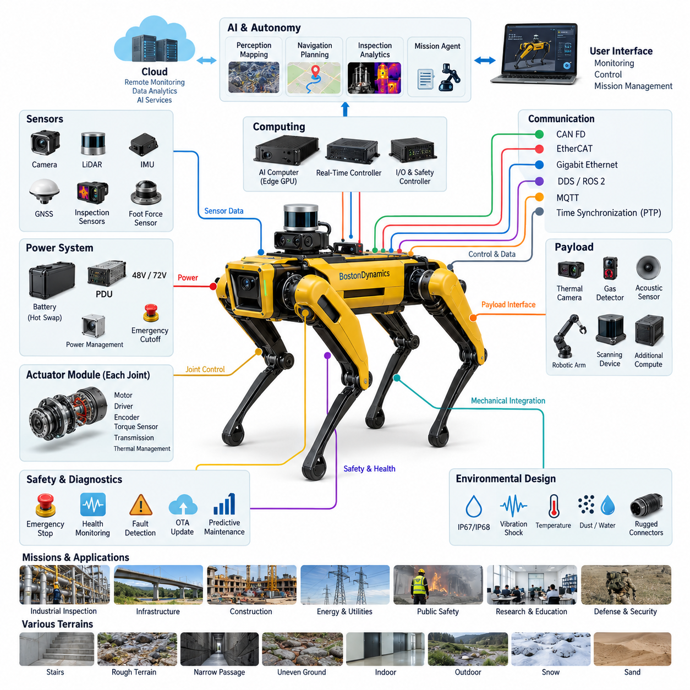
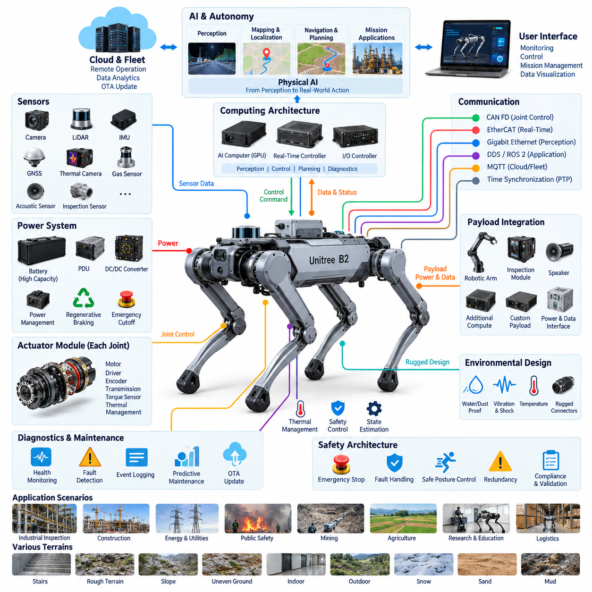
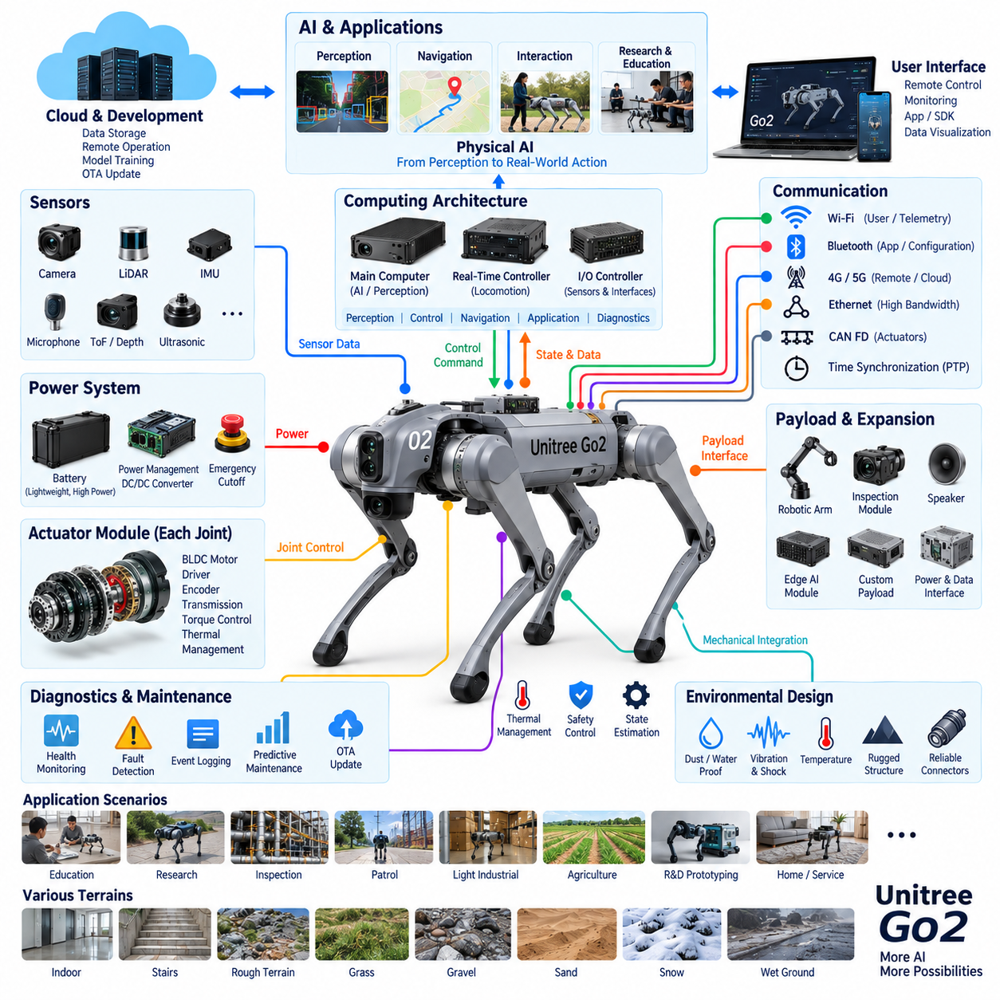
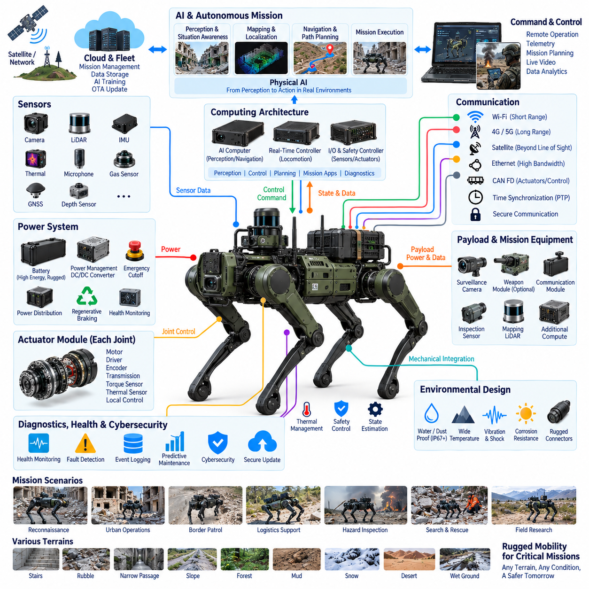
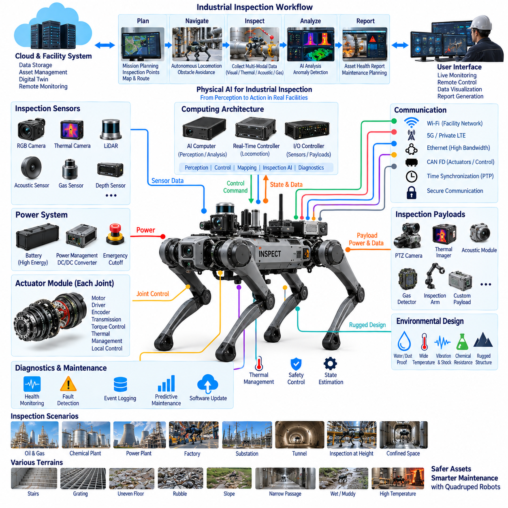
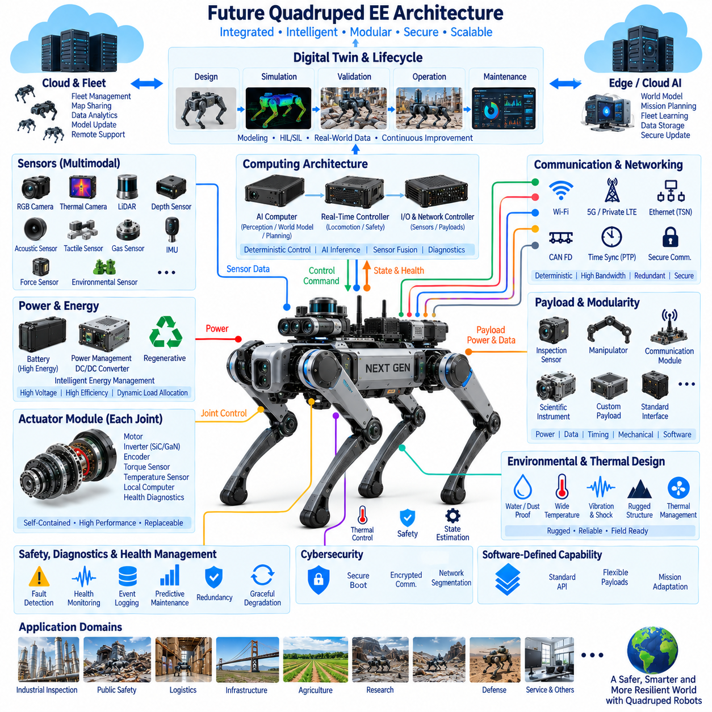

**Volume 20. Quadruped Electrical Architecture**


# Chapter 14. Case Studies

##  

## 14.01. Boston Dynamics Spot

{width="7.268055555555556in" height="7.268055555555556in"}

Boston Dynamics Spot represents one of the most mature examples of a commercially deployed quadruped robot in which electrical architecture, locomotion control, perception, computing, communication, and payload integration must operate as a tightly coordinated system. Within a quadruped architecture study, Spot is particularly valuable because it demonstrates how high mobility can be transformed from a laboratory capability into a field-deployable robotic platform.

Unlike conventional wheeled AMRs, a quadruped continuously coordinates multiple powered joints while maintaining dynamic balance. Electrical energy therefore supports not only forward motion but also posture stabilization, foot placement, body orientation, recovery from disturbances, and adaptation to irregular terrain. This creates rapidly changing actuator loads and requires power distribution, motor control, sensing, and real-time computation to remain synchronized during every locomotion cycle.

The electrical architecture can be understood as a hierarchy connecting the battery and power distribution system to distributed joint actuation, embedded control, perception sensors, higher-level computing, and external interfaces. Such partitioning prevents the entire machine from depending on a single centralized control loop. Fast joint-level functions remain close to the actuators, while body-level locomotion, perception, autonomy, mission execution, and payload processing operate at progressively higher computational layers.

Each leg requires several controlled degrees of freedom, making the joint actuator one of the fundamental electrical building blocks of the robot. A practical joint module combines an electric motor, power electronics, position sensing, control electronics, mechanical transmission, and thermal management into a compact assembly. The resulting architecture reduces long analog signal paths and enables high-bandwidth local control while the central locomotion system coordinates the behavior of all four legs.

Reliable sensing is equally important because quadruped locomotion depends on continuous estimation of body motion and environmental geometry. Joint encoders provide actuator state, while inertial sensing contributes body orientation and motion information. External perception sensors support terrain interpretation, obstacle awareness, navigation, and inspection. The electrical architecture must therefore transport heterogeneous sensor streams without allowing high-current actuator switching noise to degrade sensitive measurements.

Spot also illustrates why quadruped robots require separation between deterministic motion control and computationally intensive autonomy. Joint and stabilization loops demand predictable timing, whereas mapping, perception, inspection analytics, and autonomous planning can consume substantially greater processing resources with different latency characteristics. Separating these domains allows the robot to preserve stable locomotion even when higher-level perception or mission software experiences temporary computational variation.

Communication architecture connects these distributed functions into a coordinated cyber-physical system. Low-level actuator communication emphasizes bounded latency, synchronization, and fault detection, while higher-bandwidth networks support cameras, perception data, payloads, diagnostics, and application interfaces. This layered approach reflects the broader quadruped architecture structure in which CAN FD, EtherCAT, Gigabit Ethernet, DDS/ROS 2, and time synchronization represent different communication requirements rather than interchangeable technologies.

Payload integration is an especially important aspect of Spot as an industrial platform. A useful quadruped must carry more than its native locomotion sensors; inspection missions may require thermal cameras, acoustic sensors, gas detectors, specialized vision systems, scanning devices, or additional computation. Electrical payload interfaces therefore need controlled power, communication connectivity, mechanical compatibility, and software interfaces while respecting limits on mass, power consumption, thermal load, and center of gravity.

Inspection missions demonstrate the advantage of combining mobility with payload modularity. A quadruped can traverse stairs, thresholds, narrow passages, uneven surfaces, and industrial environments that may be difficult for conventional wheeled robots. Once positioned, the same platform can collect visual, thermal, acoustic, or other inspection data. Electrical architecture consequently becomes an enabling infrastructure that connects mobility, sensing, computation, communications, and mission-specific instrumentation.

Power management is particularly challenging because locomotion produces highly dynamic demand. Standing, walking, climbing, accelerating, recovering balance, and carrying payloads impose different electrical loads, while onboard computing and sensors create more continuous consumption. The battery and power distribution system must tolerate transient actuator demand without destabilizing computing or perception electronics. Protection, voltage regulation, current monitoring, thermal supervision, and controlled shutdown therefore become system-level design functions.

Field deployment also places strong requirements on harness and connector engineering. Leg motion repeatedly bends cables and exposes routing paths to vibration, impact, contamination, and environmental stress. Harnesses must avoid excessive bending radius, abrasion, tensile loading, and interference with moving mechanisms. Connector placement must simultaneously support sealing, mechanical retention, electrical integrity, manufacturability, and service access, illustrating why dynamic cable routing differs fundamentally from wiring a stationary industrial machine.

Environmental robustness cannot be treated as a separate enclosure problem. Water, dust, vibration, temperature variation, shock, and repeated mechanical loading influence connectors, sensors, electronics, batteries, and actuator assemblies simultaneously. A field-ready quadruped therefore requires environmental protection to be designed across subsystem boundaries. This explains the close relationship between IP protection, vibration testing, EMC validation, electrical testing, field testing, and reliability testing in a complete quadruped development process.

Functional safety in a quadruped also differs from that of a stationary robot because loss of control may result in falling, uncontrolled motion, or interaction with nearby people and equipment. Emergency stopping cannot simply remove energy without considering the mechanical consequences of losing joint torque. Safety architecture must coordinate fault detection, actuator behavior, computing state, communication integrity, and power isolation so that detected failures lead toward a controlled and predictable system response.

Diagnostics become critical because the robot contains many interacting electrical and electromechanical components. Useful health monitoring extends beyond reporting whether a device is online. Joint temperature, current behavior, battery condition, communication errors, sensor validity, controller status, and repeated fault events can collectively indicate developing degradation. Event logging and remote diagnostics allow field failures to be reconstructed and support the transition from reactive maintenance toward condition-based and predictive maintenance.

Software update capability must similarly respect the distributed nature of the machine. Updating perception or mission software is different from modifying components involved in locomotion, safety, or low-level actuator control. A robust update architecture therefore needs compatibility management, integrity verification, version control, rollback capability, and controlled activation. The important lesson is that OTA functionality is not merely a communication feature; it is part of configuration management and lifecycle safety.

Spot further demonstrates the transition from a robot as an isolated machine toward a robot as an extensible Physical AI platform. Perception models, autonomous navigation, inspection applications, mission agents, and remote services can operate above the locomotion foundation without replacing the deterministic control responsible for physical stability. This separation provides a practical architectural boundary between embodied intelligence and the electrical and control infrastructure that executes actions in the physical world.

From an engineering perspective, the most important lesson is not to reproduce a specific commercial robot component by component. The stronger lesson is architectural: high-performance quadrupeds require power, actuation, sensing, real-time control, high-level computing, communication, safety, diagnostics, environmental protection, and payload interfaces to be designed as one integrated system. Optimizing any single subsystem without considering these dependencies can reduce reliability or constrain overall capability.

As a case study within the broader robotics electrical architecture framework, Spot therefore provides a useful reference for understanding how quadruped design extends concepts already found in AMRs, autonomous vehicles, industrial robotics, and edge AI systems. The key difference is the intensity of physical coupling: electrical power, computation, communication, sensing, and mechanical motion interact continuously to maintain the robot itself before mission-level intelligence can perform useful work.

보스턴 다이내믹스 스팟(Boston Dynamics Spot)은 전기 아키텍처(Electrical Architecture), 보행 제어(Locomotion Control), 인지(Perception), 컴퓨팅(Computing), 통신(Communication), 페이로드 통합(Payload Integration)이 긴밀하게 조율되어 동작해야 하는 상용화된 사족보행 로봇(Quadruped Robot)의 대표적인 사례이다. 사족보행 아키텍처(Quadruped Architecture) 연구에서 스팟(Spot)은 연구실 수준의 높은 이동성을 실제 현장에 배치할 수 있는 로봇 플랫폼(Field-Deployable Robotic Platform)으로 전환하는 방법을 보여준다는 점에서 특히 중요한 의미를 가진다.

기존의 휠 기반 자율이동로봇(Wheeled AMR)과 달리 사족보행 로봇(Quadruped)은 동적 균형(Dynamic Balance)을 유지하면서 여러 개의 구동 관절(Powered Joint)을 지속적으로 조율한다. 따라서 전기에너지(Electrical Energy)는 단순한 전진 이동뿐만 아니라 자세 안정화(Posture Stabilization), 발 위치 결정(Foot Placement), 몸체 방향 제어(Body Orientation), 외란 복구(Disturbance Recovery), 불규칙 지형 적응(Terrain Adaptation)을 지원한다. 이로 인해 구동기 부하(Actuator Load)가 빠르게 변화하며, 전력 분배(Power Distribution), 모터 제어(Motor Control), 센싱(Sensing), 실시간 연산(Real-Time Computing)이 모든 보행 주기(Locomotion Cycle)에서 동기화되어야 한다.

전기 아키텍처(Electrical Architecture)는 배터리(Battery)와 전력 분배 시스템(Power Distribution System)을 분산형 관절 구동(Distributed Joint Actuation), 임베디드 제어(Embedded Control), 인지 센서(Perception Sensor), 상위 수준 컴퓨팅(Higher-Level Computing), 외부 인터페이스(External Interface)와 연결하는 계층 구조로 이해할 수 있다. 이러한 분할 구조는 전체 로봇이 하나의 중앙집중형 제어 루프(Centralized Control Loop)에 의존하는 것을 방지한다. 빠른 관절 수준 기능은 구동기 가까이에서 수행하고, 몸체 수준 보행(Body-Level Locomotion), 인지, 자율성(Autonomy), 임무 실행(Mission Execution), 페이로드 처리는 점차 상위의 컴퓨팅 계층에서 수행한다.

각 다리(Leg)는 여러 개의 제어 자유도(Controlled Degrees of Freedom)를 필요로 하므로 관절 구동기(Joint Actuator)는 로봇을 구성하는 핵심적인 전기적 빌딩 블록(Electrical Building Block) 중 하나이다. 실용적인 관절 모듈(Joint Module)은 전기 모터(Electric Motor), 전력 전자장치(Power Electronics), 위치 센싱(Position Sensing), 제어 전자장치(Control Electronics), 기계식 감속기(Mechanical Transmission), 열 관리(Thermal Management)를 하나의 소형 어셈블리(Compact Assembly)로 통합한다. 이러한 아키텍처는 긴 아날로그 신호 경로(Analog Signal Path)를 줄이고 고대역폭 로컬 제어(High-Bandwidth Local Control)를 가능하게 하며, 중앙 보행 시스템(Central Locomotion System)은 네 다리 전체의 움직임을 조율한다.

신뢰성 높은 센싱(Reliable Sensing) 역시 중요하다. 사족보행(Quadruped Locomotion)은 몸체 움직임과 주변 환경 형상(Environmental Geometry)을 지속적으로 추정해야 하기 때문이다. 관절 엔코더(Joint Encoder)는 구동기 상태를 제공하고, 관성 센싱(Inertial Sensing)은 몸체 자세와 움직임 정보를 제공한다. 외부 인지 센서(External Perception Sensor)는 지형 해석(Terrain Interpretation), 장애물 인식(Obstacle Awareness), 내비게이션(Navigation), 점검(Inspection)을 지원한다. 따라서 전기 아키텍처는 고전류 구동기 스위칭 노이즈(High-Current Actuator Switching Noise)가 민감한 측정 신호를 저하시키지 않으면서 다양한 종류의 센서 데이터 스트림(Sensor Data Stream)을 전송할 수 있어야 한다.

스팟(Spot)은 사족보행 로봇에서 결정론적 동작 제어(Deterministic Motion Control)와 연산 집약적 자율 기능(Computationally Intensive Autonomy)을 분리해야 하는 이유도 보여준다. 관절 및 안정화 루프(Joint and Stabilization Loop)는 예측 가능한 타이밍(Predictable Timing)을 요구하지만, 매핑(Mapping), 인지(Perception), 점검 분석(Inspection Analytics), 자율 계획(Autonomous Planning)은 훨씬 많은 연산 자원을 사용하면서 서로 다른 지연 특성(Latency Characteristics)을 가질 수 있다. 이러한 영역을 분리하면 상위 수준 인지 또는 임무 소프트웨어에서 일시적인 연산 변동이 발생하더라도 안정적인 보행을 유지할 수 있다.

통신 아키텍처(Communication Architecture)는 이러한 분산 기능을 하나의 조율된 사이버 물리 시스템(Cyber-Physical System)으로 연결한다. 저수준 구동기 통신(Low-Level Actuator Communication)은 제한된 지연(Bounded Latency), 동기화(Synchronization), 고장 감지(Fault Detection)를 중요하게 다루는 반면, 고대역폭 네트워크(High-Bandwidth Network)는 카메라, 인지 데이터, 페이로드, 진단(Diagnostics), 애플리케이션 인터페이스(Application Interface)를 지원한다. 이러한 계층적 접근 방식은 CAN FD, 이더캣(EtherCAT), 기가비트 이더넷(Gigabit Ethernet), DDS/ROS 2, 시간 동기화(Time Synchronization)가 서로 대체 가능한 기술이 아니라 서로 다른 통신 요구사항을 담당한다는 보다 광범위한 사족보행 아키텍처의 구조를 반영한다.

페이로드 통합(Payload Integration)은 스팟을 산업용 플랫폼(Industrial Platform)으로 바라볼 때 특히 중요한 요소이다. 실용적인 사족보행 로봇은 기본적인 보행 센서만 탑재하는 것이 아니라, 점검 임무를 위해 열화상 카메라(Thermal Camera), 음향 센서(Acoustic Sensor), 가스 감지기(Gas Detector), 특수 비전 시스템(Specialized Vision System), 스캐닝 장치(Scanning Device), 추가 컴퓨팅 장치 등을 탑재할 수 있어야 한다. 따라서 전기적 페이로드 인터페이스(Electrical Payload Interface)는 질량, 소비전력, 열 부하(Thermal Load), 무게중심(Center of Gravity)의 제한을 준수하면서 제어된 전원, 통신 연결성, 기계적 호환성(Mechanical Compatibility), 소프트웨어 인터페이스를 제공해야 한다.

점검 임무(Inspection Mission)는 이동성과 페이로드 모듈성(Payload Modularity)을 결합하는 장점을 잘 보여준다. 사족보행 로봇은 계단, 문턱, 좁은 통로, 불규칙한 표면, 산업 현장 등 기존의 휠 기반 로봇이 이동하기 어려운 환경을 통과할 수 있다. 목표 위치에 도달한 이후에는 동일한 플랫폼을 이용하여 영상, 열, 음향 또는 기타 점검 데이터를 수집할 수 있다. 결과적으로 전기 아키텍처는 이동성(Mobility), 센싱, 컴퓨팅, 통신, 임무 특화 계측장치(Mission-Specific Instrumentation)를 연결하는 핵심 기반 인프라(Enabling Infrastructure)가 된다.

전력 관리(Power Management)는 보행 과정에서 매우 동적인 전력 수요가 발생하기 때문에 특히 어렵다. 서 있기, 걷기, 등반, 가속, 균형 회복, 페이로드 운반은 각각 서로 다른 전기적 부하를 발생시키며, 온보드 컴퓨팅(Onboard Computing)과 센서는 상대적으로 지속적인 전력 소비를 발생시킨다. 배터리와 전력 분배 시스템은 구동기의 순간적인 전력 요구(Transient Actuator Demand)를 견디면서도 컴퓨팅 또는 인지 전자장치를 불안정하게 만들지 않아야 한다. 따라서 보호(Protection), 전압 조정(Voltage Regulation), 전류 모니터링(Current Monitoring), 열 감시(Thermal Supervision), 제어된 종료(Controlled Shutdown)는 시스템 수준의 설계 기능이 된다.

현장 운용(Field Deployment)은 하네스 및 커넥터 엔지니어링(Harness and Connector Engineering)에도 높은 요구조건을 부여한다. 다리 움직임은 케이블을 반복적으로 굽히며 배선 경로를 진동, 충격, 오염, 환경적 스트레스(Environmental Stress)에 노출시킨다. 하네스(Harness)는 과도한 굽힘 반경, 마모, 인장 하중, 움직이는 기구와의 간섭을 방지해야 한다. 커넥터 배치는 밀봉(Sealing), 기계적 고정(Mechanical Retention), 전기적 무결성(Electrical Integrity), 제조성(Manufacturability), 정비 접근성(Service Access)을 동시에 지원해야 하며, 이는 동적 케이블 라우팅(Dynamic Cable Routing)이 고정형 산업 장비의 배선과 근본적으로 다른 이유를 보여준다.

환경 강건성(Environmental Robustness)은 단순한 외함(Enclosure)의 문제로 분리하여 다룰 수 없다. 물, 먼지, 진동, 온도 변화, 충격, 반복적인 기계적 하중은 커넥터, 센서, 전자장치, 배터리, 구동기 어셈블리에 동시에 영향을 미친다. 따라서 현장 운용형 사족보행 로봇(Field-Ready Quadruped)은 서브시스템 경계를 넘어 환경 보호(Environmental Protection)를 설계해야 한다. 이것은 완전한 사족보행 로봇 개발 과정에서 IP 보호(IP Protection), 진동 시험(Vibration Testing), 전자기 적합성 검증(EMC Validation), 전기 시험(Electrical Testing), 현장 시험(Field Testing), 신뢰성 시험(Reliability Testing)이 서로 긴밀하게 연결되는 이유를 보여준다.

사족보행 로봇의 기능 안전(Functional Safety)은 제어 상실이 로봇의 전도(Falling), 제어되지 않은 움직임(Uncontrolled Motion), 주변 사람이나 장비와의 충돌로 이어질 수 있기 때문에 고정형 로봇과도 차이가 있다. 비상 정지(Emergency Stop)는 단순히 전원을 차단하는 방식만으로 구현할 수 없으며, 관절 토크(Joint Torque)가 사라질 때 발생할 수 있는 기계적 결과까지 고려해야 한다. 따라서 안전 아키텍처(Safety Architecture)는 고장 감지, 구동기 동작, 컴퓨팅 상태, 통신 무결성(Communication Integrity), 전원 차단(Power Isolation)을 조율하여 감지된 고장이 제어 가능하고 예측 가능한 시스템 응답으로 이어지도록 해야 한다.

로봇은 다수의 상호작용하는 전기 및 전기기계 부품(Electromechanical Component)을 포함하므로 진단(Diagnostics) 기능도 매우 중요하다. 효과적인 상태 모니터링(Health Monitoring)은 단순히 장치가 온라인 상태인지 확인하는 수준을 넘어선다. 관절 온도, 전류 특성, 배터리 상태, 통신 오류, 센서 유효성, 제어기 상태, 반복되는 고장 이벤트를 종합하면 진행 중인 열화(Degradation)를 식별할 수 있다. 이벤트 로깅(Event Logging)과 원격 진단(Remote Diagnostics)은 현장 고장을 재구성하고 사후 대응형 유지보수(Reactive Maintenance)에서 상태 기반 및 예지 정비(Predictive Maintenance)로 전환할 수 있도록 지원한다.

소프트웨어 업데이트 기능(Software Update Capability) 역시 로봇의 분산 구조(Distributed Architecture)를 고려해야 한다. 인지 또는 임무 소프트웨어를 업데이트하는 것은 보행, 안전, 저수준 구동기 제어에 관여하는 구성요소를 변경하는 것과는 다르다. 따라서 강건한 업데이트 아키텍처(Update Architecture)는 호환성 관리(Compatibility Management), 무결성 검증(Integrity Verification), 버전 관리(Version Control), 롤백(Rollback), 제어된 활성화(Controlled Activation)를 필요로 한다. 중요한 점은 무선 업데이트(OTA)가 단순한 통신 기능이 아니라 형상 관리(Configuration Management)와 수명주기 안전(Lifecycle Safety)의 일부라는 것이다.

스팟은 또한 독립된 하나의 로봇에서 확장 가능한 피지컬 AI 플랫폼(Physical AI Platform)으로 전환되는 흐름을 보여준다. 인지 모델(Perception Model), 자율 내비게이션(Autonomous Navigation), 점검 애플리케이션(Inspection Application), 임무 에이전트(Mission Agent), 원격 서비스(Remote Service)는 물리적 안정성을 담당하는 결정론적 제어(Deterministic Control)를 대체하지 않고 보행 기반(Locomotion Foundation) 위에서 동작할 수 있다. 이러한 분리는 체화 지능(Embodied Intelligence)과 실제 물리 세계에서 행동을 실행하는 전기 및 제어 인프라 사이에 실용적인 아키텍처 경계(Architectural Boundary)를 제공한다.

엔지니어링 관점에서 가장 중요한 교훈은 특정 상용 로봇의 구성요소를 하나씩 그대로 복제하는 것이 아니다. 더욱 중요한 교훈은 아키텍처에 있다. 고성능 사족보행 로봇(High-Performance Quadruped)은 전력, 구동, 센싱, 실시간 제어, 상위 수준 컴퓨팅, 통신, 안전, 진단, 환경 보호, 페이로드 인터페이스를 하나의 통합 시스템(Integrated System)으로 설계해야 한다. 이러한 상호 의존성을 고려하지 않고 특정 서브시스템만 최적화하면 전체 시스템의 신뢰성을 저하시키거나 전체 성능과 기능을 제한할 수 있다.

따라서 스팟은 보다 광범위한 로봇 전기 아키텍처(Robotics Electrical Architecture) 체계에서 자율이동로봇(AMR), 자율주행 차량(Autonomous Vehicle), 산업용 로봇(Industrial Robot), 엣지 AI 시스템(Edge AI System)에서 이미 사용되는 개념들이 사족보행 로봇 설계로 어떻게 확장되는지를 이해하기 위한 유용한 사례를 제공한다. 가장 중요한 차이는 물리적 결합도(Physical Coupling)의 강도에 있다. 전력, 컴퓨팅, 통신, 센싱, 기계적 움직임은 임무 수준 지능(Mission-Level Intelligence)이 유용한 작업을 수행하기 이전부터 로봇 자체의 안정성을 유지하기 위해 지속적으로 상호작용해야 한다.

##  

## 14.02. Unitree B2

{width="7.268055555555556in" height="7.268055555555556in"}

Unitree B2 represents a heavy-duty industrial quadruped platform designed around higher mobility, payload capacity, endurance, and environmental adaptability than smaller research-oriented quadrupeds. Within quadruped electrical architecture, it provides a useful case study of how actuator power, distributed control, rugged sensing, onboard computing, communication, and energy storage must scale together when a legged robot is expected to perform practical industrial missions rather than controlled laboratory demonstrations.

The B2 architecture highlights a fundamental characteristic of high-performance quadrupeds: locomotion is an electrically intensive, continuously coordinated process. Multiple powered joints must generate and regulate torque while supporting the robot body, payload, acceleration, terrain transitions, and external disturbances. Consequently, electrical design cannot treat motors as independent loads. Battery capability, distribution impedance, motor drives, thermal limits, and control timing collectively determine achievable locomotion performance.

At the joint level, compact electromechanical actuator modules form the foundation of the locomotion system. Each module combines a motor, transmission, position feedback, motor drive electronics, and local control functions to provide accurately regulated motion and torque. High joint performance requires rapid current regulation and precise state feedback because small errors across several joints can propagate into body attitude errors, foot placement deviations, or reduced stability during dynamic movement.

Distributed control is therefore more appropriate than routing every actuator signal directly to one central processor. Local controllers can execute high-frequency motor and joint functions, while a real-time body controller coordinates the legs and maintains locomotion stability. Higher computing layers can then perform perception, navigation, mapping, mission planning, and application processing. This hierarchy separates hard real-time physical control from computationally variable autonomy and reduces unnecessary dependence between the two domains.

Power architecture becomes especially significant as robot mass, payload, joint torque, and operating speed increase. Dynamic maneuvers can create short-duration current peaks substantially different from average consumption. The battery and power distribution system must therefore support transient actuator demand while maintaining stable supply rails for computing, sensing, and communication electronics. Protection coordination, current monitoring, voltage conversion, thermal supervision, and controlled power sequencing are essential system functions.

Regenerative energy is another consideration in electrically actuated legs. During deceleration, downhill motion, joint braking, or certain phases of the gait cycle, mechanical energy can flow back through the actuator drive toward the electrical system. The architecture must manage these bidirectional power conditions without producing excessive bus voltage or stressing the battery. Effective energy management can improve efficiency, but it must remain subordinate to predictable actuator behavior and electrical protection.

The B2 also demonstrates why thermal engineering and electrical architecture cannot be separated in powerful quadrupeds. Motors, inverters, processors, voltage converters, and batteries all generate heat, while enclosure sealing can restrict natural cooling. Continuous walking, climbing, high payload operation, and elevated ambient temperature can create thermal conditions very different from short demonstrations. Temperature sensing and derating strategies are therefore necessary to preserve component life and prevent abrupt performance loss.

Sensor architecture provides the state information required to control both the robot and its relationship with the environment. Joint feedback and inertial sensing support body-state estimation, while external perception can provide obstacle detection, terrain understanding, localization, and mapping. Industrial configurations may additionally integrate cameras, LiDAR, thermal imaging, gas detection, acoustic sensing, or other inspection instruments, turning the locomotion platform into a mobile sensing system.

Reliable sensor operation requires careful electrical integration because actuator electronics are substantial sources of electromagnetic noise. Fast switching currents, long harness paths, grounding errors, and poorly separated power domains can interfere with low-level sensor signals or high-speed communication. Grounding, shielding, filtering, connector design, cable routing, and power-domain separation therefore contribute directly to perception reliability rather than serving merely as conventional electrical packaging considerations.

Communication must support several fundamentally different traffic classes. Joint and locomotion networks require deterministic or tightly bounded timing, while cameras and LiDAR generate high-bandwidth streams. Diagnostics require reliable access to distributed controllers, and mission applications may exchange information with remote computers or fleet infrastructure. A scalable quadruped therefore benefits from a layered network architecture rather than attempting to carry every control and application function over one communication channel.

Time synchronization becomes increasingly important when perception and motion interact closely. Camera frames, inertial measurements, joint states, LiDAR observations, and control events may originate from different electronic devices but must describe the same physical instant accurately enough for estimation and fusion. A shared timing architecture reduces temporal alignment errors and improves the consistency of localization, mapping, motion analysis, event reconstruction, and multi-sensor inspection data.

Industrial deployment places strong demands on harnesses and connectors because every leg repeatedly changes geometry during locomotion. Electrical paths must survive bending, vibration, shock, contamination, and thousands or millions of motion cycles without becoming a dominant reliability limitation. Dynamic harness sections require controlled bend radii, strain relief, abrasion protection, secure retention, and sufficient service access, while connectors must maintain electrical integrity under repeated mechanical and environmental stress.

Environmental protection is particularly important for a quadruped intended to operate beyond clean indoor spaces. Dust, water, mud, temperature variation, vibration, impact, and uneven terrain affect mechanical and electrical components simultaneously. Sealing alone is insufficient; connectors, pressure equalization, thermal paths, cable entries, sensor windows, actuator interfaces, and enclosure joints must be engineered as a coordinated environmental protection system while preserving maintainability and cooling performance.

Payload capability introduces another system-level electrical challenge. Increasing payload changes joint torque demand, battery consumption, thermal loading, body dynamics, and center of gravity while additional equipment may consume electrical power and network bandwidth. A practical payload interface should therefore provide more than a mounting surface. It should define power availability, communication access, mechanical constraints, software interfaces, and operating limits that protect both locomotion stability and platform reliability.

Safety architecture must account for the fact that a quadruped cannot always respond to faults by instantly removing actuator power. Sudden loss of joint torque can itself create a hazardous fall or uncontrolled body movement. Fault responses should therefore distinguish between conditions requiring immediate energy isolation and conditions where controlled posture transition, reduced performance, or managed stopping provides a safer outcome. Safety decisions must coordinate actuator, power, computing, and communication states.

Diagnostics are essential for managing the large number of distributed electromechanical components. Joint current, motor temperature, encoder validity, communication errors, battery condition, processor status, sensor health, and power-rail behavior can provide early evidence of degradation. Centralized health monitoring can correlate these observations and generate fault histories that support troubleshooting, preventive maintenance, fleet comparison, and eventually predictive maintenance for robots operating repeatedly in demanding environments.

Remote operation and software lifecycle management further extend the electrical architecture into a connected robotic system. Mission software, perception algorithms, configuration parameters, and selected firmware may require controlled updates over the product lifetime. Update mechanisms should incorporate integrity checking, version compatibility, recovery procedures, and rollback capability so that a failed or incompatible update does not disable essential locomotion, safety, or diagnostic functions.

From a Physical AI perspective, B2 illustrates the importance of maintaining a stable execution foundation beneath increasingly intelligent applications. AI perception, semantic understanding, autonomous navigation, inspection reasoning, and mission agents can expand robot capability, but they ultimately depend on deterministic joint execution, synchronized sensing, reliable power, and predictable communication. Intelligence cannot compensate for an unstable electrical foundation when the system must continuously interact with the physical world.

The B2 case also demonstrates how quadruped architecture changes as the platform moves toward heavier industrial operation. Higher payload and stronger locomotion do not simply require larger motors and batteries; they increase stress throughout the architecture, including connectors, harnesses, power electronics, cooling, structural interfaces, communication, diagnostics, and safety mechanisms. Scaling therefore requires coordinated subsystem engineering rather than independent enlargement of individual components.

As a case study, Unitree B2 complements other quadruped platforms by emphasizing the relationship between high mobility and industrial-scale electrical integration. Its most important architectural lesson is that power, actuation, sensing, computing, communication, thermal management, environmental protection, diagnostics, safety, and payload interfaces must be treated as a coupled system. This integrated approach is fundamental to transforming a dynamically capable quadruped into a durable Physical AI platform suitable for sustained field operation.

유니트리 B2(Unitree B2)는 소형 연구용 사족보행 로봇(Quadruped Robot)보다 높은 이동성(Mobility), 페이로드 용량(Payload Capacity), 운용 지속시간(Endurance), 환경 적응성(Environmental Adaptability)을 목표로 설계된 고중량 산업용 사족보행 플랫폼(Heavy-Duty Industrial Quadruped Platform)의 사례이다. 사족보행 전기 아키텍처(Quadruped Electrical Architecture) 관점에서 B2는 실험실 시연이 아닌 실제 산업 임무 수행을 위해 구동기 전력(Actuator Power), 분산 제어(Distributed Control), 강건한 센싱(Rugged Sensing), 온보드 컴퓨팅(Onboard Computing), 통신(Communication), 에너지 저장(Energy Storage)이 함께 확장되어야 하는 방식을 보여주는 유용한 사례이다.

B2 아키텍처는 고성능 사족보행 로봇(High-Performance Quadruped)의 근본적인 특징을 보여준다. 보행(Locomotion)은 전기적으로 높은 부하를 요구하면서 지속적인 협조 제어가 필요한 과정이다. 여러 개의 구동 관절(Powered Joint)은 로봇 몸체와 페이로드를 지지하고 가속, 지형 변화, 외부 외란에 대응하면서 토크(Torque)를 생성하고 제어해야 한다. 따라서 전기 설계에서는 모터를 독립적인 부하로 취급할 수 없으며, 배터리 성능, 전력 분배 임피던스(Distribution Impedance), 모터 드라이브(Motor Drive), 열 한계(Thermal Limit), 제어 타이밍(Control Timing)이 함께 실제 보행 성능을 결정한다.

관절 수준(Joint Level)에서는 소형 전기기계식 구동기 모듈(Electromechanical Actuator Module)이 보행 시스템의 기반을 구성한다. 각 모듈은 모터(Motor), 감속기(Transmission), 위치 피드백(Position Feedback), 모터 드라이브 전자장치(Motor Drive Electronics), 로컬 제어 기능(Local Control Function)을 결합하여 정밀하게 제어된 움직임과 토크를 제공한다. 높은 관절 성능을 구현하려면 빠른 전류 제어(Current Regulation)와 정확한 상태 피드백(State Feedback)이 필요하며, 여러 관절에서 발생하는 작은 오차도 몸체 자세 오차, 발 위치 편차 또는 동적 움직임 중 안정성 저하로 확대될 수 있다.

따라서 모든 구동기 신호를 하나의 중앙 프로세서(Central Processor)로 직접 전달하는 방식보다 분산 제어(Distributed Control)가 적합하다. 로컬 제어기(Local Controller)는 고주파 모터 및 관절 기능을 실행하고, 실시간 몸체 제어기(Real-Time Body Controller)는 다리를 조율하여 보행 안정성을 유지할 수 있다. 그 위의 상위 컴퓨팅 계층(Higher Computing Layer)은 인지(Perception), 내비게이션(Navigation), 매핑(Mapping), 임무 계획(Mission Planning), 애플리케이션 처리(Application Processing)를 수행한다. 이러한 계층 구조는 엄격한 실시간 물리 제어(Hard Real-Time Physical Control)를 연산 부하가 변동하는 자율 기능(Autonomy)과 분리하여 두 영역 사이의 불필요한 의존성을 감소시킨다.

로봇의 질량, 페이로드, 관절 토크, 운용 속도가 증가할수록 전력 아키텍처(Power Architecture)의 중요성도 커진다. 동적 기동(Dynamic Maneuver)은 평균 소비전류와 크게 다른 단시간의 전류 피크(Current Peak)를 발생시킬 수 있다. 따라서 배터리와 전력 분배 시스템(Power Distribution System)은 순간적인 구동기 전력 요구(Transient Actuator Demand)를 지원하면서 컴퓨팅, 센싱, 통신 전자장치에 안정적인 전원을 공급해야 한다. 보호 협조(Protection Coordination), 전류 모니터링(Current Monitoring), 전압 변환(Voltage Conversion), 열 감시(Thermal Supervision), 제어된 전원 시퀀싱(Controlled Power Sequencing)은 필수적인 시스템 기능이다.

회생 에너지(Regenerative Energy) 역시 전기로 구동되는 다리에서 고려해야 하는 요소이다. 감속, 내리막 이동, 관절 제동 또는 특정 보행 주기(Gait Cycle)에서는 기계적 에너지가 구동기 드라이브를 통해 전기 시스템으로 되돌아갈 수 있다. 아키텍처는 과도한 버스 전압(Bus Voltage)을 발생시키거나 배터리에 스트레스를 주지 않으면서 이러한 양방향 전력 상태(Bidirectional Power Condition)를 관리해야 한다. 효과적인 에너지 관리(Energy Management)는 효율을 향상시킬 수 있지만, 항상 예측 가능한 구동기 동작과 전기적 보호(Electrical Protection)를 우선해야 한다.

B2는 또한 강력한 사족보행 로봇에서 열 엔지니어링(Thermal Engineering)과 전기 아키텍처를 분리할 수 없는 이유를 보여준다. 모터, 인버터(Inverter), 프로세서(Processor), 전압 변환기(Voltage Converter), 배터리는 모두 열을 발생시키며, 밀폐된 외함(Enclosure)은 자연 냉각을 제한할 수 있다. 지속적인 보행, 등반, 고중량 페이로드 운용, 높은 주변 온도는 짧은 시연과 매우 다른 열적 조건을 형성한다. 따라서 부품 수명을 보호하고 갑작스러운 성능 저하를 방지하기 위해 온도 센싱(Temperature Sensing)과 디레이팅 전략(Derating Strategy)이 필요하다.

센서 아키텍처(Sensor Architecture)는 로봇 자체의 상태와 주변 환경과의 관계를 제어하는 데 필요한 상태 정보를 제공한다. 관절 피드백(Joint Feedback)과 관성 센싱(Inertial Sensing)은 몸체 상태 추정(Body-State Estimation)을 지원하고, 외부 인지 시스템(External Perception)은 장애물 감지, 지형 이해(Terrain Understanding), 위치 추정(Localization), 매핑을 제공할 수 있다. 산업용 구성에서는 카메라, 라이다(LiDAR), 열화상(Thermal Imaging), 가스 감지(Gas Detection), 음향 센싱(Acoustic Sensing) 또는 기타 점검 장비를 추가로 통합하여 보행 플랫폼을 이동형 센싱 시스템(Mobile Sensing System)으로 확장할 수 있다.

구동기 전자장치(Actuator Electronics)는 상당한 전자기 노이즈(Electromagnetic Noise)를 발생시키므로 신뢰성 높은 센서 동작을 위해서는 세심한 전기적 통합이 필요하다. 빠른 스위칭 전류, 긴 하네스 경로, 잘못된 접지(Grounding), 충분히 분리되지 않은 전력 도메인(Power Domain)은 저레벨 센서 신호 또는 고속 통신에 간섭할 수 있다. 따라서 접지, 차폐(Shielding), 필터링(Filtering), 커넥터 설계(Connector Design), 케이블 라우팅(Cable Routing), 전력 도메인 분리(Power-Domain Separation)는 단순한 전기 패키징 요소가 아니라 인지 신뢰성(Perception Reliability)에 직접적으로 기여한다.

통신(Communication)은 근본적으로 서로 다른 여러 종류의 트래픽(Traffic Class)을 지원해야 한다. 관절 및 보행 네트워크(Joint and Locomotion Network)는 결정론적 또는 엄격하게 제한된 타이밍을 요구하는 반면, 카메라와 라이다는 고대역폭 데이터 스트림(High-Bandwidth Data Stream)을 생성한다. 진단(Diagnostics)은 분산 제어기에 안정적으로 접근해야 하며, 임무 애플리케이션은 원격 컴퓨터 또는 플릿 인프라(Fleet Infrastructure)와 정보를 교환할 수 있다. 따라서 확장 가능한 사족보행 로봇은 모든 제어 및 애플리케이션 기능을 하나의 통신 채널에 집중시키는 것보다 계층형 네트워크 아키텍처(Layered Network Architecture)를 적용하는 것이 유리하다.

인지와 움직임이 밀접하게 상호작용할수록 시간 동기화(Time Synchronization)의 중요성도 증가한다. 카메라 프레임(Camera Frame), 관성 측정값(Inertial Measurement), 관절 상태(Joint State), 라이다 관측값(LiDAR Observation), 제어 이벤트(Control Event)는 서로 다른 전자장치에서 생성될 수 있지만 동일한 물리적 시점을 충분히 정확하게 표현해야 상태 추정과 센서 융합(Sensor Fusion)이 가능하다. 공통 시간 아키텍처(Shared Timing Architecture)는 시간 정렬 오차(Temporal Alignment Error)를 감소시키고 위치 추정, 매핑, 움직임 분석, 이벤트 재구성(Event Reconstruction), 다중 센서 점검 데이터(Multi-Sensor Inspection Data)의 일관성을 향상시킨다.

산업 현장 운용(Industrial Deployment)은 보행 과정에서 각 다리의 형상이 반복적으로 변화하기 때문에 하네스와 커넥터에 높은 요구조건을 부여한다. 전기 경로(Electrical Path)는 굽힘, 진동, 충격, 오염 및 수천에서 수백만 회에 이르는 반복 운동 주기(Motion Cycle)를 견뎌야 하며 시스템 신뢰성의 주요 제한 요소가 되어서는 안 된다. 동적 하네스 구간(Dynamic Harness Section)은 제어된 굽힘 반경, 스트레인 릴리프(Strain Relief), 마모 보호(Abrasion Protection), 확실한 고정, 충분한 정비 접근성을 확보해야 하며, 커넥터는 반복적인 기계 및 환경 스트레스에서도 전기적 무결성을 유지해야 한다.

깨끗한 실내 공간을 넘어 운용하도록 설계된 사족보행 로봇에서는 환경 보호(Environmental Protection)가 특히 중요하다. 먼지, 물, 진흙, 온도 변화, 진동, 충격, 불규칙 지형은 기계 및 전기 구성요소에 동시에 영향을 미친다. 단순한 밀봉(Sealing)만으로는 충분하지 않으며, 커넥터, 압력 평형(Pressure Equalization), 열 전달 경로(Thermal Path), 케이블 인입부(Cable Entry), 센서 윈도(Sensor Window), 구동기 인터페이스, 외함 접합부(Enclosure Joint)를 하나의 통합된 환경 보호 시스템으로 설계하면서 정비성과 냉각 성능을 유지해야 한다.

페이로드 능력(Payload Capability)은 또 다른 시스템 수준의 전기적 과제를 발생시킨다. 페이로드가 증가하면 관절 토크 요구량, 배터리 소비, 열 부하, 몸체 동역학(Body Dynamics), 무게중심(Center of Gravity)이 변화하며, 추가 장비는 전력과 네트워크 대역폭을 소비할 수 있다. 따라서 실용적인 페이로드 인터페이스(Payload Interface)는 단순한 기계적 장착면 이상을 제공해야 한다. 전력 공급 능력, 통신 접근성, 기계적 제약조건, 소프트웨어 인터페이스, 운용 한계를 정의하여 보행 안정성과 플랫폼 신뢰성을 동시에 보호해야 한다.

안전 아키텍처(Safety Architecture)는 사족보행 로봇이 모든 고장 상황에서 구동기 전력을 즉시 제거하는 방식으로 대응할 수 없다는 점을 고려해야 한다. 관절 토크가 갑자기 사라지는 것 자체가 위험한 전도 또는 제어되지 않은 몸체 움직임을 발생시킬 수 있기 때문이다. 따라서 고장 대응(Fault Response)은 즉각적인 에너지 차단(Energy Isolation)이 필요한 상황과 제어된 자세 전환(Controlled Posture Transition), 성능 제한(Reduced Performance), 관리된 정지(Managed Stopping)가 더 안전한 상황을 구분해야 한다. 안전 결정은 구동기, 전력, 컴퓨팅, 통신 상태를 종합적으로 조율해야 한다.

진단(Diagnostics)은 다수의 분산형 전기기계 부품을 관리하는 데 필수적이다. 관절 전류, 모터 온도, 엔코더 유효성(Encoder Validity), 통신 오류, 배터리 상태, 프로세서 상태, 센서 건전성(Sensor Health), 전원 레일 동작(Power-Rail Behavior)은 열화가 진행되고 있다는 초기 증거를 제공할 수 있다. 중앙 집중형 상태 모니터링(Centralized Health Monitoring)은 이러한 정보를 상호 연계하여 고장 이력(Fault History)을 생성하고 문제 해결, 예방 정비(Preventive Maintenance), 플릿 비교(Fleet Comparison), 나아가 반복적으로 가혹한 환경에서 운용되는 로봇의 예지 정비(Predictive Maintenance)를 지원할 수 있다.

원격 운용(Remote Operation)과 소프트웨어 수명주기 관리(Software Lifecycle Management)는 전기 아키텍처를 연결형 로봇 시스템(Connected Robotic System)으로 더욱 확장한다. 임무 소프트웨어, 인지 알고리즘, 구성 파라미터(Configuration Parameter), 일부 펌웨어(Firmware)는 제품 수명주기 동안 제어된 업데이트가 필요할 수 있다. 업데이트 메커니즘(Update Mechanism)은 무결성 검사(Integrity Checking), 버전 호환성(Version Compatibility), 복구 절차(Recovery Procedure), 롤백(Rollback) 기능을 포함하여 업데이트 실패 또는 비호환성이 필수적인 보행, 안전 또는 진단 기능을 비활성화하지 않도록 해야 한다.

피지컬 AI(Physical AI) 관점에서 B2는 점차 지능화되는 애플리케이션 아래에 안정적인 실행 기반(Execution Foundation)을 유지하는 것이 중요하다는 점을 보여준다. AI 인지(AI Perception), 의미론적 이해(Semantic Understanding), 자율 내비게이션(Autonomous Navigation), 점검 추론(Inspection Reasoning), 임무 에이전트(Mission Agent)는 로봇의 기능을 확장할 수 있지만, 궁극적으로 결정론적 관절 실행(Deterministic Joint Execution), 동기화된 센싱(Synchronized Sensing), 신뢰성 높은 전력, 예측 가능한 통신에 의존한다. 시스템이 물리 세계와 지속적으로 상호작용해야 하는 상황에서는 지능만으로 불안정한 전기적 기반을 보완할 수 없다.

B2 사례는 사족보행 아키텍처가 고중량 산업 운용(Heavy Industrial Operation)으로 확장될 때 어떻게 변화하는지도 보여준다. 더 높은 페이로드와 강력한 보행 성능은 단순히 더 큰 모터와 배터리를 요구하는 것이 아니다. 커넥터, 하네스, 전력 전자장치, 냉각, 구조 인터페이스(Structural Interface), 통신, 진단, 안전 메커니즘 전반에 걸쳐 스트레스가 증가한다. 따라서 시스템 확장(Scaling)은 개별 구성요소의 독립적인 대형화가 아니라 서브시스템 간의 협조된 엔지니어링(Coordinated Subsystem Engineering)을 필요로 한다.

사례 연구(Case Study)로서 유니트리 B2(Unitree B2)는 높은 이동성과 산업 규모의 전기적 통합(Industrial-Scale Electrical Integration) 사이의 관계를 강조함으로써 다른 사족보행 플랫폼을 보완한다. 가장 중요한 아키텍처적 교훈은 전력, 구동, 센싱, 컴퓨팅, 통신, 열 관리, 환경 보호, 진단, 안전, 페이로드 인터페이스를 상호 결합된 하나의 시스템(Coupled System)으로 다루어야 한다는 것이다. 이러한 통합적 접근 방식(Integrated Approach)은 동적으로 뛰어난 사족보행 로봇을 지속적인 현장 운용에 적합한 내구성 높은 피지컬 AI 플랫폼(Physical AI Platform)으로 발전시키기 위한 핵심 기반이다.

##  

## 14.03. Go2

{width="7.268055555555556in" height="7.268055555555556in"}

Unitree Go2 represents a compact quadruped platform in which mobility, embedded computing, sensing, wireless communication, and intelligent software are integrated within a comparatively small electrical and mechanical envelope. Within the quadruped electrical architecture structure, Go2 provides a useful contrast to heavier industrial platforms such as B2, showing how similar architectural principles can be optimized for lower mass, lower power consumption, accessibility, research, education, and lightweight Physical AI applications.

The compact size of Go2 does not eliminate the fundamental electrical challenges of quadruped locomotion. Multiple powered joints must continuously coordinate torque, position, and velocity while maintaining body stability. Walking, turning, climbing, recovering from disturbances, and adapting foot placement all generate rapidly changing actuator demands. The electrical system must therefore support transient motor loads while preserving stable power for computing, sensing, communication, and supervisory control.

Joint actuator modules form the physical execution layer of the robot. Each actuator requires a motor, power electronics, position feedback, transmission, and local control functions operating with sufficiently low latency for dynamic locomotion. Compact integration is particularly important because excessive actuator mass increases leg inertia and consequently raises the energy required for acceleration and deceleration. Electrical and mechanical optimization therefore directly influence locomotion efficiency and responsiveness.

A distributed control architecture allows fast joint-level functions to remain close to the actuators while higher-level controllers coordinate whole-body behavior. Local motor control can execute current, torque, position, and protection functions, whereas a real-time locomotion controller processes body state and coordinates gait generation. Higher computing layers can then execute navigation, perception, interaction, application logic, and AI workloads without directly controlling every switching event inside the motor drives.

Power architecture in a compact quadruped requires careful balancing between energy capacity, battery mass, peak discharge capability, and operating time. Increasing battery capacity can extend endurance but also increases weight that the actuators must continuously carry. Conversely, reducing battery mass improves agility but constrains mission duration. Efficient power conversion, low-loss distribution, actuator efficiency, and intelligent power management therefore become as important as nominal battery capacity.

Dynamic locomotion also produces electrical conditions that differ significantly from steady-state operation. Joint acceleration can create short current peaks, while deceleration and mechanically back-driven joints can return energy toward the electrical bus. Motor drives and battery interfaces must tolerate these bidirectional energy flows and maintain bus voltage within acceptable limits. Coordinated regenerative behavior can improve energy efficiency while preventing excessive voltage excursions during aggressive motion.

Go2 demonstrates the importance of tightly integrated sensing in compact mobile robots. Inertial sensing and joint feedback provide the fundamental information needed for body-state estimation and balance control, while external perception supports obstacle awareness, environmental understanding, navigation, and interaction. Depending on configuration, additional perception capabilities can extend the robot from a locomotion platform into a mobile intelligent system capable of responding to its surroundings.

Sensor integration must be designed together with electromagnetic compatibility. High-frequency motor switching and rapidly changing actuator currents can introduce conducted and radiated interference into nearby electronics. Compact packaging reduces physical separation between noisy power electronics and sensitive sensors, increasing the importance of grounding, shielding, filtering, cable routing, connector selection, and power-domain management. EMC performance therefore becomes a system architecture issue rather than a late-stage compliance activity.

Computing architecture must separate workloads according to their timing requirements. Locomotion stabilization requires predictable execution and should not be compromised by variable AI processing loads. Perception, semantic interpretation, visual processing, autonomous navigation, or learned behaviors may require significantly different computing resources. A layered architecture enables real-time control to remain deterministic while higher-level processors execute increasingly complex Physical AI functions when sufficient computational capacity is available.

Communication architecture similarly contains several logical domains. Internal communication connects actuators, sensors, controllers, and computing devices, while external wireless communication provides user interaction, telemetry, remote control, software services, or development access. Different data classes have different requirements for bandwidth, latency, reliability, and determinism. Separating critical motion traffic from noncritical application traffic reduces the possibility that high-bandwidth data transfer will disturb locomotion control.

Wireless connectivity is particularly significant for a compact robot intended for interactive, research, and mobile applications. Remote commands, telemetry, video, diagnostic information, and application data may need to move between the robot and external devices. However, locomotion safety cannot depend entirely on continuous wireless availability. Essential stabilization and protective behavior must remain onboard so that temporary network degradation or communication loss does not immediately compromise physical stability.

Time synchronization remains important even in a smaller platform. Joint states, inertial measurements, perception frames, control commands, and diagnostic events are generated by different components but represent a common physical process. Accurate timestamps allow these observations to be correlated during state estimation, sensor fusion, debugging, and data analysis. Synchronization becomes even more valuable when recorded robot data is later used for AI training, behavior learning, or simulation comparison.

Compact quadrupeds also present distinctive harness engineering challenges. Each leg repeatedly flexes while the body contains limited space for cable routing, connectors, control electronics, and power distribution. Harnesses must accommodate repeated motion without excessive bending, abrasion, or tensile loading. Shorter cable paths can reduce mass and electrical losses, but dense packaging increases routing complexity and makes mechanical retention, strain relief, and service accessibility important design considerations.

Thermal management becomes difficult because compact packaging provides limited surface area and internal volume for cooling. Motors and drives generate heat during locomotion, while processors and communication electronics add continuous thermal loads. Aggressive movement, high ambient temperature, or sustained AI computation can increase thermal stress. Temperature monitoring, efficient heat conduction, workload management, and controlled derating help prevent local overheating while maintaining useful robot performance.

Environmental robustness determines how far a compact quadruped can move beyond controlled indoor environments. Dust, moisture, vibration, impacts, and repeated contact with terrain affect sensors, connectors, actuator seals, harnesses, and electronics. Protection must therefore be considered at interfaces throughout the robot rather than only at the main enclosure. Improved environmental design expands the range of educational, research, inspection, patrol, and experimental outdoor missions that the platform can support.

Diagnostics provide visibility into the health of the distributed electrical system. Motor temperature, current consumption, encoder status, battery condition, communication errors, controller state, sensor validity, and system events can reveal faults before they become complete failures. Centralized logging allows developers to reconstruct abnormal behavior and correlate software events with physical responses, which is especially valuable when experimenting with new locomotion algorithms or AI-based behaviors.

Software lifecycle management is particularly relevant for a platform used for development and experimentation. Application software, AI models, configuration parameters, perception functions, and selected firmware may evolve repeatedly throughout the robot\'s operational life. Reliable update procedures should maintain version compatibility and provide recovery mechanisms when deployment fails. Separating experimental software from essential motion-control functions helps prevent application development from unnecessarily compromising basic robot operation.

From a Physical AI perspective, Go2 is valuable because it places an embodied computing platform within reach of research, education, prototyping, and application development. The robot can connect perception and intelligent decision-making directly to physical action, allowing algorithms to experience consequences through movement and sensor feedback. This makes the electrical architecture an execution substrate through which AI models interact with real environments rather than merely process offline datasets.

Go2 also demonstrates that scaling a quadruped downward is not simply a matter of reducing dimensions. Lower mass and smaller packaging change actuator selection, battery sizing, thermal paths, harness routing, computing capacity, payload limits, and energy budgets. Every additional sensor or processor consumes a larger fraction of available mass and power. Compact robot design therefore demands disciplined hardware-software co-design to achieve useful intelligence without overwhelming the mobility platform.

As a case study, Unitree Go2 illustrates how the fundamental architecture of a quadruped can be implemented in a compact and accessible form while preserving the essential relationships among power, actuation, sensing, computing, communication, diagnostics, and intelligent control. Its broader engineering lesson is that successful Physical AI depends not only on advanced algorithms but on a balanced electrical foundation capable of converting perception and decisions into reliable, synchronized, and energy-efficient physical behavior.

유니트리 Go2(Unitree Go2)는 비교적 작은 전기적·기계적 공간(Electrical and Mechanical Envelope) 안에 이동성(Mobility), 임베디드 컴퓨팅(Embedded Computing), 센싱(Sensing), 무선 통신(Wireless Communication), 지능형 소프트웨어(Intelligent Software)를 통합한 소형 사족보행 플랫폼(Compact Quadruped Platform)이다. 사족보행 전기 아키텍처(Quadruped Electrical Architecture) 관점에서 Go2는 B2와 같은 고중량 산업용 플랫폼(Heavy Industrial Platform)과 유용한 대비를 이루며, 유사한 아키텍처 원리가 낮은 질량, 낮은 소비전력, 접근성, 연구, 교육 및 경량 피지컬 AI(Physical AI) 애플리케이션에 맞게 어떻게 최적화될 수 있는지를 보여준다.

Go2의 소형 크기가 사족보행(Quadruped Locomotion)의 근본적인 전기적 과제를 제거하는 것은 아니다. 여러 개의 구동 관절(Powered Joint)은 몸체 안정성을 유지하면서 토크(Torque), 위치(Position), 속도(Velocity)를 지속적으로 협조 제어해야 한다. 보행, 방향 전환, 등반, 외란으로부터의 복구, 발 위치 적응(Foot Placement Adaptation)은 모두 빠르게 변화하는 구동기 요구를 발생시킨다. 따라서 전기 시스템은 순간적인 모터 부하(Transient Motor Load)를 지원하면서 컴퓨팅, 센싱, 통신 및 상위 제어(Supervisory Control)에 안정적인 전원을 공급해야 한다.

관절 구동기 모듈(Joint Actuator Module)은 로봇의 물리적 실행 계층(Physical Execution Layer)을 구성한다. 각 구동기는 동적 보행에 충분히 낮은 지연시간(Latency)으로 동작하는 모터, 전력 전자장치(Power Electronics), 위치 피드백(Position Feedback), 감속기(Transmission), 로컬 제어 기능(Local Control Function)을 필요로 한다. 소형 통합(Compact Integration)은 특히 중요한데, 과도한 구동기 질량은 다리의 관성(Leg Inertia)을 증가시키고 결과적으로 가속 및 감속에 필요한 에너지를 증가시키기 때문이다. 따라서 전기적·기계적 최적화는 보행 효율과 응답성(Responsiveness)에 직접적인 영향을 미친다.

분산 제어 아키텍처(Distributed Control Architecture)를 적용하면 빠른 관절 수준 기능을 구동기 가까이에서 수행하면서 상위 수준 제어기가 전신 동작(Whole-Body Behavior)을 조율할 수 있다. 로컬 모터 제어(Local Motor Control)는 전류, 토크, 위치 및 보호 기능을 실행하고, 실시간 보행 제어기(Real-Time Locomotion Controller)는 몸체 상태를 처리하면서 보행 패턴 생성(Gait Generation)을 조율한다. 상위 컴퓨팅 계층(Higher Computing Layer)은 모든 모터 드라이브의 스위칭 이벤트를 직접 제어하지 않으면서 내비게이션(Navigation), 인지(Perception), 상호작용(Interaction), 애플리케이션 로직(Application Logic), AI 워크로드(AI Workload)를 실행할 수 있다.

소형 사족보행 로봇의 전력 아키텍처(Power Architecture)는 에너지 용량(Energy Capacity), 배터리 질량(Battery Mass), 최대 방전 성능(Peak Discharge Capability), 운용 시간(Operating Time) 사이의 균형을 세심하게 조정해야 한다. 배터리 용량을 증가시키면 운용 지속시간(Endurance)을 연장할 수 있지만 구동기가 지속적으로 운반해야 하는 질량도 증가한다. 반대로 배터리 질량을 줄이면 민첩성(Agility)은 향상되지만 임무 지속시간이 제한된다. 따라서 효율적인 전력 변환(Power Conversion), 저손실 전력 분배(Low-Loss Distribution), 구동기 효율(Actuator Efficiency), 지능형 전력 관리(Intelligent Power Management)는 정격 배터리 용량만큼 중요하다.

동적 보행(Dynamic Locomotion)은 정상 상태 운용(Steady-State Operation)과 상당히 다른 전기적 조건도 발생시킨다. 관절 가속은 짧은 전류 피크(Current Peak)를 만들 수 있으며, 감속하거나 기계적으로 역구동되는 관절(Back-Driven Joint)은 에너지를 전기 버스(Electrical Bus) 방향으로 반환할 수 있다. 모터 드라이브와 배터리 인터페이스는 이러한 양방향 에너지 흐름(Bidirectional Energy Flow)을 견디면서 버스 전압을 허용 범위 안에서 유지해야 한다. 협조된 회생 동작(Regenerative Behavior)은 격렬한 움직임에서 과도한 전압 상승을 방지하면서 에너지 효율을 향상시킬 수 있다.

Go2는 소형 이동 로봇(Compact Mobile Robot)에서 긴밀하게 통합된 센싱(Integrated Sensing)의 중요성도 보여준다. 관성 센싱(Inertial Sensing)과 관절 피드백(Joint Feedback)은 몸체 상태 추정(Body-State Estimation)과 균형 제어(Balance Control)에 필요한 기본 정보를 제공하며, 외부 인지(External Perception)는 장애물 인식(Obstacle Awareness), 환경 이해(Environmental Understanding), 내비게이션, 상호작용을 지원한다. 구성에 따라 추가적인 인지 기능을 적용하면 로봇을 단순한 보행 플랫폼에서 주변 환경에 대응할 수 있는 이동형 지능 시스템(Mobile Intelligent System)으로 확장할 수 있다.

센서 통합(Sensor Integration)은 전자기 적합성(Electromagnetic Compatibility)과 함께 설계해야 한다. 고주파 모터 스위칭(High-Frequency Motor Switching)과 빠르게 변화하는 구동기 전류는 인접한 전자장치에 전도 및 방사 간섭(Conducted and Radiated Interference)을 유발할 수 있다. 소형 패키징은 노이즈가 많은 전력 전자장치와 민감한 센서 사이의 물리적 거리를 감소시키므로 접지(Grounding), 차폐(Shielding), 필터링(Filtering), 케이블 라우팅(Cable Routing), 커넥터 선정(Connector Selection), 전력 도메인 관리(Power-Domain Management)가 더욱 중요해진다. 따라서 전자기 적합성 성능(EMC Performance)은 개발 후반의 규격 대응 작업이 아니라 시스템 아키텍처의 문제로 다루어야 한다.

컴퓨팅 아키텍처(Computing Architecture)는 워크로드의 타이밍 요구조건(Timing Requirement)에 따라 기능을 분리해야 한다. 보행 안정화(Locomotion Stabilization)는 예측 가능한 실행을 요구하며 변동성이 큰 AI 처리 부하로 인해 영향을 받아서는 안 된다. 인지, 의미론적 해석(Semantic Interpretation), 영상 처리(Visual Processing), 자율 내비게이션(Autonomous Navigation), 학습 기반 행동(Learned Behavior)은 서로 상당히 다른 컴퓨팅 자원을 필요로 할 수 있다. 계층형 아키텍처(Layered Architecture)는 실시간 제어를 결정론적으로 유지하면서 충분한 연산 능력이 제공될 경우 상위 프로세서가 더욱 복잡한 피지컬 AI 기능을 수행할 수 있도록 한다.

통신 아키텍처(Communication Architecture) 역시 여러 개의 논리적 도메인(Logical Domain)을 포함한다. 내부 통신(Internal Communication)은 구동기, 센서, 제어기, 컴퓨팅 장치를 연결하고, 외부 무선 통신(External Wireless Communication)은 사용자 상호작용, 텔레메트리(Telemetry), 원격 제어(Remote Control), 소프트웨어 서비스, 개발 접근성을 제공한다. 서로 다른 데이터 종류는 대역폭(Bandwidth), 지연시간, 신뢰성(Reliability), 결정성(Determinism)에 대해 서로 다른 요구조건을 가진다. 중요 동작 트래픽(Critical Motion Traffic)을 비핵심 애플리케이션 트래픽(Noncritical Application Traffic)과 분리하면 고대역폭 데이터 전송이 보행 제어에 영향을 줄 가능성을 줄일 수 있다.

무선 연결성(Wireless Connectivity)은 상호작용형, 연구용, 이동형 애플리케이션을 위한 소형 로봇에서 특히 중요하다. 원격 명령(Remote Command), 텔레메트리, 영상, 진단 정보, 애플리케이션 데이터는 로봇과 외부 장치 사이에서 전송되어야 할 수 있다. 그러나 보행 안전(Locomotion Safety)이 지속적인 무선 연결 상태에 완전히 의존해서는 안 된다. 필수적인 안정화 기능과 보호 동작(Protective Behavior)은 로봇 내부에 유지되어 일시적인 네트워크 성능 저하 또는 통신 단절이 물리적 안정성을 즉시 손상시키지 않도록 해야 한다.

소형 플랫폼에서도 시간 동기화(Time Synchronization)는 중요하다. 관절 상태(Joint State), 관성 측정값(Inertial Measurement), 인지 프레임(Perception Frame), 제어 명령(Control Command), 진단 이벤트(Diagnostic Event)는 서로 다른 구성요소에서 생성되지만 하나의 공통된 물리적 과정을 나타낸다. 정확한 타임스탬프(Timestamp)는 상태 추정, 센서 융합(Sensor Fusion), 디버깅(Debugging), 데이터 분석에서 이러한 정보를 상호 연계할 수 있도록 한다. 기록된 로봇 데이터를 이후 AI 학습(AI Training), 행동 학습(Behavior Learning), 시뮬레이션 비교(Simulation Comparison)에 활용할 경우 시간 동기화의 가치는 더욱 커진다.

소형 사족보행 로봇은 독특한 하네스 엔지니어링(Harness Engineering) 문제도 가진다. 각 다리는 반복적으로 굽혀지고 움직이는 반면, 몸체 내부에는 케이블 라우팅, 커넥터, 제어 전자장치, 전력 분배를 위한 공간이 제한되어 있다. 하네스는 과도한 굽힘, 마모, 인장 하중 없이 반복적인 움직임을 수용해야 한다. 짧은 케이블 경로는 질량과 전기적 손실을 감소시킬 수 있지만 높은 패키징 밀도(Packaging Density)는 배선 복잡성을 증가시키므로 기계적 고정(Mechanical Retention), 스트레인 릴리프(Strain Relief), 정비 접근성(Service Accessibility)이 중요한 설계 요소가 된다.

소형 패키징은 냉각을 위한 표면적과 내부 공간을 제한하기 때문에 열 관리(Thermal Management)도 어려워진다. 모터와 드라이브는 보행 중 열을 발생시키며, 프로세서와 통신 전자장치는 지속적인 열 부하(Thermal Load)를 추가한다. 격렬한 움직임, 높은 주변 온도 또는 지속적인 AI 연산은 열 스트레스(Thermal Stress)를 증가시킬 수 있다. 온도 모니터링(Temperature Monitoring), 효율적인 열전도(Efficient Heat Conduction), 워크로드 관리(Workload Management), 제어된 디레이팅(Controlled Derating)은 유용한 로봇 성능을 유지하면서 국부적인 과열(Local Overheating)을 방지하는 데 도움이 된다.

환경 강건성(Environmental Robustness)은 소형 사족보행 로봇이 통제된 실내 환경을 넘어 어느 범위까지 운용될 수 있는지를 결정한다. 먼지, 습기, 진동, 충격, 지면과의 반복적인 접촉은 센서, 커넥터, 구동기 씰(Actuator Seal), 하네스, 전자장치에 영향을 미친다. 따라서 환경 보호(Environmental Protection)는 메인 외함(Main Enclosure)에만 적용하는 것이 아니라 로봇 전체의 인터페이스에서 고려해야 한다. 향상된 환경 설계는 교육, 연구, 점검, 순찰, 실험적 야외 임무 등 플랫폼이 지원할 수 있는 운용 범위를 확장한다.

진단(Diagnostics)은 분산된 전기 시스템의 건전성(Health)에 대한 가시성을 제공한다. 모터 온도, 소비전류, 엔코더 상태(Encoder Status), 배터리 상태, 통신 오류, 제어기 상태, 센서 유효성(Sensor Validity), 시스템 이벤트는 완전한 고장으로 발전하기 전에 문제를 나타낼 수 있다. 중앙 집중형 로깅(Centralized Logging)은 개발자가 비정상적인 동작을 재구성하고 소프트웨어 이벤트와 물리적 반응을 연계할 수 있도록 하며, 새로운 보행 알고리즘 또는 AI 기반 행동(AI-Based Behavior)을 실험할 때 특히 유용하다.

소프트웨어 수명주기 관리(Software Lifecycle Management)는 개발 및 실험에 사용되는 플랫폼에서 특히 중요하다. 애플리케이션 소프트웨어, AI 모델, 구성 파라미터(Configuration Parameter), 인지 기능, 일부 펌웨어(Firmware)는 로봇의 운용 수명 동안 반복적으로 변경될 수 있다. 신뢰성 높은 업데이트 절차(Update Procedure)는 버전 호환성(Version Compatibility)을 유지하고 배포 실패 시 복구 메커니즘(Recovery Mechanism)을 제공해야 한다. 실험용 소프트웨어를 필수 동작 제어 기능(Essential Motion-Control Function)과 분리하면 애플리케이션 개발 과정이 기본적인 로봇 동작을 불필요하게 손상시키는 것을 방지할 수 있다.

피지컬 AI(Physical AI) 관점에서 Go2는 체화된 컴퓨팅 플랫폼(Embodied Computing Platform)을 연구, 교육, 프로토타이핑(Prototyping), 애플리케이션 개발에 보다 쉽게 활용할 수 있게 한다는 점에서 가치가 있다. 로봇은 인지와 지능형 의사결정(Intelligent Decision-Making)을 물리적 행동에 직접 연결하여 알고리즘이 움직임과 센서 피드백을 통해 행동의 결과를 경험하도록 할 수 있다. 이를 통해 전기 아키텍처는 AI 모델이 단순히 오프라인 데이터셋을 처리하는 것을 넘어 실제 환경과 상호작용할 수 있도록 하는 실행 기반(Execution Substrate)이 된다.

Go2는 사족보행 로봇의 크기를 줄이는 것이 단순히 외형 치수를 축소하는 문제가 아니라는 점도 보여준다. 낮은 질량과 작은 패키징 공간은 구동기 선정(Actuator Selection), 배터리 크기 결정(Battery Sizing), 열 전달 경로(Thermal Path), 하네스 라우팅, 컴퓨팅 용량(Computing Capacity), 페이로드 한계(Payload Limit), 에너지 예산(Energy Budget)을 변화시킨다. 추가되는 모든 센서와 프로세서는 사용 가능한 질량과 전력에서 더 큰 비중을 차지한다. 따라서 소형 로봇 설계는 이동 플랫폼에 과도한 부담을 주지 않으면서 유용한 지능을 구현하기 위한 체계적인 하드웨어-소프트웨어 공동 설계(Hardware-Software Co-Design)를 필요로 한다.

사례 연구(Case Study)로서 유니트리 Go2(Unitree Go2)는 사족보행 로봇의 기본 아키텍처를 소형이고 접근하기 쉬운 형태로 구현하면서도 전력, 구동, 센싱, 컴퓨팅, 통신, 진단, 지능형 제어(Intelligent Control) 사이의 핵심적인 관계를 유지할 수 있음을 보여준다. 보다 광범위한 엔지니어링 관점에서의 핵심 교훈은 성공적인 피지컬 AI가 고급 알고리즘만으로 구현되는 것이 아니라는 점이다. 인지와 의사결정을 신뢰성 있고 동기화되며 에너지 효율적인 물리적 행동으로 변환할 수 있는 균형 잡힌 전기적 기반(Balanced Electrical Foundation)이 함께 구축되어야 한다.

##  

## 14.04. Military Quadrupeds

{width="7.268055555555556in" height="7.268055555555556in"}

Military quadrupeds extend legged robotics into environments where mobility, resilience, sensing, communication, and mission continuity may be more important than maximum efficiency. Unlike conventional wheeled or tracked unmanned ground vehicles, a quadruped can negotiate stairs, rubble, trenches, narrow passages, steep slopes, and irregular terrain by actively selecting footholds. This mobility creates an electrical architecture in which locomotion, perception, computing, power, and safety are tightly coupled.

The fundamental electrical challenge is maintaining dynamic locomotion while carrying mission equipment under uncertain terrain conditions. Multiple high-torque joints continuously regulate position, velocity, and torque while supporting the robot body and payload. Sudden impacts, slips, jumps, or terrain transitions can produce large transient loads. Battery, power distribution, motor drives, connectors, and protection devices must therefore tolerate both continuous demand and short-duration power peaks without destabilizing critical electronics.

Joint actuator modules form the primary physical execution layer. Each joint typically integrates an electric motor, motor drive, position feedback, transmission, temperature sensing, and local control functions. Military-oriented platforms place additional emphasis on shock tolerance, thermal margin, contamination resistance, and fault monitoring. Distributed joint electronics reduce long high-frequency signal paths and allow rapid local control while a body-level controller coordinates posture, gait, balance, and recovery behavior.

Power architecture must balance endurance against mass because every additional battery increases available energy while simultaneously increasing the load carried by the legs. Mission payloads such as cameras, LiDAR, communication equipment, navigation sensors, inspection instruments, or additional computers also consume energy. Efficient conversion and distribution are therefore critical, and the architecture may use separated power domains so that actuator disturbances do not cause resets or instability in mission-critical computing and sensing systems.

Regenerative operation can improve energy utilization during downhill motion, deceleration, or phases in which joints are mechanically back-driven. Returned energy must be managed through motor drives, the DC bus, and battery interfaces while preventing excessive bus voltage. In demanding terrain, however, predictable torque response and electrical protection remain more important than maximizing recovered energy. Energy management must therefore cooperate with locomotion control rather than independently optimizing efficiency.

Military quadrupeds require a broad sensor architecture because mobility and mission awareness depend on different forms of environmental information. Joint encoders and inertial sensors support body-state estimation, while cameras, depth sensors, LiDAR, and other perception devices can support navigation and terrain interpretation. GNSS may contribute outdoors, but operation in buildings, tunnels, forests, or obstructed environments requires localization methods that can continue when satellite navigation becomes degraded or unavailable.

Perception electronics must operate near powerful motors and switching converters, creating significant electromagnetic compatibility challenges. Motor phase currents, inverter switching, DC/DC converters, radios, and high-speed digital interfaces can generate conducted and radiated interference. Grounding, shielding, filtering, harness separation, connector design, and enclosure bonding must therefore be considered from the beginning. Poor EMC design can degrade sensors or communication even when individual components function correctly in isolation.

Computing architecture normally separates deterministic locomotion from higher-level mission processing. Real-time controllers maintain joint coordination and body stability, while more capable processors execute perception, localization, mapping, autonomous navigation, mission management, and AI functions. This separation prevents computationally variable workloads from disturbing fundamental motion control. The robot should retain sufficient onboard intelligence to stabilize itself and execute essential protective behavior even when external communication becomes unavailable.

Communication architecture must similarly distinguish internal control networks from external mission links. Internal networks require predictable latency and reliable delivery for actuator, sensor, and controller traffic, whereas Ethernet-class networks can transport perception data and high-bandwidth payload information. External radios provide remote supervision, telemetry, or mission coordination. Loss or degradation of an external link should not directly interrupt the real-time communication required to keep the quadruped physically stable.

Time synchronization provides a common temporal reference across distributed sensing and computing. Joint states, IMU measurements, camera frames, LiDAR scans, navigation estimates, and control events must be correlated accurately when the robot moves dynamically. Synchronization improves sensor fusion, localization, mapping, fault reconstruction, and mission-data interpretation. Accurate timing also becomes valuable when field recordings are transferred to simulation, AI training, or post-mission engineering analysis.

Harness and connector engineering becomes particularly demanding because the robot combines continuous articulated motion with harsh environmental exposure. Leg harnesses experience repeated flexing, vibration, shock, and changes in routing geometry, while external connectors may encounter dust, moisture, mud, or mechanical impact. Dynamic cable sections require controlled bend radius, strain relief, abrasion protection, and secure retention so that electrical wiring does not become a limiting factor in mechanical endurance.

Environmental engineering must address the complete robot rather than only its central enclosure. Water and dust protection, temperature range, vibration resistance, shock tolerance, corrosion control, and mechanical sealing affect actuators, batteries, sensors, connectors, harnesses, and computing modules simultaneously. Ruggedization also creates thermal challenges because stronger sealing can reduce airflow. Electrical packaging must therefore balance environmental protection, heat rejection, mass, accessibility, and structural robustness.

Payload architecture distinguishes a general-purpose quadruped from a mission-configurable platform. Payload interfaces may provide regulated electrical power, Ethernet or other data connectivity, synchronization signals, and software access while defining mechanical and thermal constraints. Different missions can then integrate sensing, communication, mapping, inspection, logistics, or other equipment without redesigning the locomotion architecture. Payload mass and center-of-gravity changes must nevertheless remain within validated operating limits.

Functional safety and fault management require special consideration because simply removing actuator power can cause a standing quadruped to collapse. Fault responses should therefore be classified according to severity and available system capability. Some conditions may require immediate isolation, while others may permit reduced-speed movement, controlled stopping, safe posture transition, or return to a recovery location. Power, actuation, computing, sensing, and communication health must be evaluated together when selecting the response.

Redundancy can improve mission continuity, but indiscriminate duplication increases mass, power consumption, wiring complexity, and failure opportunities. A practical architecture concentrates redundancy on functions whose loss creates unacceptable consequences. Independent monitoring, protected communication paths, backup sensing, isolated power domains, or supervisory controllers may provide greater value than duplicating every subsystem. The design objective is controlled degradation rather than unlimited operation after every possible failure.

Diagnostics are essential because distributed electromechanical systems can accumulate degradation that is difficult to identify from a single symptom. Joint current, temperature, encoder consistency, battery condition, communication errors, processor status, sensor validity, and power-rail behavior can be combined into system health information. Event logging allows engineers to reconstruct failures after demanding missions, while trend analysis can support preventive or predictive maintenance across multiple deployed platforms.

Cybersecurity becomes closely connected with electrical architecture when remote communication, software updates, payload interfaces, and autonomous computing are integrated into the robot. Authentication, software integrity, protected configuration, secure update mechanisms, and separation between external services and critical motion-control domains reduce the possibility that compromised application functions can propagate into essential control. Security boundaries should therefore follow the same architectural partitioning used for safety and real-time control.

Physical AI can expand the capability of military quadrupeds through terrain understanding, semantic perception, autonomous navigation, adaptive behavior, and mission-level reasoning. However, AI operates above a physical execution foundation that must remain deterministic and observable. Intelligent software can select goals or interpret environments, but reliable motors, synchronized sensors, protected power, real-time controllers, and robust communications are responsible for converting those decisions into controlled physical behavior.

Military quadruped development therefore emphasizes graceful degradation and mission continuity rather than isolated component performance. A robot that detects a degraded sensor, limits speed, changes its navigation strategy, and reaches a safe state may provide greater operational value than one optimized only for peak locomotion performance. System engineering must consider how electrical faults propagate across locomotion, perception, autonomy, communication, and payload functions before field deployment.

As a case study, military quadrupeds demonstrate the extreme end of integrated legged-robot electrical engineering. Their central architectural lesson is that rugged mobility emerges from coordinated power, distributed actuation, synchronized sensing, deterministic control, resilient computing, communication, diagnostics, environmental protection, cybersecurity, and carefully managed payload interfaces. The resulting platform is best understood not as a walking vehicle alone, but as a distributed Physical AI system engineered to preserve controlled operation under demanding conditions.

군용 사족보행 로봇(Military Quadrupeds)은 최대 효율보다 이동성(Mobility), 회복탄력성(Resilience), 센싱(Sensing), 통신(Communication), 임무 연속성(Mission Continuity)이 더욱 중요할 수 있는 환경으로 보행 로봇 기술(Legged Robotics)을 확장한다. 기존의 휠형 또는 궤도형 무인지상차량(Unmanned Ground Vehicle)과 달리 사족보행 로봇은 능동적으로 발 디딜 위치(Foothold)를 선택하면서 계단, 잔해, 참호, 좁은 통로, 급경사, 불규칙 지형을 이동할 수 있다. 이러한 이동성은 보행, 인지(Perception), 컴퓨팅(Computing), 전력(Power), 안전(Safety)이 긴밀하게 결합된 전기 아키텍처(Electrical Architecture)를 요구한다.

근본적인 전기적 과제는 불확실한 지형 조건에서 임무 장비(Mission Equipment)를 운반하면서 동적 보행(Dynamic Locomotion)을 유지하는 것이다. 여러 개의 고토크 관절(High-Torque Joint)은 로봇 몸체와 페이로드(Payload)를 지지하면서 위치, 속도, 토크(Torque)를 지속적으로 제어한다. 갑작스러운 충격, 미끄러짐, 점프 또는 지형 전환은 큰 순간 부하(Transient Load)를 발생시킬 수 있다. 따라서 배터리, 전력 분배(Power Distribution), 모터 드라이브(Motor Drive), 커넥터(Connector), 보호 장치(Protection Device)는 중요 전자장치를 불안정하게 만들지 않으면서 지속 부하와 단시간 전력 피크를 모두 견뎌야 한다.

관절 구동기 모듈(Joint Actuator Module)은 주요 물리적 실행 계층(Physical Execution Layer)을 구성한다. 각 관절은 일반적으로 전기 모터(Electric Motor), 모터 드라이브, 위치 피드백(Position Feedback), 감속기(Transmission), 온도 센싱(Temperature Sensing), 로컬 제어 기능(Local Control Function)을 통합한다. 군용 플랫폼(Military-Oriented Platform)은 충격 내성(Shock Tolerance), 열적 여유(Thermal Margin), 오염 저항성(Contamination Resistance), 고장 모니터링(Fault Monitoring)을 더욱 중요하게 고려한다. 분산형 관절 전자장치는 긴 고주파 신호 경로를 줄이고 빠른 로컬 제어를 가능하게 하며, 몸체 수준 제어기(Body-Level Controller)는 자세, 보행 패턴(Gait), 균형, 복구 동작을 조율한다.

전력 아키텍처(Power Architecture)는 추가되는 모든 배터리가 가용 에너지(Available Energy)를 증가시키는 동시에 다리가 운반해야 하는 하중도 증가시키므로 운용 지속시간(Endurance)과 질량 사이의 균형을 맞춰야 한다. 카메라, 라이다(LiDAR), 통신 장비, 항법 센서(Navigation Sensor), 점검 장비(Inspection Instrument), 추가 컴퓨터 등의 임무 페이로드도 에너지를 소비한다. 따라서 효율적인 전력 변환과 분배가 중요하며, 구동기에서 발생하는 전력 변동이 임무 핵심 컴퓨팅 및 센싱 시스템의 리셋이나 불안정을 발생시키지 않도록 분리된 전력 도메인(Separated Power Domain)을 사용할 수 있다.

회생 동작(Regenerative Operation)은 내리막 이동, 감속 또는 관절이 기계적으로 역구동(Back-Driven)되는 구간에서 에너지 활용도를 향상시킬 수 있다. 반환되는 에너지는 과도한 버스 전압(Bus Voltage)이 발생하지 않도록 모터 드라이브, 직류 버스(DC Bus), 배터리 인터페이스(Battery Interface)를 통해 관리되어야 한다. 그러나 가혹한 지형에서는 회수 에너지를 최대화하는 것보다 예측 가능한 토크 응답(Torque Response)과 전기적 보호(Electrical Protection)가 더욱 중요하다. 따라서 에너지 관리(Energy Management)는 효율만 독립적으로 최적화하는 것이 아니라 보행 제어(Locomotion Control)와 협조되어야 한다.

군용 사족보행 로봇은 이동성과 임무 상황 인식(Mission Awareness)이 서로 다른 형태의 환경 정보에 의존하기 때문에 폭넓은 센서 아키텍처(Sensor Architecture)를 필요로 한다. 관절 엔코더(Joint Encoder)와 관성 센서(Inertial Sensor)는 몸체 상태 추정(Body-State Estimation)을 지원하며, 카메라, 깊이 센서(Depth Sensor), 라이다 및 기타 인지 장치는 내비게이션과 지형 해석(Terrain Interpretation)을 지원할 수 있다. 실외에서는 위성항법시스템(GNSS)을 활용할 수 있지만, 건물, 터널, 숲 또는 차폐 환경에서는 위성항법 성능이 저하되거나 사용할 수 없는 상황에서도 지속 가능한 위치 추정(Localization) 방법이 필요하다.

인지 전자장치(Perception Electronics)는 강력한 모터와 스위칭 컨버터(Switching Converter) 가까이에서 동작하므로 상당한 전자기 적합성(Electromagnetic Compatibility) 문제에 직면한다. 모터 상전류(Motor Phase Current), 인버터 스위칭(Inverter Switching), 직류-직류 변환기(DC/DC Converter), 무선장치(Radio), 고속 디지털 인터페이스(High-Speed Digital Interface)는 전도 및 방사 간섭(Conducted and Radiated Interference)을 발생시킬 수 있다. 따라서 접지(Grounding), 차폐(Shielding), 필터링(Filtering), 하네스 분리(Harness Separation), 커넥터 설계, 외함 본딩(Enclosure Bonding)을 초기 설계 단계부터 고려해야 한다. 전자기 적합성 설계(EMC Design)가 불충분하면 개별 구성요소가 독립적으로 정상 동작하더라도 센서 또는 통신 성능이 저하될 수 있다.

컴퓨팅 아키텍처(Computing Architecture)는 일반적으로 결정론적 보행 제어(Deterministic Locomotion)를 상위 수준 임무 처리(Higher-Level Mission Processing)와 분리한다. 실시간 제어기(Real-Time Controller)는 관절 협조와 몸체 안정성을 유지하고, 보다 강력한 프로세서는 인지, 위치 추정, 매핑(Mapping), 자율 내비게이션(Autonomous Navigation), 임무 관리(Mission Management), AI 기능을 실행한다. 이러한 분리는 연산 부하가 변동하는 워크로드가 기본적인 동작 제어를 방해하는 것을 방지한다. 외부 통신이 단절되더라도 로봇 자체를 안정화하고 필수 보호 동작(Protective Behavior)을 수행할 수 있는 충분한 온보드 지능(Onboard Intelligence)을 유지해야 한다.

통신 아키텍처(Communication Architecture) 역시 내부 제어 네트워크(Internal Control Network)와 외부 임무 통신 링크(External Mission Link)를 구분해야 한다. 내부 네트워크는 구동기, 센서, 제어기 트래픽에 대해 예측 가능한 지연시간과 신뢰성 높은 전달을 요구하는 반면, 이더넷급 네트워크(Ethernet-Class Network)는 인지 데이터와 고대역폭 페이로드 정보를 전송할 수 있다. 외부 무선 통신은 원격 감독(Remote Supervision), 텔레메트리(Telemetry), 임무 조율(Mission Coordination)을 제공한다. 외부 링크가 손실되거나 성능이 저하되어도 사족보행 로봇의 물리적 안정성을 유지하는 실시간 내부 통신이 직접 중단되어서는 안 된다.

시간 동기화(Time Synchronization)는 분산된 센싱 및 컴퓨팅 시스템 전체에 공통 시간 기준(Common Temporal Reference)을 제공한다. 관절 상태(Joint State), 관성측정장치 측정값(IMU Measurement), 카메라 프레임(Camera Frame), 라이다 스캔(LiDAR Scan), 항법 추정값(Navigation Estimate), 제어 이벤트(Control Event)는 로봇이 동적으로 움직이는 상황에서 정확하게 상호 연계되어야 한다. 동기화는 센서 융합(Sensor Fusion), 위치 추정, 매핑, 고장 재구성(Fault Reconstruction), 임무 데이터 해석(Mission-Data Interpretation)을 향상시킨다. 정확한 타이밍은 현장 기록 데이터를 시뮬레이션, AI 학습(AI Training), 임무 후 엔지니어링 분석(Post-Mission Engineering Analysis)에 활용할 때도 중요하다.

하네스 및 커넥터 엔지니어링(Harness and Connector Engineering)은 지속적인 관절 운동과 가혹한 환경 노출이 결합되기 때문에 특히 까다롭다. 다리 하네스(Leg Harness)는 반복적인 굽힘, 진동, 충격, 배선 형상 변화를 경험하며, 외부 커넥터는 먼지, 습기, 진흙 또는 기계적 충격에 노출될 수 있다. 동적 케이블 구간(Dynamic Cable Section)은 제어된 굽힘 반경(Bend Radius), 스트레인 릴리프(Strain Relief), 마모 보호(Abrasion Protection), 확실한 고정 구조를 적용하여 전기 배선이 기계적 내구성의 제한 요소가 되지 않도록 해야 한다.

환경 엔지니어링(Environmental Engineering)은 중앙 외함(Central Enclosure)만이 아니라 로봇 전체를 대상으로 해야 한다. 방수 및 방진(Water and Dust Protection), 온도 범위(Temperature Range), 진동 내성(Vibration Resistance), 충격 내성(Shock Tolerance), 부식 제어(Corrosion Control), 기계적 밀봉(Mechanical Sealing)은 구동기, 배터리, 센서, 커넥터, 하네스, 컴퓨팅 모듈에 동시에 영향을 미친다. 또한 강건화(Ruggedization)는 밀폐 수준을 높여 공기 흐름을 감소시킬 수 있으므로 열 관리 문제도 발생시킨다. 따라서 전기 패키징(Electrical Packaging)은 환경 보호, 방열(Heat Rejection), 질량, 접근성, 구조적 강건성을 균형 있게 고려해야 한다.

페이로드 아키텍처(Payload Architecture)는 범용 사족보행 로봇을 임무 구성형 플랫폼(Mission-Configurable Platform)으로 구분하는 중요한 요소이다. 페이로드 인터페이스(Payload Interface)는 기계적·열적 제약조건을 정의하면서 안정화된 전력(Regulated Electrical Power), 이더넷 또는 기타 데이터 연결, 동기화 신호(Synchronization Signal), 소프트웨어 접근성을 제공할 수 있다. 이를 통해 보행 아키텍처를 재설계하지 않고도 다양한 임무에 필요한 센싱, 통신, 매핑, 점검, 물류 또는 기타 장비를 통합할 수 있다. 다만 페이로드 질량과 무게중심(Center of Gravity)의 변화는 검증된 운용 한계(Validated Operating Limit) 내에서 유지되어야 한다.

기능 안전(Functional Safety)과 고장 관리(Fault Management)는 구동기 전력을 단순히 차단할 경우 서 있는 사족보행 로봇이 넘어질 수 있다는 점을 특별히 고려해야 한다. 따라서 고장 대응(Fault Response)은 심각도와 사용 가능한 시스템 능력에 따라 분류되어야 한다. 일부 상황에서는 즉각적인 차단(Isolation)이 필요하지만, 다른 상황에서는 제한된 속도로 이동하거나 제어된 정지(Controlled Stopping), 안전 자세 전환(Safe Posture Transition), 복구 위치로의 이동이 가능할 수 있다. 적절한 대응을 선택하려면 전력, 구동, 컴퓨팅, 센싱, 통신 상태를 함께 평가해야 한다.

이중화(Redundancy)는 임무 연속성을 향상시킬 수 있지만 무분별한 중복 설계는 질량, 소비전력, 배선 복잡성, 고장 가능성을 증가시킨다. 실용적인 아키텍처는 기능 상실이 허용할 수 없는 결과를 발생시키는 기능에 이중화를 집중한다. 독립적인 모니터링(Independent Monitoring), 보호된 통신 경로(Protected Communication Path), 백업 센싱(Backup Sensing), 격리된 전력 도메인(Isolated Power Domain), 상위 감시 제어기(Supervisory Controller)는 모든 서브시스템을 단순 복제하는 것보다 더 높은 가치를 제공할 수 있다. 설계 목표는 모든 고장 이후 무제한으로 운용하는 것이 아니라 제어된 성능 저하(Controlled Degradation)를 구현하는 것이다.

진단(Diagnostics)은 분산형 전기기계 시스템(Distributed Electromechanical System)에서 단일 증상만으로 식별하기 어려운 열화가 누적될 수 있기 때문에 필수적이다. 관절 전류, 온도, 엔코더 일관성(Encoder Consistency), 배터리 상태, 통신 오류, 프로세서 상태, 센서 유효성(Sensor Validity), 전원 레일 동작(Power-Rail Behavior)을 종합하여 시스템 건전성 정보(System Health Information)를 생성할 수 있다. 이벤트 로깅(Event Logging)은 가혹한 임무 이후 엔지니어가 고장을 재구성할 수 있도록 하며, 추세 분석(Trend Analysis)은 여러 배치 플랫폼의 예방 정비(Preventive Maintenance) 또는 예지 정비(Predictive Maintenance)를 지원할 수 있다.

사이버보안(Cybersecurity)은 원격 통신, 소프트웨어 업데이트, 페이로드 인터페이스, 자율 컴퓨팅(Autonomous Computing)이 로봇에 통합되면서 전기 아키텍처와 밀접하게 연결된다. 인증(Authentication), 소프트웨어 무결성(Software Integrity), 보호된 구성(Protected Configuration), 보안 업데이트 메커니즘(Secure Update Mechanism), 외부 서비스와 중요 동작 제어 도메인(Critical Motion-Control Domain)의 분리는 침해된 애플리케이션 기능이 필수 제어 영역으로 확산될 가능성을 줄인다. 따라서 보안 경계(Security Boundary)는 안전 및 실시간 제어에 적용되는 것과 동일한 아키텍처 분할 원칙을 따라야 한다.

피지컬 AI(Physical AI)는 지형 이해(Terrain Understanding), 의미론적 인지(Semantic Perception), 자율 내비게이션, 적응형 행동(Adaptive Behavior), 임무 수준 추론(Mission-Level Reasoning)을 통해 군용 사족보행 로봇의 기능을 확장할 수 있다. 그러나 AI는 결정론적이고 관측 가능한 물리적 실행 기반(Physical Execution Foundation) 위에서 동작한다. 지능형 소프트웨어는 목표를 선택하거나 환경을 해석할 수 있지만, 이러한 결정을 제어된 물리적 행동으로 변환하는 것은 신뢰성 높은 모터, 동기화된 센서, 보호된 전력, 실시간 제어기, 강건한 통신이다.

따라서 군용 사족보행 로봇 개발에서는 개별 구성요소의 최대 성능보다 점진적 성능 저하(Graceful Degradation)와 임무 연속성(Mission Continuity)이 중요하게 강조된다. 성능이 저하된 센서를 감지하고 속도를 제한하며 내비게이션 전략을 변경한 후 안전 상태(Safe State)에 도달하는 로봇은 최대 보행 성능만을 위해 최적화된 로봇보다 높은 운용 가치를 제공할 수 있다. 시스템 엔지니어링(System Engineering)은 현장 배치 이전에 전기적 고장이 보행, 인지, 자율성(Autonomy), 통신, 페이로드 기능 전반으로 어떻게 전파되는지를 고려해야 한다.

사례 연구(Case Study)로서 군용 사족보행 로봇(Military Quadrupeds)은 통합형 보행 로봇 전기 엔지니어링(Integrated Legged-Robot Electrical Engineering)의 극한 사례를 보여준다. 핵심적인 아키텍처 교훈은 강건한 이동성(Rugged Mobility)이 협조된 전력, 분산 구동(Distributed Actuation), 동기화된 센싱(Synchronized Sensing), 결정론적 제어(Deterministic Control), 회복탄력적 컴퓨팅(Resilient Computing), 통신, 진단, 환경 보호, 사이버보안, 체계적으로 관리되는 페이로드 인터페이스의 결합을 통해 구현된다는 것이다. 결과적으로 이러한 플랫폼은 단순한 보행 차량(Walking Vehicle)이 아니라 가혹한 조건에서도 제어된 운용을 유지하도록 설계된 분산형 피지컬 AI 시스템(Distributed Physical AI System)으로 이해하는 것이 적절하다.

##  

## 14.05. Industrial Inspection

{width="7.268055555555556in" height="7.268055555555556in"}

Industrial inspection is one of the strongest application domains for quadruped robots because many facilities combine narrow passages, stairs, gratings, uneven floors, pipes, machinery, and hazardous areas that challenge conventional wheeled platforms. A quadruped can carry inspection sensors through these environments while maintaining stable positioning near assets of interest. Its electrical architecture must therefore integrate locomotion, perception, inspection payloads, computing, communication, and data acquisition as one coordinated system.

The inspection mission begins with reliable mobility. Multiple electrically driven joints continuously control body posture and foot placement while the robot crosses thresholds, stairs, ramps, cables, debris, or irregular industrial surfaces. Unlike transportation-focused robots, inspection platforms may repeatedly stop, crouch, turn, or reposition to obtain measurements. Actuator control must therefore support both dynamic traversal and precise low-speed positioning without compromising balance or sensor stability.

Power architecture must support two substantially different load profiles. Locomotion generates rapidly changing motor currents and short-duration power peaks, while inspection sensors and computers create relatively continuous electrical loads. The battery and power distribution system must prevent actuator transients from disturbing sensitive measurement electronics. Separate regulated rails, DC/DC conversion, protection devices, current monitoring, and controlled startup sequences help maintain stable operation across these different electrical domains.

Inspection payloads transform the quadruped from a mobile robot into a distributed measurement platform. RGB cameras can document visible conditions, thermal cameras can identify abnormal temperature patterns, acoustic sensors can capture machine signatures, and gas sensors can detect environmental conditions. LiDAR or depth sensors may support both navigation and dimensional observation. Specialized payloads can be added when the facility requires measurements beyond the robot\'s standard perception suite.

Payload integration requires standardized electrical, mechanical, communication, and software interfaces. An inspection module needs suitable voltage and current capacity, reliable data connectivity, secure mounting, and known thermal limits. Payload mass and location also influence locomotion because they modify the robot\'s center of gravity and joint loading. The payload interface must therefore be treated as part of the overall robot architecture rather than as an independent accessory connection.

Sensor positioning is critical because measurement quality depends on geometry as well as sensor specifications. Cameras require appropriate fields of view, thermal sensors must avoid obstruction, microphones may need isolation from actuator vibration, and gas sensors require exposure to representative airflow. Mechanical mounting, electrical routing, calibration, and software configuration must be designed together so that locomotion-induced vibration or electromagnetic noise does not degrade inspection results.

Time synchronization becomes essential when multiple sensors observe the same event. A thermal anomaly, visible image, acoustic signature, robot pose, and environmental measurement may need to be correlated to a common location and time. Accurate timestamps allow data from different devices to be fused during analysis. Synchronization also improves repeatability when the robot performs periodic inspections and engineers compare measurements collected during different missions.

Localization and mapping connect inspection measurements to physical assets. Sensor readings become significantly more useful when they can be associated with a machine, pipe, electrical cabinet, structural element, or predefined inspection point. LiDAR, cameras, inertial sensing, joint states, and other localization sources can contribute to robot pose estimation. The resulting spatial reference allows inspection data to become part of a persistent digital representation of the facility.

Computing architecture must accommodate locomotion and inspection workloads simultaneously. Real-time controllers maintain gait and body stability, while higher-performance processors execute perception, localization, mapping, anomaly detection, mission planning, and data processing. Inspection algorithms may include thermal analysis, visual defect detection, gauge reading, acoustic classification, or multimodal inference. Workload isolation prevents intensive analytics from interfering with deterministic locomotion control.

Physical AI can extend inspection from simple data collection toward contextual interpretation. Perception models can identify equipment, recognize gauges or indicators, detect unusual visual conditions, and associate observations with mission objectives. Multimodal models may combine images, thermal information, acoustic signals, robot pose, and historical records. The robot can then prioritize observations or request additional measurements while still relying on deterministic lower-level control for safe physical execution.

Communication architecture must support internal control traffic, high-bandwidth sensor data, and external facility connectivity. Ethernet-class networks can connect cameras, LiDAR, computers, and payload devices, while deterministic buses may serve actuator and control functions. Wi-Fi, private cellular networks, or other external links can transfer telemetry and inspection results. Essential locomotion and local safety functions should remain operational when facility communication temporarily becomes unavailable.

Industrial environments create significant electromagnetic compatibility challenges. Motors, variable-frequency drives, welding equipment, high-current machinery, switching power supplies, and radio systems can produce electromagnetic interference. The robot itself also contains powerful motor drives and converters. Shielding, grounding, filtering, cable separation, connector selection, and enclosure bonding are therefore necessary to preserve sensor accuracy, network reliability, and controller stability in electrically noisy facilities.

Thermal management affects both the robot and its inspection instruments. Continuous walking generates heat in motors and drives, while AI processors and payload computers produce concentrated thermal loads. Thermal cameras may additionally require stable operating conditions for consistent measurements. Heat conduction, enclosure design, temperature monitoring, and controlled derating must maintain component temperatures while avoiding thermal interactions that could bias inspection sensors or reduce mission endurance.

Environmental protection is equally important because industrial facilities can contain water, dust, oil mist, chemicals, vibration, elevated temperatures, or contaminated surfaces. Connectors, cable entries, sensor windows, actuator interfaces, and payload enclosures must maintain protection without preventing maintenance. Ruggedization should be considered across the complete electrical architecture because a single exposed interface can undermine the environmental performance of otherwise protected subsystems.

Harness design requires particular attention around articulated legs and movable inspection equipment. Repeated joint motion subjects cables to bending and vibration, while payload cables may be installed and removed during configuration changes. Dynamic sections need controlled bend radius, abrasion resistance, strain relief, and mechanical retention. Serviceable connector placement is also important because industrial robots must often be repaired or reconfigured without extensive disassembly.

Safety architecture must protect both the robot and personnel working around industrial equipment. Emergency stopping, controlled posture management, collision avoidance, speed limitation, fault detection, and power isolation must interact coherently. Immediate removal of joint power may cause a quadruped to fall, so some failures require a controlled transition to a stable posture. Mission planning should also respect restricted areas and operational constraints defined by the facility.

Diagnostics support dependable operation across repeated inspection cycles. Joint currents, motor temperatures, battery condition, communication errors, sensor validity, processor utilization, storage capacity, and payload status can be monitored throughout a mission. Event logs help distinguish robot faults from inspection anomalies. Long-term trends can reveal degradation in actuators, batteries, connectors, or sensors before failures interrupt scheduled inspection activities.

Repeatable inspection is one of the major advantages of autonomous quadruped deployment. A robot can revisit predefined locations using similar viewpoints, sensor settings, and measurement procedures. This consistency improves comparison between inspection cycles and makes gradual changes easier to detect. Reliable localization, calibration, timestamping, mission configuration, and data management are therefore as important as the nominal accuracy of individual sensors.

Inspection data can also connect the robot to higher-level maintenance and digital-twin systems. Measurements associated with asset identity, position, time, and robot state can be uploaded for visualization, trend analysis, anomaly management, or maintenance planning. The quadruped then becomes a mobile edge node within a larger industrial information architecture, bridging physical equipment with AI analytics, asset databases, and remote engineering workflows.

Graceful degradation is important because inspection missions may continue safely despite some noncritical failures. Loss of an auxiliary inspection sensor may allow the robot to complete navigation and return, whereas degradation of localization, locomotion control, or critical power functions may require mission termination. Health management should classify failures according to operational impact and select responses such as payload isolation, reduced capability, controlled return, or safe shutdown.

Industrial inspection therefore demonstrates why quadruped robots should be engineered as integrated Physical AI systems rather than merely mobile sensor carriers. Locomotion provides access, synchronized sensing captures physical conditions, computing transforms measurements into information, and communication connects results to operational systems. Power, safety, diagnostics, environmental protection, and calibration provide the infrastructure that allows these functions to remain dependable during repeated real-world deployment.

As a case study, industrial inspection illustrates the practical convergence of robotics electrical architecture and intelligent asset management. The central engineering objective is not simply to make a quadruped walk through a factory, but to create a repeatable measurement system capable of reaching difficult locations, acquiring trustworthy multimodal data, associating observations with physical assets, and delivering actionable information. This integration transforms mobility into sustained operational value for industrial facilities.

산업 점검(Industrial Inspection)은 사족보행 로봇(Quadruped Robot)의 가장 유력한 응용 분야 중 하나이다. 많은 산업 시설에는 기존의 휠 기반 플랫폼(Wheeled Platform)이 이동하기 어려운 좁은 통로, 계단, 그레이팅(Grating), 불규칙한 바닥, 배관, 기계 설비, 위험 구역이 함께 존재하기 때문이다. 사족보행 로봇은 이러한 환경을 통과하면서 점검 센서(Inspection Sensor)를 운반하고 관심 설비(Asset of Interest) 주변에서 안정적인 위치를 유지할 수 있다. 따라서 전기 아키텍처(Electrical Architecture)는 보행, 인지(Perception), 점검 페이로드(Inspection Payload), 컴퓨팅(Computing), 통신(Communication), 데이터 수집(Data Acquisition)을 하나의 협조된 시스템으로 통합해야 한다.

점검 임무(Inspection Mission)는 신뢰성 높은 이동성(Reliable Mobility)에서 시작된다. 여러 개의 전기 구동 관절(Electrically Driven Joint)은 로봇이 문턱, 계단, 경사로, 케이블, 잔해 또는 불규칙한 산업 현장 표면을 이동하는 동안 몸체 자세와 발 위치(Foot Placement)를 지속적으로 제어한다. 운송 중심 로봇과 달리 점검 플랫폼은 측정값을 획득하기 위해 반복적으로 정지하고, 몸체를 낮추고, 방향을 전환하거나 위치를 재조정할 수 있다. 따라서 구동기 제어(Actuator Control)는 균형 또는 센서 안정성을 손상시키지 않으면서 동적 이동과 정밀한 저속 위치 제어를 모두 지원해야 한다.

전력 아키텍처(Power Architecture)는 상당히 다른 두 가지 부하 특성을 지원해야 한다. 보행은 빠르게 변화하는 모터 전류와 단시간 전력 피크(Power Peak)를 발생시키는 반면, 점검 센서와 컴퓨터는 비교적 지속적인 전기 부하를 형성한다. 배터리와 전력 분배 시스템(Power Distribution System)은 구동기 과도현상(Actuator Transient)이 민감한 측정 전자장치를 방해하지 않도록 해야 한다. 분리된 안정화 전원 레일(Regulated Rail), 직류-직류 변환(DC/DC Conversion), 보호 장치(Protection Device), 전류 모니터링(Current Monitoring), 제어된 기동 시퀀스(Controlled Startup Sequence)는 서로 다른 전기 도메인에서 안정적인 운용을 유지하는 데 도움이 된다.

점검 페이로드(Inspection Payload)는 사족보행 로봇을 이동 로봇에서 분산형 측정 플랫폼(Distributed Measurement Platform)으로 전환한다. RGB 카메라는 가시 상태를 기록하고, 열화상 카메라(Thermal Camera)는 비정상적인 온도 패턴을 식별하며, 음향 센서(Acoustic Sensor)는 기계의 특징적인 신호를 수집할 수 있다. 가스 센서(Gas Sensor)는 환경 상태를 감지할 수 있으며, 라이다(LiDAR) 또는 깊이 센서(Depth Sensor)는 내비게이션과 치수 관측(Dimensional Observation)을 동시에 지원할 수 있다. 시설에서 로봇의 기본 인지 센서보다 확장된 측정이 필요한 경우 특수 페이로드(Specialized Payload)를 추가할 수 있다.

페이로드 통합(Payload Integration)은 표준화된 전기적, 기계적, 통신 및 소프트웨어 인터페이스를 필요로 한다. 점검 모듈(Inspection Module)은 적절한 전압과 전류 용량, 신뢰성 높은 데이터 연결, 견고한 장착 구조, 명확한 열적 한계(Thermal Limit)를 확보해야 한다. 페이로드의 질량과 장착 위치는 로봇의 무게중심(Center of Gravity)과 관절 부하를 변화시키므로 보행에도 영향을 준다. 따라서 페이로드 인터페이스(Payload Interface)는 독립적인 액세서리 연결부가 아니라 전체 로봇 아키텍처의 일부로 다루어야 한다.

측정 품질은 센서 자체의 사양뿐만 아니라 기하학적 배치에도 영향을 받기 때문에 센서 위치(Sensor Positioning)는 매우 중요하다. 카메라는 적절한 시야각(Field of View)을 확보해야 하고, 열 센서는 시야가 가려지지 않아야 하며, 마이크는 구동기 진동으로부터 격리해야 할 수 있고, 가스 센서는 대표적인 공기 흐름에 노출되어야 한다. 기계적 장착, 전기 배선, 보정(Calibration), 소프트웨어 구성을 함께 설계하여 보행으로 인한 진동이나 전자기 노이즈(Electromagnetic Noise)가 점검 결과를 저하시키지 않도록 해야 한다.

여러 센서가 동일한 이벤트를 관측할 경우 시간 동기화(Time Synchronization)는 필수적이다. 열 이상(Thermal Anomaly), 가시광 영상, 음향 특성(Acoustic Signature), 로봇 자세(Robot Pose), 환경 측정값을 동일한 위치와 시간에 연계해야 할 수 있다. 정확한 타임스탬프(Timestamp)는 서로 다른 장치에서 획득한 데이터를 분석 과정에서 융합할 수 있도록 한다. 또한 로봇이 주기적인 점검을 수행하고 엔지니어가 서로 다른 임무에서 획득한 측정값을 비교할 때 동기화는 반복성(Repeatability)을 향상시킨다.

위치 추정 및 매핑(Localization and Mapping)은 점검 측정값을 실제 물리적 설비(Physical Asset)와 연결한다. 센서 측정값을 기계, 배관, 전기 캐비닛(Electrical Cabinet), 구조물 또는 사전에 정의된 점검 지점(Inspection Point)과 연계할 수 있을 때 데이터의 활용 가치가 크게 높아진다. 라이다, 카메라, 관성 센싱(Inertial Sensing), 관절 상태 및 기타 위치 추정 정보가 로봇 자세 추정(Robot Pose Estimation)에 활용될 수 있다. 이렇게 생성된 공간 기준(Spatial Reference)을 통해 점검 데이터는 시설의 지속적인 디지털 표현(Persistent Digital Representation)의 일부가 될 수 있다.

컴퓨팅 아키텍처(Computing Architecture)는 보행과 점검 워크로드(Inspection Workload)를 동시에 처리해야 한다. 실시간 제어기(Real-Time Controller)는 보행 패턴과 몸체 안정성을 유지하고, 고성능 프로세서는 인지, 위치 추정, 매핑, 이상 감지(Anomaly Detection), 임무 계획(Mission Planning), 데이터 처리를 수행한다. 점검 알고리즘에는 열 분석(Thermal Analysis), 시각적 결함 감지(Visual Defect Detection), 계기판 판독(Gauge Reading), 음향 분류(Acoustic Classification), 다중모달 추론(Multimodal Inference) 등이 포함될 수 있다. 워크로드 격리(Workload Isolation)는 높은 연산 부하의 분석 작업이 결정론적 보행 제어를 방해하는 것을 방지한다.

피지컬 AI(Physical AI)는 점검 기능을 단순한 데이터 수집에서 상황적 해석(Contextual Interpretation)으로 확장할 수 있다. 인지 모델(Perception Model)은 설비를 식별하고 계기판 또는 표시기를 인식하며 비정상적인 시각 상태를 감지하고 관측 결과를 임무 목표와 연결할 수 있다. 다중모달 모델(Multimodal Model)은 영상, 열 정보, 음향 신호, 로봇 자세, 과거 기록을 결합할 수 있다. 이를 통해 로봇은 안전한 물리적 실행을 위해 결정론적 저수준 제어(Deterministic Lower-Level Control)를 유지하면서 중요한 관측을 우선하거나 추가적인 측정을 요청할 수 있다.

통신 아키텍처(Communication Architecture)는 내부 제어 트래픽, 고대역폭 센서 데이터(High-Bandwidth Sensor Data), 외부 시설 연결을 지원해야 한다. 이더넷급 네트워크(Ethernet-Class Network)는 카메라, 라이다, 컴퓨터, 페이로드 장치를 연결할 수 있으며, 결정론적 버스(Deterministic Bus)는 구동기 및 제어 기능을 담당할 수 있다. 와이파이(Wi-Fi), 사설 셀룰러 네트워크(Private Cellular Network) 또는 기타 외부 링크를 통해 텔레메트리(Telemetry)와 점검 결과를 전송할 수 있다. 시설 통신이 일시적으로 중단되더라도 필수적인 보행 및 로컬 안전 기능(Local Safety Function)은 계속 동작해야 한다.

산업 환경은 상당한 전자기 적합성(Electromagnetic Compatibility) 문제를 발생시킨다. 모터, 가변주파수 드라이브(Variable-Frequency Drive), 용접 장비, 고전류 기계, 스위칭 전원 공급장치(Switching Power Supply), 무선 시스템은 전자기 간섭(Electromagnetic Interference)을 발생시킬 수 있다. 로봇 자체에도 강력한 모터 드라이브와 컨버터가 포함된다. 따라서 전기적 노이즈가 많은 시설에서 센서 정확도, 네트워크 신뢰성, 제어기 안정성을 유지하려면 차폐(Shielding), 접지(Grounding), 필터링(Filtering), 케이블 분리(Cable Separation), 커넥터 선정(Connector Selection), 외함 본딩(Enclosure Bonding)이 필요하다.

열 관리(Thermal Management)는 로봇과 점검 장비 모두에 영향을 미친다. 지속적인 보행은 모터와 드라이브에서 열을 발생시키며, AI 프로세서와 페이로드 컴퓨터는 집중적인 열 부하(Thermal Load)를 생성한다. 열화상 카메라는 일관된 측정을 위해 안정적인 운용 조건이 추가로 필요할 수 있다. 열전도(Heat Conduction), 외함 설계(Enclosure Design), 온도 모니터링(Temperature Monitoring), 제어된 디레이팅(Controlled Derating)을 통해 구성요소의 온도를 관리하면서 점검 센서의 측정값에 편향을 발생시키거나 임무 지속시간을 감소시키는 열적 상호작용(Thermal Interaction)을 방지해야 한다.

산업 시설에는 물, 먼지, 오일 미스트(Oil Mist), 화학물질, 진동, 높은 온도 또는 오염된 표면이 존재할 수 있으므로 환경 보호(Environmental Protection)도 중요하다. 커넥터, 케이블 인입부(Cable Entry), 센서 윈도(Sensor Window), 구동기 인터페이스, 페이로드 외함은 정비성을 유지하면서 적절한 보호 성능을 제공해야 한다. 하나의 노출된 인터페이스가 다른 서브시스템의 환경 보호 성능을 약화시킬 수 있으므로 강건화(Ruggedization)는 전체 전기 아키텍처에 걸쳐 고려해야 한다.

하네스 설계(Harness Design)는 관절형 다리와 이동 가능한 점검 장비 주변에서 특히 주의가 필요하다. 반복적인 관절 움직임은 케이블에 굽힘과 진동을 가하며, 페이로드 케이블은 구성 변경 과정에서 장착과 제거가 반복될 수 있다. 동적 구간(Dynamic Section)은 제어된 굽힘 반경(Bend Radius), 내마모성(Abrasion Resistance), 스트레인 릴리프(Strain Relief), 기계적 고정(Mechanical Retention)을 필요로 한다. 산업용 로봇은 대규모 분해 없이 수리하거나 재구성해야 하는 경우가 많기 때문에 정비가 용이한 커넥터 배치(Serviceable Connector Placement)도 중요하다.

안전 아키텍처(Safety Architecture)는 로봇뿐만 아니라 산업 장비 주변에서 작업하는 인원도 보호해야 한다. 비상 정지(Emergency Stop), 제어된 자세 관리(Controlled Posture Management), 충돌 회피(Collision Avoidance), 속도 제한(Speed Limitation), 고장 감지(Fault Detection), 전원 차단(Power Isolation)이 일관되게 상호작용해야 한다. 관절 전력을 즉시 제거하면 사족보행 로봇이 넘어질 수 있으므로 일부 고장에서는 안정적인 자세로 제어된 전환이 필요하다. 임무 계획 역시 시설에서 정의한 제한 구역(Restricted Area)과 운용 제약조건(Operational Constraint)을 준수해야 한다.

진단(Diagnostics)은 반복되는 점검 주기 전반에서 신뢰성 높은 운용을 지원한다. 관절 전류, 모터 온도, 배터리 상태, 통신 오류, 센서 유효성(Sensor Validity), 프로세서 사용률(Processor Utilization), 저장장치 용량(Storage Capacity), 페이로드 상태를 임무 수행 중 지속적으로 모니터링할 수 있다. 이벤트 로그(Event Log)는 로봇 자체의 고장과 실제 점검 대상의 이상을 구분하는 데 도움이 된다. 장기적인 추세 분석(Trend Analysis)은 구동기, 배터리, 커넥터 또는 센서의 열화를 예정된 점검 활동을 중단시키는 고장으로 발전하기 전에 발견할 수 있도록 한다.

반복 가능한 점검(Repeatable Inspection)은 자율 사족보행 로봇 배치의 주요 장점 중 하나이다. 로봇은 유사한 관측 위치(Viewpoint), 센서 설정, 측정 절차를 사용하여 사전에 정의된 위치를 반복적으로 방문할 수 있다. 이러한 일관성은 점검 주기 사이의 비교를 향상시키고 점진적인 변화를 더욱 쉽게 감지할 수 있도록 한다. 따라서 신뢰성 높은 위치 추정, 보정, 타임스탬프, 임무 구성(Mission Configuration), 데이터 관리(Data Management)는 개별 센서의 정격 정확도만큼 중요하다.

점검 데이터는 로봇을 상위 수준의 유지보수 및 디지털 트윈 시스템(Digital-Twin System)과 연결할 수도 있다. 설비 식별정보(Asset Identity), 위치, 시간, 로봇 상태와 연결된 측정값은 시각화, 추세 분석, 이상 관리(Anomaly Management), 유지보수 계획(Maintenance Planning)을 위해 업로드될 수 있다. 이를 통해 사족보행 로봇은 물리적 설비를 AI 분석(AI Analytics), 설비 데이터베이스(Asset Database), 원격 엔지니어링 워크플로(Remote Engineering Workflow)와 연결하는 대규모 산업 정보 아키텍처(Industrial Information Architecture)의 이동형 엣지 노드(Mobile Edge Node)가 된다.

일부 비핵심 고장이 발생하더라도 점검 임무를 안전하게 지속할 수 있으므로 점진적 성능 저하(Graceful Degradation)는 중요하다. 보조 점검 센서(Auxiliary Inspection Sensor)가 손실된 경우에도 로봇은 내비게이션을 완료하고 복귀할 수 있지만, 위치 추정, 보행 제어 또는 핵심 전력 기능이 저하되면 임무를 종료해야 할 수 있다. 상태 관리(Health Management)는 고장을 운용 영향에 따라 분류하고 페이로드 격리(Payload Isolation), 제한된 기능(Reduced Capability), 제어된 복귀(Controlled Return), 안전 종료(Safe Shutdown) 등의 대응을 선택해야 한다.

따라서 산업 점검(Industrial Inspection)은 사족보행 로봇을 단순한 이동형 센서 운반체(Mobile Sensor Carrier)가 아니라 통합된 피지컬 AI 시스템(Integrated Physical AI System)으로 설계해야 하는 이유를 보여준다. 보행은 접근성(Access)을 제공하고, 동기화된 센싱(Synchronized Sensing)은 물리적 상태를 획득하며, 컴퓨팅은 측정값을 정보로 변환하고, 통신은 결과를 운영 시스템(Operational System)에 연결한다. 전력, 안전, 진단, 환경 보호, 보정은 이러한 기능이 반복적인 실제 현장 배치에서도 신뢰성 있게 유지될 수 있도록 하는 기반 인프라를 제공한다.

사례 연구(Case Study)로서 산업 점검은 로봇 전기 아키텍처(Robotics Electrical Architecture)와 지능형 설비 관리(Intelligent Asset Management)가 실용적으로 융합되는 과정을 보여준다. 핵심적인 엔지니어링 목표는 단순히 사족보행 로봇이 공장을 걸어 다니도록 만드는 것이 아니라, 접근하기 어려운 위치에 도달하고 신뢰할 수 있는 다중모달 데이터(Multimodal Data)를 획득하며 관측 결과를 실제 설비와 연계하고 실행 가능한 정보(Actionable Information)를 제공할 수 있는 반복 가능한 측정 시스템(Repeatable Measurement System)을 구축하는 것이다. 이러한 통합을 통해 이동성은 산업 시설에서 지속적인 운영 가치(Sustained Operational Value)로 전환된다.

##  

## 14.06. Future Quadruped EE Architecture

{width="7.268055555555556in" height="7.268055555555556in"}

Future quadruped electrical and electronic architecture will evolve from collections of specialized controllers toward integrated, software-defined Physical AI platforms. Power electronics, distributed actuation, sensing, deterministic control, AI computing, communication, diagnostics, and safety will increasingly be designed as coordinated architectural domains. The objective will not simply be greater computing performance, but predictable interaction between intelligence and physical execution under changing real-world conditions.

A major transition will occur in computing architecture as centralized and distributed processing are combined more deliberately. Joint-level controllers will retain hard real-time motor and torque functions, while body controllers coordinate locomotion and safety-critical motion. High-performance edge computers will execute perception, world modeling, planning, and multimodal AI. This hierarchy will prevent variable AI workloads from disturbing deterministic control while allowing intelligence to expand independently.

Future joint modules will become increasingly self-contained electromechanical nodes. Motors, inverters, encoders, torque sensing, temperature monitoring, local computation, and health diagnostics can be integrated close to each joint. Local intelligence will support rapid current and torque loops while reporting standardized state and health information upward. Such modularity can simplify wiring, reduce analog signal exposure, improve maintainability, and enable joint assemblies to become replaceable intelligent components.

Power architecture will move toward more actively managed energy systems rather than passive battery distribution. Battery management, regenerative energy, high-efficiency conversion, dynamic load allocation, and predictive energy estimation will cooperate with locomotion and mission planning. The robot may adapt speed, gait, computing workload, sensor activity, or mission sequence according to available energy, allowing electrical power to become an explicit planning resource rather than merely a remaining battery percentage.

Increasing actuator capability will place greater emphasis on high-voltage and high-efficiency power electronics where platform scale justifies them. Higher bus voltage can reduce current for a given power level and consequently reduce conductor losses and cable mass, but it also increases requirements for insulation, isolation, connector design, fault protection, and service safety. Future architectures must therefore optimize voltage level as a complete system decision involving power density, efficiency, mass, reliability, and maintainability.

Wide-bandgap semiconductor technologies such as silicon carbide and gallium nitride may progressively influence motor drives and DC/DC conversion as cost, packaging, and reliability mature for robotics. Higher switching efficiency can reduce conversion losses and potentially decrease cooling requirements, while higher switching frequency can enable smaller passive components. These advantages must be balanced against electromagnetic compatibility, thermal concentration, control complexity, and the demanding mechanical environment of articulated robots.

Communication architecture will increasingly converge around deterministic high-bandwidth networking. Traditional control buses can remain useful for robust low-rate functions, while real-time Ethernet technologies provide synchronized communication among actuators, sensors, controllers, and computers. Gigabit and multi-gigabit Ethernet will support dense perception workloads. The architecture will become less dependent on isolated protocol islands and more focused on traffic classes, latency guarantees, redundancy, security, and time-aware communication.

Precise time synchronization will become a foundational service rather than an optional networking feature. Joint states, IMU measurements, camera frames, LiDAR scans, tactile observations, control commands, and AI events must share a consistent temporal reference. IEEE 1588 PTP or comparable synchronization mechanisms can support distributed sensor fusion and event reconstruction. Accurate timing will also improve digital-twin correlation, training-data quality, system validation, and post-failure analysis.

Sensor architecture will expand beyond conventional vision and inertial sensing toward richer multimodal perception. Depth, thermal, acoustic, tactile, force, vibration, environmental, and proprioceptive sensors can collectively describe both the external world and the robot\'s internal physical condition. Future architectures will increasingly fuse these signals rather than operate them as independent channels, allowing the robot to understand terrain, contact, equipment conditions, environmental hazards, and its own mechanical health.

The distinction between perception computing and world-model computing will become increasingly important. Instead of responding only to current sensor observations, future Physical AI systems may maintain internal representations that estimate environmental state, predict future interactions, and evaluate possible actions before execution. These workloads require substantial AI acceleration and memory bandwidth, but their outputs must still pass through deterministic motion and safety layers before becoming physical actuator commands.

Hardware-software co-design will therefore become central to quadruped development. AI model size, inference latency, sensor resolution, network bandwidth, memory capacity, thermal limits, and battery consumption cannot be optimized independently. A larger perception model may improve semantic understanding while reducing endurance or increasing cooling demand. Future platforms will allocate computational resources according to mission context, allowing hardware capacity and software intelligence to be treated as one shared system budget.

Safety architecture will evolve toward distributed supervision and graceful degradation. Independent monitoring functions can observe actuator state, communication integrity, computing health, sensor validity, and power conditions. When degradation occurs, the robot may reduce speed, change gait, disable a payload, isolate a faulty node, return to a safe location, or transition into a stable posture. Safety will increasingly depend on coordinated system state rather than a single emergency power-disconnection mechanism.

Redundancy will also become more selective and intelligent. Duplicating every component would impose unacceptable penalties in mass, energy, cost, and complexity. Instead, architectures can provide redundant sensing where observability is critical, alternate communication paths where network loss is hazardous, and isolated computing or power domains where common-cause failures must be controlled. The goal will be fault containment and continued essential operation rather than complete duplication of the robot.

Diagnostics will progress from fault reporting toward prognostics and health management. Joint current signatures, temperature histories, vibration, battery impedance, communication error rates, encoder consistency, and computing telemetry can be analyzed over time to detect degradation before functional failure. Machine learning may assist anomaly detection, but engineering thresholds and causal diagnostics will remain important. Fleet-level comparison can further identify patterns that are difficult to recognize from one robot alone.

Future harness architecture will be strongly influenced by modularity and distributed electronics. Integrating controllers near actuators and sensors can reduce centralized wiring, but articulated legs will continue to require highly reliable power and communication paths. Flexible harnesses, rugged connectors, optimized bend zones, strain relief, shielding, and serviceable modular interfaces will remain essential. Wireless technologies may complement selected functions, but critical power and deterministic control will continue to require robust physical connections.

Thermal architecture will become increasingly coupled with workload management. Motors, inverters, AI accelerators, communication devices, batteries, and payload computers compete for limited thermal capacity within sealed structures. Future robots can combine distributed temperature sensing with predictive thermal models to adjust locomotion intensity and computing demand before limits are exceeded. Thermal state may therefore become another variable considered directly by autonomous mission planning.

Cybersecurity will become a fundamental architectural layer as quadrupeds connect to fleet servers, cloud services, remote operators, software repositories, and external payloads. Secure boot, authenticated communication, signed software, protected keys, network segmentation, access control, and secure update mechanisms will be integrated with lifecycle management. Critical locomotion and safety domains should remain isolated from externally exposed application services so that connectivity does not create uncontrolled physical risk.

Software-defined capability will allow the same electrical platform to support increasingly diverse missions. Standardized payload power, communication, timing, and software interfaces can enable inspection sensors, manipulators, communication equipment, scientific instruments, or additional AI computers to be integrated without redesigning the core robot. This modularity will shift product differentiation from fixed hardware configurations toward validated combinations of software, payloads, autonomy, and mission behavior.

Digital twins will increasingly connect design, validation, operation, and maintenance. Electrical loads, actuator temperatures, battery state, sensor timing, communication behavior, and mechanical motion can be represented in simulation and compared with field telemetry. Hardware-in-the-loop and software-in-the-loop environments will allow failures and extreme conditions to be evaluated before deployment. The digital twin can consequently become a lifecycle engineering framework rather than only a visualization model.

Fleet architecture will extend the quadruped beyond the boundaries of a single machine. Multiple robots can share maps, mission information, inspection results, software versions, health statistics, and learned representations through edge or cloud infrastructure. However, essential locomotion and safety must remain locally executable. Future systems will therefore divide intelligence between robot, edge, fleet, and cloud layers according to latency, connectivity, privacy, computational cost, and operational criticality.

The long-term direction is toward an architecture in which electrical hardware provides a dependable physical substrate and software determines an increasing proportion of robot capability. Standardized interfaces, deterministic networks, synchronized sensing, modular computing, intelligent power management, distributed safety, predictive diagnostics, and secure lifecycle management will allow quadrupeds to evolve without complete hardware redesign. Architecture will become the mechanism that separates rapid AI evolution from slower physical-platform development.

Future quadruped EE architecture should therefore be understood as a converged Physical AI architecture rather than a collection of electrical subsystems. Energy, actuation, sensing, networking, computation, intelligence, safety, diagnostics, thermal management, cybersecurity, and digital-twin infrastructure will continuously exchange state and constraints. The most successful platforms will be those that preserve deterministic and reliable physical execution while allowing perception, world models, autonomy, and mission intelligence to evolve rapidly above that foundation.

미래의 사족보행 로봇 전기·전자 아키텍처(Quadruped Electrical and Electronic Architecture)는 특수 목적 제어기들의 집합에서 통합된 소프트웨어 정의 피지컬 AI 플랫폼(Software-Defined Physical AI Platform)으로 발전할 것이다. 전력 전자(Power Electronics), 분산 구동(Distributed Actuation), 센싱(Sensing), 결정론적 제어(Deterministic Control), AI 컴퓨팅(AI Computing), 통신(Communication), 진단(Diagnostics), 안전(Safety)은 점차 상호 협조되는 아키텍처 도메인으로 설계될 것이다. 목표는 단순히 컴퓨팅 성능을 높이는 것이 아니라 변화하는 실제 환경 조건에서 지능(Intelligence)과 물리적 실행(Physical Execution) 사이의 예측 가능한 상호작용을 구현하는 것이다.

컴퓨팅 아키텍처(Computing Architecture)에서는 중앙집중형 처리(Centralized Processing)와 분산형 처리(Distributed Processing)를 보다 체계적으로 결합하는 중요한 전환이 이루어질 것이다. 관절 수준 제어기(Joint-Level Controller)는 엄격한 실시간 모터 및 토크 제어 기능을 유지하고, 몸체 제어기(Body Controller)는 보행과 안전 핵심 동작(Safety-Critical Motion)을 조율한다. 고성능 엣지 컴퓨터(High-Performance Edge Computer)는 인지(Perception), 월드 모델링(World Modeling), 계획(Planning), 다중모달 AI(Multimodal AI)를 실행할 것이다. 이러한 계층 구조는 변동성이 높은 AI 워크로드가 결정론적 제어를 방해하지 않도록 하면서 지능 기능이 독립적으로 확장될 수 있도록 한다.

미래의 관절 모듈(Joint Module)은 점차 자체 완결적인 전기기계 노드(Self-Contained Electromechanical Node)로 발전할 것이다. 모터, 인버터(Inverter), 엔코더(Encoder), 토크 센싱(Torque Sensing), 온도 모니터링(Temperature Monitoring), 로컬 연산(Local Computation), 상태 진단(Health Diagnostics)이 각 관절 가까이에 통합될 수 있다. 로컬 지능(Local Intelligence)은 빠른 전류 및 토크 제어 루프를 지원하면서 표준화된 상태 및 건전성 정보를 상위 계층으로 전달할 것이다. 이러한 모듈성(Modularity)은 배선을 단순화하고 아날로그 신호의 노출을 줄이며 정비성을 향상시키고 관절 어셈블리를 교체 가능한 지능형 구성요소(Intelligent Component)로 발전시킬 수 있다.

전력 아키텍처(Power Architecture)는 수동적인 배터리 전력 분배 방식에서 보다 능동적으로 관리되는 에너지 시스템(Actively Managed Energy System)으로 발전할 것이다. 배터리 관리(Battery Management), 회생 에너지(Regenerative Energy), 고효율 전력 변환(High-Efficiency Conversion), 동적 부하 할당(Dynamic Load Allocation), 예측 에너지 추정(Predictive Energy Estimation)이 보행 및 임무 계획과 협력하게 된다. 로봇은 사용 가능한 에너지에 따라 속도, 보행 패턴(Gait), 컴퓨팅 워크로드, 센서 동작 또는 임무 순서를 조정할 수 있으며, 이를 통해 전력은 단순한 잔여 배터리 비율이 아니라 명시적인 계획 자원(Planning Resource)이 될 수 있다.

구동기 성능이 증가함에 따라 플랫폼 규모가 이를 정당화하는 경우 고전압 및 고효율 전력 전자(High-Voltage and High-Efficiency Power Electronics)의 중요성도 증가할 것이다. 높은 버스 전압(Bus Voltage)은 동일한 전력에서 전류를 감소시켜 도체 손실(Conductor Loss)과 케이블 질량을 줄일 수 있지만, 절연(Insulation), 전기적 격리(Isolation), 커넥터 설계, 고장 보호(Fault Protection), 정비 안전(Service Safety)에 대한 요구조건을 증가시킨다. 따라서 미래 아키텍처는 전력 밀도(Power Density), 효율, 질량, 신뢰성, 정비성을 함께 고려하는 전체 시스템 수준의 의사결정으로 전압 수준을 최적화해야 한다.

실리콘 카바이드(Silicon Carbide)와 질화갈륨(Gallium Nitride) 같은 와이드 밴드갭 반도체(Wide-Bandgap Semiconductor) 기술은 비용, 패키징, 로봇 분야에서의 신뢰성이 성숙함에 따라 모터 드라이브와 직류-직류 변환(DC/DC Conversion)에 점차 영향을 미칠 수 있다. 높은 스위칭 효율은 변환 손실을 감소시키고 냉각 요구량을 줄일 가능성이 있으며, 높은 스위칭 주파수는 수동 부품(Passive Component)의 소형화를 가능하게 할 수 있다. 이러한 장점은 전자기 적합성(Electromagnetic Compatibility), 국부적인 열 집중(Thermal Concentration), 제어 복잡성, 관절형 로봇의 가혹한 기계적 환경과 함께 균형 있게 고려되어야 한다.

통신 아키텍처(Communication Architecture)는 점차 결정론적 고대역폭 네트워킹(Deterministic High-Bandwidth Networking)을 중심으로 통합될 것이다. 기존 제어 버스(Control Bus)는 강건한 저속 기능에 계속 유용할 수 있으며, 실시간 이더넷(Real-Time Ethernet) 기술은 구동기, 센서, 제어기, 컴퓨터 사이의 동기화된 통신을 제공할 수 있다. 기가비트 및 멀티기가비트 이더넷(Gigabit and Multi-Gigabit Ethernet)은 고밀도 인지 워크로드를 지원할 것이다. 아키텍처는 분리된 프로토콜 섬(Protocol Island)에 대한 의존성을 줄이고 트래픽 등급(Traffic Class), 지연시간 보장(Latency Guarantee), 이중화(Redundancy), 보안(Security), 시간 인식 통신(Time-Aware Communication)에 더욱 집중하게 될 것이다.

정밀 시간 동기화(Precise Time Synchronization)는 선택적인 네트워크 기능이 아니라 기본적인 시스템 서비스(Foundational Service)가 될 것이다. 관절 상태(Joint State), 관성측정장치 측정값(IMU Measurement), 카메라 프레임(Camera Frame), 라이다 스캔(LiDAR Scan), 촉각 관측(Tactile Observation), 제어 명령(Control Command), AI 이벤트(AI Event)는 일관된 시간 기준을 공유해야 한다. IEEE 1588 정밀 시간 프로토콜(PTP) 또는 이에 준하는 동기화 메커니즘은 분산 센서 융합(Distributed Sensor Fusion)과 이벤트 재구성(Event Reconstruction)을 지원할 수 있다. 정확한 타이밍은 디지털 트윈 연계(Digital-Twin Correlation), 학습 데이터 품질, 시스템 검증(System Validation), 고장 후 분석(Post-Failure Analysis)도 향상시킬 것이다.

센서 아키텍처(Sensor Architecture)는 기존의 비전 및 관성 센싱을 넘어 더욱 풍부한 다중모달 인지(Multimodal Perception)로 확장될 것이다. 깊이(Depth), 열(Thermal), 음향(Acoustic), 촉각(Tactile), 힘(Force), 진동(Vibration), 환경(Environmental), 고유수용성 센서(Proprioceptive Sensor)는 외부 세계뿐만 아니라 로봇 내부의 물리적 상태까지 종합적으로 표현할 수 있다. 미래 아키텍처는 이러한 신호를 독립적인 채널로 운용하기보다 점차 융합하여 지형, 접촉 상태, 설비 상태, 환경 위험, 로봇 자체의 기계적 건전성을 통합적으로 이해할 수 있도록 할 것이다.

인지 컴퓨팅(Perception Computing)과 월드 모델 컴퓨팅(World-Model Computing)의 구분은 점차 중요해질 것이다. 미래의 피지컬 AI 시스템은 현재의 센서 관측에만 반응하는 대신 환경 상태를 추정하고 미래 상호작용을 예측하며 실행 이전에 가능한 행동을 평가하는 내부 표현(Internal Representation)을 유지할 수 있다. 이러한 워크로드는 상당한 AI 가속 성능과 메모리 대역폭(Memory Bandwidth)을 요구하지만, 그 출력은 실제 구동기 명령으로 변환되기 전에 반드시 결정론적 동작 및 안전 계층(Deterministic Motion and Safety Layer)을 통과해야 한다.

따라서 하드웨어-소프트웨어 공동 설계(Hardware-Software Co-Design)는 사족보행 로봇 개발의 핵심이 될 것이다. AI 모델 크기, 추론 지연시간(Inference Latency), 센서 해상도, 네트워크 대역폭, 메모리 용량, 열적 한계(Thermal Limit), 배터리 소비량은 서로 독립적으로 최적화할 수 없다. 더 큰 인지 모델은 의미론적 이해(Semantic Understanding)를 향상시킬 수 있지만 운용 지속시간을 감소시키거나 냉각 요구량을 증가시킬 수 있다. 미래 플랫폼은 임무 상황에 따라 연산 자원을 할당하여 하드웨어 용량과 소프트웨어 지능을 하나의 공유 시스템 예산(Shared System Budget)으로 관리하게 될 것이다.

안전 아키텍처(Safety Architecture)는 분산 감시(Distributed Supervision)와 점진적 성능 저하(Graceful Degradation)를 중심으로 발전할 것이다. 독립적인 모니터링 기능은 구동기 상태, 통신 무결성(Communication Integrity), 컴퓨팅 건전성(Computing Health), 센서 유효성(Sensor Validity), 전력 상태를 관찰할 수 있다. 성능 저하가 발생하면 로봇은 속도를 낮추고, 보행 패턴을 변경하고, 페이로드를 비활성화하고, 고장 노드를 격리하며, 안전한 위치로 복귀하거나 안정된 자세로 전환할 수 있다. 안전은 단일 비상 전원 차단 메커니즘보다 협조된 시스템 상태(Coordinated System State)에 점차 더 의존하게 될 것이다.

이중화(Redundancy) 역시 더욱 선택적이고 지능적인 방식으로 발전할 것이다. 모든 구성요소를 복제하면 질량, 에너지, 비용, 복잡성 측면에서 허용하기 어려운 부담이 발생한다. 대신 관측 가능성(Observability)이 중요한 영역에는 센서 이중화를 적용하고, 네트워크 손실이 위험한 경우에는 대체 통신 경로를 제공하며, 공통 원인 고장(Common-Cause Failure)을 제어해야 하는 영역에는 격리된 컴퓨팅 또는 전력 도메인을 구성할 수 있다. 목표는 로봇 전체를 완전히 복제하는 것이 아니라 고장을 격리(Fault Containment)하고 필수 기능을 지속적으로 운용하는 것이다.

진단(Diagnostics)은 단순한 고장 보고에서 예지 및 건전성 관리(Prognostics and Health Management)로 발전할 것이다. 관절 전류 특성(Current Signature), 온도 이력, 진동, 배터리 임피던스(Battery Impedance), 통신 오류율, 엔코더 일관성(Encoder Consistency), 컴퓨팅 텔레메트리(Computing Telemetry)를 시간에 따라 분석하여 기능적 고장이 발생하기 전에 열화를 감지할 수 있다. 머신러닝(Machine Learning)은 이상 감지(Anomaly Detection)를 지원할 수 있지만 엔지니어링 임계값(Engineering Threshold)과 인과 기반 진단(Causal Diagnostics) 역시 중요하게 유지될 것이다. 플릿 수준 비교(Fleet-Level Comparison)는 단일 로봇에서는 식별하기 어려운 패턴을 추가로 발견할 수 있다.

미래의 하네스 아키텍처(Harness Architecture)는 모듈성과 분산 전자장치의 영향을 크게 받을 것이다. 제어기를 구동기와 센서 가까이에 통합하면 중앙집중형 배선을 줄일 수 있지만, 관절형 다리에는 여전히 높은 신뢰성을 가진 전력 및 통신 경로가 필요하다. 유연한 하네스(Flexible Harness), 강건한 커넥터(Rugged Connector), 최적화된 굽힘 구간(Bend Zone), 스트레인 릴리프(Strain Relief), 차폐(Shielding), 정비 가능한 모듈형 인터페이스(Serviceable Modular Interface)는 계속해서 필수적이다. 무선 기술은 일부 기능을 보완할 수 있지만 핵심 전력과 결정론적 제어에는 강건한 물리적 연결이 계속 필요할 것이다.

열 아키텍처(Thermal Architecture)는 워크로드 관리(Workload Management)와 더욱 긴밀하게 결합될 것이다. 모터, 인버터, AI 가속기(AI Accelerator), 통신 장치, 배터리, 페이로드 컴퓨터는 밀폐된 구조 내부의 제한된 열 처리 용량(Thermal Capacity)을 공유한다. 미래 로봇은 분산 온도 센싱과 예측 열 모델(Predictive Thermal Model)을 결합하여 한계에 도달하기 전에 보행 강도와 컴퓨팅 부하를 조정할 수 있다. 따라서 열 상태(Thermal State)는 자율 임무 계획(Autonomous Mission Planning)에서 직접 고려되는 또 하나의 변수가 될 수 있다.

사이버보안(Cybersecurity)은 사족보행 로봇이 플릿 서버(Fleet Server), 클라우드 서비스(Cloud Service), 원격 운영자(Remote Operator), 소프트웨어 저장소(Software Repository), 외부 페이로드와 연결되면서 기본적인 아키텍처 계층으로 자리 잡을 것이다. 보안 부팅(Secure Boot), 인증된 통신(Authenticated Communication), 서명된 소프트웨어(Signed Software), 보호된 키(Protected Key), 네트워크 분할(Network Segmentation), 접근 제어(Access Control), 보안 업데이트 메커니즘(Secure Update Mechanism)이 수명주기 관리(Lifecycle Management)와 통합될 것이다. 핵심 보행 및 안전 도메인은 외부에 노출되는 애플리케이션 서비스와 격리하여 연결성이 통제되지 않은 물리적 위험을 발생시키지 않도록 해야 한다.

소프트웨어 정의 기능(Software-Defined Capability)은 동일한 전기 플랫폼이 점차 다양한 임무를 지원할 수 있도록 할 것이다. 표준화된 페이로드 전력, 통신, 타이밍, 소프트웨어 인터페이스를 통해 핵심 로봇을 재설계하지 않고도 점검 센서, 매니퓰레이터(Manipulator), 통신 장비, 과학 계측기(Scientific Instrument), 추가 AI 컴퓨터를 통합할 수 있다. 이러한 모듈성은 제품 차별화(Product Differentiation)의 중심을 고정된 하드웨어 구성에서 검증된 소프트웨어, 페이로드, 자율 기능(Autonomy), 임무 행동의 조합으로 이동시킬 것이다.

디지털 트윈(Digital Twin)은 설계, 검증, 운용, 유지보수를 점차 긴밀하게 연결할 것이다. 전기 부하, 구동기 온도, 배터리 상태, 센서 타이밍, 통신 동작, 기계적 움직임을 시뮬레이션에서 표현하고 현장 텔레메트리(Field Telemetry)와 비교할 수 있다. 하드웨어 인 더 루프(Hardware-in-the-Loop) 및 소프트웨어 인 더 루프(Software-in-the-Loop) 환경을 통해 배치 전에 고장과 극한 조건을 평가할 수 있다. 결과적으로 디지털 트윈은 단순한 시각화 모델이 아니라 수명주기 엔지니어링 프레임워크(Lifecycle Engineering Framework)로 발전할 수 있다.

플릿 아키텍처(Fleet Architecture)는 사족보행 로봇의 범위를 단일 기계의 경계를 넘어 확장할 것이다. 여러 로봇은 엣지 또는 클라우드 인프라를 통해 지도, 임무 정보, 점검 결과, 소프트웨어 버전, 건전성 통계(Health Statistics), 학습된 표현(Learned Representation)을 공유할 수 있다. 그러나 필수적인 보행 및 안전 기능은 로컬에서 실행 가능해야 한다. 따라서 미래 시스템은 지연시간, 연결성, 개인정보 보호(Privacy), 연산 비용, 운용 중요도(Operational Criticality)에 따라 지능을 로봇, 엣지, 플릿, 클라우드 계층 사이에 분배할 것이다.

장기적인 방향은 전기 하드웨어가 신뢰성 높은 물리적 기반(Physical Substrate)을 제공하고 소프트웨어가 로봇 기능의 점점 더 많은 부분을 결정하는 아키텍처를 향하게 될 것이다. 표준화된 인터페이스, 결정론적 네트워크(Deterministic Network), 동기화된 센싱(Synchronized Sensing), 모듈형 컴퓨팅(Modular Computing), 지능형 전력 관리(Intelligent Power Management), 분산 안전(Distributed Safety), 예측 진단(Predictive Diagnostics), 보안 수명주기 관리(Secure Lifecycle Management)는 전체 하드웨어를 재설계하지 않고도 사족보행 로봇이 지속적으로 발전할 수 있도록 한다. 아키텍처는 빠르게 발전하는 AI와 상대적으로 느리게 변화하는 물리적 플랫폼 개발을 분리하는 핵심 메커니즘이 될 것이다.

따라서 미래 사족보행 전기·전자 아키텍처(Future Quadruped EE Architecture)는 단순한 전기 서브시스템의 집합이 아니라 융합된 피지컬 AI 아키텍처(Converged Physical AI Architecture)로 이해해야 한다. 에너지, 구동, 센싱, 네트워킹(Networking), 연산, 지능, 안전, 진단, 열 관리, 사이버보안, 디지털 트윈 인프라는 지속적으로 상태와 제약조건을 교환하게 될 것이다. 가장 성공적인 플랫폼은 신뢰성 있고 결정론적인 물리적 실행을 유지하면서 그 기반 위에서 인지, 월드 모델(World Model), 자율성(Autonomy), 임무 지능(Mission Intelligence)을 빠르게 발전시킬 수 있는 시스템이 될 것이다.
